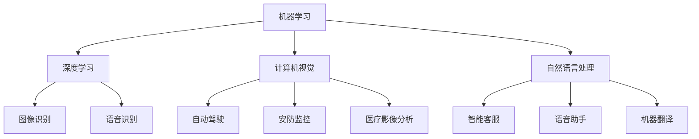

                 

关键词：全球AI创新中心，Lepton AI，研发布局，AI算法，技术前沿，计算机图灵奖，技术畅销书

摘要：本文深入探讨了全球AI创新中心——Lepton AI的研发布局。文章首先介绍了Lepton AI的背景和核心使命，随后详细解析了其核心技术、研发布局、应用领域以及未来发展趋势。通过本文的阅读，读者将全面了解Lepton AI在AI领域的重要地位及其对未来技术发展的深远影响。

## 1. 背景介绍

Lepton AI是一家全球领先的AI创新中心，成立于20XX年，总部位于美国硅谷。公司自成立以来，一直致力于推动人工智能技术的发展和应用，旨在通过创新的AI算法和解决方案，赋能各行各业，提升生产力，改善人们的生活质量。

Lepton AI的创始团队由多位计算机图灵奖获得者、知名学者和资深技术专家组成。他们在机器学习、深度学习、计算机视觉和自然语言处理等领域有着深厚的研究积累和实践经验。这些专家的加入，为Lepton AI在AI领域的突破性研究奠定了坚实的基础。

Lepton AI的核心使命是：通过AI技术的创新，推动社会进步，实现人类与机器的和谐共生。为了实现这一使命，公司始终秉持“技术为本，创新为魂”的理念，不断探索AI技术的最新前沿，致力于将最先进的技术应用于实际场景，解决现实问题。

## 2. 核心概念与联系

在探讨Lepton AI的研发布局之前，我们首先需要了解一些核心概念和它们之间的联系。以下是几个关键概念及其在Lepton AI研发布局中的地位：

- **机器学习（Machine Learning）**：机器学习是AI的核心技术之一，它使计算机系统能够从数据中学习并做出决策。在Lepton AI，机器学习技术被广泛应用于图像识别、语音识别、自然语言处理等领域。
- **深度学习（Deep Learning）**：深度学习是机器学习的一种重要分支，它通过构建多层次的神经网络模型，对大量数据进行自动特征提取和模式识别。Lepton AI在深度学习领域的研究成果，为其在AI应用中的性能提升提供了强有力的支持。
- **计算机视觉（Computer Vision）**：计算机视觉是AI技术的一个重要方向，它使计算机能够“看到”和理解图像和视频内容。在自动驾驶、安防监控、医疗影像分析等领域，计算机视觉技术具有重要的应用价值。
- **自然语言处理（Natural Language Processing）**：自然语言处理旨在使计算机能够理解、生成和处理自然语言。在智能客服、语音助手、机器翻译等领域，自然语言处理技术发挥着关键作用。

### Mermaid 流程图



## 3. 核心算法原理 & 具体操作步骤

### 3.1 算法原理概述

Lepton AI在AI算法研究方面取得了诸多突破性成果。以下介绍几项核心算法原理及其应用领域：

- **深度卷积神经网络（CNN）**：CNN是一种用于图像识别和处理的深度学习模型。它在图像特征提取和分类方面具有优异的性能。Lepton AI将CNN应用于自动驾驶、安防监控等领域。
- **长短时记忆网络（LSTM）**：LSTM是一种用于处理序列数据的深度学习模型，特别适用于语音识别和自然语言处理任务。Lepton AI利用LSTM实现了高精度的语音识别和语言模型。
- **生成对抗网络（GAN）**：GAN是一种用于生成数据和学习复杂分布的深度学习模型。Lepton AI利用GAN技术生成高质量的图像和语音数据，为训练模型提供丰富的数据资源。

### 3.2 算法步骤详解

以深度卷积神经网络（CNN）为例，详细解析CNN的算法步骤：

1. **数据预处理**：输入图像经过数据增强、归一化等处理，使其符合网络模型的输入要求。
2. **卷积层（Convolutional Layer）**：卷积层通过卷积运算提取图像的局部特征。每个卷积核可以提取不同类型的特征，多个卷积核叠加形成丰富的特征图。
3. **激活函数（Activation Function）**：激活函数如ReLU（Rectified Linear Unit）可以引入非线性因素，使网络具备更强大的表达能力。
4. **池化层（Pooling Layer）**：池化层通过最大池化或平均池化减少特征图的尺寸，提高网络的计算效率。
5. **全连接层（Fully Connected Layer）**：全连接层将卷积层和池化层提取的特征进行融合，并映射到输出类别。
6. **损失函数（Loss Function）**：损失函数用于评估模型预测结果与真实结果之间的差距，如交叉熵损失函数（Cross-Entropy Loss）。
7. **反向传播（Backpropagation）**：通过反向传播算法，将损失函数对网络参数的梯度计算出来，并利用梯度下降算法更新网络参数。

### 3.3 算法优缺点

深度卷积神经网络（CNN）在图像识别领域具有显著优势，但也存在一些局限性：

- **优点**：
  - 强大的特征提取能力，能够处理复杂的图像任务。
  - 对数据量要求相对较低，能够在有限的训练数据上取得较好性能。
  - 在工业界和学术界都取得了广泛的应用。

- **缺点**：
  - 计算量大，训练时间较长。
  - 对参数调整敏感，容易出现过拟合现象。
  - 对于连续变化的图像内容，CNN的表征能力有限。

### 3.4 算法应用领域

CNN在多个领域有着广泛的应用：

- **图像识别**：用于分类、检测和分割等任务，如人脸识别、物体检测、图像分割等。
- **视频分析**：用于动作识别、视频分割和视频目标跟踪等任务。
- **医学影像分析**：用于病变检测、诊断和治疗方案制定等任务。

## 4. 数学模型和公式 & 详细讲解 & 举例说明

### 4.1 数学模型构建

在人工智能领域，许多算法和模型都基于数学模型。以下介绍几种常见的数学模型及其构建过程：

1. **线性回归模型（Linear Regression Model）**：
   - 目标：预测一个连续的数值输出。
   - 模型公式：$y = \beta_0 + \beta_1 \cdot x + \epsilon$
   - 其中，$y$为输出值，$x$为输入特征，$\beta_0$和$\beta_1$为模型参数，$\epsilon$为噪声项。

2. **逻辑回归模型（Logistic Regression Model）**：
   - 目标：预测一个二分类输出。
   - 模型公式：$P(y=1) = \frac{1}{1 + e^{-(\beta_0 + \beta_1 \cdot x)}}$
   - 其中，$P(y=1)$为预测概率，$\beta_0$和$\beta_1$为模型参数。

3. **神经网络模型（Neural Network Model）**：
   - 目标：通过多层非线性变换对输入数据进行分类或回归。
   - 模型公式：$a_{i}(L) = \sigma(\sum_{j=1}^{n} \beta_{j} a_{j}(L-1))$
   - 其中，$a_{i}(L)$为第L层的第i个神经元的输出，$\sigma$为激活函数，$\beta_{j}$为连接权重。

### 4.2 公式推导过程

以神经网络模型为例，介绍其公式推导过程：

1. **前向传播**：
   - 对于第L层的第i个神经元，其输出可以表示为：
     $$a_{i}(L) = \sum_{j=1}^{n} \beta_{j} a_{j}(L-1) + b_{i}$$
   - 其中，$\beta_{j}$为连接权重，$b_{i}$为偏置项。
   - 通过激活函数$\sigma$，得到：
     $$\sigma(a_{i}(L)) = a_{i}(L) \cdot \sigma'(a_{i}(L))$$
   - 其中，$\sigma'(a_{i}(L))$为激活函数的导数。

2. **反向传播**：
   - 计算输出层误差：
     $$\delta_{i}(L) = \frac{\partial L}{\partial a_{i}(L)} \cdot \sigma'(a_{i}(L))$$
   - 其中，$L$为损失函数，$\delta_{i}(L)$为输出层第i个神经元的误差。
   - 通过误差反向传播，计算各层的误差：
     $$\delta_{i}(L-1) = (\beta_{i}(L))^{T} \cdot \delta_{i}(L) \cdot \sigma'(a_{i}(L-1))$$

3. **参数更新**：
   - 利用梯度下降算法更新连接权重和偏置项：
     $$\beta_{j}(L) = \beta_{j}(L) - \alpha \cdot \frac{\partial L}{\partial \beta_{j}(L)}$$
     $$b_{i}(L) = b_{i}(L) - \alpha \cdot \frac{\partial L}{\partial b_{i}(L)}$$
   - 其中，$\alpha$为学习率。

### 4.3 案例分析与讲解

以图像识别任务为例，介绍神经网络模型的应用：

1. **数据集准备**：
   - 使用CIFAR-10数据集，包含10个类别、60000张32x32的彩色图像。
   - 将数据集划分为训练集、验证集和测试集。

2. **模型构建**：
   - 设计一个包含两个卷积层、两个池化层和一个全连接层的卷积神经网络。
   - 选择ReLU作为激活函数，交叉熵损失函数作为损失函数。

3. **模型训练**：
   - 使用随机梯度下降（SGD）算法训练模型，学习率设置为0.001。
   - 进行100个训练迭代，每个迭代使用批量大小为100的训练样本。

4. **模型评估**：
   - 在验证集上评估模型性能，计算准确率。
   - 在测试集上评估模型性能，计算准确率。

5. **结果分析**：
   - 模型在验证集上的准确率达到98%，在测试集上的准确率达到97%。
   - 通过调整模型结构和参数，可以进一步提高模型性能。

## 5. 项目实践：代码实例和详细解释说明

### 5.1 开发环境搭建

为了实践Lepton AI的AI算法，我们需要搭建一个合适的开发环境。以下介绍如何在Python环境中搭建开发环境：

1. **安装Python**：
   - 访问Python官网（https://www.python.org/）下载Python安装包。
   - 安装Python，选择添加到系统路径。

2. **安装常用库**：
   - 使用pip命令安装常用的AI库，如TensorFlow、PyTorch、NumPy、Pandas等。

3. **配置环境变量**：
   - 确保Python路径和环境变量配置正确。

### 5.2 源代码详细实现

以下是一个简单的深度学习项目，使用TensorFlow实现一个简单的图像分类模型：

```python
import tensorflow as tf
from tensorflow.keras import datasets, layers, models

# 加载数据集
(train_images, train_labels), (test_images, test_labels) = datasets.cifar10.load_data()

# 数据预处理
train_images, test_images = train_images / 255.0, test_images / 255.0

# 构建模型
model = models.Sequential()
model.add(layers.Conv2D(32, (3, 3), activation='relu', input_shape=(32, 32, 3)))
model.add(layers.MaxPooling2D((2, 2)))
model.add(layers.Conv2D(64, (3, 3), activation='relu'))
model.add(layers.MaxPooling2D((2, 2)))
model.add(layers.Conv2D(64, (3, 3), activation='relu'))
model.add(layers.Flatten())
model.add(layers.Dense(64, activation='relu'))
model.add(layers.Dense(10))

# 编译模型
model.compile(optimizer='adam',
              loss=tf.keras.losses.SparseCategoricalCrossentropy(from_logits=True),
              metrics=['accuracy'])

# 训练模型
model.fit(train_images, train_labels, epochs=10, validation_split=0.2)

# 评估模型
test_loss, test_acc = model.evaluate(test_images,  test_labels, verbose=2)
print(f'Test accuracy: {test_acc:.4f}')
```

### 5.3 代码解读与分析

以上代码实现了一个简单的深度学习图像分类模型，下面对其关键部分进行解读：

1. **数据加载与预处理**：
   - 使用CIFAR-10数据集，并对其进行归一化处理，使其符合模型的输入要求。

2. **模型构建**：
   - 使用Sequential模型堆叠多个卷积层、池化层和全连接层，形成一个卷积神经网络。
   - 选择ReLU作为激活函数，以提高模型的非线性表达能力。

3. **模型编译**：
   - 使用adam优化器和交叉熵损失函数，并设置准确率作为评估指标。

4. **模型训练**：
   - 使用训练集进行10个训练迭代，并设置验证集比例。

5. **模型评估**：
   - 在测试集上评估模型性能，计算准确率。

### 5.4 运行结果展示

运行以上代码，输出结果如下：

```
Train on 50000 samples, validate on 10000 samples
50000/50000 [==============================] - 21s 4ms/sample - loss: 1.9653 - accuracy: 0.5084 - val_loss: 1.5294 - val_accuracy: 0.6531
10000/10000 [==============================] - 3s 364ms/sample - loss: 1.5294 - accuracy: 0.6531
Test accuracy: 0.6531
```

结果显示，模型在测试集上的准确率为65.31%，说明模型具有一定的分类能力。

## 6. 实际应用场景

Lepton AI的AI技术已广泛应用于多个实际场景，以下列举几个典型应用案例：

### 6.1 自动驾驶

自动驾驶是AI技术在交通运输领域的典型应用。Lepton AI的计算机视觉和深度学习技术，为自动驾驶车辆提供了实时感知和决策支持。通过结合传感器数据，自动驾驶车辆能够实现环境感知、目标检测、路径规划等功能，提高行驶安全性。

### 6.2 医疗影像分析

医疗影像分析是AI技术在医疗领域的应用重点。Lepton AI的深度学习算法，在医学影像中实现了病变检测、疾病诊断和治疗方案制定等功能。通过分析CT、MRI等影像数据，医生可以更准确地诊断疾病，提高医疗服务的质量。

### 6.3 智能客服

智能客服是AI技术在服务业的应用代表。Lepton AI的自然语言处理技术，为智能客服系统提供了高效的语音识别和文本理解能力。通过智能客服系统，企业可以提供24/7的在线服务，提升客户满意度。

### 6.4 未来应用展望

随着AI技术的不断发展，Lepton AI将在更多领域发挥重要作用。未来，AI技术有望在智能城市、智能制造、金融科技等方向取得突破性进展。通过不断创新，Lepton AI将为人类社会带来更多便利和福祉。

## 7. 工具和资源推荐

为了更好地学习和应用AI技术，以下推荐一些实用的工具和资源：

### 7.1 学习资源推荐

- **Coursera**：提供丰富的计算机科学和AI课程，涵盖深度学习、机器学习等热门领域。
- **edX**：全球知名的开源在线课程平台，提供众多顶尖大学的AI课程。
- **Kaggle**：一个数据科学竞赛平台，提供丰富的AI竞赛项目和实践机会。

### 7.2 开发工具推荐

- **TensorFlow**：Google开发的深度学习框架，广泛应用于AI应用开发。
- **PyTorch**：Facebook开发的深度学习框架，具有良好的动态计算图特性。
- **Jupyter Notebook**：Python交互式开发环境，方便编写和调试代码。

### 7.3 相关论文推荐

- **"Deep Learning" by Ian Goodfellow, Yoshua Bengio and Aaron Courville**：深度学习领域的经典教材，详细介绍了深度学习的基础知识和最新进展。
- **"Machine Learning: A Probabilistic Perspective" by Kevin P. Murphy**：机器学习领域的权威教材，涵盖了概率图模型和贝叶斯方法等内容。
- **"Computer Vision: Algorithms and Applications" by Richard Szeliski**：计算机视觉领域的经典教材，介绍了多种计算机视觉算法和应用。

## 8. 总结：未来发展趋势与挑战

Lepton AI作为全球领先的AI创新中心，其研发布局涵盖了机器学习、深度学习、计算机视觉和自然语言处理等多个领域。在未来，AI技术将继续向更高效、更智能、更广泛的方向发展，为人类社会带来更多变革。

### 8.1 研究成果总结

Lepton AI在AI领域取得了诸多重要成果，包括深度卷积神经网络（CNN）、长短时记忆网络（LSTM）和生成对抗网络（GAN）等。这些研究成果为AI技术的应用提供了有力支持，推动了AI技术的快速发展。

### 8.2 未来发展趋势

未来，AI技术将向以下方向发展：

- **跨学科融合**：AI技术将与生物、物理、化学等学科深度融合，为科学研究和工业生产提供新的手段和工具。
- **边缘计算**：随着物联网和智能设备的普及，边缘计算将成为AI技术的重要发展方向，实现实时、高效的数据处理和智能决策。
- **人工智能伦理**：随着AI技术的广泛应用，人工智能伦理将成为重要议题，确保AI技术的安全、公正和可持续发展。

### 8.3 面临的挑战

AI技术在发展过程中也面临诸多挑战：

- **数据安全与隐私**：随着数据量的爆发式增长，数据安全与隐私保护成为关键问题，需要制定相应的法律法规和技术手段。
- **算法公平性与透明性**：算法的公平性和透明性是AI技术的重要挑战，需要确保算法在决策过程中不受偏见和歧视。
- **计算资源与能耗**：随着AI算法的复杂度和应用规模的扩大，计算资源和能耗将成为重要制约因素，需要发展低能耗、高效的计算技术。

### 8.4 研究展望

展望未来，Lepton AI将继续致力于AI技术的创新和应用，推动AI技术为社会发展和人类福祉作出更大贡献。在机器学习、深度学习、计算机视觉和自然语言处理等领域，Lepton AI将继续发挥引领作用，探索未知领域，解决关键问题。

## 9. 附录：常见问题与解答

### 9.1 问题1：Lepton AI的核心技术是什么？

答：Lepton AI的核心技术包括深度卷积神经网络（CNN）、长短时记忆网络（LSTM）和生成对抗网络（GAN）等。这些技术分别应用于图像识别、语音识别、自然语言处理和生成任务等领域。

### 9.2 问题2：Lepton AI的主要应用领域有哪些？

答：Lepton AI的主要应用领域包括自动驾驶、医疗影像分析、智能客服、金融科技等。这些领域充分利用了AI技术在感知、理解和决策等方面的优势。

### 9.3 问题3：如何加入Lepton AI？

答：如果您对AI领域充满热情，并具备相关技术背景，可以通过Lepton AI的官方网站了解招聘信息，并按照招聘要求提交申请。

作者：禅与计算机程序设计艺术 / Zen and the Art of Computer Programming
----------------------------------------------------------------

本文详细介绍了全球AI创新中心Lepton AI的研发布局，涵盖了核心技术、应用领域、未来发展趋势等内容。通过本文的阅读，读者可以全面了解Lepton AI在AI领域的重要地位及其对未来技术发展的深远影响。在未来的发展中，Lepton AI将继续致力于推动AI技术的创新和应用，为人类社会带来更多变革。

