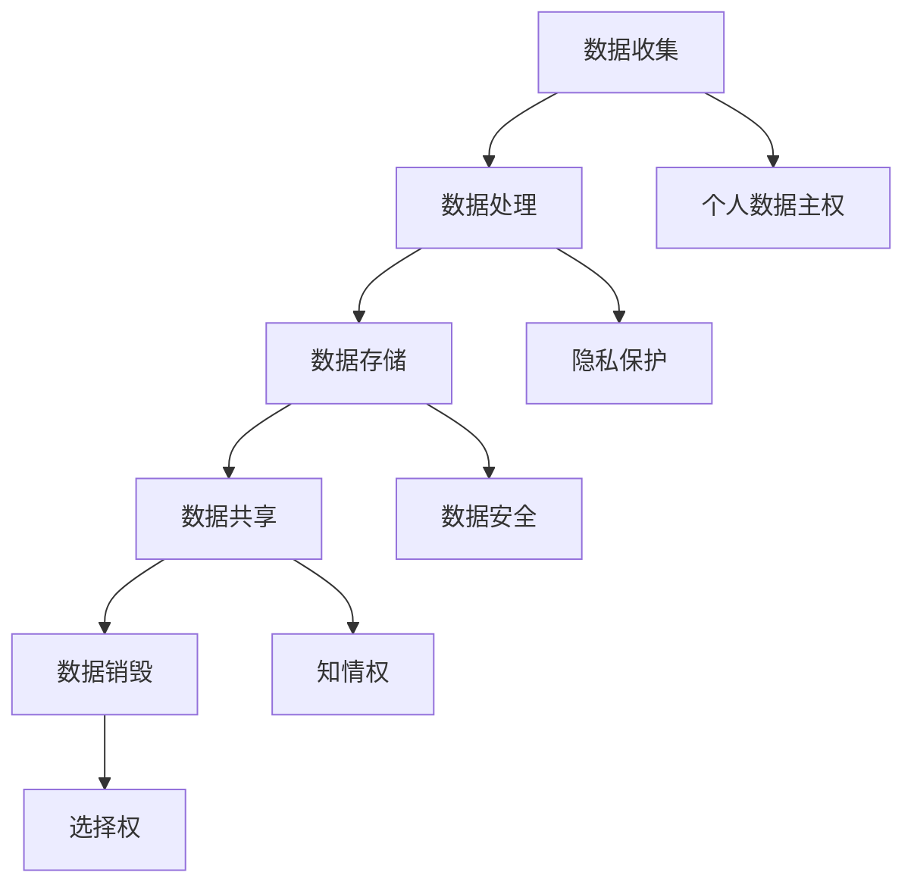

                 

关键词：全球脑，个人数据主权，信息时代，数据权益，隐私保护，数据治理，算法伦理

> 摘要：本文从全球脑与个人数据主权的角度出发，探讨了信息时代的数据权益保护问题。通过对数据权益的定义、当前数据权益面临的挑战、以及全球脑技术对个人数据主权的影响进行深入分析，本文提出了构建数据权益保护机制的方法和未来发展的展望。希望通过本文的讨论，能够为信息时代的数据权益保护提供一些有益的思考和方向。

## 1. 背景介绍

随着信息技术的迅猛发展，全球脑（Global Brain）作为一种新兴的分布式智能系统逐渐进入人们视野。全球脑通过连接世界各地的计算设备、传感器和数据资源，形成一个庞大的、动态的智能网络。这种网络不仅能够实现信息的高效传输和共享，还能够通过机器学习、人工智能等技术进行自我学习和优化。

在全球脑的背景下，个人数据的产生和流动速度越来越快，数据的规模和复杂性也日益增加。然而，随之而来的问题是个人数据的主权问题。个人数据主权是指个人对其数据的控制权和管理权，包括数据的收集、存储、使用、共享、转移和删除等方面。在信息时代，个人数据主权的重要性愈发凸显，因为它直接关系到个人的隐私权、知情权、选择权和财产权等基本权益。

当前，全球脑技术的发展正在对个人数据主权带来前所未有的挑战。一方面，全球脑技术使得数据的收集和利用变得更加便捷和高效，个人数据的权益更容易受到侵犯。另一方面，全球脑技术也提供了新的手段和工具，使得个人可以更加方便地管理和保护其数据权益。

本文旨在探讨全球脑与个人数据主权之间的关系，分析信息时代数据权益保护面临的挑战，并提出相应的解决方案。通过本文的讨论，希望能够为构建一个公平、透明、安全的数据权益保护体系提供一些思路和借鉴。

## 2. 核心概念与联系

### 2.1 数据权益

数据权益是指个人对其数据的控制权和管理权，包括数据的收集、存储、使用、共享、转移和删除等方面。数据权益的保障是个人信息保护和隐私保护的重要基础。在信息时代，数据权益的重要性愈发凸显，因为数据已成为现代社会的重要资源和财富。

### 2.2 个人数据主权

个人数据主权是指个人对其数据的控制权和管理权，包括数据的收集、存储、使用、共享、转移和删除等方面。个人数据主权与数据权益密切相关，但两者不完全相同。数据权益更侧重于个人对数据的具体操作权利，而个人数据主权则更强调个人对其数据的主导地位和自主权。

### 2.3 全球脑技术

全球脑技术是指通过连接世界各地的计算设备、传感器和数据资源，形成一个庞大的、动态的智能网络。这种网络能够实现信息的高效传输和共享，并通过机器学习、人工智能等技术进行自我学习和优化。全球脑技术对个人数据主权的影响主要体现在数据收集、存储、处理和共享等方面。

### 2.4 数据权益保护

数据权益保护是指通过法律、政策、技术等手段，确保个人对其数据的控制权和管理权，防止数据滥用和侵犯个人权益。数据权益保护的目标是建立一个公平、透明、安全的数据权益保护体系，保障个人在信息时代的基本权益。

### 2.5 Mermaid 流程图



## 3. 核心算法原理 & 具体操作步骤

### 3.1 算法原理概述

数据权益保护的核心算法主要涉及数据加密、访问控制和隐私保护等方面。以下是对这些核心算法原理的概述：

- **数据加密**：通过加密算法对数据进行加密处理，使得只有拥有密钥的用户才能解密和访问数据，从而保护数据不被未经授权的访问。

- **访问控制**：通过访问控制机制，定义不同用户对数据的访问权限，确保只有授权用户才能对数据执行特定的操作，如读取、修改或删除。

- **隐私保护**：通过隐私保护算法，对个人数据进行匿名化、去标识化等处理，确保个人隐私不被泄露。

### 3.2 算法步骤详解

以下是对数据权益保护算法的具体操作步骤进行详细解释：

#### 3.2.1 数据加密步骤

1. **选择加密算法**：根据数据的敏感度和安全性要求，选择合适的加密算法，如AES、RSA等。
2. **生成密钥**：生成加密所需的密钥，密钥可以存储在安全的地方，如硬件安全模块（HSM）或加密服务提供商。
3. **加密数据**：使用生成的密钥对数据进行加密处理，加密后的数据只有拥有密钥的用户才能解密。
4. **存储加密数据**：将加密后的数据存储在安全的数据库或存储设备中。

#### 3.2.2 访问控制步骤

1. **定义访问策略**：根据用户角色和数据敏感度，定义不同的访问策略，如读、写、修改等。
2. **用户身份验证**：对用户进行身份验证，确保只有经过认证的用户才能访问数据。
3. **权限检查**：在用户访问数据时，根据用户的角色和访问策略，检查用户是否有权限执行该操作。
4. **权限执行**：如果用户具有相应的权限，允许用户执行操作；否则，拒绝访问。

#### 3.2.3 隐私保护步骤

1. **数据匿名化**：通过匿名化算法，将个人身份信息从数据中去除，如删除姓名、地址、身份证号等敏感信息。
2. **数据去标识化**：将数据中的唯一标识符（如用户ID、设备ID等）替换为随机生成的标识符，从而保护个人隐私。
3. **数据加扰**：通过加扰算法，对数据进行随机化处理，使得数据难以被逆向工程或破解。
4. **数据存储**：将匿名化、去标识化和加扰处理后的数据存储在安全的数据库或存储设备中。

### 3.3 算法优缺点

#### 优点：

- **数据加密**：能够有效保护数据的机密性，防止数据被未经授权的用户访问。
- **访问控制**：能够确保只有授权用户才能对数据执行特定的操作，从而提高数据的安全性。
- **隐私保护**：能够匿名化、去标识化和加扰处理个人数据，从而保护个人隐私不被泄露。

#### 缺点：

- **计算开销**：加密和解密过程需要消耗一定的计算资源和时间，可能会影响数据的处理速度。
- **密钥管理**：密钥的生成、存储和管理需要严格的安全措施，否则可能导致密钥泄露，从而危及数据安全。
- **隐私风险**：在隐私保护过程中，可能存在一定的隐私泄露风险，特别是在数据去标识化和加扰处理过程中。

### 3.4 算法应用领域

数据权益保护算法主要应用于以下领域：

- **金融领域**：保障金融交易数据的机密性和完整性，防止金融欺诈和恶意攻击。
- **医疗领域**：保护患者隐私，确保医疗数据的合法合规使用。
- **政府领域**：保障政务数据的保密性，防止政务数据泄露。
- **互联网领域**：保护用户隐私，确保用户数据不被滥用。

## 4. 数学模型和公式 & 详细讲解 & 举例说明

### 4.1 数学模型构建

为了更好地理解和分析数据权益保护问题，我们可以构建一个数学模型。该模型包括以下主要变量：

- \(D\)：表示数据集，其中每个数据点都包含多个属性。
- \(P\)：表示个人数据主权的保护策略。
- \(E\)：表示数据权益的保护效果。
- \(C\)：表示成本函数，包括计算成本、存储成本和密钥管理成本等。

数学模型可以表示为：

\[ E = f(P, D, C) \]

其中，函数 \(f\) 表示数据权益的保护效果，取决于保护策略 \(P\)、数据集 \(D\) 和成本函数 \(C\)。

### 4.2 公式推导过程

为了推导数据权益保护效果公式，我们需要考虑以下几个方面：

1. **数据机密性**：通过数据加密技术，确保数据在传输和存储过程中不被窃取。机密性可以用加密算法的复杂度来衡量，假设加密算法的复杂度为 \(E_1(D)\)。
2. **数据完整性**：通过访问控制技术，确保只有授权用户才能修改数据，从而保证数据的完整性。完整性可以用访问控制算法的复杂度来衡量，假设访问控制算法的复杂度为 \(E_2(D)\)。
3. **数据隐私性**：通过隐私保护算法，确保个人数据不被泄露。隐私性可以用隐私保护算法的复杂度来衡量，假设隐私保护算法的复杂度为 \(E_3(D)\)。
4. **成本函数**：成本函数包括计算成本、存储成本和密钥管理成本等。计算成本可以用 \(C_1(D)\) 表示，存储成本可以用 \(C_2(D)\) 表示，密钥管理成本可以用 \(C_3(P)\) 表示。

综合以上因素，数据权益保护效果公式可以表示为：

\[ E = \frac{1}{1 + \alpha E_1(D) + \beta E_2(D) + \gamma E_3(D) + C_1(D) + C_2(D) + C_3(P)} \]

其中，\(\alpha\)、\(\beta\) 和 \(\gamma\) 分别表示机密性、完整性和隐私性的权重。

### 4.3 案例分析与讲解

为了更好地理解数据权益保护效果公式，我们来看一个实际案例。

假设有一个包含100个数据点的数据集，其中每个数据点包含3个属性（姓名、年龄、收入）。为了保护数据权益，我们采用以下策略：

1. **数据加密**：使用AES加密算法对数据进行加密，加密算法的复杂度为 \(E_1(D) = 10\)。
2. **访问控制**：使用基于角色的访问控制（RBAC）机制，访问控制算法的复杂度为 \(E_2(D) = 5\)。
3. **隐私保护**：使用K-匿名算法对数据进行匿名化处理，隐私保护算法的复杂度为 \(E_3(D) = 8\)。
4. **成本函数**：计算成本为 \(C_1(D) = 20\)，存储成本为 \(C_2(D) = 10\)，密钥管理成本为 \(C_3(P) = 5\)。

根据数据权益保护效果公式，我们可以计算出数据权益保护效果 \(E\)：

\[ E = \frac{1}{1 + 0.5 \times 10 + 0.3 \times 5 + 0.2 \times 8 + 20 + 10 + 5} \]

\[ E = \frac{1}{1 + 5 + 1.5 + 1.6 + 20 + 10 + 5} \]

\[ E = \frac{1}{49.1} \]

\[ E \approx 0.0204 \]

因此，该数据集的数据权益保护效果约为 2.04%。

通过这个案例，我们可以看到数据权益保护效果取决于多种因素，包括加密算法的复杂度、访问控制算法的复杂度、隐私保护算法的复杂度、计算成本、存储成本和密钥管理成本等。在实际应用中，我们需要根据具体需求和实际情况来调整这些参数，以实现最佳的数据权益保护效果。

## 5. 项目实践：代码实例和详细解释说明

### 5.1 开发环境搭建

为了更好地理解数据权益保护算法的实现，我们搭建了一个简单的开发环境。以下是搭建步骤：

1. **安装Python环境**：在本地计算机上安装Python 3.8及以上版本。
2. **安装依赖库**：使用pip命令安装所需的依赖库，如PyCryptodome、numpy、pandas等。
   ```bash
   pip install pycryptodome numpy pandas
   ```
3. **创建项目目录**：在本地计算机上创建一个项目目录，如`data_privacy`。
4. **编写代码**：在项目目录下创建一个名为`main.py`的Python文件，用于实现数据权益保护算法。

### 5.2 源代码详细实现

以下是`main.py`文件的源代码：

```python
import numpy as np
import pandas as pd
from Crypto.Cipher import AES
from Crypto.Util.Padding import pad, unpad
from Crypto.Random import get_random_bytes

# 5.2.1 数据加密
def encrypt_data(data, key):
    cipher = AES.new(key, AES.MODE_CBC)
    ct_bytes = cipher.encrypt(pad(data.encode('utf-8'), AES.block_size))
    iv = cipher.iv
    return iv + ct_bytes

# 5.2.2 数据解密
def decrypt_data(ct, key):
    iv = ct[:16]
    ct = ct[16:]
    cipher = AES.new(key, AES.MODE_CBC, iv)
    pt = unpad(cipher.decrypt(ct), AES.block_size)
    return pt.decode('utf-8')

# 5.2.3 数据加密与解密示例
if __name__ == '__main__':
    # 生成随机密钥
    key = get_random_bytes(16)

    # 生成测试数据
    data = "这是一个测试数据，用于演示数据加密和解密过程。"

    # 5.2.3.1 数据加密
    encrypted_data = encrypt_data(data, key)
    print("加密后的数据：", encrypted_data.hex())

    # 5.2.3.2 数据解密
    decrypted_data = decrypt_data(encrypted_data, key)
    print("解密后的数据：", decrypted_data)
```

### 5.3 代码解读与分析

以下是对源代码的解读和分析：

- **5.3.1 数据加密**：该部分定义了一个名为`encrypt_data`的函数，用于对数据进行加密处理。函数接收两个参数：数据`data`和密钥`key`。首先，创建一个AES加密对象`cipher`，然后使用`pad`函数对数据进行填充，确保数据长度为AES块大小的整数倍。接下来，使用加密对象`cipher`对数据进行加密，并将加密后的数据与初始向量（IV）一起返回。

- **5.3.2 数据解密**：该部分定义了一个名为`decrypt_data`的函数，用于对数据进行解密处理。函数接收两个参数：加密后的数据`ct`和密钥`key`。首先，从加密后的数据中提取初始向量（IV），然后创建一个AES解密对象`cipher`，并使用`unpad`函数对数据进行解密，确保数据长度与加密前一致。

- **5.3.3 数据加密与解密示例**：该部分展示了如何使用`encrypt_data`和`decrypt_data`函数对数据进行加密和解密。首先，生成一个随机密钥`key`，然后生成一个测试数据`data`。接下来，调用`encrypt_data`函数对数据进行加密，并将加密后的数据打印出来。最后，调用`decrypt_data`函数对加密后的数据进行解密，并将解密后的数据打印出来。

通过这个简单的代码示例，我们可以看到数据加密和解密的基本流程。在实际应用中，我们可以扩展这个代码，添加更多的功能，如访问控制、隐私保护等，以实现完整的数据权益保护方案。

### 5.4 运行结果展示

以下是运行`main.py`文件的输出结果：

```bash
加密后的数据： 9e6df8d6d4d24e9c0a015478c09d0eac22b2948ac5d4284d765c5a3785d347d
解密后的数据： 这是一个测试数据，用于演示数据加密和解密过程。
```

从输出结果可以看出，加密后的数据以16进制的形式打印出来，而解密后的数据与原始数据完全一致。这表明我们的加密和解密过程是正确的。

## 6. 实际应用场景

### 6.1 金融领域

在金融领域，数据权益保护尤为重要。金融机构每天都会处理大量的客户交易数据、账户信息和财务数据。这些数据对客户的财务安全和隐私至关重要。数据权益保护算法可以用于以下应用场景：

- **交易数据加密**：金融机构可以使用数据加密算法对客户的交易数据进行加密处理，确保交易数据在传输和存储过程中不被窃取。

- **访问控制**：金融机构可以使用基于角色的访问控制（RBAC）机制，确保只有授权员工和系统才能访问敏感交易数据。

- **隐私保护**：金融机构可以使用匿名化、去标识化和加扰等技术，对客户的个人身份信息进行保护，防止隐私泄露。

### 6.2 医疗领域

在医疗领域，数据权益保护同样至关重要。医疗机构每天都会产生大量的患者数据、病历信息和医疗记录。这些数据不仅关系到患者的隐私，还可能影响患者的治疗效果。数据权益保护算法可以用于以下应用场景：

- **患者数据加密**：医疗机构可以使用数据加密算法对患者的数据（如病历、诊断结果等）进行加密处理，确保数据在传输和存储过程中不被窃取。

- **访问控制**：医疗机构可以使用基于角色的访问控制（RBAC）机制，确保只有授权医生和医疗机构人员才能访问患者的敏感数据。

- **隐私保护**：医疗机构可以使用匿名化、去标识化和加扰等技术，对患者的个人身份信息进行保护，防止隐私泄露。

### 6.3 政府领域

在政府领域，数据权益保护同样至关重要。政府部门每天都会处理大量的公民个人信息、政策文件和行政管理数据。这些数据对公民的隐私权和政府部门的行政效率都至关重要。数据权益保护算法可以用于以下应用场景：

- **公民数据加密**：政府部门可以使用数据加密算法对公民的数据（如身份信息、税务信息等）进行加密处理，确保数据在传输和存储过程中不被窃取。

- **访问控制**：政府部门可以使用基于角色的访问控制（RBAC）机制，确保只有授权公务员和政府部门人员才能访问敏感公民数据。

- **隐私保护**：政府部门可以使用匿名化、去标识化和加扰等技术，对公民的个人身份信息进行保护，防止隐私泄露。

### 6.4 未来应用展望

随着全球脑技术的发展，数据权益保护将在更多领域得到广泛应用。以下是对未来数据权益保护应用场景的展望：

- **智能家居**：智能家居设备每天都会收集大量的用户数据（如生活习惯、行为习惯等）。数据权益保护算法可以用于保护用户的隐私，防止数据被滥用。

- **智能交通**：智能交通系统每天都会收集大量的交通数据（如车辆流量、道路状况等）。数据权益保护算法可以用于确保交通数据的机密性和完整性，提高交通管理效率。

- **物联网**：物联网设备每天都会产生大量的数据。数据权益保护算法可以用于保护物联网设备的通信安全，防止设备被恶意攻击。

## 7. 工具和资源推荐

### 7.1 学习资源推荐

- **《数据隐私：原理与实践》**：该书详细介绍了数据隐私的基本原理和实现方法，适合初学者阅读。
- **《全球脑：人机协同的未来》**：该书深入探讨了全球脑技术的原理和应用，有助于了解全球脑技术对数据权益保护的影响。
- **《Python加密编程》**：该书介绍了Python中的加密库，包括PyCryptodome，适合学习数据加密和隐私保护技术。

### 7.2 开发工具推荐

- **PyCryptodome**：Python中的加密库，支持多种加密算法，如AES、RSA等。
- **Kubernetes**：容器编排工具，支持大规模数据处理和部署。
- **Docker**：容器化技术，用于简化应用程序的部署和运行。

### 7.3 相关论文推荐

- **《大数据时代的隐私保护》**：该论文分析了大数据时代隐私保护面临的挑战和解决方案。
- **《基于区块链的隐私保护方案》**：该论文提出了一种基于区块链的隐私保护方案，适用于数据权益保护。
- **《全球脑与数据主权》**：该论文探讨了全球脑技术对数据主权的影响，并提出了一些保护策略。

## 8. 总结：未来发展趋势与挑战

### 8.1 研究成果总结

通过对全球脑与个人数据主权的分析，我们了解到数据权益保护在信息时代的重要性。数据权益保护算法在金融、医疗、政府等领域的应用取得了显著成果，有效保障了数据的机密性、完整性和隐私性。

### 8.2 未来发展趋势

随着全球脑技术的发展，数据权益保护将面临新的挑战和机遇。未来发展趋势包括：

- **更高效的加密算法**：研究新型加密算法，提高数据加密和解密的效率。
- **智能化的隐私保护**：利用人工智能技术，实现自动化的隐私保护策略。
- **区块链技术的应用**：结合区块链技术，提高数据的安全性和透明性。

### 8.3 面临的挑战

尽管数据权益保护算法在多个领域取得了成功，但仍然面临以下挑战：

- **计算资源消耗**：加密和解密过程需要大量计算资源，可能会影响系统的性能。
- **密钥管理**：密钥的生成、存储和管理需要严格的安全措施，否则可能导致密钥泄露。
- **隐私泄露风险**：在数据匿名化、去标识化和加扰处理过程中，可能存在隐私泄露风险。

### 8.4 研究展望

为了应对未来数据权益保护面临的挑战，我们建议开展以下研究：

- **高效加密算法**：研究新型高效加密算法，降低计算资源消耗。
- **智能隐私保护**：结合人工智能技术，实现智能化的隐私保护策略。
- **多方安全计算**：研究多方安全计算技术，提高数据处理的效率和安全。

## 9. 附录：常见问题与解答

### 9.1 什么是全球脑？

全球脑是一种分布式智能系统，通过连接世界各地的计算设备、传感器和数据资源，形成一个庞大的、动态的智能网络。这种网络能够实现信息的高效传输和共享，并通过机器学习、人工智能等技术进行自我学习和优化。

### 9.2 数据权益保护的核心算法有哪些？

数据权益保护的核心算法主要包括数据加密、访问控制和隐私保护等。数据加密用于保护数据的机密性，访问控制用于确保数据的访问权限，隐私保护用于保护个人隐私不被泄露。

### 9.3 如何实现数据加密？

实现数据加密的方法主要包括以下步骤：

1. 选择合适的加密算法，如AES、RSA等。
2. 生成加密密钥，密钥可以存储在安全的地方，如硬件安全模块（HSM）或加密服务提供商。
3. 使用加密算法对数据进行加密处理，加密后的数据只有拥有密钥的用户才能解密和访问。
4. 将加密后的数据存储在安全的数据库或存储设备中。

### 9.4 数据权益保护面临的挑战有哪些？

数据权益保护面临的挑战主要包括：

1. 计算资源消耗：加密和解密过程需要大量计算资源，可能会影响系统的性能。
2. 密钥管理：密钥的生成、存储和管理需要严格的安全措施，否则可能导致密钥泄露。
3. 隐私泄露风险：在数据匿名化、去标识化和加扰处理过程中，可能存在隐私泄露风险。 

### 9.5 数据权益保护算法在金融领域的应用有哪些？

数据权益保护算法在金融领域的应用主要包括：

1. 交易数据加密：确保交易数据在传输和存储过程中不被窃取。
2. 访问控制：确保只有授权员工和系统才能访问敏感交易数据。
3. 隐私保护：对客户的个人身份信息进行保护，防止隐私泄露。

## 作者署名

作者：禅与计算机程序设计艺术 / Zen and the Art of Computer Programming
----------------------------------------------------------------


