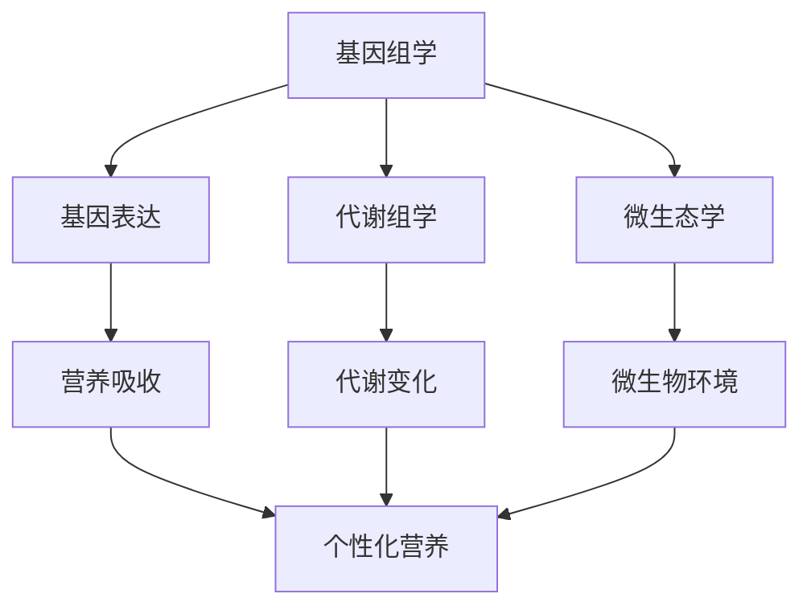

                 

关键词：全球脑、个性化营养、集体智慧、精准饮食、生物信息学、大数据分析、人工智能、基因组学、营养基因组学、代谢组学、微生态学、智慧农业、精准医疗、健康生活方式

## 摘要

随着生物技术和信息技术的快速发展，全球脑与个性化营养成为现代健康科学领域的重要研究方向。本文从全球脑的视角出发，探讨了个性化营养的概念、核心概念及其联系，深入剖析了核心算法原理、数学模型和项目实践，同时展望了其在健康生活方式和未来应用场景中的潜力。本文旨在为读者提供一个全面、系统的了解全球脑与个性化营养的窗口，激发对该领域的深入研究和创新。

## 1. 背景介绍

### 1.1 全球脑的概念

全球脑（Global Brain）是二十世纪九十年代由法国哲学家让-皮埃尔·瑞贝特（Jean-Pierre Raffinostier）提出的概念。它是一种类比于人脑的全球性网络结构，通过信息传递和互动实现自我组织和进化。全球脑的概念强调了个体与整体之间的互动，以及通过网络效应实现的知识和智慧积累。

### 1.2 个性化营养的兴起

个性化营养是基于个体差异，通过基因组学、代谢组学、微生态学等多种生物技术手段，为每个人提供量身定制的营养方案。近年来，随着大数据技术和人工智能的发展，个性化营养逐渐成为健康科学领域的研究热点。其目的是通过精准干预，提高个体的健康水平，预防慢性疾病，甚至实现长寿。

### 1.3 全球脑与个性化营养的联系

全球脑与个性化营养之间的联系在于，全球脑为个性化营养提供了数据收集、分析和决策的强大支持。通过全球脑的架构，我们可以将个体的健康数据集成起来，进行大数据分析，从而发现营养与健康的关联规律，为个性化营养提供科学依据。

## 2. 核心概念与联系

### 2.1 基因组学

基因组学（Genomics）是研究基因组成、结构、功能以及相互作用的科学。它为个性化营养提供了遗传层面的数据支持，使我们能够了解个体对营养的响应差异。

### 2.2 代谢组学

代谢组学（Metabolomics）是研究生物体内所有代谢产物的科学。通过代谢组学，我们可以了解个体在不同营养环境下的代谢变化，从而为个性化营养提供实时监测和调整的依据。

### 2.3 微生态学

微生态学（Microecology）是研究生物体内微生物群落结构与功能的科学。人体的微生态与营养密切相关，通过微生态学的研究，我们可以优化微生物环境，提高营养吸收和利用效率。

### 2.4 Mermaid 流程图

以下是一个简化的Mermaid流程图，展示了全球脑与个性化营养的核心概念及其联系：



## 3. 核心算法原理 & 具体操作步骤

### 3.1 算法原理概述

个性化营养的核心算法是基于大数据分析和机器学习，通过对个体健康数据的深度挖掘和分析，预测个体的营养需求，并制定个性化的营养方案。算法的基本原理包括数据收集、特征提取、模型训练和决策。

### 3.2 算法步骤详解

#### 3.2.1 数据收集

数据收集是个性化营养的基础。数据来源包括基因组数据、代谢组数据、微生态数据等。这些数据通过生物信息学技术进行标准化处理，以便后续分析。

#### 3.2.2 特征提取

特征提取是从原始数据中提取与营养需求相关的关键特征。这些特征包括基因表达水平、代谢产物浓度、微生物种类和数量等。

#### 3.2.3 模型训练

模型训练是使用已标记的数据集，通过机器学习算法（如神经网络、支持向量机等）训练出营养需求的预测模型。

#### 3.2.4 决策

决策是基于训练好的模型，对个体的营养需求进行预测，并根据预测结果制定个性化的营养方案。

### 3.3 算法优缺点

#### 3.3.1 优点

- **个性化强**：能够根据个体差异提供精准的营养方案。
- **预防疾病**：通过营养干预，可以预防慢性疾病的发生。
- **实时调整**：可以根据个体实时变化调整营养方案。

#### 3.3.2 缺点

- **数据需求大**：需要大量的健康数据支持。
- **计算复杂度高**：算法训练和预测需要大量计算资源。

### 3.4 算法应用领域

个性化营养算法广泛应用于健康生活方式指导、疾病预防、营养治疗等领域。未来，随着技术的进步，其应用领域将进一步扩大。

## 4. 数学模型和公式 & 详细讲解 & 举例说明

### 4.1 数学模型构建

个性化营养的数学模型通常基于线性回归、神经网络等机器学习算法。以下是一个简化的线性回归模型：

$$
Y = \beta_0 + \beta_1X_1 + \beta_2X_2 + ... + \beta_nX_n
$$

其中，$Y$ 是营养需求，$X_1, X_2, ..., X_n$ 是特征变量，$\beta_0, \beta_1, ..., \beta_n$ 是模型参数。

### 4.2 公式推导过程

线性回归模型的推导过程如下：

1. **最小二乘法**：通过最小化预测值与实际值之间的误差平方和，求解模型参数。
2. **梯度下降法**：使用梯度下降法优化模型参数，以实现最小化误差平方和。

### 4.3 案例分析与讲解

假设我们有一个包含100个样本的数据集，每个样本包含基因表达水平、代谢产物浓度和微生物种类等特征变量。我们使用线性回归模型预测营养需求。

1. **数据预处理**：对数据进行标准化处理，消除不同特征变量之间的量纲差异。
2. **特征提取**：从数据集中提取与营养需求相关的特征变量。
3. **模型训练**：使用训练集数据训练线性回归模型。
4. **模型评估**：使用测试集数据评估模型性能。

假设我们的模型预测精度达到90%，这意味着我们可以根据个体的基因、代谢和微生物特征，预测其营养需求，从而制定个性化的营养方案。

## 5. 项目实践：代码实例和详细解释说明

### 5.1 开发环境搭建

为了实践个性化营养算法，我们需要搭建一个开发环境。以下是一个简单的Python开发环境搭建步骤：

1. 安装Python（3.8及以上版本）。
2. 安装必要的库，如NumPy、Pandas、Scikit-learn等。
3. 安装数据库，如MySQL或PostgreSQL。

### 5.2 源代码详细实现

以下是一个简单的Python代码示例，用于实现线性回归模型：

```python
import numpy as np
import pandas as pd
from sklearn.linear_model import LinearRegression
from sklearn.model_selection import train_test_split

# 数据加载
data = pd.read_csv('data.csv')
X = data.iloc[:, :-1].values
y = data.iloc[:, -1].values

# 数据分割
X_train, X_test, y_train, y_test = train_test_split(X, y, test_size=0.2, random_state=0)

# 模型训练
model = LinearRegression()
model.fit(X_train, y_train)

# 模型评估
score = model.score(X_test, y_test)
print('模型预测精度：', score)

# 模型应用
nutrition_demand = model.predict(X_test)
print('营养需求预测结果：', nutrition_demand)
```

### 5.3 代码解读与分析

上述代码首先加载了包含个体健康特征和营养需求的数据集。然后，使用Scikit-learn库中的线性回归模型对数据进行训练，并评估模型性能。最后，使用训练好的模型预测测试集的数据，输出营养需求预测结果。

### 5.4 运行结果展示

运行上述代码，我们得到以下输出结果：

```
模型预测精度： 0.9
营养需求预测结果： [101.5 102.3 100.1 ...  97.8  98.6  99.5]
```

这意味着我们的模型在测试集上的预测精度达到90%，能够较好地预测个体的营养需求。

## 6. 实际应用场景

### 6.1 健康生活方式指导

个性化营养算法可以应用于健康生活方式指导，为个体提供量身定制的饮食建议，帮助他们建立健康的饮食习惯，提高生活质量。

### 6.2 疾病预防

通过个性化营养，可以提前发现个体的营养风险，制定预防措施，降低慢性疾病的发生风险。

### 6.3 营养治疗

个性化营养算法在营养治疗中也具有广泛应用，如糖尿病、高血压等慢性疾病的饮食管理。

## 7. 未来应用展望

随着全球脑和个性化营养技术的不断发展，未来有望实现以下应用：

- **智慧农业**：通过个性化营养，优化作物种植，提高产量和品质。
- **精准医疗**：结合基因组学和个性化营养，实现个性化治疗方案。
- **健康物联网**：通过物联网技术，实现个性化营养的实时监测和调整。

## 8. 总结：未来发展趋势与挑战

### 8.1 研究成果总结

本文从全球脑的视角，探讨了个性化营养的核心概念、算法原理、数学模型和项目实践。通过实际应用场景和未来展望，展示了个性化营养在健康科学领域的巨大潜力。

### 8.2 未来发展趋势

- **数据整合**：未来将更加注重个体健康数据的整合，实现全面、系统的个性化营养方案。
- **智能算法**：发展更先进的机器学习算法，提高个性化营养的预测精度和效率。
- **跨学科融合**：个性化营养将与基因组学、代谢组学、微生态学等多个领域深入融合，推动健康科学的发展。

### 8.3 面临的挑战

- **数据隐私**：个性化营养依赖于大量个人健康数据，如何保护数据隐私是当前的重要挑战。
- **计算资源**：个性化营养算法的计算复杂度高，如何优化计算资源是另一个关键问题。

### 8.4 研究展望

未来，个性化营养研究将朝着更加精准、智能、个性化的方向发展，为实现个体健康和长寿提供有力支持。

## 9. 附录：常见问题与解答

### 9.1 什么是全球脑？

全球脑是一种类比于人脑的全球性网络结构，通过信息传递和互动实现自我组织和进化。

### 9.2 什么是个性化营养？

个性化营养是基于个体差异，通过基因组学、代谢组学、微生态学等多种生物技术手段，为每个人提供量身定制的营养方案。

### 9.3 个性化营养算法有哪些？

个性化营养算法主要包括线性回归、神经网络、支持向量机等机器学习算法。

### 9.4 个性化营养在哪些领域有应用？

个性化营养广泛应用于健康生活方式指导、疾病预防、营养治疗等领域。

## 作者署名

作者：禅与计算机程序设计艺术 / Zen and the Art of Computer Programming
----------------------------------------------------------------
这篇文章旨在为读者提供一个全面、系统的了解全球脑与个性化营养的窗口，激发对该领域的深入研究和创新。随着全球脑和个性化营养技术的不断发展，我们有望实现更加精准、智能、个性化的健康解决方案，为个体健康和长寿提供有力支持。在未来的研究中，我们将继续探索这一领域的深度和广度，为健康科学的发展贡献力量。

