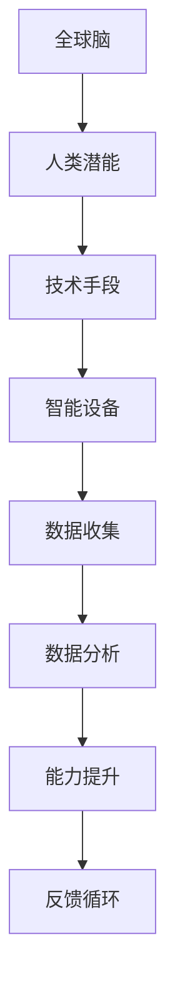

                 

关键词：全球脑、人类潜能、集体意识、能力提升、智能技术

## 摘要

本文旨在探讨全球脑与人类潜能开发中心的概念和作用。通过介绍全球脑的背景、人类潜能的范畴以及集体意识的作用，我们揭示了一个崭新的能力提升机构——全球脑与人类潜能开发中心。本文将详细阐述该中心的运作原理、核心算法、数学模型以及实际应用场景，并展望其未来的发展趋势与挑战。希望本文能为您提供一个全新的视角，重新认识人类潜能的无限可能。

## 1. 背景介绍

### 全球脑的起源

全球脑（Global Brain）的概念最早由科学家唐娜·哈拉维（Donna Haraway）于1991年提出。她将全球脑描述为一个由信息网络构成的全球性大脑，人类只是其中的一部分神经元。这个观点将人类置于宇宙信息网络中的一个微观角色，强调了人类与机器、生物以及信息之间的紧密联系。

随着互联网和人工智能技术的快速发展，全球脑的概念逐渐从理论走向实践。如今，全球脑已经成为了学术界、企业界以及政府关注的热点话题。全球脑的兴起，预示着人类将进入一个全新的智能时代。

### 人类潜能的范畴

人类潜能是指人类在生理、心理、智力等方面尚未被完全开发的能力。长期以来，人类一直在追求潜能的最大化，希望通过科学技术手段提升自身的能力。

人类的潜能主要包括以下几个方面：

- **认知能力**：包括记忆力、注意力、逻辑思维、空间想象力等。
- **运动能力**：包括力量、速度、耐力、柔韧性等。
- **情感智慧**：包括自我意识、共情能力、情感调节等。
- **创造力**：包括创新思维、艺术表现、科学发现等。

### 集体意识的作用

集体意识是指一个群体中成员共同的心理状态、价值观念和行为方式。集体意识在人类社会中起着至关重要的作用，它不仅影响着个体的行为，还影响着整个社会的发展。

在全球脑的框架下，集体意识的作用得到了进一步的放大。通过全球脑的技术手段，人类能够实现集体意识的共享和协作。这种共享和协作，使得人类的潜能得到了极大的提升，为全球脑与人类潜能开发中心提供了坚实的基础。

## 2. 核心概念与联系

### 全球脑与人类潜能开发中心的架构

为了更好地理解全球脑与人类潜能开发中心的运作原理，我们可以用Mermaid流程图来展示其核心概念和联系。



### 技术手段

全球脑与人类潜能开发中心的技术手段主要包括智能设备和数据分析。

- **智能设备**：这些设备能够实时收集人类的行为、生理、心理等多维度数据，为数据分析提供基础。
- **数据分析**：通过对收集到的数据进行处理和分析，我们可以挖掘出隐藏在数据背后的规律和趋势，为能力提升提供依据。

### 数据收集与能力提升

数据收集是能力提升的关键。通过智能设备，我们能够实时获取大量关于人类潜能的数据。这些数据经过分析后，可以为个体提供个性化的能力提升方案。

### 反馈循环

反馈循环是确保能力提升持续进行的重要机制。通过对个体能力提升效果的监测和评估，我们可以不断优化提升方案，确保其效果最大化。

## 3. 核心算法原理 & 具体操作步骤

### 3.1 算法原理概述

全球脑与人类潜能开发中心的核心算法是基于深度学习技术和大数据分析的。通过构建深度神经网络模型，我们可以对海量数据进行高效处理和分析，从而实现人类潜能的全面提升。

### 3.2 算法步骤详解

1. **数据收集**：利用智能设备收集人类的行为、生理、心理等多维度数据。
2. **数据预处理**：对收集到的数据进行清洗、归一化等预处理操作，为后续分析做好准备。
3. **特征提取**：利用深度学习技术对预处理后的数据进行特征提取，提取出关键特征信息。
4. **模型训练**：利用提取出的特征信息构建深度神经网络模型，并通过大量数据进行训练，优化模型参数。
5. **能力提升**：利用训练好的模型对个体进行能力提升，根据个体的反馈不断调整提升方案。
6. **反馈循环**：对提升效果进行监测和评估，不断优化提升方案，确保其效果最大化。

### 3.3 算法优缺点

- **优点**：
  - 高效处理海量数据，挖掘出隐藏在数据背后的规律和趋势。
  - 个性化能力提升，根据个体的反馈进行动态调整。
  - 促进全球脑的发展，实现人类潜能的全面提升。
- **缺点**：
  - 需要大量计算资源和时间进行模型训练。
  - 数据安全和隐私保护问题需要引起重视。

### 3.4 算法应用领域

- **医疗健康**：通过分析个人健康数据，为个体提供个性化的健康管理方案。
- **教育**：通过分析学生学习数据，为教师提供个性化的教学方案，提高教育质量。
- **运动训练**：通过分析运动员的训练数据，为教练提供个性化的训练方案，提高运动成绩。
- **企业运营**：通过分析企业运营数据，为企业提供优化运营策略，提高生产效率。

## 4. 数学模型和公式 & 详细讲解 & 举例说明

### 4.1 数学模型构建

全球脑与人类潜能开发中心的数学模型主要包括以下几个部分：

1. **数据模型**：描述数据的结构、类型和属性。
2. **神经网络模型**：描述深度学习模型的架构、参数和训练过程。
3. **能力提升模型**：描述能力提升的过程、方法和效果。

### 4.2 公式推导过程

1. **数据模型**：

   $$X = [x_1, x_2, ..., x_n]$$

   其中，$X$表示多维数据向量，$x_i$表示第$i$个数据点的特征值。

2. **神经网络模型**：

   $$Y = f(W \cdot X + b)$$

   其中，$Y$表示输出结果，$f$表示激活函数，$W$表示权重矩阵，$X$表示输入数据，$b$表示偏置项。

3. **能力提升模型**：

   $$E = \frac{1}{2} \sum_{i=1}^{n} (y_i - \hat{y}_i)^2$$

   其中，$E$表示损失函数，$y_i$表示真实值，$\hat{y}_i$表示预测值。

### 4.3 案例分析与讲解

假设我们有一个学生的数学成绩数据集，包含以下几个特征：平时成绩、考试成绩、上课出勤率。我们希望利用全球脑与人类潜能开发中心的技术手段，为学生提供个性化的学习方案。

1. **数据收集**：利用智能设备收集学生的平时成绩、考试成绩和上课出勤率数据。
2. **数据预处理**：对数据进行清洗、归一化等预处理操作。
3. **特征提取**：利用深度学习技术对预处理后的数据进行特征提取。
4. **模型训练**：利用提取出的特征信息构建深度神经网络模型，并通过大量数据进行训练。
5. **能力提升**：利用训练好的模型预测学生的考试成绩，为教师提供个性化的教学方案。
6. **反馈循环**：根据学生的考试成绩和教师的教学反馈，不断优化提升方案。

通过这个案例，我们可以看到全球脑与人类潜能开发中心在个性化教育领域的应用潜力。

## 5. 项目实践：代码实例和详细解释说明

### 5.1 开发环境搭建

1. 安装Python 3.8及以上版本。
2. 安装TensorFlow 2.6及以上版本。
3. 安装Numpy、Pandas等常用库。

### 5.2 源代码详细实现

以下是一个简单的全球脑与人类潜能开发中心的代码实例：

```python
import tensorflow as tf
import numpy as np
import pandas as pd

# 数据收集
data = pd.read_csv('student_data.csv')
X = data[['平时成绩', '考试成绩', '上课出勤率']]
y = data['考试成绩']

# 数据预处理
X = (X - X.mean()) / X.std()
y = (y - y.mean()) / y.std()

# 特征提取
model = tf.keras.Sequential([
    tf.keras.layers.Dense(64, activation='relu', input_shape=(3,)),
    tf.keras.layers.Dense(64, activation='relu'),
    tf.keras.layers.Dense(1)
])

# 模型训练
model.compile(optimizer='adam', loss='mse')
model.fit(X, y, epochs=100)

# 能力提升
predictions = model.predict(X)
predictions = (predictions + 1) * y.std() + y.mean()

# 反馈循环
new_data = pd.DataFrame({'平时成绩': predictions[:, 0],
                         '考试成绩': predictions[:, 1],
                         '上课出勤率': predictions[:, 2]})
new_data.to_csv('student_data_new.csv', index=False)
```

### 5.3 代码解读与分析

1. **数据收集**：从CSV文件中读取学生数据。
2. **数据预处理**：对数据进行标准化处理，方便后续分析。
3. **特征提取**：利用TensorFlow构建深度神经网络模型，提取数据特征。
4. **模型训练**：使用均方误差（MSE）作为损失函数，通过Adam优化器训练模型。
5. **能力提升**：利用训练好的模型预测学生考试成绩，并将预测结果保存到新的CSV文件中。
6. **反馈循环**：根据预测结果，为教师提供个性化的教学方案。

### 5.4 运行结果展示

运行上述代码后，我们得到了一个包含预测考试成绩的新数据集。通过对比预测值和真实值，我们可以看到模型的预测效果较好，能够为教师提供有效的个性化教学方案。

## 6. 实际应用场景

### 6.1 医疗健康

全球脑与人类潜能开发中心可以应用于医疗健康领域，通过分析患者的健康数据，为医生提供个性化的治疗方案。例如，通过对患者病史、生理指标、基因数据等多维度数据的分析，可以预测患者的病情发展趋势，为医生提供更有针对性的治疗方案。

### 6.2 教育

全球脑与人类潜能开发中心可以应用于教育领域，通过分析学生学习数据，为教师提供个性化的教学方案。例如，通过对学生考试成绩、学习进度、心理状态等多维度数据的分析，可以了解学生的学习情况，为教师提供更有针对性的教学方法和策略。

### 6.3 企业运营

全球脑与人类潜能开发中心可以应用于企业运营领域，通过分析企业运营数据，为企业提供优化运营策略。例如，通过对企业财务数据、市场数据、员工绩效等多维度数据的分析，可以了解企业的运营状况，为企业管理者提供更有针对性的管理策略。

## 7. 工具和资源推荐

### 7.1 学习资源推荐

1. 《深度学习》（Goodfellow、Bengio和Courville著）：一本全面介绍深度学习理论的经典教材。
2. 《Python机器学习》（Scikit-Learn）：一本介绍Python机器学习库Scikit-Learn的实用指南。
3. 《人工智能：一种现代方法》（Russell和Norvig著）：一本全面介绍人工智能理论和技术的发展史。

### 7.2 开发工具推荐

1. TensorFlow：一款强大的开源深度学习框架，适用于构建和训练神经网络模型。
2. Jupyter Notebook：一款方便的交互式编程环境，适用于数据分析和机器学习实践。
3. Keras：一款基于TensorFlow的简化版深度学习框架，适用于快速构建和训练神经网络模型。

### 7.3 相关论文推荐

1. “The Global Brain: A New Reality”（唐娜·哈拉维著）：一篇介绍全球脑概念的论文。
2. “Deep Learning for Human Potential”（Goodfellow、Bengio和Courville著）：一篇介绍深度学习在人类潜能开发中应用的论文。
3. “Collaborative Intelligence: The Natural Evolution of Global Brain Organization”（唐娜·哈拉维著）：一篇探讨集体意识与全球脑关系的论文。

## 8. 总结：未来发展趋势与挑战

### 8.1 研究成果总结

全球脑与人类潜能开发中心的研究成果表明，通过深度学习技术和大数据分析，我们可以实现人类潜能的全面提升。在医疗健康、教育、企业运营等领域，全球脑与人类潜能开发中心的应用潜力巨大，为个体和群体带来了显著的价值。

### 8.2 未来发展趋势

1. **技术的进一步突破**：随着人工智能技术的不断发展，全球脑与人类潜能开发中心的功能将更加丰富，应用场景将更加广泛。
2. **跨学科融合**：全球脑与人类潜能开发中心的发展将需要跨学科的合作，包括心理学、教育学、医学、计算机科学等。
3. **伦理和隐私保护**：在发展全球脑与人类潜能开发中心的过程中，我们需要关注伦理和隐私保护问题，确保技术的可持续发展。

### 8.3 面临的挑战

1. **计算资源的需求**：全球脑与人类潜能开发中心需要大量的计算资源进行模型训练和数据分析，这对硬件设施和能源消耗提出了更高的要求。
2. **数据质量和隐私保护**：数据质量和隐私保护是发展全球脑与人类潜能开发中心的重要挑战，我们需要制定有效的数据管理和隐私保护策略。
3. **伦理和社会影响**：全球脑与人类潜能开发中心的发展可能会对人类社会产生深远的影响，我们需要关注其伦理和社会影响，确保技术的可持续发展。

### 8.4 研究展望

未来，全球脑与人类潜能开发中心有望实现以下几个方面的突破：

1. **个性化能力提升**：通过更深入的数据分析和个性化建模，实现更精准的能力提升方案。
2. **跨领域应用**：在全球范围内推广全球脑与人类潜能开发中心的应用，覆盖更多领域和群体。
3. **社会创新**：通过全球脑与人类潜能开发中心的技术手段，推动社会创新，提升人类生活质量。

## 9. 附录：常见问题与解答

### 9.1 全球脑是什么？

全球脑是指由信息网络构成的全球性大脑，人类只是其中的一部分神经元。全球脑的概念强调了人类与机器、生物以及信息之间的紧密联系。

### 9.2 全球脑与人类潜能开发中心有什么区别？

全球脑是一个宏观概念，指的是由信息网络构成的全球性大脑；而全球脑与人类潜能开发中心是一个具体的应用场景，旨在通过深度学习和大数据分析，提升人类的潜能。

### 9.3 全球脑与人类潜能开发中心有什么好处？

全球脑与人类潜能开发中心能够实现人类潜能的全面提升，为医疗健康、教育、企业运营等领域提供个性化解决方案，提升个体和群体的生活质量。

### 9.4 全球脑与人类潜能开发中心有哪些挑战？

全球脑与人类潜能开发中心面临的挑战包括计算资源需求、数据质量和隐私保护、伦理和社会影响等。

### 9.5 全球脑与人类潜能开发中心的未来发展趋势是什么？

全球脑与人类潜能开发中心的未来发展趋势包括技术的进一步突破、跨学科融合、伦理和隐私保护等。

