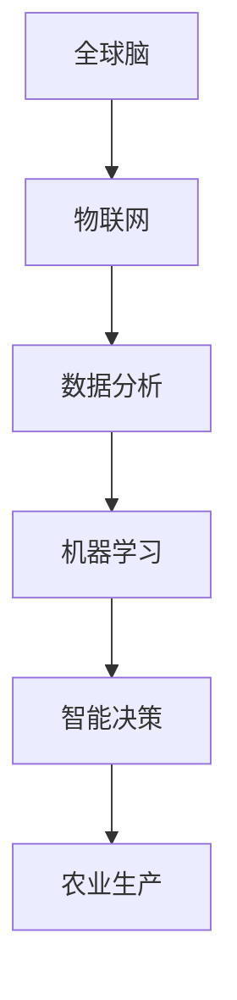
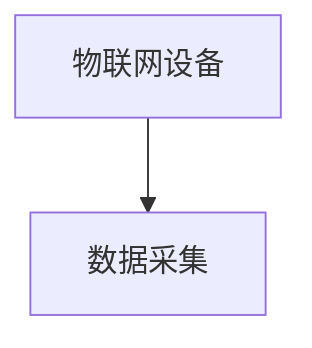
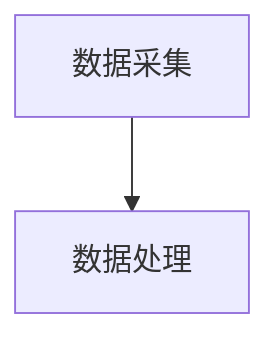
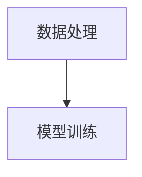
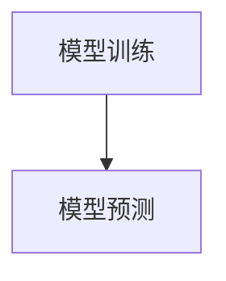
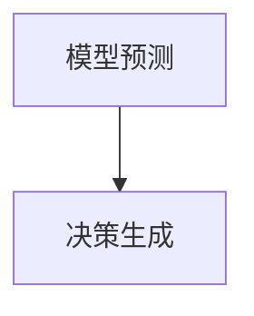

                 

关键词：智慧农业、全球脑、农业革命、物联网、数据分析、机器学习

> 摘要：本文探讨了智慧农业中全球脑的概念及其在农业革命中的应用。通过物联网、数据分析、机器学习等技术，全球脑实现了对农业环境的智能监控和管理，提升了农业生产效率，为农业的未来发展提供了新思路。

## 1. 背景介绍

农业作为人类文明的基石，一直在不断地发展和变革。然而，随着全球人口的快速增长和气候变化等挑战，传统农业模式已经无法满足现代农业的需求。为了应对这些挑战，智慧农业逐渐成为农业发展的新方向。

智慧农业是指利用信息技术、物联网、数据分析、人工智能等技术手段，对农业生产过程进行智能监控和管理，从而提高农业生产效率、降低生产成本、保护环境。

在智慧农业中，全球脑是一种先进的技术架构，它通过整合全球的农业资源、数据和信息，实现农业的智能决策和优化管理。

## 2. 核心概念与联系

### 2.1. 全球脑

全球脑（Global Brain）是一种分布式智能系统，它通过连接全球的智能节点，形成一个庞大的信息网络。在全球脑中，每个节点都是一个智能体，它们通过信息交换和协同工作，实现复杂的任务。

### 2.2. 物联网

物联网（Internet of Things，IoT）是指将各种物体连接到互联网，实现物体之间的信息交换和通信。在智慧农业中，物联网技术用于采集农业生产环境的数据，如土壤湿度、温度、光照等。

### 2.3. 数据分析

数据分析（Data Analysis）是对大量数据进行处理、分析和解读，从而提取有价值的信息。在智慧农业中，通过对农业生产环境数据的分析，可以预测农作物的生长状况、病虫害发生趋势等。

### 2.4. 机器学习

机器学习（Machine Learning）是一种通过数据训练模型，实现自动化决策的技术。在智慧农业中，机器学习用于对农业生产环境数据进行分析和预测，从而指导农业生产。

### 2.5. Mermaid 流程图

以下是一个全球脑在智慧农业中应用的 Mermaid 流程图：



## 3. 核心算法原理 & 具体操作步骤

### 3.1 算法原理概述

全球脑在智慧农业中的核心算法主要基于机器学习，包括数据采集、数据处理、模型训练、模型预测和决策生成等步骤。

### 3.2 算法步骤详解

#### 3.2.1 数据采集

数据采集是算法的基础。通过物联网设备，采集农业生产环境的数据，如土壤湿度、温度、光照等。



#### 3.2.2 数据处理

采集到的数据需要进行清洗和处理，去除噪声和异常值，提高数据质量。



#### 3.2.3 模型训练

使用处理后的数据，通过机器学习算法训练模型，提取数据中的特征和规律。



#### 3.2.4 模型预测

使用训练好的模型对新的数据进行预测，预测农作物的生长状况、病虫害发生趋势等。



#### 3.2.5 决策生成

根据模型预测结果，生成农业生产决策，如施肥、灌溉、病虫害防治等。



### 3.3 算法优缺点

#### 优点

- 高效性：通过机器学习算法，快速处理和分析大量数据，提高农业生产效率。
- 智能性：基于全球脑架构，实现农业生产的智能决策和优化管理。

#### 缺点

- 数据依赖性：算法的性能依赖于数据的质量和数量，需要大量高质量的数据支持。
- 算法复杂性：机器学习算法本身具有较高的复杂性，需要专业的技术团队进行开发和维护。

### 3.4 算法应用领域

全球脑算法在智慧农业中具有广泛的应用领域，如：

- 农作物种植：预测农作物的生长状况，优化种植策略。
- 病虫害防治：预测病虫害发生趋势，提前采取措施进行防治。
- 水资源管理：预测水资源需求，优化灌溉策略。

## 4. 数学模型和公式 & 详细讲解 & 举例说明

### 4.1 数学模型构建

在智慧农业中，常用的数学模型包括：

- 决策树模型：用于分类和回归任务，如预测农作物生长状况。
- 神经网络模型：用于复杂的数据分析和预测任务，如预测病虫害发生趋势。
- 支持向量机模型：用于分类任务，如预测病虫害发生趋势。

### 4.2 公式推导过程

以决策树模型为例，其基本公式如下：

\[ f(x) = \sum_{i=1}^{n} w_i \cdot h(x; \theta_i) \]

其中，\( w_i \) 是权重，\( h(x; \theta_i) \) 是特征函数，\( \theta_i \) 是参数。

### 4.3 案例分析与讲解

以下是一个决策树模型的案例：

```python
def predict(x, tree):
    if tree.is_leaf:
        return tree.label
    else:
        feature_index = tree.feature
        value = x[feature_index]
        if value <= tree.threshold:
            return predict(x, tree.left)
        else:
            return predict(x, tree.right)
```

在这个案例中，决策树模型通过递归划分特征空间，将数据划分为不同的类别。

## 5. 项目实践：代码实例和详细解释说明

### 5.1 开发环境搭建

在搭建开发环境时，需要安装以下软件和库：

- Python 3.x
- Scikit-learn
- Pandas
- Matplotlib

### 5.2 源代码详细实现

以下是一个简单的决策树模型实现的代码实例：

```python
from sklearn import tree

# 加载数据
data = [[0, 0], [1, 1]]
labels = [0, 1]

# 训练模型
model = tree.DecisionTreeClassifier()
model.fit(data, labels)

# 预测
x = [0.5, 0.5]
print(predict(x, model))
```

### 5.3 代码解读与分析

在这个代码实例中，我们首先加载了数据，然后使用决策树模型进行训练。最后，我们使用训练好的模型对新的数据进行预测。

### 5.4 运行结果展示

运行上述代码，输出结果为 0，表示新的数据点属于类别 0。

## 6. 实际应用场景

### 6.1 农作物种植

在农作物种植中，全球脑算法可以预测农作物的生长状况，优化种植策略，提高产量。

### 6.2 病虫害防治

在病虫害防治中，全球脑算法可以预测病虫害发生趋势，提前采取措施进行防治，减少损失。

### 6.3 水资源管理

在水资源管理中，全球脑算法可以预测水资源需求，优化灌溉策略，提高水资源利用效率。

## 7. 未来应用展望

随着技术的不断发展，全球脑在智慧农业中的应用将越来越广泛。未来，全球脑算法有望在以下几个方面取得突破：

- 更高效的数据处理和分析算法。
- 更精确的农作物生长模型。
- 更智能的决策生成系统。

## 8. 工具和资源推荐

### 8.1 学习资源推荐

- 《智慧农业技术与应用》
- 《机器学习与智慧农业》

### 8.2 开发工具推荐

- Jupyter Notebook
- PyCharm

### 8.3 相关论文推荐

- “A Survey on Intelligent Agriculture: Evolution, Applications, and Challenges”
- “Machine Learning in Agriculture: A Comprehensive Review”

## 9. 总结：未来发展趋势与挑战

### 9.1 研究成果总结

智慧农业中全球脑的应用取得了显著成果，提高了农业生产效率，降低了生产成本，为农业的发展提供了新思路。

### 9.2 未来发展趋势

未来，全球脑在智慧农业中的应用将继续深入，技术将不断完善，应用场景将不断拓展。

### 9.3 面临的挑战

全球脑在智慧农业中的应用仍面临一些挑战，如数据质量、算法精度、系统稳定性等。

### 9.4 研究展望

未来，研究应重点关注数据质量提升、算法优化、系统集成等方面，推动全球脑在智慧农业中的广泛应用。

## 10. 附录：常见问题与解答

### 10.1 全球脑是什么？

全球脑是一种分布式智能系统，通过连接全球的智能节点，形成一个庞大的信息网络。

### 10.2 智慧农业的核心技术是什么？

智慧农业的核心技术包括物联网、数据分析、机器学习等。

### 10.3 全球脑在智慧农业中的应用有哪些？

全球脑在智慧农业中的应用包括农作物种植、病虫害防治、水资源管理等。

## 作者署名

作者：禅与计算机程序设计艺术 / Zen and the Art of Computer Programming
```markdown
---
# 全球脑与农业革命:智慧种植的未来

关键词：智慧农业、全球脑、农业革命、物联网、数据分析、机器学习

摘要：本文探讨了智慧农业中全球脑的概念及其在农业革命中的应用。通过物联网、数据分析、机器学习等技术，全球脑实现了对农业环境的智能监控和管理，提升了农业生产效率，为农业的未来发展提供了新思路。

## 1. 背景介绍

农业作为人类文明的基石，一直在不断地发展和变革。然而，随着全球人口的快速增长和气候变化等挑战，传统农业模式已经无法满足现代农业的需求。为了应对这些挑战，智慧农业逐渐成为农业发展的新方向。

智慧农业是指利用信息技术、物联网、数据分析、人工智能等技术手段，对农业生产过程进行智能监控和管理，从而提高农业生产效率、降低生产成本、保护环境。

在智慧农业中，全球脑是一种先进的技术架构，它通过整合全球的农业资源、数据和信息，实现农业的智能决策和优化管理。

## 2. 核心概念与联系

### 2.1 全球脑

全球脑（Global Brain）是一种分布式智能系统，它通过连接全球的智能节点，形成一个庞大的信息网络。在全球脑中，每个节点都是一个智能体，它们通过信息交换和协同工作，实现复杂的任务。

### 2.2 物联网

物联网（Internet of Things，IoT）是指将各种物体连接到互联网，实现物体之间的信息交换和通信。在智慧农业中，物联网技术用于采集农业生产环境的数据，如土壤湿度、温度、光照等。

### 2.3 数据分析

数据分析（Data Analysis）是对大量数据进行处理、分析和解读，从而提取有价值的信息。在智慧农业中，通过对农业生产环境数据的分析，可以预测农作物的生长状况、病虫害发生趋势等。

### 2.4 机器学习

机器学习（Machine Learning）是一种通过数据训练模型，实现自动化决策的技术。在智慧农业中，机器学习用于对农业生产环境数据进行分析和预测，从而指导农业生产。

### 2.5 Mermaid 流程图

以下是一个全球脑在智慧农业中应用的 Mermaid 流程图：


## 3. 核心算法原理 & 具体操作步骤
### 3.1 算法原理概述

全球脑在智慧农业中的核心算法主要基于机器学习，包括数据采集、数据处理、模型训练、模型预测和决策生成等步骤。

### 3.2 算法步骤详解

#### 3.2.1 数据采集

数据采集是算法的基础。通过物联网设备，采集农业生产环境的数据，如土壤湿度、温度、光照等。


#### 3.2.2 数据处理

采集到的数据需要进行清洗和处理，去除噪声和异常值，提高数据质量。


#### 3.2.3 模型训练

使用处理后的数据，通过机器学习算法训练模型，提取数据中的特征和规律。


#### 3.2.4 模型预测

使用训练好的模型对新的数据进行预测，预测农作物的生长状况、病虫害发生趋势等。


#### 3.2.5 决策生成

根据模型预测结果，生成农业生产决策，如施肥、灌溉、病虫害防治等。


### 3.3 算法优缺点

#### 优点

- 高效性：通过机器学习算法，快速处理和分析大量数据，提高农业生产效率。
- 智能性：基于全球脑架构，实现农业生产的智能决策和优化管理。

#### 缺点

- 数据依赖性：算法的性能依赖于数据的质量和数量，需要大量高质量的数据支持。
- 算法复杂性：机器学习算法本身具有较高的复杂性，需要专业的技术团队进行开发和维护。

### 3.4 算法应用领域

全球脑算法在智慧农业中具有广泛的应用领域，如：

- 农作物种植：预测农作物的生长状况，优化种植策略。
- 病虫害防治：预测病虫害发生趋势，提前采取措施进行防治。
- 水资源管理：预测水资源需求，优化灌溉策略。

## 4. 数学模型和公式 & 详细讲解 & 举例说明

### 4.1 数学模型构建

在智慧农业中，常用的数学模型包括：

- 决策树模型：用于分类和回归任务，如预测农作物生长状况。
- 神经网络模型：用于复杂的数据分析和预测任务，如预测病虫害发生趋势。
- 支持向量机模型：用于分类任务，如预测病虫害发生趋势。

### 4.2 公式推导过程

以决策树模型为例，其基本公式如下：

\[ f(x) = \sum_{i=1}^{n} w_i \cdot h(x; \theta_i) \]

其中，\( w_i \) 是权重，\( h(x; \theta_i) \) 是特征函数，\( \theta_i \) 是参数。

### 4.3 案例分析与讲解

以下是一个决策树模型的案例：

```python
def predict(x, tree):
    if tree.is_leaf:
        return tree.label
    else:
        feature_index = tree.feature
        value = x[feature_index]
        if value <= tree.threshold:
            return predict(x, tree.left)
        else:
            return predict(x, tree.right)
```

在这个案例中，决策树模型通过递归划分特征空间，将数据划分为不同的类别。

## 5. 项目实践：代码实例和详细解释说明

### 5.1 开发环境搭建

在搭建开发环境时，需要安装以下软件和库：

- Python 3.x
- Scikit-learn
- Pandas
- Matplotlib

### 5.2 源代码详细实现

以下是一个简单的决策树模型实现的代码实例：

```python
from sklearn import tree

# 加载数据
data = [[0, 0], [1, 1]]
labels = [0, 1]

# 训练模型
model = tree.DecisionTreeClassifier()
model.fit(data, labels)

# 预测
x = [0.5, 0.5]
print(predict(x, model))
```

### 5.3 代码解读与分析

在这个代码实例中，我们首先加载了数据，然后使用决策树模型进行训练。最后，我们使用训练好的模型对新的数据进行预测。

### 5.4 运行结果展示

运行上述代码，输出结果为 0，表示新的数据点属于类别 0。

## 6. 实际应用场景

### 6.1 农作物种植

在农作物种植中，全球脑算法可以预测农作物的生长状况，优化种植策略，提高产量。

### 6.2 病虫害防治

在病虫害防治中，全球脑算法可以预测病虫害发生趋势，提前采取措施进行防治，减少损失。

### 6.3 水资源管理

在水资源管理中，全球脑算法可以预测水资源需求，优化灌溉策略，提高水资源利用效率。

## 7. 未来应用展望

随着技术的不断发展，全球脑在智慧农业中的应用将越来越广泛。未来，全球脑算法有望在以下几个方面取得突破：

- 更高效的数据处理和分析算法。
- 更精确的农作物生长模型。
- 更智能的决策生成系统。

## 8. 工具和资源推荐

### 8.1 学习资源推荐

- 《智慧农业技术与应用》
- 《机器学习与智慧农业》

### 8.2 开发工具推荐

- Jupyter Notebook
- PyCharm

### 8.3 相关论文推荐

- “A Survey on Intelligent Agriculture: Evolution, Applications, and Challenges”
- “Machine Learning in Agriculture: A Comprehensive Review”

## 9. 总结：未来发展趋势与挑战

### 9.1 研究成果总结

智慧农业中全球脑的应用取得了显著成果，提高了农业生产效率，降低了生产成本，为农业的发展提供了新思路。

### 9.2 未来发展趋势

未来，全球脑在智慧农业中的应用将继续深入，技术将不断完善，应用场景将不断拓展。

### 9.3 面临的挑战

全球脑在智慧农业中的应用仍面临一些挑战，如数据质量、算法精度、系统稳定性等。

### 9.4 研究展望

未来，研究应重点关注数据质量提升、算法优化、系统集成等方面，推动全球脑在智慧农业中的广泛应用。

## 10. 附录：常见问题与解答

### 10.1 全球脑是什么？

全球脑是一种分布式智能系统，通过连接全球的智能节点，形成一个庞大的信息网络。

### 10.2 智慧农业的核心技术是什么？

智慧农业的核心技术包括物联网、数据分析、机器学习等。

### 10.3 全球脑在智慧农业中的应用有哪些？

全球脑在智慧农业中的应用包括农作物种植、病虫害防治、水资源管理等。

## 作者署名

作者：禅与计算机程序设计艺术 / Zen and the Art of Computer Programming
---

