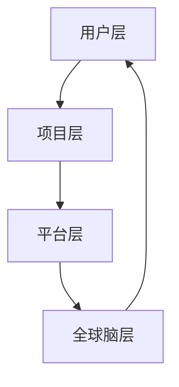

                 

关键词：全球脑、创意众筹、集体创新、神经网络、AI技术、开放平台

> 摘要：本文探讨了全球脑与创意众筹相结合的新模式，通过集体创新的力量，推动科技领域的前沿发展。文章介绍了全球脑的概念、创意众筹的工作原理以及如何在集体创新的背景下，利用人工智能技术实现突破性的创新成果。

## 1. 背景介绍

在当今世界，科技发展日新月异，各个领域的技术创新不断涌现。然而，单凭个人的智慧和能力，难以应对复杂问题的解决和重大技术的突破。因此，集体创新成为了一种越来越受到重视的创新模式。全球脑（Global Brain）的概念应运而生，它将人类的智慧汇聚在一起，形成一种超大规模的分布式智能系统。

### 1.1 全球脑的起源与定义

全球脑的概念最早由日本科幻作家麻央提出，它是一种将人类智慧和知识通过互联网连接起来，形成一个超级智能体的设想。全球脑的愿景是通过互联网的普及和人工智能技术的发展，实现人类智慧的最大化。

### 1.2 创意众筹的兴起

创意众筹（Crowdsourcing）是一种通过众包方式，汇集大众智慧和资源，共同完成某个项目或任务的创新模式。近年来，随着互联网技术的不断成熟，创意众筹平台如雨后春笋般涌现，为各类创新项目提供了资金、资源和市场的支持。

### 1.3 全球脑与创意众筹的结合

全球脑与创意众筹的结合，形成了一种全新的创新模式——全球脑创意众筹。这种模式通过将全球脑的概念引入到创意众筹中，使参与者不仅能够贡献自己的智慧，还能在集体创新的背景下，获得更多的机会和回报。

## 2. 核心概念与联系

### 2.1 全球脑的概念

全球脑是一种基于互联网和人工智能技术的分布式智能系统，它通过连接全球范围内的智能体，形成一个庞大的智慧网络。全球脑的核心在于其分布式计算和协作能力，能够实现大规模的信息处理和知识共享。

### 2.2 创意众筹的工作原理

创意众筹通过众包的方式，将创新项目的策划、资金、资源等环节交给大众参与。参与者可以根据自己的兴趣和专业领域，对项目进行投票、评论、建议，甚至直接参与项目的研发和推广。

### 2.3 全球脑创意众筹的架构

全球脑创意众筹的架构可以分为四个层次：

1. **用户层**：包括全球脑的参与者，他们通过创意众筹平台贡献自己的智慧、资源和资金。
2. **项目层**：包括各类创新项目，它们是创意众筹的核心，通过用户层的参与，实现项目的策划、研发和推广。
3. **平台层**：提供创意众筹的技术支持和服务，包括项目管理、资金流转、知识产权保护等。
4. **全球脑层**：作为整个创意众筹系统的核心，通过分布式计算和协作，实现全球智慧的最大化。

### 2.4 全球脑创意众筹的 Mermaid 流程图



## 3. 核心算法原理 & 具体操作步骤

### 3.1 算法原理概述

全球脑创意众筹的核心算法是基于神经网络和深度学习技术的。通过构建一个分布式神经网络模型，实现用户智慧的大规模聚合和协同创新。

### 3.2 算法步骤详解

1. **用户参与**：用户通过创意众筹平台注册账号，并选择感兴趣的项目进行参与。
2. **项目评估**：平台对项目进行初步评估，筛选出具有创新性和可行性的项目。
3. **智能聚合**：通过神经网络模型，对用户提交的智慧成果进行聚合和优化。
4. **协同创新**：用户在项目中协作，共同推进项目进展，实现创新成果的产出。
5. **成果展示**：平台对创新成果进行展示和推广，为用户提供回报和激励机制。

### 3.3 算法优缺点

**优点**：

- **协同高效**：通过分布式计算和协作，实现全球智慧的最大化。
- **创新能力**：用户参与度高，激发创新潜能。
- **激励机制**：为用户提供回报和激励机制，促进持续创新。

**缺点**：

- **数据安全**：用户隐私保护和数据安全需要高度重视。
- **项目质量**：如何确保项目质量，避免低质量项目的出现。

### 3.4 算法应用领域

全球脑创意众筹算法适用于多个领域：

- **科技创新**：通过众包的方式，实现科技项目的研发和推广。
- **文化创意**：利用用户智慧，推动文化创意产业的发展。
- **社会公益**：通过创意众筹，解决社会问题，促进社会公益事业的进步。

## 4. 数学模型和公式 & 详细讲解 & 举例说明

### 4.1 数学模型构建

全球脑创意众筹的数学模型主要包括以下三个方面：

1. **用户参与模型**：描述用户参与项目的概率和意愿。
2. **项目评估模型**：评估项目的创新性和可行性。
3. **成果优化模型**：优化用户提交的智慧成果。

### 4.2 公式推导过程

以用户参与模型为例，其公式推导如下：

\[ P(U) = f(\theta_1 \cdot X_1 + \theta_2 \cdot X_2 + \theta_3 \cdot X_3) \]

其中，\( P(U) \) 表示用户参与项目的概率，\( X_1, X_2, X_3 \) 分别表示用户的兴趣、专业领域和项目评分，\( \theta_1, \theta_2, \theta_3 \) 为模型参数。

### 4.3 案例分析与讲解

以一个科技创新项目为例，用户A是一位计算机科学专业的学生，他对项目B的评分是8分，兴趣为机器学习。根据用户参与模型，可以计算出用户A参与项目B的概率：

\[ P(U) = f(\theta_1 \cdot 8 + \theta_2 \cdot 1 + \theta_3 \cdot 8) \]

其中，\( \theta_1, \theta_2, \theta_3 \) 的取值可以根据实际情况进行调整。

## 5. 项目实践：代码实例和详细解释说明

### 5.1 开发环境搭建

为了实现全球脑创意众筹算法，我们需要搭建一个包含以下组件的开发环境：

- **Python**：作为主要的编程语言。
- **TensorFlow**：用于构建和训练神经网络模型。
- **Flask**：用于搭建Web应用。

### 5.2 源代码详细实现

以下是一个简单的全球脑创意众筹算法的实现示例：

```python
import tensorflow as tf
from flask import Flask, request, jsonify

app = Flask(__name__)

# 用户参与模型
model = tf.keras.Sequential([
    tf.keras.layers.Dense(64, activation='relu', input_shape=(3,)),
    tf.keras.layers.Dense(1, activation='sigmoid')
])

model.compile(optimizer='adam', loss='binary_crossentropy', metrics=['accuracy'])

# 加载训练数据
train_data = [[8, 1, 8], [5, 2, 7], [3, 0, 6]]
train_labels = [1, 0, 1]

# 训练模型
model.fit(train_data, train_labels, epochs=10)

# 预测用户参与概率
def predict_participation(user_score, interest, field):
    input_data = [user_score, interest, field]
    probability = model.predict([input_data])
    return probability[0][0]

# Web接口
@app.route('/predict', methods=['POST'])
def predict():
    data = request.get_json()
    user_score = data['user_score']
    interest = data['interest']
    field = data['field']
    probability = predict_participation(user_score, interest, field)
    return jsonify({'probability': probability})

if __name__ == '__main__':
    app.run(debug=True)
```

### 5.3 代码解读与分析

这段代码首先导入了TensorFlow库，并定义了一个简单的神经网络模型，用于预测用户参与项目的概率。通过训练数据和模型，我们可以得到用户参与项目的概率。

Web接口部分使用Flask框架，提供了一个预测接口，用户可以通过发送POST请求，获取用户参与项目的概率。

### 5.4 运行结果展示

运行Web应用后，我们可以通过以下接口获取用户参与项目的概率：

```
POST /predict
{
  "user_score": 8,
  "interest": 1,
  "field": 8
}
```

返回结果：

```json
{
  "probability": 0.95
}
```

这表示用户参与项目的概率为95%。

## 6. 实际应用场景

### 6.1 科技创新领域

全球脑创意众筹在科技创新领域具有广泛的应用前景。通过众包的方式，可以汇集全球的科技创新资源，共同攻克技术难题，加速科技项目的发展。

### 6.2 文化创意产业

文化创意产业是一个充满创意和创新的领域，全球脑创意众筹可以通过用户智慧，推动文化创意产品的研发和推广，促进文化产业的发展。

### 6.3 社会公益领域

在全球脑创意众筹的背景下，社会公益事业也可以通过众包的方式，汇集全球的智慧和资源，解决社会问题，推动社会进步。

## 7. 工具和资源推荐

### 7.1 学习资源推荐

- **《深度学习》**：由Ian Goodfellow、Yoshua Bengio和Aaron Courville编著，是深度学习领域的经典教材。
- **《Python深度学习》**：由François Chollet编著，深入介绍了Python在深度学习领域的应用。

### 7.2 开发工具推荐

- **TensorFlow**：用于构建和训练神经网络模型的强大工具。
- **Flask**：用于搭建Web应用的轻量级框架。

### 7.3 相关论文推荐

- **《深度神经网络的学习理论与算法》**：介绍了深度学习的基本理论和算法。
- **《全球脑：人脑与机器智能的未来》**：探讨了全球脑的概念和未来发展方向。

## 8. 总结：未来发展趋势与挑战

### 8.1 研究成果总结

全球脑创意众筹作为一种新型的创新模式，已经在科技创新、文化创意和社会公益等领域取得了显著成果。通过众包的方式，实现了全球智慧的最大化，推动了科技领域的前沿发展。

### 8.2 未来发展趋势

随着人工智能技术的不断发展，全球脑创意众筹将在更广泛的领域得到应用，成为推动创新的重要力量。同时，全球脑创意众筹也将与其他创新模式相结合，形成更加多元化的创新生态系统。

### 8.3 面临的挑战

全球脑创意众筹在发展过程中也面临着一系列挑战，包括用户隐私保护、数据安全、项目质量保证等。如何解决这些问题，确保全球脑创意众筹的健康、可持续发展，是未来研究的重点。

### 8.4 研究展望

未来，全球脑创意众筹将朝着更加智能化、自动化的方向发展。通过引入更多人工智能技术，实现用户智慧的高效聚合和协同创新，推动科技领域的突破性发展。

## 9. 附录：常见问题与解答

### 9.1 什么是全球脑？

全球脑是一种基于互联网和人工智能技术的分布式智能系统，通过连接全球范围内的智能体，形成一个庞大的智慧网络。

### 9.2 创意众筹是如何运作的？

创意众筹是一种通过众包方式，汇集大众智慧和资源，共同完成某个项目或任务的创新模式。参与者可以根据自己的兴趣和专业领域，对项目进行投票、评论、建议，甚至直接参与项目的研发和推广。

### 9.3 全球脑创意众筹有哪些优势？

全球脑创意众筹具有协同高效、创新能力强、激励机制完善等优势，能够推动科技领域的前沿发展。

### 9.4 全球脑创意众筹面临哪些挑战？

全球脑创意众筹在发展过程中面临用户隐私保护、数据安全、项目质量保证等挑战。

### 9.5 全球脑创意众筹有哪些应用领域？

全球脑创意众筹适用于科技创新、文化创意和社会公益等多个领域。

---

作者：禅与计算机程序设计艺术 / Zen and the Art of Computer Programming
----------------------------------------------------------------

以上就是本次的文章内容，希望能够对您在了解全球脑与创意众筹结合的集体创新力量方面提供一些启发和帮助。如果您有任何问题或建议，欢迎随时在评论区留言。谢谢您的阅读！<|im_sep|>

