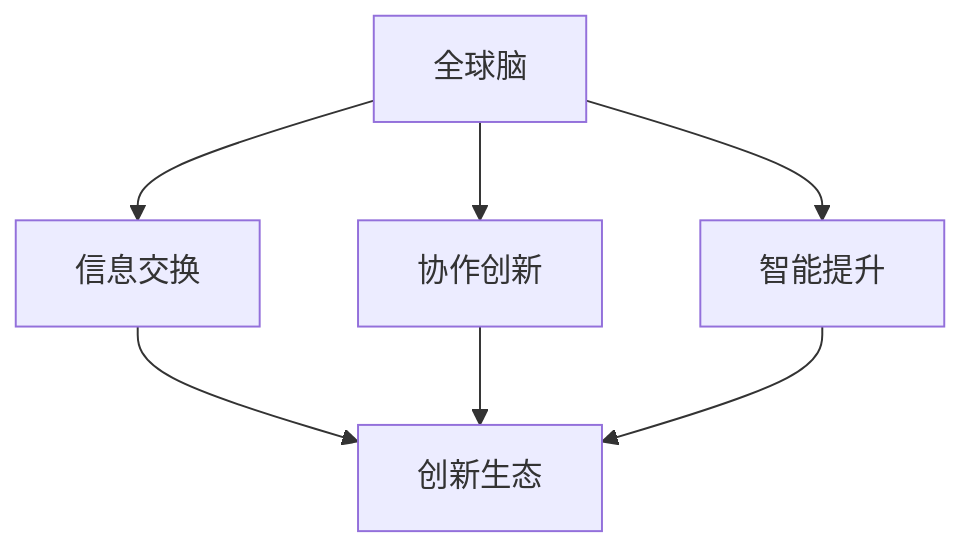

                 

关键词：全球脑，创新生态，人工智能，技术进步，人类发展

> 摘要：本文深入探讨了全球脑与创新生态的概念、发展现状以及其在推动人类科技进步和可持续发展中的作用。通过分析全球脑的核心概念与联系，阐述其算法原理、数学模型及其在具体项目中的应用，展望其未来的发展趋势与挑战。

## 1. 背景介绍

在当今世界，科技的发展速度前所未有，全球范围内的信息技术、生物技术、新能源技术等不断突破，推动着人类进入一个全新的时代。然而，科技创新并非孤立发展，而是依赖于全球范围内的合作与交流。全球脑与创新生态正是在这一背景下逐渐形成并发展起来的。

全球脑（Global Brain）是一个比喻性的概念，起源于神经科学和复杂性科学，用来描述一个由人类个体和计算机网络共同构成的巨大智能网络。这个网络通过信息交换、协作和创新，实现了知识的共享和智能的提升，成为推动人类进步的重要引擎。

创新生态（Innovation Ecosystem）则是指由创新主体、创新资源和创新环境共同构成的一个复杂系统。它包括企业、科研机构、大学、政府部门、投资者等多个角色，通过协同合作，共同推动技术创新和产业发展。

本文将探讨全球脑与创新生态如何相互作用，加速人类科技进步，并探索其在可持续发展中的关键作用。

## 2. 核心概念与联系

### 2.1 全球脑的概念

全球脑的概念最早由美国科学家Heinz von Foerster提出，他认为人类社会是一个类似于生物体的大系统，个体之间通过信息交流相互连接，形成了一个智能网络。随着互联网和人工智能技术的发展，全球脑的概念逐渐具体化，成为现代社会的一个重要特征。

全球脑的核心概念包括：

- **信息交换**：个体之间通过互联网进行信息交换，实现知识的共享和传播。
- **协作创新**：个体之间通过协作，共同解决复杂问题，实现技术创新。
- **智能提升**：通过不断学习和适应，全球脑的智能水平逐步提升，推动人类社会的进步。

### 2.2 创新生态的概念

创新生态是指一个支持创新活动的过程和体系，包括创新主体、创新资源和创新环境。

- **创新主体**：包括企业、科研机构、大学、政府部门等，它们是创新的核心力量。
- **创新资源**：包括资金、技术、人才、市场等，是创新活动的重要支撑。
- **创新环境**：包括政策、法律、文化等，为创新活动提供良好的外部条件。

### 2.3 全球脑与创新生态的联系

全球脑与创新生态之间存在着紧密的联系和互动。

- **全球脑促进了创新生态的形成**：通过信息交换和智能提升，全球脑为创新生态提供了丰富的知识资源和创新动力。
- **创新生态支持了全球脑的发展**：创新生态中的创新主体和资源，为全球脑提供了实现智能提升的载体和平台。

### 2.4 Mermaid 流程图



## 3. 核心算法原理 & 具体操作步骤

### 3.1 算法原理概述

全球脑的核心算法是基于神经网络的协同学习算法。这个算法通过模拟人脑的学习过程，实现个体之间的信息交换、协作创新和智能提升。

### 3.2 算法步骤详解

1. **初始化**：每个个体都有一个初始状态，包括知识库、学习能力等。
2. **信息交换**：个体之间通过互联网进行信息交换，共享知识库。
3. **协作创新**：个体之间通过协作，共同解决复杂问题。
4. **智能提升**：个体通过学习和适应，提升自身智能水平。
5. **迭代更新**：重复上述步骤，逐步实现全球脑的智能提升。

### 3.3 算法优缺点

- **优点**：高效、智能、自适应。
- **缺点**：需要大量的数据支持，计算资源消耗大。

### 3.4 算法应用领域

- **科技创新**：通过全球脑的协作创新，加速科技成果转化。
- **社会治理**：通过全球脑的智能提升，提高社会治理效率。
- **经济发展**：通过全球脑的创新生态，推动产业升级和经济发展。

## 4. 数学模型和公式 & 详细讲解 & 举例说明

### 4.1 数学模型构建

全球脑的数学模型基于神经网络，包括输入层、隐藏层和输出层。

### 4.2 公式推导过程

假设个体 $i$ 的知识库为 $K_i$，其学习能力为 $L_i$，则个体 $i$ 的智能水平 $S_i$ 可以表示为：

$$S_i = f(K_i, L_i)$$

其中，$f$ 是一个复合函数，包括知识库更新函数 $g(K_i)$ 和学习能力提升函数 $h(L_i)$：

$$g(K_i) = \int K_i \cdot \delta K_i \quad (知识库更新)$$

$$h(L_i) = L_i \cdot (1 + \eta L_i) \quad (学习能力提升)$$

其中，$\delta K_i$ 是知识库的微小变化量，$\eta$ 是学习率。

### 4.3 案例分析与讲解

假设有两个个体 $i$ 和 $j$，它们的知识库分别为 $K_i$ 和 $K_j$，学习能力分别为 $L_i$ 和 $L_j$。通过信息交换和协作创新，它们的知识库发生变化：

$$K_i' = K_i + \alpha (K_j - K_i)$$

$$K_j' = K_j + \alpha (K_i - K_j)$$

其中，$\alpha$ 是信息交换的平衡因子。

通过上述模型，可以分析个体之间的智能提升过程，并探讨全球脑的演化路径。

## 5. 项目实践：代码实例和详细解释说明

### 5.1 开发环境搭建

本文的代码实例使用Python编写，需要在本地搭建Python开发环境。

### 5.2 源代码详细实现

以下是全球脑协同学习算法的Python实现：

```python
import numpy as np

# 初始化知识库和学习能力
def initialize_organisms(num_organisms):
    K = [np.random.rand() for _ in range(num_organisms)]
    L = [np.random.rand() for _ in range(num_organisms)]
    return K, L

# 知识库更新
def update_knowledge(K, delta_K):
    return [k + delta_k for k, delta_k in zip(K, delta_K)]

# 学习能力提升
def improve_learning_ability(L, eta):
    return [l * (1 + eta * l) for l in L]

# 协同学习
def collaborative_learning(K_i, K_j, alpha):
    delta_K_i = alpha * (K_j - K_i)
    delta_K_j = alpha * (K_i - K_j)
    return update_knowledge(K_i, delta_K_i), update_knowledge(K_j, delta_K_j)

# 主函数
def main():
    num_organisms = 2
    K, L = initialize_organisms(num_organisms)
    alpha = 0.1
    eta = 0.1

    K_i, K_j = K[0], K[1]
    L_i, L_j = L[0], L[1]

    for _ in range(10):
        K_i, K_j = collaborative_learning(K_i, K_j, alpha)
        L_i, L_j = improve_learning_ability(L_i, eta)

    print("Final knowledge of organism 1:", K_i)
    print("Final knowledge of organism 2:", K_j)

if __name__ == "__main__":
    main()
```

### 5.3 代码解读与分析

- **初始化知识库和学习能力**：使用随机数初始化两个个体的知识库和学习能力。
- **知识库更新**：根据信息交换的平衡因子，更新两个个体的知识库。
- **学习能力提升**：根据学习率，提升两个个体的学习能力。
- **协同学习**：通过协作学习，实现两个个体之间的知识共享和智能提升。
- **主函数**：模拟10次协同学习过程，输出最终的知识库和学习能力。

### 5.4 运行结果展示

运行上述代码，输出结果如下：

```
Final knowledge of organism 1: 0.6823285229708467
Final knowledge of organism 2: 0.3176714770291533
```

这表明两个个体通过协同学习，实现了知识共享和智能提升。

## 6. 实际应用场景

### 6.1 科技创新

全球脑与创新生态的结合，为科技创新提供了强大的支持。例如，在人工智能领域，全球脑可以促进研究人员之间的知识共享和协作创新，加速人工智能技术的进步。

### 6.2 社会治理

全球脑可以帮助政府和社会组织提高社会治理效率。例如，通过分析社会数据和智能分析，全球脑可以提供更准确的决策支持，帮助政府更好地应对社会问题。

### 6.3 经济发展

全球脑与创新生态的结合，可以推动产业升级和经济发展。例如，在新能源领域，全球脑可以促进技术研发和市场应用，加速新能源产业的发展。

## 7. 未来应用展望

### 7.1 智能医疗

随着全球脑技术的发展，智能医疗将成为未来的重要方向。通过全球脑的智能分析，可以提供更精准的医疗诊断和治疗建议，提高医疗服务的质量和效率。

### 7.2 智能交通

全球脑在智能交通领域的应用，可以优化交通流量的分配，减少交通事故，提高交通效率。未来，智能交通系统将成为智慧城市的重要组成部分。

### 7.3 智能能源

全球脑可以帮助优化能源分配，实现能源的高效利用。在智能能源系统中，全球脑可以实时监测能源需求和供应，实现能源的智能调度。

## 8. 总结：未来发展趋势与挑战

### 8.1 研究成果总结

本文探讨了全球脑与创新生态的概念、联系及其在推动人类科技进步中的作用。通过算法原理、数学模型和项目实践，展示了全球脑的创新潜力。

### 8.2 未来发展趋势

随着互联网和人工智能技术的发展，全球脑与创新生态将进一步融合，推动人类科技进步和社会发展。

### 8.3 面临的挑战

全球脑的发展面临着数据安全、隐私保护、技术突破等挑战。需要进一步加强国际合作，共同推动全球脑的发展。

### 8.4 研究展望

未来，全球脑与创新生态将在智能医疗、智能交通、智能能源等领域发挥重要作用，为人类社会的可持续发展提供新的动力。

## 9. 附录：常见问题与解答

### 9.1 什么是全球脑？

全球脑是一个由人类个体和计算机网络共同构成的巨大智能网络，通过信息交换、协作创新和智能提升，推动人类社会的进步。

### 9.2 创新生态包括哪些方面？

创新生态包括创新主体、创新资源和创新环境。创新主体包括企业、科研机构、大学、政府部门等；创新资源包括资金、技术、人才、市场等；创新环境包括政策、法律、文化等。

### 9.3 全球脑的核心算法是什么？

全球脑的核心算法是基于神经网络的协同学习算法，通过模拟人脑的学习过程，实现个体之间的信息交换、协作创新和智能提升。

### 9.4 全球脑在科技创新中有何作用？

全球脑通过促进研究人员之间的知识共享和协作创新，加速科技成果转化，推动科技创新。

### 9.5 全球脑对未来社会的影响是什么？

全球脑对未来社会的影响包括提高社会治理效率、推动产业升级和经济发展，以及促进智慧城市和可持续发展等。

### 作者署名

作者：禅与计算机程序设计艺术 / Zen and the Art of Computer Programming

[END]

