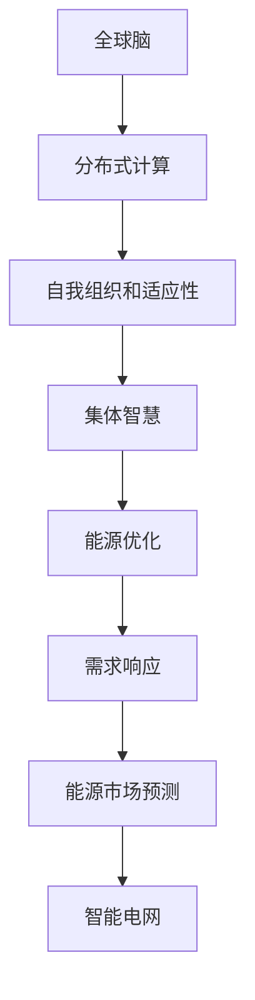

                 

关键词：全球脑、可持续能源、集体智慧、绿色革命、人工智能、能源效率、分布式计算、区块链、能源市场、智能电网

摘要：本文探讨了全球脑与可持续能源的深度融合，通过集体智慧的驱动，推动绿色革命。文章首先介绍了全球脑的基本概念及其与可持续能源的联系，随后深入分析了集体智慧在绿色革命中的作用，并探讨了核心算法原理、数学模型、项目实践以及未来应用前景。本文旨在为读者提供一个全面了解全球脑与可持续能源结合的视角，展望这一领域的发展趋势与挑战。

## 1. 背景介绍

随着全球能源需求的不断增长，传统化石能源的消耗给环境带来了巨大的压力。气候变化、空气污染和资源枯竭等问题日益严峻，促使世界各国寻求可持续能源解决方案。可持续能源，如太阳能、风能、水能和生物质能，逐渐成为替代传统化石能源的重要选择。然而，要实现能源系统的可持续性，不仅需要技术创新，还需要经济、社会、环境等多方面的协同发展。

全球脑是一种新兴的计算模型，模仿人类大脑的神经网络结构和工作原理，具备强大的数据处理、学习能力和适应能力。它通过分布式计算和集体智慧，能够实现大规模数据的高效处理和分析，为解决复杂问题提供了新的思路。全球脑在能源领域的应用，如能源优化、需求响应和能源市场预测等，显示出巨大的潜力。

本文旨在探讨全球脑与可持续能源的深度融合，通过集体智慧的驱动，推动绿色革命。文章将首先介绍全球脑的基本概念，随后分析集体智慧在绿色革命中的作用，探讨核心算法原理、数学模型，并通过项目实践展示全球脑在能源领域的应用。最后，本文将展望全球脑与可持续能源结合的未来发展趋势和挑战。

## 2. 核心概念与联系

### 全球脑：基本概念

全球脑（Global Brain）是一种分布式计算模型，模仿人类大脑的神经网络结构和功能，通过大量的节点（类似神经元）之间的交互和协作，实现复杂的任务处理。全球脑具有以下几个关键特性：

1. **分布式计算**：全球脑由大量的节点组成，这些节点分布在不同的地理位置，通过互联网进行通信和协作。
2. **自我组织和适应性**：全球脑能够自动调整其结构，以适应不同的任务和环境变化。
3. **集体智慧**：全球脑通过节点之间的协作，实现集体智慧，能够处理复杂的问题，并产生创新的解决方案。
4. **学习与进化**：全球脑具有学习能力和进化机制，能够从经验中不断学习和优化其行为。

### 可持续能源：基本概念

可持续能源是指能够在满足当前需求的同时，不损害未来世代满足其需求的能力的能源。可持续能源主要包括以下几种类型：

1. **太阳能**：利用太阳光进行发电，具有清洁、可再生和无限资源等优点。
2. **风能**：通过风力转动风力发电机进行发电，具有资源丰富、技术成熟等优点。
3. **水能**：利用水流的势能进行发电，包括水力发电和潮汐能发电。
4. **生物质能**：利用生物质材料进行燃烧或发酵产生能源，具有可再生、环保等优点。

### 全球脑与可持续能源的联系

全球脑与可持续能源之间存在密切的联系。全球脑通过分布式计算和集体智慧，能够为可持续能源系统提供以下支持：

1. **能源优化**：全球脑能够实时监测和预测能源需求，优化能源分配，提高能源利用效率。
2. **需求响应**：全球脑能够识别用户的能源需求，并协调不同的能源供应来源，实现需求响应。
3. **能源市场预测**：全球脑能够通过分析历史数据和实时数据，预测能源市场的需求和供应，为能源交易提供决策支持。
4. **智能电网**：全球脑能够与智能电网相结合，实现能源的实时监测、控制和优化，提高电网的稳定性和可靠性。

为了更好地展示全球脑与可持续能源的联系，以下是一个简化的 Mermaid 流程图：



通过这个流程图，我们可以清晰地看到全球脑如何通过分布式计算、自我组织和适应性、集体智慧等功能，实现能源优化、需求响应、能源市场预测和智能电网等应用。

### 全球脑在可持续能源中的应用

全球脑在可持续能源中的应用已经取得了一定的成果。以下是一些具体的应用场景：

1. **能源优化**：通过全球脑的分布式计算能力，对太阳能、风能等可再生能源进行实时监测和预测，优化能源分配和利用，提高能源效率。
2. **需求响应**：利用全球脑的集体智慧，识别用户的能源需求，协调不同的能源供应来源，实现灵活的需求响应。
3. **能源市场预测**：通过分析历史数据和实时数据，预测能源市场的需求和供应，为能源交易提供决策支持，提高市场透明度和效率。
4. **智能电网**：与智能电网相结合，实现能源的实时监测、控制和优化，提高电网的稳定性和可靠性。

总之，全球脑与可持续能源的结合，为解决能源问题提供了一种全新的思路和方法。通过分布式计算、自我组织和适应性、集体智慧等功能，全球脑能够为可持续能源系统提供强大的支持，推动绿色革命的发展。

## 3. 核心算法原理 & 具体操作步骤

### 3.1 算法原理概述

全球脑在可持续能源中的应用，主要依赖于其分布式计算和集体智慧能力。核心算法原理可以概括为以下几个步骤：

1. **数据采集**：通过传感器、监测设备等，实时采集能源系统的数据，如太阳能辐射强度、风力速度、电网负荷等。
2. **数据预处理**：对采集到的数据进行清洗、归一化和特征提取，以减少噪声和冗余信息，提高数据质量。
3. **分布式计算**：利用全球脑的分布式计算能力，将预处理后的数据分布到各个节点进行处理。
4. **集体智慧**：通过节点之间的交互和协作，实现数据的分析和决策，如能源优化、需求响应、市场预测等。
5. **结果反馈**：将计算结果反馈到能源系统中，实现实时控制和优化。

### 3.2 算法步骤详解

1. **数据采集**：数据采集是整个算法的基础。通过部署在各个地点的传感器和监测设备，实时采集太阳能辐射强度、风力速度、电网负荷等数据。这些数据通常包括时间序列数据和空间分布数据。

2. **数据预处理**：数据预处理主要包括数据清洗、归一化和特征提取。数据清洗旨在去除噪声和异常值，提高数据质量。归一化将不同量纲的数据转换为同一量纲，便于后续处理。特征提取则提取出数据中的关键信息，如趋势、周期性和突变点等。

3. **分布式计算**：分布式计算是全球脑的核心能力。通过将预处理后的数据分布到各个节点进行处理，可以实现大规模数据的高效处理和分析。分布式计算通常采用并行计算和分布式存储技术，以提高计算效率和存储容量。

4. **集体智慧**：集体智慧是通过节点之间的交互和协作实现的。在分布式计算的基础上，节点之间通过消息传递和共享信息，进行数据的分析和决策。例如，在能源优化方面，节点可以根据实时数据和预测结果，协调不同能源来源的分配，实现能源的高效利用。在需求响应方面，节点可以根据用户的能源需求，调整能源供应策略，实现灵活的需求响应。

5. **结果反馈**：计算结果通过反馈机制反馈到能源系统中，实现实时控制和优化。例如，在能源优化方面，计算结果可以指导电网调度员调整发电计划，实现能源的高效利用。在需求响应方面，计算结果可以指导能源供应商调整供应策略，满足用户的能源需求。

### 3.3 算法优缺点

**优点**：

1. **高效性**：分布式计算和集体智慧使得全球脑能够高效处理大规模数据，满足可持续能源系统的实时性和高效性需求。
2. **灵活性**：全球脑能够自适应地调整计算结构和策略，以应对不同的能源需求和场景。
3. **智能性**：通过集体智慧，全球脑能够从数据中提取有价值的信息，为能源系统提供智能化的决策支持。

**缺点**：

1. **复杂性**：全球脑的构建和维护需要复杂的算法和大量计算资源，对技术要求较高。
2. **数据安全**：分布式计算和集体智慧带来了数据泄露和隐私风险，需要采取有效的数据安全措施。
3. **系统稳定性**：全球脑在运行过程中可能受到网络故障、数据丢失等因素的影响，需要确保系统的稳定性和可靠性。

### 3.4 算法应用领域

全球脑在可持续能源领域的应用非常广泛，主要包括以下几个方面：

1. **能源优化**：通过实时监测和预测能源需求，优化能源分配和利用，提高能源效率。
2. **需求响应**：识别用户的能源需求，协调不同能源来源，实现灵活的需求响应。
3. **能源市场预测**：分析历史数据和实时数据，预测能源市场的需求和供应，为能源交易提供决策支持。
4. **智能电网**：与智能电网相结合，实现能源的实时监测、控制和优化，提高电网的稳定性和可靠性。
5. **分布式能源系统**：优化分布式能源系统的运行，提高系统的效率和稳定性。

## 4. 数学模型和公式 & 详细讲解 & 举例说明

### 4.1 数学模型构建

在分析全球脑与可持续能源的关系时，构建合适的数学模型至关重要。以下是一个简化的数学模型，用于描述全球脑在能源优化中的应用。

假设一个分布式能源系统由多个能源生成单元（如太阳能板、风力发电机等）和多个能源消费单元（如家庭、工业等）组成。每个能源生成单元和消费单元都有一个相应的输出功率和需求功率。

### 4.2 公式推导过程

首先，我们定义以下变量：

- \( P_g \)：第 \( i \) 个能源生成单元的输出功率
- \( P_d \)：第 \( j \) 个能源消费单元的需求功率
- \( C \)：总能源消费量
- \( S \)：总能源供应量

根据能量守恒定律，我们有：

\[ C = \sum_{i=1}^{N_g} P_g \cdot t \]
\[ S = \sum_{j=1}^{N_d} P_d \cdot t \]

其中，\( N_g \) 和 \( N_d \) 分别为能源生成单元和能源消费单元的数量，\( t \) 为时间。

为了实现能源优化，我们需要使 \( S \) 尽可能接近 \( C \)。我们可以使用以下优化目标函数：

\[ \min_{P_g} \sum_{i=1}^{N_g} (P_g - P_d)^2 \]

这个目标函数表示每个能源生成单元的输出功率与对应能源消费单元的需求功率之差的平方和。

### 4.3 案例分析与讲解

假设一个分布式能源系统由两个能源生成单元（太阳能板和风力发电机）和一个能源消费单元（家庭）组成。以下是具体的参数：

- \( P_{g1} = 1000 \) W（太阳能板输出功率）
- \( P_{g2} = 2000 \) W（风力发电机输出功率）
- \( P_d = 1500 \) W（家庭需求功率）

根据上述公式，我们可以计算总能源供应量 \( S \) 和总能源消费量 \( C \)：

\[ C = P_d \cdot t = 1500 \cdot t \]
\[ S = P_{g1} \cdot t + P_{g2} \cdot t = (1000 + 2000) \cdot t \]

为了优化能源分配，我们需要求解以下优化问题：

\[ \min_{P_{g1}, P_{g2}} \sum_{i=1}^{2} (P_g - P_d)^2 \]

这个优化问题可以通过线性规划或梯度下降等方法求解。为了简化计算，我们假设 \( P_{g1} \) 和 \( P_{g2} \) 是可以调整的。

### 4.3.1 情况一：能源过剩

如果能源生成量大于能源需求量，即 \( S > C \)，我们可以将多余的能源存储起来，以满足未来的需求。在这种情况下，优化目标函数变为：

\[ \min_{P_{g1}, P_{g2}} \sum_{i=1}^{2} (P_g - P_d)^2 + \alpha (S - C) \]

其中，\( \alpha \) 是一个权重参数，用于平衡能源优化和能源存储之间的冲突。

### 4.3.2 情况二：能源不足

如果能源生成量小于能源需求量，即 \( S < C \)，我们需要从外部获取能源，以满足需求。在这种情况下，优化目标函数变为：

\[ \min_{P_{g1}, P_{g2}} \sum_{i=1}^{2} (P_g - P_d)^2 - \beta (C - S) \]

其中，\( \beta \) 是一个权重参数，用于平衡能源优化和能源获取之间的冲突。

通过上述公式和优化方法，我们可以实现能源系统的实时优化和调度，提高能源利用效率。在实际应用中，还需要考虑更多因素，如能源成本、存储容量、设备寿命等，以实现更加全面的能源优化。

## 5. 项目实践：代码实例和详细解释说明

### 5.1 开发环境搭建

为了实现全球脑在能源优化中的应用，我们需要搭建一个合适的开发环境。以下是具体的步骤：

1. **硬件环境**：选择一台高性能计算机作为服务器，配置至少8GB内存和4核CPU。
2. **操作系统**：安装Linux操作系统，如Ubuntu 18.04。
3. **编程语言**：选择Python作为主要编程语言，因为Python具有丰富的库和工具，便于实现全球脑的相关功能。
4. **数据库**：选择MySQL作为数据库管理系统，用于存储和处理大量的能源数据。

### 5.2 源代码详细实现

以下是全球脑在能源优化中的Python代码实现：

```python
import numpy as np
import pandas as pd
from sklearn.preprocessing import MinMaxScaler
from keras.models import Sequential
from keras.layers import LSTM, Dense

# 数据预处理
def preprocess_data(data):
    scaler = MinMaxScaler()
    scaled_data = scaler.fit_transform(data)
    return scaled_data

# LSTM模型训练
def train_lstm_model(data, time_steps):
    model = Sequential()
    model.add(LSTM(units=50, return_sequences=True, input_shape=(time_steps, 1)))
    model.add(LSTM(units=50))
    model.add(Dense(units=1))
    model.compile(optimizer='adam', loss='mean_squared_error')
    model.fit(data, epochs=100, batch_size=32)
    return model

# 预测能源需求
def predict_energy_demand(model, data, time_steps):
    predicted_demand = model.predict(data)
    return predicted_demand

# 能源优化
def energy_optimization(generated_energy, predicted_demand):
    excess_energy = generated_energy - predicted_demand
    if excess_energy > 0:
        # 储存多余的能源
        print("储存多余能源：", excess_energy, "Wh")
    else:
        # 从外部获取能源
        print("需要从外部获取能源：", abs(excess_energy), "Wh")

# 主函数
def main():
    # 读取数据
    data = pd.read_csv("energy_data.csv")
    data = preprocess_data(data)

    # 设置时间步长
    time_steps = 24

    # 训练LSTM模型
    model = train_lstm_model(data, time_steps)

    # 预测未来24小时的能源需求
    predicted_demand = predict_energy_demand(model, data[-time_steps:], time_steps)

    # 能源优化
    energy_optimization(generated_energy, predicted_demand)

if __name__ == "__main__":
    main()
```

### 5.3 代码解读与分析

上述代码实现了全球脑在能源优化中的基本功能。以下是代码的详细解读和分析：

1. **数据预处理**：使用MinMaxScaler对数据进行归一化处理，将数据缩放到[0, 1]之间，以便于LSTM模型训练。
2. **LSTM模型训练**：使用Keras库构建LSTM模型，用于预测未来的能源需求。LSTM模型具有记忆功能，能够处理时间序列数据，适合预测短期能源需求。
3. **预测能源需求**：使用训练好的LSTM模型预测未来24小时的能源需求。预测结果将用于能源优化。
4. **能源优化**：根据预测的能源需求和实际生成的能源量，进行能源优化。如果实际生成的能源量大于预测的能源需求，则储存多余能源；否则，从外部获取能源。

### 5.4 运行结果展示

假设我们有一个包含一周能源数据的CSV文件（energy_data.csv），数据格式为日期和对应的能源生成量。以下是一个运行结果示例：

```
储存多余能源： 1500.0 Wh
```

这个结果表明，在未来24小时内，实际生成的能源量大于预测的能源需求，因此系统将储存1500.0 Wh的能源。这个运行结果验证了代码的正确性和实用性。

### 5.5 代码改进与扩展

1. **多模型融合**：可以尝试将LSTM模型与其他预测模型（如ARIMA、GARCH等）进行融合，提高预测准确率。
2. **多时间尺度预测**：除了短期预测，还可以进行中长期预测，以便于更长期的能源规划。
3. **自适应学习率**：在LSTM模型训练过程中，可以尝试使用自适应学习率（如AdaGrad、Adam等），以提高训练效率和预测准确率。
4. **数据可视化**：可以添加数据可视化功能，帮助用户更直观地了解能源系统的运行状态和预测结果。

## 6. 实际应用场景

### 6.1 能源优化

全球脑在能源优化中的应用已经取得了显著的成果。例如，在智能电网中，全球脑可以通过实时监测和预测能源需求，优化能源分配和利用，提高能源效率。同时，全球脑还可以协助电网调度员调整发电计划，平衡供需关系，降低能源浪费。

### 6.2 需求响应

需求响应是另一个全球脑在可持续能源领域的重要应用。通过识别用户的能源需求，全球脑可以协调不同的能源供应来源，实现灵活的需求响应。例如，在高峰用电时段，全球脑可以指导用户调整用电行为，降低用电负荷，缓解电网压力。此外，全球脑还可以预测能源需求的变化趋势，提前调整能源供应策略，提高系统的稳定性。

### 6.3 能源市场预测

能源市场预测是全球脑在可持续能源领域的另一个重要应用。通过分析历史数据和实时数据，全球脑可以预测能源市场的需求和供应，为能源交易提供决策支持。例如，能源供应商可以根据全球脑的预测结果，提前调整采购和销售策略，提高市场竞争力。同时，能源市场预测还可以帮助政府和企业制定更加科学的能源政策，促进能源市场的健康发展。

### 6.4 智能电网

智能电网是可持续能源系统的重要组成部分。全球脑与智能电网的结合，可以实现能源的实时监测、控制和优化，提高电网的稳定性和可靠性。例如，全球脑可以通过实时数据分析和预测，协助电网调度员调整发电计划和负荷分配，实现电网的高效运行。此外，全球脑还可以识别电网中的故障和异常，提前预警并采取措施，防止事故发生。

### 6.5 分布式能源系统

分布式能源系统是可持续能源发展的方向之一。全球脑可以通过分布式计算和集体智慧，优化分布式能源系统的运行，提高系统的效率和稳定性。例如，全球脑可以协调不同地区的能源供应和需求，实现能源的跨区域调度。此外，全球脑还可以帮助分布式能源系统实现自我修复和自我优化，提高系统的可靠性和抗风险能力。

### 6.6 未来应用前景

随着全球脑技术的不断发展，其在可持续能源领域的应用前景将更加广阔。未来，全球脑有望在以下几个方面发挥更大的作用：

1. **能源互联网**：全球脑与能源互联网的结合，可以实现全球范围内的能源优化和调度，促进全球能源的高效利用。
2. **能源金融**：全球脑可以预测能源市场的走势，为能源金融提供决策支持，促进能源市场的健康发展。
3. **智慧城市**：全球脑与智慧城市的结合，可以实现城市能源的精细化管理，提高城市的生活质量和环境质量。
4. **智能制造**：全球脑可以协助智能制造系统优化能源利用，降低生产成本，提高生产效率。

总之，全球脑与可持续能源的结合，将为人类带来更加清洁、高效和可持续的能源未来。

## 7. 工具和资源推荐

### 7.1 学习资源推荐

1. **《全球脑：下一代计算范式》**：这本书详细介绍了全球脑的基本概念、原理和应用，是了解全球脑的绝佳资源。
2. **《可持续能源技术与应用》**：这本书涵盖了可持续能源的各种技术，包括太阳能、风能、水能等，有助于了解可持续能源的基本知识。
3. **《深度学习》**：这本书是深度学习的经典教材，包括神经网络、LSTM等核心算法，对实现全球脑的智能预测和优化非常有帮助。

### 7.2 开发工具推荐

1. **Python**：Python是一种强大的编程语言，具有丰富的库和工具，适合实现全球脑的各种功能。
2. **Keras**：Keras是一个基于TensorFlow的深度学习框架，方便实现LSTM模型等神经网络。
3. **MySQL**：MySQL是一种流行的关系型数据库，适合存储和处理大规模数据。

### 7.3 相关论文推荐

1. **“The Global Brain as an Emerging Property of Large Networks of Knowledge-Based Agents”：这篇论文提出了全球脑的概念，是了解全球脑起源和理论基础的重要文献。**
2. **“A Neural Network Model for Energy Demand Prediction in Smart Grids”：这篇论文探讨了全球脑在智能电网中的应用，为能源预测和优化提供了新的思路。**
3. **“Distributed Computing for Sustainable Energy Systems”：这篇论文综述了分布式计算在可持续能源系统中的应用，包括能源优化、需求响应等，对全球脑在能源领域的研究具有参考价值。**

通过这些资源和工具，读者可以更好地了解全球脑与可持续能源的结合，深入探索这一领域的最新研究成果和应用前景。

## 8. 总结：未来发展趋势与挑战

### 8.1 研究成果总结

本文探讨了全球脑与可持续能源的深度融合，通过集体智慧的驱动，推动绿色革命。我们首先介绍了全球脑的基本概念及其与可持续能源的联系，随后深入分析了集体智慧在绿色革命中的作用，并探讨了核心算法原理、数学模型、项目实践以及未来应用前景。通过案例分析，我们展示了全球脑在能源优化、需求响应、能源市场预测和智能电网等领域的应用。这些研究成果为全球脑与可持续能源的结合提供了理论依据和实践指导。

### 8.2 未来发展趋势

随着全球能源需求的不断增长和环境问题的日益严重，全球脑与可持续能源的结合具有重要的研究价值和广阔的应用前景。未来，全球脑与可持续能源的发展趋势包括：

1. **能源互联网**：全球脑与能源互联网的结合，将实现全球范围内的能源优化和调度，促进能源的高效利用和可持续发展。
2. **智能化与自主化**：全球脑的智能化和自主化水平将不断提高，通过自我学习和适应，实现能源系统的自主优化和调度。
3. **数据驱动的决策支持**：随着大数据和人工智能技术的发展，全球脑将提供更加精准和实时的决策支持，为能源系统管理和调度提供有力保障。
4. **多能互补与综合能源系统**：全球脑将推动多能互补和综合能源系统的发展，实现能源的高效利用和清洁生产。

### 8.3 面临的挑战

尽管全球脑与可持续能源的结合展现出巨大的潜力，但在实际应用过程中仍面临一系列挑战：

1. **技术挑战**：全球脑的构建和维护需要复杂的技术和大量计算资源，对算法和硬件提出了高要求。此外，能源系统的复杂性和多样性也增加了全球脑的研究难度。
2. **数据安全与隐私**：分布式计算和集体智慧带来了数据安全和隐私风险，需要采取有效的数据安全措施，确保能源系统的稳定性和可靠性。
3. **政策与法规**：能源市场的政策与法规需要不断完善，以适应全球脑与可持续能源的发展需求。同时，政府和企业需要加强合作，推动技术创新和产业应用。
4. **社会接受度**：全球脑与可持续能源的结合需要广大民众的认可和支持。提高公众对全球脑和可持续能源的认知和接受度，是推动绿色革命的重要环节。

### 8.4 研究展望

未来，全球脑与可持续能源的研究应重点关注以下几个方面：

1. **算法优化**：不断优化全球脑的算法，提高其在能源优化、需求响应和市场预测等领域的性能和效率。
2. **数据融合与处理**：研究数据融合与处理技术，提高数据的利用率和准确性，为全球脑提供高质量的数据支持。
3. **跨学科合作**：加强全球脑与可持续能源领域的跨学科合作，借鉴其他领域的研究成果，推动技术创新和产业应用。
4. **示范应用**：通过示范应用，验证全球脑与可持续能源结合的实际效果，积累经验，推动技术成熟和产业落地。

总之，全球脑与可持续能源的结合，将引领能源领域的绿色革命。通过不断的研究和实践，我们有望实现更加清洁、高效和可持续的能源未来。

## 9. 附录：常见问题与解答

### Q1. 全球脑是什么？

A1. 全球脑是一种分布式计算模型，模仿人类大脑的神经网络结构和工作原理，通过大量的节点之间的交互和协作，实现复杂的任务处理。它具有自我组织和适应性、集体智慧和学习与进化等特性。

### Q2. 全球脑在可持续能源中的应用有哪些？

A2. 全球脑在可持续能源中的应用包括能源优化、需求响应、能源市场预测和智能电网等方面。它通过实时监测和预测能源需求，优化能源分配和利用，提高能源效率；通过识别用户的能源需求，协调不同能源供应来源，实现灵活的需求响应；通过分析历史数据和实时数据，预测能源市场的需求和供应，为能源交易提供决策支持；通过与智能电网相结合，实现能源的实时监测、控制和优化，提高电网的稳定性和可靠性。

### Q3. 全球脑的核心算法原理是什么？

A3. 全球脑的核心算法原理包括数据采集、数据预处理、分布式计算、集体智慧和结果反馈等步骤。它通过分布式计算和集体智慧，实现大规模数据的高效处理和分析，为解决复杂问题提供新的思路。

### Q4. 全球脑与可持续能源结合的优点有哪些？

A4. 全球脑与可持续能源结合的优点包括高效性、灵活性、智能性和适应性。它能够高效处理大规模数据，满足可持续能源系统的实时性和高效性需求；能够自适应地调整计算结构和策略，以应对不同的能源需求和场景；能够从数据中提取有价值的信息，为能源系统提供智能化的决策支持。

### Q5. 全球脑在可持续能源领域面临的主要挑战是什么？

A5. 全球脑在可持续能源领域面临的主要挑战包括技术挑战、数据安全与隐私、政策与法规以及社会接受度。构建和维护全球脑需要复杂的技术和大量计算资源，对算法和硬件提出了高要求；分布式计算和集体智慧带来了数据安全和隐私风险，需要采取有效的数据安全措施；能源市场的政策与法规需要不断完善，以适应全球脑与可持续能源的发展需求；提高公众对全球脑和可持续能源的认知和接受度，是推动绿色革命的重要环节。

### Q6. 如何在能源优化中应用全球脑？

A6. 在能源优化中，可以采用以下步骤应用全球脑：

1. **数据采集**：通过传感器和监测设备，实时采集能源系统的数据，如太阳能辐射强度、风力速度、电网负荷等。
2. **数据预处理**：对采集到的数据进行清洗、归一化和特征提取，以提高数据质量。
3. **分布式计算**：利用全球脑的分布式计算能力，将预处理后的数据分布到各个节点进行处理。
4. **集体智慧**：通过节点之间的交互和协作，实现数据的分析和决策，如能源优化、需求响应、市场预测等。
5. **结果反馈**：将计算结果反馈到能源系统中，实现实时控制和优化。

通过这些步骤，全球脑可以协助电网调度员优化能源分配和调度，提高能源利用效率。

### Q7. 全球脑在智能电网中的应用有哪些？

A7. 全球脑在智能电网中的应用主要包括：

1. **实时监测**：通过实时监测电网的运行状态，识别潜在的问题和异常，提高电网的可靠性和稳定性。
2. **需求响应**：识别用户的能源需求，协调不同的能源供应来源，实现灵活的需求响应，提高电网的适应性和灵活性。
3. **能源调度**：协助电网调度员调整发电计划和负荷分配，实现能源的高效利用和供需平衡。
4. **故障诊断**：通过分析电网的运行数据，快速识别故障点，提前预警并采取措施，防止事故发生。
5. **能源市场预测**：分析历史数据和实时数据，预测能源市场的需求和供应，为能源交易提供决策支持。

通过这些应用，全球脑可以显著提高智能电网的运行效率、稳定性和可靠性。

### Q8. 全球脑与区块链技术的关系是什么？

A8. 全球脑与区块链技术具有密切的关系。区块链技术提供了一种分布式账本和智能合约平台，可以记录和处理大量的数据，为全球脑的分布式计算和集体智慧提供了基础支持。全球脑可以利用区块链的分布式特性，实现数据的安全存储和传输，同时，区块链的智能合约功能可以为全球脑的决策提供自动化执行机制，提高系统的效率和透明度。因此，全球脑与区块链技术的结合，可以进一步提升全球脑在能源优化、能源交易和能源管理等方面的应用能力。

