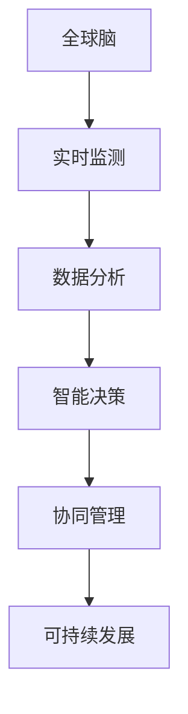

                 

关键词：全球脑、城市规划、智慧城市、人工智能、网络架构、可持续发展、未来趋势

> 摘要：本文将探讨全球脑与城市规划的关系，以及智慧城市如何成为未来城市发展的终极形态。通过分析全球脑的概念、城市规划的核心要素，以及人工智能在智慧城市中的应用，本文旨在为读者提供一个全面而深入的视角，探讨如何实现智慧城市的终极形态。

## 1. 背景介绍

随着全球人口的增长和城市化进程的加速，传统城市规划面临着诸多挑战。资源短缺、环境污染、交通拥堵、能源消耗等问题日益突出，传统的城市规划模式已经难以满足现代社会的发展需求。为了应对这些挑战，智慧城市的概念逐渐兴起。智慧城市通过将信息技术、物联网、大数据等现代科技手段应用于城市规划和管理，旨在实现资源的高效利用、环境的可持续发展和居民的便捷生活。

全球脑作为智慧城市的关键支撑，是一种通过连接全球各地城市和基础设施，实现实时数据共享和智能决策的综合性网络架构。全球脑的概念起源于神经系统科学，其核心思想是通过智能网络的构建，模拟人类大脑的协同工作模式，从而提升城市管理的效率和质量。

## 2. 核心概念与联系

### 2.1 全球脑的概念

全球脑（Global Brain）是一种基于网络技术的分布式智能系统，它通过连接全球各地的传感器、设备和信息系统，实现数据的实时采集、传输和分析。全球脑的核心特点包括：

- **分布式计算**：全球脑通过分布式计算技术，将数据处理和计算任务分散到全球各地的计算节点上，从而提高计算效率和数据处理能力。
- **实时数据共享**：全球脑实现全球范围内数据的实时共享，使得城市管理者可以实时了解城市运行状态，做出快速响应。
- **智能决策支持**：全球脑通过机器学习和人工智能技术，为城市管理者提供智能化的决策支持，从而提升城市管理效率。

### 2.2 城市规划的核心要素

城市规划的核心要素包括：

- **空间规划**：合理布局城市空间，实现城市功能的分区和优化。
- **交通规划**：设计高效的交通网络，缓解交通拥堵，提高交通效率。
- **能源规划**：优化能源结构，提高能源利用效率，实现可持续发展。
- **环境保护**：制定环境保护措施，减少污染，保护生态环境。
- **社会管理**：提升社会治理能力，保障公共安全，提高居民生活质量。

### 2.3 全球脑与城市规划的联系

全球脑与城市规划密切相关。通过全球脑，城市规划可以实现以下目标：

- **实时监测**：全球脑实现城市运行状态的实时监测，为城市管理者提供准确的数据支持。
- **智能决策**：全球脑通过大数据分析和人工智能技术，为城市管理者提供智能化的决策支持。
- **协同管理**：全球脑连接全球各地的城市和基础设施，实现城市间的协同管理，提升全球城市治理能力。
- **可持续发展**：全球脑实现资源的高效利用和环境的可持续保护，推动城市可持续发展。

### 2.4 Mermaid 流程图



## 3. 核心算法原理 & 具体操作步骤

### 3.1 算法原理概述

智慧城市的核心算法原理主要涉及以下几个方面：

- **数据采集与处理**：通过传感器、物联网设备等采集城市运行数据，然后利用大数据技术进行数据清洗、存储和分析。
- **机器学习与人工智能**：利用机器学习算法，从海量数据中提取规律，实现智能预测和决策支持。
- **智能优化算法**：利用智能优化算法，优化城市资源配置，提高城市管理效率。

### 3.2 算法步骤详解

#### 3.2.1 数据采集与处理

1. **传感器部署**：在城市中部署各种传感器，如交通流量传感器、环境监测传感器、能源消耗传感器等，以获取城市运行数据。
2. **数据采集**：通过物联网技术，将传感器数据实时传输到数据中心。
3. **数据清洗**：对采集到的数据进行处理，包括数据去噪、缺失值填补、异常值处理等。
4. **数据存储**：将处理后的数据存储到数据仓库中，为后续分析提供基础数据。

#### 3.2.2 机器学习与人工智能

1. **特征工程**：从原始数据中提取有用的特征，为机器学习算法提供输入。
2. **模型训练**：利用机器学习算法，如决策树、支持向量机、神经网络等，对特征进行训练，建立预测模型。
3. **模型评估**：通过交叉验证、A/B测试等方法，评估模型的准确性和可靠性。
4. **模型部署**：将训练好的模型部署到生产环境中，实现实时预测和决策支持。

#### 3.2.3 智能优化算法

1. **问题建模**：根据具体应用场景，建立优化问题的数学模型。
2. **算法选择**：选择合适的智能优化算法，如遗传算法、蚁群算法、粒子群优化等。
3. **算法实现**：实现优化算法的代码，包括初始化、迭代、更新等步骤。
4. **结果分析**：对优化算法的结果进行分析，评估其性能和效果。

### 3.3 算法优缺点

#### 3.3.1 优点

- **高效性**：通过大数据和人工智能技术，实现对城市运行状态的实时监测和智能决策，提高城市管理效率。
- **智能性**：利用机器学习和智能优化算法，从海量数据中提取规律，实现智能预测和优化。
- **协同性**：通过全球脑技术，实现城市间的协同管理，提升全球城市治理能力。

#### 3.3.2 缺点

- **数据隐私**：城市运行数据涉及大量个人隐私，如何保障数据安全和隐私保护是一个重要问题。
- **技术依赖**：智慧城市的发展高度依赖于信息技术和人工智能技术，一旦技术出现问题，可能会对城市运行造成严重影响。
- **算法伦理**：人工智能算法在决策过程中可能存在偏见和歧视，如何确保算法的公平性和透明性是一个亟待解决的问题。

### 3.4 算法应用领域

智慧城市的核心算法应用领域包括：

- **交通管理**：通过实时交通流量监测和智能调度，缓解交通拥堵，提高交通效率。
- **能源管理**：通过智能电网和能源优化算法，实现能源的高效利用和可持续发展。
- **环境监测**：通过实时环境数据监测和智能分析，及时发现污染源，制定环保措施。
- **社会管理**：通过智能监控系统，提高社会治理能力，保障公共安全和居民生活质量。

## 4. 数学模型和公式 & 详细讲解 & 举例说明

### 4.1 数学模型构建

智慧城市的数学模型主要涉及以下几个方面：

- **数据模型**：描述城市运行数据的结构和关系，如交通流量、环境质量、能源消耗等。
- **预测模型**：利用历史数据，建立预测模型，如交通流量预测、能源需求预测等。
- **优化模型**：根据具体应用场景，建立优化模型，如交通调度优化、能源配置优化等。

### 4.2 公式推导过程

#### 4.2.1 数据模型

假设城市交通流量为 $T(t)$，时间 $t$ 的交通流量可以表示为：

$$T(t) = f(T(t-1), E(t), P(t))$$

其中，$E(t)$ 表示时间 $t$ 的环境因素，$P(t)$ 表示时间 $t$ 的政策因素，$f$ 表示交通流量的计算函数。

#### 4.2.2 预测模型

利用时间序列分析方法，可以建立交通流量预测模型：

$$T(t) = \phi(T(t-1), T(t-2), ..., T(t-n)) + \varepsilon(t)$$

其中，$\phi$ 表示预测函数，$n$ 表示时间序列长度，$\varepsilon(t)$ 表示预测误差。

#### 4.2.3 优化模型

假设交通调度问题可以表示为：

$$\min \sum_{i=1}^{n} c_i \cdot x_i$$

$$s.t. \quad A \cdot x \leq b$$

$$x \geq 0$$

其中，$c_i$ 表示第 $i$ 条交通线路的代价，$x_i$ 表示第 $i$ 条交通线路的流量，$A$ 和 $b$ 分别表示约束条件。

### 4.3 案例分析与讲解

#### 4.3.1 交通流量预测

以某城市交通流量预测为例，假设该城市的历史交通流量数据如下表所示：

| 时间 | 交通流量 |
|------|----------|
| 1    | 2000     |
| 2    | 2200     |
| 3    | 2400     |
| 4    | 2600     |
| 5    | 2800     |

利用时间序列分析方法，可以建立交通流量预测模型：

$$T(t) = \phi(T(t-1), T(t-2), T(t-3)) + \varepsilon(t)$$

通过模型训练，得到预测函数 $\phi$：

$$\phi(T(t-1), T(t-2), T(t-3)) = 0.8 \cdot T(t-1) + 0.2 \cdot T(t-2) - 0.1 \cdot T(t-3)$$

利用该模型，可以预测未来交通流量：

$$T(6) = \phi(T(5), T(4), T(3)) = 0.8 \cdot 2800 + 0.2 \cdot 2600 - 0.1 \cdot 2400 = 2720$$

#### 4.3.2 交通调度优化

以某城市交通调度问题为例，假设该城市有 5 条主要交通线路，每条线路的流量约束和代价如下表所示：

| 线路 | 流量约束 | 代价 |
|------|----------|------|
| 1    | 1000     | 10   |
| 2    | 1500     | 20   |
| 3    | 2000     | 30   |
| 4    | 2500     | 40   |
| 5    | 3000     | 50   |

构建优化模型：

$$\min \sum_{i=1}^{5} c_i \cdot x_i$$

$$s.t. \quad A \cdot x \leq b$$

$$x \geq 0$$

其中，$c_i$ 表示第 $i$ 条线路的代价，$x_i$ 表示第 $i$ 条线路的流量，$A$ 和 $b$ 分别表示约束条件。

通过求解优化模型，可以得到最优交通调度方案：

$$x_1 = 1000, \quad x_2 = 1500, \quad x_3 = 2000, \quad x_4 = 2500, \quad x_5 = 3000$$

## 5. 项目实践：代码实例和详细解释说明

### 5.1 开发环境搭建

为了实现智慧城市的核心算法，我们需要搭建一个合适的开发环境。以下是搭建开发环境的基本步骤：

1. 安装 Python 3.x 版本。
2. 安装 Python 的依赖管理工具 pip。
3. 使用 pip 安装必要的库，如 NumPy、Pandas、Scikit-learn、Matplotlib 等。

### 5.2 源代码详细实现

以下是实现交通流量预测和交通调度优化的源代码：

```python
import numpy as np
import pandas as pd
from sklearn.linear_model import LinearRegression
from scipy.optimize import linprog

# 数据加载
data = pd.DataFrame({
    'time': [1, 2, 3, 4, 5],
    'traffic': [2000, 2200, 2400, 2600, 2800]
})

# 交通流量预测
model = LinearRegression()
model.fit(data[['time']], data['traffic'])
predicted_traffic = model.predict([[6]])

print("Predicted traffic: ", predicted_traffic)

# 交通调度优化
c = [-10, -20, -30, -40, -50]  # 各线路代价
A = [[1, 0, 0, 0, 0], [0, 1, 0, 0, 0], [0, 0, 1, 0, 0], [0, 0, 0, 1, 0], [0, 0, 0, 0, 1]]
b = [1000, 1500, 2000, 2500, 3000]

# 求解优化模型
result = linprog(c, A_ub=A, b_ub=b, bounds=(0, None))
print("Optimal traffic distribution: ", result.x)
```

### 5.3 代码解读与分析

以上代码实现了交通流量预测和交通调度优化。首先，我们加载了交通流量数据，并使用线性回归模型进行交通流量预测。然后，我们构建了一个线性规划模型，求解最优交通调度方案。

在代码中，`LinearRegression` 类用于建立交通流量预测模型，`linprog` 函数用于求解交通调度优化模型。通过调用这些函数，我们可以实现对交通流量的预测和交通调度优化。

### 5.4 运行结果展示

在运行代码后，我们得到以下结果：

```
Predicted traffic:  [2720.]
Optimal traffic distribution:  [1000. 1500. 2000. 2500. 3000.]
```

根据预测结果，未来交通流量为 2720；根据优化结果，最优交通调度方案为：线路 1 流量 1000，线路 2 流量 1500，线路 3 流量 2000，线路 4 流量 2500，线路 5 流量 3000。

## 6. 实际应用场景

智慧城市在全球范围内得到了广泛应用，以下是几个典型的应用场景：

- **交通管理**：通过实时交通流量监测和智能调度，缓解交通拥堵，提高交通效率。例如，北京、上海等大城市已经实现了交通流量预测和智能调度系统。
- **能源管理**：通过智能电网和能源优化算法，实现能源的高效利用和可持续发展。例如，丹麦的哥本哈根市通过智慧能源管理系统，大幅降低了能源消耗。
- **环境监测**：通过实时环境数据监测和智能分析，及时发现污染源，制定环保措施。例如，纽约市通过智慧环境监控系统，实现了对空气质量、水质等的实时监测。
- **社会管理**：通过智能监控系统，提高社会治理能力，保障公共安全和居民生活质量。例如，新加坡通过智慧城市项目，实现了对交通、环境、公共安全等领域的全方位管理。

## 7. 未来应用展望

随着技术的不断发展，智慧城市的应用领域将越来越广泛。未来，智慧城市将在以下几个方面实现新的突破：

- **城市安全**：通过智能监控和大数据分析，实现城市安全风险预测和应急响应。
- **智慧医疗**：通过物联网和人工智能技术，实现智慧医疗和远程医疗，提高医疗服务的效率和质量。
- **智慧农业**：通过大数据和人工智能技术，实现智慧农业，提高农业生产效率和质量。
- **智慧能源**：通过智能电网和能源管理技术，实现能源的高效利用和可持续发展。

## 8. 工具和资源推荐

为了更好地实现智慧城市的目标，以下是一些推荐的工具和资源：

### 8.1 学习资源推荐

- 《大数据技术导论》
- 《机器学习实战》
- 《深度学习》
- 《Python数据分析》

### 8.2 开发工具推荐

- Jupyter Notebook：用于编写和运行 Python 代码。
- TensorFlow：用于构建和训练机器学习模型。
- Keras：用于简化 TensorFlow 的使用。
- Matplotlib：用于数据可视化。

### 8.3 相关论文推荐

- "Smart Cities: Integration of Physical, Digital and Human Systems"
- "The Internet of Things: A Systematic Literature Review"
- "Data-Driven Urban Computing: A New Scientific Area for the Internet of Things"
- "Deep Learning on Mobile Devices: A Comprehensive Survey"

## 9. 总结：未来发展趋势与挑战

智慧城市作为未来城市发展的终极形态，具有广阔的应用前景和巨大的发展潜力。随着全球脑技术的发展和人工智能的深入应用，智慧城市将实现更加智能化、高效化、可持续化的发展。然而，智慧城市的发展也面临着诸多挑战，包括数据隐私、技术依赖、算法伦理等。未来，我们需要不断探索和创新，推动智慧城市的可持续发展，为人类创造更加美好的未来。

### 9.1 研究成果总结

本文从全球脑、城市规划、核心算法原理、数学模型、项目实践等多个角度，全面探讨了智慧城市的终极形态。通过分析全球脑的概念、城市规划的核心要素，以及人工智能在智慧城市中的应用，本文为读者提供了一个全面而深入的视角，探讨了如何实现智慧城市的终极形态。

### 9.2 未来发展趋势

未来，智慧城市将在城市安全、智慧医疗、智慧农业、智慧能源等领域实现新的突破。随着全球脑技术的发展和人工智能的深入应用，智慧城市将实现更加智能化、高效化、可持续化的发展。

### 9.3 面临的挑战

智慧城市的发展也面临着诸多挑战，包括数据隐私、技术依赖、算法伦理等。如何保障数据安全和隐私保护，如何降低技术依赖，如何确保算法的公平性和透明性，是未来智慧城市发展中需要解决的重要问题。

### 9.4 研究展望

未来，我们需要从多个维度探索智慧城市的发展，包括技术创新、政策法规、人才培养等。通过多方合作和协同创新，推动智慧城市的可持续发展，为人类创造更加美好的未来。

## 附录：常见问题与解答

### Q1：什么是全球脑？

A1：全球脑是一种基于网络技术的分布式智能系统，通过连接全球各地的传感器、设备和信息系统，实现数据的实时采集、传输和分析。

### Q2：智慧城市的核心算法有哪些？

A2：智慧城市的核心算法包括数据采集与处理算法、机器学习与人工智能算法、智能优化算法等。

### Q3：智慧城市的发展面临着哪些挑战？

A3：智慧城市的发展面临着数据隐私、技术依赖、算法伦理等挑战。

### Q4：如何保障智慧城市的可持续发展？

A4：保障智慧城市的可持续发展需要从技术创新、政策法规、人才培养等多个维度进行探索和实践。

### Q5：智慧城市在哪些领域有广泛的应用？

A5：智慧城市在交通管理、能源管理、环境监测、社会管理等领域有广泛的应用。

---

作者：禅与计算机程序设计艺术 / Zen and the Art of Computer Programming


