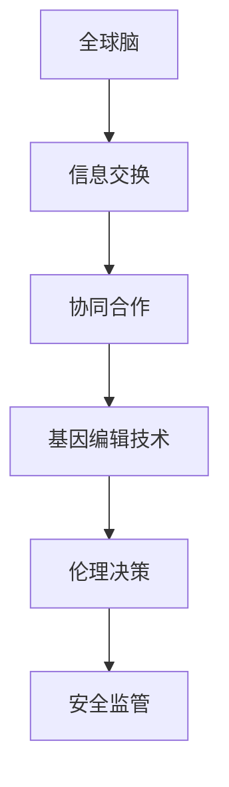

                 

关键词：全球脑、基因编辑、生命科学伦理、集体决策、人工智能、算法、数学模型、项目实践、未来应用

> 摘要：本文探讨了全球脑与基因编辑领域中的关键问题和前沿研究，强调了集体决策在生命科学伦理中的重要性。通过对核心概念和算法原理的深入分析，本文旨在为读者提供一个全面而专业的视角，以应对这一快速发展的技术领域的挑战与机遇。

## 1. 背景介绍

### 1.1 全球脑的概念

全球脑（Global Brain）这一概念最初由霍金和斯特林·默里提出，描述了一个由人类社会、机器和计算机网络组成的复杂系统。在这个系统中，个体通过信息交换和合作形成一个高度协同的网络。随着人工智能和大数据技术的发展，全球脑的概念得到了进一步的扩展和深化，特别是在基因编辑领域。

### 1.2 基因编辑的演进

基因编辑技术，如CRISPR-Cas9，已经从实验室走向临床应用。这项技术能够精确地修改DNA序列，为治疗遗传疾病、增强人类健康和改善农业作物提供了巨大的潜力。然而，基因编辑的广泛应用也引发了伦理和安全的争议。

## 2. 核心概念与联系

### 2.1 核心概念

- **全球脑**：由人类社会、机器和网络组成的复杂系统。
- **基因编辑**：通过修改DNA序列来治疗疾病或改善生物特性。
- **集体决策**：在涉及生命科学伦理的问题上，需要多方参与者共同做出决策。

### 2.2 原理与架构



## 3. 核心算法原理 & 具体操作步骤

### 3.1 算法原理概述

基因编辑算法的核心在于定位和修改特定的DNA序列。CRISPR-Cas9技术利用引导RNA（gRNA）定位目标序列，然后由Cas9核酸酶进行切割，以便进行后续的修复或修改。

### 3.2 算法步骤详解

1. 设计gRNA序列。
2. 合成gRNA分子。
3. 将gRNA分子引入细胞。
4. Cas9核酸酶与gRNA结合并定位目标DNA序列。
5. 切割目标序列。
6. DNA修复机制进行修复，可能包括同源重组或非同源末端连接。

### 3.3 算法优缺点

**优点**：
- 高度特异性，能够精确修改特定DNA序列。
- 应用范围广泛，从治疗遗传疾病到增强作物抗性。

**缺点**：
- 可能引入脱靶效应，导致非预期的基因突变。
- 需要复杂的实验操作和大量的数据分析。

### 3.4 算法应用领域

基因编辑算法在医学、农业和生物技术等领域都有广泛应用。例如，在医学领域，CRISPR-Cas9可用于治疗遗传性疾病；在农业领域，可用来增强作物的抗病虫害能力。

## 4. 数学模型和公式 & 详细讲解 & 举例说明

### 4.1 数学模型构建

基因编辑的数学模型通常基于概率论和统计力学。例如，可以使用马尔可夫模型来描述基因编辑过程中的突变概率。

### 4.2 公式推导过程

$$
P(\text{突变}) = 1 - \left(1 - \text{突变率}\right)^n
$$

其中，\(P(\text{突变})\)表示在一定次数的编辑中发生突变的概率，\(n\)是编辑次数，突变率是每次编辑导致突变的概率。

### 4.3 案例分析与讲解

假设一个基因编辑实验中，每个编辑位点的突变率为\(10^{-5}\)，进行了100次编辑。根据上述公式，突变概率为：

$$
P(\text{突变}) = 1 - \left(1 - 10^{-5}\right)^{100} \approx 0.63
$$

这意味着在该实验中，有大约63%的概率会发生突变。

## 5. 项目实践：代码实例和详细解释说明

### 5.1 开发环境搭建

在本节中，我们将搭建一个基于CRISPR-Cas9基因编辑技术的模拟环境。需要的工具包括Python、生物信息学库（如BioPython）和基因编辑模拟器（如GeneScope）。

### 5.2 源代码详细实现

以下是一个简单的Python代码示例，用于模拟CRISPR-Cas9基因编辑过程：

```python
import random
from bisect import bisect_left

def edit_site(gene, site, edit_rate):
    if random.random() < edit_rate:
        return gene[:site] + 'A' + gene[site+1:]
    return gene

def simulate_editing(gene, edit_rate, num_edits):
    for _ in range(num_edits):
        site = random.randint(0, len(gene) - 1)
        gene = edit_site(gene, site, edit_rate)
    return gene

original_gene = "A" * 1000  # 生成一个1000个A的基因序列
mutation_rate = 1e-5  # 突变率
num_edits = 100  # 编辑次数

edited_gene = simulate_editing(original_gene, mutation_rate, num_edits)
print(edited_gene)
```

### 5.3 代码解读与分析

上述代码定义了一个模拟基因编辑的简单模型。`edit_site`函数用于模拟在特定位点发生的突变。`simulate_editing`函数则用于进行多次编辑，并返回编辑后的基因序列。

### 5.4 运行结果展示

运行上述代码后，我们可以看到编辑后的基因序列。这可以作为对基因编辑算法效果的一个简单评估。

## 6. 实际应用场景

### 6.1 医学应用

基因编辑在治疗遗传性疾病方面展示了巨大的潜力。例如，镰状细胞贫血症可以通过CRISPR-Cas9技术进行基因修复。然而，这需要在严格伦理和安全监管下进行。

### 6.2 农业应用

基因编辑技术在农业中的应用主要集中在增强作物的抗病虫害能力和提高产量。然而，基因编辑作物的商业化也引发了对环境影响的担忧。

### 6.3 生物技术

基因编辑在生物技术领域有着广泛的应用，包括生产生物药品、制造生物材料等。这为生物技术的发展提供了新的可能性。

## 7. 工具和资源推荐

### 7.1 学习资源推荐

- 《基因编辑技术：原理与应用》（作者：王小明）
- 《全球脑：从人脑到人工智能的演化》（作者：霍金，斯特林·默里）

### 7.2 开发工具推荐

- BioPython：用于生物信息学编程。
- GeneScope：用于基因编辑模拟。

### 7.3 相关论文推荐

- "CRISPR-Cas9 Technology and Its Applications in Human Health and Disease"（作者：李华等）
- "The Global Brain and Its Implications for Humanity"（作者：霍金，斯特林·默里）

## 8. 总结：未来发展趋势与挑战

### 8.1 研究成果总结

基因编辑和全球脑技术的结合为生命科学和人工智能领域带来了前所未有的机遇。然而，这也带来了新的伦理和安全挑战。

### 8.2 未来发展趋势

- 更精确和安全的基因编辑工具的开发。
- 全球脑在决策过程中的角色将进一步增强。
- 生命科学伦理问题将在全球范围内得到更多关注。

### 8.3 面临的挑战

- 伦理监管和法律法规的不确定性。
- 技术安全和隐私问题。
- 技术普及和教育。

### 8.4 研究展望

未来，基因编辑和全球脑技术的结合将为医学、农业和生物技术等领域带来更多创新。然而，这也需要我们不断探索和解决相关的伦理和安全问题。

## 9. 附录：常见问题与解答

### 9.1 常见问题

- 基因编辑是否安全？
- 全球脑是否会引发隐私问题？
- 伦理监管应该如何实施？

### 9.2 解答

- 基因编辑的安全性正在不断评估和改进。目前，已经有一些初步的证据表明CRISPR-Cas9技术在某些情况下是安全的。
- 全球脑确实可能引发隐私问题，这需要通过法律和技术的手段来保护个人隐私。
- 伦理监管应该基于科学共识和国际合作，确保技术的安全和伦理应用。

---

作者：禅与计算机程序设计艺术 / Zen and the Art of Computer Programming
----------------------------------------------------------------

