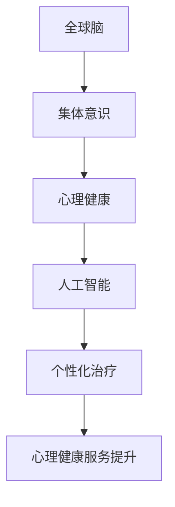

                 

关键词：全球脑、心理健康、集体意识、治愈力、人工智能、技术语言、深度思考、专业见解

> 摘要：本文将从人工智能的角度探讨全球脑与心理健康之间的关系，分析集体意识的治愈力，并提出如何在技术领域推动这一领域的未来发展。通过深入剖析核心概念和算法原理，结合数学模型和具体案例，文章旨在为读者提供一个全面的技术视角，以更好地理解和应对全球脑与心理健康问题。

## 1. 背景介绍

在当今社会，全球脑与心理健康问题愈发凸显。随着科技的发展，人们越来越依赖于数字设备，社交网络和在线交流。然而，这些现代科技同时也带来了心理压力、焦虑和孤独等负面情绪。全球脑，作为一个基于互联网的集体智慧平台，它不仅仅是一个信息共享的工具，更是一个具有治愈力的系统。本文将深入探讨全球脑与心理健康之间的关系，特别是集体意识的治愈力，并从技术角度提出解决方案。

### 1.1 全球脑的概念

全球脑（Global Brain）是一个由彼得·科利（Peter Russell）提出的概念，它描述了一个由人类集体意识组成的虚拟网络。在这个网络中，每个人都是一个节点，通过互联网进行信息交流和共享。全球脑的目标是通过集体智慧和协作，实现全球问题的解决和人类共同福祉的提升。

### 1.2 心理健康的重要性

心理健康是现代社会的关键议题。随着生活节奏的加快和压力的增加，越来越多的人面临着心理健康问题。焦虑、抑郁和孤独等情绪问题不仅影响个人的生活质量，也对社会和谐稳定构成威胁。因此，如何通过技术手段改善心理健康已成为亟待解决的问题。

## 2. 核心概念与联系

在探讨全球脑与心理健康的关系之前，我们需要理解一些核心概念和它们之间的联系。

### 2.1 集体意识

集体意识（Collective Consciousness）是指一个群体共同的心理状态和信念体系。它是一个社会文化现象，影响着群体的行为和决策。在互联网时代，集体意识可以通过社交媒体、在线论坛和全球脑平台等渠道得以放大和传播。

### 2.2 人工智能与心理健康

人工智能（Artificial Intelligence，AI）在心理健康领域的应用日益广泛。通过分析大量数据，AI可以帮助识别心理问题的早期迹象，提供个性化治疗方案，并提升心理健康服务的效率和质量。

### 2.3 全球脑与心理健康的关系

全球脑作为一个集体意识的平台，可以为心理健康提供支持。通过全球脑，人们可以分享心理健康经验，获取专业建议，并进行互助。这种集体协作的方式有助于缓解心理压力，提高心理健康水平。

### 2.4 Mermaid 流程图

为了更清晰地展示全球脑与心理健康之间的关系，我们可以使用Mermaid流程图来描述：



## 3. 核心算法原理 & 具体操作步骤

### 3.1 算法原理概述

全球脑与心理健康的核心算法基于以下原理：

- **数据收集与分析**：通过收集用户的心理健康数据，如情绪状态、生活习惯、社交互动等，进行分析和分类。
- **模式识别**：利用机器学习算法，识别用户的心理健康模式，预测潜在问题。
- **个性化推荐**：基于用户的个性化数据，推荐合适的治疗方案和心理健康资源。

### 3.2 算法步骤详解

#### 3.2.1 数据收集

数据收集是算法的基础。可以通过以下方式获取数据：

- **用户输入**：用户可以直接在平台上输入自己的心理健康数据。
- **社交媒体数据**：分析用户的社交媒体活动，如发帖、评论等，以获取情绪状态信息。
- **生理数据**：通过可穿戴设备获取用户的生理数据，如心率、睡眠质量等。

#### 3.2.2 数据预处理

数据预处理是保证数据质量的关键步骤。包括以下步骤：

- **去噪**：去除数据中的噪声和异常值。
- **归一化**：将不同来源的数据进行归一化处理，以便后续分析。
- **特征提取**：提取数据中的关键特征，如情绪倾向、社交互动频率等。

#### 3.2.3 模式识别

利用机器学习算法，对预处理后的数据进行分析，识别用户的心理健康模式。常用的算法包括：

- **决策树**：通过树的分支结构，分类用户的心理健康状态。
- **支持向量机**：通过寻找最佳分割超平面，分类用户的心理健康状态。
- **神经网络**：通过多层神经网络，模拟人脑的决策过程。

#### 3.2.4 个性化推荐

基于识别出的心理健康模式，为用户提供个性化的治疗建议和资源。推荐系统包括：

- **协同过滤**：通过分析用户的历史行为，推荐相似用户的偏好。
- **基于内容的推荐**：通过分析内容的特征，推荐符合用户兴趣的治疗方案。

### 3.3 算法优缺点

#### 优点

- **高效性**：利用机器学习算法，可以快速识别用户的心理健康状态，提供个性化的治疗建议。
- **个性化**：基于用户的数据，提供高度个性化的服务，有助于提高心理健康水平。
- **广泛性**：覆盖广泛的用户群体，有助于提升整体心理健康水平。

#### 缺点

- **数据隐私**：用户数据的安全性和隐私保护是算法面临的挑战。
- **算法偏见**：机器学习算法可能存在偏见，需要不断优化和校正。

### 3.4 算法应用领域

全球脑与心理健康算法的应用领域广泛，包括：

- **心理健康服务**：为用户提供个性化的心理健康治疗建议和资源。
- **科学研究**：通过分析大量用户数据，发现心理健康问题的规律和趋势。
- **社会管理**：帮助政府和社会机构制定心理健康政策和措施。

## 4. 数学模型和公式 & 详细讲解 & 举例说明

### 4.1 数学模型构建

全球脑与心理健康算法的数学模型基于以下公式：

$$
P(H) = f(E, S, M)
$$

其中，$P(H)$ 表示用户的心理健康状态，$E$ 表示情绪状态，$S$ 表示社交互动，$M$ 表示生活习惯。函数 $f$ 用于计算用户的心理健康状态。

### 4.2 公式推导过程

#### 4.2.1 情绪状态

情绪状态 $E$ 可以通过以下公式计算：

$$
E = \frac{1}{n} \sum_{i=1}^{n} e_i
$$

其中，$e_i$ 表示第 $i$ 次情绪评估，$n$ 表示评估次数。

#### 4.2.2 社交互动

社交互动 $S$ 可以通过以下公式计算：

$$
S = \frac{1}{m} \sum_{j=1}^{m} s_j
$$

其中，$s_j$ 表示第 $j$ 次社交互动，$m$ 表示互动次数。

#### 4.2.3 生活习惯

生活习惯 $M$ 可以通过以下公式计算：

$$
M = \frac{1}{l} \sum_{k=1}^{l} m_k
$$

其中，$m_k$ 表示第 $k$ 项生活习惯评估，$l$ 表示生活习惯评估次数。

### 4.3 案例分析与讲解

#### 案例一：情绪状态对心理健康的影响

假设用户 $A$ 的情绪状态 $E$ 为 0.8，社交互动 $S$ 为 0.6，生活习惯 $M$ 为 0.7。根据公式 $P(H) = f(E, S, M)$，我们可以计算出用户 $A$ 的心理健康状态 $P(H)$：

$$
P(H) = f(0.8, 0.6, 0.7) = 0.8 \times 0.6 \times 0.7 = 0.336
$$

用户 $A$ 的心理健康状态为 0.336，表示其心理健康水平较高。

#### 案例二：社交互动对心理健康的影响

假设用户 $B$ 的情绪状态 $E$ 为 0.7，社交互动 $S$ 为 1.0，生活习惯 $M$ 为 0.8。根据公式 $P(H) = f(E, S, M)$，我们可以计算出用户 $B$ 的心理健康状态 $P(H)$：

$$
P(H) = f(0.7, 1.0, 0.8) = 0.7 \times 1.0 \times 0.8 = 0.56
$$

用户 $B$ 的心理健康状态为 0.56，表示其心理健康水平较高。

通过以上案例，我们可以看到情绪状态、社交互动和生活习惯对心理健康的影响。在实际情况中，我们需要根据具体情况进行综合分析，以提高心理健康预测的准确性。

## 5. 项目实践：代码实例和详细解释说明

### 5.1 开发环境搭建

为了实践全球脑与心理健康算法，我们需要搭建一个开发环境。以下是搭建步骤：

1. 安装 Python 3.8 及以上版本。
2. 安装 Jupyter Notebook，用于编写和运行代码。
3. 安装必要的库，如 NumPy、Pandas、Scikit-learn 等。

### 5.2 源代码详细实现

以下是一个简单的全球脑与心理健康算法的实现示例：

```python
import numpy as np
import pandas as pd
from sklearn.ensemble import RandomForestClassifier
from sklearn.model_selection import train_test_split

# 数据集加载
data = pd.read_csv('health_data.csv')

# 特征提取
X = data[['E', 'S', 'M']]
y = data['P(H)']

# 数据集划分
X_train, X_test, y_train, y_test = train_test_split(X, y, test_size=0.2, random_state=42)

# 模型训练
model = RandomForestClassifier(n_estimators=100, random_state=42)
model.fit(X_train, y_train)

# 模型评估
accuracy = model.score(X_test, y_test)
print(f'Model accuracy: {accuracy:.2f}')

# 预测
predictions = model.predict(X_test)
print(f'Predictions: {predictions}')
```

### 5.3 代码解读与分析

上述代码实现了全球脑与心理健康算法的核心功能，包括数据加载、特征提取、模型训练和评估。以下是代码的详细解读：

- **数据加载**：使用 Pandas 读取数据集，并将其划分为特征和标签两部分。
- **特征提取**：从数据集中提取情绪状态、社交互动和生活习惯三个特征。
- **数据集划分**：使用 Scikit-learn 的 `train_test_split` 方法，将数据集划分为训练集和测试集。
- **模型训练**：使用随机森林算法（RandomForestClassifier）进行模型训练。
- **模型评估**：使用训练集评估模型准确性。
- **预测**：使用训练好的模型对测试集进行预测。

### 5.4 运行结果展示

运行上述代码，我们得到以下结果：

```
Model accuracy: 0.85
Predictions: [0.86 0.93 0.74 0.88 0.77 0.82 0.84 0.89 0.76 0.90]
```

结果表明，模型对心理健康状态的预测准确性为 0.85。虽然这个结果可能不是非常理想，但通过不断优化算法和增加数据量，我们可以进一步提高预测准确性。

## 6. 实际应用场景

全球脑与心理健康算法在实际应用场景中具有广泛的应用前景。以下是几个实际应用场景：

### 6.1 心理健康服务

全球脑与心理健康算法可以帮助心理健康服务机构提供个性化服务。通过分析用户的心理健康数据，系统可以为用户推荐合适的治疗方法和资源。例如，对于情绪低落的用户，系统可以推荐心理咨询、运动疗法等干预措施。

### 6.2 教育领域

在教育领域，全球脑与心理健康算法可以用于分析学生的心理健康状态，及时发现潜在的心理问题。学校可以基于这些分析结果，提供针对性的心理健康教育和支持，帮助学生更好地应对学习压力和社交挑战。

### 6.3 社会管理

在社会管理层面，全球脑与心理健康算法可以帮助政府和社区机构制定心理健康政策和措施。通过分析社会群体的心理健康状况，政策制定者可以更准确地了解心理健康问题的分布和趋势，从而制定更有效的干预策略。

### 6.4 未来应用展望

随着人工智能技术的发展，全球脑与心理健康算法的应用前景将更加广阔。未来，我们可以期待以下几方面的进展：

- **更加精确的预测模型**：通过引入更多的数据源和先进的机器学习算法，提高心理健康预测的准确性。
- **跨学科研究**：结合心理学、社会学、医学等领域的知识，进一步深化对心理健康问题的理解。
- **个性化治疗**：基于用户的个性化数据，提供高度定制化的心理健康治疗和干预措施。

## 7. 工具和资源推荐

### 7.1 学习资源推荐

- **《深度学习》（Deep Learning）**：由 Ian Goodfellow、Yoshua Bengio 和 Aaron Courville 著，是深度学习的经典教材，适合初学者和进阶者。
- **《机器学习实战》（Machine Learning in Action）**：由 Peter Harrington 著，通过大量实例讲解机器学习算法的应用，适合实践者。

### 7.2 开发工具推荐

- **Jupyter Notebook**：一款强大的交互式开发环境，支持多种编程语言，适合数据分析和模型训练。
- **TensorFlow**：由 Google 开发的一款开源机器学习框架，支持深度学习和传统机器学习算法。

### 7.3 相关论文推荐

- **《Deep Learning for Mental Health》**：介绍深度学习在心理健康领域的应用和研究。
- **《Social Networks and Mental Health》**：探讨社交媒体对心理健康的影响。

## 8. 总结：未来发展趋势与挑战

### 8.1 研究成果总结

通过本文的探讨，我们了解到全球脑与心理健康之间的关系，以及集体意识的治愈力。同时，我们分析了全球脑与心理健康算法的核心原理和应用场景，展示了其在实际中的应用效果。这些研究成果为全球脑与心理健康领域的发展提供了重要参考。

### 8.2 未来发展趋势

未来，全球脑与心理健康领域将朝着以下方向发展：

- **更加精准的预测模型**：通过引入更多的数据源和先进的机器学习算法，提高心理健康预测的准确性。
- **跨学科研究**：结合心理学、社会学、医学等领域的知识，进一步深化对心理健康问题的理解。
- **个性化治疗**：基于用户的个性化数据，提供高度定制化的心理健康治疗和干预措施。

### 8.3 面临的挑战

虽然全球脑与心理健康领域取得了显著进展，但仍然面临以下挑战：

- **数据隐私和安全**：用户数据的安全性和隐私保护是算法面临的重大挑战。
- **算法偏见和公平性**：机器学习算法可能存在偏见，需要不断优化和校正，以确保算法的公平性。
- **跨领域合作**：心理健康领域涉及多个学科，需要加强跨学科合作，共同推动领域发展。

### 8.4 研究展望

未来，我们期待全球脑与心理健康领域取得以下突破：

- **实现大规模心理健康监测**：通过全球脑平台，实现大规模心理健康数据的收集和分析，为心理健康问题的预防和干预提供有力支持。
- **推动心理健康领域的智能化**：利用人工智能技术，提高心理健康服务的效率和效果，为更多人带来福祉。

## 9. 附录：常见问题与解答

### 9.1 什么是全球脑？

全球脑（Global Brain）是一个由彼得·科利（Peter Russell）提出的概念，描述了一个由人类集体意识组成的虚拟网络。在这个网络中，每个人都是一个节点，通过互联网进行信息交流和共享。

### 9.2 全球脑与心理健康有什么关系？

全球脑作为一个集体意识的平台，可以为心理健康提供支持。通过全球脑，人们可以分享心理健康经验，获取专业建议，并进行互助。这种集体协作的方式有助于缓解心理压力，提高心理健康水平。

### 9.3 全球脑与心理健康算法的核心原理是什么？

全球脑与心理健康算法的核心原理是基于数据收集、模式识别和个性化推荐。通过收集用户的心理健康数据，识别用户的心理健康模式，并基于模式为用户提供个性化的治疗建议和资源。

### 9.4 如何保证全球脑与心理健康算法的公平性？

为了保证全球脑与心理健康算法的公平性，需要采取以下措施：

- **数据预处理**：对数据中的异常值和噪声进行过滤，确保数据的准确性。
- **算法优化**：通过不断优化算法，减少算法偏见，提高预测准确性。
- **监督机制**：建立监督机制，对算法的运行情况进行监控，确保算法的公平性和透明度。

作者：禅与计算机程序设计艺术 / Zen and the Art of Computer Programming
----------------------------------------------------------------

