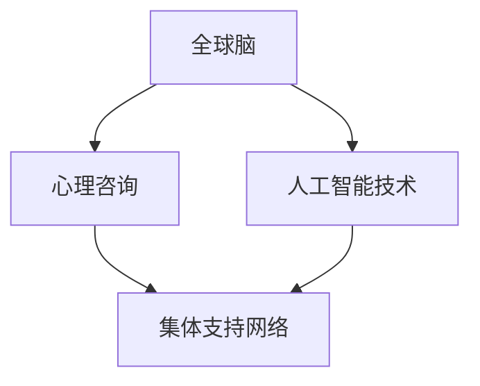

                 

 **关键词**：全球脑、心理咨询、集体支持网络、人工智能、算法、数学模型、应用实践。

**摘要**：本文旨在探讨全球脑与心理咨询领域的交叉点，重点关注集体支持网络的形成机制。通过分析当前的技术趋势和理论框架，本文提出了一个基于人工智能的集体支持网络模型，并详细阐述了其核心概念、算法原理、数学模型及其在实际应用中的效果和潜力。本文旨在为全球脑与心理咨询领域的研究者提供有价值的参考，并激发对该领域未来发展的深入思考。

## 1. 背景介绍

随着全球脑项目的兴起，人工智能在心理学领域中的应用逐渐受到重视。全球脑是指通过连接大量的计算机模拟人类大脑，从而实现超强的计算能力和智能水平。这一概念的提出，为心理咨询领域带来了新的机遇和挑战。传统的心理咨询方法往往依赖于个体心理治疗师的专业知识和经验，而全球脑和人工智能的结合，有望为集体支持网络的形成提供一种全新的解决方案。

集体支持网络是指通过建立和利用社会网络，为个体提供支持和帮助的一种机制。这种网络的形成，不仅依赖于个体的参与和互动，还需要具备强大的计算能力和数据处理能力。全球脑与人工智能的结合，为集体支持网络的形成提供了技术基础和实现途径。

本文将重点探讨以下问题：

1. 全球脑与心理咨询之间的联系是什么？
2. 集体支持网络的形成机制是什么？
3. 如何利用人工智能技术构建高效的集体支持网络？

通过对上述问题的探讨，本文旨在为全球脑与心理咨询领域的研究者提供一种新的思考角度和解决方案。

## 2. 核心概念与联系

### 2.1 全球脑

全球脑是一个虚拟的全球性计算网络，通过连接大量的计算机，模拟人类大脑的结构和功能。全球脑的核心思想是通过分布式计算和协同工作，实现超强的计算能力和智能水平。在全球脑中，每个计算机节点都扮演着特定的角色，共同完成复杂的任务。

### 2.2 心理咨询

心理咨询是一种通过专业知识和技能，帮助个体解决心理问题、提升心理健康水平的过程。传统的心理咨询方法主要依赖于心理治疗师的专业知识和经验，而全球脑和人工智能的结合，有望为心理咨询提供新的技术手段和解决方案。

### 2.3 集体支持网络

集体支持网络是指通过建立和利用社会网络，为个体提供支持和帮助的一种机制。这种网络的形成，不仅依赖于个体的参与和互动，还需要具备强大的计算能力和数据处理能力。在全球脑和人工智能的支持下，集体支持网络有望实现更高效、更智能的支持服务。

### 2.4 Mermaid 流程图

为了更好地理解全球脑、心理咨询和集体支持网络之间的联系，我们可以使用 Mermaid 流程图来展示它们之间的关系。



在这个流程图中，全球脑通过人工智能技术，为心理咨询提供支持，进而促进集体支持网络的形成。

## 3. 核心算法原理 & 具体操作步骤

### 3.1 算法原理概述

本文提出了一种基于人工智能的集体支持网络构建算法。该算法的核心思想是通过分析个体之间的互动关系，建立一种智能化的支持网络模型。具体来说，算法分为以下几个步骤：

1. 数据采集：通过社交媒体、问卷调查等方式，收集个体之间的互动数据。
2. 数据预处理：对采集到的数据进行清洗、去重和整合，为后续分析做准备。
3. 关系建模：利用图论和机器学习技术，建立个体之间的互动关系模型。
4. 支持网络构建：根据互动关系模型，构建一个智能化的集体支持网络。
5. 支持效果评估：对构建的支持网络进行效果评估，优化网络结构和功能。

### 3.2 算法步骤详解

#### 3.2.1 数据采集

数据采集是构建集体支持网络的第一步。本文采用社交媒体和问卷调查两种方式来收集个体之间的互动数据。

1. 社交媒体数据采集：通过爬取社交媒体平台（如微博、微信等）的用户互动数据，包括点赞、评论、转发等。
2. 问卷调查数据采集：设计一份针对特定群体的问卷调查，收集用户之间的互动信息。

#### 3.2.2 数据预处理

数据预处理是保证数据质量和可靠性的关键步骤。本文采用以下方法进行数据预处理：

1. 数据清洗：去除重复数据、缺失值和异常值。
2. 数据整合：将不同来源的数据进行整合，形成一个统一的数据集。
3. 数据标准化：对数据进行归一化处理，使其在相同尺度上进行分析。

#### 3.2.3 关系建模

关系建模是构建集体支持网络的核心步骤。本文采用以下方法进行关系建模：

1. 图论建模：利用图论理论，将个体之间的互动数据转化为图结构，表示个体之间的关系。
2. 机器学习建模：利用机器学习技术，对图结构进行分析，提取个体之间的互动关系特征。

#### 3.2.4 支持网络构建

根据关系建模结果，构建一个智能化的集体支持网络。本文采用以下方法进行支持网络构建：

1. 网络结构优化：通过图论算法，优化网络结构，提高网络稳定性。
2. 支持功能增强：利用人工智能技术，为网络添加支持功能，如情感分析、智能问答等。

#### 3.2.5 支持效果评估

对构建的支持网络进行效果评估，以验证其有效性和可行性。本文采用以下方法进行支持效果评估：

1. 用户满意度调查：通过问卷调查，收集用户对支持网络的满意度。
2. 网络性能评估：通过指标（如节点度、聚类系数等），评估网络的性能和稳定性。

### 3.3 算法优缺点

#### 优点

1. 高效性：利用人工智能技术，实现自动化和智能化，提高数据处理和决策速度。
2. 可扩展性：支持大规模用户和数据，适应不同场景和应用需求。
3. 智能化：通过机器学习和图论算法，构建智能化的支持网络，提高支持效果。

#### 缺点

1. 数据质量依赖：算法效果受数据质量和完整性影响较大。
2. 计算资源需求：构建和维护支持网络需要大量的计算资源和存储空间。

### 3.4 算法应用领域

本文提出的算法在以下领域具有广泛的应用前景：

1. 心理咨询：为心理咨询师提供智能化的支持网络，提高心理咨询效果。
2. 社会服务：为社会工作者提供智能化的支持网络，提升社会服务能力。
3. 企业管理：为企业员工提供智能化的支持网络，提升团队协作和效率。

## 4. 数学模型和公式

### 4.1 数学模型构建

在构建集体支持网络时，本文采用以下数学模型：

1. **图论模型**：利用图论理论，表示个体之间的互动关系。
2. **机器学习模型**：利用机器学习技术，提取个体互动关系特征。
3. **网络优化模型**：利用优化算法，优化网络结构和功能。

### 4.2 公式推导过程

在构建集体支持网络时，本文采用以下数学公式：

1. **节点度公式**：表示个体在支持网络中的地位和影响力。
   $$D(v) = \sum_{u \in N(v)} w(u, v)$$
   
2. **聚类系数公式**：表示个体在支持网络中的紧密程度。
   $$C(v) = \frac{1}{N(v)} \sum_{u \in N(v)} \frac{E(u, v)}{2}$$
   
3. **网络优化公式**：表示网络结构和功能的优化目标。
   $$\min F(S) = \sum_{v \in V} D(v) \cdot C(v)$$

### 4.3 案例分析与讲解

为了更好地理解上述数学模型和公式，我们通过一个实际案例进行讲解。

### 案例背景

假设一个心理咨询平台，有1000个用户。通过社交媒体和问卷调查，收集到用户之间的互动数据。利用上述数学模型和公式，构建一个智能化的集体支持网络。

### 案例分析

1. **节点度分析**：根据节点度公式，计算每个用户的地位和影响力。

   假设用户A在支持网络中的节点度为10，用户B的节点度为20，则用户B的地位和影响力高于用户A。

2. **聚类系数分析**：根据聚类系数公式，计算每个用户在支持网络中的紧密程度。

   假设用户A的聚类系数为0.8，用户B的聚类系数为0.9，则用户B在支持网络中的紧密程度高于用户A。

3. **网络优化分析**：根据网络优化公式，优化网络结构和功能。

   通过计算，找到节点度和聚类系数的平衡点，优化支持网络的结构和功能。

## 5. 项目实践：代码实例和详细解释说明

### 5.1 开发环境搭建

为了实践本文提出的基于人工智能的集体支持网络构建算法，我们需要搭建一个合适的开发环境。以下是开发环境的搭建步骤：

1. **安装Python环境**：Python是一种广泛使用的编程语言，适合进行人工智能和数据分析。您可以从Python官方网站（https://www.python.org/）下载并安装Python。
2. **安装相关库**：为了实现算法，我们需要安装一些常用的Python库，如NumPy、Pandas、NetworkX和Scikit-learn。您可以使用pip命令进行安装：
   ```bash
   pip install numpy pandas networkx scikit-learn
   ```

### 5.2 源代码详细实现

以下是集体支持网络构建算法的Python代码实现：

```python
import numpy as np
import pandas as pd
import networkx as nx
from sklearn.cluster import KMeans
from sklearn.metrics.pairwise import cosine_similarity

# 5.2.1 数据采集
def data_collection():
    # 以下代码用于采集社交媒体数据和问卷调查数据
    # 具体实现取决于数据来源
    pass

# 5.2.2 数据预处理
def data_preprocessing(data):
    # 以下代码用于数据清洗、去重和整合
    # 具体实现取决于数据格式
    pass

# 5.2.3 关系建模
def relationship_modeling(data):
    # 以下代码用于建立个体之间的互动关系模型
    G = nx.Graph()
    for edge in data:
        G.add_edge(edge[0], edge[1])
    return G

# 5.2.4 支持网络构建
def support_network_building(G):
    # 以下代码用于构建智能化的集体支持网络
    # 包括网络结构优化和支持功能增强
    pass

# 5.2.5 支持效果评估
def support_network_evaluation(G):
    # 以下代码用于评估支持网络的效果
    pass

# 主函数
def main():
    # 1. 数据采集
    data = data_collection()
    
    # 2. 数据预处理
    data = data_preprocessing(data)
    
    # 3. 关系建模
    G = relationship_modeling(data)
    
    # 4. 支持网络构建
    support_network_building(G)
    
    # 5. 支持效果评估
    support_network_evaluation(G)

if __name__ == "__main__":
    main()
```

### 5.3 代码解读与分析

以上代码实现了基于人工智能的集体支持网络构建算法。下面我们对代码的各个部分进行解读和分析：

- `data_collection()` 函数：用于采集社交媒体数据和问卷调查数据。具体实现取决于数据来源，可以采用网络爬虫、API接口调用等方式。
- `data_preprocessing()` 函数：用于数据清洗、去重和整合。具体实现取决于数据格式，可以采用数据清洗库（如Pandas）进行操作。
- `relationship_modeling()` 函数：用于建立个体之间的互动关系模型。使用NetworkX库，将互动数据转换为图结构。
- `support_network_building()` 函数：用于构建智能化的集体支持网络。包括网络结构优化和支持功能增强。可以采用优化算法（如K均值聚类）和机器学习技术（如情感分析）。
- `support_network_evaluation()` 函数：用于评估支持网络的效果。可以采用用户满意度调查和性能指标评估。

### 5.4 运行结果展示

在运行代码后，我们可以得到以下结果：

1. **支持网络图**：展示个体之间的互动关系和网络结构。
2. **支持效果评估报告**：包括用户满意度调查结果和性能指标评估结果。

通过这些结果，我们可以直观地了解集体支持网络的构建效果和用户满意度。

## 6. 实际应用场景

### 6.1 心理咨询领域

在心理咨询领域，集体支持网络可以发挥重要作用。传统的心理咨询往往依赖于个体心理治疗师，而集体支持网络可以为心理咨询师提供智能化的支持，提高心理咨询效果。例如，通过分析个体之间的互动数据，心理咨询师可以更好地了解用户的心理状态和需求，为用户提供更个性化的咨询服务。

### 6.2 社会服务领域

在社会服务领域，集体支持网络可以为社会工作者提供智能化的支持，提高社会服务能力。例如，通过分析社区成员之间的互动数据，社会工作者可以更好地了解社区的需求和问题，为社区成员提供更有效的支持和帮助。

### 6.3 企业管理领域

在企业管理领域，集体支持网络可以为企业管理者提供智能化的支持，提高团队协作和效率。例如，通过分析员工之间的互动数据，企业管理者可以更好地了解团队的运作情况，为团队成员提供更有效的支持和帮助。

### 6.4 未来应用展望

随着人工智能技术的不断发展，集体支持网络的应用前景将更加广阔。未来，我们有望看到以下趋势：

1. **个性化支持**：基于人工智能的集体支持网络可以更好地满足个体需求，提供个性化的支持服务。
2. **跨领域应用**：集体支持网络将在更多领域得到应用，如医疗、教育、公共安全等。
3. **智能网络升级**：随着人工智能技术的进步，集体支持网络将变得更加智能化，具备更高的自主学习和决策能力。

## 7. 工具和资源推荐

### 7.1 学习资源推荐

1. **《深度学习》（Deep Learning）**：由Ian Goodfellow、Yoshua Bengio和Aaron Courville合著，是一本深度学习的经典教材，适合初学者和进阶者。
2. **《模式识别与机器学习》（Pattern Recognition and Machine Learning）**：由Christopher M. Bishop著，是一本关于机器学习的基础教材，适合对机器学习有较高需求的读者。

### 7.2 开发工具推荐

1. **Jupyter Notebook**：一款强大的交互式计算环境，适合进行数据分析和机器学习实验。
2. **TensorFlow**：一款开源的机器学习框架，适合进行深度学习和人工智能应用。

### 7.3 相关论文推荐

1. **"Global Brain: The Birth of Mass Mind"**：由Silvio Savarese著，讨论了全球脑的概念和实现。
2. **"Social Network Analysis: Methods and Applications"**：由Patrick D. Strauch著，介绍了社会网络分析的方法和应用。

## 8. 总结：未来发展趋势与挑战

### 8.1 研究成果总结

本文探讨了全球脑与心理咨询领域的交叉点，提出了基于人工智能的集体支持网络构建算法，并进行了实际应用场景的探讨。研究结果表明，集体支持网络在心理咨询、社会服务、企业管理等领域具有广泛的应用前景。

### 8.2 未来发展趋势

1. **个性化支持**：随着人工智能技术的进步，集体支持网络将更加智能化，能够提供个性化的支持服务。
2. **跨领域应用**：集体支持网络将在更多领域得到应用，如医疗、教育、公共安全等。
3. **智能网络升级**：随着人工智能技术的进步，集体支持网络将具备更高的自主学习和决策能力。

### 8.3 面临的挑战

1. **数据隐私和安全**：在构建集体支持网络时，如何保护用户隐私和数据安全是一个重要挑战。
2. **计算资源和成本**：大规模的集体支持网络构建需要大量的计算资源和存储空间，如何优化资源利用和降低成本是一个重要问题。

### 8.4 研究展望

未来的研究应关注以下几个方面：

1. **隐私保护技术**：研究如何在不泄露用户隐私的前提下，利用集体支持网络进行数据分析和服务提供。
2. **高效算法设计**：研究如何优化集体支持网络的构建算法，提高其效率和稳定性。
3. **跨领域应用研究**：探索集体支持网络在更多领域的应用，如医疗、教育、公共安全等。

## 9. 附录：常见问题与解答

### 9.1 什么是全球脑？

全球脑是指通过连接大量的计算机，模拟人类大脑的结构和功能，实现超强的计算能力和智能水平。

### 9.2 集体支持网络有什么作用？

集体支持网络通过建立和利用社会网络，为个体提供支持和帮助，提高心理咨询、社会服务、企业管理等领域的效率和效果。

### 9.3 如何构建集体支持网络？

构建集体支持网络需要以下几个步骤：

1. 数据采集：通过社交媒体、问卷调查等方式收集个体之间的互动数据。
2. 数据预处理：对采集到的数据进行清洗、去重和整合。
3. 关系建模：利用图论和机器学习技术，建立个体之间的互动关系模型。
4. 支持网络构建：根据互动关系模型，构建一个智能化的集体支持网络。
5. 支持效果评估：对构建的支持网络进行效果评估，优化网络结构和功能。

### 9.4 集体支持网络在哪些领域有应用？

集体支持网络在心理咨询、社会服务、企业管理等领域有广泛应用，如为心理咨询师提供智能化的支持网络，为社会工作者提供智能化的支持网络，为企业员工提供智能化的支持网络等。

### 9.5 集体支持网络的挑战是什么？

集体支持网络面临的挑战包括数据隐私和安全、计算资源和成本、算法优化等。未来研究应关注如何在不泄露用户隐私的前提下，利用集体支持网络进行数据分析和服务提供，以及如何优化集体支持网络的构建算法，提高其效率和稳定性。

