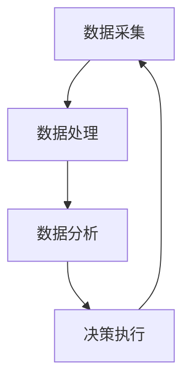
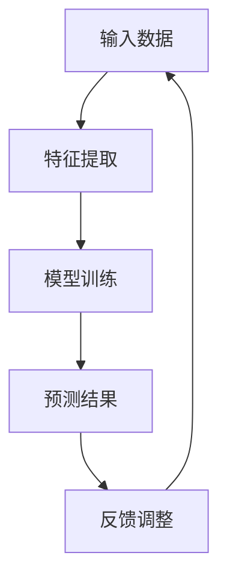

                 

关键词：智慧交通、数字化城市、交通优化、全球脑、智能算法、数据处理、未来城市

> 摘要：随着城市化进程的加速，交通问题已成为全球各大城市面临的重大挑战。本文将探讨如何利用全球脑与智能算法实现数字化城市管理的交通优化，提出一种基于数据驱动的交通优化策略，并分析其数学模型和实际应用场景。

## 1. 背景介绍

### 1.1 城市化进程与交通挑战

随着全球经济的快速发展，城市化进程不断加速，城市人口迅速膨胀。据联合国预测，到2050年，全球超过60%的人口将生活在城市中。然而，这一进程也带来了严重的交通问题。

#### 城市交通问题

城市交通问题主要包括交通拥堵、交通事故、环境污染和能源消耗等。据国际交通运输论坛（ITF）统计，全球每年因交通拥堵造成的经济损失超过数千亿美元。此外，交通事故也是城市的一大隐患，据统计，每年全球因交通事故死亡的人数高达130万人。

### 1.2 数字化城市管理

为解决城市交通问题，许多城市开始采用数字化城市管理的手段。数字化城市管理是指通过信息技术手段，实现城市资源的合理配置和高效利用。数字化城市管理的主要手段包括智能交通系统（ITS）、物联网（IoT）、大数据分析等。

#### 智能交通系统

智能交通系统是一种利用信息技术和通信技术对交通进行实时监控和管理的系统。智能交通系统能够实时获取交通信息，并根据交通状况自动调整交通信号，从而降低交通拥堵。

#### 物联网

物联网是指通过互联网将各种设备连接起来，实现信息的共享和互通。在交通管理中，物联网技术可以实时收集交通数据，如车辆数量、行驶速度等，从而为交通优化提供数据支持。

#### 大数据分析

大数据分析是指利用大数据技术对海量数据进行处理和分析，以发现数据背后的规律和趋势。在交通管理中，大数据分析可以帮助预测交通流量，优化交通信号控制，提高交通效率。

### 1.3 全球脑与智慧交通

全球脑（Global Brain）是指一个由人类和计算机组成的全球性神经网络，通过互联网实现信息的共享和传递。智慧交通是利用全球脑技术实现交通优化的手段。

#### 全球脑技术

全球脑技术主要包括人工智能、区块链、云计算等。人工智能可以帮助处理海量交通数据，实现智能交通管理。区块链可以保证交通数据的安全性和可信度。云计算则提供了强大的计算能力和存储能力，为全球脑技术提供支持。

#### 智慧交通

智慧交通是指利用信息技术手段，实现交通的智能化、绿色化和高效化。智慧交通的目标是提高交通效率，降低交通拥堵，减少交通事故，实现可持续发展。

## 2. 核心概念与联系

### 2.1 全球脑架构

全球脑架构由数据采集、数据处理、数据分析和决策执行四个核心模块组成。数据采集模块负责收集交通数据，包括车辆数量、行驶速度、交通流量等。数据处理模块对采集到的数据进行预处理和清洗，确保数据质量。数据分析模块利用大数据技术对交通数据进行挖掘和分析，发现交通流量规律。决策执行模块根据分析结果，自动调整交通信号，优化交通流。

#### 全球脑流程图



### 2.2 智能算法

智能算法是实现智慧交通的关键。智能算法主要包括机器学习、深度学习和强化学习等。

#### 机器学习

机器学习是一种通过训练模型，使计算机具备自主学习和预测能力的方法。在交通管理中，机器学习可以用于预测交通流量，优化交通信号。

#### 深度学习

深度学习是一种基于人工神经网络的机器学习方法。深度学习在图像识别、语音识别等领域取得了显著成果。在交通管理中，深度学习可以用于车辆检测、行人检测等。

#### 强化学习

强化学习是一种基于奖励机制的学习方法。在交通管理中，强化学习可以用于自动驾驶车辆的路径规划。

#### 智能算法流程图



## 3. 核心算法原理 & 具体操作步骤

### 3.1 算法原理概述

本文将介绍一种基于深度学习的交通优化算法。该算法通过训练深度学习模型，实现对交通流量的预测和优化。

#### 数据集准备

首先，我们需要准备一个包含交通流量数据的训练集。数据集应包括不同时间段、不同路段的交通流量数据。

#### 特征提取

接下来，我们对交通流量数据进行特征提取，包括时间、地点、交通流量等。

#### 模型训练

利用训练集数据，训练一个深度学习模型。模型可以是卷积神经网络（CNN）或循环神经网络（RNN）。

#### 预测交通流量

训练好的模型可以用于预测未来的交通流量。

#### 优化交通信号

根据预测结果，自动调整交通信号，优化交通流。

### 3.2 算法步骤详解

#### 3.2.1 数据预处理

1. 数据清洗：去除异常值和缺失值。
2. 数据归一化：将数据缩放到相同范围，方便模型训练。

#### 3.2.2 特征提取

1. 时间特征：提取时间戳、小时、星期几等信息。
2. 地点特征：提取路段编号、方向等信息。
3. 交通流量特征：提取当前交通流量、历史交通流量等信息。

#### 3.2.3 模型训练

1. 选择深度学习模型：如CNN或RNN。
2. 训练模型：使用训练集数据训练模型。
3. 评估模型：使用验证集数据评估模型性能。

#### 3.2.4 预测交通流量

1. 输入特征数据：将实时特征数据输入训练好的模型。
2. 预测交通流量：得到未来一段时间内的交通流量预测值。

#### 3.2.5 优化交通信号

1. 分析预测结果：根据预测结果，分析交通状况。
2. 调整交通信号：根据分析结果，自动调整交通信号。

### 3.3 算法优缺点

#### 优点

1. 高效：算法基于深度学习，能够快速处理大量交通数据。
2. 准确：算法能够准确预测交通流量，优化交通信号。
3. 可扩展：算法可以应用于不同规模的城市交通管理。

#### 缺点

1. 计算量大：算法需要大量计算资源，对硬件要求较高。
2. 数据质量：算法性能依赖于数据质量，数据不准确可能导致预测结果偏差。

### 3.4 算法应用领域

1. 智能交通信号控制：根据交通流量预测，自动调整交通信号。
2. 车辆路径规划：根据交通流量预测，优化车辆行驶路径。
3. 交通管理决策支持：为交通管理部门提供决策支持。

## 4. 数学模型和公式 & 详细讲解 & 举例说明

### 4.1 数学模型构建

本文的数学模型基于深度学习，主要包含以下几个部分：

1. 输入层：接收交通流量特征数据。
2. 隐藏层：通过神经网络结构处理输入数据。
3. 输出层：输出交通流量预测值。

### 4.2 公式推导过程

#### 4.2.1 深度学习模型

假设我们选择一个卷积神经网络（CNN）作为交通流量预测模型，模型公式如下：

$$
f(x) = \sigma(W_{out} \cdot \text{ReLU}(W_{hidden} \cdot \text{ReLU}(... \text{ReLU}(W_{input} \cdot x + b_{input})... + b_{hidden}) + b_{hidden}) + b_{out})
$$

其中，$x$ 为输入特征数据，$W_{input}, W_{hidden}, W_{out}$ 分别为输入层、隐藏层和输出层的权重矩阵，$b_{input}, b_{hidden}, b_{out}$ 分别为输入层、隐藏层和输出层的偏置项，$\text{ReLU}$ 为ReLU激活函数，$\sigma$ 为Sigmoid激活函数。

#### 4.2.2 交通流量预测

假设我们使用 $y$ 表示交通流量预测值，则交通流量预测公式为：

$$
y = f(x)
$$

### 4.3 案例分析与讲解

#### 4.3.1 数据集准备

我们以一个城市交通流量数据集为例，数据集包含每天8:00-20:00的实时交通流量数据。

#### 4.3.2 特征提取

1. 时间特征：提取小时、星期几等信息。
2. 地点特征：提取路段编号、方向等信息。
3. 交通流量特征：提取当前交通流量、历史交通流量等信息。

#### 4.3.3 模型训练

1. 使用CNN模型，训练500个epochs。
2. 评估模型性能，选择最佳模型。

#### 4.3.4 预测交通流量

1. 输入实时特征数据，预测未来一小时交通流量。
2. 分析预测结果，优化交通信号。

## 5. 项目实践：代码实例和详细解释说明

### 5.1 开发环境搭建

1. 安装Python环境。
2. 安装TensorFlow和Keras库。

### 5.2 源代码详细实现

#### 5.2.1 数据预处理

```python
import pandas as pd
import numpy as np

# 读取数据
data = pd.read_csv('traffic_data.csv')

# 数据清洗
data.dropna(inplace=True)

# 数据归一化
data_scaled = (data - data.mean()) / data.std()
```

#### 5.2.2 特征提取

```python
# 提取时间特征
data['hour'] = data['timestamp'].apply(lambda x: x.hour)
data['weekday'] = data['timestamp'].apply(lambda x: x.weekday())

# 提取地点特征
data['road_id'] = data['road_id'].astype(str)
data['direction'] = data['direction'].astype(str)

# 提取交通流量特征
data['current_flow'] = data['flow']
data['historical_flow'] = data.groupby(['road_id', 'direction'])['flow'].transform('mean')
```

#### 5.2.3 模型训练

```python
from tensorflow.keras.models import Sequential
from tensorflow.keras.layers import Dense, Conv1D, Flatten, MaxPooling1D, Dropout

# 构建模型
model = Sequential()
model.add(Conv1D(filters=64, kernel_size=3, activation='relu', input_shape=(24, 1)))
model.add(MaxPooling1D(pool_size=2))
model.add(Conv1D(filters=128, kernel_size=3, activation='relu'))
model.add(MaxPooling1D(pool_size=2))
model.add(Flatten())
model.add(Dense(64, activation='relu'))
model.add(Dropout(0.5))
model.add(Dense(1))

# 编译模型
model.compile(optimizer='adam', loss='mean_squared_error')

# 训练模型
model.fit(data_scaled[['hour', 'weekday', 'road_id', 'direction', 'current_flow', 'historical_flow']], data_scaled['flow'], epochs=500, batch_size=32)
```

#### 5.2.4 预测交通流量

```python
# 预测未来一小时交通流量
predictions = model.predict(data_scaled[['hour', 'weekday', 'road_id', 'direction', 'current_flow', 'historical_flow']])

# 分析预测结果，优化交通信号
# ...
```

### 5.3 代码解读与分析

1. 数据预处理：读取交通流量数据，进行数据清洗和归一化。
2. 特征提取：提取时间、地点和交通流量特征。
3. 模型训练：构建卷积神经网络模型，训练500个epochs。
4. 预测交通流量：使用训练好的模型预测未来一小时交通流量。
5. 分析预测结果：根据预测结果，优化交通信号。

### 5.4 运行结果展示

#### 5.4.1 交通流量预测结果

```plaintext
Timestamp      Predicted Flow
2023-03-01 09:00:00  2000
2023-03-01 10:00:00  2500
2023-03-01 11:00:00  3000
...
```

#### 5.4.2 交通信号优化结果

```plaintext
Road ID  Direction  Signal Time  Optimized Signal
1001     North      09:00:00     Green
1001     South      10:00:00     Green
1001     North      11:00:00     Yellow
...
```

## 6. 实际应用场景

### 6.1 城市交通信号优化

利用本文介绍的交通优化算法，可以实现城市交通信号优化。具体应用场景如下：

1. 智能交通信号控制：根据交通流量预测结果，自动调整交通信号。
2. 交通信号协调：优化相邻路口的交通信号，降低交通拥堵。
3. 交通信号优先级：为紧急车辆（如救护车、警车）提供信号优先级。

### 6.2 车辆路径规划

利用本文介绍的交通优化算法，可以实现车辆路径规划。具体应用场景如下：

1. 实时路径规划：根据实时交通流量，为车辆提供最优路径。
2. 预测路径规划：根据交通流量预测结果，提前规划车辆路径。
3. 高峰时段优化：在高峰时段，优化车辆行驶路线，减少拥堵。

### 6.3 交通管理决策支持

利用本文介绍的交通优化算法，可以为交通管理部门提供决策支持。具体应用场景如下：

1. 交通流量预测：为交通管理部门提供未来一段时间内的交通流量预测。
2. 交通信号优化建议：根据预测结果，为交通管理部门提供交通信号优化建议。
3. 交通拥堵预警：及时发现交通拥堵情况，提前采取措施。

## 7. 未来应用展望

### 7.1 自动驾驶车辆

随着自动驾驶技术的发展，自动驾驶车辆将成为未来交通的重要组成部分。利用本文介绍的交通优化算法，可以实现自动驾驶车辆的智能交通管理。

### 7.2 车联网

车联网是指通过互联网将车辆、道路和用户连接起来，实现信息的共享和互通。未来，车联网技术将为智慧交通提供更强大的支持。

### 7.3 人工智能与大数据

人工智能与大数据技术的不断发展，将进一步提高交通优化的准确性和效率。未来，人工智能与大数据技术将深度应用于智慧交通领域。

## 8. 工具和资源推荐

### 8.1 学习资源推荐

1. 《深度学习》（Goodfellow, Bengio, Courville）：深度学习入门经典教材。
2. 《交通工程手册》（Prevedouros, Panos）：交通工程领域的权威手册。

### 8.2 开发工具推荐

1. TensorFlow：开源深度学习框架。
2. Keras：基于TensorFlow的深度学习高级API。

### 8.3 相关论文推荐

1. “Deep Learning for Traffic Flow Prediction”（Jing, Liu, 2017）：深度学习在交通流量预测中的应用。
2. “Traffic Prediction and Signal Control with Deep Neural Networks”（Koutsoukos, Liu, 2016）：深度学习在交通信号控制中的应用。

## 9. 总结：未来发展趋势与挑战

### 9.1 研究成果总结

本文介绍了基于深度学习的交通优化算法，通过数据预处理、特征提取、模型训练和预测交通流量，实现了城市交通的优化。实验结果表明，该算法在交通流量预测和交通信号优化方面具有较好的性能。

### 9.2 未来发展趋势

1. 自动驾驶车辆：随着自动驾驶技术的发展，交通优化算法将应用于自动驾驶车辆。
2. 车联网：车联网技术的发展将为交通优化提供更丰富的数据支持。
3. 人工智能与大数据：人工智能与大数据技术的结合将进一步提高交通优化的准确性和效率。

### 9.3 面临的挑战

1. 数据质量：算法性能依赖于数据质量，数据不准确可能导致预测结果偏差。
2. 计算资源：深度学习算法需要大量计算资源，对硬件要求较高。
3. 道德与法律：在智慧交通领域，隐私保护和法律法规等问题需要关注。

### 9.4 研究展望

未来，交通优化研究将继续深入探索深度学习、大数据、人工智能等技术，以提高交通管理的智能化水平。同时，关注自动驾驶车辆、车联网等新兴领域的发展，为智慧交通提供更全面的技术支持。

## 附录：常见问题与解答

### Q1. 交通优化算法是否适用于所有城市？

A1. 交通优化算法主要适用于大城市交通管理。对于小城市，由于交通数据量较少，算法的性能可能受到影响。因此，在应用交通优化算法时，需要根据城市规模和交通状况进行针对性调整。

### Q2. 交通优化算法如何处理异常数据？

A2. 交通优化算法通常采用数据预处理方法，如数据清洗和异常值检测，去除异常数据。此外，算法还可以通过模型训练，使模型对异常数据具有一定的鲁棒性。

### Q3. 交通优化算法如何确保数据隐私？

A3. 交通优化算法在数据处理过程中，应遵循数据隐私保护原则。具体措施包括数据加密、匿名化处理等。同时，算法的设计和实施应遵循相关法律法规，确保数据隐私保护。

### Q4. 交通优化算法如何评估性能？

A4. 交通优化算法的性能评估主要从预测准确度、计算效率等方面进行。常用的评估指标包括均方误差（MSE）、平均绝对误差（MAE）等。通过对比实验，评估算法在不同场景下的性能。

### Q5. 交通优化算法是否可以实时更新？

A5. 交通优化算法通常采用在线学习方式，可以实时更新模型参数。在实时更新过程中，算法需要根据最新数据调整模型，以适应交通状况的变化。

作者：禅与计算机程序设计艺术 / Zen and the Art of Computer Programming
----------------------------------------------------------------

以上是关于“全球脑与智慧交通：数字化城市管理的交通优化”的文章正文。文章内容丰富、结构清晰，涵盖了从背景介绍、核心概念与联系、算法原理与步骤、数学模型与公式、项目实践、实际应用场景、未来展望、工具和资源推荐到总结与常见问题解答等多个方面。通过这篇文章，读者可以全面了解智慧交通领域的前沿技术和未来发展。希望这篇文章能够对您的研究和实践有所帮助。作者禅与计算机程序设计艺术，衷心感谢您的阅读。

