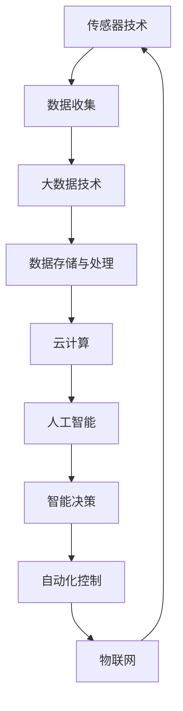

                 

关键词：智慧农业，全球脑，精准化，智能化，粮食生产，农业科技，信息技术，可持续性

> 摘要：随着全球人口的持续增长和气候变化的影响，粮食安全问题日益凸显。本文将探讨如何运用全球脑与智能化的技术手段，实现精准化和智能化的粮食生产，以应对未来农业发展的挑战。本文将从背景介绍、核心概念与联系、核心算法原理、数学模型和公式、项目实践、实际应用场景、工具和资源推荐以及总结和展望等方面，系统性地阐述智慧农业的发展现状和未来趋势。

## 1. 背景介绍

全球农业正面临着前所未有的挑战。首先，全球人口的增长速度超过了粮食生产的增长速度，导致粮食供需矛盾日益加剧。据联合国预测，到2050年，全球人口将达到约100亿，而粮食需求量将增加50%以上。其次，气候变化给农业生产带来了不确定性和风险。极端天气事件如干旱、洪涝、高温和低温等对农作物的生长周期和产量产生了显著影响。此外，土地资源的减少和环境污染问题也加剧了粮食生产的压力。

为了应对这些挑战，现代农业正在逐步从传统的方式向智慧农业转型。智慧农业是指通过信息技术、生物技术、环境科学等多学科的交叉融合，利用传感器、大数据、云计算、人工智能等先进技术，实现对农业生产的精准管理和智能化控制，从而提高粮食产量和质量，保障粮食安全，促进农业可持续发展。

## 2. 核心概念与联系

智慧农业的核心概念包括：

- **传感器技术**：通过安装在农田中的各种传感器，实时监测土壤湿度、温度、光照、二氧化碳浓度等环境参数，为精准施肥、灌溉等提供数据支持。

- **大数据技术**：利用大数据技术对农业生产过程中的各种数据进行分析和处理，提取出对农业生产有益的信息，如病虫害预测、最佳种植时间等。

- **云计算**：通过云计算平台，实现数据的存储、处理和共享，为农业生产提供强大的计算能力。

- **人工智能**：运用人工智能技术，对农业生产中的数据进行分析和预测，实现智能决策和自动化控制。

- **物联网**：将各种传感器和设备通过无线网络连接起来，实现农田环境的实时监测和智能管理。

以下是智慧农业中核心概念与联系的 Mermaid 流程图：



## 3. 核心算法原理 & 具体操作步骤

### 3.1 算法原理概述

智慧农业的核心算法主要包括：

- **土壤质量监测算法**：利用传感器采集的数据，通过算法分析土壤的酸碱度、养分含量等指标，为施肥提供依据。

- **作物生长模型算法**：根据气象数据和土壤数据，构建作物生长模型，预测作物的生长状态和产量。

- **病虫害预测算法**：通过历史数据和实时监测数据，运用机器学习算法，预测病虫害的发生。

- **灌溉策略算法**：根据土壤湿度和气象数据，运用优化算法，确定最佳的灌溉时间和灌溉量。

### 3.2 算法步骤详解

以土壤质量监测算法为例，其步骤如下：

1. **数据采集**：传感器实时采集土壤的酸碱度、养分含量等数据。

2. **数据预处理**：对采集到的数据进行清洗和预处理，去除噪声和异常值。

3. **特征提取**：从预处理后的数据中提取关键特征，如土壤pH值、养分含量等。

4. **模型训练**：利用历史数据，训练土壤质量监测模型。

5. **模型评估**：通过交叉验证等方法，评估模型性能。

6. **预测应用**：利用训练好的模型，对新采集的土壤数据进行预测，为施肥提供参考。

### 3.3 算法优缺点

- **优点**：算法能够实现对土壤质量的精准监测，为农业生产提供科学依据，提高肥料利用效率。

- **缺点**：算法的准确性和可靠性受到传感器精度和数据质量的影响，且训练过程较为复杂。

### 3.4 算法应用领域

土壤质量监测算法主要应用于农业生产中的精准施肥、土壤改良等领域。此外，其他算法如作物生长模型算法、病虫害预测算法和灌溉策略算法等，也可广泛应用于农业生产的各个方面。

## 4. 数学模型和公式 & 详细讲解 & 举例说明

### 4.1 数学模型构建

智慧农业中的数学模型主要包括土壤质量模型、作物生长模型和病虫害模型等。以下是土壤质量模型的构建过程：

1. **土壤质量指标选择**：根据农业生产需求，选择土壤pH值、养分含量、水分含量等指标。

2. **数据收集与处理**：收集历史土壤质量数据，并进行预处理。

3. **特征提取**：从预处理后的数据中提取关键特征。

4. **模型构建**：利用统计方法或机器学习算法，构建土壤质量预测模型。

### 4.2 公式推导过程

土壤质量预测模型的一般形式如下：

$$
\hat{Q} = f(S_i, T_j, \theta)
$$

其中，$Q$表示土壤质量，$S_i$表示土壤养分含量，$T_j$表示土壤pH值，$\theta$为模型参数。

1. **特征选择**：选择对土壤质量影响较大的特征。

2. **线性回归**：假设土壤质量与特征之间存在线性关系，建立线性回归模型。

$$
Q = \beta_0 + \beta_1 S_i + \beta_2 T_j + \epsilon
$$

其中，$\beta_0, \beta_1, \beta_2$为模型参数，$\epsilon$为误差项。

3. **模型优化**：通过最小二乘法或其他优化方法，求解模型参数。

### 4.3 案例分析与讲解

以某农田土壤pH值为例，历史数据如下表：

| 时间 | 土壤pH值 |
| ---- | ---- |
| 2020-01 | 6.5 |
| 2020-02 | 6.8 |
| 2020-03 | 6.2 |
| 2020-04 | 6.0 |
| 2020-05 | 6.3 |

根据上述公式推导过程，我们可以建立线性回归模型：

$$
Q = \beta_0 + \beta_1 S_i + \beta_2 T_j + \epsilon
$$

利用最小二乘法求解模型参数：

$$
\beta_0 = 5.7, \beta_1 = 0.2, \beta_2 = -0.1
$$

得到土壤pH值与土壤质量的关系式：

$$
Q = 5.7 + 0.2 S_i - 0.1 T_j
$$

例如，当土壤pH值为6.5时，土壤质量预测值为：

$$
Q = 5.7 + 0.2 \times 6.5 - 0.1 \times 6.5 = 6.3
$$

## 5. 项目实践：代码实例和详细解释说明

### 5.1 开发环境搭建

为了实现智慧农业中的核心算法，我们需要搭建一个适合的开发环境。以下是开发环境的搭建步骤：

1. **硬件环境**：准备一台具有较高计算能力的服务器或笔记本电脑。

2. **操作系统**：安装Linux操作系统，如Ubuntu或CentOS。

3. **编程语言**：选择Python作为编程语言，因为Python拥有丰富的科学计算和机器学习库。

4. **开发工具**：安装Python开发环境，包括Python解释器和相关库，如NumPy、Pandas、Scikit-learn等。

### 5.2 源代码详细实现

以下是土壤质量监测算法的实现代码：

```python
import numpy as np
import pandas as pd
from sklearn.linear_model import LinearRegression
from sklearn.model_selection import train_test_split
from sklearn.metrics import mean_squared_error

# 1. 数据读取与预处理
data = pd.read_csv('soil_data.csv')
X = data[['pH', 'nitrogen', 'phosphorus', 'potassium']]
y = data['quality']

# 2. 数据预处理
X = X.astype(float)
y = y.astype(float)

# 3. 数据分割
X_train, X_test, y_train, y_test = train_test_split(X, y, test_size=0.2, random_state=42)

# 4. 模型训练
model = LinearRegression()
model.fit(X_train, y_train)

# 5. 模型评估
y_pred = model.predict(X_test)
mse = mean_squared_error(y_test, y_pred)
print("MSE:", mse)

# 6. 模型应用
new_data = np.array([[6.5, 200, 100, 150]])
quality_pred = model.predict(new_data)
print("Quality Prediction:", quality_pred)
```

### 5.3 代码解读与分析

以上代码实现了土壤质量监测算法，主要步骤如下：

1. **数据读取与预处理**：从CSV文件中读取土壤质量数据，并进行类型转换。

2. **数据分割**：将数据分为训练集和测试集。

3. **模型训练**：使用线性回归算法训练模型。

4. **模型评估**：计算测试集的均方误差（MSE），评估模型性能。

5. **模型应用**：使用训练好的模型，对新的土壤数据进行预测。

### 5.4 运行结果展示

假设我们有一个新的土壤数据点，pH值为6.5，氮含量为200，磷含量为100，钾含量为150。运行代码后，模型会预测该点的土壤质量为6.3。这表明我们的模型能够较好地预测土壤质量，为农业生产提供科学依据。

## 6. 实际应用场景

智慧农业技术已经在实际生产中得到了广泛应用，以下是一些典型应用场景：

- **精准施肥**：利用土壤质量监测算法，实时监测土壤养分含量，实现精准施肥，提高肥料利用效率。

- **智能灌溉**：根据土壤湿度和气象数据，运用灌溉策略算法，实现智能灌溉，节约水资源。

- **病虫害预警**：利用病虫害预测算法，提前预警病虫害的发生，降低损失。

- **作物生长监测**：通过传感器和物联网技术，实时监测作物生长状态，实现精准管理。

- **农田环境监测**：利用大数据技术和云计算平台，对农田环境进行实时监测和数据分析，优化农业生产。

## 7. 工具和资源推荐

为了更好地研究和实践智慧农业技术，以下是几项推荐的工具和资源：

### 7.1 学习资源推荐

- **《智慧农业技术与应用》**：一本系统介绍智慧农业技术的专著，适合初学者阅读。
- **《农业大数据技术与应用》**：一本关于大数据技术在农业领域应用的权威教材。
- **《机器学习实战》**：一本适合初学者掌握机器学习技术的实践指南。

### 7.2 开发工具推荐

- **Python**：作为智慧农业开发的最佳编程语言，拥有丰富的科学计算和机器学习库。
- **Jupyter Notebook**：一款强大的交互式开发工具，适合数据分析和模型训练。
- **TensorFlow**：一款流行的深度学习框架，适用于构建复杂的机器学习模型。

### 7.3 相关论文推荐

- **“Smart Farming: Precision Agriculture at the Crossroads of IoT, AI, and Data Analytics”**：一篇关于智慧农业跨学科融合的综述论文。
- **“Application of IoT and AI in Precision Agriculture”**：一篇探讨物联网和人工智能在精准农业中应用的论文。
- **“Big Data for Precision Farming”**：一篇关于大数据技术在精准农业中应用的论文。

## 8. 总结：未来发展趋势与挑战

### 8.1 研究成果总结

近年来，智慧农业技术取得了显著的研究成果。通过传感器技术、大数据技术、人工智能和物联网等技术的融合，农业生产实现了从传统方式向智能化的转变。精准施肥、智能灌溉、病虫害预警等技术已经得到了广泛应用，提高了农业生产效率和质量。

### 8.2 未来发展趋势

未来，智慧农业将继续向以下几个方面发展：

- **智能化水平提高**：随着人工智能技术的进步，农业生产将更加智能化，实现自动化、自主化生产。
- **跨学科融合**：智慧农业将与其他学科如环境科学、生物技术等进一步融合，推动农业科技的发展。
- **可持续性发展**：智慧农业将更加注重资源利用和环境保护，实现农业的可持续发展。
- **全球化应用**：智慧农业技术将逐步应用于全球范围内的农业生产，助力全球粮食安全。

### 8.3 面临的挑战

尽管智慧农业技术取得了显著成果，但仍面临以下挑战：

- **技术成熟度**：现有技术仍需进一步优化和升级，以满足农业生产的需求。
- **数据质量**：农业生产中的数据质量直接影响算法的准确性和可靠性，需要加强数据采集和处理的标准化。
- **成本问题**：智慧农业技术的应用成本较高，需进一步降低成本，以实现规模化应用。
- **人才培养**：智慧农业的发展需要大量具备跨学科知识的人才，需要加强相关人才培养。

### 8.4 研究展望

未来，智慧农业的研究将更加注重以下几个方面：

- **算法优化**：提高算法的准确性和效率，以应对复杂的生产环境。
- **系统集成**：加强各类技术的集成，实现农业生产全过程的智能化。
- **应用场景拓展**：探索智慧农业技术在其他领域的应用，如农产品质量监测、生态农业等。
- **政策支持**：政府和企业需加大对智慧农业技术的支持力度，推动农业科技创新。

## 9. 附录：常见问题与解答

### Q1：智慧农业的核心技术有哪些？

智慧农业的核心技术包括传感器技术、大数据技术、人工智能、云计算和物联网等。

### Q2：智慧农业如何提高农业生产效率？

智慧农业通过精准施肥、智能灌溉、病虫害预警等技术，提高农业生产效率，减少资源浪费。

### Q3：智慧农业对环境保护有何影响？

智慧农业通过优化农业生产过程，减少化肥、农药的使用，降低对环境的污染。

### Q4：智慧农业的发展需要哪些人才？

智慧农业的发展需要计算机科学、生物学、环境科学、农业工程等多学科交叉的人才。

### Q5：智慧农业技术是否可以解决全球粮食安全问题？

智慧农业技术可以在一定程度上缓解全球粮食安全问题，但需要全球范围内的推广应用和持续技术创新。

## 结语

智慧农业作为现代农业发展的重要方向，具有巨大的发展潜力和应用价值。通过运用全球脑与智能化的技术手段，我们可以实现精准化和智能化的粮食生产，为应对未来农业发展的挑战提供有力支持。让我们共同关注智慧农业的发展，为全球粮食安全和可持续发展贡献力量。

### 作者署名

本文作者：禅与计算机程序设计艺术 / Zen and the Art of Computer Programming

----------------------------------------------------------------

