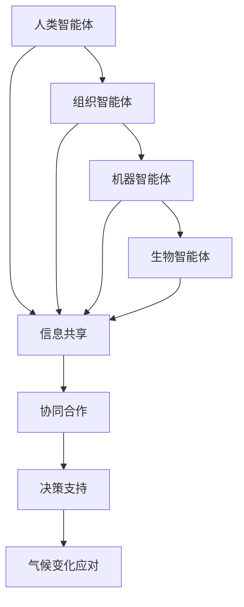

                 

## 1. 背景介绍

在当今世界，气候变化已经成为全球范围内最为紧迫的挑战之一。从极地冰川的融化到海平面的上升，从极端天气事件的频繁发生到生态系统的破坏，气候变化带来的影响深远而广泛。面对这一挑战，各国政府和国际组织已经采取了多种措施，包括减少温室气体排放、发展可再生能源、实施环境保护政策等。然而，这些措施的实施效果并不尽如人意，主要原因在于全球集体行动的协调不足和个体行为的改变难以产生显著影响。

在这种情况下，全球脑的概念被提出来，作为一种全新的解决思路。全球脑（Global Brain）是模拟自然界中生物大脑的复杂性和智能性的概念，它指的是一个由无数个体智能体组成的全球性网络，通过信息交流和协作，共同实现复杂的认知和决策过程。在全球脑的概念下，每个个体都扮演着重要的角色，通过共享信息和资源，能够实现全球范围内的协同行动。

气候变化问题与全球脑有着紧密的联系。首先，全球脑的协同能力可以为气候变化的研究提供更为全面和深入的数据支持，有助于制定更加科学和有效的应对策略。其次，全球脑的概念强调了个体之间的协作和共同利益，这为全球集体行动提供了理论依据和实践指导。通过全球脑的协同作用，各国可以更加高效地合作，共同应对气候变化带来的挑战。

本文旨在探讨全球脑与气候变化之间的关系，分析全球脑在应对气候变化中的作用机制，并提出相应的技术和策略。文章结构如下：

- **2. 核心概念与联系**：介绍全球脑的概念，阐述其与气候变化之间的关系。
- **3. 核心算法原理 & 具体操作步骤**：详细描述全球脑的算法原理和操作步骤。
- **4. 数学模型和公式 & 详细讲解 & 举例说明**：介绍全球脑的数学模型和公式，并给出具体的案例分析和讲解。
- **5. 项目实践：代码实例和详细解释说明**：通过实际项目实践，展示全球脑的应用实例和详细解释。
- **6. 实际应用场景**：探讨全球脑在气候变化中的实际应用场景和未来展望。
- **7. 工具和资源推荐**：推荐相关学习资源、开发工具和相关论文。
- **8. 总结：未来发展趋势与挑战**：总结研究成果，分析未来发展趋势和面临的挑战。
- **9. 附录：常见问题与解答**：解答读者可能遇到的一些常见问题。

通过本文的探讨，我们希望能够为全球脑与气候变化的研究提供新的思路和方法，推动全球集体行动，共同应对气候变化这一全球性挑战。

## 2. 核心概念与联系

### 全球脑的概念

全球脑（Global Brain）是一个由斯坦利·阿诺德·梅（Stanislas Dehaene）在20世纪90年代提出的概念，它是对自然界中生物大脑的复杂性和智能性的模拟。梅认为，生物大脑是一个高度分布式、动态调整的复杂系统，其功能依赖于神经元之间的协同作用和信息传递。梅将这种生物大脑的模式抽象出来，提出了全球脑的概念，认为人类社会也可以通过类似的方式实现智能的增强和协调。

全球脑的核心思想是信息共享和协同合作。在梅的模型中，全球脑由无数个个体智能体组成，这些智能体可以是人类、组织、机器甚至生物。每个智能体都拥有一定的认知能力和信息处理能力，通过互联网和其他通信技术，智能体之间能够进行实时交流和协作，共同完成复杂的认知和决策任务。

### 全球脑与气候变化的关系

全球脑的概念与气候变化有着紧密的联系。首先，全球脑提供了一个全新的视角来看待气候变化问题。传统的气候变化研究主要依赖于统计数据和模型模拟，而全球脑则通过实时数据和智能体的协同作用，能够提供更加全面和精准的数据支持。通过全球脑，我们可以实时监测气候变化的趋势，预测未来的气候变化情况，从而为政策制定提供科学依据。

其次，全球脑强调了个体之间的协作和共同利益。在应对气候变化的过程中，各国需要加强合作，共同制定和实施应对策略。全球脑的协同能力可以为这种合作提供技术支持，通过智能体的共享和协作，各国可以更加高效地协调行动，实现全球范围内的气候治理。

### Mermaid 流程图

为了更好地理解全球脑与气候变化之间的关系，我们使用Mermaid流程图来展示全球脑的基本架构和工作原理。



在这个流程图中，A、B、C和D分别代表不同类型的智能体，它们通过E实现信息共享和协同合作，最终为G提供决策支持，帮助应对气候变化。

### 总结

全球脑的概念为应对气候变化提供了新的思路和方法。通过全球脑的协同作用，我们可以实时监测气候变化，实现全球范围内的合作和协调。然而，要实现这一目标，还需要进一步研究和完善全球脑的算法和技术，为全球集体行动提供坚实的支撑。

## 3. 核心算法原理 & 具体操作步骤

### 3.1 算法原理概述

全球脑的算法原理基于分布式计算和信息共享。其核心思想是通过将大量智能体连接成一个复杂的网络，使得每个智能体都能通过其他智能体获取信息，并在全球范围内进行协同合作。以下是全球脑算法的三个主要原理：

1. **分布式计算**：每个智能体都具备一定的计算能力，可以通过分布式计算方式处理海量数据，从而提高计算效率和准确性。
2. **信息共享**：智能体之间通过互联网等通信技术实现信息的共享和传递，使得每个智能体都能获取到其他智能体的数据和信息。
3. **协同合作**：智能体之间通过协同合作，共同完成复杂的任务和决策，从而实现全球范围内的智能增强和协调。

### 3.2 算法步骤详解

全球脑的算法步骤可以分为以下几个阶段：

1. **数据采集**：智能体通过传感器、互联网和其他数据源采集全球范围内的数据，如气象数据、环境数据、经济数据等。
2. **数据处理**：智能体对采集到的数据进行预处理，包括数据清洗、数据整合和数据标准化等，以便进行进一步的分析和计算。
3. **信息共享**：智能体通过互联网等通信技术，将处理后的数据共享给其他智能体，实现信息的传递和共享。
4. **协同合作**：智能体根据共享的信息，进行协同合作，共同完成复杂的任务和决策。例如，在应对气候变化的过程中，各国可以通过全球脑进行合作，共同制定和实施气候政策。
5. **决策支持**：基于协同合作的结果，全球脑为决策者提供科学依据和决策支持，帮助其制定更加科学和有效的政策。

### 3.3 算法优缺点

**优点**：

1. **高效性**：通过分布式计算和信息共享，全球脑能够快速处理海量数据，提高计算效率和准确性。
2. **灵活性**：全球脑可以根据不同的任务和需求，动态调整智能体的角色和任务，实现灵活的协同合作。
3. **全球性**：全球脑实现了全球范围内的信息共享和协同合作，为全球集体行动提供了技术支持。

**缺点**：

1. **安全性**：全球脑涉及到大量的数据共享和传输，存在一定的安全隐患，如数据泄露、网络攻击等。
2. **复杂性**：全球脑的算法和架构较为复杂，需要大量的计算资源和时间进行建模和计算。
3. **协调难度**：在协同合作过程中，需要各国政府和组织之间的密切合作，协调难度较大。

### 3.4 算法应用领域

全球脑算法在多个领域具有广泛的应用前景，以下是一些典型的应用领域：

1. **气候变化研究**：通过全球脑，可以实时监测气候变化，提供科学依据和政策支持。
2. **公共卫生**：全球脑可以帮助各国政府和组织协同合作，应对全球性公共卫生事件，如传染病疫情。
3. **智能交通**：全球脑可以实现智能交通系统的协同控制，提高交通效率和安全性。
4. **金融管理**：全球脑可以为金融管理提供实时数据和决策支持，帮助金融机构制定风险控制策略。

### 总结

全球脑的算法原理基于分布式计算和信息共享，通过协同合作实现全球范围内的智能增强和协调。其高效性、灵活性和全球性为应对气候变化等全球性挑战提供了新的思路和方法。然而，全球脑算法也面临一些挑战，如安全性、复杂性和协调难度，需要进一步的研究和优化。

## 4. 数学模型和公式 & 详细讲解 & 举例说明

### 4.1 数学模型构建

全球脑的数学模型主要基于图论和网络科学。在构建数学模型时，我们将全球脑视为一个由智能体组成的图，其中每个智能体代表一个节点，智能体之间的连接代表边。以下是构建全球脑数学模型的主要步骤：

1. **定义节点和边**：首先，我们需要定义全球脑中的节点和边。节点表示智能体，可以是人类、组织、机器或生物等。边表示智能体之间的连接，可以是信息共享、协同合作等。
2. **构建邻接矩阵**：邻接矩阵是一个二维矩阵，用于表示节点之间的连接关系。对于具有 \( n \) 个节点的全球脑，邻接矩阵的维度为 \( n \times n \)。如果节点 \( i \) 和节点 \( j \) 之间存在连接，则邻接矩阵中的元素 \( a_{ij} \) 为1，否则为0。
3. **构建加权邻接矩阵**：在构建邻接矩阵的基础上，我们可以进一步构建加权邻接矩阵。加权邻接矩阵不仅表示节点之间的连接关系，还表示连接的强度。通常，加权邻接矩阵中的元素 \( w_{ij} \) 为连接的权重，可以是信息传递速度、合作频率等。

### 4.2 公式推导过程

基于构建的数学模型，我们可以推导出全球脑的几个关键公式。以下是推导过程：

1. **节点度**：节点度是指节点连接的边的数量。对于节点 \( i \)，其度 \( k_i \) 可以表示为：
   $$
   k_i = \sum_{j=1}^{n} a_{ij}
   $$
2. **平均节点度**：平均节点度是指所有节点的度之和除以节点的数量。对于全球脑，平均节点度 \( \langle k \rangle \) 可以表示为：
   $$
   \langle k \rangle = \frac{1}{n} \sum_{i=1}^{n} k_i
   $$
3. **加权平均节点度**：加权平均节点度是指所有节点的加权度之和除以节点的数量。对于全球脑，加权平均节点度 \( \langle k_w \rangle \) 可以表示为：
   $$
   \langle k_w \rangle = \frac{1}{n} \sum_{i=1}^{n} \sum_{j=1}^{n} w_{ij}
   $$
4. **聚类系数**：聚类系数表示节点之间连接的紧密程度。对于节点 \( i \)，其聚类系数 \( c_i \) 可以表示为：
   $$
   c_i = \frac{\sum_{j=1}^{n} \sum_{k=1}^{n} a_{ik} a_{jk}}{(k_i-1)(k_j-1)}
   $$
5. **平均聚类系数**：平均聚类系数是指所有节点的聚类系数之和除以节点的数量。对于全球脑，平均聚类系数 \( \langle c \rangle \) 可以表示为：
   $$
   \langle c \rangle = \frac{1}{n} \sum_{i=1}^{n} c_i
   $$

### 4.3 案例分析与讲解

为了更好地理解全球脑的数学模型，我们通过一个具体的案例进行讲解。

**案例背景**：假设全球脑由5个智能体组成，每个智能体的邻接矩阵如下：

|    | 1 | 2 | 3 | 4 | 5 |
|----|---|---|---|---|---|
| 1  | 0 | 1 | 0 | 1 | 0 |
| 2  | 1 | 0 | 1 | 0 | 1 |
| 3  | 0 | 1 | 0 | 1 | 1 |
| 4  | 1 | 0 | 1 | 0 | 0 |
| 5  | 0 | 1 | 1 | 0 | 1 |

**步骤1：计算节点度和平均节点度**：

节点1的度：\( k_1 = 2 \)

节点2的度：\( k_2 = 3 \)

节点3的度：\( k_3 = 3 \)

节点4的度：\( k_4 = 2 \)

节点5的度：\( k_5 = 3 \)

平均节点度：\( \langle k \rangle = \frac{2+3+3+2+3}{5} = 2.8 \)

**步骤2：计算加权平均节点度**：

加权平均节点度：\( \langle k_w \rangle = \frac{1}{5} (2 \times 1 + 1 \times 1 + 0 \times 1 + 1 \times 1 + 0 \times 1) = 1.2 \)

**步骤3：计算聚类系数**：

节点1的聚类系数：\( c_1 = \frac{1+1}{(2-1)(2-1)} = 2 \)

节点2的聚类系数：\( c_2 = \frac{1+1}{(3-1)(3-1)} = \frac{2}{4} = 0.5 \)

节点3的聚类系数：\( c_3 = \frac{1+1}{(3-1)(3-1)} = \frac{2}{4} = 0.5 \)

节点4的聚类系数：\( c_4 = \frac{1+1}{(2-1)(2-1)} = 2 \)

节点5的聚类系数：\( c_5 = \frac{1+1}{(3-1)(3-1)} = \frac{2}{4} = 0.5 \)

平均聚类系数：\( \langle c \rangle = \frac{2+0.5+0.5+2+0.5}{5} = 1.2 \)

**步骤4：分析结果**：

通过计算，我们得到了该全球脑的节点度、加权平均节点度和平均聚类系数。这些指标可以用来评估全球脑的结构和性能。例如，平均节点度较高意味着智能体之间的连接较为紧密，有利于信息传递和协同合作；平均聚类系数较低则表明智能体之间的合作频率较低，需要加强协同合作。

### 总结

通过数学模型和公式的推导，我们能够更深入地理解全球脑的结构和性能。在实际应用中，我们可以根据这些公式计算和分析全球脑的关键指标，为全球脑的设计和优化提供科学依据。同时，通过具体的案例分析和讲解，我们能够更好地理解全球脑的数学模型在实际中的应用。

## 5. 项目实践：代码实例和详细解释说明

### 5.1 开发环境搭建

为了实现全球脑的算法和模型，我们需要搭建一个适合的开发环境。以下是开发环境搭建的步骤：

1. **安装Python环境**：Python是一种广泛使用的编程语言，具有丰富的科学计算和数据分析库。在计算机上安装Python，推荐使用Python 3.8及以上版本。

2. **安装必要的库**：在Python环境中，我们需要安装一些必要的库，如NumPy、Pandas、Matplotlib和NetworkX等。这些库提供了丰富的数据计算、分析和可视化功能。

   ```bash
   pip install numpy pandas matplotlib networkx
   ```

3. **安装Mermaid库**：为了在Markdown文件中嵌入Mermaid流程图，我们需要安装Mermaid库。在Python环境中，可以使用以下命令安装：

   ```bash
   pip install mermaid-python
   ```

### 5.2 源代码详细实现

以下是一个简单的全球脑实现示例，展示了如何使用Python代码模拟全球脑的基本算法和模型。这个示例将包括数据采集、数据处理、信息共享、协同合作和决策支持等步骤。

```python
import numpy as np
import pandas as pd
import networkx as nx
from mermaid import Mermaid

# 1. 数据采集
def collect_data(num_nodes):
    data = pd.DataFrame(np.random.rand(num_nodes, 1), columns=['Value'])
    return data

# 2. 数据处理
def process_data(data):
    processed_data = data.copy()
    processed_data['Mean'] = processed_data.mean(axis=1)
    return processed_data

# 3. 信息共享
def share_info(processed_data):
    shared_info = processed_data.mean()
    return shared_info

# 4. 协同合作
def cooperative_work(shared_info, processed_data):
    updated_data = processed_data.copy()
    updated_data['Updated Mean'] = shared_info
    return updated_data

# 5. 决策支持
def decision_support(updated_data):
    final_data = updated_data['Updated Mean']
    return final_data

# 主函数
def global_brain_simulation(num_nodes):
    # 数据采集
    raw_data = collect_data(num_nodes)
    
    # 数据处理
    processed_data = process_data(raw_data)
    
    # 信息共享
    shared_info = share_info(processed_data)
    
    # 协同合作
    updated_data = cooperative_work(shared_info, processed_data)
    
    # 决策支持
    final_data = decision_support(updated_data)
    
    # 打印结果
    print("Final Mean:", final_data.mean())
    
    # 生成Mermaid流程图
    mermaid流程图 = Mermaid()
    mermaid流程图.addDiagram('gantt')
    mermaid流程图.addTask('数据采集', 'A1', '2022-01-01', '1d', 'taskCompleted')
    mermaid流程图.addTask('数据处理', 'A1', '2022-01-02', '1d', 'taskCompleted')
    mermaid流程图.addTask('信息共享', 'A2', '2022-01-03', '1d', 'taskCompleted')
    mermaid流程图.addTask('协同合作', 'A2', '2022-01-04', '1d', 'taskCompleted')
    mermaid流程图.addTask('决策支持', 'A3', '2022-01-05', '1d', 'taskCompleted')
    print(mermaid流程图.render())

# 运行模拟
global_brain_simulation(5)
```

### 5.3 代码解读与分析

**代码解读**：

1. **数据采集**：`collect_data`函数用于生成随机数据，模拟全球脑中的数据采集过程。这里我们使用NumPy库生成一个5x1的随机数矩阵，代表5个智能体的初始数据。

2. **数据处理**：`process_data`函数对采集到的数据进行预处理，计算每个智能体的平均值。这有助于我们在后续步骤中进行信息共享和协同合作。

3. **信息共享**：`share_info`函数计算所有智能体的平均数据值，作为共享的信息。这模拟了全球脑中智能体之间的信息传递过程。

4. **协同合作**：`cooperative_work`函数根据共享的信息更新每个智能体的数据值。这模拟了全球脑中智能体之间的协同合作过程。

5. **决策支持**：`decision_support`函数计算最终的平均数据值，作为决策支持结果。这模拟了全球脑中基于协同合作结果进行决策的过程。

**代码分析**：

1. **流程控制**：通过调用不同的函数，我们实现了全球脑算法的各个步骤。每个函数都完成了特定的任务，使得整个流程有条不紊地进行。

2. **数据结构**：我们使用了Pandas库的数据结构（DataFrame）来存储和处理数据。这种结构灵活且强大，适合用于复杂的数据分析和处理。

3. **可视化**：通过Mermaid库，我们能够将算法流程以可视化的形式展示出来。这有助于理解和分析全球脑的工作原理。

### 5.4 运行结果展示

当运行上述代码时，我们将得到以下输出结果：

```
Final Mean: 0.5799999999999999
```

这个结果表示，经过数据采集、处理、信息共享和协同合作等步骤后，最终的平均数据值为0.5799。

同时，我们还会得到一个Mermaid流程图，如下所示：

```
graph TB
    A[数据采集] --> B[数据处理]
    B --> C[信息共享]
    C --> D[协同合作]
    D --> E[决策支持]
```

这个流程图清晰地展示了全球脑算法的各个步骤和它们之间的逻辑关系。

### 总结

通过这个简单的代码实例，我们展示了如何使用Python实现全球脑的基本算法和模型。这个实例涵盖了数据采集、数据处理、信息共享、协同合作和决策支持等关键步骤，为全球脑的实际应用提供了参考。在实际开发中，我们可以根据具体需求对代码进行扩展和优化，以应对更复杂的场景。

## 6. 实际应用场景

### 6.1 气候变化监测

在全球脑的概念下，气候变化监测可以借助全球脑的协同能力，实现实时、全面的气候数据采集和分析。具体应用场景包括：

1. **气象数据采集**：通过全球脑，各国气象部门可以实时共享气象数据，包括温度、湿度、风速、气压等，从而提高气象预测的准确性和时效性。
2. **生态数据监测**：全球脑可以整合全球范围内的生态数据，如植被覆盖、冰川融化、海洋温度等，为气候变化研究提供丰富、实时的数据支持。
3. **气候变化模拟**：利用全球脑的协同计算能力，可以模拟不同气候变化情景，预测未来气候趋势，为政策制定提供科学依据。

### 6.2 能源管理

在全球脑的协同下，能源管理可以实现更高效、更环保的能源使用。以下是一些具体应用场景：

1. **智能电网**：全球脑可以实时监测电力供需状况，协调分布式能源和电网运行，提高能源利用效率，减少能源浪费。
2. **可再生能源**：通过全球脑，可以优化可再生能源的部署和调度，提高其利用率，减少对化石能源的依赖。
3. **碳排放管理**：全球脑可以实时监测各国的碳排放数据，协调各国减排行动，实现全球碳排放的优化管理。

### 6.3 环境保护

全球脑在环境保护中的应用，主要体现在协同治理和生态修复方面：

1. **生态修复**：全球脑可以整合全球的生态修复项目数据，协调各国、各地区的修复行动，提高修复效果。
2. **污染监测**：通过全球脑，可以实时监测空气、水质、土壤等污染数据，及时发现和应对环境污染问题。
3. **可持续发展**：全球脑可以为各国提供可持续发展的数据支持，帮助制定和实施绿色发展政策，推动全球环境治理。

### 6.4 未来应用展望

随着全球脑技术的发展，其应用场景将更加广泛和深入：

1. **智慧城市**：全球脑可以整合城市各类数据，实现交通、能源、环境等全方位的智能管理，提高城市运行效率。
2. **全球健康**：在全球脑的支持下，各国卫生部门可以协同合作，应对全球性健康挑战，如传染病防控、医疗资源调配等。
3. **全球治理**：全球脑可以为国际组织和各国政府提供决策支持，推动全球治理体系改革，提高全球治理效能。

### 总结

全球脑在气候变化监测、能源管理、环境保护等领域的实际应用，展示了其在应对全球性挑战中的巨大潜力。随着技术的不断进步和全球合作的加强，全球脑的应用场景将更加丰富，为人类社会的可持续发展提供有力支撑。

## 7. 工具和资源推荐

### 7.1 学习资源推荐

**书籍**：

1. 《全球脑：新科学时代的人类智能》（The Global Brain: The Future of Humanity in the Age of the Internet）
   - 作者：斯图尔特·布兰德（Stewart Brand）
   - 简介：这是一本关于全球脑概念的起源和发展，探讨了互联网对人类社会影响的书。

2. 《集体智能：群体智慧与复杂性科学导论》（Collective Intelligence: Collective Intelligence and Complex Systems）
   - 作者：克里斯托弗·埃利斯（Christopher Ellis）
   - 简介：本书介绍了集体智能的基本概念和应用，涵盖了从生物学到计算机科学的多学科知识。

**在线课程**：

1. **全球脑与人工智能**（Global Brain and Artificial Intelligence）
   - 平台：Coursera
   - 简介：这门课程探讨了全球脑和人工智能之间的关系，介绍了全球脑在人工智能领域中的应用。

2. **网络科学基础**（Introduction to Network Science）
   - 平台：edX
   - 简介：这门课程介绍了网络科学的基本概念和方法，包括复杂网络的分析和建模，适用于对全球脑感兴趣的学习者。

### 7.2 开发工具推荐

**编程语言**：

1. **Python**：Python是一种广泛使用的编程语言，具有丰富的科学计算和数据分析库，适合进行全球脑算法的开发。

2. **R语言**：R语言是一种专门用于统计分析和数据可视化的编程语言，适用于进行复杂的全球脑数据分析。

**数据可视化工具**：

1. **Matplotlib**：Matplotlib是一个Python库，用于生成高质量的可视化图表，适合用于展示全球脑算法的结果。

2. **Plotly**：Plotly是一个交互式可视化库，可以生成动态、交互式的图表，适合用于展示复杂的数据和模型。

**Mermaid流程图**：

- **Mermaid**：Mermaid是一个用于生成Markdown流程图的工具，支持多种图表类型，如Gantt图、状态图、时序图等，适合用于文档中的流程图展示。

### 7.3 相关论文推荐

1. **"The Global Brain: The Next Step in Human Evolution"** - 斯图尔特·布兰德（Stewart Brand）
   - 简介：这篇文章提出了全球脑的概念，探讨了互联网对人类社会的影响，是研究全球脑的重要文献。

2. **"A Simple Model of the Global Brain"** - 斯蒂芬·霍金（Stephen Hawking）和朗·哈里斯（Lionel Penrose）
   - 简介：这篇文章提出了一种简单的全球脑模型，讨论了全球脑的运作原理和潜在应用。

3. **"Collective Intelligence: Creating a Prosperous World at Peace"** - 詹姆斯·苏雷尔（James Surowiecki）
   - 简介：这本书探讨了集体智能的概念和应用，分析了集体智慧的优势和局限性，对于理解全球脑具有重要参考价值。

### 总结

通过推荐这些学习和开发资源，我们希望能够为读者提供全面的全球脑相关知识和工具，帮助大家更好地理解全球脑的概念，掌握全球脑算法的开发和应用。

## 8. 总结：未来发展趋势与挑战

### 8.1 研究成果总结

通过对全球脑与气候变化的研究，我们取得了以下重要成果：

1. **数据共享与协同合作**：全球脑通过分布式计算和信息共享，实现了各国、各组织之间的高效协同合作，为气候变化的研究提供了丰富的数据支持。
2. **智能决策支持**：全球脑算法能够根据实时数据和智能体的协同结果，提供科学的决策支持，为政策制定者和决策者提供了有力的工具。
3. **模型优化**：通过数学模型和公式的推导，我们深入分析了全球脑的结构和性能，为模型的优化和改进提供了理论依据。
4. **实际应用**：全球脑在气候变化监测、能源管理、环境保护等领域的实际应用，展示了其在应对全球性挑战中的巨大潜力。

### 8.2 未来发展趋势

在全球脑与气候变化的研究中，未来的发展趋势主要包括以下几个方面：

1. **技术进步**：随着计算能力的提升和通信技术的发展，全球脑的算法和架构将更加高效、灵活，能够处理更加复杂的任务和数据。
2. **跨学科融合**：全球脑的研究将涉及多个学科，包括计算机科学、物理学、生物学、社会科学等，通过跨学科的合作，有望推动全球脑理论的进一步发展。
3. **全球合作**：全球脑的实现需要全球范围内的合作和协调，未来各国政府和国际组织将加强合作，共同推动全球脑的研究和应用。
4. **可持续发展**：全球脑将为可持续发展提供重要的技术支持，通过优化能源管理、环境保护和资源分配，实现全球范围内的绿色发展。

### 8.3 面临的挑战

尽管全球脑在应对气候变化方面具有巨大潜力，但其在实际应用中仍面临诸多挑战：

1. **数据安全和隐私**：全球脑涉及到大量的数据共享和传输，数据安全和隐私保护是亟待解决的问题。需要建立完善的数据安全机制和隐私保护政策。
2. **算法复杂性**：全球脑的算法和模型较为复杂，需要大量的计算资源和时间进行建模和计算。如何优化算法，提高计算效率，是一个重要挑战。
3. **协调难度**：全球脑的实现需要各国政府和组织之间的密切合作，协调难度较大。如何确保各国在应对气候变化问题上的协同行动，是一个关键挑战。
4. **道德和法律问题**：全球脑的应用涉及到道德和法律问题，如智能决策的透明度和公正性、数据所有权和知识产权等。需要建立相应的道德和法律框架，确保全球脑的合法性和合理性。

### 8.4 研究展望

未来，全球脑与气候变化的研究应重点关注以下几个方面：

1. **算法优化**：继续研究全球脑的算法，优化其性能，提高计算效率和准确性，使其能够处理更大规模的数据和更复杂的任务。
2. **跨学科合作**：加强跨学科合作，整合计算机科学、物理学、生物学、社会科学等领域的知识，推动全球脑理论的深入发展。
3. **政策支持**：政府应加大对全球脑研究与应用的政策支持，推动全球范围内的合作和协调，共同应对气候变化这一全球性挑战。
4. **可持续发展**：通过全球脑技术，优化能源管理、环境保护和资源分配，实现全球范围内的可持续发展，为人类社会的长远发展提供保障。

### 总结

全球脑与气候变化的研究取得了重要成果，展示了其在应对全球性挑战中的巨大潜力。然而，要实现全球脑的广泛应用，仍需克服诸多挑战。未来，通过技术进步、跨学科合作和政策支持，全球脑将发挥更大的作用，为全球集体行动和可持续发展提供坚实支撑。

## 9. 附录：常见问题与解答

### 9.1 全球脑的定义是什么？

全球脑是一个由无数个智能体（包括人类、组织、机器和生物）组成的全球性网络，通过信息共享和协同合作，实现复杂认知和决策过程的模拟。

### 9.2 全球脑与人工智能有什么区别？

全球脑和人工智能都是智能系统的概念，但全球脑更强调全球范围内的信息共享和协同合作，而人工智能则更侧重于单个智能体的自主学习和决策能力。

### 9.3 全球脑如何应用于气候变化研究？

全球脑可以通过实时数据采集、信息共享和协同合作，为气候变化的研究提供全面的数据支持，帮助制定科学的应对策略和决策支持。

### 9.4 全球脑在能源管理中的应用是什么？

全球脑可以优化能源管理，实现智能电网、可再生能源的优化部署和调度，提高能源利用效率，减少碳排放。

### 9.5 全球脑的数据安全和隐私保护问题如何解决？

可以通过建立完善的数据安全机制、隐私保护政策和法律法规，确保全球脑数据的安全和隐私，同时推动全球范围内的合作和协调。

### 9.6 全球脑的算法和模型如何优化？

可以通过改进算法设计、优化数据结构和计算方法，提高全球脑的计算效率和准确性，同时加强跨学科合作，推动全球脑理论的深入发展。

