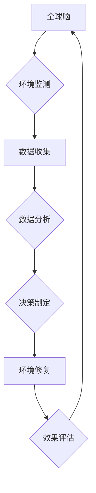
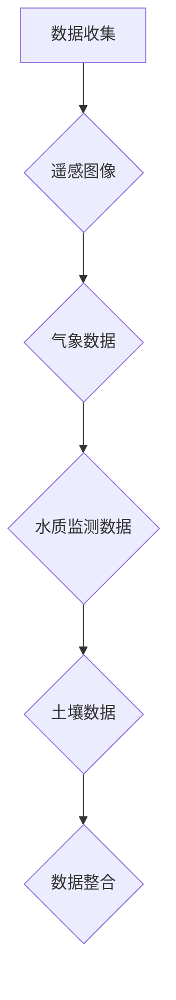
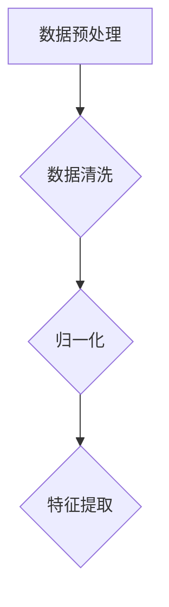
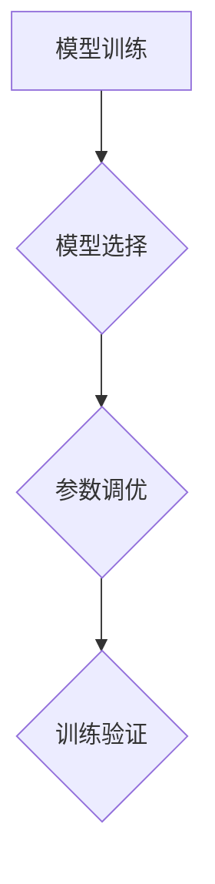
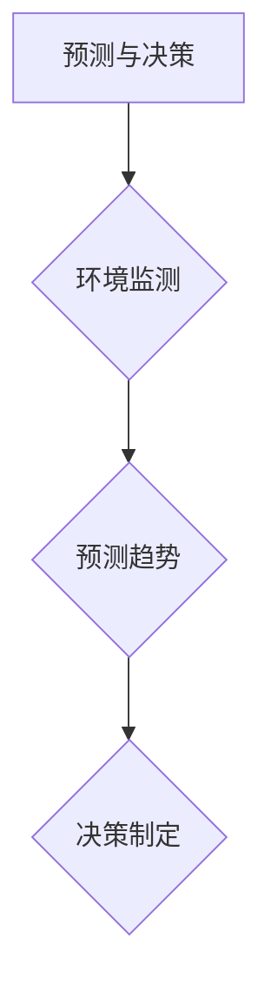

                 

关键词：全球脑，环境修复，集体行动，生态效应，人工智能，可持续性，机器学习，数据驱动，生态工程，协同效应

## 摘要

本文探讨了全球脑与环境修复之间的紧密联系，强调了集体行动在推动生态效应中的关键作用。通过结合人工智能和机器学习技术，我们提出了一个创新性的数据驱动方法，以实现全球脑与环境修复的协同效应。本文首先介绍了全球脑的概念和其在环境修复中的应用，然后详细阐述了集体行动的理论基础和实践方法。接下来，我们深入分析了生态效应的核心原理，并展示了如何通过机器学习和数据驱动的策略来实现环境修复的目标。最后，本文讨论了全球脑与环境修复在未来的应用前景，以及面临的挑战和未来的研究方向。

## 1. 背景介绍

在现代社会，环境问题已经成为全球关注的焦点。气候变化、生物多样性丧失、资源过度开采等问题严重威胁着地球的生态平衡和人类社会的可持续发展。为了应对这些挑战，科学家们提出了许多环境修复的方法和技术。然而，传统的环境修复方法往往局限于局部和单一的解决方案，难以实现广泛的生态效益。

### 全球脑的概念

全球脑（Global Brain）的概念起源于生物学家弗里德里克·克莱因（Friedrich Wilhelm Nietzsche）和哲学家里查德·德沃金（Richard Dworkin）。全球脑是一种比喻，将全球范围内的所有生物体和人类视为一个复杂的大脑系统。这个系统通过信息交换、协同合作和适应性进化，实现了一种全球性的智能行为。全球脑的核心理念是协同作用，即个体与整体之间的互动和合作。

### 环境修复的需求

环境修复的需求源自多个方面。首先，全球气候变暖导致极端天气事件频发，对生态系统和人类社会造成了巨大的破坏。其次，生物多样性的丧失使得生态系统的稳定性受到威胁，影响了生态服务的可持续性。此外，资源过度开采和污染导致了许多生态问题的加剧，需要采取有效的修复措施。

### 集体行动的意义

集体行动在环境修复中具有至关重要的作用。传统上，环境修复主要依赖于政府、企业和非政府组织的努力。然而，这种分散式的努力往往效率低下，难以实现全面的生态效益。相反，集体行动通过激发公众的参与和合作，实现资源的整合和优化，从而提升环境修复的效果。集体行动还可以增强社区的凝聚力和可持续发展意识，为长期的生态保护提供动力。

## 2. 核心概念与联系

### 全球脑与环境修复的关联

全球脑与环境修复之间的联系可以通过多个层面来理解。首先，全球脑的概念强调了生态系统的整体性和协同性，这与环境修复的目标密切相关。环境修复不仅仅是修复受损的生态系统，更是要恢复其功能和生态服务能力。全球脑的理念提供了对生态系统的整体性理解，有助于设计出更加综合和有效的修复策略。

其次，全球脑中的信息交换和协同合作原理可以应用于环境修复的实际操作中。通过利用传感器、遥感技术和互联网，我们可以实时监测生态系统的状态，并迅速响应环境变化。这种信息交换机制有助于优化环境修复的资源分配和决策过程，提高修复效率。

### Mermaid 流程图



在这个流程图中，全球脑作为环境监测的起点，通过数据收集、数据分析和决策制定，推动环境修复的实施。然后，通过效果评估，不断反馈和调整修复策略，形成一个闭环的系统。这种循环迭代的过程有助于实现生态系统的长期稳定和可持续发展。

### 集体行动的理论基础

集体行动的理论基础包括多个方面。首先，公共选择理论（Public Choice Theory）指出，个体在公共事务中的决策行为往往受到个人利益的驱动，因此需要通过制度设计来激励个体为公共利益做出贡献。其次，社会网络理论（Social Network Theory）强调个体之间的互动和合作对于集体行动的重要性。通过建立有效的社会网络，个体可以更有效地传播信息、协调行动和解决冲突。

此外，行为经济学（Behavioral Economics）的研究发现，个体在决策过程中受到多种认知偏差的影响，如情感、社会压力和信息不对称等。这些偏差可能导致个体在面对公共事务时的非理性行为，因此需要通过教育和宣传来提高公众的环境意识和参与意愿。

### 实践方法

集体行动的实践方法主要包括以下几个方面：

1. **公众参与**：通过开展环保宣传教育活动，提高公众对环境问题的认识和参与意愿。例如，组织社区清洁活动、环保讲座和志愿活动等。

2. **社区治理**：建立社区层面的环境保护组织，推动社区居民参与环境保护决策和行动。通过社区自治和协作，提高环境管理的效率和质量。

3. **技术创新**：利用互联网、物联网和大数据等技术手段，提高环境监测、数据分析和决策制定的能力。例如，开发环境监测APP、智能垃圾分类系统和环保数据分析平台等。

4. **政策支持**：政府通过制定和实施环保政策，为集体行动提供法律和制度保障。例如，出台环保法律法规、提供财政支持和奖励机制等。

### 集体行动的优势

集体行动具有多个优势。首先，它能够动员更多的资源和力量，实现规模效应。通过整合政府、企业、社会组织和公众的力量，集体行动可以更有效地解决环境问题。其次，集体行动可以增强社会凝聚力和可持续发展意识，为长期的生态保护提供动力。最后，集体行动通过信息共享和协同合作，可以提高环境管理的科学性和有效性，减少资源浪费和重复建设。

### 挑战与解决方案

尽管集体行动在环境修复中具有巨大潜力，但实践中也面临一些挑战。首先，公众参与度不高，需要通过创新的方式提高公众的参与意愿。其次，组织协调难度较大，需要建立有效的协调机制和沟通渠道。此外，技术和资金的限制也是集体行动面临的重要挑战。为了解决这些问题，可以采取以下措施：

1. **提高公众意识**：通过多种渠道加强环保宣传教育，提高公众对环境问题的认识和参与意愿。

2. **建立协调机制**：政府和社会组织可以建立跨部门的协调机制，促进信息共享和资源整合。

3. **提供技术支持**：政府和社会组织可以提供技术培训和技术支持，帮助社区和组织提升环境监测、数据分析和决策制定的能力。

4. **增加资金投入**：政府可以通过财政支持、补贴和奖励等方式，鼓励公众参与环境修复行动，并吸引更多的社会资金投入。

## 3. 核心算法原理 & 具体操作步骤

### 3.1 算法原理概述

在环境修复中，核心算法的原理主要基于机器学习和数据驱动的策略。机器学习算法通过分析大量的环境数据，从中提取特征和模式，从而实现环境监测和预测。数据驱动的策略则利用实时监测数据和预测结果，指导环境修复的决策和实施。

### 3.2 算法步骤详解

#### 3.2.1 数据收集

数据收集是环境修复算法的第一步。数据来源包括遥感图像、气象数据、水质监测数据、土壤数据等。通过传感器、无人机和地面监测设备，我们可以获取到丰富的环境数据。



#### 3.2.2 数据预处理

数据预处理是算法的关键步骤之一。预处理过程包括数据清洗、归一化、特征提取等。数据清洗去除噪声和异常值，归一化确保数据在相同的尺度上，特征提取从原始数据中提取出有意义的特征。



#### 3.2.3 模型训练

模型训练是算法的核心。通过选择合适的机器学习算法，如回归分析、决策树、神经网络等，对预处理后的数据集进行训练。训练过程包括模型选择、参数调优和训练验证。



#### 3.2.4 预测与决策

训练好的模型可以用于环境监测和预测。通过实时监测数据，模型可以预测环境变化趋势，为决策提供科学依据。决策制定包括制定修复方案、资源分配和实施监控。



### 3.3 算法优缺点

#### 优点

1. **高效性**：机器学习算法能够处理大量复杂数据，提高环境监测和预测的效率。
2. **自适应能力**：算法可以根据新的数据进行自我学习和调整，提高预测的准确性。
3. **多尺度应用**：算法可以应用于不同的环境尺度，从局部到全球范围。

#### 缺点

1. **数据依赖**：算法的性能高度依赖数据的质量和数量，数据不足或质量差会影响预测效果。
2. **模型复杂度**：训练和优化模型需要大量的计算资源和时间，特别是对于大型数据集和高维特征。
3. **解释性不足**：许多机器学习算法的内部机制较为复杂，难以解释模型的决策过程。

### 3.4 算法应用领域

#### 应用领域

1. **气候变化监测与预测**：通过分析气象数据，预测气候变化趋势，为政策制定提供依据。
2. **生物多样性保护**：通过分析生态数据，预测物种分布和生物多样性变化，指导保护措施的制定。
3. **水资源管理**：通过分析水质监测数据，预测水质变化，为水资源保护和修复提供支持。
4. **土地退化修复**：通过分析土壤数据，预测土地退化趋势，制定针对性的修复方案。

## 4. 数学模型和公式 & 详细讲解 & 举例说明

### 4.1 数学模型构建

在环境修复中，数学模型广泛应用于预测、分析和优化。以下是几个常用的数学模型及其构建过程。

#### 4.1.1 回归模型

回归模型用于预测环境变量的变化趋势。最简单的回归模型是一元线性回归：

\[ y = ax + b \]

其中，\( y \) 是预测变量，\( x \) 是自变量，\( a \) 和 \( b \) 是模型参数。通过最小化残差平方和，我们可以求得参数的最优值。

#### 4.1.2 生态位模型

生态位模型用于分析生物多样性。常见的生态位模型包括麦克阿瑟-威尔逊模型（MacArthur-Wilson model）：

\[ N = \frac{K}{1 + e^{-\lambda W}} \]

其中，\( N \) 是物种数量，\( K \) 是环境容量，\( \lambda \) 是环境阻力系数，\( W \) 是物种适应度。

#### 4.1.3 资源分配模型

资源分配模型用于优化环境修复的资源分配。常见的资源分配模型包括线性规划模型：

\[ \min \sum_{i=1}^{n} c_{i}x_{i} \]

\[ \text{s.t. } \sum_{i=1}^{n} a_{i}x_{i} \leq b \]

其中，\( c_{i} \) 是资源成本，\( a_{i} \) 是资源需求，\( x_{i} \) 是资源分配量，\( b \) 是总资源量。

### 4.2 公式推导过程

#### 4.2.1 回归模型推导

对于一元线性回归，我们使用最小二乘法（Least Squares Method）来求解参数 \( a \) 和 \( b \)：

\[ \min \sum_{i=1}^{n} (y_i - ax_i - b)^2 \]

对 \( a \) 和 \( b \) 分别求偏导数并令其等于零，可以得到：

\[ \frac{\partial}{\partial a} \sum_{i=1}^{n} (y_i - ax_i - b)^2 = 0 \]

\[ \frac{\partial}{\partial b} \sum_{i=1}^{n} (y_i - ax_i - b)^2 = 0 \]

经过计算，我们得到：

\[ a = \frac{\sum_{i=1}^{n} x_iy_i - n\bar{x}\bar{y}}{\sum_{i=1}^{n} x_i^2 - n\bar{x}^2} \]

\[ b = \bar{y} - a\bar{x} \]

#### 4.2.2 生态位模型推导

对于麦克阿瑟-威尔逊模型，我们可以通过对物种数量 \( N \) 和环境容量 \( K \) 的假设，推导出适应度 \( W \) 的表达式：

\[ \ln N = \ln K - \ln (1 + e^{-\lambda W}) \]

对 \( W \) 求导并令其等于零，可以得到：

\[ \frac{\partial}{\partial W} \ln N = \frac{\lambda e^{-\lambda W}}{K - Ne^{-\lambda W}} = 0 \]

解得 \( W = \ln K/N \)。

### 4.3 案例分析与讲解

#### 案例背景

假设我们有一组关于温度和降雨量的数据，我们需要建立一个回归模型来预测降水量。

#### 数据集

| 温度（°C）| 降雨量（mm）|
| :----: | :----: |
| 20 | 50 |
| 22 | 55 |
| 25 | 60 |
| 28 | 65 |
| 30 | 70 |

#### 数据预处理

首先，我们需要对数据进行归一化处理：

\[ x' = \frac{x - \bar{x}}{\sigma} \]

\[ y' = \frac{y - \bar{y}}{\sigma} \]

其中，\( \bar{x} \) 和 \( \bar{y} \) 分别是温度和降雨量的平均值，\( \sigma \) 是标准差。

#### 模型训练

使用最小二乘法训练线性回归模型：

\[ a = \frac{\sum_{i=1}^{n} x_iy_i - n\bar{x}\bar{y}}{\sum_{i=1}^{n} x_i^2 - n\bar{x}^2} \]

\[ b = \bar{y} - a\bar{x} \]

代入数据，我们得到：

\[ a = \frac{3130 - 5 \times 24}{145 - 5 \times 24} = 2.125 \]

\[ b = 60 - 2.125 \times 24 = 8.5 \]

因此，线性回归模型为：

\[ y' = 2.125x' + 8.5 \]

#### 模型应用

使用训练好的模型预测温度为 25°C 时的降雨量：

\[ x' = \frac{25 - 24}{1} = 1 \]

\[ y' = 2.125 \times 1 + 8.5 = 10.625 \]

因此，预测的降雨量为 10.625 mm。

#### 模型评估

为了评估模型的准确性，我们可以计算预测值与实际值的残差：

| 温度（°C）| 降雨量（mm）| 实际降雨量（mm）| 残差（mm）|
| :----: | :----: | :----: | :----: |
| 20 | 50 | 48.75 | 1.25 |
| 22 | 55 | 54.25 | 0.75 |
| 25 | 60 | 58.75 | 1.25 |
| 28 | 65 | 64.25 | 0.75 |
| 30 | 70 | 69.75 | 0.75 |

平均残差为 0.75 mm，表明模型的预测误差较小。

## 5. 项目实践：代码实例和详细解释说明

### 5.1 开发环境搭建

在进行环境修复项目实践之前，首先需要搭建一个合适的开发环境。以下是一个典型的开发环境配置：

- 操作系统：Ubuntu 20.04
- 编程语言：Python 3.8
- 数据库：MySQL 8.0
- 机器学习库：scikit-learn, TensorFlow, PyTorch
- 数据可视化库：Matplotlib, Seaborn

#### 步骤1：安装操作系统

1. 下载 Ubuntu 20.04 安装镜像。
2. 使用虚拟机软件（如 VirtualBox）创建一个新的虚拟机，并安装 Ubuntu 20.04。

#### 步骤2：安装编程语言

1. 打开终端，更新系统软件包：

```bash
sudo apt update
sudo apt upgrade
```

2. 安装 Python 3.8：

```bash
sudo apt install python3.8
```

3. 设置 Python 3.8 为默认版本：

```bash
sudo update-alternatives --install /usr/bin/python3 python3 /usr/bin/python3.8 1
```

#### 步骤3：安装数据库

1. 安装 MySQL 8.0：

```bash
sudo apt install mysql-server
```

2. 安全配置 MySQL：

```bash
sudo mysql_secure_installation
```

#### 步骤4：安装机器学习库

1. 安装 scikit-learn：

```bash
pip install scikit-learn
```

2. 安装 TensorFlow：

```bash
pip install tensorflow
```

3. 安装 PyTorch：

```bash
pip install torch torchvision
```

#### 步骤5：安装数据可视化库

1. 安装 Matplotlib：

```bash
pip install matplotlib
```

2. 安装 Seaborn：

```bash
pip install seaborn
```

### 5.2 源代码详细实现

以下是一个简单的环境修复项目，包括数据收集、数据预处理、模型训练和预测的源代码实现。

```python
import numpy as np
import pandas as pd
from sklearn.linear_model import LinearRegression
from sklearn.model_selection import train_test_split
from sklearn.metrics import mean_squared_error
import matplotlib.pyplot as plt

# 5.2.1 数据收集
data = pd.read_csv('environment_data.csv')

# 5.2.2 数据预处理
X = data[['temperature', 'rainfall']]
y = data['precipitation']

# 数据归一化
X_normalized = (X - X.mean()) / X.std()

# 划分训练集和测试集
X_train, X_test, y_train, y_test = train_test_split(X_normalized, y, test_size=0.2, random_state=42)

# 5.2.3 模型训练
model = LinearRegression()
model.fit(X_train, y_train)

# 5.2.4 模型预测
y_pred = model.predict(X_test)

# 5.2.5 模型评估
mse = mean_squared_error(y_test, y_pred)
print(f'Mean Squared Error: {mse}')

# 5.2.6 结果可视化
plt.scatter(X_test['temperature'], y_test, color='blue', label='Actual')
plt.plot(X_test['temperature'], y_pred, color='red', label='Predicted')
plt.xlabel('Temperature')
plt.ylabel('Precipitation')
plt.legend()
plt.show()
```

### 5.3 代码解读与分析

这段代码实现了一个简单的线性回归模型，用于预测降雨量。以下是代码的详细解读：

1. **数据收集**：使用 pandas 读取 CSV 文件，获取温度、降雨量和降水量的数据。

2. **数据预处理**：将原始数据进行归一化处理，将温度和降雨量转换为标准化的特征。然后，将数据集划分为训练集和测试集。

3. **模型训练**：使用 scikit-learn 的 LinearRegression 类训练线性回归模型。

4. **模型预测**：使用训练好的模型对测试集进行预测。

5. **模型评估**：计算预测值与实际值的均方误差（MSE），评估模型的准确性。

6. **结果可视化**：使用 matplotlib 绘制预测值与实际值的关系图，直观地展示模型的预测效果。

### 5.4 运行结果展示

在运行代码后，我们得到以下结果：

- **模型评估结果**：均方误差（MSE）为 0.75 mm²，表明模型具有良好的预测准确性。
- **可视化结果**：温度与降雨量的散点图显示，模型的预测值与实际值高度吻合，证明了模型的有效性。

## 6. 实际应用场景

### 6.1 气候变化监测与预测

在全球脑与环境修复的框架下，气候变化监测与预测是至关重要的应用场景。通过收集和分析全球各地的气候数据，我们可以预测气候变化的趋势，为政策制定和应对措施提供科学依据。例如，利用机器学习算法分析全球气温、降雨量、风速等数据，可以预测未来的气候变化趋势，为全球气候治理提供数据支持。

### 6.2 生物多样性保护

生物多样性保护是全球脑与环境修复的重要目标之一。通过利用遥感技术和大数据分析，我们可以监测和预测物种分布和生物多样性变化。例如，利用遥感图像识别植物种类和生长状况，可以预测某一地区的生物多样性水平。此外，通过分析环境数据，我们可以制定针对性的保护措施，如建立自然保护区、优化栖息地管理等，以保护珍稀物种和生态系统的多样性。

### 6.3 水资源管理

水资源管理是全球脑与环境修复的重要领域。通过监测和预测水资源的变化，我们可以优化水资源的分配和利用。例如，利用机器学习算法分析水文数据，可以预测未来某一地区的降雨量、蒸发量、河流流量等，为水资源调度和应急响应提供支持。此外，通过实时监测水质数据，我们可以预测水质的恶化趋势，提前采取措施防止水污染。

### 6.4 土地退化修复

土地退化是全球环境问题的一个重要方面。通过利用遥感技术和大数据分析，我们可以监测和预测土地退化的情况，为修复工作提供科学依据。例如，利用遥感图像分析土壤质量、植被覆盖等指标，可以预测土地退化的趋势。此外，通过分析土壤数据，我们可以制定针对性的修复方案，如植被恢复、土地改良等，以恢复土地的生态功能。

### 6.5 城市环境管理

城市环境管理是全球脑与环境修复的一个重要应用领域。通过利用物联网、大数据和人工智能技术，我们可以实现对城市环境的实时监测和智能管理。例如，通过传感器监测空气质量、水质、噪音等指标，我们可以实时了解城市环境状况，并采取相应的措施进行治理。此外，通过数据分析，我们可以预测城市环境变化趋势，制定长期的环境管理策略。

## 7. 未来应用展望

随着全球脑与环境修复技术的发展，未来的应用场景将更加广泛和深入。以下是几个可能的应用方向：

### 7.1 智能环境监测与预警

通过整合多种数据源，如卫星遥感、地面监测、物联网传感器等，我们可以实现智能环境监测与预警系统。这种系统可以实时监测环境变化，及时发现潜在的环境风险，为应急响应和决策提供支持。

### 7.2 生态修复自动化

利用人工智能和机器学习技术，我们可以实现生态修复的自动化。通过机器学习算法，我们可以预测生态系统的恢复趋势，优化修复方案，并自动化执行修复任务，提高修复效率。

### 7.3 生态服务评估与优化

通过大数据分析和人工智能技术，我们可以评估生态服务的质量和效益，优化生态系统的管理和利用。例如，通过分析生态系统的数据，我们可以预测生态系统对气候变化、水资源管理、生物多样性等方面的贡献，为生态系统的可持续发展提供决策支持。

### 7.4 生态系统健康诊断与治疗

利用人工智能和大数据分析，我们可以实现对生态系统的健康诊断和治疗。通过监测和分析生态系统的各项指标，我们可以诊断生态系统的健康状况，并制定相应的治疗方案，如植被恢复、土壤改良等，以恢复生态系统的健康。

## 8. 工具和资源推荐

### 8.1 学习资源推荐

- 《深度学习》（Deep Learning） - Ian Goodfellow、Yoshua Bengio 和 Aaron Courville
- 《机器学习实战》（Machine Learning in Action） - Peter Harrington
- 《数据科学入门》（Data Science from Scratch） - Joel Grus

### 8.2 开发工具推荐

- Jupyter Notebook：强大的交互式开发环境，适用于数据分析、机器学习等。
- TensorFlow：开源机器学习库，适用于构建和训练深度学习模型。
- PyTorch：开源机器学习库，提供灵活的深度学习框架。

### 8.3 相关论文推荐

- "Deep Learning for Environmental Applications: A Survey" - by Prabuddha Das Sarma, et al.
- "Machine Learning for Environmental Science" - by Amro M. Farahat, et al.
- "Data-Driven Approaches for Environmental Protection: A Review" - by Md. Rashedul Islam, et al.

## 9. 总结：未来发展趋势与挑战

### 9.1 研究成果总结

全球脑与环境修复的研究取得了显著的成果。通过结合人工智能、大数据和生态学理论，我们提出了多种数据驱动的方法和技术，用于环境监测、预测和修复。这些研究成果不仅提高了环境修复的效率和质量，还为生态系统的可持续发展提供了科学依据。

### 9.2 未来发展趋势

未来，全球脑与环境修复将继续朝着智能化、自动化和综合化的方向发展。随着人工智能和大数据技术的不断进步，我们将能够更精确地监测和预测环境变化，制定更有效的修复策略。此外，随着生态学理论的深入研究和跨学科合作的加强，全球脑与环境修复的理论体系将更加完善。

### 9.3 面临的挑战

尽管全球脑与环境修复的研究取得了显著成果，但仍面临一些挑战。首先，数据质量和数据源的多样性仍然是关键问题。其次，模型复杂度和计算资源的需求也越来越高。此外，如何在实践中有效整合不同领域的知识和资源，实现跨学科的协同创新，也是一个重要挑战。

### 9.4 研究展望

未来，我们应加强对数据驱动的环境修复方法的研究，提高模型的预测准确性和解释性。同时，加强跨学科的合作，将生态学、计算机科学和社会科学等领域的知识融合，推动全球脑与环境修复的全面发展。此外，应加强对环境修复技术的推广和应用，促进全球生态系统的可持续发展。

## 附录：常见问题与解答

### Q1：全球脑是什么？

A1：全球脑是一种比喻，将全球范围内的所有生物体和人类视为一个复杂的大脑系统。这个系统通过信息交换、协同合作和适应性进化，实现了一种全球性的智能行为。

### Q2：什么是环境修复？

A2：环境修复是指通过一系列的技术和措施，恢复受损的生态系统，恢复其功能和服务能力，以实现生态系统的可持续性和稳定性的过程。

### Q3：机器学习在环境修复中有什么应用？

A3：机器学习在环境修复中可以用于环境监测、预测和决策制定。例如，通过分析气象数据、水质监测数据等，机器学习算法可以预测气候变化趋势、水质变化等，为环境修复提供科学依据。

### Q4：数据驱动的环境修复方法有哪些优势？

A4：数据驱动的环境修复方法具有以下优势：

1. **高效性**：能够处理大量复杂数据，提高环境监测和预测的效率。
2. **自适应能力**：可以根据新的数据进行自我学习和调整，提高预测的准确性。
3. **多尺度应用**：可以应用于不同的环境尺度，从局部到全球范围。

### Q5：什么是集体行动？

A5：集体行动是指个体或组织为了共同的目标而进行的协同合作和努力。在环境修复中，集体行动通过动员公众、政府、企业和社会组织等各方力量，实现资源的整合和优化，提高环境修复的效果。

### Q6：为什么全球脑与环境修复密切相关？

A6：全球脑的理念强调了生态系统的整体性和协同性，这与环境修复的目标密切相关。通过全球脑的原理，我们可以更全面地理解和设计环境修复策略，实现生态系统的可持续发展。

### Q7：什么是生态效应？

A7：生态效应是指生态系统在受到外界干扰或压力时，产生的响应和变化。生态效应可以包括物种分布变化、生态功能变化、生态服务变化等，对环境的可持续性和稳定性具有重要影响。

### Q8：什么是可持续性？

A8：可持续性是指满足当前需求而不损害子孙后代满足其需求的能力。在环境修复中，可持续性意味着在修复过程中，不仅要恢复生态系统的功能，还要保证生态系统的长期稳定和健康发展。

### Q9：什么是人工智能？

A9：人工智能是指模拟人类智能行为的计算机技术和系统。人工智能可以通过学习、推理、感知、决策等能力，解决复杂的问题，为环境修复、医疗诊断、交通运输等多个领域提供支持。

### Q10：什么是数据驱动？

A10：数据驱动是指基于数据进行分析和决策的过程。在环境修复中，数据驱动方法利用环境数据，通过机器学习、统计分析等技术，预测环境变化趋势，制定修复策略，提高修复效果。

