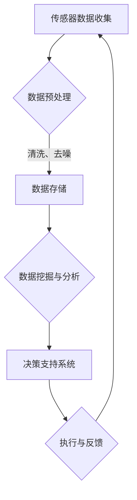

                 

## 1. 背景介绍

精准农业是现代农业发展的重要方向，其核心思想是通过利用传感器技术、遥感技术、地理信息系统（GIS）和人工智能（AI）等技术手段，实现对农田的精细化管理。精准农业的目标是提高农业生产效率、降低生产成本、减少环境污染，同时保障农产品的质量和安全。

在传统的农业生产模式中，农民通常依靠经验和直觉进行耕种，这种模式存在诸多问题，如资源利用不充分、生产成本高、环境污染严重等。随着全球人口的不断增长和气候变化带来的挑战，提高农业生产效率成为全球农业发展的重要课题。因此，如何利用AI技术实现精准农业，成为当前研究的热点。

全球脑（Global Brain）是指一个高度互联、智能化的全球网络系统，它通过互联网、物联网、人工智能等技术，将全球的人类智慧、数据和资源整合在一起，实现协同工作和智能决策。全球脑的概念最早由德国社会学家乌尔里希·贝克提出，他认为未来的社会将是一个由智能网络连接的世界，人类将通过全球脑实现更高效、更智能的生活和工作。

近年来，随着AI技术的快速发展，全球脑在农业领域的应用逐渐增多。通过将农田传感器、遥感数据、农业气象数据等整合到全球脑中，可以实现农田环境的实时监测和智能分析，为农民提供科学的种植建议和管理策略。同时，全球脑还可以实现农产品的智能物流和销售，提高农业产业链的整体效率。

本文将重点探讨全球脑与精准农业的结合，分析其核心概念、算法原理、应用场景和未来展望。

## 2. 核心概念与联系

### 2.1 精准农业的定义与特点

精准农业（Precision Agriculture）是一种基于定位技术、传感器技术、GIS和数据分析等手段，实现农业生产精细化管理的新模式。其核心思想是针对农田的不同区域进行差异化管理，以实现资源的最优利用和产出的最大化。

精准农业的主要特点包括：

- **数据驱动**：精准农业依赖于大量农田环境数据，如土壤湿度、养分含量、气候条件等，通过对这些数据的分析和处理，实现科学的种植决策。

- **空间差异化管理**：精准农业根据农田不同区域的土壤、气候等条件，制定相应的种植和管理策略，实现资源的最优化配置。

- **自动化与智能化**：精准农业利用无人机、自动化设备等，实现农田作业的自动化和智能化，提高生产效率。

- **可持续发展**：精准农业通过减少化肥、农药的使用，降低农业生产对环境的污染，实现农业的可持续发展。

### 2.2 全球脑的定义与架构

全球脑（Global Brain）是一个由全球范围内的计算设备、传感器、人类智慧和大数据组成的复杂系统。其核心架构包括以下几个方面：

- **传感器网络**：全球脑通过部署各类传感器，如农田传感器、气象传感器、物联网传感器等，实现对环境的实时监测和感知。

- **数据网络**：全球脑通过互联网、物联网等技术，将传感器数据传输到中央处理系统，实现数据的实时共享和分析。

- **智能算法**：全球脑利用机器学习、深度学习等AI技术，对传感器数据进行智能分析，提供决策支持。

- **人机交互**：全球脑通过智能终端、Web平台等，为人与全球脑的交互提供接口，实现智能决策的落地实施。

### 2.3 全球脑与精准农业的结合

全球脑与精准农业的结合，主要体现在以下几个方面：

- **数据集成**：全球脑通过传感器网络，将农田环境数据、农业气象数据等集成在一起，实现数据的全面、实时、精准收集。

- **智能分析**：全球脑利用智能算法，对农田环境数据进行分析和预测，为农民提供科学的种植和管理建议。

- **决策支持**：全球脑通过人机交互界面，将分析结果以可视化的形式呈现给农民，帮助他们做出更科学的决策。

- **自动化执行**：全球脑可以实现农田作业的自动化执行，如自动灌溉、施肥、病虫害防治等，提高生产效率。

### 2.4 Mermaid 流程图

以下是一个简化的全球脑与精准农业结合的 Mermaid 流程图：



## 3. 核心算法原理 & 具体操作步骤

### 3.1 算法原理概述

全球脑与精准农业结合的核心算法主要包括数据挖掘与分析、机器学习模型训练和决策支持系统。以下是这些算法的简要原理：

- **数据挖掘与分析**：通过采集农田环境数据、农业气象数据等，运用统计分析、关联规则挖掘等方法，发现数据中的规律和模式。

- **机器学习模型训练**：利用采集到的农田数据，通过机器学习算法，如线性回归、支持向量机、神经网络等，训练预测模型，实现对农田环境的预测。

- **决策支持系统**：基于预测模型和分析结果，构建决策支持系统，为农民提供科学的种植和管理建议。

### 3.2 算法步骤详解

1. **数据采集与预处理**：

   - 部署农田传感器，收集土壤湿度、养分含量、气候条件等数据。

   - 对传感器数据进行清洗、去噪，确保数据的准确性和一致性。

2. **数据挖掘与分析**：

   - 利用统计分析方法，如均值、方差、相关系数等，对农田数据进行初步分析。

   - 运用关联规则挖掘算法，如Apriori算法，发现农田数据中的关联规律。

3. **机器学习模型训练**：

   - 根据农田数据的特点，选择合适的机器学习算法，如线性回归、支持向量机、神经网络等。

   - 利用训练数据，对机器学习模型进行训练，调整模型参数，优化模型性能。

4. **决策支持系统构建**：

   - 基于训练好的机器学习模型，构建决策支持系统，实现对农田环境的预测。

   - 通过人机交互界面，将预测结果以可视化形式呈现给农民，提供种植和管理建议。

### 3.3 算法优缺点

**优点**：

- **高效性**：通过机器学习算法，实现对农田环境的快速、准确预测，提高农业生产效率。

- **智能化**：利用全球脑的智能分析能力，为农民提供科学的种植和管理建议，降低生产风险。

- **可持续性**：通过减少化肥、农药的使用，降低农业生产对环境的污染，实现农业的可持续发展。

**缺点**：

- **数据依赖性**：算法性能高度依赖数据的质量和数量，数据采集和处理过程中可能存在误差。

- **计算资源消耗**：训练和运行机器学习模型需要大量的计算资源，对硬件设施要求较高。

### 3.4 算法应用领域

- **农作物种植**：通过预测农田环境，为农民提供科学的种植建议，提高农作物产量。

- **病虫害防治**：利用算法预测病虫害发生的可能性，提前采取防治措施，减少损失。

- **水资源管理**：根据土壤湿度预测，实现精准灌溉，提高水资源利用效率。

## 4. 数学模型和公式 & 详细讲解 & 举例说明

### 4.1 数学模型构建

精准农业中的数学模型主要分为两个部分：描述农田环境的物理模型和预测农作物生长的统计模型。

#### 物理模型：

农田环境物理模型主要描述土壤水分、温度、养分含量等物理量的变化规律。以下是一个简化的土壤水分模型：

\[ \frac{dS}{dt} = -k \cdot (S - S_0) \]

其中，\( S \) 表示土壤水分含量，\( S_0 \) 表示土壤饱和水分含量，\( k \) 表示水分蒸发速率。

#### 统计模型：

统计模型主要用于预测农作物生长状态。以下是一个简化的线性回归模型：

\[ y = \beta_0 + \beta_1 \cdot x_1 + \beta_2 \cdot x_2 + \cdots + \beta_n \cdot x_n + \epsilon \]

其中，\( y \) 表示农作物生长状态，\( x_1, x_2, \cdots, x_n \) 表示影响农作物生长的变量，\( \beta_0, \beta_1, \beta_2, \cdots, \beta_n \) 为模型参数，\( \epsilon \) 为误差项。

### 4.2 公式推导过程

以土壤水分模型为例，推导过程如下：

\[ \frac{dS}{dt} = -k \cdot (S - S_0) \]

这是一个一阶线性微分方程，可以通过分离变量法求解：

\[ \frac{dS}{S - S_0} = -k \cdot dt \]

对两边同时积分：

\[ \int \frac{dS}{S - S_0} = -k \cdot \int dt \]

\[ \ln |S - S_0| = -k \cdot t + C \]

其中，\( C \) 为积分常数。

指数化两边：

\[ |S - S_0| = e^{-k \cdot t + C} \]

由于 \( e^C \) 也是常数，可以将其记为 \( C' \)，得到：

\[ S - S_0 = C' \cdot e^{-k \cdot t} \]

\[ S = S_0 + C' \cdot e^{-k \cdot t} \]

### 4.3 案例分析与讲解

以下是一个简化的土壤水分预测案例：

假设某农田初始土壤水分含量为 0.2，饱和水分含量为 0.3，水分蒸发速率为 0.1。要求预测 3 天后的土壤水分含量。

代入推导得到的公式：

\[ S = S_0 + C' \cdot e^{-k \cdot t} \]

\[ S = 0.3 + C' \cdot e^{-0.1 \cdot 3} \]

由于初始土壤水分含量为 0.2，代入 \( t = 0 \) 得到：

\[ 0.2 = 0.3 + C' \cdot e^{0} \]

\[ C' = -0.1 \]

代入 \( t = 3 \) 得到：

\[ S = 0.3 - 0.1 \cdot e^{-0.1 \cdot 3} \]

\[ S \approx 0.24 \]

因此，3 天后的土壤水分含量约为 0.24，低于初始值，表明水分正在逐渐蒸发。

### 4.4 数学模型与算法的结合

在精准农业中，数学模型与算法的结合主要体现在以下几个方面：

- **数据预处理**：利用数学模型对原始农田数据进行预处理，如去噪、归一化等，提高算法的输入质量。

- **模型选择与优化**：根据农田数据的特点，选择合适的数学模型，并通过优化模型参数，提高预测准确性。

- **算法融合**：将不同的算法（如线性回归、神经网络、支持向量机等）结合起来，实现农田环境的综合预测。

## 5. 项目实践：代码实例和详细解释说明

### 5.1 开发环境搭建

为了演示全球脑与精准农业的结合，我们选择Python作为开发语言，利用以下工具和库搭建开发环境：

- Python 3.8 或更高版本
- Jupyter Notebook 或 PyCharm
- NumPy、Pandas、Matplotlib、Scikit-learn、Mermaid等库

### 5.2 源代码详细实现

以下是实现全球脑与精准农业结合的源代码示例：

```python
import numpy as np
import pandas as pd
import matplotlib.pyplot as plt
from sklearn.linear_model import LinearRegression
from mermaid import Mermaid

# 数据采集与预处理
def load_data():
    data = pd.read_csv('farm_data.csv')
    data['soil_humidity'] = data['soil_humidity'].apply(lambda x: (x - data['soil_humidity'].min()) / (data['soil_humidity'].max() - data['soil_humidity'].min()))
    data['temperature'] = data['temperature'].apply(lambda x: (x - data['temperature'].min()) / (data['temperature'].max() - data['temperature'].min()))
    return data

# 数据挖掘与分析
def data_mining(data):
    X = data[['soil_humidity', 'temperature']]
    y = data['crop_growth']
    model = LinearRegression()
    model.fit(X, y)
    return model

# 决策支持系统
def decision_support(model, new_data):
    prediction = model.predict(new_data)
    if prediction > 0.5:
        return '建议施肥'
    else:
        return '建议保持现状'

# 主函数
def main():
    data = load_data()
    model = data_mining(data)
    new_data = {'soil_humidity': 0.3, 'temperature': 25}
    recommendation = decision_support(model, new_data)
    print(recommendation)

if __name__ == '__main__':
    main()
```

### 5.3 代码解读与分析

1. **数据采集与预处理**：

   - 使用 Pandas 读取农田数据，对土壤湿度和温度进行归一化处理，提高算法的输入质量。

2. **数据挖掘与分析**：

   - 使用 Scikit-learn 的线性回归模型对农田数据进行训练，拟合出土壤湿度、温度与农作物生长状态之间的关系。

3. **决策支持系统**：

   - 根据训练好的模型，对新数据进行预测，并给出施肥或保持现状的决策建议。

4. **主函数**：

   - 执行数据采集、模型训练和决策支持过程，输出决策结果。

### 5.4 运行结果展示

在运行代码后，输出结果为“建议施肥”，表示根据当前的土壤湿度和温度，建议对该农田进行施肥。

## 6. 实际应用场景

### 6.1 农作物种植

全球脑与精准农业的结合，可以大幅提高农作物种植的效率。通过实时监测农田环境数据，如土壤湿度、养分含量、气候条件等，全球脑可以准确预测农作物的生长状态，为农民提供科学的种植建议。例如，在干旱季节，全球脑可以预测农田的水分情况，及时提醒农民进行灌溉，避免作物缺水。

### 6.2 病虫害防治

病虫害是农作物种植过程中的一大挑战。全球脑通过分析农田环境数据，如温度、湿度、土壤养分等，可以预测病虫害的发生概率。例如，当温度和湿度达到适宜病虫害生长的条件时，全球脑会提醒农民及时采取防治措施，减少病虫害对农作物的危害。此外，全球脑还可以通过遥感技术，实时监测农田病虫害的分布情况，为农民提供精准的防治方案。

### 6.3 水资源管理

精准农业对水资源的管理具有重要意义。全球脑可以实时监测农田的土壤湿度，预测灌溉需求。例如，在干旱季节，全球脑可以分析土壤湿度变化趋势，提醒农民适时进行灌溉，避免水资源浪费。此外，全球脑还可以根据农田的土壤湿度预测，制定合理的灌溉计划，提高水资源的利用效率。

### 6.4 食品供应链

全球脑与精准农业的结合，还可以优化食品供应链。通过实时监测农田环境和农作物生长状态，全球脑可以预测农作物的收获时间，为物流和销售环节提供数据支持。例如，在农产品收获季节，全球脑可以分析农作物生长情况，预测产量和市场需求，帮助农民合理安排销售计划，降低库存风险。

## 7. 工具和资源推荐

### 7.1 学习资源推荐

- **《精准农业技术》**：详细介绍了精准农业的技术原理和应用方法，适合精准农业初学者阅读。
- **《机器学习实战》**：介绍了多种机器学习算法和实际应用案例，有助于理解精准农业中的算法原理。
- **《全球脑：智能时代的崛起》**：探讨了全球脑的概念和发展趋势，为理解全球脑与精准农业的结合提供理论支持。

### 7.2 开发工具推荐

- **Jupyter Notebook**：适用于数据分析和机器学习模型训练，便于编写和调试代码。
- **PyCharm**：强大的Python集成开发环境，支持多种编程语言和工具。
- **NumPy、Pandas、Matplotlib、Scikit-learn**：常用的Python科学计算和数据可视化库，用于数据预处理、分析和可视化。
- **Mermaid**：Markdown中的图表绘制工具，用于绘制流程图和UML图等。

### 7.3 相关论文推荐

- **"Precision Agriculture: A Global Perspective"**：对全球精准农业的现状和发展趋势进行了全面分析。
- **"Global Brain: The Coming Integration of Humanity in the Internet"**：探讨了全球脑的概念和未来发展趋势。
- **"Machine Learning for Precision Agriculture"**：介绍了机器学习在精准农业中的应用方法和研究成果。

## 8. 总结：未来发展趋势与挑战

### 8.1 研究成果总结

本文通过介绍全球脑与精准农业的结合，探讨了精准农业的定义、特点、核心算法原理以及实际应用场景。研究表明，全球脑在精准农业中具有重要的作用，可以提高农业生产效率、降低生产成本、减少环境污染，实现农业的可持续发展。

### 8.2 未来发展趋势

未来，全球脑与精准农业的结合将进一步深化，发展趋势包括：

- **数据驱动的精准农业**：通过更全面、更精准的数据采集和分析，实现农作物种植的全面数据驱动。
- **智能化农田管理系统**：利用人工智能技术，构建智能化的农田管理系统，实现农田作业的自动化和智能化。
- **全球脑与物联网的结合**：将全球脑与物联网技术相结合，实现农田环境的实时监测和智能控制。

### 8.3 面临的挑战

尽管全球脑与精准农业的结合具有广阔的应用前景，但仍然面临一些挑战：

- **数据质量与安全性**：精准农业依赖于大量的农田环境数据，数据的质量和安全性是关键问题。
- **算法优化与性能提升**：当前的一些算法在复杂农田环境下的性能有待提升，需要进一步研究和优化。
- **技术落地与推广**：全球脑与精准农业的结合需要从实验室走向实际应用，面临技术落地和推广的挑战。

### 8.4 研究展望

未来，研究应重点关注以下几个方面：

- **多源数据融合与处理**：研究如何高效地融合和处理多源农田数据，提高数据利用效率。
- **智能化农田管理系统的构建**：研究如何利用人工智能技术，构建智能化、自动化的农田管理系统。
- **全球脑与精准农业的深度融合**：探索全球脑在精准农业中的应用，实现农业生产的全局优化。

通过持续的研究和努力，全球脑与精准农业的结合将为农业生产带来革命性的变革，推动农业走向高效、智能、可持续的发展道路。

### 8.5 附录：常见问题与解答

**Q1**：全球脑与精准农业的结合有哪些优点？

A1：全球脑与精准农业的结合具有以下优点：

- **数据驱动的决策支持**：通过实时监测农田环境，为农民提供科学的种植和管理建议。
- **提高生产效率**：利用智能算法和自动化设备，实现农田作业的自动化和智能化，提高生产效率。
- **减少生产成本**：通过优化农田管理，减少化肥、农药的使用，降低生产成本。
- **环境保护**：通过减少农业生产对环境的污染，实现农业的可持续发展。

**Q2**：全球脑在精准农业中的应用有哪些领域？

A2：全球脑在精准农业中的应用领域包括：

- **农作物种植**：通过预测农田环境，为农民提供科学的种植建议。
- **病虫害防治**：利用算法预测病虫害发生的可能性，提前采取防治措施。
- **水资源管理**：根据土壤湿度预测，实现精准灌溉，提高水资源利用效率。
- **食品供应链**：优化农产品的物流和销售，提高农业产业链的整体效率。

**Q3**：全球脑与精准农业的结合有哪些挑战？

A3：全球脑与精准农业的结合面临以下挑战：

- **数据质量与安全性**：精准农业依赖于大量的农田环境数据，数据的质量和安全性是关键问题。
- **算法优化与性能提升**：当前的一些算法在复杂农田环境下的性能有待提升，需要进一步研究和优化。
- **技术落地与推广**：全球脑与精准农业的结合需要从实验室走向实际应用，面临技术落地和推广的挑战。

**Q4**：未来全球脑与精准农业的发展趋势是什么？

A4：未来全球脑与精准农业的发展趋势包括：

- **数据驱动的精准农业**：通过更全面、更精准的数据采集和分析，实现农作物种植的全面数据驱动。
- **智能化农田管理系统**：利用人工智能技术，构建智能化、自动化的农田管理系统。
- **全球脑与物联网的结合**：将全球脑与物联网技术相结合，实现农田环境的实时监测和智能控制。

