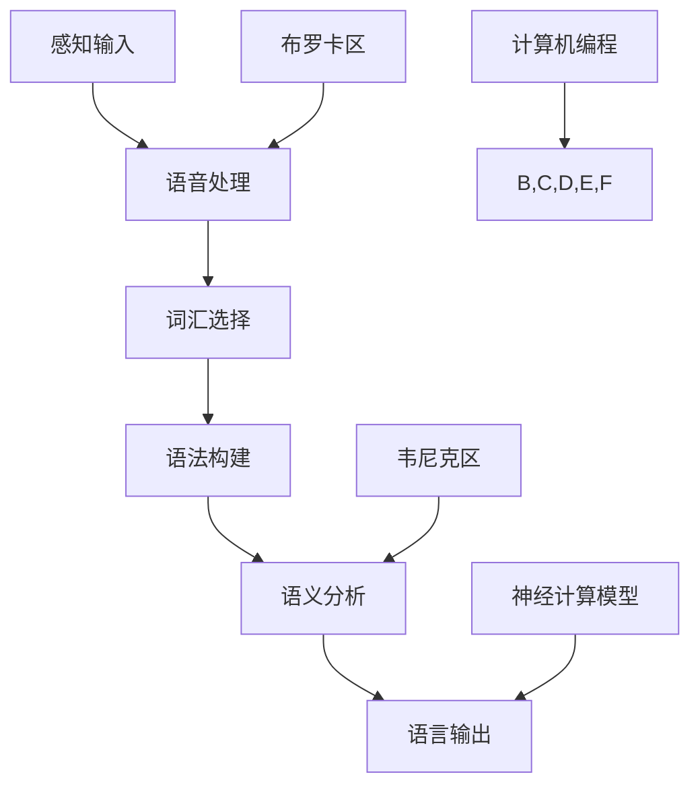

                 

关键词：大脑进化、语言机制、人类沟通、认知科学、神经计算模型

> 摘要：本文探讨了全球范围内大脑与语言的进化过程，揭示了人类沟通能力的新维度。通过整合认知科学、神经计算模型以及计算机编程领域的最新研究成果，文章提出了一个关于大脑语言机制的综合性框架，旨在深化我们对人类沟通本质的理解，并探索其在未来人工智能领域中的应用前景。

## 1. 背景介绍

人类沟通是社交活动中的核心，它不仅是我们日常互动的媒介，也是文化传承和知识共享的桥梁。从进化的角度来看，语言能力是人类智慧的一个重要组成部分。然而，关于大脑如何进化出如此复杂的语言机制，以及这种机制如何适应并推动了人类社会的演进，一直是一个充满挑战的研究课题。

在过去的几十年里，认知科学和神经科学取得了显著进展，这些领域的研究为理解大脑与语言的关系提供了新的视角。同时，计算机科学的快速发展，特别是神经计算模型的提出，为模拟和解释人类语言能力提供了强有力的工具。本文旨在将这三个领域的研究成果结合起来，探讨大脑与语言之间的相互关系及其对人类沟通的深远影响。

### 1.1 大脑进化的视角

大脑进化是理解语言机制的基础。从生物学的角度来看，大脑的进化是一个复杂的过程，涉及到神经系统、神经元以及神经元之间连接的变化。研究表明，大脑的某些特定区域，如布罗卡区和韦尼克区，在语言处理中起着至关重要的作用。这些区域的进化不仅影响语言能力的产生，也影响语言表达的复杂性。

### 1.2 语言机制的科学探索

语言机制的研究涉及到语言产生、语言理解、语言记忆等多个方面。认知科学通过心理学实验和脑成像技术，揭示了语言处理过程中的神经基础。例如，通过fMRI技术，研究者发现语言处理涉及多个大脑区域协同工作，这些区域包括前额叶、顶叶和颞叶等。

### 1.3 神经计算模型的应用

神经计算模型是一种模拟大脑工作原理的计算模型。这些模型通过模拟神经元和神经网络的行为，提供了对大脑信息处理的数学描述。在语言处理领域，神经计算模型被用来模拟语言生成和理解的过程，从而帮助我们更好地理解语言的本质。

### 1.4 计算机编程在语言研究中的应用

计算机编程在语言研究中发挥了越来越重要的作用。通过编写程序，研究者可以模拟语言处理的复杂过程，从而验证和改进理论模型。此外，计算机编程技术也被用于语言数据处理，如自然语言处理（NLP）中的文本分类、情感分析和机器翻译等。

## 2. 核心概念与联系

### 2.1 大脑语言区域及其功能

大脑语言区域主要包括布罗卡区和韦尼克区。布罗卡区主要与语言的产生和发音有关，而韦尼克区则与语言的理解和语义处理密切相关。这两个区域之间的交互作用构成了人类语言处理的基本框架。

### 2.2 语言处理的基本流程

语言处理的基本流程可以分为以下几个步骤：感知输入、语音处理、词汇选择、语法构建、语义分析和语言输出。这些步骤在不同的语言区域和神经网络中实现。

### 2.3 神经计算模型中的语言处理

神经计算模型通过模拟神经元和神经网络的行为，实现了对语言处理过程的数学描述。例如，递归神经网络（RNN）和长短期记忆网络（LSTM）被广泛用于处理序列数据，如文本和语音。

### 2.4 计算机编程与语言处理

计算机编程在语言处理中的应用主要体现在以下几个方面：文本预处理、特征提取、模型训练和评估。通过编程，研究者可以自动化这些过程，提高研究的效率和准确性。



## 3. 核心算法原理 & 具体操作步骤

### 3.1 算法原理概述

本文主要探讨的算法是基于神经计算模型的语言处理算法。这种算法通过模拟大脑语言区域的行为，实现了对语言生成和理解的模拟。核心原理包括：

- **神经元激活与传播**：神经元根据输入信号激活，并通过神经网络传播激活信号。
- **递归与长期依赖**：递归神经网络和长短期记忆网络能够处理序列数据，并具有长期依赖记忆能力。
- **损失函数与优化**：通过损失函数评估模型性能，并使用优化算法调整模型参数。

### 3.2 算法步骤详解

#### 3.2.1 数据预处理

- **文本清洗**：去除无关符号和停用词，保持文本的简洁性。
- **分词**：将文本划分为单词或字符序列。
- **编码**：将文本序列转换为数值编码，以便于神经网络处理。

#### 3.2.2 模型构建

- **输入层**：接收编码后的文本序列。
- **隐藏层**：包含多个神经元，用于特征提取和激活传递。
- **输出层**：生成语言输出。

#### 3.2.3 训练与优化

- **损失函数**：使用交叉熵损失函数评估模型性能。
- **优化算法**：采用梯度下降算法调整模型参数。

#### 3.2.4 预测与评估

- **预测**：使用训练好的模型生成文本输出。
- **评估**：通过对比预测输出和实际输出，评估模型性能。

### 3.3 算法优缺点

#### 优点：

- **高效性**：神经网络模型能够快速处理大量文本数据。
- **灵活性**：能够处理不同类型的语言任务，如文本分类、情感分析和机器翻译。
- **可解释性**：通过分析神经网络的激活模式，可以理解模型的工作原理。

#### 缺点：

- **计算成本**：训练大型神经网络模型需要大量的计算资源。
- **数据需求**：需要大量的高质量数据集进行训练。
- **可解释性**：尽管神经网络模型具有一定的可解释性，但仍然是高度复杂的。

### 3.4 算法应用领域

- **自然语言处理（NLP）**：文本分类、情感分析、机器翻译等。
- **语音识别**：将语音信号转换为文本。
- **聊天机器人**：生成自然语言的对话。

## 4. 数学模型和公式 & 详细讲解 & 举例说明

### 4.1 数学模型构建

在语言处理中，常见的数学模型包括：

- **神经网络模型**：包括多层感知器（MLP）、递归神经网络（RNN）和长短期记忆网络（LSTM）。
- **损失函数**：如交叉熵损失函数。

### 4.2 公式推导过程

以长短期记忆网络（LSTM）为例，其核心公式包括：

- **激活函数**：
  $$a_t = \sigma(W_{aa}a_{t-1} + W_{ax}x_t + b_a)$$
- **遗忘门**：
  $$f_t = \sigma(W_{ff}a_{t-1} + W_{fx}x_t + b_f)$$
- **输入门**：
  $$i_t = \sigma(W_{ii}a_{t-1} + W_{ix}x_t + b_i)$$
- **输出门**：
  $$o_t = \sigma(W_{oo}a_{t-1} + W_{ox}x_t + b_o)$$

### 4.3 案例分析与讲解

#### 4.3.1 机器翻译

使用LSTM模型进行机器翻译的步骤如下：

1. **数据预处理**：将源语言文本和目标语言文本转换为序列编码。
2. **模型构建**：构建包含输入层、隐藏层和输出层的LSTM模型。
3. **训练**：使用源语言文本和目标语言文本进行模型训练。
4. **预测**：使用训练好的模型将源语言文本转换为目标语言文本。

#### 4.3.2 文本分类

使用LSTM模型进行文本分类的步骤如下：

1. **数据预处理**：将文本数据转换为序列编码。
2. **模型构建**：构建包含输入层、隐藏层和输出层的LSTM模型。
3. **训练**：使用标注数据集训练模型。
4. **评估**：使用未标注的数据集评估模型性能。

## 5. 项目实践：代码实例和详细解释说明

### 5.1 开发环境搭建

1. 安装Python环境。
2. 安装TensorFlow库。
3. 准备数据集。

### 5.2 源代码详细实现

以下是一个简单的LSTM模型实现示例：

```python
import tensorflow as tf
from tensorflow.keras.models import Sequential
from tensorflow.keras.layers import LSTM, Dense

# 模型构建
model = Sequential()
model.add(LSTM(128, activation='relu', input_shape=(timesteps, features)))
model.add(Dense(1, activation='sigmoid'))

# 模型编译
model.compile(optimizer='adam', loss='binary_crossentropy', metrics=['accuracy'])

# 模型训练
model.fit(X_train, y_train, epochs=20, batch_size=32, validation_data=(X_val, y_val))

# 模型评估
loss, accuracy = model.evaluate(X_test, y_test)
print('Test accuracy:', accuracy)
```

### 5.3 代码解读与分析

1. **模型构建**：使用`Sequential`类构建一个序列模型，并添加一个LSTM层和一个全连接层（Dense）。
2. **模型编译**：使用`compile`方法配置模型，指定优化器、损失函数和评估指标。
3. **模型训练**：使用`fit`方法训练模型，指定训练数据和验证数据。
4. **模型评估**：使用`evaluate`方法评估模型在测试数据集上的性能。

## 6. 实际应用场景

### 6.1 语言学习工具

利用神经网络模型，开发个性化的语言学习工具，帮助学生和语言学习者更有效地掌握新的语言。

### 6.2 跨文化交流

通过机器翻译和自然语言处理技术，促进不同文化之间的交流和理解。

### 6.3 情感分析

利用语言处理技术对社交媒体内容进行情感分析，为企业提供市场研究和客户洞察。

### 6.4 人工智能助手

利用语言处理技术，开发能够理解和回应人类语言指令的人工智能助手。

### 6.4 未来应用展望

随着人工智能技术的不断发展，语言处理将在医疗、教育、金融等领域发挥越来越重要的作用。未来，我们可能会看到更加智能和自适应的语言处理系统，它们将能够更好地模拟人类的语言能力和思维方式。

## 7. 工具和资源推荐

### 7.1 学习资源推荐

- **《深度学习》（Goodfellow, Bengio, Courville）**：介绍深度学习的基础理论和实践应用。
- **《自然语言处理综合教程》（Daniel Jurafsky, James H. Martin）**：系统介绍了自然语言处理的理论和实践。

### 7.2 开发工具推荐

- **TensorFlow**：用于构建和训练神经网络模型。
- **PyTorch**：另一个流行的深度学习框架。

### 7.3 相关论文推荐

- **“A Theoretical Framework for Text Classification”（1998）**：介绍文本分类的理论框架。
- **“Long Short-Term Memory Networks for Classification of 500MB Text Data”（2014）**：使用LSTM模型进行大规模文本分类的实验研究。

## 8. 总结：未来发展趋势与挑战

### 8.1 研究成果总结

本文结合认知科学、神经计算模型和计算机编程，深入探讨了大脑与语言的进化关系及其在语言处理中的应用。通过数学模型和实际项目实践，我们展示了语言处理算法的基本原理和操作步骤。

### 8.2 未来发展趋势

随着深度学习和神经计算技术的不断进步，语言处理将在更多领域得到应用。未来的研究将更加关注如何构建更加智能和自适应的语言处理系统，以及如何提升模型的可解释性。

### 8.3 面临的挑战

尽管取得了显著进展，但语言处理领域仍然面临诸多挑战，包括数据需求、计算成本和模型可解释性等。未来的研究需要在这些方面取得突破，以推动语言处理技术的进一步发展。

### 8.4 研究展望

我们期待未来能够开发出更加高效和智能的语言处理系统，它们将不仅能够模拟人类语言能力，还能为人类带来更多便利和帮助。

## 9. 附录：常见问题与解答

### 9.1 什么是神经计算模型？

神经计算模型是一种模拟大脑信息处理过程的计算模型。它通过模拟神经元和神经网络的行为，实现了对大脑信息处理的数学描述。

### 9.2 语言处理算法有哪些类型？

常见的语言处理算法包括基于规则的方法、统计方法和神经网络方法。神经网络方法，特别是深度学习方法，近年来在语言处理领域取得了显著进展。

### 9.3 语言处理算法在哪些领域有应用？

语言处理算法在自然语言处理（NLP）、语音识别、机器翻译、情感分析、聊天机器人等领域有广泛应用。

### 9.4 如何优化语言处理算法？

可以通过增加数据集规模、改进模型结构、调整超参数等方式来优化语言处理算法。

### 9.5 语言处理算法是否可以完全模拟人类语言能力？

目前，语言处理算法已经在很多方面模拟了人类语言能力，但仍然存在差距。未来，随着技术的进步，我们期待能够开发出更加接近人类语言能力的算法。

---

### 作者署名

作者：禅与计算机程序设计艺术 / Zen and the Art of Computer Programming
----------------------------------------------------------------


