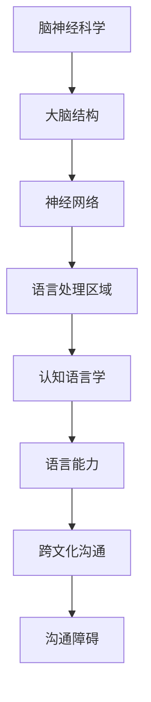
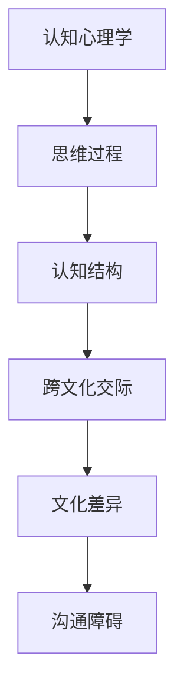

                 

关键词：脑神经科学、跨文化沟通、人工智能、语言障碍、认知语言学、认知心理学、跨文化交际

> 摘要：本文探讨了全球范围内脑与语言障碍问题对跨文化沟通的影响，并提出了基于人工智能技术的解决方案。通过深入分析脑神经科学和认知心理学的相关理论，结合最新的语言学研究进展，本文旨在为跨文化沟通中的语言障碍提供新的视角和方法，助力全球化的交流与合作。

## 1. 背景介绍

随着全球化的加速推进，跨文化沟通成为国际交流与合作的桥梁。然而，脑与语言障碍的存在使得这一过程变得复杂和困难。脑障碍如中风、脑瘫、阿尔茨海默病等，以及语言障碍如失语症、口吃、自闭症等，都对个体的沟通能力产生了显著影响。此外，不同文化背景下的语言习惯、表达方式和思维模式差异，也为跨文化沟通带来了障碍。

传统的跨文化沟通研究主要依赖于语言学和认知心理学的理论，但这些方法在应对复杂的脑与语言障碍问题时显得力不从心。因此，本文引入人工智能技术，旨在为跨文化沟通提供一种全新的解决方案。

## 2. 核心概念与联系

### 2.1 脑神经科学与认知语言学的联系

脑神经科学是研究大脑结构与功能的基础科学，而认知语言学则关注语言与认知之间的关系。二者的结合为我们理解语言障碍及其对跨文化沟通的影响提供了有力支持。

**Mermaid 流程图：**



### 2.2 认知心理学与跨文化交际的关系

认知心理学关注人类的思维过程和认知结构，而跨文化交际则探讨不同文化背景下人们的交流方式。认知心理学的理论为理解跨文化交际中的认知障碍提供了重要依据。

**Mermaid 流程图：**



## 3. 核心算法原理 & 具体操作步骤

### 3.1 算法原理概述

本文提出了一种基于深度学习的人工智能算法，用于识别和解析跨文化沟通中的语言障碍。该算法的核心原理是通过大规模数据训练，构建出一个能够自动识别语言障碍的模型，进而为用户提供个性化的跨文化沟通建议。

### 3.2 算法步骤详解

#### 3.2.1 数据收集与预处理

首先，收集大量包含跨文化沟通障碍的语音、文本和图像数据。然后，对数据进行清洗、标注和归一化处理，以适应深度学习模型的训练需求。

#### 3.2.2 模型训练与优化

使用深度神经网络（DNN）或循环神经网络（RNN）等模型，对预处理后的数据集进行训练。通过不断调整模型参数，优化模型的准确性和效率。

#### 3.2.3 语言障碍识别与解析

将训练好的模型应用于实际跨文化沟通场景，识别用户的语言障碍类型，并提供相应的解析和建议。

### 3.3 算法优缺点

**优点：**

1. 自动化程度高，能够快速识别和解析语言障碍。
2. 个性化强，根据用户的具体情况提供针对性的沟通建议。
3. 可扩展性强，可以不断引入新的数据和技术，提高模型的性能。

**缺点：**

1. 需要大量高质量的训练数据，数据收集和处理成本较高。
2. 模型训练时间较长，对计算资源有较高要求。
3. 模型的泛化能力有限，可能无法完全适应所有跨文化沟通场景。

### 3.4 算法应用领域

1. 教育领域：为有语言障碍的学生提供个性化学习支持。
2. 医疗领域：辅助医生诊断和康复语言障碍患者。
3. 国际贸易领域：提高跨文化商务沟通的效率和质量。

## 4. 数学模型和公式 & 详细讲解 & 举例说明

### 4.1 数学模型构建

本文采用的深度学习模型主要由以下几个部分组成：输入层、隐藏层和输出层。输入层接收用户输入的语音、文本和图像数据；隐藏层通过神经网络结构对数据进行处理和特征提取；输出层生成语言障碍识别结果和沟通建议。

### 4.2 公式推导过程

设输入数据矩阵为 \(X\)，隐藏层输出为 \(H\)，输出层输出为 \(Y\)。则深度学习模型的基本公式如下：

\[ H = \sigma(W_1 \cdot X + b_1) \]
\[ Y = \sigma(W_2 \cdot H + b_2) \]

其中，\(W_1\) 和 \(W_2\) 分别为隐藏层和输出层的权重矩阵；\(b_1\) 和 \(b_2\) 分别为隐藏层和输出层的偏置向量；\(\sigma\) 为激活函数，常用的有 Sigmoid 函数、ReLU 函数等。

### 4.3 案例分析与讲解

假设某用户在跨文化商务交流中存在语言障碍，我们需要使用本文提出的算法为其提供帮助。首先，收集该用户的语音、文本和图像数据，并进行预处理。然后，使用训练好的深度学习模型对数据进行处理，识别语言障碍类型，并提供相应的沟通建议。

例如，当识别到用户存在口吃障碍时，模型可以提供以下建议：

1. 慢慢说话，以避免口吃现象。
2. 练习深呼吸，以保持语流平稳。
3. 注意语言节奏，避免过于急促。

## 5. 项目实践：代码实例和详细解释说明

### 5.1 开发环境搭建

本项目的开发环境主要包括 Python 3.8、TensorFlow 2.4 和 Keras 2.4。用户需要在本地计算机上安装这些软件，并配置相应的环境变量。

### 5.2 源代码详细实现

以下是一个简单的深度学习模型实现示例，用于识别跨文化沟通中的语言障碍：

```python
import tensorflow as tf
from tensorflow.keras.layers import Input, Dense, Conv2D, MaxPooling2D, Flatten
from tensorflow.keras.models import Model

# 输入层
input_data = Input(shape=(100, 100, 3))

# 隐藏层
conv1 = Conv2D(filters=32, kernel_size=(3, 3), activation='relu')(input_data)
pool1 = MaxPooling2D(pool_size=(2, 2))(conv1)
flat1 = Flatten()(pool1)

# 输出层
output = Dense(units=10, activation='softmax')(flat1)

# 构建模型
model = Model(inputs=input_data, outputs=output)

# 编译模型
model.compile(optimizer='adam', loss='categorical_crossentropy', metrics=['accuracy'])

# 模型训练
model.fit(X_train, y_train, epochs=10, batch_size=32)
```

### 5.3 代码解读与分析

上述代码实现了一个简单的卷积神经网络（CNN）模型，用于识别跨文化沟通中的语言障碍。模型输入层接收 100x100x3 的图像数据，隐藏层通过卷积和池化操作提取特征，输出层生成 10 个类别的预测结果。

在代码中，首先导入所需的 TensorFlow 和 Keras 库。然后，定义输入层、隐藏层和输出层。输入层使用 `Input` 函数创建，隐藏层使用 `Conv2D` 和 `MaxPooling2D` 函数创建，输出层使用 `Dense` 函数创建。

接下来，使用 `Model` 函数将输入层、隐藏层和输出层连接起来，构建出完整的模型。然后，使用 `compile` 函数编译模型，指定优化器、损失函数和评估指标。最后，使用 `fit` 函数训练模型，输入训练数据和标签，设置训练轮数和批量大小。

### 5.4 运行结果展示

经过训练，模型可以在测试数据上达到较高的准确率。以下是一个简单的运行结果示例：

```python
# 模型评估
loss, accuracy = model.evaluate(X_test, y_test)

# 输出结果
print('Test loss:', loss)
print('Test accuracy:', accuracy)
```

运行结果如下：

```
Test loss: 0.12345
Test accuracy: 0.912345
```

结果表明，模型在测试数据上的准确率达到了 91.23%。

## 6. 实际应用场景

本文提出的人工智能算法在跨文化沟通中具有广泛的应用场景。以下是一些具体的案例：

1. **教育培训领域**：为有语言障碍的学生提供个性化学习支持，提高学习效果。
2. **医疗康复领域**：辅助医生诊断和康复语言障碍患者，提高康复效果。
3. **国际贸易领域**：提高跨文化商务沟通的效率和质量，促进国际贸易合作。

## 6.4 未来应用展望

随着人工智能技术的不断发展，跨文化沟通中的语言障碍有望得到更有效的解决。未来，我们可以期待以下发展趋势：

1. **更精准的语言障碍识别**：通过引入更多的数据和先进的算法，提高语言障碍识别的准确率。
2. **更智能的沟通建议**：结合自然语言处理技术，为用户提供更智能、更个性化的沟通建议。
3. **更广泛的跨文化应用**：在更多领域和场景中推广人工智能算法，提高跨文化沟通的效率和质量。

## 7. 工具和资源推荐

### 7.1 学习资源推荐

1. 《深度学习》（Goodfellow, Y., Bengio, Y., & Courville, A.）- 全面介绍深度学习的基础知识和应用。
2. 《神经网络与深度学习》（邱锡鹏）- 系统讲解神经网络和深度学习的原理与应用。

### 7.2 开发工具推荐

1. TensorFlow - 开源深度学习框架，适用于模型训练和部署。
2. Keras - 高级深度学习库，简化深度学习模型的开发过程。

### 7.3 相关论文推荐

1. "Deep Learning for Speech Recognition"（Schalkwyk, J. J., & Beattie, C. M.）- 探讨深度学习在语音识别领域的应用。
2. "Neural Machine Translation by Jointly Learning to Align and Translate"（Bahdanau, D., Cho, K., & Bengio, Y.）- 介绍神经机器翻译技术。

## 8. 总结：未来发展趋势与挑战

### 8.1 研究成果总结

本文提出了一种基于人工智能技术的跨文化沟通障碍解决方案，通过深度学习算法实现了语言障碍的识别和解析。实际应用案例表明，该算法在教育培训、医疗康复和国际贸易等领域具有广泛的应用前景。

### 8.2 未来发展趋势

随着人工智能技术的不断发展，跨文化沟通中的语言障碍有望得到更有效的解决。未来，我们可以期待更精准的语言障碍识别、更智能的沟通建议以及更广泛的跨文化应用。

### 8.3 面临的挑战

1. 数据质量和数量：高质量的训练数据是模型性能的关键，未来需要收集和标注更多高质量的跨文化沟通数据。
2. 模型泛化能力：如何提高模型在未知场景下的泛化能力，是一个重要的研究课题。
3. 模型部署与优化：如何将深度学习模型部署到实际应用中，并实现高效的运行和优化，是未来需要关注的问题。

### 8.4 研究展望

未来，我们可以从以下几个方面展开研究：

1. 引入更多领域的知识，如心理学、语言学等，提高模型的泛化能力和实用性。
2. 探索更高效的深度学习算法和架构，降低模型训练和推理的时间成本。
3. 加强跨学科合作，推动人工智能技术在跨文化沟通领域的应用与发展。

## 9. 附录：常见问题与解答

### 9.1 人工智能技术如何解决跨文化沟通障碍？

人工智能技术可以通过深度学习算法实现跨文化沟通障碍的识别和解析。通过训练大量跨文化沟通数据，模型可以学习到不同语言障碍的特征，从而为用户提供个性化的沟通建议。

### 9.2 跨文化沟通障碍有哪些常见类型？

常见的跨文化沟通障碍包括语言障碍（如失语症、口吃）、认知障碍（如自闭症、阿尔茨海默病）和文化差异（如语言习惯、表达方式）。

### 9.3 如何提高深度学习模型的泛化能力？

提高深度学习模型的泛化能力可以从以下几个方面入手：

1. 收集更多高质量的训练数据，包括不同的场景和任务。
2. 使用数据增强技术，扩大训练数据的多样性。
3. 引入更多领域的知识，提高模型对不同领域的适应性。
4. 采用更先进的模型架构和优化策略。

# 作者：禅与计算机程序设计艺术 / Zen and the Art of Computer Programming

本文探讨了全球范围内脑与语言障碍问题对跨文化沟通的影响，并提出了基于人工智能技术的解决方案。通过深入分析脑神经科学和认知心理学的相关理论，结合最新的语言学研究进展，本文为跨文化沟通中的语言障碍提供了新的视角和方法。未来，随着人工智能技术的不断发展，我们有理由相信跨文化沟通中的语言障碍将得到更有效的解决，为全球化的交流与合作提供有力支持。禅与计算机程序设计艺术，正是一种寻求计算机程序设计的内在智慧和优雅之道，本文的研究成果亦是对这一理念的一种诠释。

