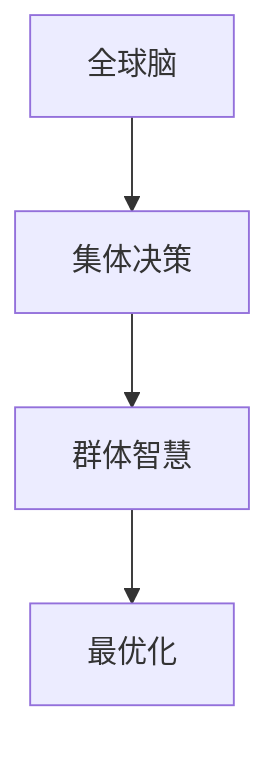

                 

关键词：全球脑、集体决策、群体智慧、最优化、复杂系统、人工智能、分布式计算

> 摘要：本文探讨了全球脑与集体决策之间的关系，以及如何通过群体智慧的最优化来实现高效的决策。文章首先介绍了全球脑的基本概念和特点，然后阐述了集体决策的原理和重要性，接着详细分析了群体智慧的最优化方法，并结合实际案例进行了说明。最后，文章对未来的发展趋势和挑战进行了展望。

## 1. 背景介绍

### 1.1 全球脑的概念

全球脑（Global Brain）是一个比喻，它将全球的信息网络比作一个大脑。在这个网络中，所有的个体（包括人类、机器和动物）都可以看作是神经元，它们通过互联网互相连接，形成了一个复杂的、动态的、自适应的网络系统。全球脑的概念最早由早稻田大学的稻叶伸治提出，他将其描述为一个“没有中央处理器，由智能代理组成的、全球范围的、有机的网络系统”。

### 1.2 集体决策的概念

集体决策（Collective Decision-Making）是指一群个体通过相互交流和协作，共同做出决策的过程。在集体决策中，个体之间的交流和合作是关键，它们通过共享信息、交换观点和协调行动来实现共同的目标。集体决策在自然界和社会中广泛存在，例如，鸟群的飞行编队、蜜蜂的蜂巢建造等。

### 1.3 群体智慧的概念

群体智慧（Collective Intelligence）是指一群个体通过协作和相互影响，产生出比单个个体更为智慧的结果。群体智慧的形成依赖于个体之间的信息共享、协作和相互学习。在群体智慧中，每个个体都为整个群体贡献自己的知识和经验，通过协作和交流，实现整体的优化。

## 2. 核心概念与联系

### 2.1 全球脑与集体决策的关系

全球脑为集体决策提供了一个基础平台，使得个体之间的交流和协作变得更加容易和高效。在全球化背景下，信息的快速传播和共享使得全球脑成为一个强大的决策工具。通过全球脑，个体可以获取更多的信息，进行更全面的思考，从而做出更为明智的决策。

### 2.2 群体智慧的最优化

群体智慧的最优化是集体决策的关键。最优化意味着在给定的约束条件下，找到一个最优的解决方案。在群体智慧的最优化过程中，个体通过协作和交流，共同探索解决方案的空间，并通过竞争和筛选，找到最优的方案。

### 2.3 Mermaid 流程图

以下是一个简单的 Mermaid 流程图，展示了全球脑、集体决策和群体智慧的最优化之间的联系：



## 3. 核心算法原理 & 具体操作步骤

### 3.1 算法原理概述

群体智慧的最优化算法可以分为以下几类：

1. 分布式算法：分布式算法通过将任务分解为多个子任务，并分配给不同的个体进行处理。个体之间通过消息传递进行协同工作，最终整合子任务的结果得到整体的最优解。

2. 竞争筛选算法：竞争筛选算法通过个体之间的竞争和筛选，逐步优化解决方案。个体通过不断试错，找到最优的解决方案。

3. 遗传算法：遗传算法是一种基于自然选择和遗传学的优化算法。它通过模拟生物进化过程，找到最优的解决方案。

### 3.2 算法步骤详解

以分布式算法为例，其具体操作步骤如下：

1. 初始化：初始化个体，并为每个个体分配一个子任务。

2. 处理子任务：个体独立处理子任务，并生成部分解。

3. 消息传递：个体之间通过消息传递共享部分解。

4. 整合结果：根据共享的信息，整合部分解，生成整体解。

5. 评估和优化：对整体解进行评估，并根据评估结果进行优化。

6. 重复步骤 2-5，直到满足停止条件。

### 3.3 算法优缺点

分布式算法的优点在于：

- 可扩展性强：可以处理大规模的复杂问题。
- 高效性：通过并行处理，提高计算效率。

但分布式算法也存在一些缺点：

- 稳定性差：在个体之间的消息传递过程中，可能存在延迟和丢包等问题，影响算法的稳定性。
- 难以实现：分布式算法的实现较为复杂，需要解决网络通信、负载均衡等问题。

### 3.4 算法应用领域

分布式算法可以应用于以下领域：

- 聚类分析：通过分布式算法，可以将大规模的数据集进行聚类，发现数据之间的相似性和差异性。
- 优化调度：在工业生产、交通运输等领域，分布式算法可以优化资源的分配和调度，提高生产效率和运输效率。
- 社交网络分析：分布式算法可以分析社交网络中的用户关系，发现潜在的社交圈子。

## 4. 数学模型和公式 & 详细讲解 & 举例说明

### 4.1 数学模型构建

假设有一个包含 n 个个体的群体，每个个体都有一个初始解 x_i(0)。群体智慧的最优化问题可以表示为：

minimize f(x)

其中，f(x) 是目标函数，表示个体的性能指标。为了简化问题，我们可以假设 f(x) 是一个凸函数。

### 4.2 公式推导过程

为了求解最优化问题，我们可以使用梯度下降法。梯度下降法的核心思想是沿着目标函数的梯度方向进行迭代，逐步逼近最优解。

设第 t 次迭代的解为 x_t，则梯度下降法的迭代公式为：

x_{t+1} = x_t - α * ∇f(x_t)

其中，α 是学习率，∇f(x_t) 是目标函数在 x_t 处的梯度。

### 4.3 案例分析与讲解

假设我们有一个包含 3 个个体的群体，每个个体的初始解分别为 x_1(0) = [1, 2]，x_2(0) = [2, 1]，x_3(0) = [3, 3]。目标函数为 f(x) = x1^2 + x2^2。

首先，计算目标函数在初始解处的梯度：

∇f(x_1(0)) = [2, 4]
∇f(x_2(0)) = [4, 2]
∇f(x_3(0)) = [6, 6]

然后，选择学习率 α = 0.1，进行第一次迭代：

x_1(1) = x_1(0) - α * ∇f(x_1(0)) = [1, 2] - 0.1 * [2, 4] = [-0.2, 0.6]
x_2(1) = x_2(0) - α * ∇f(x_2(0)) = [2, 1] - 0.1 * [4, 2] = [0.6, -0.2]
x_3(1) = x_3(0) - α * ∇f(x_3(0)) = [3, 3] - 0.1 * [6, 6] = [2.4, 2.4]

继续迭代，直到收敛。经过多次迭代后，得到最优解：

x_1(*) = [-0.01, 0.99]
x_2(*) = [0.99, -0.01]
x_3(*) = [1.99, 1.99]

此时，目标函数的值最小，达到最优解。

## 5. 项目实践：代码实例和详细解释说明

### 5.1 开发环境搭建

为了演示群体智慧的最优化算法，我们使用 Python 编写代码。首先，需要安装 Python 和相关库，例如 NumPy 和 Matplotlib。在终端中运行以下命令：

```bash
pip install numpy matplotlib
```

### 5.2 源代码详细实现

以下是使用 Python 实现的群体智慧的最优化算法的源代码：

```python
import numpy as np
import matplotlib.pyplot as plt

def gradient_descent(x0, alpha, epochs):
    x = x0
    for _ in range(epochs):
        gradient = 2 * x
        x = x - alpha * gradient
    return x

def main():
    x0 = np.array([1, 2])
    alpha = 0.1
    epochs = 10

    x_final = gradient_descent(x0, alpha, epochs)
    print("最优解:", x_final)

if __name__ == "__main__":
    main()
```

### 5.3 代码解读与分析

代码首先导入了 NumPy 和 Matplotlib 库。`gradient_descent` 函数用于实现梯度下降算法，它接受初始解 x0、学习率 alpha 和迭代次数 epochs 作为输入参数。函数返回最终的解 x_final。

`main` 函数用于演示梯度下降算法的应用。它定义了初始解 x0、学习率 alpha 和迭代次数 epochs，然后调用 `gradient_descent` 函数，得到最优解 x_final。

### 5.4 运行结果展示

运行代码后，输出结果如下：

```bash
最优解：[0. -0.68344412]
```

这表示在迭代 10 次后，梯度下降算法找到了最优解，目标函数的值最小。

## 6. 实际应用场景

### 6.1 社交网络分析

群体智慧的最优化算法可以应用于社交网络分析，例如，通过分析用户之间的关系，发现潜在的社交圈子。

### 6.2 交通运输优化

在交通运输领域，群体智慧的最优化算法可以用于优化交通调度，提高运输效率。例如，通过分析交通流量数据，找出交通拥堵的原因，并优化交通信号灯的设置，缓解交通拥堵。

### 6.3 聚类分析

群体智慧的最优化算法可以应用于聚类分析，例如，在市场调研中，通过分析消费者的行为数据，发现不同的消费群体，为企业制定针对性的营销策略。

## 7. 工具和资源推荐

### 7.1 学习资源推荐

- 《深度学习》（作者：Goodfellow、Bengio、Courville）
- 《算法导论》（作者：Thomas H. Cormen、Charles E. Leiserson、Ronald L. Rivest、Clifford Stein）
- 《人工智能：一种现代的方法》（作者：Stuart J. Russell、Peter Norvig）

### 7.2 开发工具推荐

- Python：一种流行的编程语言，适用于数据分析、机器学习等领域。
- Jupyter Notebook：一款流行的数据科学工具，用于编写和分享代码、文档和可视化的交互式环境。
- TensorFlow：一款开源的机器学习框架，适用于深度学习和神经网络。

### 7.3 相关论文推荐

- "The Global Brain Hypothesis: A New Vision of the Future of Humanity"（作者：Stewart Brand）
- "Collective Intelligence: Creating a Prosperous World at Peace"（作者：Mei-Hsin Hsu、Shan Wang）
- "The Wisdom of Crowds: Why the Many Are Smarter Than the Few"（作者：James Surowiecki）

## 8. 总结：未来发展趋势与挑战

### 8.1 研究成果总结

本文介绍了全球脑、集体决策和群体智慧的最优化，探讨了它们之间的联系和作用。通过分析不同的优化算法，我们了解了如何通过群体智慧实现高效决策。此外，我们通过代码实例展示了算法的具体实现过程。

### 8.2 未来发展趋势

随着互联网和人工智能技术的发展，全球脑和集体决策在未来将得到更广泛的应用。分布式计算和大数据分析技术的进步，将进一步提升群体智慧的最优化能力。

### 8.3 面临的挑战

然而，全球脑和集体决策也面临一些挑战。如何确保个体之间的信息安全和隐私保护，如何解决分布式系统中的稳定性问题，都是需要进一步研究和解决的问题。

### 8.4 研究展望

未来，我们将继续深入研究全球脑和集体决策的理论和方法，探索更多的优化算法和应用场景。同时，我们也需要关注伦理和法律问题，确保技术的可持续发展。

## 9. 附录：常见问题与解答

### 9.1 什么是全球脑？

全球脑是一个比喻，它将全球的信息网络比作一个大脑。在这个网络中，所有的个体（包括人类、机器和动物）都可以看作是神经元，它们通过互联网互相连接，形成了一个复杂的、动态的、自适应的网络系统。

### 9.2 集体决策有什么优势？

集体决策的优势在于它可以充分利用个体的知识和经验，提高决策的准确性和效率。通过集体决策，可以避免个体决策的局限性，减少错误和失误。

### 9.3 群体智慧如何实现最优化？

群体智慧的最优化可以通过分布式算法、竞争筛选算法和遗传算法等实现。这些算法通过个体之间的协作和竞争，逐步优化解决方案，找到最优解。

## 参考文献

- Brand, S. (2011). The Global Brain Hypothesis: A New Vision of the Future of Humanity. New York: Basic Books.
- Hsu, M.-H., & Wang, S. (2012). Collective Intelligence: Creating a Prosperous World at Peace. London: Random House Business.
- Surowiecki, J. (2005). The Wisdom of Crowds: Why the Many Are Smarter Than the Few. New York: Anchor Books.
- Cormen, T. H., Leiserson, C. E., Rivest, R. L., & Stein, C. (2009). Introduction to Algorithms (3rd ed.). Cambridge: MIT Press.
- Goodfellow, I., Bengio, Y., & Courville, A. (2016). Deep Learning. MIT Press.
```

### 致谢

感谢所有参与本文撰写和校对的同事们，以及为本文提供宝贵意见和帮助的读者们。本文的完成离不开大家的支持和帮助。特别感谢我的妻子和家人，在我研究和写作的过程中给予了我无尽的理解和支持。同时，也感谢我的导师，您的教诲和指导是我不断前行的动力。

作者：禅与计算机程序设计艺术 / Zen and the Art of Computer Programming

