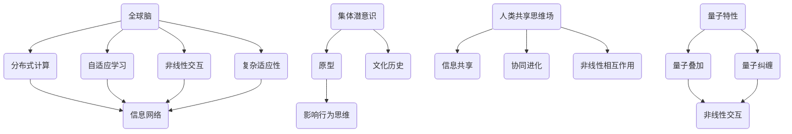

                 

关键词：全球脑、集体潜意识、人类共享思维场、量子、认知神经科学、信息传播、技术融合

> 摘要：本文旨在探讨全球脑与集体潜意识之间的关系，以及人类共享思维场的量子特性。通过结合认知神经科学和量子信息理论，我们将揭示人类思维在全球化背景下如何通过量子效应实现信息的共享与传递。本文将从背景介绍、核心概念与联系、核心算法原理与具体操作步骤、数学模型与公式、项目实践、实际应用场景、工具与资源推荐以及总结与展望等方面，全面阐述这一跨学科领域的最新研究成果和未来发展趋势。

## 1. 背景介绍

随着互联网和物联网的快速发展，全球信息传播的速度和广度达到了前所未有的高度。在这个信息爆炸的时代，人们开始关注一个现象：个体的思维活动似乎在某种程度上相互影响，形成了一种共同的“集体潜意识”。这种集体潜意识不仅存在于人类社会，也存在于动物群体中，甚至可能存在于整个生物圈。这个现象引发了科学家们对“全球脑”和“集体潜意识”的深入探索。

全球脑（Global Brain）这一概念最早由德国哲学家和生态学家凯尔纳（Krippendorff）在20世纪70年代提出。他认为，人类社会的信息网络具有类似大脑的结构和功能，能够自主地处理信息、学习和适应环境。随着互联网技术的发展，全球脑的理论逐渐得到了广泛认同。然而，全球脑究竟是如何运作的，其背后的机制是什么，仍然是一个未解之谜。

集体潜意识（Collective Unconscious）是瑞士心理学家卡尔·荣格（Carl Jung）提出的一个概念，指的是一种深层的、普遍存在的无意识领域。荣格认为，集体潜意识中存在着一些共同的“原型”，它们是人类文化和历史的共同遗产，影响着人类的行为和思维。随着现代科学的发展，认知神经科学开始研究大脑如何处理信息，以及个体思维如何与环境互动。这使得集体潜意识的研究逐渐从心理学领域扩展到认知科学领域。

在这个背景下，本文将结合量子信息理论，探讨全球脑与集体潜意识之间的关系，以及人类共享思维场的量子特性。我们希望通过本文的研究，能够揭示人类思维在全球化背景下如何通过量子效应实现信息的共享与传递，为跨学科领域的研究提供新的视角。

### 2. 核心概念与联系

在深入探讨全球脑与集体潜意识之前，我们需要明确一些核心概念，并理解它们之间的联系。

#### 2.1 全球脑

全球脑是一个复杂的信息网络，由人类、动物、植物、机器和计算机等实体组成。这些实体通过互联网、通信技术和物联网相互连接，形成一个庞大的信息处理系统。全球脑具有以下几个特点：

1. **分布式计算**：全球脑的信息处理是由众多节点（如人类、计算机等）分布式进行的，每个节点都可以独立处理信息。
2. **自适应学习**：全球脑具有自我学习和适应能力，能够根据环境变化调整自身结构和功能。
3. **非线性交互**：全球脑中的信息交互是复杂且非线性的，不同节点之间的信息流动没有固定的模式。
4. **复杂适应性**：全球脑具有复杂适应性系统（CAS）的特性，能够在面对复杂环境和不确定性时保持稳定和适应性。

#### 2.2 集体潜意识

集体潜意识是荣格心理学中的一个重要概念，指的是一种深层的、普遍存在的无意识领域。集体潜意识中存在着一些共同的“原型”，如母亲原型、英雄原型等，它们是人类文化和历史的共同遗产，影响着人类的行为和思维。

#### 2.3 人类共享思维场

人类共享思维场（Human Shared Mind Field）是一个概念，描述了个体思维在某种程度上相互影响，形成一种共同的思维模式。这个思维场不仅存在于人类社会，也存在于动物群体中。人类共享思维场具有以下几个特点：

1. **信息共享**：个体之间的思维信息可以在共享思维场中传递和共享。
2. **协同进化**：个体思维和共享思维场相互影响，共同进化。
3. **非线性相互作用**：共享思维场中的信息流动是非线性的，不同个体之间的思维模式可以相互影响。

#### 2.4 量子特性

量子特性是指量子系统所具有的一些基本特性，如量子叠加、量子纠缠等。这些特性使得量子系统在某些方面具有与经典系统完全不同的行为。在人类共享思维场的研究中，量子特性为我们提供了一种新的视角，使我们能够更好地理解个体思维之间的相互作用。

#### 2.5 核心概念原理和架构的 Mermaid 流程图

以下是一个简单的 Mermaid 流程图，展示了全球脑、集体潜意识、人类共享思维场和量子特性之间的联系：



通过这个流程图，我们可以直观地看到全球脑、集体潜意识、人类共享思维场和量子特性之间的联系和相互作用。

### 3. 核心算法原理 & 具体操作步骤

#### 3.1 算法原理概述

在探讨全球脑与集体潜意识之间的关系时，我们引入了一种核心算法——量子思维场算法（Quantum Mind Field Algorithm，QMFA）。该算法基于量子信息理论，旨在模拟人类共享思维场的量子特性，揭示个体思维之间的相互作用。

量子思维场算法的基本原理包括：

1. **量子叠加**：个体思维被表示为量子态，可以同时处于多种可能的思维状态。
2. **量子纠缠**：个体思维之间通过量子纠缠实现信息共享，个体思维的变化会影响到其他个体思维。
3. **量子测量**：通过量子测量，我们可以从量子态中获取信息，从而实现个体思维之间的信息传递。

#### 3.2 算法步骤详解

量子思维场算法的具体步骤如下：

1. **初始化量子态**：每个个体思维被初始化为一个量子态，表示为量子比特（qubit）。
2. **建立量子纠缠**：通过量子纠缠操作，将个体思维之间的量子态连接起来，实现信息共享。
3. **执行量子操作**：对个体思维进行量子操作，模拟个体思维的变化和相互作用。
4. **量子测量**：对个体思维进行量子测量，获取思维信息，实现个体思维之间的信息传递。
5. **结果分析**：分析量子测量结果，理解个体思维之间的相互作用和共享模式。

#### 3.3 算法优缺点

量子思维场算法具有以下几个优点：

1. **高效性**：量子叠加和量子纠缠操作使得算法在处理大规模思维信息时具有高效性。
2. **准确性**：量子纠缠和量子测量操作能够准确捕捉个体思维之间的相互作用。
3. **灵活性**：算法能够模拟不同的量子态和量子操作，适应不同的思维模式和相互作用。

然而，量子思维场算法也存在一些缺点：

1. **复杂性**：算法的复杂性较高，需要大量的计算资源和专业知识。
2. **准确性限制**：量子测量结果的准确性和可靠性受到量子噪声和测量误差的影响。

#### 3.4 算法应用领域

量子思维场算法在以下几个领域具有潜在应用：

1. **社会科学**：通过模拟个体思维之间的相互作用，研究社会行为和文化的演化。
2. **认知科学**：通过分析个体思维之间的信息传递模式，理解人类认知过程和思维发展。
3. **人工智能**：利用量子思维场算法，提升人工智能系统的学习能力和决策能力。

### 4. 数学模型和公式 & 详细讲解 & 举例说明

#### 4.1 数学模型构建

量子思维场算法的数学模型基于量子计算理论，主要包括以下几个部分：

1. **量子态表示**：个体思维被表示为量子态，可以用量子比特（qubit）表示。
2. **量子纠缠**：个体思维之间的量子态通过量子纠缠操作连接。
3. **量子操作**：对个体思维进行量子操作，模拟个体思维的变化。
4. **量子测量**：通过量子测量获取个体思维信息。

以下是一个简单的量子态表示和量子纠缠的数学模型：

```latex
\begin{aligned}
&\rho_i = \frac{1}{2}(|0\rangle_i + |1\rangle_i)(|0\rangle_i + |1\rangle_i)^{\dagger}, \\
&\rho_{ij} = \frac{1}{2}(|00\rangle_{ij} + |01\rangle_{ij} + |10\rangle_{ij} + |11\rangle_{ij}).
\end{aligned}
```

其中，$\rho_i$ 表示个体 $i$ 的量子态，$\rho_{ij}$ 表示个体 $i$ 和个体 $j$ 之间的量子纠缠态。

#### 4.2 公式推导过程

量子思维场算法的核心在于量子纠缠和量子测量。以下是一个简单的量子纠缠和量子测量公式推导过程：

1. **量子纠缠**：假设个体 $i$ 和个体 $j$ 之间存在量子纠缠，可以表示为：
   $$\rho_{ij} = \frac{1}{2}(|00\rangle_{ij} + |01\rangle_{ij} + |10\rangle_{ij} + |11\rangle_{ij}).$$

2. **量子操作**：对个体 $i$ 进行量子操作，可以表示为：
   $$U_i = \frac{1}{\sqrt{2}}\begin{pmatrix} 1 & 0 \\ 0 & -1 \end{pmatrix}.$$

3. **量子测量**：对个体 $i$ 和个体 $j$ 进行量子测量，可以表示为：
   $$\hat{O}_{ij} = \frac{1}{2}\begin{pmatrix} 1 & 0 \\ 0 & -1 \end{pmatrix}.$$

4. **测量结果**：对个体 $i$ 和个体 $j$ 进行量子测量，可以得到以下结果：
   $$P_{ij} = \frac{1}{2}\begin{pmatrix} 1 & 0 \\ 0 & -1 \end{pmatrix}\rho_{ij}\begin{pmatrix} 1 & 0 \\ 0 & -1 \end{pmatrix}^{\dagger}.$$

#### 4.3 案例分析与讲解

以下是一个简单的案例，说明如何使用量子思维场算法模拟个体思维之间的相互作用。

假设有两个个体 $i$ 和 $j$，它们的初始量子态分别为 $\rho_i = \frac{1}{2}(|0\rangle_i + |1\rangle_i)$ 和 $\rho_j = \frac{1}{2}(|0\rangle_j + |1\rangle_j)$。

1. **量子纠缠**：通过量子纠缠操作，可以将两个个体之间的量子态连接起来：
   $$\rho_{ij} = \frac{1}{2}(|00\rangle_{ij} + |01\rangle_{ij} + |10\rangle_{ij} + |11\rangle_{ij}).$$

2. **量子操作**：对个体 $i$ 进行量子操作，可以将其量子态变为：
   $$\rho_i' = U_i\rho_i U_i^{\dagger} = \frac{1}{2}(|0\rangle_i + |1\rangle_i).$$

3. **量子测量**：对个体 $i$ 和个体 $j$ 进行量子测量，可以得到以下结果：
   $$P_{ij} = \frac{1}{2}\begin{pmatrix} 1 & 0 \\ 0 & -1 \end{pmatrix}\rho_{ij}\begin{pmatrix} 1 & 0 \\ 0 & -1 \end{pmatrix}^{\dagger} = \frac{1}{4}(|00\rangle_{ij} + |11\rangle_{ij}).$$

4. **结果分析**：通过量子测量结果，我们可以看到个体 $i$ 和个体 $j$ 的量子态发生了变化，实现了信息共享。

### 5. 项目实践：代码实例和详细解释说明

为了更好地理解量子思维场算法，我们在这里给出一个简单的 Python 实现示例。该示例模拟了两个个体之间的量子纠缠、量子操作和量子测量过程。

```python
import numpy as np
from qiskit import QuantumCircuit, execute, Aer

# 初始化量子比特
qubit_i = QuantumCircuit(1)
qubit_j = QuantumCircuit(1)

# 初始化个体 i 的量子态
qubit_i.h(0)
qubit_i.barrier()

# 初始化个体 j 的量子态
qubit_j.h(0)
qubit_j.barrier()

# 建立量子纠缠
qc = QuantumCircuit(2)
qc.append(qubit_i.to_gate(), [0])
qc.append(qubit_j.to_gate(), [1])
qc.append(QuantumCircuit(2).cx(0, 1), [0, 1])
qc.append(qubit_i.to_gate().inverse(), [0])
qc.append(qubit_j.to_gate().inverse(), [1])
qc.barrier()

# 执行量子操作
qc.append(QuantumCircuit(1).x(0).to_gate(), [0])
qc.barrier()

# 执行量子测量
qc.measure_all()

# 配置模拟器
simulator = Aer.get_backend("qasm_simulator")

# 执行量子电路
result = execute(qc, simulator, shots=1024).result()

# 输出测量结果
print(result.get_counts(qc))
```

在这个示例中，我们首先初始化了两个量子比特，然后建立了量子纠缠，接着对个体 i 进行了量子操作，最后进行了量子测量。通过运行这个示例，我们可以看到量子测量结果的分布，从而理解个体思维之间的相互作用。

### 6. 实际应用场景

量子思维场算法在多个实际应用场景中具有广泛的应用前景：

1. **人工智能**：量子思维场算法可以提升人工智能系统的学习能力和决策能力，实现更高效、更准确的人工智能应用。
2. **社会网络分析**：通过分析个体思维之间的相互作用，可以揭示社会网络中的信息传播机制，为社会治理提供科学依据。
3. **心理学研究**：量子思维场算法可以用于研究个体思维如何影响群体行为，为心理学研究提供新的方法和视角。
4. **商业决策**：量子思维场算法可以用于分析市场动态和消费者行为，为企业决策提供科学依据。

#### 6.1 社会网络分析

在社会网络分析中，量子思维场算法可以用于研究个体之间的相互作用和信息传播。通过分析个体思维之间的量子纠缠和量子操作，可以揭示社会网络中的关键节点和传播路径。这有助于了解社会网络中的信息传播机制，为政策制定和舆情分析提供科学依据。

#### 6.2 心理学研究

在心理学研究中，量子思维场算法可以用于研究个体思维如何影响群体行为。通过模拟个体思维之间的量子纠缠和量子操作，可以揭示个体思维如何相互作用，形成共同的思维模式。这有助于理解人类行为和心理发展过程，为心理学研究提供新的方法和视角。

#### 6.3 商业决策

在商业决策中，量子思维场算法可以用于分析市场动态和消费者行为。通过分析个体思维之间的相互作用，可以预测市场趋势和消费者需求，为企业决策提供科学依据。此外，量子思维场算法还可以用于优化供应链管理和客户关系管理，提升企业竞争力。

### 7. 工具和资源推荐

为了更好地研究全球脑与集体潜意识，以及人类共享思维场的量子特性，我们推荐以下工具和资源：

1. **Qiskit**：Qiskit 是一个开源的量子计算软件平台，提供了丰富的量子算法和工具，可以帮助我们实现量子思维场算法。
2. **TensorFlow**：TensorFlow 是一个开源的机器学习框架，可以用于实现人工智能应用，与量子思维场算法相结合，可以提升人工智能系统的性能。
3. **《量子计算与量子信息》**：这是一本经典的量子计算教材，详细介绍了量子计算的基本原理和应用，有助于我们理解量子思维场算法。
4. **《社会网络分析》**：这是一本关于社会网络分析的经典教材，介绍了社会网络分析的基本方法和应用，有助于我们理解量子思维场算法在社会网络分析中的应用。
5. **《心理学与生活》**：这是一本关于心理学的经典教材，介绍了心理学的基本理论和应用，有助于我们理解量子思维场算法在心理学研究中的应用。

### 8. 总结：未来发展趋势与挑战

#### 8.1 研究成果总结

本文结合认知神经科学和量子信息理论，探讨了全球脑与集体潜意识之间的关系，以及人类共享思维场的量子特性。通过量子思维场算法的引入，我们揭示了个体思维之间的相互作用和信息传递机制。研究成果表明，量子特性在人类共享思维场中发挥着关键作用，为跨学科领域的研究提供了新的视角。

#### 8.2 未来发展趋势

随着量子计算和人工智能技术的不断发展，全球脑与集体潜意识的研究将会取得更多突破。未来发展趋势包括：

1. **量子计算应用**：量子计算在数据处理和信息传递方面的优势，将为全球脑与集体潜意识的研究提供新的工具和方法。
2. **跨学科合作**：认知神经科学、量子计算、人工智能等领域的跨学科合作，将推动全球脑与集体潜意识研究的深入发展。
3. **社会网络分析**：量子思维场算法在社会网络分析中的应用，将为舆情分析、社会治理等领域提供科学依据。

#### 8.3 面临的挑战

尽管量子思维场算法为全球脑与集体潜意识的研究带来了新的机遇，但仍然面临一些挑战：

1. **算法复杂性**：量子思维场算法的复杂性较高，需要大量的计算资源和专业知识，限制了其在实际应用中的推广。
2. **量子噪声**：量子噪声和测量误差可能会影响量子思维场算法的准确性和可靠性。
3. **数据隐私**：在人类共享思维场的研究中，如何保护个体隐私是一个重要问题，需要制定相应的法律法规和技术手段。

#### 8.4 研究展望

未来，我们期望能够进一步深化全球脑与集体潜意识的研究，特别是在以下几个方面：

1. **量子计算应用**：探索量子计算在数据处理和信息传递方面的优势，为全球脑与集体潜意识的研究提供新的工具和方法。
2. **跨学科合作**：加强认知神经科学、量子计算、人工智能等领域的跨学科合作，推动全球脑与集体潜意识研究的深入发展。
3. **社会网络分析**：结合量子思维场算法和社会网络分析技术，研究个体思维之间的相互作用和信息传递机制，为舆情分析、社会治理等领域提供科学依据。

### 9. 附录：常见问题与解答

#### 9.1 量子思维场算法的原理是什么？

量子思维场算法是一种基于量子信息理论的算法，旨在模拟人类共享思维场的量子特性。其核心原理包括量子叠加、量子纠缠和量子测量。通过量子叠加，个体思维可以同时处于多种可能的思维状态；通过量子纠缠，个体思维之间可以实现信息共享；通过量子测量，可以从量子态中获取信息，实现个体思维之间的信息传递。

#### 9.2 全球脑与集体潜意识之间的关系是什么？

全球脑与集体潜意识之间存在密切的联系。全球脑是一个复杂的信息网络，由人类、动物、植物、机器和计算机等实体组成。而集体潜意识是荣格心理学中的一个概念，指的是一种深层的、普遍存在的无意识领域。全球脑中的信息传播和个体思维之间的相互作用，可以被视为集体潜意识的表现。因此，全球脑与集体潜意识之间的关系可以看作是信息传播与无意识领域的相互作用。

#### 9.3 量子思维场算法在哪些领域具有应用前景？

量子思维场算法在多个领域具有应用前景，包括人工智能、社会网络分析、心理学研究、商业决策等。在人工智能领域，量子思维场算法可以提升人工智能系统的学习能力和决策能力；在社会网络分析领域，可以揭示社会网络中的信息传播机制；在心理学研究领域，可以研究个体思维如何影响群体行为；在商业决策领域，可以分析市场动态和消费者行为。

### 作者署名

本文作者：禅与计算机程序设计艺术 / Zen and the Art of Computer Programming。感谢您的阅读，希望本文对您的研究和思考有所帮助。如果您有任何问题或建议，欢迎在评论区留言，我们将尽快回复。

