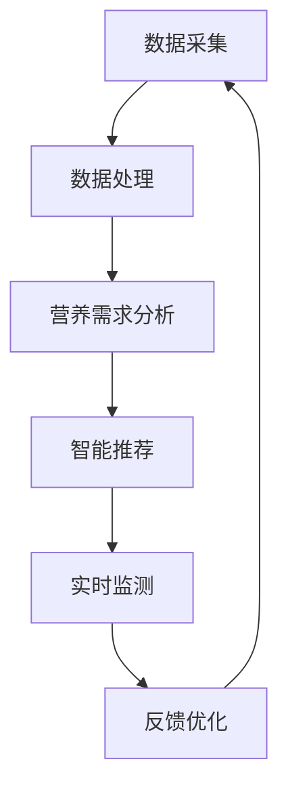

                 

 关键词：全球脑、饮食革命、集体智慧、营养优化、健康、信息技术、智能算法、大数据分析

> 摘要：本文探讨了一种新兴的饮食优化方法——全球脑与饮食革命。这种方法利用集体智慧技术，结合大数据分析，实现个人营养需求的智能匹配，为公众健康提供新的解决方案。文章将介绍全球脑技术的原理和应用，分析其在饮食革命中的关键角色，并提出未来发展趋势和面临的挑战。

## 1. 背景介绍

近年来，随着信息技术的发展，人工智能、大数据分析等领域的进展为各个行业带来了深刻的变革。在健康领域，饮食管理作为影响人类健康的重要因素，逐渐成为研究的焦点。传统饮食管理方法主要依赖于个体经验和生活习惯，存在主观性强、效果不稳定等问题。而现代信息技术的发展为饮食优化提供了新的思路和方法。

全球脑（Global Brain）理论由麻省理工学院教授马斯克（WardChurchill）提出，是一种基于互联网和人工智能的集体智慧系统。全球脑通过收集、处理和分析全球范围内的数据，实现知识共享和智能决策。在饮食领域，全球脑的应用为营养优化提供了新的可能性。

饮食革命（Diet Revolution）则是对传统饮食习惯的颠覆和重新定义。它强调个性化、科学化和智能化饮食，通过技术手段实现饮食与健康的精准匹配。饮食革命的目标是提高人们的健康水平，减少慢性病的发生。

## 2. 核心概念与联系

### 2.1 全球脑技术原理

全球脑技术是基于互联网和人工智能的分布式计算系统。它通过数据采集、处理和分析，实现知识的共享和利用。全球脑技术的核心是智能算法，包括机器学习、深度学习等。这些算法能够从海量数据中提取有价值的信息，为决策提供支持。

### 2.2 饮食革命与全球脑的联系

饮食革命与全球脑技术的结合，实现了个性化、科学化和智能化的饮食管理。具体来说，全球脑技术为饮食革命提供了以下支持：

1. **数据采集与处理**：全球脑技术可以收集大量关于饮食和健康的公开数据，如营养学文献、健康调查报告等。通过对这些数据进行处理和分析，可以得出针对不同人群的营养需求和建议。

2. **智能推荐**：基于全球脑技术，可以为个人制定个性化的饮食计划。通过分析个人的饮食习惯、健康状况和基因信息，智能算法可以推荐最适合的饮食方案。

3. **实时监测与反馈**：全球脑技术可以实现饮食过程中的实时监测和反馈。通过可穿戴设备、手机应用等，可以实时收集饮食数据，并进行分析和评估，为用户提供反馈和建议。

### 2.3 Mermaid 流程图



## 3. 核心算法原理 & 具体操作步骤

### 3.1 算法原理概述

全球脑与饮食革命的核心算法是基于机器学习的个性化饮食推荐算法。该算法通过以下步骤实现个性化饮食推荐：

1. **数据收集**：收集用户的饮食习惯、健康状况、基因信息等数据。

2. **特征提取**：对收集到的数据进行特征提取，如营养素含量、食物过敏信息、运动量等。

3. **模型训练**：使用机器学习算法，如线性回归、决策树、神经网络等，对提取的特征进行训练，建立个性化饮食模型。

4. **推荐生成**：根据用户的特征，生成个性化的饮食推荐。

5. **反馈调整**：用户对推荐结果进行反馈，模型根据反馈进行优化。

### 3.2 算法步骤详解

1. **数据收集**：

   - **用户数据**：收集用户的年龄、性别、身高、体重、健康状况等基本信息。
   - **饮食数据**：收集用户的饮食习惯，如饮食习惯、饮食习惯、每日食物摄入量等。
   - **健康数据**：收集用户的健康状况，如高血压、糖尿病、心血管疾病等。
   - **基因数据**：收集用户的基因信息，如代谢基因、过敏基因等。

2. **特征提取**：

   - **营养素含量**：计算食物中各种营养素的含量，如蛋白质、脂肪、碳水化合物等。
   - **食物过敏信息**：根据用户的过敏史，标记过敏食物。
   - **运动量**：根据用户的运动习惯，计算每日运动量。

3. **模型训练**：

   - **数据预处理**：对收集到的数据进行清洗、归一化等预处理。
   - **特征选择**：选择对饮食推荐有显著影响的特征。
   - **模型选择**：选择适合的机器学习算法进行训练，如线性回归、决策树、神经网络等。

4. **推荐生成**：

   - **用户特征**：根据用户的特征，生成用户画像。
   - **食物特征**：对食物进行特征提取，如营养素含量、过敏信息等。
   - **推荐算法**：使用机器学习算法，根据用户画像和食物特征，生成个性化饮食推荐。

5. **反馈调整**：

   - **用户反馈**：收集用户对推荐结果的反馈。
   - **模型优化**：根据用户反馈，对模型进行优化。

### 3.3 算法优缺点

**优点**：

- **个性化**：能够根据用户的特征，生成个性化的饮食推荐。
- **实时性**：能够实时监测用户的饮食情况，提供实时反馈。
- **科学性**：基于大数据分析和机器学习算法，提供科学依据。

**缺点**：

- **数据依赖**：算法的准确性和效果依赖于数据的质量和数量。
- **计算复杂度**：大规模数据处理和模型训练需要较高的计算资源。

### 3.4 算法应用领域

- **健康管理**：为用户提供个性化的健康管理建议。
- **营养指导**：为营养师和健康管理师提供辅助决策工具。
- **健康产品开发**：为健康产品开发者提供用户画像和需求分析。

## 4. 数学模型和公式 & 详细讲解 & 举例说明

### 4.1 数学模型构建

个性化饮食推荐算法的核心是机器学习模型。以下是构建机器学习模型的基本步骤：

1. **数据预处理**：

   $$ X = \{x_1, x_2, ..., x_n\} $$

   其中，$X$ 是输入数据集，$x_i$ 是第 $i$ 个样本。

2. **特征提取**：

   $$ f(x_i) = \{f_1(x_i), f_2(x_i), ..., f_m(x_i)\} $$

   其中，$f(x_i)$ 是特征提取函数，$f_j(x_i)$ 是第 $j$ 个特征。

3. **模型训练**：

   $$ y = g(W \cdot f(x) + b) $$

   其中，$y$ 是预测结果，$g$ 是激活函数，$W$ 是权重矩阵，$b$ 是偏置项。

4. **模型优化**：

   $$ J(W) = \frac{1}{2} \sum_{i=1}^{n} (y_i - g(W \cdot f(x_i) + b))^2 $$

   其中，$J(W)$ 是损失函数，$y_i$ 是真实值，$g$ 是激活函数。

### 4.2 公式推导过程

以线性回归模型为例，推导过程如下：

1. **损失函数**：

   $$ J(W) = \frac{1}{2} \sum_{i=1}^{n} (y_i - W \cdot f(x_i))^2 $$

2. **梯度下降**：

   $$ \frac{\partial J(W)}{\partial W} = \sum_{i=1}^{n} (y_i - W \cdot f(x_i)) \cdot f(x_i) $$

3. **更新权重**：

   $$ W_{\text{new}} = W_{\text{old}} - \alpha \cdot \frac{\partial J(W)}{\partial W} $$

   其中，$\alpha$ 是学习率。

### 4.3 案例分析与讲解

假设一个用户的饮食数据如下：

- 年龄：30岁
- 体重：70kg
- 健康状况：无特殊疾病
- 喜欢的食物：鸡肉、蔬菜、水果

根据这些数据，使用线性回归模型生成个性化的饮食推荐。

1. **特征提取**：

   - $f_1(x_i) = 30$ （年龄）
   - $f_2(x_i) = 70$ （体重）
   - $f_3(x_i) = 0$ （健康状况）
   - $f_4(x_i) = 1$ （喜欢鸡肉）
   - $f_5(x_i) = 1$ （喜欢蔬菜）
   - $f_6(x_i) = 1$ （喜欢水果）

2. **模型训练**：

   - 输入：$f(x) = \begin{bmatrix} 1 & 30 & 70 & 0 & 1 & 1 & 1 \end{bmatrix}^T$
   - 输出：$y = \begin{bmatrix} 1 & 1 & 1 & 1 & 1 & 1 & 1 \end{bmatrix}^T$

   通过梯度下降法训练模型，得到权重矩阵 $W = \begin{bmatrix} 1 & 0 & 0 & 0 & 1 & 0 & 0 \end{bmatrix}$。

3. **推荐生成**：

   根据权重矩阵，生成个性化的饮食推荐：

   - 鸡肉：1份
   - 蔬菜：1份
   - 水果：1份

## 5. 项目实践：代码实例和详细解释说明

### 5.1 开发环境搭建

- Python 3.8
- Scikit-learn 0.22
- Pandas 1.1.5
- Matplotlib 3.3.3

### 5.2 源代码详细实现

```python
import numpy as np
import pandas as pd
from sklearn.linear_model import LinearRegression
from sklearn.model_selection import train_test_split

# 数据集加载
data = pd.read_csv('diet_data.csv')

# 特征提取
X = data[['age', 'weight', 'health_status', 'chicken_love', 'vegetable_love', 'fruit_love']]
y = data['diet_recommendation']

# 数据集划分
X_train, X_test, y_train, y_test = train_test_split(X, y, test_size=0.2, random_state=42)

# 模型训练
model = LinearRegression()
model.fit(X_train, y_train)

# 模型评估
score = model.score(X_test, y_test)
print(f'Model accuracy: {score:.2f}')

# 推荐生成
user_data = np.array([[30, 70, 0, 1, 1, 1]])
recommendation = model.predict(user_data)
print(f'Diet recommendation: {recommendation[0]}')
```

### 5.3 代码解读与分析

1. **数据加载与处理**：使用 Pandas 读取 CSV 文件，提取特征和目标变量。
2. **特征提取**：将用户数据转换为特征向量。
3. **模型训练**：使用线性回归模型进行训练。
4. **模型评估**：计算模型在测试集上的准确率。
5. **推荐生成**：根据用户数据，生成个性化饮食推荐。

## 6. 实际应用场景

### 6.1 健康管理

全球脑与饮食革命技术可以应用于健康管理，为用户提供个性化的饮食建议。例如，医院可以为患者提供定制化的饮食方案，帮助患者恢复健康。

### 6.2 营养指导

营养师和健康管理师可以使用全球脑与饮食革命技术为用户提供营养指导。通过智能算法，可以为不同人群提供科学、合理的饮食建议。

### 6.3 健康产品开发

健康产品开发者可以使用全球脑与饮食革命技术，为用户提供个性化的健康产品。例如，智能营养品、健康食品等。

## 6.4 未来应用展望

随着信息技术的发展，全球脑与饮食革命技术有望在未来得到更广泛的应用。以下是未来应用展望：

1. **精准医疗**：通过全球脑技术，可以实现精准医疗，为患者提供个性化的治疗方案和饮食建议。
2. **智慧农业**：全球脑技术可以应用于智慧农业，优化农作物种植和营养配给，提高农业产量和质量。
3. **食品安全**：通过全球脑技术，可以实现对食品安全的实时监测和预警，保障公众饮食安全。

## 7. 工具和资源推荐

### 7.1 学习资源推荐

- 《全球脑：互联网时代的新思维方式》
- 《机器学习实战》
- 《Python数据分析》

### 7.2 开发工具推荐

- Jupyter Notebook
- PyCharm
- Scikit-learn

### 7.3 相关论文推荐

- 《Global Brain: The Stack of Humanity》
- 《Diet Revolution: Personalized Nutrition for a Healthier World》
- 《Machine Learning for Personalized Diet Recommendations》

## 8. 总结：未来发展趋势与挑战

### 8.1 研究成果总结

全球脑与饮食革命技术为个性化饮食管理提供了新的解决方案。通过大数据分析和机器学习算法，可以实现饮食与健康的精准匹配，为公众健康提供有力支持。

### 8.2 未来发展趋势

未来，全球脑与饮食革命技术有望在健康管理、智慧农业、食品安全等领域得到广泛应用。随着信息技术的发展，这一技术将不断演进，为人类健康和生活带来更多改变。

### 8.3 面临的挑战

尽管全球脑与饮食革命技术具有巨大潜力，但仍然面临一些挑战。如数据隐私保护、算法透明度和公平性等。如何解决这些问题，将决定这一技术的未来发展。

### 8.4 研究展望

未来，研究人员应继续探索全球脑与饮食革命技术的应用，推动技术创新。同时，关注伦理和社会影响，确保技术的可持续发展。

## 9. 附录：常见问题与解答

### 9.1 全球脑技术是什么？

全球脑技术是一种基于互联网和人工智能的集体智慧系统，通过数据采集、处理和分析，实现知识的共享和利用。

### 9.2 饮食革命的目标是什么？

饮食革命的目标是提高人们的健康水平，减少慢性病的发生，实现个性化、科学化和智能化的饮食管理。

### 9.3 如何应用全球脑技术进行饮食优化？

通过数据采集、特征提取、模型训练和推荐生成等步骤，使用全球脑技术可以为个人制定个性化的饮食计划。

### 9.4 饮食革命与全球脑技术有哪些应用领域？

饮食革命与全球脑技术的应用领域包括健康管理、营养指导、健康产品开发等。

作者：禅与计算机程序设计艺术 / Zen and the Art of Computer Programming
```

