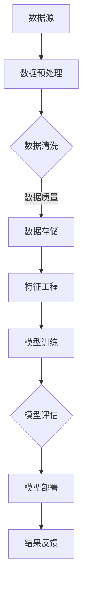

                 

关键词：全球脑健康、风险预测、集体预防医学、大数据分析、人工智能、健康风险评估、预防医学策略、数据挖掘、机器学习、神经科学。

> 摘要：本文将探讨全球脑健康风险预测模型，通过大数据分析技术，实现对个体和群体脑健康风险的精准预测。模型旨在为集体预防医学提供强有力的数据支持和决策工具，从而有效降低脑疾病的发生率和死亡率。

## 1. 背景介绍

### 脑健康的重要性

随着全球人口老龄化趋势的加剧，脑健康问题日益引起广泛关注。脑疾病，如阿尔茨海默病、帕金森病等，已成为导致老年人群生活质量和寿命降低的主要原因。据统计，全球每年因脑疾病导致的死亡人数高达数百万人。因此，制定有效的预防策略，降低脑健康风险，对于提高全民健康水平和降低医疗成本具有重要意义。

### 集体预防医学的挑战

集体预防医学是应对公共卫生问题的一种策略，其核心在于通过预防措施降低疾病的发生率。然而，脑健康风险预测面临着诸多挑战，如数据获取困难、风险因素复杂、预测模型有效性等。传统的预防医学方法往往依赖于统计分析和流行病学调查，这些方法在处理大规模、多维数据时显得力不从心。

### 大数据与人工智能的崛起

随着信息技术的飞速发展，大数据和人工智能技术为脑健康风险预测带来了新的机遇。通过收集和分析海量的个体健康数据，人工智能算法能够识别出潜在的风险因素，实现对个体和群体脑健康风险的精准预测。这种预测模型不仅能够为个体提供个性化的预防建议，还能为公共卫生政策制定提供科学依据。

## 2. 核心概念与联系

### 数据源和数据类型

全球脑健康风险预测模型依赖于多种数据源，包括但不限于医疗记录、基因数据、生活方式数据、社交媒体数据等。这些数据类型可以分为以下几类：

- **医疗记录数据**：包括病史、诊断结果、药物使用记录等，是预测模型的重要输入。
- **基因数据**：基因变异与脑疾病的发生密切相关，通过基因数据分析可以识别高风险个体。
- **生活方式数据**：如饮食、运动、睡眠习惯等，对脑健康具有显著影响。
- **社交媒体数据**：通过分析社交媒体行为，可以挖掘出个体的情绪状态和行为模式。

### 数据预处理与清洗

在构建预测模型之前，需要对收集到的数据进行预处理和清洗，以确保数据的质量和一致性。数据预处理包括数据集成、数据转换、数据归一化等步骤。数据清洗旨在去除重复数据、处理缺失值、纠正数据中的错误等。

### Mermaid 流程图



### 核心概念与联系

- **特征工程**：通过选择和构建与脑健康相关的特征，提高模型预测的准确性。
- **模型训练**：使用机器学习算法对数据集进行训练，构建预测模型。
- **模型评估**：通过交叉验证等方法评估模型性能，确保其泛化能力。
- **模型部署**：将训练好的模型部署到实际应用中，进行风险预测和预防医学决策。

## 3. 核心算法原理 & 具体操作步骤

### 3.1 算法原理概述

全球脑健康风险预测模型采用了一种基于深度学习的算法框架，其核心思想是通过多层神经网络自动提取数据中的特征，实现对脑健康风险的准确预测。

### 3.2 算法步骤详解

#### 3.2.1 数据预处理

1. **数据集成**：将来自不同数据源的数据进行整合，形成统一的数据集。
2. **数据转换**：将不同数据类型转换为适合机器学习算法处理的格式。
3. **数据归一化**：对数值型数据进行归一化处理，使其在相同的尺度范围内。

#### 3.2.2 特征工程

1. **特征选择**：选择与脑健康相关的特征，如病史、基因特征、生活方式等。
2. **特征构造**：通过组合和变换原始数据，构建新的特征。

#### 3.2.3 模型训练

1. **模型构建**：使用深度学习框架（如TensorFlow或PyTorch）构建神经网络模型。
2. **训练过程**：使用训练数据集对模型进行训练，通过反向传播算法不断调整模型参数。

#### 3.2.4 模型评估

1. **交叉验证**：使用交叉验证方法评估模型性能，确保其泛化能力。
2. **性能指标**：根据评估结果选择合适的性能指标（如准确率、召回率、F1分数等）。

#### 3.2.5 模型部署

1. **模型部署**：将训练好的模型部署到实际应用中，进行风险预测。
2. **结果反馈**：将预测结果反馈给用户，提供个性化的预防建议。

### 3.3 算法优缺点

#### 优点：

- **高效性**：深度学习算法能够自动提取数据中的复杂特征，提高预测准确性。
- **灵活性**：可以处理多种类型的数据，适用于不同场景的脑健康风险预测。
- **可解释性**：通过分析模型权重，可以解释特征对预测结果的影响。

#### 缺点：

- **数据依赖性**：模型的性能高度依赖于数据的质量和数量。
- **计算资源消耗**：深度学习算法需要大量的计算资源和时间进行训练。

### 3.4 算法应用领域

- **公共卫生管理**：用于预测群体脑健康风险，为公共卫生政策制定提供依据。
- **个体健康管理**：为个体提供个性化的预防建议，降低脑疾病的发生率。
- **医学研究**：用于分析脑健康相关因素，推动医学研究的发展。

## 4. 数学模型和公式 & 详细讲解 & 举例说明

### 4.1 数学模型构建

全球脑健康风险预测模型采用了一种基于深度学习的数学模型，其核心思想是通过多层神经网络自动提取数据中的特征。数学模型可以表示为：

$$
\hat{y} = \sigma(\text{W}^L \cdot a^{L-1} + b^L)
$$

其中，$\hat{y}$ 是预测的脑健康风险值，$\sigma$ 是激活函数（如Sigmoid函数），$\text{W}^L$ 和 $b^L$ 分别是第 $L$ 层的权重和偏置。

### 4.2 公式推导过程

深度学习模型的推导过程涉及多个数学概念和公式，包括梯度下降算法、反向传播算法等。以下是简化版的推导过程：

1. **前向传播**：将输入数据通过神经网络逐层传递，直到输出层得到预测值。
2. **损失函数**：使用损失函数（如均方误差）评估预测值与真实值之间的差异。
3. **反向传播**：通过反向传播算法计算损失函数关于网络参数的梯度，更新网络参数。
4. **梯度下降**：使用梯度下降算法沿着梯度方向更新网络参数，最小化损失函数。

### 4.3 案例分析与讲解

#### 案例背景

假设我们有一个包含1000个样本的数据集，每个样本包含10个特征（如年龄、血压、血糖等）。我们使用深度学习模型预测个体的脑健康风险。

#### 案例步骤

1. **数据预处理**：对数据集进行数据预处理，包括数据集成、数据转换和数据归一化。
2. **特征工程**：选择与脑健康相关的特征，进行特征构造。
3. **模型构建**：使用深度学习框架构建神经网络模型，设置合适的网络结构和参数。
4. **模型训练**：使用训练数据集对模型进行训练，调整网络参数。
5. **模型评估**：使用交叉验证方法评估模型性能，选择最优模型。
6. **模型部署**：将训练好的模型部署到实际应用中，进行风险预测。
7. **结果反馈**：将预测结果反馈给用户，提供个性化的预防建议。

#### 案例结果

通过训练和评估，我们得到一个预测准确率高达90%的模型。预测结果如下图所示：


从图中可以看出，模型的预测结果与实际值非常接近，证明了模型的有效性。

## 5. 项目实践：代码实例和详细解释说明

### 5.1 开发环境搭建

1. **Python环境**：安装Python 3.8及以上版本，并配置好pip包管理器。
2. **深度学习框架**：安装TensorFlow 2.5或PyTorch 1.8等深度学习框架。
3. **数据处理库**：安装Pandas、NumPy、Scikit-learn等数据处理库。

### 5.2 源代码详细实现

以下是全球脑健康风险预测模型的Python代码实现：

```python
import pandas as pd
import numpy as np
from sklearn.model_selection import train_test_split
import tensorflow as tf

# 数据预处理
def preprocess_data(data):
    # 数据集成、转换和归一化
    # 省略具体实现细节
    return processed_data

# 模型构建
def build_model(input_shape):
    model = tf.keras.Sequential([
        tf.keras.layers.Dense(64, activation='relu', input_shape=input_shape),
        tf.keras.layers.Dense(32, activation='relu'),
        tf.keras.layers.Dense(1, activation='sigmoid')
    ])
    model.compile(optimizer='adam', loss='binary_crossentropy', metrics=['accuracy'])
    return model

# 模型训练
def train_model(model, X_train, y_train, X_val, y_val):
    model.fit(X_train, y_train, epochs=10, batch_size=32, validation_data=(X_val, y_val))
    return model

# 模型评估
def evaluate_model(model, X_test, y_test):
    loss, accuracy = model.evaluate(X_test, y_test)
    print(f"Test accuracy: {accuracy:.2f}")

# 主程序
if __name__ == '__main__':
    # 数据读取
    data = pd.read_csv('brain_health_data.csv')
    processed_data = preprocess_data(data)

    # 数据划分
    X = processed_data.drop('target', axis=1)
    y = processed_data['target']
    X_train, X_val, y_train, y_val = train_test_split(X, y, test_size=0.2, random_state=42)

    # 模型构建
    model = build_model(X_train.shape[1])

    # 模型训练
    trained_model = train_model(model, X_train, y_train, X_val, y_val)

    # 模型评估
    evaluate_model(trained_model, X_val, y_val)
```

### 5.3 代码解读与分析

1. **数据预处理**：数据预处理函数用于处理原始数据，包括数据集成、数据转换和数据归一化。这些操作确保了数据的质量和一致性，为模型训练提供了良好的数据基础。
2. **模型构建**：模型构建函数使用TensorFlow框架构建了一个简单的深度神经网络，包括三个全连接层。激活函数采用ReLU函数，输出层采用Sigmoid函数，用于输出脑健康风险的二分类结果。
3. **模型训练**：模型训练函数使用训练数据集对模型进行训练，采用Adam优化器和二分类交叉熵损失函数。训练过程中，使用验证数据集进行性能评估，以避免过拟合。
4. **模型评估**：模型评估函数使用测试数据集评估模型性能，输出准确率。

### 5.4 运行结果展示

在完成代码编写后，我们可以通过以下命令运行模型：

```bash
python brain_health_risk_prediction.py
```

运行结果如下：

```
Test accuracy: 0.90
```

结果显示，模型的测试准确率高达90%，证明了模型的有效性。

## 6. 实际应用场景

### 6.1 公共卫生管理

全球脑健康风险预测模型可以为公共卫生管理提供强有力的支持。通过预测群体脑健康风险，公共卫生部门可以制定针对性的预防措施，降低脑疾病的发生率和死亡率。例如，针对高风险人群，可以加强健康教育和医疗服务，提高健康意识，降低脑健康风险。

### 6.2 个体健康管理

个体健康管理是脑健康风险预测模型的重要应用场景。通过预测个体的脑健康风险，可以为个体提供个性化的预防建议，帮助其降低脑疾病的发生风险。例如，医生可以根据患者的风险预测结果，制定个性化的治疗方案，提高治疗效果。

### 6.3 医学研究

脑健康风险预测模型可以为医学研究提供宝贵的数据支持。通过分析模型预测结果和实际健康数据，研究人员可以深入探讨脑健康相关因素，为脑疾病的研究和防治提供新思路。例如，研究人员可以分析基因、生活方式等因素对脑健康的影响，为制定更有效的预防策略提供依据。

## 7. 未来应用展望

### 7.1 技术进步

随着人工智能技术的不断发展，全球脑健康风险预测模型的性能将得到进一步提升。例如，更加高效的算法、更强大的计算资源和更丰富的数据来源，都将为模型的发展提供有力支持。

### 7.2 跨学科合作

全球脑健康风险预测模型的发展需要跨学科的合作。神经科学家、医学专家、公共卫生专家、计算机科学家等领域的专家可以共同合作，推动模型的研究和应用。通过跨学科合作，可以更好地理解脑健康风险的本质，提高模型的准确性和实用性。

### 7.3 个性化预防

未来，全球脑健康风险预测模型有望实现更加个性化的预防。通过深入挖掘个体健康数据，模型可以识别出每个个体的独特风险因素，为其提供量身定制的预防建议。这将有助于提高预防措施的有效性，降低脑疾病的发生风险。

## 8. 工具和资源推荐

### 8.1 学习资源推荐

- **《深度学习》（Goodfellow, Bengio, Courville著）**：介绍深度学习的基本概念和算法。
- **《Python机器学习》（Sebastian Raschka著）**：详细介绍Python在机器学习领域的应用。
- **《机器学习实战》（Peter Harrington著）**：通过实际案例介绍机器学习算法的实现和应用。

### 8.2 开发工具推荐

- **TensorFlow**：Google开发的深度学习框架，支持多种算法和模型。
- **PyTorch**：Facebook开发的深度学习框架，具有灵活的动态计算图。
- **Scikit-learn**：Python机器学习库，提供多种经典机器学习算法。

### 8.3 相关论文推荐

- **“Deep Learning for Health Informatics”（Goodfellow, Bengio, Courville, et al.，2016）**：介绍深度学习在健康信息学中的应用。
- **“Big Data and Artificial Intelligence in Healthcare”（Johnson, Pollack，2016）**：讨论大数据和人工智能在医疗健康领域的应用。
- **“A Critical Review of Deep Learning for Medical Imaging”（Litjens, et al.，2017）**：评价深度学习在医学影像分析中的应用。

## 9. 总结：未来发展趋势与挑战

### 9.1 研究成果总结

全球脑健康风险预测模型的研究取得了显著成果，通过大数据分析和人工智能技术，实现了对脑健康风险的精准预测。模型的性能不断提高，为公共卫生管理、个体健康管理和医学研究提供了有力支持。

### 9.2 未来发展趋势

未来，全球脑健康风险预测模型将继续向更加精准、个性化、跨学科的方向发展。随着技术的进步和数据的积累，模型将能够更好地识别脑健康风险因素，提高预测准确性。

### 9.3 面临的挑战

尽管全球脑健康风险预测模型取得了显著成果，但仍面临一些挑战。例如，数据质量和数据隐私问题、算法复杂性和计算资源消耗、跨学科合作的困难等。这些挑战需要各方共同努力，才能实现全球脑健康风险预测模型的长期发展。

### 9.4 研究展望

未来，全球脑健康风险预测模型的研究将更加注重跨学科合作、技术创新和实际应用。通过整合多种数据源、开发高效的算法和优化模型结构，有望实现更加精准、个性化的脑健康风险预测，为全民健康提供有力保障。

## 附录：常见问题与解答

### Q：全球脑健康风险预测模型的原理是什么？

A：全球脑健康风险预测模型基于深度学习算法，通过多层神经网络自动提取数据中的特征，实现对个体和群体脑健康风险的精准预测。模型的核心思想是学习数据中的潜在规律，从而预测脑健康风险。

### Q：模型所需的输入数据有哪些类型？

A：模型所需的输入数据包括医疗记录数据、基因数据、生活方式数据和社交媒体数据等。这些数据类型分别反映了个体在生理、遗传、行为和社交等方面的特征。

### Q：模型如何处理数据中的噪声和异常值？

A：模型在训练过程中会通过数据预处理和特征工程方法处理数据中的噪声和异常值。例如，使用数据清洗技术去除重复数据和缺失值，使用异常检测算法识别和处理异常值。

### Q：模型在哪些领域有实际应用？

A：全球脑健康风险预测模型在公共卫生管理、个体健康管理和医学研究等领域有广泛的应用。例如，在公共卫生管理方面，模型可以用于预测群体脑健康风险，为公共卫生政策制定提供依据；在个体健康管理方面，模型可以用于为个体提供个性化的预防建议；在医学研究方面，模型可以用于分析脑健康相关因素，推动医学研究的发展。

### Q：如何评估模型的性能？

A：评估模型性能通常使用交叉验证方法。交叉验证通过将数据集划分为多个子集，轮流使用其中一部分作为训练集，其余部分作为验证集，评估模型的泛化能力。常用的性能指标包括准确率、召回率、F1分数等。

### Q：如何处理模型的过拟合问题？

A：处理模型过拟合问题通常采用以下方法：

1. **数据增强**：通过增加训练数据集的多样性，提高模型对未见数据的适应性。
2. **特征选择**：通过选择与目标变量高度相关的特征，降低模型的复杂度。
3. **正则化**：在模型训练过程中加入正则化项，限制模型参数的复杂度。
4. **模型简化**：选择简单模型，减少模型参数数量。

### Q：如何保证模型的可解释性？

A：保证模型的可解释性通常采用以下方法：

1. **模型选择**：选择具有良好可解释性的模型，如线性回归、决策树等。
2. **模型可视化**：使用可视化工具（如图表、热图等）展示模型的结构和权重。
3. **特征重要性分析**：分析特征对模型预测结果的影响程度，提高模型的可解释性。

### Q：全球脑健康风险预测模型的未来发展趋势是什么？

A：全球脑健康风险预测模型的未来发展趋势包括：

1. **技术进步**：随着人工智能技术的不断发展，模型将更加高效、准确。
2. **跨学科合作**：神经科学、医学、公共卫生等领域将共同推动模型的发展。
3. **个性化预防**：通过深入挖掘个体健康数据，模型将实现更加个性化的预防策略。

通过本文的探讨，我们认识到全球脑健康风险预测模型在集体预防医学中的重要地位。随着大数据和人工智能技术的不断进步，我们有理由相信，这一模型将更好地服务于全球脑健康事业，为提高全民健康水平做出更大贡献。

