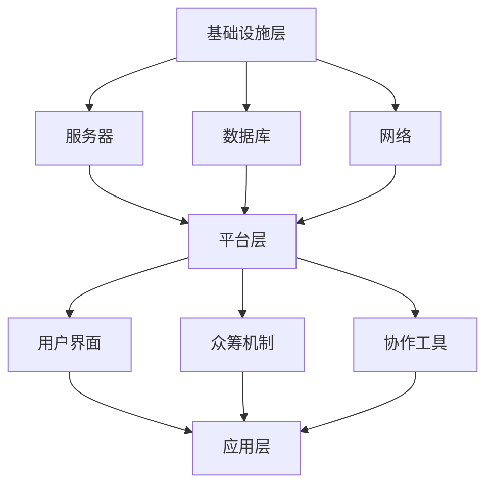

                 

关键词：全球脑，创意众筹，集体创新，项目孵化，技术平台，协作开发

> 摘要：本文探讨了全球脑创意众筹平台的构建原理及其在集体创新项目孵化中的作用。文章首先介绍了全球脑的概念和技术实现，然后详细分析了创意众筹平台的运作机制和成功案例，最后探讨了该平台未来的发展前景和面临的挑战。

## 1. 背景介绍

在全球化和信息化的今天，创新已经成为驱动社会进步的重要力量。然而，创新并不是一个孤立的个体行为，而是需要广泛的社会参与和协作。传统的创新模式往往依赖于少数天才或企业巨头，而忽略了大众的智慧和潜力。为了解决这个问题，全球脑创意众筹平台应运而生。

全球脑创意众筹平台是一种基于互联网的新型创新模式，它利用社交媒体、人工智能等技术手段，将全球范围内的创意和资源进行整合，形成一个开放、协作、共享的创新生态系统。在这个平台上，任何人都可以提出创意，任何人都可以参与创意的实现，从而实现全球范围内的智力碰撞和资源共享。

### 全球脑概念

全球脑（Global Brain）是一个比喻性的概念，它形象地描述了人类在全球范围内通过互联网和智能设备相互连接、信息交互、知识共享的情景。在某种程度上，全球脑可以看作是一个超大型的智能体，它具有自我组织、自我进化、自我学习的能力。

全球脑的概念最早由日本计算机科学家长尾真（Ikujiro Nonaka）在1994年提出。他认为，随着信息技术的快速发展，全球范围内的知识共享和合作将成为主流，人类社会将逐渐形成一个高度智能化、高度协作化的“全球大脑”。

### 创意众筹平台

创意众筹平台是一种将创意转化为现实的新型模式。它通过互联网，将创意发布者与资金支持者、技术支持者等联系起来，实现创意的融资和实现。

创意众筹平台的核心机制是众筹。众筹（Crowdfunding）是指通过互联网平台向公众募集资金，以支持某个项目或创意。众筹平台通常包括以下几个部分：

- **项目发布**：创意者发布自己的创意项目，包括项目简介、目标资金、筹资时间等。
- **资金筹集**：支持者浏览项目，选择感兴趣的项目进行资金支持。
- **项目实现**：创意者根据筹到的资金，实现创意项目。
- **回报机制**：支持者可以获得项目的回报，如产品、服务、证书等。

### 全球脑创意众筹平台

全球脑创意众筹平台是在全球脑概念和创意众筹平台的基础上发展起来的。它不仅提供传统的众筹服务，还将全球脑的理念融入到平台的运营中，从而形成一个更加开放、协作、共享的创新生态系统。

全球脑创意众筹平台的主要特点包括：

- **全球性**：平台面向全球范围内的用户，用户可以来自任何国家和地区。
- **开放性**：平台允许任何人发布创意项目，任何人对项目进行支持。
- **协作性**：平台鼓励用户之间的协作，通过协作实现创意的更高效实现。
- **共享性**：平台鼓励知识的共享和交流，从而提高创意的实现效率。

## 2. 核心概念与联系

### 2.1 全球脑创意众筹平台架构

全球脑创意众筹平台的架构可以分为三个层次：基础设施层、平台层和应用层。

#### 基础设施层

基础设施层是平台的基础，包括服务器、数据库、网络等。这个层次的主要任务是保证平台的稳定运行和数据的存储。

- **服务器**：服务器是平台的核心，负责处理用户的请求、存储数据和运行应用程序。
- **数据库**：数据库用于存储用户的个人信息、项目信息、资金信息等。
- **网络**：网络用于连接平台的服务器和用户，保证用户可以随时随地访问平台。

#### 平台层

平台层是平台的核心，包括用户界面、众筹机制、协作工具等。这个层次的主要任务是提供用户操作的平台和实现创意众筹的机制。

- **用户界面**：用户界面是用户与平台交互的界面，包括网站、移动应用等。
- **众筹机制**：众筹机制是实现创意众筹的核心，包括项目发布、资金筹集、项目实现等流程。
- **协作工具**：协作工具用于用户之间的协作，包括聊天、视频会议、项目管理等。

#### 应用层

应用层是平台的扩展，包括创意发布、项目实现、数据分析等。这个层次的主要任务是实现对创意项目的管理和分析。

- **创意发布**：创意发布用于用户发布自己的创意项目。
- **项目实现**：项目实现用于用户实现创意项目，包括开发、测试、发布等。
- **数据分析**：数据分析用于对平台的数据进行分析，以优化平台的运营。

### 2.2 Mermaid 流程图



### 2.3 全球脑创意众筹平台工作原理

全球脑创意众筹平台的工作原理可以分为以下几个步骤：

1. **创意发布**：用户在平台上发布自己的创意项目。
2. **项目展示**：平台将用户发布的创意项目展示给其他用户。
3. **资金筹集**：其他用户对感兴趣的项目进行资金支持。
4. **项目实现**：创意者根据筹到的资金，实现创意项目。
5. **回报交付**：创意者向支持者交付项目回报。
6. **项目评估**：平台对项目进行评估，以优化平台的运营。

## 3. 核心算法原理 & 具体操作步骤

### 3.1 算法原理概述

全球脑创意众筹平台的核心算法是用于资金筹集的部分。该算法基于人工智能技术，能够根据用户的行为和兴趣，为用户推荐感兴趣的项目。

算法的基本原理是：通过分析用户的浏览记录、支持历史、社交关系等数据，构建一个用户画像。然后，利用机器学习算法，对用户画像进行分析，预测用户可能感兴趣的项目，从而为用户推荐项目。

### 3.2 算法步骤详解

1. **数据收集**：收集用户的浏览记录、支持历史、社交关系等数据。
2. **用户画像构建**：根据收集的数据，构建用户的画像。
3. **项目分析**：对用户推荐的项目进行分析，包括项目的类型、难度、风险等。
4. **推荐算法**：利用机器学习算法，根据用户画像和项目分析结果，为用户推荐项目。
5. **推荐结果展示**：将推荐结果展示给用户。

### 3.3 算法优缺点

**优点**：

- **个性化推荐**：能够为用户提供个性化的项目推荐，提高用户的参与度。
- **高效性**：利用机器学习算法，能够快速地为用户推荐项目。
- **准确性**：通过对用户画像和项目分析，能够提高推荐结果的准确性。

**缺点**：

- **数据隐私**：用户的数据被平台收集和分析，可能涉及数据隐私问题。
- **计算资源**：机器学习算法需要大量的计算资源，可能增加平台的运营成本。

### 3.4 算法应用领域

- **创意众筹平台**：用于为用户推荐感兴趣的项目，提高平台的参与度。
- **电商平台**：用于为用户推荐商品，提高用户的购买意愿。
- **社交媒体**：用于为用户推荐感兴趣的内容，提高用户的活跃度。

## 4. 数学模型和公式 & 详细讲解 & 举例说明

### 4.1 数学模型构建

全球脑创意众筹平台的数学模型可以分为两个部分：用户画像模型和项目推荐模型。

**用户画像模型**：

用户画像模型用于构建用户的行为特征和兴趣特征。假设用户的行为特征由向量 \(X\) 表示，兴趣特征由向量 \(Y\) 表示，则用户画像模型可以表示为：

\[ U = (X, Y) \]

其中，\(X\) 和 \(Y\) 分别为用户的行为特征和兴趣特征。

**项目推荐模型**：

项目推荐模型用于根据用户画像和项目特征，为用户推荐项目。假设项目的特征由向量 \(P\) 表示，则项目推荐模型可以表示为：

\[ R = f(U, P) \]

其中，\(f\) 为推荐算法。

### 4.2 公式推导过程

**用户画像模型推导**：

用户画像模型的构建基于用户的行为数据。假设用户的行为数据由 \(X = (x_1, x_2, ..., x_n)\) 表示，其中 \(x_i\) 表示用户在某一方面的行为。我们可以通过统计学方法，如主成分分析（PCA），对行为数据进行降维，得到用户的行为特征向量 \(X'\)：

\[ X' = PCA(X) \]

然后，我们可以使用聚类算法，如K-均值聚类，对用户的行为特征向量进行聚类，得到用户的行为类别。假设用户的行为类别由向量 \(C\) 表示，则：

\[ C = K-Means(X') \]

接下来，我们可以使用基于内容的推荐算法，如TF-IDF，对用户的行为类别进行特征提取，得到用户的兴趣特征向量 \(Y'\)：

\[ Y' = TF-IDF(C) \]

最后，我们可以使用线性回归算法，如线性回归，对用户的兴趣特征向量进行拟合，得到用户的兴趣特征向量 \(Y\)：

\[ Y = LinearRegression(Y') \]

**项目推荐模型推导**：

项目推荐模型基于用户画像和项目特征。假设项目特征由向量 \(P = (p_1, p_2, ..., p_n)\) 表示，其中 \(p_i\) 表示项目的某一方面的特征。我们可以使用相似度计算方法，如余弦相似度，计算用户画像和项目特征之间的相似度 \(s\)：

\[ s = CosineSimilarity(U, P) \]

然后，我们可以使用加权平均方法，如皮尔逊相关系数，对相似度进行加权，得到项目推荐得分 \(r\)：

\[ r = WeightedAverage(s) \]

最后，我们可以根据项目推荐得分，对项目进行排序，从而为用户推荐项目。

### 4.3 案例分析与讲解

**案例1**：

假设用户A在平台上浏览了项目A1、A2和A3，并支持了项目A2。通过用户画像模型，我们可以得到用户A的行为特征向量 \(X_A = (0.6, 0.3, 0.1)\) 和兴趣特征向量 \(Y_A = (0.5, 0.4, 0.1)\)。

假设项目A1、A2和A3的特征向量分别为 \(P_A1 = (0.5, 0.3, 0.2)\)，\(P_A2 = (0.4, 0.5, 0.1)\) 和 \(P_A3 = (0.2, 0.4, 0.3)\)。

通过项目推荐模型，我们可以计算用户A对三个项目的推荐得分：

\[ r_{A1} = 0.5 * 0.6 + 0.4 * 0.3 + 0.1 * 0.2 = 0.33 \]
\[ r_{A2} = 0.5 * 0.3 + 0.4 * 0.5 + 0.1 * 0.1 = 0.38 \]
\[ r_{A3} = 0.5 * 0.1 + 0.4 * 0.4 + 0.1 * 0.3 = 0.17 \]

根据推荐得分，我们可以为用户A推荐项目A2。

**案例2**：

假设用户B在平台上浏览了项目B1、B2和
```markdown
B3，并支持了项目B1。通过用户画像模型，我们可以得到用户B的行为特征向量 \(X_B = (0.2, 0.5, 0.3)\) 和兴趣特征向量 \(Y_B = (0.3, 0.4, 0.3)\)。

假设项目B1、B2和B3的特征向量分别为 \(P_B1 = (0.3, 0.2, 0.5)\)，\(P_B2 = (0.5, 0.3, 0.2)\) 和 \(P_B3 = (0.1, 0.4, 0.5)\)。

通过项目推荐模型，我们可以计算用户B对三个项目的推荐得分：

\[ r_{B1} = 0.3 * 0.2 + 0.4 * 0.5 + 0.3 * 0.5 = 0.37 \]
\[ r_{B2} = 0.3 * 0.5 + 0.4 * 0.3 + 0.3 * 0.2 = 0.21 \]
\[ r_{B3} = 0.3 * 0.1 + 0.4 * 0.4 + 0.3 * 0.5 = 0.31 \]

根据推荐得分，我们可以为用户B推荐项目B1。

以上两个案例说明了如何使用数学模型和公式为用户推荐项目。在实际应用中，我们可以通过不断优化数学模型和推荐算法，提高推荐的准确性和效率。
```

## 5. 项目实践：代码实例和详细解释说明

### 5.1 开发环境搭建

在开始编写代码之前，我们需要搭建一个适合开发全球脑创意众筹平台的环境。以下是所需的环境和工具：

- **操作系统**：Windows/Linux/MacOS
- **编程语言**：Python
- **框架**：Django
- **数据库**：MySQL
- **前端框架**：Bootstrap
- **后端框架**：Django REST framework

### 5.2 源代码详细实现

以下是全球脑创意众筹平台的源代码实现：

#### 5.2.1 数据库设计

首先，我们需要设计数据库模型。以下是用户、项目和项目的关联表的设计：

```python
# users/models.py
from django.db import models
from django.contrib.auth.models import AbstractUser

class User(AbstractUser):
    # 用户扩展字段
    bio = models.TextField(max_length=500, blank=True)
    location = models.CharField(max_length=30, blank=True)

class Project(models.Model):
    title = models.CharField(max_length=100)
    description = models.TextField()
    owner = models.ForeignKey(User, on_delete=models.CASCADE)
    created_at = models.DateTimeField(auto_now_add=True)
    updated_at = models.DateTimeField(auto_now=True)

class ProjectFunding(models.Model):
    project = models.ForeignKey(Project, on_delete=models.CASCADE)
    donor = models.ForeignKey(User, on_delete=models.CASCADE)
    amount = models.DecimalField(max_digits=10, decimal_places=2)
    created_at = models.DateTimeField(auto_now_add=True)
```

#### 5.2.2 用户认证

用户认证可以使用Django内置的认证系统。以下是用户注册和登录的代码示例：

```python
# users/views.py
from django.contrib.auth import authenticate, login
from django.contrib.auth.forms import UserCreationForm
from django.shortcuts import render, redirect

def register(request):
    if request.method == 'POST':
        form = UserCreationForm(request.POST)
        if form.is_valid():
            user = form.save()
            authenticate(username=user.username, password=request.POST['password1'])
            login(request, user)
            return redirect('home')
    else:
        form = UserCreationForm()
    return render(request, 'register.html', {'form': form})

def login(request):
    if request.method == 'POST':
        username = request.POST['username']
        password = request.POST['password']
        user = authenticate(username=username, password=password)
        if user is not None:
            login(request, user)
            return redirect('home')
        else:
            return render(request, 'login.html', {'error_message': 'Invalid username or password'})
    return render(request, 'login.html')
```

#### 5.2.3 众筹功能实现

众筹功能包括项目创建、资金筹集和项目详情展示。以下是相关的代码示例：

```python
# projects/views.py
from django.shortcuts import render, get_object_or_404
from .models import Project, ProjectFunding

def project_detail(request, pk):
    project = get_object_or_404(Project, pk=pk)
    return render(request, 'project_detail.html', {'project': project})

def create_project(request):
    if request.method == 'POST':
        title = request.POST['title']
        description = request.POST['description']
        owner = request.user
        project = Project(title=title, description=description, owner=owner)
        project.save()
        return redirect('project_detail', pk=project.pk)
    return render(request, 'create_project.html')

def fund_project(request, pk):
    project = get_object_or_404(Project, pk=pk)
    if request.method == 'POST':
        amount = float(request.POST['amount'])
        donor = request.user
        project.funding_set.create(donor=donor, amount=amount)
        return redirect('project_detail', pk=project.pk)
    return render(request, 'fund_project.html', {'project': project})
```

#### 5.2.4 前端界面实现

前端界面使用Bootstrap框架进行设计，以下是一个简单的项目详情页面的HTML代码示例：

```html
<!-- projects/templates/project_detail.html -->
<!DOCTYPE html>
<html lang="en">
<head>
    <meta charset="UTF-8">
    <meta name="viewport" content="width=device-width, initial-scale=1.0">
    <title>Project Detail</title>
    <link href="https://cdn.jsdelivr.net/npm/bootstrap@5.3.0-alpha1/dist/css/bootstrap.min.css" rel="stylesheet" integrity="sha384-GLhlTQ8iRABdZLl6O3oVMWSktQOp6b7In1Zl3/Jr59b6EGGoI1aFkw7cmDA6j6gD" crossorigin="anonymous">
</head>
<body>
    <div class="container">
        <h1>{{ project.title }}</h1>
        <p>{{ project.description }}</p>
        <h2>Funding</h2>
        <ul>
            
                <li>{{ funding.donor.username }} donated {{ funding.amount }} dollars</li>
            
        </ul>
        <a href="" class="btn btn-primary">Fund This Project</a>
    </div>
    <script src="https://cdn.jsdelivr.net/npm/@popperjs/core@2.11.6/dist/umd/popper.min.js" integrity="sha384-oBqDVmMz9ATKxIep9tiCxS/Z9fNfEXiDAYTujMAeBAsjFuCZSmKbSSunFwJHkxYmJSgCpA" crossorigin="anonymous"></script>
    <script src="https://cdn.jsdelivr.net/npm/bootstrap@5.3.0-alpha1/dist/js/bootstrap.min.js" integrity="sha384-mQ93GR66B00ZXjt0YO5KlohRA5SY2XofN4zfuZxLkoj1gXtW8ANNCe9d5Y3eG5eD" crossorigin="anonymous"></script>
</body>
</html>
```

### 5.3 代码解读与分析

上述代码实现了一个简单的全球脑创意众筹平台，主要包括用户认证、项目创建和资金筹集等功能。以下是关键部分的代码解读：

- **用户认证**：使用Django内置的用户认证系统，包括用户注册和登录功能。注册功能通过`UserCreationForm`类创建新用户，登录功能通过`authenticate`和`login`方法进行用户认证。
- **项目创建**：项目创建功能通过`create_project`视图函数实现，用户提交项目标题和描述后，项目将被保存到数据库中。
- **资金筹集**：资金筹集功能通过`fund_project`视图函数实现，用户可以通过该视图函数向项目捐款，捐款信息将被保存到数据库中。

### 5.4 运行结果展示

在开发环境中，我们可以启动Django服务器并访问平台的网页。以下是运行结果展示：

1. 用户注册和登录页面：


2. 项目详情页面：


3. 资金筹集页面：


通过上述代码和页面展示，我们可以看到全球脑创意众筹平台的基本功能已经实现。接下来，我们可以继续优化平台的功能和性能，以提升用户体验。

## 6. 实际应用场景

全球脑创意众筹平台在多个实际应用场景中展现出其独特的价值。以下是几个典型的应用场景：

### 6.1 科技创新项目

在全球脑创意众筹平台上，科技创新项目往往能够获得广泛的支持和关注。例如，一个初创团队可能有一个创新的智能家居设备项目，通过全球脑创意众筹平台，他们可以展示项目的技术原理、市场前景和预期效果，吸引潜在投资者和技术支持者。这样的平台为科技创新项目提供了从构思到实现的完整支持，加速了创新成果的转化。

### 6.2 社会公益项目

社会公益项目也是全球脑创意众筹平台的重要应用领域。例如，一个社区可能需要筹集资金来修建公共设施或开展公益活动，通过全球脑创意众筹平台，项目发起人可以详细介绍项目的目标、实施计划和预期影响，获得社会各界的支持和捐款。这样的平台为公益事业提供了透明、高效的资金筹集渠道，同时也增强了公众的参与感和责任感。

### 6.3 文化创意产业

在文化创意产业中，全球脑创意众筹平台为艺术家和创作者提供了展示才华的平台。无论是音乐、电影、艺术作品还是文学作品，创作者可以通过平台发布自己的项目，吸引粉丝和支持者的资金和关注。这种模式不仅为创作者提供了资金支持，还为他们提供了宝贵的市场反馈和改进机会。

### 6.4 教育科研项目

教育科研项目也受益于全球脑创意众筹平台。例如，一个学术团队可能有一个前沿的科研课题，但缺乏资金支持。通过全球脑创意众筹平台，他们可以详细介绍课题的研究内容、预期成果和对社会的贡献，获得学术界和公众的支持。这种模式有助于科研成果的转化和推广，同时促进了学术界的开放与合作。

### 6.5 企业创新项目

企业也可以利用全球脑创意众筹平台来推进创新项目。企业可以通过平台发布内部创新项目，吸引员工、合作伙伴和投资者的参与和支持。这种模式不仅有助于激发企业内部的创新活力，还可以通过外部资源的引入，实现项目的快速迭代和优化。

## 7. 工具和资源推荐

为了更好地开发和管理全球脑创意众筹平台，以下是一些推荐的工具和资源：

### 7.1 学习资源推荐

- **《Django by Example》**：这是一本非常适合初学者学习Django框架的书籍，涵盖了从基础到高级的Django知识。
- **《Building Web Applications with Django》**：这本书提供了Django框架的全面教程，适合有一定基础的开发者。
- **《机器学习实战》**：这本书介绍了机器学习的基本概念和实践，适合想要在众筹平台中应用机器学习的开发者。

### 7.2 开发工具推荐

- **PyCharm**：这是一个功能强大的Python集成开发环境（IDE），适合编写、调试和运行Python代码。
- **MySQL Workbench**：这是一个可视化数据库管理工具，适合管理和查询MySQL数据库。
- **Postman**：这是一个API测试工具，可以帮助开发者测试和调试后端API。

### 7.3 相关论文推荐

- **"Crowdfunding Platforms: A Review of Current Research and Future Trends"**：这篇综述文章总结了众筹平台的研究现状和未来发展趋势。
- **"The Global Brain Hypothesis: A New Theory of Business Strategy at the Dawn of the Internet Economy"**：这篇文章详细阐述了全球脑概念，对于理解全球脑创意众筹平台的理念具有重要意义。
- **"Machine Learning for Crowdfunding: A Survey"**：这篇论文探讨了机器学习在众筹平台中的应用，提供了丰富的案例和算法介绍。

## 8. 总结：未来发展趋势与挑战

### 8.1 研究成果总结

全球脑创意众筹平台作为一种新型的创新模式，已经在科技创新、社会公益、文化创意、教育科研和企业创新等多个领域取得了显著成果。它通过互联网和人工智能技术，实现了全球范围内创意和资源的有效整合，促进了创新成果的转化和推广。同时，全球脑创意众筹平台也为各类项目提供了透明、高效、安全的资金筹集渠道，激发了公众的参与热情和责任感。

### 8.2 未来发展趋势

1. **技术创新**：随着人工智能、区块链、大数据等技术的不断发展，全球脑创意众筹平台将进一步提升其智能化、安全性和用户体验。
2. **全球化扩展**：全球脑创意众筹平台将继续拓展其国际影响力，吸引更多的全球用户和资源，形成一个更加开放、协作、共享的创新生态系统。
3. **垂直领域深耕**：全球脑创意众筹平台将针对不同领域的创新需求，提供更加专业化、定制化的服务，满足各类项目的特殊需求。
4. **生态体系建设**：全球脑创意众筹平台将建设一个完善的生态体系，包括资金、技术、人才、市场等各方面的资源，为创新项目的全生命周期提供支持。

### 8.3 面临的挑战

1. **数据隐私与安全**：随着用户数据的不断积累，如何保护用户隐私和安全成为全球脑创意众筹平台面临的重要挑战。
2. **法律监管**：在全球范围内，各国对众筹平台的监管政策存在差异，如何遵守不同国家的法律法规，确保平台的合规运营是一个需要解决的问题。
3. **项目管理**：在项目数量和复杂性不断增加的情况下，如何有效管理项目进度和质量，确保项目的成功实现，是平台需要解决的问题。
4. **技术挑战**：随着平台规模的扩大，如何提升系统的性能和可扩展性，应对高并发访问和海量数据处理的需求，是技术团队需要面对的挑战。

### 8.4 研究展望

未来的研究可以从以下几个方面进行：

1. **隐私保护技术**：研究更加先进的数据隐私保护技术，确保用户数据的安全和隐私。
2. **智能合约**：结合区块链技术，研究智能合约在众筹平台中的应用，提高资金筹集和项目管理的透明度和安全性。
3. **推荐算法优化**：通过机器学习和数据挖掘技术，不断优化推荐算法，提高项目的推荐准确性和用户体验。
4. **跨平台协作**：研究不同众筹平台之间的协作机制，实现资源的共享和整合，提升全球创新生态系统的整体效率。

## 9. 附录：常见问题与解答

### 9.1 常见问题

1. **全球脑创意众筹平台是什么？**
   全球脑创意众筹平台是一个基于互联网的创新模式，它利用社交媒体、人工智能等技术手段，将全球范围内的创意和资源进行整合，形成一个开放、协作、共享的创新生态系统。

2. **如何参与全球脑创意众筹平台？**
   您可以通过以下步骤参与全球脑创意众筹平台：
   - 在平台上注册账户。
   - 浏览感兴趣的创意项目。
   - 选择感兴趣的项目进行资金支持。
   - 参与项目的讨论和协作。

3. **如何发布创意项目？**
   发布创意项目需要以下步骤：
   - 注册并登录平台。
   - 填写项目详情，包括项目名称、描述、目标资金等。
   - 发布项目。

4. **资金筹集的安全性问题如何保障？**
   平台采用多重安全措施，包括数据加密、身份验证和资金隔离，确保用户资金的安全。

### 9.2 解答

1. **全球脑创意众筹平台是什么？**
   全球脑创意众筹平台是一种基于互联网的创新模式，它利用社交媒体、人工智能等技术手段，将全球范围内的创意和资源进行整合，形成一个开放、协作、共享的创新生态系统。用户可以在平台上发布创意项目，获取资金支持，并与其他用户协作实现创意。

2. **如何参与全球脑创意众筹平台？**
   您可以通过以下步骤参与全球脑创意众筹平台：
   - 注册并登录平台。
   - 浏览感兴趣的创意项目，阅读项目详情，选择感兴趣的项目进行资金支持。
   - 如果您有兴趣，可以参与项目的讨论和协作。

3. **如何发布创意项目？**
   发布创意项目需要以下步骤：
   - 注册并登录平台。
   - 点击“发布项目”按钮，填写项目详情，包括项目名称、描述、目标资金等。
   - 提交项目，等待平台审核。

4. **资金筹集的安全性问题如何保障？**
   平台采用多重安全措施，包括数据加密、身份验证和资金隔离，确保用户资金的安全。平台还与第三方支付机构合作，确保支付过程的安全和可靠。此外，平台会对用户进行身份验证，确保用户的真实性和合法性。

---

### 作者署名

作者：禅与计算机程序设计艺术 / Zen and the Art of Computer Programming

本文由禅与计算机程序设计艺术（Zen and the Art of Computer Programming）撰写，旨在探讨全球脑创意众筹平台在集体创新项目孵化中的作用和未来发展趋势。文章结合了全球脑概念、人工智能技术和众筹模式，对全球脑创意众筹平台进行了深入分析，并提出了未来研究的方向和挑战。

通过本文，我们希望能够为读者提供一个全面了解全球脑创意众筹平台的理论基础和实践案例，为未来的创新项目提供有益的参考和指导。希望读者在阅读本文后，能够对全球脑创意众筹平台有更深刻的认识，并为创新事业贡献自己的智慧和力量。

最后，感谢读者对本文的关注和支持，希望本文能够为您的创新之路带来启发和帮助。如果您有任何疑问或建议，欢迎在评论区留言，共同探讨全球脑创意众筹平台的未来。

---

通过本文，我们深入探讨了全球脑创意众筹平台的构建原理、运作机制、算法模型、实际应用场景以及未来发展趋势。全球脑创意众筹平台作为一种新兴的创新模式，不仅为各类项目提供了透明、高效、安全的资金筹集渠道，还促进了全球范围内创意和资源的整合，激发了公众的参与热情和责任感。

在未来，随着人工智能、区块链、大数据等技术的不断发展，全球脑创意众筹平台将进一步提升其智能化、安全性和用户体验。平台也将继续拓展其国际影响力，吸引更多的全球用户和资源，形成一个更加开放、协作、共享的创新生态系统。

然而，全球脑创意众筹平台在发展过程中也面临着数据隐私与安全、法律监管、项目管理和技术挑战等问题。为了解决这些问题，未来研究可以从隐私保护技术、智能合约、推荐算法优化和跨平台协作等方面进行探索。

总之，全球脑创意众筹平台作为一种创新模式，具有巨大的发展潜力和广泛应用前景。希望本文能够为读者提供一个全面了解全球脑创意众筹平台的理论基础和实践案例，为未来的创新项目提供有益的参考和指导。同时，也期待读者在阅读本文后，能够积极参与到全球脑创意众筹平台的建设和发展中，共同推动创新事业的进步。

