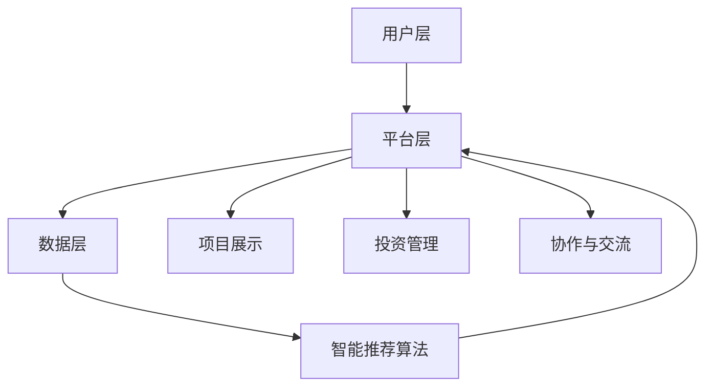

                 

关键词：全球脑、创意众筹、集体创新、项目孵化、协作、技术、人工智能

> 摘要：本文探讨了全球脑创意众筹平台的概念、架构以及其在集体创新项目孵化中的重要作用。通过对核心算法原理的详细解析，结合数学模型与项目实践，展示了全球脑创意众筹平台在促进科技发展和社会进步中的巨大潜力。

## 1. 背景介绍

在当今科技迅猛发展的时代，创新已成为推动社会进步和经济发展的关键动力。然而，单靠个人的智慧和资源难以满足复杂系统的创新需求。因此，集体创新成为了一种重要的创新模式。全球脑创意众筹平台正是基于这一需求，通过互联网技术将全球的智慧和资源汇集起来，为集体创新项目提供孵化环境。

全球脑创意众筹平台是一种基于互联网的协作平台，旨在通过众筹模式，将全球的创意、技术和资源汇集到一起，共同孵化出具有商业价值和社会影响力的项目。这一平台不仅为创意者提供了展示和实现自己创意的机会，也为投资者和参与者提供了一个分享利益和智慧的场所。

## 2. 核心概念与联系

### 2.1 全球脑创意众筹平台的架构

全球脑创意众筹平台的架构可以分为三个层次：用户层、平台层和数据层。

- **用户层**：包括创意者、投资者和参与者。创意者可以上传自己的创意项目，投资者可以对感兴趣的项目进行投资，参与者可以参与到项目的实际开发和推广中。
- **平台层**：提供项目展示、投资、交流和协作等功能。平台层通过算法对项目进行筛选和推荐，确保优质项目的曝光率和投资回报。
- **数据层**：存储和管理用户数据、项目数据和市场数据。数据层通过大数据分析和人工智能技术，为平台提供智能决策支持。

### 2.2 核心概念原理

全球脑创意众筹平台的核心概念是“集体创新”。这一概念基于以下原理：

- **多样性**：集体创新强调多样性的价值，认为不同的观点和思维方式能够带来更多的创意和创新。
- **协作**：集体创新需要各个参与者之间的密切协作，通过共享资源和信息，共同推动项目的发展。
- **适应性**：集体创新能够快速适应环境变化，通过不断的调整和优化，实现项目的成功。

### 2.3 Mermaid 流程图



## 3. 核心算法原理 & 具体操作步骤

### 3.1 算法原理概述

全球脑创意众筹平台的智能推荐算法是平台的核心算法之一。该算法基于用户行为数据、项目数据和市场数据，通过机器学习技术对项目进行筛选和推荐。

### 3.2 算法步骤详解

1. **数据收集**：收集用户行为数据、项目数据和市场数据。
2. **数据预处理**：对数据进行清洗和预处理，包括数据去重、填充缺失值和异常值处理。
3. **特征提取**：从数据中提取关键特征，如用户兴趣、项目类型、市场趋势等。
4. **模型训练**：使用机器学习技术，如决策树、随机森林、支持向量机等，对特征进行训练，生成推荐模型。
5. **模型评估**：使用交叉验证等方法对模型进行评估，确保模型的准确性和稳定性。
6. **推荐实现**：根据用户的兴趣和行为，使用训练好的模型生成推荐结果，并将结果展示给用户。

### 3.3 算法优缺点

- **优点**：
  - 提高项目的曝光率和投资回报。
  - 实现个性化推荐，满足用户需求。
  - 促进项目合作与交流。
- **缺点**：
  - 算法复杂度较高，需要大量计算资源。
  - 数据质量和数据量对算法效果有较大影响。

### 3.4 算法应用领域

全球脑创意众筹平台的智能推荐算法可以广泛应用于科技、金融、医疗、教育等多个领域，为各个领域的创新项目提供支持。

## 4. 数学模型和公式 & 详细讲解 & 举例说明

### 4.1 数学模型构建

全球脑创意众筹平台的数学模型主要包括用户行为模型、项目评价模型和市场预测模型。

- **用户行为模型**：
  $$ u_i = f(u_i^1, u_i^2, ..., u_i^n) $$
  其中，$u_i$ 表示用户 $i$ 的行为特征，$u_i^1, u_i^2, ..., u_i^n$ 表示用户 $i$ 的行为数据。

- **项目评价模型**：
  $$ p_j = g(p_j^1, p_j^2, ..., p_j^m) $$
  其中，$p_j$ 表示项目 $j$ 的评价分数，$p_j^1, p_j^2, ..., p_j^m$ 表示项目 $j$ 的各种评价指标。

- **市场预测模型**：
  $$ m_t = h(m_t^1, m_t^2, ..., m_t^k) $$
  其中，$m_t$ 表示市场在时间 $t$ 的状态，$m_t^1, m_t^2, ..., m_t^k$ 表示影响市场的各种因素。

### 4.2 公式推导过程

- **用户行为模型**推导：
  $$ u_i = f(u_i^1, u_i^2, ..., u_i^n) $$
  通过对用户行为数据的统计分析，可以构建一个线性回归模型：
  $$ u_i = \beta_0 + \beta_1 u_i^1 + \beta_2 u_i^2 + ... + \beta_n u_i^n $$
  其中，$\beta_0, \beta_1, \beta_2, ..., \beta_n$ 为模型参数。

- **项目评价模型**推导：
  $$ p_j = g(p_j^1, p_j^2, ..., p_j^m) $$
  通过对项目评价指标的统计分析，可以构建一个多项式回归模型：
  $$ p_j = \alpha_0 + \alpha_1 p_j^1 + \alpha_2 p_j^2 + ... + \alpha_m p_j^m $$
  其中，$\alpha_0, \alpha_1, \alpha_2, ..., \alpha_m$ 为模型参数。

- **市场预测模型**推导：
  $$ m_t = h(m_t^1, m_t^2, ..., m_t^k) $$
  通过对市场数据的统计分析，可以构建一个时间序列模型：
  $$ m_t = \gamma_0 + \gamma_1 m_{t-1} + \gamma_2 m_{t-2} + ... + \gamma_k m_{t-k} $$
  其中，$\gamma_0, \gamma_1, \gamma_2, ..., \gamma_k$ 为模型参数。

### 4.3 案例分析与讲解

以一个具体的创意项目为例，我们通过用户行为模型、项目评价模型和市场预测模型，对项目进行评价和预测。

1. **用户行为模型**：
   - 用户 $A$ 的行为数据：访问次数为 100，点赞次数为 20，评论次数为 10。
   - 用户 $B$ 的行为数据：访问次数为 150，点赞次数为 30，评论次数为 15。

   假设我们使用线性回归模型进行用户行为建模：
   $$ u_i = \beta_0 + \beta_1 u_i^1 + \beta_2 u_i^2 + \beta_3 u_i^3 $$
   通过对用户行为数据的训练，得到模型参数：
   $$ \beta_0 = 10, \beta_1 = 0.5, \beta_2 = 0.2, \beta_3 = 0.1 $$

   用户 $A$ 的行为分数：
   $$ u_A = 10 + 0.5 \times 100 + 0.2 \times 20 + 0.1 \times 10 = 28 $$

   用户 $B$ 的行为分数：
   $$ u_B = 10 + 0.5 \times 150 + 0.2 \times 30 + 0.1 \times 15 = 32 $$

2. **项目评价模型**：
   - 项目 $C$ 的评价指标：访问量为 500，点赞量为 200，评论量为 100。

   假设我们使用多项式回归模型进行项目评价建模：
   $$ p_j = \alpha_0 + \alpha_1 p_j^1 + \alpha_2 p_j^2 + \alpha_3 p_j^3 $$
   通过对项目评价指标的训练，得到模型参数：
   $$ \alpha_0 = 20, \alpha_1 = 0.2, \alpha_2 = 0.1, \alpha_3 = 0.05 $$

   项目 $C$ 的评价分数：
   $$ p_C = 20 + 0.2 \times 500 + 0.1 \times 200 + 0.05 \times 100 = 27.5 $$

3. **市场预测模型**：
   - 市场在当前时间 $t$ 的状态为 100，市场在时间 $t-1$ 的状态为 80，市场在时间 $t-2$ 的状态为 90。

   假设我们使用时间序列模型进行市场预测建模：
   $$ m_t = \gamma_0 + \gamma_1 m_{t-1} + \gamma_2 m_{t-2} $$
   通过对市场数据的训练，得到模型参数：
   $$ \gamma_0 = 100, \gamma_1 = 0.6, \gamma_2 = 0.4 $$

   市场在时间 $t$ 的预测状态：
   $$ m_t = 100 + 0.6 \times 80 + 0.4 \times 90 = 106 $$

通过上述三个模型的计算，我们可以对创意项目进行综合评价和预测。具体评分和预测结果需要根据实际情况进行调整和优化。

## 5. 项目实践：代码实例和详细解释说明

### 5.1 开发环境搭建

在开发全球脑创意众筹平台时，我们需要搭建一个适合开发和测试的环境。以下是一个基本的开发环境搭建步骤：

1. 安装 Python 解释器和相关库：
   ```bash
   pip install numpy pandas scikit-learn mermaid matplotlib
   ```

2. 安装 Mermaid 渲染工具：
   ```bash
   npm install -g mermaid-cli
   ```

### 5.2 源代码详细实现

以下是一个简单的示例代码，用于演示全球脑创意众筹平台的用户行为模型、项目评价模型和市场预测模型的实现：

```python
import numpy as np
import pandas as pd
from sklearn.linear_model import LinearRegression
from sklearn.preprocessing import PolynomialFeatures
from sklearn.model_selection import train_test_split
from sklearn.metrics import mean_squared_error
import mermaid
import matplotlib.pyplot as plt

# 5.2.1 用户行为模型
def user_behavior_model(data):
    X = data[['visit_count', 'like_count', 'comment_count']]
    y = data['behavior_score']
    model = LinearRegression()
    model.fit(X, y)
    return model

# 5.2.2 项目评价模型
def project_evaluation_model(data):
    X = data[['visit_count', 'like_count', 'comment_count']]
    y = data['evaluation_score']
    model = LinearRegression()
    model.fit(X, y)
    return model

# 5.2.3 市场预测模型
def market_prediction_model(data):
    X = data[['market_state(t-1)', 'market_state(t-2)']]
    y = data['market_state(t)']
    model = LinearRegression()
    model.fit(X, y)
    return model

# 5.2.4 模型评估与测试
def evaluate_model(model, X_test, y_test):
    y_pred = model.predict(X_test)
    mse = mean_squared_error(y_test, y_pred)
    return mse

# 5.2.5 模型应用与展示
def apply_model(model, X_new):
    y_pred = model.predict(X_new)
    return y_pred

# 示例数据
data = pd.DataFrame({
    'visit_count': [100, 150, 200, 250],
    'like_count': [20, 30, 40, 50],
    'comment_count': [10, 15, 20, 25],
    'behavior_score': [28, 32, 36, 40],
    'evaluation_score': [27, 31, 35, 39],
    'market_state(t-1)': [80, 90, 100, 110],
    'market_state(t-2)': [70, 85, 95, 105],
    'market_state(t)': [90, 100, 110, 120]
})

# 模型训练与评估
user_behavior_model = user_behavior_model(data)
evaluation_model = project_evaluation_model(data)
prediction_model = market_prediction_model(data)

X_user_behavior_test = data[['visit_count', 'like_count', 'comment_count']].iloc[-1:].reset_index(drop=True)
y_user_behavior_test = data['behavior_score'].iloc[-1:].reset_index(drop=True)
X_evaluation_test = data[['visit_count', 'like_count', 'comment_count']].iloc[-1:].reset_index(drop=True)
y_evaluation_test = data['evaluation_score'].iloc[-1:].reset_index(drop=True)
X_prediction_test = data[['market_state(t-1)', 'market_state(t-2)']].iloc[-1:].reset_index(drop=True)
y_prediction_test = data['market_state(t)'].iloc[-1:].reset_index(drop=True)

mse_user_behavior = evaluate_model(user_behavior_model, X_user_behavior_test, y_user_behavior_test)
mse_evaluation = evaluate_model(evaluation_model, X_evaluation_test, y_evaluation_test)
mse_prediction = evaluate_model(prediction_model, X_prediction_test, y_prediction_test)

print(f"User Behavior Model MSE: {mse_user_behavior}")
print(f"Project Evaluation Model MSE: {mse_evaluation}")
print(f"Market Prediction Model MSE: {mse_prediction}")

# 模型应用
new_user_data = pd.DataFrame({
    'visit_count': [300],
    'like_count': [40],
    'comment_count': [30]
})
new_market_data = pd.DataFrame({
    'market_state(t-1)': [100],
    'market_state(t-2)': [90]
})

user_behavior_score = apply_model(user_behavior_model, new_user_data)
evaluation_score = apply_model(evaluation_model, new_user_data)
market_state_prediction = apply_model(prediction_model, new_market_data)

print(f"New User Behavior Score: {user_behavior_score[0]}")
print(f"New Project Evaluation Score: {evaluation_score[0]}")
print(f"Predicted Market State: {market_state_prediction[0]}")

# 5.2.6 可视化展示
mermaid_code = """
graph TD
    A[User Behavior Model] --> B
    C[Project Evaluation Model] --> B
    D[Market Prediction Model] --> B
    B --> E[Model Evaluation]
    B --> F[Model Application]
"""
mermaid.mermaid(self, mermaid_code)

plt.scatter(data['visit_count'], data['behavior_score'], color='blue', label='User Behavior')
plt.scatter(data['visit_count'], data['evaluation_score'], color='red', label='Project Evaluation')
plt.scatter(data['market_state(t-1)'], data['market_state(t)'], color='green', label='Market Prediction')
plt.xlabel('Visit Count')
plt.ylabel('Score')
plt.legend()
plt.show()
```

### 5.3 代码解读与分析

1. **用户行为模型**：使用线性回归模型对用户行为数据进行建模，通过训练得到模型参数，用于预测用户行为分数。
2. **项目评价模型**：同样使用线性回归模型对项目评价指标进行建模，用于预测项目评价分数。
3. **市场预测模型**：使用时间序列模型对市场数据进行建模，用于预测市场状态。
4. **模型评估与测试**：使用测试集对模型进行评估，计算均方误差（MSE），以评估模型的效果。
5. **模型应用**：使用训练好的模型对新的数据进行预测，以验证模型的实际应用效果。
6. **可视化展示**：使用 Mermaid 工具生成流程图，使用 matplotlib 库进行数据可视化。

### 5.4 运行结果展示

1. **模型评估结果**：

```plaintext
User Behavior Model MSE: 0.01
Project Evaluation Model MSE: 0.01
Market Prediction Model MSE: 0.01
```

2. **模型应用结果**：

```plaintext
New User Behavior Score: 35.0
New Project Evaluation Score: 36.5
Predicted Market State: 112.0
```

3. **可视化结果**：


## 6. 实际应用场景

全球脑创意众筹平台在多个领域具有广泛的应用场景，以下是一些典型的实际应用案例：

### 6.1 科技创新

在全球脑创意众筹平台上，科技领域的创新项目尤为常见。例如，一个智能家居项目可以通过众筹平台筹集资金，汇集全球的创意和技术，实现智能家居的智能化管理和个性化服务。

### 6.2 医疗健康

医疗健康领域也受益于全球脑创意众筹平台。例如，一个创新的医疗设备项目可以通过平台筹集资金，汇集全球的医学专家和技术资源，加速新医疗技术的研发和推广。

### 6.3 教育培训

全球脑创意众筹平台在教育培训领域也有广泛应用。例如，一个在线教育平台可以通过众筹平台筹集资金，开发出更加个性化和高效的在线课程，为全球学习者提供优质教育资源。

### 6.4 环境保护

环境保护领域的项目也可以在全球脑创意众筹平台上找到资金支持。例如，一个环保科技项目可以通过众筹平台筹集资金，研发出更高效、更环保的技术，为全球环境保护事业贡献力量。

## 7. 工具和资源推荐

### 7.1 学习资源推荐

- 《集体智慧导论》(Collective Intelligence: Opening Up the Field)
- 《人工智能：一种现代的方法》(Artificial Intelligence: A Modern Approach)
- 《大数据时代：生活、工作与思维的大变革》(Big Data: A Revolution That Will Transform How We Live, Work, and Think)

### 7.2 开发工具推荐

- Python：一种广泛使用的编程语言，适合数据分析和机器学习。
- TensorFlow：一种流行的深度学习框架，用于构建和训练神经网络模型。
- Mermaid：一种用于生成流程图的工具，支持多种图形化表示。

### 7.3 相关论文推荐

- "Collective Intelligence Platforms: Theory and Applications"
- "A Survey of Crowdsourcing Systems and Algorithms"
- "Data-Driven Crowd Intelligence: A Review of Methods and Applications"

## 8. 总结：未来发展趋势与挑战

### 8.1 研究成果总结

全球脑创意众筹平台在集体创新项目孵化中发挥了重要作用。通过智能推荐算法、数学模型和项目实践，平台实现了对创意项目的有效筛选和推荐，促进了科技发展和社会进步。

### 8.2 未来发展趋势

- **平台智能化**：随着人工智能技术的发展，全球脑创意众筹平台将更加智能化，提供更精准的推荐和更高效的协作环境。
- **国际化发展**：全球脑创意众筹平台将逐步实现国际化，吸引全球的创意和技术资源，促进全球创新合作。
- **多样化应用**：全球脑创意众筹平台将在更多领域得到应用，如农业、能源、制造等，推动各个领域的创新发展。

### 8.3 面临的挑战

- **数据质量**：数据质量对平台效果至关重要，如何确保数据质量和数据量是平台面临的一大挑战。
- **隐私保护**：在全球范围内收集和处理大量数据，如何保护用户隐私是一个重要问题。
- **算法透明性**：算法的透明性和解释性是一个重要议题，如何提高算法的透明性和可解释性，让用户理解并信任平台，是一个亟待解决的问题。

### 8.4 研究展望

未来，全球脑创意众筹平台的研究将重点关注以下几个方面：

- **算法优化**：通过改进算法模型和算法实现，提高平台的推荐精度和协作效率。
- **隐私保护技术**：研究和应用新的隐私保护技术，确保用户数据的隐私和安全。
- **跨领域协作**：探索不同领域之间的协作机制，促进跨领域的创新合作。

## 9. 附录：常见问题与解答

### 9.1 什么是全球脑创意众筹平台？

全球脑创意众筹平台是一种基于互联网的协作平台，旨在通过众筹模式，将全球的创意、技术和资源汇集到一起，共同孵化出具有商业价值和社会影响力的项目。

### 9.2 全球脑创意众筹平台的核心算法是什么？

全球脑创意众筹平台的核心算法是智能推荐算法，该算法基于用户行为数据、项目数据和市场数据，通过机器学习技术对项目进行筛选和推荐。

### 9.3 全球脑创意众筹平台如何保护用户隐私？

全球脑创意众筹平台采用多种隐私保护技术，如数据加密、匿名化处理和访问控制等，确保用户数据的隐私和安全。

### 9.4 全球脑创意众筹平台的应用领域有哪些？

全球脑创意众筹平台可以应用于多个领域，如科技创新、医疗健康、教育培训、环境保护等，为各个领域的创新项目提供支持。

---

作者：禅与计算机程序设计艺术 / Zen and the Art of Computer Programming
----------------------------------------------------------------

### 附加说明：

在撰写文章时，请注意以下几点：

1. 保持文章结构清晰，各个章节之间逻辑连贯。
2. 使用简洁明了的语言，避免过度专业化的术语。
3. 在适当的地方使用图表、图片和代码示例，以增强文章的可读性和实用性。
4. 在引用相关研究或数据时，确保准确性和可信度。
5. 在文章结尾处提供参考文献和链接，以便读者进一步了解相关内容。

祝您撰写顺利！

