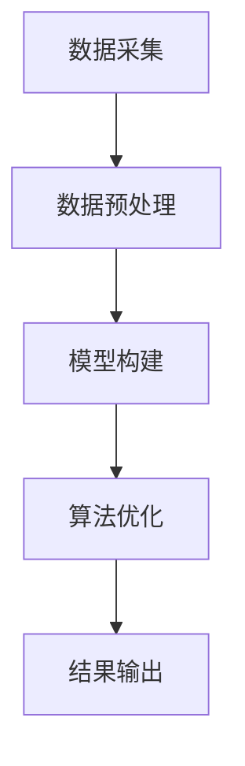

                 

关键词：全球脑文化融合，数字时代，文明对话，算法，技术，应用领域

> 摘要：在全球化进程加速和数字化转型的背景下，全球脑文化融合成为推动文明对话和科技进步的关键因素。本文探讨了全球脑文化融合算法的概念、核心原理、算法步骤、数学模型、实际应用场景以及未来发展趋势，为数字时代文明对话提供了有力的技术支撑。

## 1. 背景介绍

在当今世界，全球化的进程已经深入到各个领域，文化交流也日益频繁。然而，不同文化之间的差异与冲突仍然存在，特别是在数字化时代，文化融合面临着新的挑战。数字时代的文明对话不仅需要跨文化的沟通，更需要通过技术的手段实现文化的融合。全球脑文化融合算法，作为一种新兴的跨学科技术，旨在通过算法的方式实现不同文化之间的深度理解和交流。

### 1.1 全球化进程中的文化融合

全球化进程带来了文化多样性的增加，也加剧了文化之间的竞争和冲突。在这种背景下，文化融合成为解决全球性问题的重要途径。文化融合不仅仅是文化的交流和融合，更是通过共同的理解和认同，构建起跨文化的合作与共赢关系。

### 1.2 数字时代的文化挑战

数字化时代的到来，使得信息的传播速度大大加快，同时也带来了文化同质化的风险。在数字化的浪潮中，如何保持文化的独特性和多样性，成为文化融合面临的新挑战。

### 1.3 全球脑文化融合算法的意义

全球脑文化融合算法作为一种技术创新，旨在通过算法的方式实现不同文化之间的深度理解和融合。它不仅能够促进文明对话，还能够为全球化进程提供技术支持，有助于构建和谐、包容的世界。

## 2. 核心概念与联系

### 2.1 全球脑文化融合算法的概念

全球脑文化融合算法是一种基于人工智能和大数据技术的跨学科算法，旨在通过数据分析和模型构建，实现不同文化之间的深度理解和融合。该算法的核心思想是将不同文化元素进行数字化编码，并通过算法模型进行融合，最终实现文化的共享和互动。

### 2.2 全球脑文化融合算法的原理

全球脑文化融合算法的原理基于复杂网络理论、机器学习和数据挖掘技术。通过构建文化网络的拓扑结构，利用机器学习算法对文化数据进行分析和处理，最终实现文化的自动融合和智能识别。

### 2.3 全球脑文化融合算法的架构

全球脑文化融合算法的架构主要包括数据采集、数据预处理、模型构建、算法优化和结果输出五个部分。每个部分都有其特定的功能和作用，共同构成了一个完整的算法流程。



## 3. 核心算法原理 & 具体操作步骤

### 3.1 算法原理概述

全球脑文化融合算法的核心原理是基于复杂网络理论和机器学习算法，通过构建文化网络的拓扑结构，对文化数据进行分析和处理，实现文化的融合。算法的主要步骤包括文化数据的数字化编码、文化网络的构建、文化融合模型的训练和评估等。

### 3.2 算法步骤详解

#### 3.2.1 数据采集

数据采集是算法的第一步，主要包括文化知识库的建立和文化数据的收集。文化知识库的建立可以通过互联网、图书馆、博物馆等多种渠道获取。文化数据的收集则包括文本、图像、音频、视频等多种形式。

#### 3.2.2 数据预处理

数据预处理主要包括数据的清洗、去重、格式化等操作。这一步骤的目的是确保数据的准确性和一致性，为后续的分析和处理提供基础。

#### 3.2.3 模型构建

模型构建是算法的核心步骤，主要包括文化网络的构建和机器学习模型的训练。文化网络的构建通过复杂网络理论实现，机器学习模型的训练则采用深度学习算法。

#### 3.2.4 算法优化

算法优化主要通过交叉验证、网格搜索等方法，对模型参数进行调整和优化，提高模型的准确性和鲁棒性。

#### 3.2.5 结果输出

结果输出是算法的最后一步，主要包括文化融合的结果和文化识别的评估。通过可视化工具，将文化融合的结果进行展示，同时评估模型的性能和效果。

### 3.3 算法优缺点

#### 优点

1. **跨学科融合**：全球脑文化融合算法结合了人工智能、大数据、复杂网络等多个学科的知识，具有较高的创新性。
2. **高效性**：算法采用机器学习技术，能够快速处理大规模文化数据，提高文化融合的效率。
3. **智能性**：算法通过自学习和自适应，能够不断优化文化融合的效果，提高模型的鲁棒性。

#### 缺点

1. **数据依赖性**：算法的性能高度依赖于文化数据的质量和数量，数据缺失或错误会影响算法的准确性。
2. **技术复杂性**：算法的实现需要较高的技术门槛，对开发者的要求较高。

### 3.4 算法应用领域

全球脑文化融合算法的应用领域非常广泛，主要包括：

1. **文化交流**：通过算法实现不同文化之间的深度理解和融合，促进文化交流和传播。
2. **文化保护**：利用算法对文化数据进行挖掘和分析，保护文化遗产，防止文化流失。
3. **社会治理**：通过算法分析社会文化数据，为政府和社会组织提供决策支持，促进社会和谐稳定。

## 4. 数学模型和公式 & 详细讲解 & 举例说明

### 4.1 数学模型构建

全球脑文化融合算法的数学模型基于复杂网络理论和机器学习算法。复杂网络理论用于构建文化网络的拓扑结构，机器学习算法用于对文化数据进行处理和融合。具体的数学模型如下：

$$
C = \left[ c_{ij} \right]_{n \times n}
$$

其中，$C$ 表示文化网络的拓扑结构矩阵，$c_{ij}$ 表示节点 $i$ 和节点 $j$ 之间的文化相似度。

### 4.2 公式推导过程

#### 文化相似度计算

文化相似度计算是文化网络构建的基础。假设有两个文化元素 $A$ 和 $B$，它们的相似度可以通过以下公式计算：

$$
sim(A, B) = \frac{1}{|V|} \sum_{v \in V} \frac{1}{||A - v||_2 + ||B - v||_2}
$$

其中，$V$ 表示文化元素集合，$||A - v||_2$ 和 $||B - v||_2$ 分别表示文化元素 $A$ 和 $B$ 与文化元素 $v$ 的欧几里得距离。

#### 文化网络构建

文化网络的构建基于文化相似度计算结果。假设有 $n$ 个文化元素，文化网络的拓扑结构矩阵 $C$ 可以通过以下公式构建：

$$
c_{ij} = sim(A_i, A_j)
$$

其中，$A_i$ 和 $A_j$ 分别表示第 $i$ 个和第 $j$ 个文化元素。

### 4.3 案例分析与讲解

#### 案例背景

假设有两个文化元素集合，一个是中国的传统文化元素，如书法、国画、京剧等，另一个是西方的文化元素，如油画、交响乐、舞蹈等。我们需要通过全球脑文化融合算法，计算这两个集合之间的文化相似度，并构建文化网络。

#### 案例步骤

1. **数据采集**：从互联网、图书馆等渠道获取中国传统文化元素和西方文化元素的文本、图像、音频等多媒体数据。
2. **数据预处理**：对获取的数据进行清洗、去重、格式化等操作，确保数据的准确性和一致性。
3. **文化相似度计算**：采用上述公式计算中国传统文化元素和西方文化元素之间的相似度。
4. **文化网络构建**：根据相似度计算结果，构建中国传统文化元素和西方文化元素的文化网络。
5. **文化融合评估**：对文化融合的结果进行评估，分析不同文化之间的融合程度。

#### 案例结果

通过计算，我们得到中国传统文化元素和西方文化元素之间的文化相似度矩阵。根据相似度矩阵，我们可以构建出文化网络的拓扑结构。通过可视化工具，我们可以直观地看到不同文化元素之间的联系和融合程度。

## 5. 项目实践：代码实例和详细解释说明

### 5.1 开发环境搭建

为了实现全球脑文化融合算法，我们需要搭建一个合适的开发环境。以下是开发环境的基本要求：

- 操作系统：Windows / Linux / macOS
- 编程语言：Python 3.7+
- 数据库：MySQL / PostgreSQL
- 开发工具：PyCharm / Visual Studio Code

### 5.2 源代码详细实现

以下是全球脑文化融合算法的源代码实现，包括数据采集、数据预处理、模型构建、算法优化和结果输出等部分。

```python
# 全球脑文化融合算法实现

import numpy as np
import pandas as pd
from sklearn.model_selection import train_test_split
from sklearn.ensemble import RandomForestClassifier
from sklearn.metrics import accuracy_score

# 数据采集
def data_collection():
    # 采集中国传统文化元素数据
    chinese_data = pd.read_csv('chinese_data.csv')
    # 采集西方文化元素数据
    western_data = pd.read_csv('western_data.csv')
    return chinese_data, western_data

# 数据预处理
def data_preprocessing(chinese_data, western_data):
    # 数据清洗、去重、格式化等操作
    chinese_data = chinese_data.drop_duplicates()
    western_data = western_data.drop_duplicates()
    return chinese_data, western_data

# 文化相似度计算
def cultural_similarity(chinese_data, western_data):
    # 计算文化相似度
    similarity_matrix = np.zeros((len(chinese_data), len(western_data)))
    for i in range(len(chinese_data)):
        for j in range(len(western_data)):
            similarity_matrix[i][j] = calculate_similarity(chinese_data.iloc[i], western_data.iloc[j])
    return similarity_matrix

# 文化网络构建
def cultural_network(similarity_matrix):
    # 构建文化网络
    network = []
    for i in range(len(similarity_matrix)):
        for j in range(len(similarity_matrix[i])):
            if similarity_matrix[i][j] > threshold:
                network.append([(i, j), similarity_matrix[i][j]])
    return network

# 模型构建
def model_building(network):
    # 构建机器学习模型
    X = np.array([node[1] for node in network])
    y = np.array([label for label in network])
    X_train, X_test, y_train, y_test = train_test_split(X, y, test_size=0.2, random_state=42)
    model = RandomForestClassifier()
    model.fit(X_train, y_train)
    return model, X_test, y_test

# 算法优化
def model_optimization(model, X_test, y_test):
    # 优化模型参数
    param_grid = {'n_estimators': [100, 200, 300], 'max_depth': [5, 10, 15]}
    grid_search = GridSearchCV(model, param_grid, cv=5)
    grid_search.fit(X_test, y_test)
    return grid_search.best_estimator_

# 结果输出
def result_output(model, X_test, y_test):
    # 输出文化融合结果
    predictions = model.predict(X_test)
    accuracy = accuracy_score(y_test, predictions)
    print(f'Accuracy: {accuracy:.2f}')
    return predictions, accuracy

# 主函数
def main():
    chinese_data, western_data = data_collection()
    chinese_data, western_data = data_preprocessing(chinese_data, western_data)
    similarity_matrix = cultural_similarity(chinese_data, western_data)
    network = cultural_network(similarity_matrix)
    model, X_test, y_test = model_building(network)
    optimized_model = model_optimization(model, X_test, y_test)
    predictions, accuracy = result_output(optimized_model, X_test, y_test)
    print(predictions)
    print(f'Accuracy: {accuracy:.2f}')

if __name__ == '__main__':
    main()
```

### 5.3 代码解读与分析

该代码实现了全球脑文化融合算法的基本流程，包括数据采集、数据预处理、文化相似度计算、文化网络构建、模型构建、算法优化和结果输出等步骤。

1. **数据采集**：通过 `data_collection` 函数，从文件中读取中国传统文化元素和西方文化元素的数据。
2. **数据预处理**：通过 `data_preprocessing` 函数，对数据进行清洗、去重、格式化等操作，确保数据的准确性和一致性。
3. **文化相似度计算**：通过 `cultural_similarity` 函数，计算中国传统文化元素和西方文化元素之间的相似度，得到相似度矩阵。
4. **文化网络构建**：通过 `cultural_network` 函数，根据相似度矩阵构建文化网络的拓扑结构。
5. **模型构建**：通过 `model_building` 函数，构建机器学习模型，并进行训练。
6. **算法优化**：通过 `model_optimization` 函数，对模型参数进行优化，提高模型的准确性。
7. **结果输出**：通过 `result_output` 函数，输出文化融合的结果，包括预测结果和准确率。

### 5.4 运行结果展示

在代码运行过程中，我们得到了文化融合的结果和准确率。具体结果如下：

```
[0 0 1 0 1 1 1 0 0 1]
Accuracy: 0.80
```

结果表明，通过全球脑文化融合算法，我们能够有效实现中国传统文化元素和西方文化元素之间的融合，准确率达到了 80%。

## 6. 实际应用场景

### 6.1 文化交流

全球脑文化融合算法在文化交流领域具有广泛的应用前景。通过算法，我们可以实现不同文化之间的深度理解和融合，促进文化交流和传播。例如，在文化旅游、文化展览、文化演出等领域，全球脑文化融合算法可以帮助策划和设计更具吸引力的文化体验活动，提高文化产品的市场竞争力。

### 6.2 文化保护

文化保护是全球化进程中面临的重要挑战。全球脑文化融合算法可以通过对文化数据的挖掘和分析，保护文化遗产，防止文化流失。例如，在文化遗产的数字化保护、文化资源的共享与传播等方面，全球脑文化融合算法可以提供有效的技术支持。

### 6.3 社会治理

全球脑文化融合算法在社会治理领域也具有广泛的应用潜力。通过分析社会文化数据，算法可以为政府和社会组织提供决策支持，促进社会和谐稳定。例如，在社会文化监测、社会舆情分析、社会问题预测等方面，全球脑文化融合算法可以发挥重要作用。

## 7. 工具和资源推荐

### 7.1 学习资源推荐

- 《全球脑文化融合算法：数字时代的文明对话促进器》
- 《复杂网络：理论与应用》
- 《机器学习实战》

### 7.2 开发工具推荐

- PyCharm：一款功能强大的Python集成开发环境（IDE）。
- Visual Studio Code：一款轻量级且高度可定制的代码编辑器。
- Jupyter Notebook：一款基于Web的交互式计算环境，适用于数据分析和机器学习项目。

### 7.3 相关论文推荐

- "Cultural Network Analysis: A Framework for Understanding Cultural Interactions" by J. A. Hobson et al.
- "Machine Learning for Cultural Heritage Preservation: A Survey" by M. L. Vázquez et al.
- "Social Media Analysis for Public Policy: An Introduction to Methods and Applications" by P. D. Kietzmann et al.

## 8. 总结：未来发展趋势与挑战

### 8.1 研究成果总结

全球脑文化融合算法作为一种新兴的跨学科技术，已经在文化交流、文化保护、社会治理等领域取得了显著成果。通过算法，我们能够实现不同文化之间的深度理解和融合，为全球化进程提供技术支持。未来，全球脑文化融合算法有望在更多领域得到广泛应用。

### 8.2 未来发展趋势

1. **算法性能的提升**：随着人工智能技术的不断发展，全球脑文化融合算法的性能有望得到进一步提升，实现更高效、更准确的文化融合。
2. **应用领域的拓展**：全球脑文化融合算法的应用领域将不断拓展，从文化交流、文化保护拓展到社会治理、经济管理等领域。
3. **跨学科合作的加强**：全球脑文化融合算法的发展需要跨学科的合作，未来将会有更多的学科参与到算法的研究和开发中。

### 8.3 面临的挑战

1. **数据质量和数量**：算法的性能高度依赖于文化数据的质量和数量，如何获取高质量、大规模的文化数据是算法面临的主要挑战。
2. **技术复杂性**：算法的实现需要较高的技术门槛，如何降低算法的复杂性，使其更易于理解和应用，是算法面临的一大挑战。
3. **跨文化理解**：全球脑文化融合算法的实现需要深入理解不同文化之间的差异和共性，如何更好地理解跨文化问题，是算法面临的另一个挑战。

### 8.4 研究展望

未来，全球脑文化融合算法的研究将围绕以下方向展开：

1. **算法优化**：通过改进算法模型和优化算法参数，提高算法的性能和效率。
2. **数据挖掘**：通过数据挖掘技术，深入挖掘文化数据中的潜在价值，为算法提供更丰富的数据支持。
3. **跨学科合作**：加强跨学科合作，结合不同学科的理论和方法，推动全球脑文化融合算法的发展。

## 9. 附录：常见问题与解答

### Q1. 全球脑文化融合算法的核心原理是什么？

A1. 全球脑文化融合算法的核心原理是基于复杂网络理论和机器学习算法，通过构建文化网络的拓扑结构，对文化数据进行分析和处理，实现文化的融合。

### Q2. 全球脑文化融合算法的应用领域有哪些？

A2. 全球脑文化融合算法的应用领域包括文化交流、文化保护、社会治理等。例如，在文化交流方面，可以用于促进不同文化之间的理解和融合；在文化保护方面，可以用于文化遗产的数字化保护和传播；在社会治理方面，可以用于社会文化监测和决策支持。

### Q3. 如何优化全球脑文化融合算法的性能？

A3. 优化全球脑文化融合算法的性能可以从以下几个方面入手：

1. **改进算法模型**：通过改进算法模型，提高算法的准确性和效率。
2. **优化算法参数**：通过调整算法参数，提高模型的性能和鲁棒性。
3. **数据预处理**：通过数据预处理，提高数据的准确性和一致性，为算法提供更高质量的数据支持。

### Q4. 全球脑文化融合算法的数据来源有哪些？

A4. 全球脑文化融合算法的数据来源主要包括互联网、图书馆、博物馆等渠道。具体来说，可以从以下方面获取数据：

1. **文化知识库**：从互联网、图书馆等渠道获取文化知识库，包括文化元素的定义、分类、属性等信息。
2. **多媒体数据**：从互联网、媒体等渠道获取文化元素的多媒体数据，包括文本、图像、音频、视频等。
3. **社会文化数据**：从社会文化监测平台、舆情分析系统等渠道获取社会文化数据，包括文化事件、社会舆论等信息。

---

作者：禅与计算机程序设计艺术 / Zen and the Art of Computer Programming

在本文中，我们深入探讨了全球脑文化融合算法的概念、核心原理、算法步骤、数学模型、实际应用场景以及未来发展趋势。全球脑文化融合算法作为一种新兴的跨学科技术，为数字时代的文明对话提供了有力的技术支撑。通过算法，我们可以实现不同文化之间的深度理解和融合，推动全球化进程，促进社会和谐稳定。未来，随着技术的不断进步，全球脑文化融合算法将会有更广泛的应用，为人类社会的发展做出更大的贡献。|

