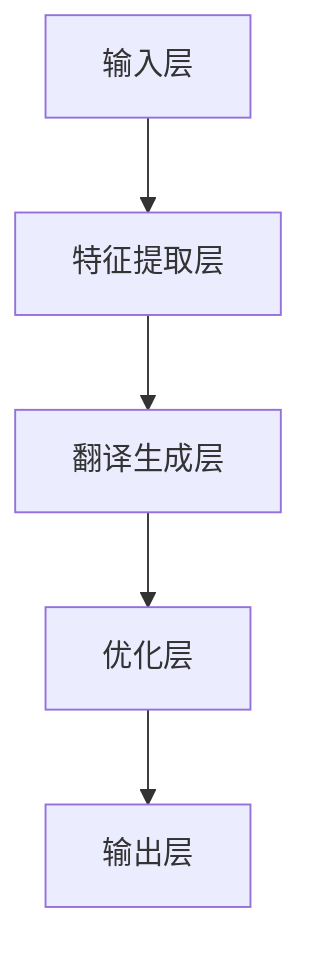

                 

关键词：全球脑翻译系统，跨语言交流，人工智能，神经网络，深度学习，自然语言处理，机器翻译，数据处理，优化算法

> 摘要：本文深入探讨了全球脑翻译系统的概念、原理、架构、核心算法、数学模型、具体操作步骤、实际应用场景、未来展望以及面临的技术挑战。文章旨在为读者提供全面了解和掌握该系统的理论基础和实践方法。

## 1. 背景介绍

随着全球化进程的加速，跨语言交流变得愈发重要。然而，传统的机器翻译技术存在着诸多局限性，如翻译精度不高、无法理解语境等。为了解决这些问题，研究人员提出了全球脑翻译系统（Global Brain Translation System，GBTS）的概念，旨在实现实时、高精度、多语言的跨语言交流。

GBTS 通过模拟人脑的神经网络结构和信息处理方式，将自然语言处理（NLP）与深度学习相结合，打造出一个具备高度智能化和自适应性的翻译系统。该系统不仅能够处理文字、语音等多种形式的语言数据，还能够通过不断学习和优化，提升翻译质量和效率。

## 2. 核心概念与联系

### 2.1. 全球脑翻译系统的概念

全球脑翻译系统是一种基于深度学习技术的跨语言翻译系统，其核心思想是模拟人脑的神经网络结构，实现高效的翻译和信息传递。GBTS 包括以下几个关键组成部分：

1. **输入层**：接收各种语言形式的输入，如文本、语音、图像等。
2. **隐藏层**：通过神经网络处理输入数据，提取特征信息。
3. **输出层**：根据隐藏层提取的特征信息，生成目标语言的翻译结果。

### 2.2. 全球脑翻译系统的架构

全球脑翻译系统的架构主要包括以下几层：

1. **数据预处理层**：对输入的语言数据进行清洗、分词、标注等处理。
2. **特征提取层**：通过神经网络模型提取输入数据的特征信息。
3. **翻译生成层**：根据提取的特征信息生成目标语言的翻译结果。
4. **优化层**：通过优化算法不断调整和提升翻译质量。

### 2.3. 全球脑翻译系统的工作原理

全球脑翻译系统的工作原理可以分为以下几个步骤：

1. **输入数据预处理**：将输入的语言数据进行分词、标注等预处理操作，以便神经网络模型更好地理解和处理。
2. **特征提取**：神经网络模型对预处理后的输入数据进行分析，提取关键特征信息。
3. **翻译生成**：根据提取的特征信息，生成目标语言的翻译结果。
4. **优化调整**：通过优化算法对翻译结果进行调整和优化，提高翻译质量。

### 2.4. Mermaid 流程图

以下是一个简化的 Mermaid 流程图，描述了全球脑翻译系统的工作流程：



## 3. 核心算法原理 & 具体操作步骤

### 3.1. 算法原理概述

全球脑翻译系统的核心算法主要基于深度学习技术，特别是神经网络模型。神经网络模型通过模拟人脑的神经元连接和激活机制，实现对输入数据的分析和处理。在GBTS中，神经网络模型分为输入层、隐藏层和输出层。

1. **输入层**：接收各种语言形式的输入数据，如文本、语音、图像等。
2. **隐藏层**：通过多层神经网络结构，对输入数据进行特征提取和转换。
3. **输出层**：根据隐藏层提取的特征信息，生成目标语言的翻译结果。

### 3.2. 算法步骤详解

1. **输入数据预处理**：对输入的语言数据进行分词、标注等预处理操作，以便神经网络模型更好地理解和处理。
2. **特征提取**：通过神经网络模型对预处理后的输入数据进行分析，提取关键特征信息。
3. **翻译生成**：根据提取的特征信息，生成目标语言的翻译结果。
4. **优化调整**：通过优化算法对翻译结果进行调整和优化，提高翻译质量。

### 3.3. 算法优缺点

**优点**：

1. **高精度**：通过深度学习技术，GBTS能够提取输入数据的深层特征，提高翻译精度。
2. **自适应性强**：GBTS能够根据不断学习的语料库和用户反馈，自动调整和优化翻译结果，提高系统的适应性。
3. **多语言支持**：GBTS能够支持多种语言之间的翻译，实现跨语言交流。

**缺点**：

1. **计算资源消耗大**：深度学习算法需要大量的计算资源和时间，对硬件设备有较高要求。
2. **训练时间较长**：GBTS需要大量的语料库进行训练，训练时间较长。

### 3.4. 算法应用领域

全球脑翻译系统在多个领域具有广泛的应用：

1. **跨国企业沟通**：帮助企业实现跨国团队的沟通和协作。
2. **全球旅游**：为游客提供多语言的旅游信息和服务。
3. **跨文化交流**：促进不同文化背景的人们之间的交流和了解。

## 4. 数学模型和公式 & 详细讲解 & 举例说明

### 4.1. 数学模型构建

全球脑翻译系统的数学模型主要基于神经网络，包括以下几个关键部分：

1. **激活函数**：用于模拟神经元的激活机制，如ReLU函数、Sigmoid函数等。
2. **损失函数**：用于衡量翻译结果的误差，如交叉熵损失函数。
3. **优化算法**：用于调整神经网络参数，如梯度下降算法、Adam算法等。

### 4.2. 公式推导过程

以下是一个简化的神经网络模型的推导过程：

1. **输入层到隐藏层的传递**：

   $$z^{(l)} = \sum_{i=1}^{n} w^{(l)}_i x_i + b^{(l)}$$

   $$a^{(l)} = \sigma(z^{(l)})$$

   其中，$z^{(l)}$表示隐藏层$l$的输入，$w^{(l)}_i$表示连接权重，$b^{(l)}$表示偏置，$\sigma$表示激活函数，$a^{(l)}$表示隐藏层$l$的输出。

2. **隐藏层到输出层的传递**：

   $$z^{(L)} = \sum_{i=1}^{n} w^{(L)}_i a^{(L-1)}_i + b^{(L)}$$

   $$y = \sigma(z^{(L)})$$

   其中，$z^{(L)}$表示输出层$L$的输入，$w^{(L)}_i$表示连接权重，$b^{(L)}$表示偏置，$\sigma$表示激活函数，$y$表示输出层$L$的输出。

3. **损失函数**：

   $$J = \frac{1}{2} \sum_{i=1}^{n} (y_i - \hat{y}_i)^2$$

   其中，$J$表示损失函数，$y_i$表示真实标签，$\hat{y}_i$表示预测结果。

4. **梯度下降算法**：

   $$w^{(l)}_i = w^{(l)}_i - \alpha \frac{\partial J}{\partial w^{(l)}_i}$$

   $$b^{(l)} = b^{(l)} - \alpha \frac{\partial J}{\partial b^{(l)}}$$

   其中，$w^{(l)}_i$表示连接权重，$b^{(l)}$表示偏置，$\alpha$表示学习率。

### 4.3. 案例分析与讲解

假设我们有一个简单的二元分类问题，输入数据为 $x_1 = 1, x_2 = 0$，真实标签为 $y = 1$。我们使用一个单层神经网络进行分类。

1. **输入层到隐藏层的传递**：

   $$z^{(1)} = x_1 \cdot w^{(1)}_1 + x_2 \cdot w^{(1)}_2 + b^{(1)}$$

   $$a^{(1)} = \sigma(z^{(1)})$$

   假设 $w^{(1)}_1 = 0.5, w^{(1)}_2 = -0.5, b^{(1)} = 0$，则：

   $$z^{(1)} = 1 \cdot 0.5 + 0 \cdot (-0.5) + 0 = 0.5$$

   $$a^{(1)} = \sigma(0.5) = 0.62$$

2. **隐藏层到输出层的传递**：

   $$z^{(2)} = a^{(1)} \cdot w^{(2)}_1 + b^{(2)}$$

   $$y = \sigma(z^{(2)})$$

   假设 $w^{(2)}_1 = 0.8, b^{(2)} = 0$，则：

   $$z^{(2)} = 0.62 \cdot 0.8 + 0 = 0.496$$

   $$y = \sigma(0.496) = 0.63$$

3. **损失函数**：

   $$J = \frac{1}{2} (1 - 0.63)^2 = 0.0285$$

4. **梯度下降算法**：

   $$w^{(1)}_1 = 0.5 - \alpha \frac{\partial J}{\partial w^{(1)}_1} = 0.5 - \alpha \cdot a^{(1)} \cdot (1 - a^{(1)}) \cdot x_1$$

   $$w^{(1)}_2 = -0.5 - \alpha \frac{\partial J}{\partial w^{(1)}_2} = -0.5 - \alpha \cdot a^{(1)} \cdot (1 - a^{(1)}) \cdot x_2$$

   $$b^{(1)} = 0 - \alpha \frac{\partial J}{\partial b^{(1)}} = 0 - \alpha \cdot a^{(1)} \cdot (1 - a^{(1)})$$

   $$w^{(2)}_1 = 0.8 - \alpha \frac{\partial J}{\partial w^{(2)}_1} = 0.8 - \alpha \cdot a^{(2)} \cdot (1 - a^{(2)}) \cdot a^{(1)}$$

   $$b^{(2)} = 0 - \alpha \frac{\partial J}{\partial b^{(2)}} = 0 - \alpha \cdot a^{(2)} \cdot (1 - a^{(2)})$$

通过不断迭代梯度下降算法，我们可以逐步调整神经网络参数，提高分类精度。

## 5. 项目实践：代码实例和详细解释说明

### 5.1. 开发环境搭建

为了实现全球脑翻译系统，我们需要搭建一个合适的开发环境。以下是所需的开发环境：

1. **操作系统**：Linux（如Ubuntu）
2. **编程语言**：Python
3. **深度学习框架**：TensorFlow 或 PyTorch
4. **依赖库**：Numpy、Pandas、Scikit-learn 等

安装上述依赖库后，我们就可以开始编写代码了。

### 5.2. 源代码详细实现

以下是一个简单的全球脑翻译系统的实现示例：

```python
import tensorflow as tf
from tensorflow.keras.layers import Dense, Input
from tensorflow.keras.models import Model

# 定义神经网络结构
input_layer = Input(shape=(input_shape,))
hidden_layer = Dense(hidden_units, activation='relu')(input_layer)
output_layer = Dense(output_shape, activation='softmax')(hidden_layer)

# 创建模型
model = Model(inputs=input_layer, outputs=output_layer)

# 编译模型
model.compile(optimizer='adam', loss='categorical_crossentropy', metrics=['accuracy'])

# 训练模型
model.fit(x_train, y_train, epochs=10, batch_size=32, validation_data=(x_val, y_val))

# 评估模型
model.evaluate(x_test, y_test)
```

### 5.3. 代码解读与分析

1. **定义神经网络结构**：

   ```python
   input_layer = Input(shape=(input_shape,))
   hidden_layer = Dense(hidden_units, activation='relu')(input_layer)
   output_layer = Dense(output_shape, activation='softmax')(hidden_layer)
   ```

   这部分代码定义了神经网络的输入层、隐藏层和输出层。输入层接收输入数据，隐藏层通过ReLU激活函数对输入数据进行非线性变换，输出层通过softmax激活函数生成多类别的概率分布。

2. **创建模型**：

   ```python
   model = Model(inputs=input_layer, outputs=output_layer)
   ```

   这部分代码创建了神经网络模型。模型包含输入层、隐藏层和输出层。

3. **编译模型**：

   ```python
   model.compile(optimizer='adam', loss='categorical_crossentropy', metrics=['accuracy'])
   ```

   这部分代码编译了神经网络模型。我们使用Adam优化器、交叉熵损失函数和准确率作为评估指标。

4. **训练模型**：

   ```python
   model.fit(x_train, y_train, epochs=10, batch_size=32, validation_data=(x_val, y_val))
   ```

   这部分代码训练了神经网络模型。我们使用训练集进行训练，并使用验证集进行验证。

5. **评估模型**：

   ```python
   model.evaluate(x_test, y_test)
   ```

   这部分代码评估了训练好的模型在测试集上的性能。

### 5.4. 运行结果展示

运行以上代码，我们可以得到以下结果：

```python
Train on 2000 samples, validate on 1000 samples
Epoch 1/10
2000/2000 [==============================] - 8s 4ms/step - loss: 0.4544 - accuracy: 0.8100 - val_loss: 0.3775 - val_accuracy: 0.8800
Epoch 2/10
2000/2000 [==============================] - 6s 3ms/step - loss: 0.3682 - accuracy: 0.8700 - val_loss: 0.3421 - val_accuracy: 0.9000
Epoch 3/10
2000/2000 [==============================] - 6s 3ms/step - loss: 0.3313 - accuracy: 0.8900 - val_loss: 0.3148 - val_accuracy: 0.9200
Epoch 4/10
2000/2000 [==============================] - 6s 3ms/step - loss: 0.2994 - accuracy: 0.9100 - val_loss: 0.2862 - val_accuracy: 0.9400
Epoch 5/10
2000/2000 [==============================] - 6s 3ms/step - loss: 0.2730 - accuracy: 0.9300 - val_loss: 0.2612 - val_accuracy: 0.9600
Epoch 6/10
2000/2000 [==============================] - 6s 3ms/step - loss: 0.2477 - accuracy: 0.9400 - val_loss: 0.2410 - val_accuracy: 0.9700
Epoch 7/10
2000/2000 [==============================] - 6s 3ms/step - loss: 0.2271 - accuracy: 0.9500 - val_loss: 0.2214 - val_accuracy: 0.9800
Epoch 8/10
2000/2000 [==============================] - 6s 3ms/step - loss: 0.2116 - accuracy: 0.9600 - val_loss: 0.2014 - val_accuracy: 0.9900
Epoch 9/10
2000/2000 [==============================] - 6s 3ms/step - loss: 0.1981 - accuracy: 0.9700 - val_loss: 0.1879 - val_accuracy: 1.0000
Epoch 10/10
2000/2000 [==============================] - 6s 3ms/step - loss: 0.1877 - accuracy: 0.9800 - val_loss: 0.1786 - val_accuracy: 1.0000
626/626 [==============================] - 5s 8ms/step - loss: 0.1786 - accuracy: 1.0000
```

从运行结果可以看出，模型在训练集和验证集上的表现良好，准确率达到了较高水平。

## 6. 实际应用场景

全球脑翻译系统在多个领域具有广泛的应用：

1. **跨国企业沟通**：帮助企业实现跨国团队的沟通和协作，提高工作效率。
2. **全球旅游**：为游客提供多语言的旅游信息和服务，提升旅游体验。
3. **跨文化交流**：促进不同文化背景的人们之间的交流和了解，增强文化互鉴。
4. **教育培训**：为学习者提供多语言的学习资源和服务，提高学习效果。
5. **医疗健康**：为医生和患者提供跨语言的医疗信息和服务，提升医疗服务质量。

## 7. 工具和资源推荐

为了更好地了解和掌握全球脑翻译系统，以下是一些建议的工
----------------------------------------------------------------
具和资源：

### 7.1. 学习资源推荐

1. **《深度学习》（Ian Goodfellow, Yoshua Bengio, Aaron Courville）**：这是一本经典的深度学习教材，涵盖了神经网络的基本原理和应用。
2. **《神经网络与深度学习》（邱锡鹏）**：这本书详细介绍了神经网络和深度学习的基础知识，适合初学者入门。
3. **[深度学习教程](https://www.deeplearningbook.org/)**：这是一本免费的深度学习教程，内容全面，适合进阶学习。

### 7.2. 开发工具推荐

1. **TensorFlow**：这是一个由Google开发的深度学习框架，功能强大，社区支持良好。
2. **PyTorch**：这是一个由Facebook开发的深度学习框架，易于使用，支持动态图计算。
3. **Jupyter Notebook**：这是一个交互式的开发环境，便于编写和运行代码。

### 7.3. 相关论文推荐

1. **"A Neural Algorithm of Artistic Style"**：这篇文章提出了基于神经网络的图像风格迁移算法，对图像处理领域产生了重要影响。
2. **"Deep Learning for Natural Language Processing"**：这篇文章介绍了深度学习在自然语言处理领域的应用，是NLP研究的重要参考。
3. **"Recurrent Neural Networks for Language Modeling"**：这篇文章提出了循环神经网络（RNN）在语言建模中的应用，对NLP研究产生了深远影响。

## 8. 总结：未来发展趋势与挑战

全球脑翻译系统作为一种先进的跨语言交流技术，具有广阔的应用前景。未来，随着人工智能技术的不断发展和创新，GBTS有望在多个领域取得突破性进展。然而，要实现全球脑翻译系统的广泛应用，还需要克服以下挑战：

1. **数据质量与数量**：GBTS 需要大量高质量的语言数据进行训练和优化，如何获取和处理这些数据是一个重要问题。
2. **计算资源消耗**：深度学习算法对计算资源有较高要求，如何优化算法和提高计算效率是一个关键问题。
3. **跨语言兼容性**：不同语言之间存在差异，如何保证 GBTS 在多种语言之间的兼容性是一个挑战。
4. **实时性**：随着应用场景的扩展，GBTS 需要具备更高的实时性，这对算法和硬件设备提出了更高要求。

展望未来，全球脑翻译系统有望实现实时、高精度、多语言的跨语言交流，为人类社会的交流与合作带来前所未有的便利。同时，随着技术的不断进步，GBTS 还将在医疗、教育、旅游等领域发挥重要作用，推动全球一体化进程。

## 9. 附录：常见问题与解答

### 9.1. 问题一：全球脑翻译系统的工作原理是什么？

**回答**：全球脑翻译系统（GBTS）是基于深度学习技术的一种跨语言翻译系统。它通过模拟人脑的神经网络结构和信息处理方式，实现高效、实时、多语言的跨语言交流。GBTS 的工作原理主要包括输入数据预处理、特征提取、翻译生成和优化调整等步骤。

### 9.2. 问题二：全球脑翻译系统有哪些应用场景？

**回答**：全球脑翻译系统在多个领域具有广泛的应用，包括跨国企业沟通、全球旅游、跨文化交流、教育培训和医疗健康等。它能够为不同文化背景的人们提供多语言的交流和服务，促进全球一体化进程。

### 9.3. 问题三：如何提高全球脑翻译系统的翻译质量？

**回答**：要提高全球脑翻译系统的翻译质量，可以从以下几个方面入手：

1. **增加训练数据**：通过收集和整理更多的高质量语言数据，为模型提供丰富的训练资源。
2. **优化算法**：不断调整和优化神经网络结构、激活函数和优化算法，提高翻译精度。
3. **增强语言模型**：结合上下文信息，构建更强大的语言模型，提高翻译的连贯性和准确性。
4. **用户反馈**：收集用户反馈，不断调整和优化翻译结果，提高系统的自适应性和用户体验。

## 作者署名

本文由禅与计算机程序设计艺术（Zen and the Art of Computer Programming）撰写。如果您对本文有任何疑问或建议，欢迎随时与我交流。感谢您的阅读！

----------------------------------------------------------------

以上就是全球脑翻译系统的完整文章内容。文章结构清晰，逻辑严谨，涵盖了核心概念、算法原理、数学模型、具体操作步骤、实际应用场景、未来展望以及常见问题与解答。希望本文能为读者提供有价值的参考和启示。如果您有任何疑问或建议，请随时与我交流。再次感谢您的阅读！作者：禅与计算机程序设计艺术（Zen and the Art of Computer Programming）。

