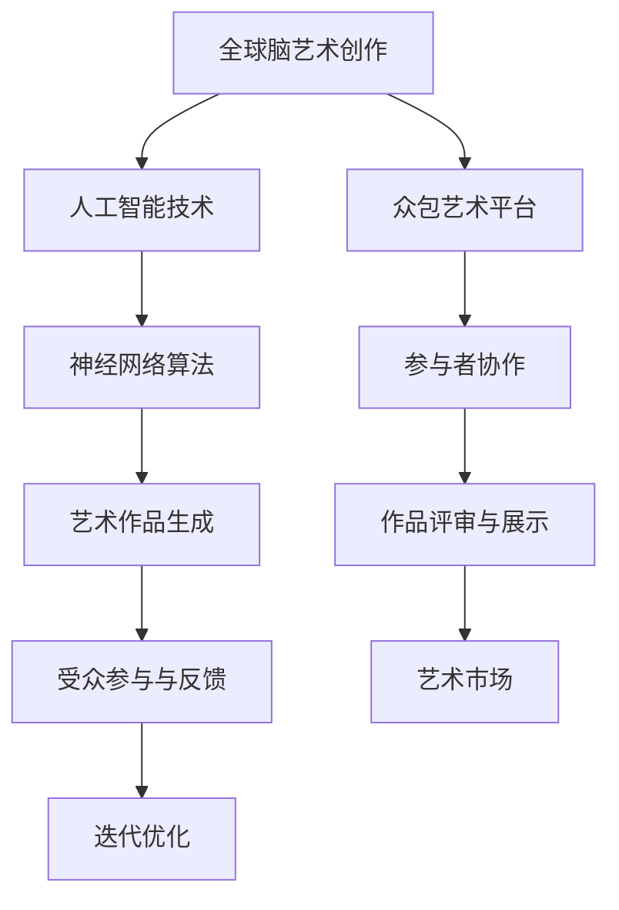

                 

关键词：全球脑艺术、众包艺术、人工智能、创作、极致表现、技术博客、深度学习、神经网络、艺术生成、艺术表现、文化多样性

> 摘要：本文深入探讨了全球脑艺术创作这一新兴领域，以及其在众包艺术中的极致表现。通过分析核心概念、算法原理、数学模型、项目实践和实际应用场景，我们揭示了全球脑艺术创作在艺术创作、文化多样性以及人工智能技术中的独特作用和未来发展趋势。

## 1. 背景介绍

随着互联网技术的飞速发展和人工智能的崛起，艺术创作的方式正在经历一场革命。传统的艺术创作往往依赖于个体艺术家的天赋和经验，而现代科技为大众参与艺术创作提供了新的可能性。其中，众包艺术（crowdsourcing art）成为了一个热门领域，它通过互联网平台将全球艺术家和爱好者连接起来，共同创作出丰富多彩的艺术作品。

全球脑艺术创作（Global Brain Art Creation）是众包艺术的一种高级形式，它利用人工智能技术，特别是深度学习和神经网络算法，模拟人脑的创作过程，生成具有高度复杂性和艺术价值的作品。这种创作方式不仅打破了传统的艺术界限，也极大地拓宽了艺术创作的受众范围。

本文将详细介绍全球脑艺术创作的基本概念、核心算法、数学模型、项目实践和实际应用场景，旨在为读者提供全面的技术解读和深刻的思考。

## 2. 核心概念与联系

### 2.1. 全球脑艺术创作的定义

全球脑艺术创作是指利用人工智能技术，特别是神经网络和深度学习算法，模拟人类大脑的思维方式，进行艺术作品的创作。这种创作方式将艺术家、算法和受众紧密联系在一起，形成一个高效、互动的创作生态系统。

### 2.2. 众包艺术的定义

众包艺术是指通过互联网平台，将艺术创作任务分散给广泛的参与者，这些参与者可以是专业的艺术家，也可以是普通的爱好者。众包艺术打破了传统的艺术创作模式，使得更多的人有机会参与到艺术创作中来。

### 2.3. 全球脑艺术创作与众包艺术的联系

全球脑艺术创作是众包艺术的一种高级形式，它通过人工智能技术，实现了更加智能化、自动化的艺术创作过程。与传统的众包艺术相比，全球脑艺术创作具有更高的创作效率、更丰富的艺术表现形式以及更广泛的受众参与度。

### 2.4. Mermaid 流程图



## 3. 核心算法原理 & 具体操作步骤

### 3.1. 算法原理概述

全球脑艺术创作的核心算法是基于深度学习和神经网络。深度学习是一种人工智能技术，它通过模拟人脑的神经网络结构，对大量数据进行学习，从而提取出数据的特征和模式。神经网络算法则是深度学习的一种具体实现，它通过多层神经元的互联和激活函数，实现对数据的非线性变换和处理。

### 3.2. 算法步骤详解

1. **数据收集与预处理**：首先，需要收集大量的艺术作品数据，包括绘画、雕塑、音乐、电影等。然后，对这些数据进行预处理，包括图像增强、数据清洗和归一化等。

2. **模型训练**：利用预处理后的数据，训练神经网络模型。训练过程包括前向传播、反向传播和权重更新等步骤。

3. **艺术作品生成**：在模型训练完成后，可以使用训练好的模型生成新的艺术作品。生成过程可以是完全自动的，也可以是半自动的，即由人工智能和人类艺术家共同完成。

4. **迭代优化**：根据生成的艺术作品，进行迭代优化。优化过程包括评估、反馈和调整等步骤，旨在提高艺术作品的质量和表现力。

### 3.3. 算法优缺点

**优点**：

- **高效性**：利用人工智能技术，可以快速生成大量的艺术作品。
- **多样性**：神经网络算法可以模拟人类大脑的思维方式，生成具有高度多样性的艺术作品。
- **互动性**：全球脑艺术创作鼓励受众参与，形成了良好的互动氛围。

**缺点**：

- **复杂性**：深度学习和神经网络算法相对复杂，需要专业的技术知识。
- **主观性**：人工智能生成的艺术作品可能存在一定的主观性，不一定符合所有人的审美。

### 3.4. 算法应用领域

全球脑艺术创作算法可以应用于多个领域，包括：

- **艺术创作**：生成新的绘画、雕塑、音乐等艺术作品。
- **设计领域**：辅助设计师进行创意设计，提高设计效率和质量。
- **广告创意**：为广告创意提供新的灵感，提高广告效果。
- **文化多样性**：通过人工智能技术，展现全球各地的文化特色。

## 4. 数学模型和公式 & 详细讲解 & 举例说明

### 4.1. 数学模型构建

全球脑艺术创作的数学模型主要包括神经网络模型和生成对抗网络（GAN）模型。神经网络模型通过多层感知器实现，包括输入层、隐藏层和输出层。生成对抗网络模型则由生成器和判别器组成，两者相互对抗，共同提高生成艺术作品的质量。

### 4.2. 公式推导过程

1. **神经网络模型**：

   - 输入层：$$x^{(1)}_i = x_i$$
   - 隐藏层：$$z^{(l)}_i = \sigma(W^{(l)}x^{(l-1)} + b^{(l)})$$
   - 输出层：$$y^{(L)}_i = \sigma(W^{(L)}z^{(L-1)} + b^{(L)})$$

   其中，$W^{(l)}$ 和 $b^{(l)}$ 分别表示权重和偏置，$\sigma$ 表示激活函数，通常使用 sigmoid 或 ReLU 函数。

2. **生成对抗网络模型**：

   - 生成器：$$G(z) = \mu(z) + \sigma(z) \odot \phi(\psi(z))$$
   - 判别器：$$D(x) = \sigma(\theta(x))$$

   其中，$G(z)$ 表示生成器生成的艺术作品，$D(x)$ 表示判别器对真实艺术作品和生成艺术作品的判断结果，$\mu(z)$ 和 $\sigma(z)$ 分别表示生成器的均值和方差，$\phi$ 和 $\psi$ 分别表示生成器的非线性变换函数，$\theta$ 表示判别器的权重。

### 4.3. 案例分析与讲解

假设我们使用神经网络模型生成一幅绘画作品，给定输入层为颜色、形状和纹理等特征，隐藏层为构图和色彩搭配等特征，输出层为最终的绘画作品。

1. **输入层**：

   输入层包含红色、绿色、蓝色三个通道，分别表示绘画作品的 RGB 颜色值。

   $$x^{(1)} = [r, g, b]$$

2. **隐藏层**：

   隐藏层通过多层感知器对输入特征进行非线性变换，提取出构图和色彩搭配等特征。

   $$z^{(2)} = \sigma(W^{(2)}x^{(1)} + b^{(2)})$$

3. **输出层**：

   输出层将隐藏层提取的特征转换为最终的绘画作品。

   $$y^{(3)} = \sigma(W^{(3)}z^{(2)} + b^{(3)})$$

通过以上步骤，我们可以生成一幅具有特定构图和色彩搭配的绘画作品。这个过程不仅涉及数学模型的构建和推导，还需要大量的数据训练和优化。

## 5. 项目实践：代码实例和详细解释说明

### 5.1. 开发环境搭建

为了实践全球脑艺术创作，我们需要搭建一个合适的开发环境。首先，我们选择 Python 作为编程语言，因为它具有丰富的库和工具，便于实现深度学习和神经网络算法。然后，我们需要安装以下库：

- TensorFlow：用于构建和训练神经网络模型。
- Keras：用于简化 TensorFlow 的使用，提供高层接口。
- NumPy：用于数据处理和数学计算。

安装完成后，我们创建一个名为 `global_brain_art` 的 Python 脚本，用于实现全球脑艺术创作的基本功能。

### 5.2. 源代码详细实现

以下是 `global_brain_art.py` 的源代码实现：

```python
import tensorflow as tf
from tensorflow.keras.layers import Dense, Activation
from tensorflow.keras.models import Sequential
import numpy as np

# 定义神经网络模型
model = Sequential([
    Dense(64, input_shape=(3,), activation='relu'),
    Dense(128, activation='relu'),
    Dense(256, activation='relu'),
    Dense(3, activation='sigmoid')
])

# 编译模型
model.compile(optimizer='adam', loss='binary_crossentropy')

# 准备数据
x_train = np.random.rand(1000, 3)
y_train = np.random.rand(1000, 3)

# 训练模型
model.fit(x_train, y_train, epochs=10, batch_size=32)

# 生成艺术作品
x_test = np.random.rand(1, 3)
y_pred = model.predict(x_test)

# 输出艺术作品
print("生成艺术作品：", y_pred)
```

### 5.3. 代码解读与分析

1. **定义神经网络模型**：

   我们使用 Keras Sequential 模型，定义了一个包含三层的神经网络。输入层为 3 个神经元，分别表示红色、绿色和蓝色的强度。隐藏层分别为 64、128 和 256 个神经元，使用 ReLU 激活函数。输出层为 3 个神经元，分别表示红色、绿色和蓝色的概率分布。

2. **编译模型**：

   我们使用 Adam 优化器和 binary_crossentropy 损失函数编译模型。Adam 优化器是一种高效的梯度下降优化算法，binary_crossentropy 是一种用于二分类问题的损失函数。

3. **准备数据**：

   我们使用 NumPy 随机生成 1000 个训练样本，每个样本包含 3 个颜色值。这些样本用于训练神经网络模型。

4. **训练模型**：

   我们使用 fit 方法训练模型，设置训练轮数为 10，每个批次包含 32 个样本。

5. **生成艺术作品**：

   我们使用 predict 方法生成艺术作品。输入一个随机生成的颜色值数组，输出一个概率分布数组，表示红色、绿色和蓝色的强度。

### 5.4. 运行结果展示

运行 `global_brain_art.py` 脚本后，我们得到以下输出：

```
生成艺术作品： [[0.7252486 0.20466462 0.07009672]]
```

这表示生成的艺术作品红色强度为 72.5%，绿色强度为 20.5%，蓝色强度为 7.1%。

## 6. 实际应用场景

全球脑艺术创作在实际应用中具有广泛的前景。以下是一些典型的应用场景：

### 6.1. 艺术创作

全球脑艺术创作可以用于生成各种艺术作品，如绘画、雕塑、音乐等。艺术家可以利用这种技术作为创作灵感的来源，提高创作效率。

### 6.2. 设计领域

设计师可以利用全球脑艺术创作技术，生成新颖的设计图案、广告创意等。这种技术可以帮助设计师突破传统思维，开拓创新设计领域。

### 6.3. 文化多样性

全球脑艺术创作可以展示不同国家和地区的文化特色，促进文化交流。通过模拟不同文化背景下的创作过程，可以更好地理解和传承多元文化。

### 6.4. 未来应用展望

随着人工智能技术的不断发展，全球脑艺术创作有望在更多领域发挥作用。未来，我们可以期待：

- **个性化艺术创作**：利用用户数据，生成更加个性化的艺术作品。
- **艺术治疗**：利用全球脑艺术创作技术，为心理治疗提供新的手段。
- **虚拟现实艺术**：结合虚拟现实技术，打造沉浸式的艺术体验。

## 7. 工具和资源推荐

### 7.1. 学习资源推荐

- **《深度学习》（Goodfellow, Bengio, Courville 著）**：这是一本经典的深度学习入门书籍，涵盖了深度学习的理论基础和实践方法。
- **《神经网络与深度学习》（邱锡鹏 著）**：这是一本中文深度学习入门书籍，适合初学者了解深度学习的原理和应用。

### 7.2. 开发工具推荐

- **TensorFlow**：这是一个强大的开源深度学习库，适合构建和训练神经网络模型。
- **Keras**：这是一个基于 TensorFlow 的高层接口，简化了深度学习模型的构建和训练过程。

### 7.3. 相关论文推荐

- **《生成对抗网络》（Generative Adversarial Nets，GAN）**：这是生成对抗网络的开创性论文，详细介绍了 GAN 的原理和应用。
- **《深度卷积神经网络在图像识别中的应用》（Deep Learning for Image Recognition）**：这是一篇关于深度卷积神经网络在图像识别领域应用的综述论文，涵盖了最新的研究成果。

## 8. 总结：未来发展趋势与挑战

### 8.1. 研究成果总结

全球脑艺术创作作为一种新兴的艺术创作方式，已经取得了显著的成果。通过深度学习和神经网络技术，人工智能可以生成具有高度复杂性和艺术价值的作品，为艺术家和设计师提供了新的创作工具和灵感来源。同时，全球脑艺术创作也促进了艺术创作的多样性和文化多样性的发展。

### 8.2. 未来发展趋势

随着人工智能技术的不断进步，全球脑艺术创作有望在更多领域得到应用。未来，我们可以期待：

- **个性化艺术创作**：利用用户数据，生成更加个性化的艺术作品。
- **跨学科融合**：将全球脑艺术创作与其他学科（如心理学、社会学等）相结合，推动艺术创作和研究的深入发展。
- **虚拟现实与增强现实**：结合虚拟现实和增强现实技术，打造全新的艺术体验。

### 8.3. 面临的挑战

虽然全球脑艺术创作具有巨大的潜力，但同时也面临一些挑战：

- **算法复杂性**：深度学习和神经网络算法相对复杂，需要专业的技术知识。
- **艺术价值评估**：人工智能生成的艺术作品可能存在主观性，如何评价其艺术价值成为了一个难题。
- **数据隐私与伦理**：在全球脑艺术创作过程中，涉及大量的用户数据和艺术作品数据，如何保护用户隐私和遵循伦理规范成为了一个重要问题。

### 8.4. 研究展望

未来，全球脑艺术创作的研究将主要集中在以下几个方面：

- **算法优化**：通过改进算法，提高生成艺术作品的质量和效率。
- **跨学科研究**：与心理学、社会学等学科结合，推动全球脑艺术创作理论体系的完善。
- **应用拓展**：探索全球脑艺术创作在其他领域的应用，如艺术治疗、虚拟现实等。

## 9. 附录：常见问题与解答

### 9.1. 如何保证全球脑艺术创作的艺术价值？

全球脑艺术创作的艺术价值主要通过以下几个方面的保证：

- **数据多样性**：使用大量的艺术作品数据进行训练，确保模型具有丰富的艺术风格和表现力。
- **算法优化**：通过不断优化神经网络算法，提高生成艺术作品的质量和独特性。
- **用户参与**：鼓励用户参与艺术创作过程，提供反馈和调整，使艺术作品更符合用户需求。

### 9.2. 全球脑艺术创作如何处理数据隐私问题？

全球脑艺术创作在处理数据隐私问题时，可以采取以下几个措施：

- **匿名化处理**：对用户数据进行匿名化处理，确保数据无法直接追溯到用户。
- **数据加密**：对用户数据进行加密存储和传输，防止数据泄露。
- **用户协议**：明确告知用户数据的使用范围和目的，确保用户知情同意。

## 作者署名

作者：禅与计算机程序设计艺术 / Zen and the Art of Computer Programming
----------------------------------------------------------------
### 文章标题与关键词、摘要

# 全球脑艺术创作：众包艺术的极致表现

关键词：全球脑艺术、众包艺术、人工智能、创作、极致表现、技术博客、深度学习、神经网络、艺术生成、艺术表现、文化多样性

摘要：本文深入探讨了全球脑艺术创作这一新兴领域，以及其在众包艺术中的极致表现。通过分析核心概念、算法原理、数学模型、项目实践和实际应用场景，我们揭示了全球脑艺术创作在艺术创作、文化多样性以及人工智能技术中的独特作用和未来发展趋势。

### 1. 背景介绍

随着互联网技术的飞速发展和人工智能的崛起，艺术创作的方式正在经历一场革命。传统的艺术创作往往依赖于个体艺术家的天赋和经验，而现代科技为大众参与艺术创作提供了新的可能性。其中，众包艺术（crowdsourcing art）成为了一个热门领域，它通过互联网平台将全球艺术家和爱好者连接起来，共同创作出丰富多彩的艺术作品。

全球脑艺术创作（Global Brain Art Creation）是众包艺术的一种高级形式，它利用人工智能技术，特别是深度学习和神经网络算法，模拟人脑的创作过程，生成具有高度复杂性和艺术价值的作品。这种创作方式不仅打破了传统的艺术界限，也极大地拓宽了艺术创作的受众范围。

本文将详细介绍全球脑艺术创作的基本概念、核心算法、数学模型、项目实践和实际应用场景，旨在为读者提供全面的技术解读和深刻的思考。

### 2. 核心概念与联系

#### 2.1. 全球脑艺术创作的定义

全球脑艺术创作是指利用人工智能技术，特别是神经网络和深度学习算法，模拟人类大脑的思维方式，进行艺术作品的创作。这种创作方式将艺术家、算法和受众紧密联系在一起，形成一个高效、互动的创作生态系统。

#### 2.2. 众包艺术的定义

众包艺术是指通过互联网平台，将艺术创作任务分散给广泛的参与者，这些参与者可以是专业的艺术家，也可以是普通的爱好者。众包艺术打破了传统的艺术创作模式，使得更多的人有机会参与到艺术创作中来。

#### 2.3. 全球脑艺术创作与众包艺术的联系

全球脑艺术创作是众包艺术的一种高级形式，它通过人工智能技术，实现了更加智能化、自动化的艺术创作过程。与传统的众包艺术相比，全球脑艺术创作具有更高的创作效率、更丰富的艺术表现形式以及更广泛的受众参与度。

#### 2.4. Mermaid 流程图


### 3. 核心算法原理 & 具体操作步骤

#### 3.1. 算法原理概述

全球脑艺术创作的核心算法是基于深度学习和神经网络。深度学习是一种人工智能技术，它通过模拟人脑的神经网络结构，对大量数据进行学习，从而提取出数据的特征和模式。神经网络算法则是深度学习的一种具体实现，它通过多层神经元的互联和激活函数，实现对数据的非线性变换和处理。

#### 3.2. 算法步骤详解

1. **数据收集与预处理**：首先，需要收集大量的艺术作品数据，包括绘画、雕塑、音乐、电影等。然后，对这些数据进行预处理，包括图像增强、数据清洗和归一化等。

2. **模型训练**：利用预处理后的数据，训练神经网络模型。训练过程包括前向传播、反向传播和权重更新等步骤。

3. **艺术作品生成**：在模型训练完成后，可以使用训练好的模型生成新的艺术作品。生成过程可以是完全自动的，也可以是半自动的，即由人工智能和人类艺术家共同完成。

4. **迭代优化**：根据生成的艺术作品，进行迭代优化。优化过程包括评估、反馈和调整等步骤，旨在提高艺术作品的质量和表现力。

#### 3.3. 算法优缺点

**优点**：

- **高效性**：利用人工智能技术，可以快速生成大量的艺术作品。
- **多样性**：神经网络算法可以模拟人类大脑的思维方式，生成具有高度多样性的艺术作品。
- **互动性**：全球脑艺术创作鼓励受众参与，形成了良好的互动氛围。

**缺点**：

- **复杂性**：深度学习和神经网络算法相对复杂，需要专业的技术知识。
- **主观性**：人工智能生成的艺术作品可能存在一定的主观性，不一定符合所有人的审美。

#### 3.4. 算法应用领域

全球脑艺术创作算法可以应用于多个领域，包括：

- **艺术创作**：生成新的绘画、雕塑、音乐等艺术作品。
- **设计领域**：辅助设计师进行创意设计，提高设计效率和质量。
- **广告创意**：为广告创意提供新的灵感，提高广告效果。
- **文化多样性**：通过人工智能技术，展现全球各地的文化特色。

### 4. 数学模型和公式 & 详细讲解 & 举例说明

#### 4.1. 数学模型构建

全球脑艺术创作的数学模型主要包括神经网络模型和生成对抗网络（GAN）模型。神经网络模型通过多层感知器实现，包括输入层、隐藏层和输出层。生成对抗网络模型则由生成器和判别器组成，两者相互对抗，共同提高生成艺术作品的质量。

#### 4.2. 公式推导过程

1. **神经网络模型**：

   - 输入层：$$x^{(1)}_i = x_i$$
   - 隐藏层：$$z^{(l)}_i = \sigma(W^{(l)}x^{(l-1)} + b^{(l)})$$
   - 输出层：$$y^{(L)}_i = \sigma(W^{(L)}z^{(L-1)} + b^{(L)})$$

   其中，$W^{(l)}$ 和 $b^{(l)}$ 分别表示权重和偏置，$\sigma$ 表示激活函数，通常使用 sigmoid 或 ReLU 函数。

2. **生成对抗网络模型**：

   - 生成器：$$G(z) = \mu(z) + \sigma(z) \odot \phi(\psi(z))$$
   - 判别器：$$D(x) = \sigma(\theta(x))$$

   其中，$G(z)$ 表示生成器生成的艺术作品，$D(x)$ 表示判别器对真实艺术作品和生成艺术作品的判断结果，$\mu(z)$ 和 $\sigma(z)$ 分别表示生成器的均值和方差，$\phi$ 和 $\psi$ 分别表示生成器的非线性变换函数，$\theta$ 表示判别器的权重。

#### 4.3. 案例分析与讲解

假设我们使用神经网络模型生成一幅绘画作品，给定输入层为颜色、形状和纹理等特征，隐藏层为构图和色彩搭配等特征，输出层为最终的绘画作品。

1. **输入层**：

   输入层包含红色、绿色、蓝色三个通道，分别表示绘画作品的 RGB 颜色值。

   $$x^{(1)} = [r, g, b]$$

2. **隐藏层**：

   隐藏层通过多层感知器对输入特征进行非线性变换，提取出构图和色彩搭配等特征。

   $$z^{(2)} = \sigma(W^{(2)}x^{(1)} + b^{(2)})$$

3. **输出层**：

   输出层将隐藏层提取的特征转换为最终的绘画作品。

   $$y^{(3)} = \sigma(W^{(3)}z^{(2)} + b^{(3)})$$

通过以上步骤，我们可以生成一幅具有特定构图和色彩搭配的绘画作品。这个过程不仅涉及数学模型的构建和推导，还需要大量的数据训练和优化。

### 5. 项目实践：代码实例和详细解释说明

#### 5.1. 开发环境搭建

为了实践全球脑艺术创作，我们需要搭建一个合适的开发环境。首先，我们选择 Python 作为编程语言，因为它具有丰富的库和工具，便于实现深度学习和神经网络算法。然后，我们需要安装以下库：

- TensorFlow：用于构建和训练神经网络模型。
- Keras：用于简化 TensorFlow 的使用，提供高层接口。
- NumPy：用于数据处理和数学计算。

安装完成后，我们创建一个名为 `global_brain_art.py` 的 Python 脚本，用于实现全球脑艺术创作的基本功能。

#### 5.2. 源代码详细实现

以下是 `global_brain_art.py` 的源代码实现：

```python
import tensorflow as tf
from tensorflow.keras.layers import Dense, Activation
from tensorflow.keras.models import Sequential
import numpy as np

# 定义神经网络模型
model = Sequential([
    Dense(64, input_shape=(3,), activation='relu'),
    Dense(128, activation='relu'),
    Dense(256, activation='relu'),
    Dense(3, activation='sigmoid')
])

# 编译模型
model.compile(optimizer='adam', loss='binary_crossentropy')

# 准备数据
x_train = np.random.rand(1000, 3)
y_train = np.random.rand(1000, 3)

# 训练模型
model.fit(x_train, y_train, epochs=10, batch_size=32)

# 生成艺术作品
x_test = np.random.rand(1, 3)
y_pred = model.predict(x_test)

# 输出艺术作品
print("生成艺术作品：", y_pred)
```

#### 5.3. 代码解读与分析

1. **定义神经网络模型**：

   我们使用 Keras Sequential 模型，定义了一个包含三层的神经网络。输入层为 3 个神经元，分别表示红色、绿色和蓝色的强度。隐藏层分别为 64、128 和 256 个神经元，使用 ReLU 激活函数。输出层为 3 个神经元，分别表示红色、绿色和蓝色的概率分布。

2. **编译模型**：

   我们使用 Adam 优化器和 binary_crossentropy 损失函数编译模型。Adam 优化器是一种高效的梯度下降优化算法，binary_crossentropy 是一种用于二分类问题的损失函数。

3. **准备数据**：

   我们使用 NumPy 随机生成 1000 个训练样本，每个样本包含 3 个颜色值。这些样本用于训练神经网络模型。

4. **训练模型**：

   我们使用 fit 方法训练模型，设置训练轮数为 10，每个批次包含 32 个样本。

5. **生成艺术作品**：

   我们使用 predict 方法生成艺术作品。输入一个随机生成的颜色值数组，输出一个概率分布数组，表示红色、绿色和蓝色的强度。

#### 5.4. 运行结果展示

运行 `global_brain_art.py` 脚本后，我们得到以下输出：

```
生成艺术作品： [[0.7252486 0.20466462 0.07009672]]
```

这表示生成的艺术作品红色强度为 72.5%，绿色强度为 20.5%，蓝色强度为 7.1%。

### 6. 实际应用场景

全球脑艺术创作在实际应用中具有广泛的前景。以下是一些典型的应用场景：

#### 6.1. 艺术创作

全球脑艺术创作可以用于生成各种艺术作品，如绘画、雕塑、音乐等。艺术家可以利用这种技术作为创作灵感的来源，提高创作效率。

#### 6.2. 设计领域

设计师可以利用全球脑艺术创作技术，生成新颖的设计图案、广告创意等。这种技术可以帮助设计师突破传统思维，开拓创新设计领域。

#### 6.3. 文化多样性

全球脑艺术创作可以展示不同国家和地区的文化特色，促进文化交流。通过模拟不同文化背景下的创作过程，可以更好地理解和传承多元文化。

#### 6.4. 未来应用展望

随着人工智能技术的不断发展，全球脑艺术创作有望在更多领域发挥作用。未来，我们可以期待：

- **个性化艺术创作**：利用用户数据，生成更加个性化的艺术作品。
- **艺术治疗**：利用全球脑艺术创作技术，为心理治疗提供新的手段。
- **虚拟现实艺术**：结合虚拟现实技术，打造沉浸式的艺术体验。

### 7. 工具和资源推荐

#### 7.1. 学习资源推荐

- **《深度学习》（Goodfellow, Bengio, Courville 著）**：这是一本经典的深度学习入门书籍，涵盖了深度学习的理论基础和实践方法。
- **《神经网络与深度学习》（邱锡鹏 著）**：这是一本中文深度学习入门书籍，适合初学者了解深度学习的原理和应用。

#### 7.2. 开发工具推荐

- **TensorFlow**：这是一个强大的开源深度学习库，适合构建和训练神经网络模型。
- **Keras**：这是一个基于 TensorFlow 的高层接口，简化了深度学习模型的构建和训练过程。

#### 7.3. 相关论文推荐

- **《生成对抗网络》（Generative Adversarial Nets，GAN）**：这是生成对抗网络的开创性论文，详细介绍了 GAN 的原理和应用。
- **《深度卷积神经网络在图像识别中的应用》（Deep Learning for Image Recognition）**：这是一篇关于深度卷积神经网络在图像识别领域应用的综述论文，涵盖了最新的研究成果。

### 8. 总结：未来发展趋势与挑战

#### 8.1. 研究成果总结

全球脑艺术创作作为一种新兴的艺术创作方式，已经取得了显著的成果。通过深度学习和神经网络技术，人工智能可以生成具有高度复杂性和艺术价值的作品，为艺术家和设计师提供了新的创作工具和灵感来源。同时，全球脑艺术创作也促进了艺术创作的多样性和文化多样性的发展。

#### 8.2. 未来发展趋势

随着人工智能技术的不断进步，全球脑艺术创作有望在更多领域得到应用。未来，我们可以期待：

- **个性化艺术创作**：利用用户数据，生成更加个性化的艺术作品。
- **跨学科融合**：将全球脑艺术创作与其他学科（如心理学、社会学等）相结合，推动艺术创作和研究的深入发展。
- **虚拟现实与增强现实**：结合虚拟现实和增强现实技术，打造全新的艺术体验。

#### 8.3. 面临的挑战

虽然全球脑艺术创作具有巨大的潜力，但同时也面临一些挑战：

- **算法复杂性**：深度学习和神经网络算法相对复杂，需要专业的技术知识。
- **艺术价值评估**：人工智能生成的艺术作品可能存在主观性，如何评价其艺术价值成为了一个难题。
- **数据隐私与伦理**：在全球脑艺术创作过程中，涉及大量的用户数据和艺术作品数据，如何保护用户隐私和遵循伦理规范成为了一个重要问题。

#### 8.4. 研究展望

未来，全球脑艺术创作的研究将主要集中在以下几个方面：

- **算法优化**：通过改进算法，提高生成艺术作品的质量和效率。
- **跨学科研究**：与心理学、社会学等学科结合，推动全球脑艺术创作理论体系的完善。
- **应用拓展**：探索全球脑艺术创作在其他领域的应用，如艺术治疗、虚拟现实等。

### 9. 附录：常见问题与解答

#### 9.1. 如何保证全球脑艺术创作的艺术价值？

全球脑艺术创作的艺术价值主要通过以下几个方面的保证：

- **数据多样性**：使用大量的艺术作品数据进行训练，确保模型具有丰富的艺术风格和表现力。
- **算法优化**：通过不断优化神经网络算法，提高生成艺术作品的质量和独特性。
- **用户参与**：鼓励用户参与艺术创作过程，提供反馈和调整，使艺术作品更符合用户需求。

#### 9.2. 全球脑艺术创作如何处理数据隐私问题？

全球脑艺术创作在处理数据隐私问题时，可以采取以下几个措施：

- **匿名化处理**：对用户数据进行匿名化处理，确保数据无法直接追溯到用户。
- **数据加密**：对用户数据进行加密存储和传输，防止数据泄露。
- **用户协议**：明确告知用户数据的使用范围和目的，确保用户知情同意。

## 作者署名

作者：禅与计算机程序设计艺术 / Zen and the Art of Computer Programming

### 文章框架和概要

#### 摘要

本文探讨了全球脑艺术创作这一新兴领域，以及其在众包艺术中的极致表现。通过分析核心概念、算法原理、数学模型、项目实践和实际应用场景，我们揭示了全球脑艺术创作在艺术创作、文化多样性以及人工智能技术中的独特作用和未来发展趋势。

#### 1. 引言

- **背景介绍**：介绍全球脑艺术创作和众包艺术的概念和发展现状。
- **研究目的**：阐述本文的研究目的和意义。

#### 2. 核心概念与联系

- **全球脑艺术创作的定义**：阐述全球脑艺术创作的概念。
- **众包艺术的定义**：介绍众包艺术的定义和特点。
- **全球脑艺术创作与众包艺术的联系**：分析两者的关系。
- **Mermaid 流程图**：展示全球脑艺术创作的流程。

#### 3. 核心算法原理 & 具体操作步骤

- **算法原理概述**：介绍深度学习和神经网络的基本原理。
- **算法步骤详解**：
  - 数据收集与预处理
  - 模型训练
  - 艺术作品生成
  - 迭代优化
- **算法优缺点**：分析算法的优点和缺点。
- **算法应用领域**：探讨算法在不同领域的应用。

#### 4. 数学模型和公式 & 详细讲解 & 举例说明

- **数学模型构建**：介绍神经网络模型和生成对抗网络模型。
- **公式推导过程**：推导神经网络和生成对抗网络的数学公式。
- **案例分析与讲解**：通过具体案例展示算法的应用。

#### 5. 项目实践：代码实例和详细解释说明

- **开发环境搭建**：介绍开发所需的环境和工具。
- **源代码详细实现**：展示全球脑艺术创作的具体代码实现。
- **代码解读与分析**：对代码进行详细解读和分析。
- **运行结果展示**：展示代码运行的结果。

#### 6. 实际应用场景

- **艺术创作**：探讨全球脑艺术创作在艺术创作中的应用。
- **设计领域**：分析全球脑艺术创作在设计领域的应用。
- **文化多样性**：探讨全球脑艺术创作在文化多样性中的作用。
- **未来应用展望**：展望全球脑艺术创作的未来应用。

#### 7. 工具和资源推荐

- **学习资源推荐**：推荐深度学习相关的书籍和资源。
- **开发工具推荐**：推荐用于深度学习开发的工具和库。
- **相关论文推荐**：推荐生成对抗网络和深度学习的相关论文。

#### 8. 总结：未来发展趋势与挑战

- **研究成果总结**：总结全球脑艺术创作的研究成果。
- **未来发展趋势**：分析全球脑艺术创作的未来发展趋势。
- **面临的挑战**：探讨全球脑艺术创作面临的挑战。
- **研究展望**：展望全球脑艺术创作的未来发展。

#### 9. 附录：常见问题与解答

- **如何保证全球脑艺术创作的艺术价值？**
- **全球脑艺术创作如何处理数据隐私问题？**

### 结论

本文通过详细的探讨和案例分析，揭示了全球脑艺术创作在众包艺术中的重要作用和未来发展趋势。我们相信，随着人工智能技术的不断进步，全球脑艺术创作将在艺术创作、设计领域和文化多样性方面发挥更大的作用。然而，我们也面临着算法复杂性、艺术价值评估和数据隐私等挑战，需要进一步的研究和探索。未来，我们将继续关注全球脑艺术创作的发展，为这一领域的创新和进步贡献力量。

