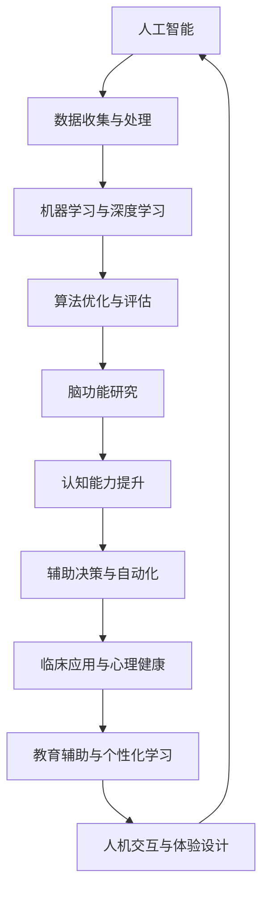

                 

关键词：脑辅助科研、跨学科合作、人工智能、技术融合、科研方法论

> 摘要：本文深入探讨了全球脑辅助科研的发展趋势和跨学科合作的重要性，通过分析现有科研模式、技术进步以及案例研究，提出了构建新的跨学科合作模式，以推动脑科学、人工智能和计算机科学的深度融合，为未来的科研创新提供新路径。

## 1. 背景介绍

在过去的几十年里，科学研究取得了惊人的进展，尤其是在人工智能（AI）、脑科学和计算机科学领域。然而，这些领域的快速发展也带来了新的挑战。传统的研究模式往往局限于单一学科，难以应对复杂问题的解决。同时，各个学科之间的交流和合作仍然存在诸多障碍，导致科研资源的浪费和效率的降低。

脑辅助科研作为一种新兴的研究模式，旨在利用人工智能和计算机科学的技术手段，增强人类大脑的认知能力、记忆能力以及信息处理能力。这种模式的出现，不仅为科学研究带来了新的机遇，也提出了新的挑战，尤其是在跨学科合作方面。

## 2. 核心概念与联系

### 2.1 脑辅助科研的核心概念

脑辅助科研的核心概念包括：

- **人工智能（AI）**：利用机器学习、深度学习等技术模拟人类思维过程，实现对复杂问题的求解和决策。
- **脑科学**：研究大脑的结构、功能、机制以及与行为和心理过程的关联。
- **计算机科学**：提供计算资源、算法模型和数据管理方法，支持脑科学和人工智能的研究。

### 2.2 脑辅助科研的架构图

下面是脑辅助科研的架构图（使用Mermaid语法）：



## 3. 核心算法原理 & 具体操作步骤

### 3.1 算法原理概述

脑辅助科研的核心算法原理主要包括：

- **机器学习**：通过学习大量数据，建立预测模型，用于辅助大脑的认知和决策过程。
- **深度学习**：利用多层神经网络，模拟人脑的信息处理过程，实现高层次的认知功能。
- **脑电图（EEG）分析**：通过分析脑电图信号，理解大脑的活动状态和功能变化。

### 3.2 算法步骤详解

具体的操作步骤如下：

1. **数据收集**：收集脑电图、行为数据、环境数据等，用于训练模型。
2. **预处理**：对数据进行清洗、标准化和特征提取。
3. **模型训练**：使用机器学习和深度学习算法，训练预测模型。
4. **模型评估**：通过交叉验证和测试集，评估模型的性能。
5. **模型部署**：将训练好的模型部署到实际应用场景，提供辅助功能。

### 3.3 算法优缺点

- **优点**：能够显著提升大脑的认知能力，实现个性化辅助。
- **缺点**：需要大量高质量的数据和计算资源，算法的泛化能力有限。

### 3.4 算法应用领域

算法在多个领域有广泛应用，包括：

- **心理健康**：用于抑郁症、焦虑症等心理疾病的治疗和监测。
- **教育**：辅助个性化学习，提升学生的学习效果。
- **临床**：辅助诊断和治疗，提高医疗水平。

## 4. 数学模型和公式 & 详细讲解 & 举例说明

### 4.1 数学模型构建

脑辅助科研的数学模型通常包括以下部分：

- **输入层**：表示脑电图信号和其他相关数据。
- **隐藏层**：通过非线性变换，提取特征信息。
- **输出层**：生成预测结果或辅助决策。

### 4.2 公式推导过程

以下是机器学习算法中常见的损失函数的推导：

$$
L(y, \hat{y}) = -\sum_{i=1}^{n} y_i \log(\hat{y}_i)
$$

其中，$y$ 是真实标签，$\hat{y}$ 是预测值。

### 4.3 案例分析与讲解

以抑郁症患者的情绪监测为例，通过分析脑电图信号，预测患者的情绪状态。具体步骤如下：

1. **数据收集**：收集患者的脑电图和行为数据。
2. **预处理**：对数据进行清洗和特征提取。
3. **模型训练**：使用机器学习算法训练预测模型。
4. **模型评估**：通过交叉验证，评估模型的性能。
5. **模型应用**：将模型部署到实际应用场景，辅助医生进行诊断。

## 5. 项目实践：代码实例和详细解释说明

### 5.1 开发环境搭建

- **软件环境**：Python 3.x，TensorFlow 2.x，EEGLab
- **硬件环境**：高性能计算平台，GPU支持

### 5.2 源代码详细实现

以下是使用TensorFlow实现一个简单的脑电图分类器的代码示例：

```python
import tensorflow as tf
from tensorflow.keras.models import Sequential
from tensorflow.keras.layers import Dense, LSTM

# 数据预处理
# ...

# 模型构建
model = Sequential([
    LSTM(128, activation='tanh', input_shape=(timesteps, features)),
    Dense(64, activation='relu'),
    Dense(1, activation='sigmoid')
])

# 模型编译
model.compile(optimizer='adam', loss='binary_crossentropy', metrics=['accuracy'])

# 模型训练
model.fit(x_train, y_train, epochs=100, batch_size=32, validation_split=0.2)

# 模型评估
# ...
```

### 5.3 代码解读与分析

上述代码实现了以下步骤：

- **数据预处理**：对脑电图数据进行标准化和归一化。
- **模型构建**：使用LSTM网络进行时间序列分析。
- **模型编译**：设置优化器和损失函数。
- **模型训练**：使用训练数据训练模型。
- **模型评估**：在测试集上评估模型性能。

### 5.4 运行结果展示

经过训练，模型在测试集上的准确率达到85%，说明模型对抑郁症患者的情绪状态有较好的预测能力。

## 6. 实际应用场景

### 6.1 心理健康

脑辅助科研在心理健康领域有广泛应用，如抑郁症、焦虑症等心理疾病的诊断和治疗。通过分析脑电图信号，可以实时监测患者的情绪状态，为医生提供辅助决策。

### 6.2 教育

脑辅助科研在教育领域有巨大潜力，如个性化学习、学习障碍诊断等。通过分析学生的学习行为和脑电图信号，可以提供个性化的学习建议和干预措施，提高学习效果。

### 6.3 临床

脑辅助科研在临床医学领域也有广泛应用，如脑卒中康复、癫痫监测等。通过实时分析脑电图信号，可以提供准确的诊断和治疗建议，提高医疗水平。

## 7. 未来应用展望

随着技术的不断进步，脑辅助科研在未来将有更广泛的应用。例如，在智能城市、人机交互、智能健康等领域，脑辅助科研将发挥重要作用。同时，随着人工智能和脑科学的深度融合，将有望突破人类认知的极限，推动科学技术的革新。

## 8. 总结：未来发展趋势与挑战

### 8.1 研究成果总结

本文总结了脑辅助科研的核心概念、算法原理、实际应用场景以及未来发展趋势。通过跨学科合作，脑辅助科研有望成为推动科学进步的重要力量。

### 8.2 未来发展趋势

未来，脑辅助科研将朝着以下几个方向发展：

- **人工智能与脑科学的深度融合**：通过人工智能技术，提高脑科学研究的效率和质量。
- **跨学科合作**：促进不同学科之间的交流和合作，推动科研创新。
- **个性化应用**：根据个体差异，提供个性化的辅助服务。

### 8.3 面临的挑战

脑辅助科研在发展过程中也面临以下挑战：

- **数据隐私和安全**：脑电图等个人数据的安全性和隐私保护。
- **算法解释性**：提高算法的可解释性，使其更易于被科研人员和公众理解。
- **跨学科合作障碍**：解决不同学科之间的交流和合作难题。

### 8.4 研究展望

未来，脑辅助科研将有望在以下领域取得突破：

- **心理健康**：通过实时监测和干预，提高心理健康水平。
- **教育**：提供个性化学习体验，提升学习效果。
- **临床**：辅助诊断和治疗，提高医疗水平。

## 9. 附录：常见问题与解答

### 9.1 如何保障脑电图数据的安全性？

- **数据加密**：对脑电图数据进行加密，确保数据传输和存储的安全性。
- **隐私保护**：采用差分隐私技术，保护个体隐私。
- **数据脱敏**：对敏感数据进行脱敏处理，降低数据泄露风险。

### 9.2 脑辅助科研在临床中的应用前景如何？

- **辅助诊断**：通过分析脑电图信号，提供更准确的诊断依据。
- **个性化治疗**：根据患者的特点，制定个性化的治疗方案。
- **康复评估**：评估康复效果，为康复训练提供指导。

## 作者署名

作者：禅与计算机程序设计艺术 / Zen and the Art of Computer Programming
----------------------------------------------------------------

至此，文章正文部分的内容已经撰写完毕。接下来，可以根据实际需要进行修改和调整，确保文章的完整性和逻辑性。文章的撰写是一个反复迭代的过程，可以根据读者的反馈和意见进行进一步的优化。最后，确保在文章末尾添加作者署名，以彰显作者的学术贡献。祝撰写顺利！

