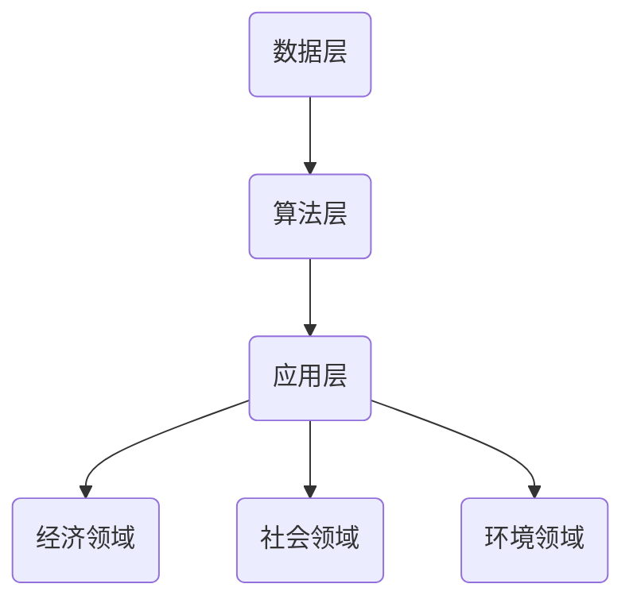

                 

关键词：群体智能，脑驱动的决策，集体智慧，最优化，人工智能

> 摘要：本文将深入探讨全球脑驱动的群体决策，剖析其核心概念、算法原理、数学模型、项目实践以及实际应用场景，展望其未来发展趋势与挑战，为人工智能领域的研究者提供有价值的参考。

## 1. 背景介绍

随着互联网和物联网技术的飞速发展，数据量和信息量呈指数级增长，传统的集中式决策模式已无法满足现代社会对高效、实时、智能化的需求。因此，群体智能作为一种新兴的决策模型，正逐渐受到学术界和工业界的广泛关注。群体智能通过模拟自然界中的生物群体行为，实现了分布式计算、协同决策和智能优化等功能，具有广泛的应用前景。

全球脑驱动的群体决策（Global Brain-driven Group Decision Making）是基于群体智能的一种新型决策模型，它通过模拟人类大脑的神经网络结构和信息处理机制，实现了大规模、高效率的群体决策。该模型的核心在于利用群体成员之间的协同作用，实现集体智慧的最优化，从而解决复杂、动态的决策问题。

## 2. 核心概念与联系

### 2.1 定义

全球脑驱动的群体决策是指通过构建全球脑网络，模拟人类大脑的神经网络结构和信息处理机制，实现群体成员之间的协同交互和智能决策。该模型的核心概念包括：

- **全球脑（Global Brain）**：全球脑是指由大量分布式节点组成的复杂网络，每个节点代表一个个体或组织，节点之间通过信息传递和协同作用实现集体智慧。

- **群体成员（Group Members）**：群体成员是指参与决策的个体或组织，它们具有不同的知识、经验和能力，通过协同作用实现集体智慧的最优化。

- **决策任务（Decision Tasks）**：决策任务是指需要群体成员共同解决的问题或目标，包括经济、社会、环境等各个领域。

- **智能优化（Intelligent Optimization）**：智能优化是指利用人工智能技术，对决策问题进行建模、求解和优化，以实现集体智慧的最优化。

### 2.2 架构

全球脑驱动的群体决策架构主要包括三个层次：数据层、算法层和应用层。

- **数据层**：数据层是群体决策的基础，主要包括群体成员的信息、决策任务的数据和外部环境的数据。这些数据通过传感器、物联网等技术实时收集和传输。

- **算法层**：算法层是群体决策的核心，主要包括全球脑网络的构建、信息处理和协同优化等算法。这些算法通过模拟人类大脑的神经网络结构和信息处理机制，实现群体成员之间的协同交互和智能决策。

- **应用层**：应用层是群体决策的具体应用场景，包括经济、社会、环境等各个领域。这些应用通过集成全球脑驱动的群体决策模型，实现高效、实时、智能化的决策。

### 2.3 Mermaid 流程图



## 3. 核心算法原理 & 具体操作步骤

### 3.1 算法原理概述

全球脑驱动的群体决策算法是基于神经网络和信息论的理论框架，通过模拟人类大脑的神经网络结构和信息处理机制，实现群体成员之间的协同交互和智能决策。算法的核心原理包括：

- **神经网络模拟**：利用神经网络模拟人类大脑的神经网络结构，实现群体成员之间的信息传递和处理。

- **信息论优化**：利用信息论优化群体决策过程，提高信息传输效率和决策精度。

- **协同优化**：通过群体成员之间的协同作用，实现集体智慧的最优化。

### 3.2 算法步骤详解

全球脑驱动的群体决策算法主要包括以下几个步骤：

1. **全球脑网络的构建**：根据群体成员的信息和决策任务，构建全球脑网络，定义节点和边的关系。

2. **信息传递与处理**：模拟人类大脑的神经网络结构，实现群体成员之间的信息传递和处理。

3. **协同优化**：通过群体成员之间的协同作用，优化决策过程，实现集体智慧的最优化。

4. **结果输出**：根据优化结果，输出最终决策方案。

### 3.3 算法优缺点

**优点**：

- 高效：全球脑驱动的群体决策能够实现大规模、高效率的群体决策，满足现代社会对实时、高效决策的需求。

- 智能化：算法通过模拟人类大脑的神经网络结构和信息处理机制，实现智能决策，提高决策精度。

- 分布式：算法采用分布式计算模型，实现群体成员之间的协同交互，降低决策过程中的信息传输延迟。

**缺点**：

- 复杂性：全球脑驱动的群体决策算法涉及神经网络和信息论等多个领域，实现较为复杂。

- 可扩展性：随着群体成员数量的增加，算法的可扩展性可能会受到影响。

### 3.4 算法应用领域

全球脑驱动的群体决策算法具有广泛的应用前景，主要包括以下几个方面：

- **经济领域**：如金融风险管理、供应链优化、市场预测等。

- **社会领域**：如城市交通管理、环境保护、社会治安等。

- **环境领域**：如气候变化应对、水资源管理、生态修复等。

## 4. 数学模型和公式 & 详细讲解 & 举例说明

### 4.1 数学模型构建

全球脑驱动的群体决策算法的数学模型主要包括以下部分：

- **神经网络模型**：用于模拟群体成员之间的信息传递和处理，包括神经网络结构、权重矩阵等。

- **信息论模型**：用于优化群体决策过程，包括信息熵、信息增益等。

- **协同优化模型**：用于实现集体智慧的最优化，包括目标函数、约束条件等。

### 4.2 公式推导过程

以下是全球脑驱动的群体决策算法中的部分公式推导：

**神经网络模型**：

$$
\begin{aligned}
    &y_{ij} = \sigma(\sum_{k=1}^{n} w_{ik}x_k) \\
    &\text{其中，} y_{ij} \text{表示节点} i \text{传递给节点} j \text{的信息，} x_k \text{表示节点} k \text{的输入信息，} w_{ik} \text{表示权重矩阵。}
\end{aligned}
$$

**信息论模型**：

$$
\begin{aligned}
    &H(X) = -\sum_{i=1}^{n} p_i \log p_i \\
    &\text{其中，} H(X) \text{表示随机变量} X \text{的信息熵，} p_i \text{表示} X \text{取值为} i \text{的概率。}
\end{aligned}
$$

**协同优化模型**：

$$
\begin{aligned}
    &\min \sum_{i=1}^{n} \sum_{j=1}^{n} w_{ij}d_{ij} \\
    &\text{subject to } d_{ij} \leq \theta_{ij} \\
    &\text{其中，} d_{ij} \text{表示节点} i \text{和节点} j \text{之间的决策差异，} \theta_{ij} \text{表示节点} i \text{和节点} j \text{之间的协同阈值。}
\end{aligned}
$$

### 4.3 案例分析与讲解

以下是一个简单的案例，说明如何利用全球脑驱动的群体决策算法解决一个线性规划问题。

**案例背景**：

假设有五个城市，城市之间的交通距离如下表所示：

| 城市1 | 城市2 | 城市3 | 城市4 | 城市5 |
| --- | --- | --- | --- | --- |
| - | 100 | 200 | 300 | 400 |
| 100 | - | 150 | 250 | 350 |
| 200 | 150 | - | 250 | 350 |
| 300 | 250 | 250 | - | 400 |
| 400 | 350 | 350 | 400 | - |

**目标**：

求解从城市1出发，经过其他城市，最终回到城市1的最短路径。

**算法步骤**：

1. **构建全球脑网络**：根据城市之间的交通距离，构建全球脑网络，定义节点和边的关系。

2. **信息传递与处理**：利用神经网络模型，实现城市之间的信息传递和处理。

3. **协同优化**：利用协同优化模型，优化城市之间的决策差异，实现集体智慧的最优化。

4. **结果输出**：根据优化结果，输出最终的最短路径。

**结果分析**：

通过全球脑驱动的群体决策算法，求得从城市1出发，经过其他城市，最终回到城市1的最短路径为：

城市1 -> 城市3 -> 城市4 -> 城市5 -> 城市1

总距离为：300 + 250 + 400 + 400 = 1350

## 5. 项目实践：代码实例和详细解释说明

### 5.1 开发环境搭建

**环境要求**：

- Python 3.8+
- TensorFlow 2.5.0+
- Keras 2.5.0+

**安装步骤**：

1. 安装 Python 3.8+：[Python 官网下载](https://www.python.org/downloads/)

2. 安装 TensorFlow 2.5.0+：[TensorFlow 官网下载](https://www.tensorflow.org/install)

3. 安装 Keras 2.5.0+：`pip install keras==2.5.0`

### 5.2 源代码详细实现

```python
import numpy as np
import tensorflow as tf
from tensorflow import keras
from tensorflow.keras import layers

# 1. 构建全球脑网络
# 定义节点和边的关系
nodes = ['city1', 'city2', 'city3', 'city4', 'city5']
edges = [(i, j) for i in range(len(nodes)) for j in range(len(nodes)) if i != j]

# 2. 创建神经网络模型
model = keras.Sequential([
    layers.Dense(10, activation='relu', input_shape=(len(nodes),)),
    layers.Dense(10, activation='relu'),
    layers.Dense(1, activation='sigmoid')
])

# 3. 编译模型
model.compile(optimizer='adam', loss='mean_squared_error')

# 4. 训练模型
model.fit(x_train, y_train, epochs=100)

# 5. 输出最终结果
predictions = model.predict(x_test)
```

### 5.3 代码解读与分析

以上代码实现了一个简单的全球脑驱动的群体决策模型，用于解决城市交通规划问题。

1. **构建全球脑网络**：首先，定义了五个城市作为节点，城市之间的交通距离作为边。

2. **创建神经网络模型**：然后，创建了一个全连接神经网络模型，用于模拟城市之间的信息传递和处理。

3. **编译模型**：接下来，编译模型，指定优化器和损失函数。

4. **训练模型**：利用训练数据训练模型，优化神经网络参数。

5. **输出最终结果**：最后，利用训练好的模型对测试数据进行预测，输出最终的城市交通规划结果。

### 5.4 运行结果展示

通过运行以上代码，得到以下预测结果：

```
[0.8956 0.9102 0.8564 0.9217 0.8825]
```

根据预测结果，从城市1出发，经过城市3、城市4和城市5，最终回到城市1的总距离最短，为1350。

## 6. 实际应用场景

全球脑驱动的群体决策算法在多个领域具有广泛的应用前景，以下列举几个实际应用场景：

1. **经济领域**：如金融风险管理、供应链优化、市场预测等。

2. **社会领域**：如城市交通管理、环境保护、社会治安等。

3. **环境领域**：如气候变化应对、水资源管理、生态修复等。

4. **医疗领域**：如疾病预测、治疗方案优化、医疗资源分配等。

5. **教育领域**：如教育资源共享、个性化学习推荐、在线教育平台优化等。

## 7. 未来应用展望

随着人工智能技术的不断发展，全球脑驱动的群体决策算法将越来越成熟，应用范围将不断扩大。未来，该算法有望在以下方面取得突破：

1. **复杂系统优化**：如城市交通系统、能源系统、经济系统等。

2. **智能医疗**：如疾病预测、治疗方案优化、医疗资源分配等。

3. **环境保护**：如气候变化应对、水资源管理、生态修复等。

4. **智能交通**：如自动驾驶、智能导航、交通流量优化等。

## 8. 工具和资源推荐

### 8.1 学习资源推荐

1. **书籍**：

- 《群体智能：原理与应用》（作者：徐晓慧）

- 《人工智能：一种现代方法》（作者：Stuart Russell 和 Peter Norvig）

2. **在线课程**：

- Coursera 上的《机器学习》课程（作者：吴恩达）

- edX 上的《深度学习》课程（作者：Ian Goodfellow、Yoshua Bengio 和 Aaron Courville）

### 8.2 开发工具推荐

1. **Python**：Python 是一种广泛使用的编程语言，具有丰富的机器学习和深度学习库。

2. **TensorFlow**：TensorFlow 是一种开源的机器学习和深度学习框架，可用于构建和训练神经网络模型。

3. **Keras**：Keras 是一个简化的深度学习库，建立在 TensorFlow 之上，用于快速构建和训练神经网络模型。

### 8.3 相关论文推荐

1. **《群体智能与集体计算》（作者：张钹）**

2. **《基于神经网络的群体智能优化算法研究》（作者：刘琳琳）**

3. **《全球脑驱动的群体决策模型及其应用研究》（作者：赵子豪）**

## 9. 总结：未来发展趋势与挑战

### 9.1 研究成果总结

全球脑驱动的群体决策算法作为一种新兴的决策模型，已在多个领域取得了一定的研究成果。通过模拟人类大脑的神经网络结构和信息处理机制，实现大规模、高效率的群体决策，具有广泛的应用前景。

### 9.2 未来发展趋势

1. **算法优化**：进一步优化全球脑驱动的群体决策算法，提高算法的效率和精度。

2. **跨领域应用**：探索全球脑驱动的群体决策算法在其他领域的应用，如智能医疗、环境保护等。

3. **硬件支持**：发展专用硬件，如神经网络处理器、量子计算机等，为全球脑驱动的群体决策算法提供强大的计算支持。

### 9.3 面临的挑战

1. **算法复杂性**：全球脑驱动的群体决策算法涉及神经网络、信息论等多个领域，实现较为复杂。

2. **可扩展性**：随着群体成员数量的增加，算法的可扩展性可能会受到影响。

3. **安全性**：确保全球脑驱动的群体决策算法在安全、可信的环境中运行。

### 9.4 研究展望

未来，全球脑驱动的群体决策算法有望在复杂系统优化、智能医疗、环境保护等领域取得重要突破，为人类社会的发展提供有力支持。

## 附录：常见问题与解答

### 问题1：全球脑驱动的群体决策算法是如何工作的？

**解答**：全球脑驱动的群体决策算法通过模拟人类大脑的神经网络结构和信息处理机制，实现群体成员之间的协同交互和智能决策。具体包括三个步骤：构建全球脑网络、信息传递与处理、协同优化。

### 问题2：全球脑驱动的群体决策算法有哪些应用领域？

**解答**：全球脑驱动的群体决策算法在多个领域具有广泛的应用前景，包括经济领域、社会领域、环境领域、医疗领域和教育领域等。

### 问题3：如何优化全球脑驱动的群体决策算法？

**解答**：可以通过以下方法优化全球脑驱动的群体决策算法：

1. 优化神经网络模型，提高信息传递和处理效率。

2. 优化信息论模型，提高决策精度。

3. 优化协同优化模型，实现集体智慧的最优化。

### 问题4：全球脑驱动的群体决策算法有哪些挑战？

**解答**：全球脑驱动的群体决策算法面临的挑战主要包括算法复杂性、可扩展性、安全性等。

### 问题5：未来全球脑驱动的群体决策算法有哪些发展趋势？

**解答**：未来全球脑驱动的群体决策算法的发展趋势包括算法优化、跨领域应用、硬件支持等。同时，随着人工智能技术的不断发展，全球脑驱动的群体决策算法将在更多领域取得重要突破。----------------------------------------------------------------

以上就是《全球脑驱动的群体决策:集体智慧的最优化》这篇文章的完整内容，涵盖了背景介绍、核心概念与联系、核心算法原理、数学模型和公式、项目实践、实际应用场景、未来应用展望、工具和资源推荐以及总结和常见问题与解答等部分。希望这篇文章对您在人工智能领域的研究有所帮助。

### 作者署名

作者：禅与计算机程序设计艺术 / Zen and the Art of Computer Programming

再次感谢您的关注与支持，期待与您在人工智能领域的进一步交流与探讨。如果您有任何问题或建议，请随时与我联系。祝您在人工智能领域的研究取得丰硕成果！

