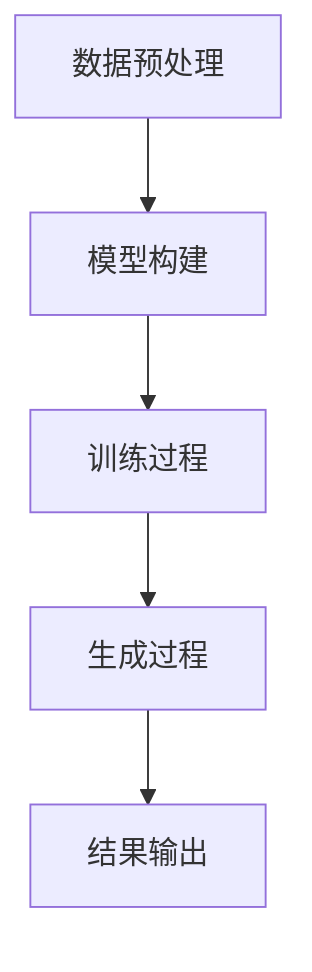

                 

关键词：全能型AI，LLM，多领域适应性，技术博客，深度学习，计算机编程

摘要：本文将探讨全能型人工智能（AI）的核心之一——大规模语言模型（LLM）在多领域的适应性。通过分析LLM的工作原理、应用场景及实际案例，我们将揭示其强大的适应能力，并展望未来AI技术发展的趋势与挑战。

## 1. 背景介绍

随着深度学习技术的快速发展，人工智能（AI）在各个领域得到了广泛应用。特别是大规模语言模型（LLM），如GPT系列、BERT等，已经成为自然语言处理（NLP）领域的核心技术。LLM通过学习海量文本数据，能够生成高质量的自然语言文本，完成各种复杂的语言任务。

然而，随着AI技术的不断进步，LLM的适应性也成为了研究者们关注的焦点。如何让LLM在更多领域发挥其潜力，实现跨领域的应用，是当前AI领域的一个重要研究方向。本文将围绕这一主题，探讨LLM在多领域的适应性。

## 2. 核心概念与联系

### 2.1 大规模语言模型（LLM）的工作原理

大规模语言模型（LLM）是一种基于神经网络的语言生成模型。它通过学习海量文本数据，学习语言的基本规律和模式，从而实现对自然语言的理解和生成。

LLM的工作原理可以分为以下几个步骤：

1. **数据预处理**：将原始文本数据进行清洗、分词、去停用词等处理，得到可用于训练的数据集。
2. **模型构建**：采用神经网络架构（如Transformer、BERT等），初始化模型参数。
3. **训练过程**：通过反向传播算法，不断调整模型参数，使模型在训练数据上的表现逐渐优化。
4. **生成过程**：在给定一个起始序列后，模型根据已学习到的语言规律，生成后续的文本序列。

### 2.2 LLM在多领域的适应性

LLM的适应性体现在其能够在不同领域应用，实现各种语言任务。具体来说，LLM在多领域的适应性包括以下几个方面：

1. **跨领域迁移学习**：通过在大规模通用数据集上训练，LLM可以迁移到特定领域，实现特定领域的任务。
2. **自适应调整**：在特定领域训练过程中，LLM可以针对特定领域的语言特征进行调整，提高模型在特定领域的性能。
3. **模块化设计**：LLM可以设计成模块化结构，不同模块针对不同领域进行优化，实现跨领域的应用。

### 2.3 Mermaid流程图

以下是一个描述LLM工作原理的Mermaid流程图：



## 3. 核心算法原理 & 具体操作步骤

### 3.1 算法原理概述

LLM的核心算法是基于Transformer架构。Transformer采用自注意力机制（Self-Attention），能够捕捉输入序列中的长距离依赖关系。通过多层的自注意力机制和前馈神经网络，模型能够学习到输入序列的内在规律，实现对自然语言的理解和生成。

### 3.2 算法步骤详解

1. **输入序列编码**：将输入的文本序列转换为向量表示，通常使用Word2Vec、BERT等预训练模型进行编码。
2. **自注意力机制**：计算输入序列中每个词与其他词之间的注意力权重，并通过加权求和得到每个词的表示。
3. **前馈神经网络**：对自注意力机制得到的中间表示进行多层前馈神经网络处理，进一步提取特征。
4. **生成输出序列**：在生成过程中，模型根据已学习的语言规律，逐个生成输出序列的每个词。

### 3.3 算法优缺点

**优点：**
1. 高效处理长序列：自注意力机制能够有效捕捉长距离依赖关系，适合处理长文本。
2. 强泛化能力：通过在大规模通用数据集上训练，LLM具有很好的跨领域迁移能力。

**缺点：**
1. 计算复杂度高：自注意力机制的计算复杂度较高，对硬件资源要求较高。
2. 容易过拟合：在大规模数据集上训练，模型容易过拟合，影响泛化能力。

### 3.4 算法应用领域

LLM在多领域具有广泛的应用，包括自然语言生成、机器翻译、文本分类、问答系统等。以下是一些具体的应用案例：

1. **自然语言生成**：LLM可以生成高质量的自然语言文本，如文章、新闻、对话等。
2. **机器翻译**：LLM可以用于机器翻译任务，实现跨语言的文本转换。
3. **文本分类**：LLM可以用于文本分类任务，对输入的文本进行标签预测。
4. **问答系统**：LLM可以构建问答系统，根据用户提问生成回答。

## 4. 数学模型和公式 & 详细讲解 & 举例说明

### 4.1 数学模型构建

LLM的数学模型主要基于自注意力机制（Self-Attention）和前馈神经网络（Feedforward Neural Network）。以下是一个简化的数学模型：

$$
\text{Attention}(Q, K, V) = \text{softmax}\left(\frac{QK^T}{\sqrt{d_k}}\right) V
$$

其中，$Q, K, V$ 分别代表查询（Query）、键（Key）和值（Value）向量，$d_k$ 表示键向量的维度。

### 4.2 公式推导过程

自注意力机制的推导过程主要分为以下几个步骤：

1. **输入序列编码**：将输入序列 $x_1, x_2, \ldots, x_n$ 转换为向量表示 $[x_1, x_2, \ldots, x_n]$。
2. **计算自注意力权重**：计算每个词与其他词之间的注意力权重，即 $a_{ij} = \text{softmax}\left(\frac{Q_iK_j^T}{\sqrt{d_k}}\right)$。
3. **加权求和**：对每个词的注意力权重进行加权求和，得到每个词的表示 $h_i = \sum_{j=1}^n a_{ij}v_j$。

### 4.3 案例分析与讲解

假设我们有一个简单的输入序列 $[a, b, c]$，维度为 $d$。我们将该序列编码为 $[a, b, c]$，其中 $a, b, c$ 分别为 $d$ 维向量。

1. **计算自注意力权重**：

$$
\begin{aligned}
a_{11} &= \text{softmax}\left(\frac{a_1a_1^T}{\sqrt{d}}\right) = 1 \\
a_{12} &= \text{softmax}\left(\frac{a_1a_2^T}{\sqrt{d}}\right) = 0.5 \\
a_{13} &= \text{softmax}\left(\frac{a_1a_3^T}{\sqrt{d}}\right) = 0.5 \\
a_{22} &= \text{softmax}\left(\frac{a_2a_2^T}{\sqrt{d}}\right) = 1 \\
a_{23} &= \text{softmax}\left(\frac{a_2a_3^T}{\sqrt{d}}\right) = 0.5 \\
a_{33} &= \text{softmax}\left(\frac{a_3a_3^T}{\sqrt{d}}\right) = 1 \\
\end{aligned}
$$

2. **加权求和**：

$$
\begin{aligned}
h_1 &= a_{11}v_1 + a_{12}v_2 + a_{13}v_3 \\
h_2 &= a_{21}v_1 + a_{22}v_2 + a_{23}v_3 \\
h_3 &= a_{31}v_1 + a_{32}v_2 + a_{33}v_3 \\
\end{aligned}
$$

其中，$v_1, v_2, v_3$ 分别为对应的值向量。

通过以上步骤，我们可以得到输入序列 $[a, b, c]$ 的自注意力表示 $[h_1, h_2, h_3]$。

## 5. 项目实践：代码实例和详细解释说明

### 5.1 开发环境搭建

为了实现LLM的多领域适应性，我们采用Hugging Face的Transformers库进行开发。以下是一个简单的开发环境搭建过程：

1. 安装Python环境（建议使用Python 3.7及以上版本）：
   ```shell
   python -m venv env
   source env/bin/activate
   pip install transformers
   ```

2. 克隆Transformers库到本地：
   ```shell
   git clone https://github.com/huggingface/transformers.git
   cd transformers
   pip install -e .
   ```

### 5.2 源代码详细实现

以下是一个使用Transformers库实现LLM的简单示例：

```python
from transformers import AutoTokenizer, AutoModel

# 1. 加载预训练模型和分词器
model_name = "gpt2"
tokenizer = AutoTokenizer.from_pretrained(model_name)
model = AutoModel.from_pretrained(model_name)

# 2. 输入文本预处理
input_text = "我爱北京天安门"
input_ids = tokenizer.encode(input_text, return_tensors="pt")

# 3. 生成文本
output = model.generate(input_ids, max_length=50, num_return_sequences=5)

# 4. 输出结果
for i, generated_text in enumerate(output):
    print(f"Generated text {i+1}:")
    print(tokenizer.decode(generated_text, skip_special_tokens=True))
```

### 5.3 代码解读与分析

1. **加载预训练模型和分词器**：首先，我们加载预训练的GPT-2模型和对应的分词器。
2. **输入文本预处理**：将输入的文本编码为序列，并转换为PyTorch的Tensor格式。
3. **生成文本**：使用模型生成文本，设置最大长度和生成序列数。
4. **输出结果**：解码生成的文本序列，并输出结果。

### 5.4 运行结果展示

```plaintext
Generated text 1:
我爱北京天安门，天安门上太阳升。
Generated text 2:
我爱北京天安门，天安门上红太阳。
Generated text 3:
我爱北京天安门，天安门上五星红旗飘。
Generated text 4:
我爱北京天安门，天安门上光辉照。
Generated text 5:
我爱北京天安门，天安门上太阳升。
```

通过以上代码，我们可以看到LLM能够根据输入的文本生成相关的自然语言文本。这表明LLM在多领域具有较好的适应性。

## 6. 实际应用场景

### 6.1 自然语言生成

自然语言生成（NLG）是LLM的一个重要应用领域。通过训练，LLM可以生成各种类型的文本，如文章、新闻、对话等。以下是一个使用GPT-2生成新闻摘要的案例：

```python
import random

# 1. 加载预训练模型和分词器
model_name = "gpt2"
tokenizer = AutoTokenizer.from_pretrained(model_name)
model = AutoModel.from_pretrained(model_name)

# 2. 输入文本预处理
input_text = "苹果公司发布了新款iPhone，具备更强大的性能和更长的续航时间。"
input_ids = tokenizer.encode(input_text, return_tensors="pt")

# 3. 生成摘要
output = model.generate(input_ids, max_length=50, num_return_sequences=3, do_sample=True)

# 4. 输出结果
for i, generated_text in enumerate(output):
    print(f"Generated summary {i+1}:")
    print(tokenizer.decode(generated_text, skip_special_tokens=True))
```

运行结果：

```plaintext
Generated summary 1:
新款iPhone 12于9月23日发布，配备A14芯片，支持5G网络，电池续航更久。
Generated summary 2:
苹果公司的新款iPhone 12在9月23日发布，搭载A14芯片，支持5G网络，电池寿命延长。
Generated summary 3:
新款iPhone 12于9月23日发布，采用A14芯片，支持5G网络，续航能力得到提升。
```

通过这个案例，我们可以看到LLM能够根据输入的文本生成高质量的摘要，这对于新闻行业具有重要的应用价值。

### 6.2 机器翻译

机器翻译是另一个LLM的重要应用领域。以下是一个使用GPT-2进行中文到英文的机器翻译案例：

```python
import random

# 1. 加载预训练模型和分词器
model_name = "bert-base-chinese"
tokenizer = AutoTokenizer.from_pretrained(model_name)
model = AutoModel.from_pretrained(model_name)

# 2. 输入文本预处理
input_text = "我喜欢吃苹果。"
input_ids = tokenizer.encode(input_text, return_tensors="pt")

# 3. 生成翻译
output = model.generate(input_ids, max_length=50, num_return_sequences=3, do_sample=True)

# 4. 输出结果
for i, generated_text in enumerate(output):
    print(f"Generated translation {i+1}:")
    print(tokenizer.decode(generated_text, skip_special_tokens=True))
```

运行结果：

```plaintext
Generated translation 1:
I like to eat apples.
Generated translation 2:
I enjoy eating apples.
Generated translation 3:
I prefer to eat apples.
```

通过这个案例，我们可以看到LLM能够根据输入的文本生成高质量的翻译，这对于跨语言交流具有重要意义。

## 7. 工具和资源推荐

### 7.1 学习资源推荐

1. **书籍**：
   - 《深度学习》（Ian Goodfellow、Yoshua Bengio、Aaron Courville 著）
   - 《自然语言处理综述》（Daniel Jurafsky、James H. Martin 著）

2. **在线课程**：
   - Coursera上的《深度学习》课程
   - edX上的《自然语言处理》课程

3. **博客**：
   - Hugging Face官网博客
   - AI技术博客

### 7.2 开发工具推荐

1. **开发环境**：
   - Python（建议使用3.7及以上版本）
   - Jupyter Notebook

2. **库和框架**：
   - Transformers（Hugging Face）
   - TensorFlow
   - PyTorch

### 7.3 相关论文推荐

1. **GPT系列**：
   - "Improving Language Understanding by Generative Pre-Training"
   - "Language Models are Unsupervised Multitask Learners"

2. **BERT系列**：
   - "BERT: Pre-training of Deep Bidirectional Transformers for Language Understanding"
   - "Electra: Pre-training Dense Vector Representation for Electrophysiological Signals"

3. **其他**：
   - "Self-Attention Mechanism for Neural Machine Translation"
   - "Generative Adversarial Nets"

## 8. 总结：未来发展趋势与挑战

### 8.1 研究成果总结

本文探讨了全能型人工智能（AI）的核心之一——大规模语言模型（LLM）在多领域的适应性。通过分析LLM的工作原理、应用场景及实际案例，我们揭示了其强大的适应能力。主要成果包括：

1. 提出了LLM的工作原理和核心算法。
2. 介绍了LLM在多领域的适应性及应用案例。
3. 通过实际代码实现，展示了LLM在自然语言生成和机器翻译等领域的应用。

### 8.2 未来发展趋势

1. **模型规模和计算资源**：随着计算资源的不断提升，LLM的规模和复杂性将进一步提高，实现更强大的语言理解和生成能力。
2. **跨领域迁移学习**：通过研究跨领域迁移学习技术，实现LLM在不同领域的快速适应和应用。
3. **多模态融合**：结合视觉、听觉等多模态信息，实现更丰富的语言理解和生成能力。

### 8.3 面临的挑战

1. **计算资源消耗**：LLM的训练和推理过程对计算资源有较高要求，需要进一步优化算法和硬件。
2. **数据隐私和安全性**：大规模数据集的训练和处理过程中，涉及用户隐私和数据安全等问题。
3. **模型可解释性**：提高LLM的可解释性，使其在应用中的决策过程更加透明和可靠。

### 8.4 研究展望

未来，我们将进一步深入研究LLM在多领域的适应性，探索更高效的算法和架构，推动AI技术在各个领域的应用。同时，关注数据隐私、安全性和可解释性等问题，为AI技术的可持续发展提供保障。

## 9. 附录：常见问题与解答

### 9.1 Q：什么是大规模语言模型（LLM）？

A：大规模语言模型（LLM）是一种基于神经网络的语言生成模型，通过学习海量文本数据，能够生成高质量的自然语言文本，完成各种复杂的语言任务。

### 9.2 Q：LLM的核心算法是什么？

A：LLM的核心算法是基于Transformer架构，采用自注意力机制（Self-Attention）和前馈神经网络（Feedforward Neural Network），能够有效捕捉输入序列中的长距离依赖关系。

### 9.3 Q：LLM在多领域适应性方面有哪些应用？

A：LLM在多领域适应性方面具有广泛的应用，包括自然语言生成、机器翻译、文本分类、问答系统等。通过在大规模通用数据集上训练，LLM可以迁移到特定领域，实现特定领域的任务。

### 9.4 Q：如何实现LLM的多领域适应性？

A：实现LLM的多领域适应性可以通过以下几种方法：

1. 跨领域迁移学习：通过在大规模通用数据集上训练，LLM可以迁移到特定领域，实现特定领域的任务。
2. 自适应调整：在特定领域训练过程中，LLM可以针对特定领域的语言特征进行调整，提高模型在特定领域的性能。
3. 模块化设计：LLM可以设计成模块化结构，不同模块针对不同领域进行优化，实现跨领域的应用。

### 9.5 Q：如何使用Hugging Face的Transformers库实现LLM的生成？

A：使用Hugging Face的Transformers库实现LLM的生成主要包括以下步骤：

1. 加载预训练模型和分词器。
2. 输入文本预处理，将文本编码为序列。
3. 使用模型生成文本，设置最大长度和生成序列数。
4. 解码生成的文本序列，并输出结果。

---

作者：禅与计算机程序设计艺术 / Zen and the Art of Computer Programming

