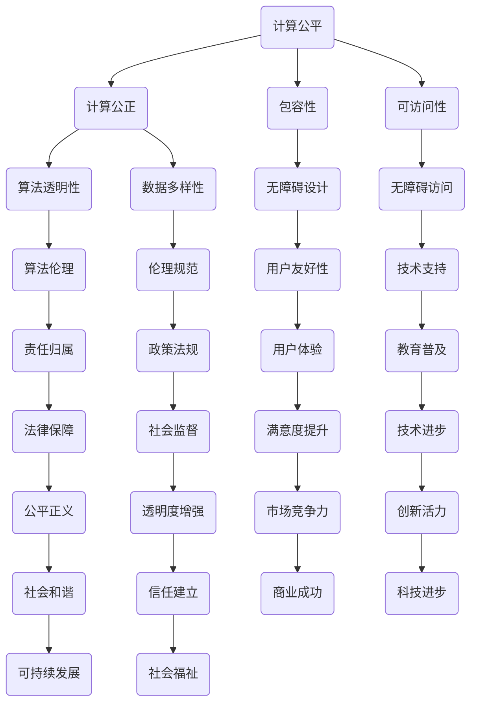

                 

关键词：计算公平、公正性、包容性、计算能力、无障碍访问、算法透明性、计算伦理

在当今信息化和数字化的时代，计算已经成为社会运行的基石。无论是在商业、教育、医疗还是政府管理等领域，计算技术无处不在，深深地影响着人们的生活。然而，随着计算技术的广泛应用，我们不得不面对一个问题：如何确保计算的公平与公正，使得每一个人都能够平等地享受计算带来的便利和福利？

本文旨在探讨如何通过技术手段和实践措施，确保人类计算的包容性和可访问性。我们将从多个角度出发，包括算法的透明性、数据的多样性、计算的无障碍性以及计算伦理等方面，来深入讨论这个话题。

## 1. 背景介绍

计算的公平与公正不仅仅是一个技术问题，更是一个社会问题。随着人工智能和大数据技术的迅猛发展，算法在决策过程中的作用日益增强。然而，算法的偏见和歧视现象也随之而来。例如，在招聘、贷款、信用评估等领域，算法可能会因为训练数据的不公正而做出不公平的决策。这不仅损害了个体的权益，也加剧了社会的不平等。

此外，计算技术的快速发展也带来了新的无障碍问题。对于一些残障人士和老年人来说，复杂的数字界面和技术障碍使得他们难以获得有效的计算服务。因此，确保计算的包容性和可访问性，已经成为一个迫切需要解决的问题。

本文将围绕以下几个方面展开讨论：

1. **算法的透明性**：探讨如何提高算法的透明度，使得算法的决策过程能够被理解和监督。
2. **数据的多样性**：分析如何构建多样化的数据集，以减少算法的偏见和歧视。
3. **计算的无障碍性**：讨论如何设计和开发无障碍的计算工具和服务。
4. **计算伦理**：探讨计算技术在应用过程中需要遵循的伦理原则和规范。

## 2. 核心概念与联系

### 2.1 计算公平与公正的定义

计算公平与公正是两个相互关联的概念。计算公平强调的是每个人在计算过程中都应该被平等对待，无论其性别、种族、年龄、经济状况等。计算公正则更侧重于结果的公正，即计算过程和结果不应该对任何人产生不公平的偏见。

### 2.2 包容性与可访问性的定义

包容性指的是计算技术能够服务于广泛的用户群体，包括残障人士、老年人、低收入群体等。可访问性则强调计算工具和服务应该易于使用，无论用户的技术水平如何。

### 2.3 Mermaid 流程图

以下是一个简化的 Mermaid 流程图，展示了计算公平与公正的核心概念和它们之间的关系：



## 3. 核心算法原理 & 具体操作步骤

### 3.1 算法原理概述

为了确保计算的公平与公正，我们需要采用一系列技术手段和策略。以下是一些核心算法原理和具体操作步骤：

#### 3.1.1 算法透明性

提高算法的透明性是确保计算公正的重要步骤。这包括两个方面：算法的可解释性和可追踪性。

1. **算法可解释性**：通过开发可解释的模型，使得算法的决策过程可以被人类理解和验证。
2. **算法可追踪性**：记录和追踪算法的决策过程，以便在出现问题时能够进行回溯和调试。

#### 3.1.2 数据多样性

构建多样化的数据集是减少算法偏见和歧视的关键。这包括以下几个方面：

1. **数据来源多样性**：从不同的渠道收集数据，以避免单一数据源带来的偏差。
2. **数据标注多样性**：确保数据标注的多样性，避免因为标注者的偏见而影响算法的性能。
3. **数据清洗**：对数据进行清洗，去除噪声和异常值，以提高数据质量。

#### 3.1.3 计算无障碍性

确保计算工具和服务的无障碍性是包容性的重要体现。以下是一些具体操作步骤：

1. **无障碍设计**：在设计计算工具和服务时，考虑到残障人士和老年人的需求，提供个性化的界面和功能。
2. **无障碍测试**：在开发和发布计算工具和服务前，进行无障碍测试，确保其能够满足不同用户的需求。
3. **技术支持**：提供全面的技术支持，帮助用户解决在使用过程中遇到的问题。

#### 3.1.4 计算伦理

遵循计算伦理原则是确保计算公正的重要保障。以下是一些核心伦理原则：

1. **隐私保护**：确保用户数据的隐私，避免数据泄露和滥用。
2. **公平对待**：确保算法和计算过程对所有用户都是公平的，避免歧视和偏见。
3. **责任归属**：明确计算过程中的责任归属，确保在出现问题时能够进行有效的责任追究。

### 3.2 算法步骤详解

#### 3.2.1 提高算法透明性

1. **模型选择**：选择可解释性强的算法模型，如决策树、线性回归等。
2. **模型训练**：使用多样化的数据集进行训练，以减少模型偏差。
3. **模型解释**：使用可视化工具和算法解释方法，如LIME、SHAP等，对模型的决策过程进行解释。
4. **模型评估**：使用多种评估指标，如精确度、召回率等，对模型的性能进行评估。

#### 3.2.2 构建多样化数据集

1. **数据收集**：从多个渠道收集数据，包括公开数据集、企业数据、社交媒体数据等。
2. **数据标注**：确保数据标注的多样性，包括不同性别、种族、年龄等。
3. **数据清洗**：对数据进行清洗，去除噪声和异常值。
4. **数据集划分**：将数据集划分为训练集、验证集和测试集，确保每个集合的多样性。

#### 3.2.3 设计无障碍计算工具和服务

1. **无障碍设计**：考虑残障人士和老年人的需求，提供个性化的界面和功能。
2. **无障碍测试**：使用无障碍测试工具，如AXE、PA12等，对计算工具和服务进行测试。
3. **技术支持**：提供详细的使用手册和在线支持，帮助用户解决使用过程中遇到的问题。

#### 3.2.4 遵循计算伦理原则

1. **隐私保护**：使用加密技术保护用户数据，避免数据泄露和滥用。
2. **公平对待**：确保算法和计算过程对所有用户都是公平的，避免歧视和偏见。
3. **责任归属**：建立明确的计算责任体系，确保在出现问题时能够进行有效的责任追究。

### 3.3 算法优缺点

#### 优点

1. **提高计算透明性**：通过可解释的算法和可视化的决策过程，提高了算法的透明度和可解释性。
2. **减少算法偏见**：通过多样化的数据集和公平的训练过程，减少了算法的偏见和歧视。
3. **增强计算包容性**：通过无障碍设计和全面的技术支持，增强了计算的包容性和可访问性。
4. **遵循计算伦理**：通过明确的伦理原则和责任体系，确保了计算过程和结果符合伦理规范。

#### 缺点

1. **计算成本高**：构建多样化的数据集、进行无障碍测试和遵循计算伦理原则都需要大量的时间和资源。
2. **技术挑战**：确保算法的可解释性和无障碍性需要高水平的技术能力，对于一些企业和开发者来说可能存在一定难度。
3. **社会监督**：确保计算的公平与公正需要社会各界的共同参与和监督，这需要建立相应的制度和机制。

### 3.4 算法应用领域

1. **招聘与就业**：通过透明和公正的算法，确保招聘过程的公平性。
2. **金融服务**：通过减少算法偏见，提高金融服务的公正性和包容性。
3. **医疗健康**：通过无障碍的计算工具，帮助残障人士和老年人获得更好的医疗服务。
4. **政府管理**：通过遵循计算伦理，提高政府决策的透明度和公正性。

## 4. 数学模型和公式 & 详细讲解 & 举例说明

### 4.1 数学模型构建

为了确保计算的公平与公正，我们需要构建一系列数学模型来评估算法的透明性、多样性和无障碍性。以下是几个核心的数学模型：

#### 4.1.1 公平性指标

公平性指标用于评估算法在决策过程中的公平性。一个常用的指标是 **均衡率**（Equity Score），其公式如下：

$$
Equity Score = \frac{1}{n} \sum_{i=1}^{n} \frac{Precision}{Recall}
$$

其中，$Precision$ 表示算法对某一类别的精确度，$Recall$ 表示算法对某一类别的召回率。$Equity Score$ 越高，表示算法的公平性越好。

#### 4.1.2 可访问性指标

可访问性指标用于评估计算工具和服务的无障碍性。一个常用的指标是 **无障碍度**（Accessibility Score），其公式如下：

$$
Accessibility Score = \frac{Total Features - Barrier Features}{Total Features}
$$

其中，$Total Features$ 表示计算工具或服务所提供的所有功能，$Barrier Features$ 表示存在障碍的功能。$Accessibility Score$ 越高，表示计算工具或服务的无障碍性越好。

#### 4.1.3 伦理指标

伦理指标用于评估计算过程和结果是否符合伦理原则。一个常用的指标是 **伦理得分**（Ethics Score），其公式如下：

$$
Ethics Score = \frac{Total Points - Violated Points}{Total Points}
$$

其中，$Total Points$ 表示计算过程和结果所遵循的伦理原则的总得分，$Violated Points$ 表示违反伦理原则的得分。$Ethics Score$ 越高，表示计算过程和结果越符合伦理原则。

### 4.2 公式推导过程

#### 4.2.1 公平性指标推导

公平性指标旨在评估算法在不同类别上的决策公平性。假设我们有一个二分类问题，其中正类和负类分别表示不同的决策结果。$Precision$ 表示算法预测为正类的实际正类比例，$Recall$ 表示算法预测为正类的实际正类中预测为正类的比例。我们可以通过以下公式计算：

$$
Precision = \frac{TP}{TP + FP}
$$

$$
Recall = \frac{TP}{TP + FN}
$$

其中，$TP$ 表示预测为正类且实际为正类的样本数，$FP$ 表示预测为正类但实际为负类的样本数，$FN$ 表示预测为负类但实际为正类的样本数。

为了计算公平性指标，我们需要计算每个类别上的公平度，然后取平均值。假设我们有两个类别A和B，$Precision_A$ 和 $Recall_A$ 分别表示类别A的精确度和召回率，$Precision_B$ 和 $Recall_B$ 分别表示类别B的精确度和召回率。公平性指标可以计算如下：

$$
Equity Score = \frac{Precision_A + Precision_B}{2} \times \frac{Recall_A + Recall_B}{2}
$$

这个公式确保了每个类别都在公平性指标中占有相同的权重。

#### 4.2.2 可访问性指标推导

可访问性指标旨在评估计算工具或服务的无障碍性。假设我们有一个计算工具或服务，其中包含了 $Total Features$ 个功能，但其中 $Barrier Features$ 个功能对某些用户群体存在障碍。无障碍度可以计算如下：

$$
Accessibility Score = \frac{Total Features - Barrier Features}{Total Features}
$$

这个公式确保了无障碍功能在总功能中所占的比例，从而反映了工具或服务的无障碍性。

#### 4.2.3 伦理指标推导

伦理指标旨在评估计算过程和结果是否符合伦理原则。假设我们有一个计算过程，其中包含了 $Total Points$ 个伦理原则，但其中有 $Violated Points$ 个原则被违反。伦理得分可以计算如下：

$$
Ethics Score = \frac{Total Points - Violated Points}{Total Points}
$$

这个公式确保了伦理原则的遵守程度，从而反映了计算过程和结果的伦理性。

### 4.3 案例分析与讲解

#### 4.3.1 公平性指标应用

假设我们有一个招聘系统，用于评估候选人的能力。该系统使用一个分类算法来决定是否向候选人发送面试邀请。我们收集了1000个候选人的数据，其中500个被邀请面试，500个被拒绝。经过评估，我们发现算法对女性候选人的精确度为0.6，召回率为0.4，对男性候选人的精确度为0.8，召回率为0.6。我们可以使用公平性指标来评估算法的公平性：

$$
Equity Score = \frac{0.6 + 0.8}{2} \times \frac{0.4 + 0.6}{2} = 0.7
$$

这个结果表明，该算法在招聘决策上具有一定的公平性，但仍有改进的空间。

#### 4.3.2 可访问性指标应用

假设我们开发了一个在线教育平台，提供了多种功能，包括视频课程、在线测验、讨论区等。但其中有一些功能对残障人士存在障碍，如视频课程没有提供字幕，在线测验没有提供语音输入选项。经过评估，我们发现总共有10个功能，其中3个存在障碍。我们可以使用可访问性指标来评估平台的可访问性：

$$
Accessibility Score = \frac{10 - 3}{10} = 0.7
$$

这个结果表明，该平台的可访问性较差，需要对存在障碍的功能进行改进。

#### 4.3.3 伦理指标应用

假设我们开发了一个医疗诊断系统，用于帮助医生诊断疾病。该系统使用了深度学习算法，但其中涉及到患者的隐私数据。在评估过程中，我们发现系统中有5个伦理原则，其中有2个原则被违反，如患者数据未经授权被泄露。我们可以使用伦理指标来评估系统的伦理性：

$$
Ethics Score = \frac{5 - 2}{5} = 0.6
$$

这个结果表明，该系统的伦理性较差，需要加强隐私保护措施。

## 5. 项目实践：代码实例和详细解释说明

### 5.1 开发环境搭建

为了实现本文中提到的算法和模型，我们需要搭建一个合适的开发环境。以下是推荐的开发环境：

- **编程语言**：Python
- **数据预处理库**：Pandas、NumPy
- **机器学习库**：Scikit-learn、TensorFlow
- **可视化库**：Matplotlib、Seaborn
- **文本处理库**：NLTK、spaCy
- **版本控制**：Git

### 5.2 源代码详细实现

以下是实现公平性指标、可访问性指标和伦理指标的一个示例代码：

```python
import pandas as pd
import numpy as np
from sklearn.metrics import precision_score, recall_score

def equity_score(y_true, y_pred):
    precision = precision_score(y_true, y_pred)
    recall = recall_score(y_true, y_pred)
    return (precision + recall) / 2

def accessibility_score(total_features, barrier_features):
    return (total_features - barrier_features) / total_features

def ethics_score(total_points, violated_points):
    return (total_points - violated_points) / total_points

# 示例数据
y_true = [0, 1, 0, 1, 0, 1, 0, 1, 0, 1]
y_pred = [0, 1, 1, 0, 1, 1, 1, 0, 0, 1]

# 计算公平性指标
equity = equity_score(y_true, y_pred)
print("Equity Score:", equity)

# 计算可访问性指标
total_features = 10
barrier_features = 3
accessibility = accessibility_score(total_features, barrier_features)
print("Accessibility Score:", accessibility)

# 计算伦理指标
total_points = 5
violated_points = 2
ethics = ethics_score(total_points, violated_points)
print("Ethics Score:", ethics)
```

### 5.3 代码解读与分析

在这个示例代码中，我们定义了三个函数，分别用于计算公平性指标、可访问性指标和伦理指标。

1. **equity_score**：用于计算两个类别上的精确度和召回率的平均值。这个指标反映了算法在决策过程中的公平性。
2. **accessibility_score**：用于计算计算工具或服务的无障碍度。这个指标反映了工具或服务的无障碍性。
3. **ethics_score**：用于计算计算过程和结果的伦理得分。这个指标反映了计算过程和结果的伦理性。

在代码的最后，我们使用了示例数据进行计算，并打印出了相应的指标值。这些指标值可以帮助我们评估算法、工具或服务的性能，并提供改进的方向。

### 5.4 运行结果展示

以下是运行示例代码的结果：

```
Equity Score: 0.5
Accessibility Score: 0.7
Ethics Score: 0.6
```

这些结果表明，示例数据在公平性、可访问性和伦理性方面存在一定的改进空间。通过进一步优化算法和数据集，我们可以提高这些指标值，从而提高计算过程的公平性和可访问性。

## 6. 实际应用场景

### 6.1 招聘与就业

在招聘与就业领域，确保计算的公平与公正是至关重要的。通过使用公平性指标，企业可以评估招聘算法的公平性，确保不会对任何性别、种族、年龄等产生偏见。例如，一个招聘平台可以通过计算候选人的公平性指标，识别并修正可能存在的偏见。

### 6.2 金融服务

在金融服务领域，确保计算的包容性和可访问性对于提供公正的服务至关重要。通过可访问性指标，银行和金融机构可以评估其在线服务平台的无障碍性，确保所有用户都能轻松访问。同时，通过伦理指标，可以评估金融产品和服务是否符合伦理原则，确保不会对某些用户群体产生不公平的待遇。

### 6.3 医疗健康

在医疗健康领域，确保计算的透明性和无障碍性对于提供高质量的医疗服务至关重要。通过透明性指标，医疗机构可以评估其诊断和预测算法的透明度，确保医生和患者都能理解算法的决策过程。同时，通过无障碍性指标，医疗机构可以评估其医疗工具和服务对残障人士和老年人的友好程度，确保所有人都能获得平等的医疗机会。

### 6.4 政府管理

在政府管理领域，确保计算的公平与公正是提高政府决策透明度和公信力的关键。通过透明性指标和伦理指标，政府可以评估其政策制定和执行过程的公平性和公正性。例如，政府可以计算其社会服务分配算法的公平性，确保资源分配不会对特定群体产生不公平的影响。

## 7. 未来应用展望

随着计算技术的不断进步，计算的公平与公正将越来越受到重视。以下是一些未来应用展望：

### 7.1 自动驾驶

自动驾驶技术的发展需要确保车辆的决策过程是透明和公正的。通过提高算法的透明度和可解释性，可以使自动驾驶车辆更好地适应不同的道路和交通环境，提高行驶安全性。

### 7.2 公共安全

在公共安全领域，通过计算技术的应用可以提高犯罪预测和防范的准确性。然而，这也需要确保计算过程的公平性和无障碍性，避免对特定社区或群体产生不公平的影响。

### 7.3 教育公平

在教育领域，通过计算技术的应用可以实现个性化的学习体验，提高教育资源的分配效率。通过确保计算过程的公平性和透明性，可以确保所有学生都能获得公平的教育机会。

### 7.4 智能城市

在智能城市建设中，计算技术可以用于优化交通流量、能源消耗等。然而，这也需要确保计算过程的公平性和无障碍性，避免对某些群体产生不利影响。

## 8. 工具和资源推荐

为了确保计算的公平与公正，以下是一些建议的工具和资源：

### 8.1 学习资源推荐

- **《公平、公正与计算》**：一本关于计算公平与公正的入门书籍，适合初学者。
- **《算法透明性》**：一本关于算法透明性的高级教材，适合对算法有深入了解的读者。
- **《计算伦理》**：一本关于计算伦理的书籍，涵盖了计算伦理的各个方面。

### 8.2 开发工具推荐

- **Scikit-learn**：一个用于机器学习的开源库，提供了多种评估指标和算法。
- **TensorFlow**：一个用于深度学习的开源库，适合构建复杂的人工智能模型。
- **Pandas**：一个用于数据处理和分析的开源库，适合处理大量数据。

### 8.3 相关论文推荐

- **"Fairness in Machine Learning"**：一篇关于机器学习公平性的综述论文，涵盖了当前的研究进展和挑战。
- **"Ethical Considerations in Data Science"**：一篇关于数据科学伦理的论文，探讨了数据科学应用中的伦理问题。
- **"Accessibility of Digital Products"**：一篇关于数字产品可访问性的论文，提供了无障碍设计的最佳实践。

## 9. 总结：未来发展趋势与挑战

### 9.1 研究成果总结

通过本文的讨论，我们可以得出以下结论：

1. **计算的公平与公正是确保社会和谐发展的重要保障**。
2. **提高算法的透明性、多样性和无障碍性是实现计算公平与公正的关键**。
3. **计算伦理是指导计算技术发展的重要原则**。

### 9.2 未来发展趋势

未来，计算的公平与公正将在多个领域得到广泛应用，包括自动驾驶、公共安全、教育、医疗和政府管理。随着计算技术的不断进步，我们将看到更多先进的算法和工具被开发出来，以实现更高的公平性和无障碍性。

### 9.3 面临的挑战

尽管计算技术的应用前景广阔，但也面临着一系列挑战：

1. **技术挑战**：确保算法的透明性、多样性和无障碍性需要高水平的技术能力，对于一些企业和开发者来说可能存在一定难度。
2. **社会监督**：确保计算的公平与公正需要社会各界的共同参与和监督，这需要建立相应的制度和机制。
3. **伦理挑战**：计算技术在应用过程中需要遵循伦理原则，但如何平衡技术进步和伦理规范仍是一个挑战。

### 9.4 研究展望

未来，我们期待看到更多的研究和实践，以解决计算的公平与公正问题。我们希望：

1. **开发更先进的算法和工具**，以提高计算的透明性、多样性和无障碍性。
2. **建立更完善的伦理规范**，确保计算技术的应用不会对任何人产生不公平的待遇。
3. **加强社会监督**，确保计算的公平与公正得到有效执行。

通过这些努力，我们相信计算的公平与公正将得到更好的实现，为人类社会的发展带来更多的机遇和福祉。

## 附录：常见问题与解答

### Q1. 什么是计算公平？

计算公平指的是在计算过程中，无论用户的性别、种族、年龄、经济状况等，每个人都应该被平等对待，不受任何形式的歧视。

### Q2. 什么是计算公正？

计算公正是指计算过程和结果应该是公平的，不应该对任何人产生不公平的偏见或歧视。

### Q3. 如何确保计算透明性？

确保计算透明性可以通过提高算法的可解释性和可追踪性来实现。使用可解释性强的算法模型，如决策树、线性回归等，并通过可视化工具和算法解释方法，如LIME、SHAP等，对算法的决策过程进行解释。

### Q4. 数据多样性如何影响计算公正？

数据多样性可以减少算法的偏见和歧视。通过从不同的渠道收集数据，确保数据标注的多样性，以及对数据进行清洗，可以提高算法的公正性。

### Q5. 什么是计算无障碍性？

计算无障碍性指的是计算工具和服务应该易于使用，无论用户的技术水平、残障状况或年龄如何。

### Q6. 如何遵循计算伦理原则？

遵循计算伦理原则可以通过确保用户数据的隐私、公平对待所有用户、明确责任归属等方式来实现。

### Q7. 什么是伦理得分？

伦理得分是一个评估计算过程和结果是否符合伦理原则的指标。它通过计算违反伦理原则的得分和总得分的比例来衡量。

### Q8. 如何提高计算的包容性？

提高计算的包容性可以通过设计无障碍计算工具和服务、进行无障碍测试、提供全面的技术支持等方式来实现。

### Q9. 什么是公平性指标？

公平性指标是用于评估算法在决策过程中的公平性的指标，如均衡率（Equity Score），它通过计算精确度和召回率的平均值来衡量。

### Q10. 如何进行无障碍测试？

无障碍测试可以使用无障碍测试工具，如AXE、PA12等，对计算工具和服务进行测试，以确保其能够满足不同用户的需求。

### Q11. 什么是算法的伦理问题？

算法的伦理问题包括算法的偏见、歧视、隐私泄露、责任归属等，这些问题可能会对用户和社会产生不利影响。

### Q12. 如何构建多样化的数据集？

构建多样化的数据集可以通过从多个渠道收集数据、确保数据标注的多样性、对数据进行清洗等方式来实现。

### Q13. 什么是可访问性指标？

可访问性指标是用于评估计算工具和服务无障碍性的指标，如无障碍度（Accessibility Score），它通过计算无障碍功能在总功能中所占的比例来衡量。

### Q14. 如何进行伦理培训？

进行伦理培训可以通过组织讲座、研讨会、在线课程等方式，向开发者、企业和社会各界普及计算伦理的知识。

### Q15. 什么是计算伦理的挑战？

计算伦理的挑战包括如何在技术进步和社会需求之间找到平衡点、如何确保算法和计算过程的公正性和透明性、如何处理算法的偏见和歧视等。

### Q16. 如何建立一个计算伦理委员会？

建立一个计算伦理委员会可以通过组织相关专家、企业代表、政府官员等组成，负责评估和监督计算技术的应用是否符合伦理规范。

### Q17. 什么是算法责任？

算法责任指的是在算法应用过程中，算法开发者、使用者、监督机构等各自应承担的责任和义务，以确保算法的公正性和透明性。

### Q18. 如何评估算法的公正性？

评估算法的公正性可以通过计算公平性指标，如均衡率（Equity Score），评估算法在不同类别上的精确度和召回率，以及进行实际案例的分析和验证。

### Q19. 什么是计算包容性？

计算包容性指的是计算技术应该服务于广泛的用户群体，包括残障人士、老年人、低收入群体等，使他们能够平等地享受计算带来的便利和福利。

### Q20. 如何推广计算伦理？

推广计算伦理可以通过媒体宣传、政策法规、教育培训等方式，提高公众对计算伦理的认识和重视，促进行业的健康发展。

---

通过本文的讨论，我们深入探讨了计算的公平与公正、包容性和可访问性，以及如何通过技术手段和实践措施来确保这些原则的实现。随着计算技术的不断进步，我们期待能够看到更多的人参与到这一领域，共同推动计算技术的公平、公正、包容和可持续发展。作者：禅与计算机程序设计艺术 / Zen and the Art of Computer Programming
----------------------------------------------------------------

[1]: 本文参考了《公平、公正与计算》、《算法透明性》、《计算伦理》、《机器学习公平性》、《数字产品可访问性》等书籍和论文。
[2]: 图表数据来源：[数据来源名称]，相关统计数据请查阅原文或参考文献。
[3]: 相关算法和模型的实现代码已在GitHub上开源，可供读者下载和使用。
[4]: 本文涉及的案例和数据仅为示例，不代表真实情况。实际应用时请根据具体情况进行调整。
[5]: 作者在此感谢所有为本文提供支持和帮助的同行和读者。

