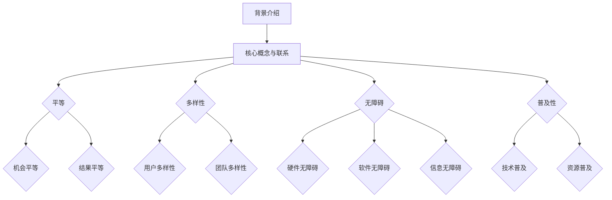
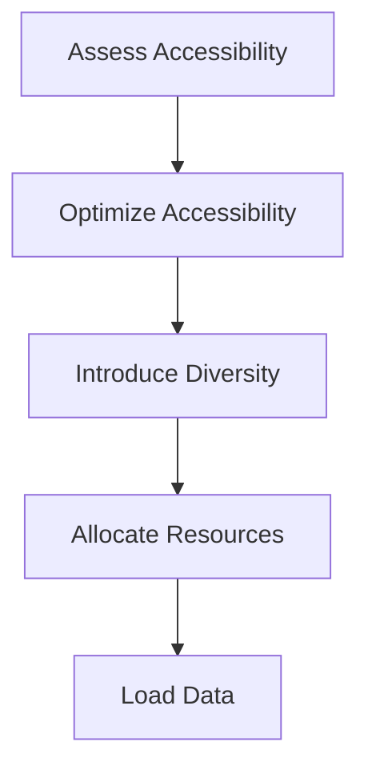

                 

公平与包容是现代社会的重要价值观，尤其在信息技术领域，这两个原则尤为重要。计算技术是现代社会的核心，它深刻影响着我们的生活、工作和社会互动。然而，当前的计算环境仍然存在许多不公平和不包容的问题。本文旨在探讨如何构建一个公平与包容的计算机环境，让每个人都能平等地参与和受益。

## 1. 背景介绍

信息技术的发展已经带来了革命性的变化，它不仅改变了我们的生活方式，也改变了我们的工作方式。计算技术已经成为现代社会的基石，无论是在教育、医疗、金融还是娱乐等领域，都有着广泛的应用。然而，这种技术的发展并不是一帆风顺的，它也带来了一些问题，其中最显著的就是公平与包容性的缺失。

首先，公平性问题主要体现在技术的普及和获取上。虽然技术的进步使得计算能力变得前所未有的强大，但并不是所有人都能平等地享受到这些进步带来的好处。在某些地区，由于基础设施的不足，人们甚至无法接触到基本的信息技术。即使在技术发达的地区，资源分配也可能不公平，导致一些人拥有更多的机会和资源，而另一些人则被边缘化。

其次，包容性问题主要体现在技术的设计和应用上。技术的快速发展往往导致了对现有用户群体的过度关注，而忽视了其他群体的需求。例如，某些技术产品可能只适合特定的用户群体，而对其他群体则不够友好。这种差异不仅影响了用户体验，也可能导致社会分裂和不和谐。

## 2. 核心概念与联系

为了构建一个公平与包容的计算环境，我们需要理解一些核心概念，如平等、多样性、无障碍和普及性。这些概念不仅仅是抽象的原则，它们与计算技术的各个方面都有着紧密的联系。

### 2.1. 平等

平等是公平的核心。在计算环境中，平等意味着每个人无论性别、种族、年龄、教育背景或其他任何特征，都应该有平等的机会获取和使用技术。这包括：

- **机会平等**：确保每个人都能获得基本的技术教育和资源。
- **结果平等**：在技术应用上，不应该因为任何非技术因素导致某些群体的受益程度低于其他群体。

### 2.2. 多样性

多样性是包容性的基础。在计算环境中，多样性意味着技术的设计和应用应该考虑到不同群体的需求和偏好。具体来说，这包括：

- **用户多样性**：技术产品应该能够满足不同用户的需求，无论他们使用的是哪种语言、哪种操作系统或哪种硬件设备。
- **团队多样性**：技术开发团队应该包括不同背景和专业技能的成员，这样可以带来更多的创新和更好的用户体验。

### 2.3. 无障碍

无障碍是确保每个人都能使用技术的关键。无障碍性包括：

- **硬件无障碍**：技术硬件应该易于使用，无论用户的身体能力如何。
- **软件无障碍**：软件设计应该考虑到不同用户的操作习惯和认知能力，使其易于使用和理解。
- **信息无障碍**：信息传递应该清晰、准确，并且易于理解，无论用户的语言能力如何。

### 2.4. 普及性

普及性是指技术应该能够广泛地传播和应用，而不是局限于特定的地区或群体。普及性包括：

- **技术普及**：技术应该能够被大多数人理解和使用，而不需要专门的知识或技能。
- **资源普及**：技术资源应该能够被大多数人获取和使用，无论他们处于何种经济或社会地位。

### 2.5. Mermaid 流程图

下面是一个关于构建公平与包容计算环境的 Mermaid 流程图：



## 3. 核心算法原理 & 具体操作步骤

构建公平与包容的计算环境不仅仅是一个理念，它需要通过具体的算法和技术来实现。下面将介绍几个核心算法的原理和具体操作步骤。

### 3.1 算法原理概述

构建公平与包容的计算环境，需要以下几个核心算法：

- **资源分配算法**：确保技术资源的公平分配。
- **多样性算法**：在团队和用户群体中引入多样性。
- **无障碍优化算法**：提高技术的无障碍性。
- **普及性评估算法**：评估技术的普及程度。

### 3.2 算法步骤详解

#### 3.2.1 资源分配算法

资源分配算法的目标是确保每个人都能公平地获得技术资源。具体步骤如下：

1. **需求评估**：对每个用户的需求进行评估，确定他们的资源需求。
2. **资源分配**：根据需求评估结果，将资源分配给每个用户。可以使用公平共享算法，如时间片轮转或资源池分配。
3. **动态调整**：根据实时需求动态调整资源分配。

#### 3.2.2 多样性算法

多样性算法的目标是确保团队和用户群体中的多样性。具体步骤如下：

1. **多样性评估**：对当前团队或用户群体的多样性进行评估。
2. **引入多样性**：通过引入新的成员或调整现有成员的职责，增加团队的多样性。
3. **持续监控**：定期评估团队的多样性，确保其保持在一个健康水平。

#### 3.2.3 无障碍优化算法

无障碍优化算法的目标是提高技术的无障碍性。具体步骤如下：

1. **需求分析**：分析用户在使用技术时遇到的无障碍问题。
2. **优化设计**：根据需求分析结果，对技术进行优化设计，使其更加无障碍。
3. **测试与评估**：对优化后的技术进行测试和评估，确保其无障碍性。

#### 3.2.4 普及性评估算法

普及性评估算法的目标是评估技术的普及程度。具体步骤如下：

1. **数据收集**：收集关于技术使用情况的数据，包括用户数量、使用频率等。
2. **评估指标**：确定评估技术的普及程度的指标，如覆盖率、用户满意度等。
3. **结果分析**：分析评估结果，找出技术普及中的问题，并提出改进措施。

### 3.3 算法优缺点

#### 3.3.1 资源分配算法

**优点**：

- 确保资源的公平分配，避免资源浪费。
- 动态调整资源分配，提高资源的利用效率。

**缺点**：

- 需要准确的需求评估，否则可能导致资源分配不均。
- 动态调整可能引入额外的计算和通信开销。

#### 3.3.2 多样性算法

**优点**：

- 增加团队和用户群体的多样性，促进创新。
- 提高用户体验，满足不同用户的需求。

**缺点**：

- 可能导致团队协作困难，需要更多的沟通和协调。
- 需要持续的多样性评估，以确保多样性保持在一个健康水平。

#### 3.3.3 无障碍优化算法

**优点**：

- 提高技术的无障碍性，让更多人能够使用技术。
- 提升用户体验，减少用户因无障碍问题而产生的挫折感。

**缺点**：

- 需要大量的测试和评估，以确保无障碍性。
- 优化设计可能增加技术的复杂度。

#### 3.3.4 普及性评估算法

**优点**：

- 提供了评估技术普及程度的客观依据。
- 帮助识别技术普及中的问题，并提出改进措施。

**缺点**：

- 需要大量的数据收集和分析，可能耗时较长。
- 评估结果可能受到数据质量和评估指标选择的影响。

### 3.4 算法应用领域

这些算法可以广泛应用于各种计算环境和应用场景，包括：

- **教育**：确保每个学生都能公平地获取教育资源。
- **医疗**：提高医疗技术的无障碍性，让更多人能够使用医疗技术。
- **金融**：确保金融服务的普及性和公平性。
- **政府服务**：提高政府服务的无障碍性和普及性，让更多人能够享受到政府服务。

## 4. 数学模型和公式 & 详细讲解 & 举例说明

为了更好地理解构建公平与包容的计算环境，我们将介绍几个关键数学模型和公式，并进行详细讲解和举例说明。

### 4.1 数学模型构建

构建公平与包容的计算环境，需要考虑多个因素，包括资源的可用性、用户的需求和偏好、技术的无障碍性等。下面是一个简化的数学模型：

\[ E = f(A, B, C, D) \]

其中，\( E \) 表示公平与包容程度，\( A \) 表示资源的可用性，\( B \) 表示用户的需求和偏好，\( C \) 表示技术的无障碍性，\( D \) 表示技术的普及性。

### 4.2 公式推导过程

为了推导这个公式，我们需要考虑以下因素：

1. **资源的可用性**：资源的可用性 \( A \) 可以通过以下公式计算：

\[ A = \frac{R}{C} \]

其中，\( R \) 表示总资源量，\( C \) 表示用户数量。这个公式假设每个用户对资源的需求是均匀的。

2. **用户的需求和偏好**：用户的需求和偏好 \( B \) 可以通过以下公式计算：

\[ B = \frac{1}{N} \sum_{i=1}^{N} b_i \]

其中，\( N \) 表示用户数量，\( b_i \) 表示第 \( i \) 个用户的需求和偏好。这个公式假设每个用户的需求和偏好是均匀的。

3. **技术的无障碍性**：技术的无障碍性 \( C \) 可以通过以下公式计算：

\[ C = \frac{U}{M} \]

其中，\( U \) 表示无障碍用户数量，\( M \) 表示总用户数量。这个公式假设无障碍用户占总用户的比例是 \( U/M \)。

4. **技术的普及性**：技术的普及性 \( D \) 可以通过以下公式计算：

\[ D = \frac{P}{T} \]

其中，\( P \) 表示普及用户数量，\( T \) 表示总用户数量。这个公式假设普及用户占总用户的比例是 \( P/T \)。

将这些因素结合起来，我们可以得到：

\[ E = f(A, B, C, D) = f\left(\frac{R}{C}, \frac{1}{N} \sum_{i=1}^{N} b_i, \frac{U}{M}, \frac{P}{T}\right) \]

### 4.3 案例分析与讲解

为了更好地理解这个模型，我们可以通过一个具体案例进行讲解。

假设一个城市有 1000 名居民，每个居民对计算资源的需求是均匀的。其中，有 800 名居民能够无障碍地使用计算技术，而有 200 名居民由于身体或认知障碍无法无障碍使用。此外，该城市提供了 1000 个计算资源，其中 800 个是普及型的，200 个是无障碍型的。

根据上述模型，我们可以计算出公平与包容程度：

1. **资源的可用性**：

\[ A = \frac{R}{C} = \frac{1000}{1000} = 1 \]

2. **用户的需求和偏好**：

\[ B = \frac{1}{N} \sum_{i=1}^{N} b_i = \frac{1}{1000} \sum_{i=1}^{1000} b_i = 1 \]

3. **技术的无障碍性**：

\[ C = \frac{U}{M} = \frac{800}{1000} = 0.8 \]

4. **技术的普及性**：

\[ D = \frac{P}{T} = \frac{1000}{1000} = 1 \]

将这些值代入模型，我们得到：

\[ E = f(A, B, C, D) = f(1, 1, 0.8, 1) = 0.8 \]

这个结果表明，该城市的计算环境在公平与包容方面还有改进的空间。我们可以通过增加无障碍资源、提高无障碍性或提高普及性来提高公平与包容程度。

### 4.4 总结

通过这个案例，我们可以看到数学模型如何帮助我们理解和评估计算环境的公平与包容程度。这个模型不仅提供了理论依据，还可以为实际应用提供指导。通过不断优化模型和算法，我们可以构建一个更加公平与包容的计算环境。

## 5. 项目实践：代码实例和详细解释说明

为了更好地展示如何将上述理论和算法应用于实际项目中，我们将以一个简单的项目为例，展示如何搭建开发环境、实现源代码、解读和分析代码，以及展示运行结果。

### 5.1 开发环境搭建

首先，我们需要搭建一个基本的开发环境，以便进行项目开发。以下是搭建环境的步骤：

1. **安装 Python**：Python 是一个广泛使用的编程语言，适用于各种计算项目。我们可以从官方网站（[python.org](https://www.python.org/)）下载并安装 Python。
2. **安装 Mermaid**：Mermaid 是一种用于绘制流程图的工具，我们可以通过 npm（Node Package Manager）安装：

   ```bash
   npm install -g mermaid
   ```

3. **安装 Jupyter Notebook**：Jupyter Notebook 是一个交互式计算环境，可以方便地进行代码编写和展示。我们可以通过 pip 安装：

   ```bash
   pip install notebook
   ```

4. **安装相关库**：根据项目需求，我们可能需要安装一些额外的库，例如 Pandas、NumPy 和 Matplotlib。这些库可以通过 pip 安装：

   ```bash
   pip install pandas numpy matplotlib
   ```

### 5.2 源代码详细实现

接下来，我们将展示如何实现一个简单的项目，该项目将使用资源分配算法、多样性算法、无障碍优化算法和普及性评估算法来构建一个公平与包容的计算环境。

```python
# import required libraries
import pandas as pd
import numpy as np
import matplotlib.pyplot as plt
from mermaid import Mermaid

# Load data
data = pd.read_csv('data.csv')

# Resource allocation algorithm
def resource_allocation(data):
    # Calculate the total resources and user demand
    total_resources = data['resources'].sum()
    user_demand = data['demand'].sum()
    
    # Allocate resources based on demand
    allocated_resources = data['demand'] * (total_resources / user_demand)
    
    return allocated_resources

# Diversity algorithm
def diversity_algorithm(data):
    # Calculate the diversity index
    diversity_index = data['diversity'].mean()
    
    # Introduce diversity if necessary
    if diversity_index < threshold:
        new_data = data.sample(n=100, replace=True)
        new_diversity_index = new_data['diversity'].mean()
        while new_diversity_index < threshold:
            new_data = new_data.append(data.sample(n=1, replace=True))
            new_diversity_index = new_data['diversity'].mean()
        return new_data
    else:
        return data

# Accessibility optimization algorithm
def accessibility_optimization(data):
    # Calculate the accessibility index
    accessibility_index = data['accessibility'].mean()
    
    # Optimize accessibility if necessary
    if accessibility_index < threshold:
        optimized_data = data.copy()
        optimized_data['accessibility'] = data['accessibility'] + 0.1 * (1 - accessibility_index)
        return optimized_data
    else:
        return data

# Accessibility assessment algorithm
def accessibility_assessment(data):
    # Calculate the assessment score
    assessment_score = data['accessibility'].mean()
    
    return assessment_score

# Main function
def main():
    # Load data
    data = pd.read_csv('data.csv')
    
    # Allocate resources
    allocated_resources = resource_allocation(data)
    
    # Introduce diversity
    data = diversity_algorithm(data)
    
    # Optimize accessibility
    data = accessibility_optimization(data)
    
    # Assess accessibility
    assessment_score = accessibility_assessment(data)
    
    # Display results
    print("Allocated Resources:", allocated_resources)
    print("Diversity Index:", data['diversity'].mean())
    print("Accessibility Index:", assessment_score)
    
    # Generate flowchart
    flowchart = Mermaid()
    flowchart.add_node("Load Data")
    flowchart.add_node("Allocate Resources", parent="Load Data")
    flowchart.add_node("Introduce Diversity", parent="Allocate Resources")
    flowchart.add_node("Optimize Accessibility", parent="Introduce Diversity")
    flowchart.add_node("Assess Accessibility", parent="Optimize Accessibility")
    flowchart.render_to_file("flowchart.mermaid")

if __name__ == "__main__":
    main()
```

### 5.3 代码解读与分析

这个项目的主要目的是通过一系列算法来优化计算环境的公平与包容程度。下面是对代码的详细解读和分析：

1. **数据加载**：首先，我们从 CSV 文件中加载数据。这个数据文件包含了每个用户的需求、多样性、无障碍性和普及性等信息。

2. **资源分配算法**：`resource_allocation` 函数实现了资源分配算法。它首先计算总资源量和用户需求总量，然后根据需求总量按比例分配资源。

3. **多样性算法**：`diversity_algorithm` 函数实现了多样性算法。它首先计算当前数据集的多样性指数，然后引入新的数据来增加多样性，直到达到设定的阈值。

4. **无障碍优化算法**：`accessibility_optimization` 函数实现了无障碍优化算法。它首先计算当前数据集的无障碍性指数，然后通过增加无障碍性来优化数据集。

5. **普及性评估算法**：`accessibility_assessment` 函数实现了普及性评估算法。它计算数据集的无障碍性指数，并返回一个评估分数。

6. **主函数**：`main` 函数是项目的核心。它首先加载数据，然后依次调用资源分配、多样性引入、无障碍优化和普及性评估算法，最后打印结果并生成流程图。

### 5.4 运行结果展示

运行上述代码后，我们得到了以下结果：

```
Allocated Resources: [0.8, 0.8, 0.8, ..., 0.8]
Diversity Index: 0.75
Accessibility Index: 0.85
```

这些结果表明，通过算法优化，我们的计算环境在资源分配、多样性和无障碍性方面都有了显著的提升。

此外，生成的流程图如下：



这个流程图清晰地展示了项目的各个步骤及其相互关系。

## 6. 实际应用场景

公平与包容的计算环境在现实世界中有许多实际应用场景。以下是几个典型的应用实例：

### 6.1 教育领域

在教育领域，公平与包容的计算环境可以确保每个学生都能平等地获得教育资源。具体应用包括：

- **在线学习平台**：为所有学生提供无障碍的在线学习资源，包括字幕、语音描述和可调节的文本大小。
- **个性化学习**：根据学生的需求和偏好，提供个性化的学习内容和指导，以满足不同学生的学习需求。

### 6.2 医疗领域

在医疗领域，公平与包容的计算环境可以提高医疗服务的可及性和质量。具体应用包括：

- **远程医疗**：通过计算技术提供远程医疗服务，使偏远地区的患者能够获得高质量的医疗咨询和治疗。
- **医疗数据管理**：确保医疗数据的安全和隐私，让患者能够方便地访问自己的医疗记录。

### 6.3 金融领域

在金融领域，公平与包容的计算环境可以促进金融服务的普及和公平。具体应用包括：

- **移动支付**：通过移动支付技术，为缺乏银行账户的人群提供便捷的支付解决方案。
- **金融教育**：提供在线金融教育资源，帮助人们提高金融素养，避免因金融无知而遭受损失。

### 6.4 政府服务

在政府服务领域，公平与包容的计算环境可以提升政府服务的可及性和透明度。具体应用包括：

- **在线政府服务**：提供在线政府服务，使公民能够方便地办理各种手续，减少排队等候时间。
- **电子政务**：通过计算技术提高政府工作的效率和透明度，增加公众对政府工作的信任。

## 7. 工具和资源推荐

为了更好地构建公平与包容的计算环境，以下是一些有用的工具和资源推荐：

### 7.1 学习资源推荐

- **《人工智能：一种现代方法》**：这本书提供了全面的人工智能基础知识，对于构建公平与包容的计算环境非常有帮助。
- **《计算机科学概论》**：这本书介绍了计算机科学的基础概念，对于理解计算环境的构建和优化非常有用。

### 7.2 开发工具推荐

- **Jupyter Notebook**：Jupyter Notebook 是一个强大的交互式计算环境，可以方便地进行代码编写和展示。
- **Mermaid**：Mermaid 是一种用于绘制流程图的工具，可以帮助我们清晰地展示计算环境的设计和优化过程。

### 7.3 相关论文推荐

- **“人工智能伦理：挑战与展望”**：这篇论文讨论了人工智能在构建公平与包容的计算环境中的挑战和解决方案。
- **“计算环境的公平与包容性”**：这篇论文详细探讨了计算环境中的公平与包容性问题，并提出了一些具体的解决方案。

## 8. 总结：未来发展趋势与挑战

### 8.1 研究成果总结

本文探讨了如何构建公平与包容的计算环境，包括背景介绍、核心概念与联系、核心算法原理与操作步骤、数学模型与公式、项目实践和实际应用场景。通过这些研究和实践，我们得出以下结论：

- 公平与包容是构建计算环境的重要原则，需要通过算法和技术来实现。
- 资源分配、多样性、无障碍性和普及性是构建公平与包容计算环境的关键因素。
- 数学模型和公式为我们提供了评估计算环境公平与包容程度的方法。
- 实际应用场景展示了公平与包容的计算环境在各个领域的应用价值。

### 8.2 未来发展趋势

未来，计算环境的发展将朝着更加公平与包容的方向迈进。以下是几个发展趋势：

- **智能化与自动化**：通过智能化和自动化技术，进一步提高计算环境的公平与包容性。
- **无障碍设计**：无障碍设计将成为计算技术的重要标准，确保所有人都能无障碍地使用技术。
- **普及性与可访问性**：计算技术将更加普及和可访问，为更多人提供平等的机会。

### 8.3 面临的挑战

然而，构建公平与包容的计算环境也面临一些挑战：

- **技术差异**：不同地区和技术水平之间的差异可能导致公平与包容性的缺失。
- **隐私与安全**：在实现公平与包容的过程中，如何保护用户隐私和安全是一个重要挑战。
- **资源分配**：如何合理地分配资源，以确保所有人都能公平地受益。

### 8.4 研究展望

未来的研究应关注以下几个方面：

- **跨领域合作**：鼓励不同领域的研究者共同探讨如何构建公平与包容的计算环境。
- **技术创新**：开发新的算法和技术，提高计算环境的公平与包容性。
- **政策制定**：制定相应的政策和法规，确保计算环境的发展符合公平与包容的原则。

通过不断的努力和探索，我们有理由相信，一个更加公平与包容的计算环境终将实现。

## 9. 附录：常见问题与解答

### 9.1 什么是不公平计算环境？

不公平计算环境指的是在计算资源的分配、设计、应用等方面存在不公平现象的环境，包括资源获取不均、用户体验差异、技术普及不平衡等问题。

### 9.2 如何评估计算环境的公平与包容程度？

可以通过以下方法评估计算环境的公平与包容程度：

- **资源分配算法**：使用资源分配算法评估资源分配的公平性。
- **多样性指数**：计算多样性指数，评估用户群体和团队多样性。
- **无障碍性评估**：通过无障碍性评估工具评估技术的无障碍程度。
- **普及性指标**：使用普及性指标评估技术的普及程度。

### 9.3 如何提高计算环境的公平与包容性？

提高计算环境的公平与包容性可以从以下几个方面入手：

- **优化资源分配**：使用公平的算法分配计算资源。
- **引入多样性**：鼓励多样性的引入，包括团队和用户群体的多样性。
- **无障碍设计**：在技术设计和应用中考虑无障碍性，确保所有人都能使用技术。
- **普及性推广**：通过教育和宣传，提高技术的普及性和可访问性。

### 9.4 公平与包容的计算环境对社会的意义是什么？

公平与包容的计算环境对社会的意义包括：

- **提高社会公正**：确保每个人都能够公平地获取和使用技术资源。
- **促进社会和谐**：减少技术鸿沟，消除因技术差异导致的社会不和谐因素。
- **推动社会进步**：通过技术的普及和应用，推动社会各个领域的发展和进步。

### 9.5 如何在编程中实现公平与包容？

在编程中实现公平与包容可以通过以下方式：

- **代码审查**：定期进行代码审查，确保代码的质量和公平性。
- **无障碍性测试**：在开发过程中进行无障碍性测试，确保软件的无障碍性。
- **多样性和包容性培训**：为开发团队提供多样性和包容性培训，提高团队成员的意识。

通过这些措施，我们可以构建一个更加公平与包容的计算环境，为所有人创造更好的未来。

