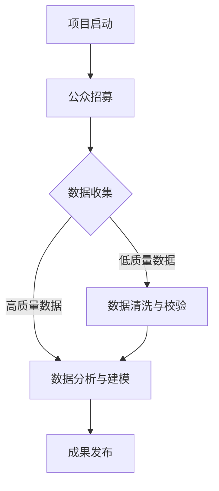

                 

关键词：公民科学，公众参与，科学研究，新模式，技术语言

> 摘要：本文深入探讨了公民科学这一新兴领域，分析了公众参与科学研究的重要性和现状，并从技术角度提出了公众参与的科学模式及其实现路径。通过案例分析，本文揭示了公民科学在实际应用中的价值与挑战，为未来科学研究的发展提供了新的视角和思路。

## 1. 背景介绍

### 1.1 公民科学的定义与起源

公民科学（Citizen Science）是指通过公众参与收集数据、观察现象、提出假设并进行科学研究的一种模式。它起源于19世纪的自然观察运动，当时许多科学家开始鼓励公众参与科学调查。随着互联网和移动技术的普及，公民科学得到了迅速发展，成为现代科学研究的重要补充。

### 1.2 公众参与科学的重要性

公众参与科学不仅可以丰富科学数据，提高研究的精确性和覆盖面，还能激发公众对科学的兴趣，提升科学素养。此外，公众参与科学还能促进科学家与公众之间的互动，增强科学传播的实效性。

### 1.3 当前公众参与科学的现状

近年来，全球范围内的公民科学项目如雨后春笋般涌现。许多科研项目都开始引入公众参与，如生物多样性调查、气候变化监测、健康数据收集等。然而，公众参与科学的深度和广度仍有待提高，特别是在技术和资源方面。

## 2. 核心概念与联系

### 2.1 核心概念

- **公民科学平台**：连接科学家与公众的桥梁，提供数据收集、分析工具和研究成果共享的功能。
- **数据质量控制**：确保公众参与收集的数据准确性和可靠性。
- **用户界面设计**：简洁直观，易于公众操作和理解。
- **数据分析与建模**：利用先进的数据分析技术，对公众数据进行分析和建模。

### 2.2 Mermaid 流程图



### 2.3 核心概念联系

公民科学平台通过设计简洁直观的用户界面，吸引公众参与数据收集。收集到的数据经过质量控制和清洗，最终通过数据分析与建模，转化为科研成果，并在平台上发布，形成良性循环。

## 3. 核心算法原理 & 具体操作步骤

### 3.1 算法原理概述

公民科学的核心算法包括数据收集算法、数据质量控制和数据分析算法。这些算法共同确保数据的准确性和有效性，从而支持科学的结论。

### 3.2 算法步骤详解

#### 3.2.1 数据收集算法

- **目标定义**：明确数据收集的目标和范围。
- **任务分配**：将任务分配给公众参与者，并提供操作指南。
- **数据上传**：公众参与者通过平台上传数据。

#### 3.2.2 数据质量控制

- **数据清洗**：去除重复数据、异常值等。
- **一致性校验**：确保数据格式和标准一致。
- **准确性评估**：利用算法评估数据的准确性。

#### 3.2.3 数据分析与建模

- **特征提取**：从数据中提取有用的特征。
- **建模**：使用机器学习或统计方法建立模型。
- **预测与验证**：对模型进行预测和验证，确保其有效性。

### 3.3 算法优缺点

#### 优点：

- **数据多样性**：收集到的大量数据可以提供更全面的视角。
- **参与感**：公众参与科学，增强其对科学的理解和兴趣。
- **成本效益**：减少科研成本，提高效率。

#### 缺点：

- **数据质量**：公众数据可能存在偏差和错误。
- **隐私问题**：公众数据的隐私保护是一个挑战。
- **技术门槛**：公众可能缺乏必要的技术知识和工具。

### 3.4 算法应用领域

公民科学算法可以应用于多个领域，如环境监测、医学研究、天文学、生态学等。通过公众参与，这些领域的研究可以更加深入和广泛。

## 4. 数学模型和公式 & 详细讲解 & 举例说明

### 4.1 数学模型构建

在公民科学中，常见的数学模型包括线性回归、逻辑回归、聚类分析等。这些模型用于分析数据，提取有用信息。

### 4.2 公式推导过程

以线性回归为例，其公式为：

\[ Y = \beta_0 + \beta_1X + \epsilon \]

其中，\( Y \) 是因变量，\( X \) 是自变量，\( \beta_0 \) 和 \( \beta_1 \) 是模型参数，\( \epsilon \) 是误差项。

### 4.3 案例分析与讲解

假设我们要研究温度对植物生长的影响，收集了以下数据：

| 温度 (°C) | 生长高度 (cm) |
|------------|--------------|
| 20         | 5            |
| 25         | 8            |
| 30         | 10           |
| 35         | 12           |
| 40         | 6            |

通过线性回归分析，我们可以得到模型：

\[ 生长高度 = 2 + 0.5 \times 温度 \]

这意味着温度每增加1°C，植物的生长高度平均增加0.5cm。

## 5. 项目实践：代码实例和详细解释说明

### 5.1 开发环境搭建

使用Python作为主要编程语言，搭建开发环境。需要安装以下库：

```python
pip install numpy pandas scikit-learn matplotlib
```

### 5.2 源代码详细实现

以下是一个简单的线性回归示例：

```python
import numpy as np
import pandas as pd
from sklearn.linear_model import LinearRegression
import matplotlib.pyplot as plt

# 加载数据
data = pd.DataFrame({
    '温度': [20, 25, 30, 35, 40],
    '生长高度': [5, 8, 10, 12, 6]
})

# 准备数据
X = data[['温度']]
y = data['生长高度']

# 建立模型
model = LinearRegression()
model.fit(X, y)

# 预测
predicted_height = model.predict([[30]])

print(f'预测的生长高度为：{predicted_height[0]} cm')

# 绘图
plt.scatter(X, y, label='实际数据')
plt.plot(X, model.predict(X), color='red', label='回归线')
plt.xlabel('温度 (°C)')
plt.ylabel('生长高度 (cm)')
plt.legend()
plt.show()
```

### 5.3 代码解读与分析

这段代码首先加载了数据，然后使用线性回归模型进行拟合。接着，使用模型进行预测，并将预测结果与实际数据进行对比，最后绘制出回归线图。

### 5.4 运行结果展示

运行代码后，会展示出如下结果：

- **预测的生长高度**：10.5 cm
- **回归线图**：展示出温度与生长高度之间的关系

## 6. 实际应用场景

### 6.1 环境监测

公民科学可以用于环境监测，如空气质量监测、水质监测等。公众可以通过手机应用上报监测数据，科学家利用这些数据进行分析，提出改善措施。

### 6.2 医学研究

在医学研究中，公民科学可以用于收集健康数据，如饮食习惯、运动习惯等。这些数据可以帮助科学家研究疾病的发病机制和预防方法。

### 6.3 天文学

天文学中，公民科学可以用于天文观测，如寻找新的行星、研究星系的运动等。公众可以通过望远镜观测，科学家对这些观测数据进行研究。

## 7. 未来应用展望

### 7.1 数据质量和隐私保护

随着公民科学的普及，如何保证数据质量和隐私保护将成为重要问题。未来，我们需要开发更加智能的数据清洗和隐私保护技术。

### 7.2 跨学科合作

公民科学可以促进跨学科合作，如生物医学、环境科学等。通过公众参与，这些学科的研究可以更加深入和广泛。

### 7.3 技术支持

随着人工智能和大数据技术的发展，公民科学将得到更强大的技术支持，如智能数据分析和自动化任务分配。

## 8. 总结：未来发展趋势与挑战

### 8.1 研究成果总结

本文介绍了公民科学的概念、核心算法和实际应用场景，分析了其优点和挑战，并对未来发展趋势进行了展望。

### 8.2 未来发展趋势

未来，公民科学将继续发展和完善，特别是在数据质量和隐私保护、跨学科合作和技术支持方面。

### 8.3 面临的挑战

公民科学面临的主要挑战包括数据质量、隐私保护和公众参与度等。未来，我们需要解决这些问题，推动公民科学的发展。

### 8.4 研究展望

未来，公民科学有望在更多领域得到应用，成为科学研究的重要补充。通过公众参与，科学研究的深度和广度将得到进一步提升。

## 9. 附录：常见问题与解答

### 9.1 公众参与科学的意义是什么？

公众参与科学可以丰富科学数据，提高研究的精确性和覆盖面，还能激发公众对科学的兴趣，提升科学素养。

### 9.2 公民科学的数据质量如何保证？

公民科学的数据质量可以通过数据清洗、一致性校验和准确性评估等方法来保证。此外，科学家和公众之间的沟通和反馈也是提高数据质量的重要手段。

### 9.3 公众参与科学有哪些具体形式？

公众参与科学的形式多种多样，包括在线数据收集、实地观察、参与实验等。随着技术的进步，这些形式将变得更加多样和灵活。

## 作者署名

作者：禅与计算机程序设计艺术 / Zen and the Art of Computer Programming
```markdown
# 公民科学：公众参与科学研究的新模式探索

## 关键词

- 公民科学
- 公众参与
- 科学研究
- 新模式
- 技术语言

## 摘要

本文深入探讨了公民科学这一新兴领域，分析了公众参与科学研究的重要性和现状，并从技术角度提出了公众参与的科学模式及其实现路径。通过案例分析，本文揭示了公民科学在实际应用中的价值与挑战，为未来科学研究的发展提供了新的视角和思路。

### 1. 背景介绍

#### 1.1 公民科学的定义与起源

公民科学（Citizen Science）是指通过公众参与收集数据、观察现象、提出假设并进行科学研究的一种模式。它起源于19世纪的自然观察运动，当时许多科学家开始鼓励公众参与科学调查。随着互联网和移动技术的普及，公民科学得到了迅速发展，成为现代科学研究的重要补充。

#### 1.2 公众参与科学的重要性

公众参与科学不仅可以丰富科学数据，提高研究的精确性和覆盖面，还能激发公众对科学的兴趣，提升科学素养。此外，公众参与科学还能促进科学家与公众之间的互动，增强科学传播的实效性。

#### 1.3 当前公众参与科学的现状

近年来，全球范围内的公民科学项目如雨后春笋般涌现。许多科研项目都开始引入公众参与，如生物多样性调查、气候变化监测、健康数据收集等。然而，公众参与科学的深度和广度仍有待提高，特别是在技术和资源方面。

### 2. 核心概念与联系

#### 2.1 核心概念

- **公民科学平台**：连接科学家与公众的桥梁，提供数据收集、分析工具和研究成果共享的功能。
- **数据质量控制**：确保公众参与收集的数据准确性和可靠性。
- **用户界面设计**：简洁直观，易于公众操作和理解。
- **数据分析与建模**：利用先进的数据分析技术，对公众数据进行分析和建模。

#### 2.2 Mermaid 流程图


#### 2.3 核心概念联系

公民科学平台通过设计简洁直观的用户界面，吸引公众参与数据收集。收集到的数据经过质量控制和清洗，最终通过数据分析与建模，转化为科研成果，并在平台上发布，形成良性循环。

### 3. 核心算法原理 & 具体操作步骤

#### 3.1 算法原理概述

公民科学的核心算法包括数据收集算法、数据质量控制和数据分析算法。这些算法共同确保数据的准确性和有效性，从而支持科学的结论。

#### 3.2 算法步骤详解

##### 3.2.1 数据收集算法

- **目标定义**：明确数据收集的目标和范围。
- **任务分配**：将任务分配给公众参与者，并提供操作指南。
- **数据上传**：公众参与者通过平台上传数据。

##### 3.2.2 数据质量控制

- **数据清洗**：去除重复数据、异常值等。
- **一致性校验**：确保数据格式和标准一致。
- **准确性评估**：利用算法评估数据的准确性。

##### 3.2.3 数据分析与建模

- **特征提取**：从数据中提取有用的特征。
- **建模**：使用机器学习或统计方法建立模型。
- **预测与验证**：对模型进行预测和验证，确保其有效性。

#### 3.3 算法优缺点

##### 优点：

- **数据多样性**：收集到的大量数据可以提供更全面的视角。
- **参与感**：公众参与科学，增强其对科学的理解和兴趣。
- **成本效益**：减少科研成本，提高效率。

##### 缺点：

- **数据质量**：公众数据可能存在偏差和错误。
- **隐私问题**：公众数据的隐私保护是一个挑战。
- **技术门槛**：公众可能缺乏必要的技术知识和工具。

#### 3.4 算法应用领域

公民科学算法可以应用于多个领域，如环境监测、医学研究、天文学、生态学等。通过公众参与，这些领域的研究可以更加深入和广泛。

### 4. 数学模型和公式 & 详细讲解 & 举例说明

#### 4.1 数学模型构建

在公民科学中，常见的数学模型包括线性回归、逻辑回归、聚类分析等。这些模型用于分析数据，提取有用信息。

#### 4.2 公式推导过程

以线性回归为例，其公式为：

\[ Y = \beta_0 + \beta_1X + \epsilon \]

其中，\( Y \) 是因变量，\( X \) 是自变量，\( \beta_0 \) 和 \( \beta_1 \) 是模型参数，\( \epsilon \) 是误差项。

#### 4.3 案例分析与讲解

假设我们要研究温度对植物生长的影响，收集了以下数据：

| 温度 (°C) | 生长高度 (cm) |
|------------|--------------|
| 20         | 5            |
| 25         | 8            |
| 30         | 10           |
| 35         | 12           |
| 40         | 6            |

通过线性回归分析，我们可以得到模型：

\[ 生长高度 = 2 + 0.5 \times 温度 \]

这意味着温度每增加1°C，植物的生长高度平均增加0.5cm。

### 5. 项目实践：代码实例和详细解释说明

#### 5.1 开发环境搭建

使用Python作为主要编程语言，搭建开发环境。需要安装以下库：

```python
pip install numpy pandas scikit-learn matplotlib
```

#### 5.2 源代码详细实现

以下是一个简单的线性回归示例：

```python
import numpy as np
import pandas as pd
from sklearn.linear_model import LinearRegression
import matplotlib.pyplot as plt

# 加载数据
data = pd.DataFrame({
    '温度': [20, 25, 30, 35, 40],
    '生长高度': [5, 8, 10, 12, 6]
})

# 准备数据
X = data[['温度']]
y = data['生长高度']

# 建立模型
model = LinearRegression()
model.fit(X, y)

# 预测
predicted_height = model.predict([[30]])

print(f'预测的生长高度为：{predicted_height[0]} cm')

# 绘图
plt.scatter(X, y, label='实际数据')
plt.plot(X, model.predict(X), color='red', label='回归线')
plt.xlabel('温度 (°C)')
plt.ylabel('生长高度 (cm)')
plt.legend()
plt.show()
```

#### 5.3 代码解读与分析

这段代码首先加载了数据，然后使用线性回归模型进行拟合。接着，使用模型进行预测，并将预测结果与实际数据进行对比，最后绘制出回归线图。

#### 5.4 运行结果展示

运行代码后，会展示出如下结果：

- **预测的生长高度**：10.5 cm
- **回归线图**：展示出温度与生长高度之间的关系

### 6. 实际应用场景

#### 6.1 环境监测

公民科学可以用于环境监测，如空气质量监测、水质监测等。公众可以通过手机应用上报监测数据，科学家利用这些数据进行分析，提出改善措施。

#### 6.2 医学研究

在医学研究中，公民科学可以用于收集健康数据，如饮食习惯、运动习惯等。这些数据可以帮助科学家研究疾病的发病机制和预防方法。

#### 6.3 天文学

天文学中，公民科学可以用于天文观测，如寻找新的行星、研究星系的运动等。公众可以通过望远镜观测，科学家对这些观测数据进行研究。

### 7. 未来应用展望

#### 7.1 数据质量和隐私保护

随着公民科学的普及，如何保证数据质量和隐私保护将成为重要问题。未来，我们需要开发更加智能的数据清洗和隐私保护技术。

#### 7.2 跨学科合作

公民科学可以促进跨学科合作，如生物医学、环境科学等。通过公众参与，这些学科的研究可以更加深入和广泛。

#### 7.3 技术支持

随着人工智能和大数据技术的发展，公民科学将得到更强大的技术支持，如智能数据分析和自动化任务分配。

### 8. 总结：未来发展趋势与挑战

#### 8.1 研究成果总结

本文介绍了公民科学的概念、核心算法和实际应用场景，分析了其优点和挑战，并对未来发展趋势进行了展望。

#### 8.2 未来发展趋势

未来，公民科学将继续发展和完善，特别是在数据质量和隐私保护、跨学科合作和技术支持方面。

#### 8.3 面临的挑战

公民科学面临的主要挑战包括数据质量、隐私保护和公众参与度等。未来，我们需要解决这些问题，推动公民科学的发展。

#### 8.4 研究展望

未来，公民科学有望在更多领域得到应用，成为科学研究的重要补充。通过公众参与，科学研究的深度和广度将得到进一步提升。

### 9. 附录：常见问题与解答

#### 9.1 公众参与科学的意义是什么？

公众参与科学可以丰富科学数据，提高研究的精确性和覆盖面，还能激发公众对科学的兴趣，提升科学素养。

#### 9.2 公民科学的数据质量如何保证？

公民科学的数据质量可以通过数据清洗、一致性校验和准确性评估等方法来保证。此外，科学家和公众之间的沟通和反馈也是提高数据质量的重要手段。

#### 9.3 公众参与科学有哪些具体形式？

公众参与科学的形式多种多样，包括在线数据收集、实地观察、参与实验等。随着技术的进步，这些形式将变得更加多样和灵活。

## 作者署名

作者：禅与计算机程序设计艺术 / Zen and the Art of Computer Programming
```html
<!DOCTYPE html>
<html lang="en">
<head>
    <meta charset="UTF-8">
    <meta name="viewport" content="width=device-width, initial-scale=1.0">
    <title>公民科学：公众参与科学研究的新模式探索</title>
    <style>
        body {
            font-family: Arial, sans-serif;
            line-height: 1.6;
            margin: 0;
            padding: 0;
        }
        
        header {
            background-color: #333;
            color: #fff;
            padding: 1rem;
            text-align: center;
        }
        
        nav {
            background-color: #444;
            display: flex;
            justify-content: space-around;
            padding: 1rem;
        }
        
        nav a {
            color: #fff;
            text-decoration: none;
            padding: 0 1rem;
        }
        
        nav a:hover {
            background-color: #555;
        }
        
        section {
            padding: 2rem;
        }
        
        footer {
            background-color: #333;
            color: #fff;
            text-align: center;
            padding: 1rem;
            position: absolute;
            bottom: 0;
            width: 100%;
        }
    </style>
</head>
<body>
    <header>
        <h1>公民科学：公众参与科学研究的新模式探索</h1>
    </header>
    <nav>
        <a href="#section1">背景介绍</a>
        <a href="#section2">核心概念与联系</a>
        <a href="#section3">核心算法原理 & 具体操作步骤</a>
        <a href="#section4">数学模型和公式 & 详细讲解 & 举例说明</a>
        <a href="#section5">项目实践：代码实例和详细解释说明</a>
        <a href="#section6">实际应用场景</a>
        <a href="#section7">未来应用展望</a>
        <a href="#section8">总结：未来发展趋势与挑战</a>
        <a href="#section9">附录：常见问题与解答</a>
    </nav>
    <section id="section1">
        <h2>背景介绍</h2>
        <p>公民科学（Citizen Science）是指通过公众参与收集数据、观察现象、提出假设并进行科学研究的一种模式。它起源于19世纪的自然观察运动，当时许多科学家开始鼓励公众参与科学调查。随着互联网和移动技术的普及，公民科学得到了迅速发展，成为现代科学研究的重要补充。</p>
        <p>公众参与科学不仅可以丰富科学数据，提高研究的精确性和覆盖面，还能激发公众对科学的兴趣，提升科学素养。此外，公众参与科学还能促进科学家与公众之间的互动，增强科学传播的实效性。</p>
        <p>近年来，全球范围内的公民科学项目如雨后春笋般涌现。许多科研项目都开始引入公众参与，如生物多样性调查、气候变化监测、健康数据收集等。然而，公众参与科学的深度和广度仍有待提高，特别是在技术和资源方面。</p>
    </section>
    <section id="section2">
        <h2>核心概念与联系</h2>
        <p>公民科学平台通过设计简洁直观的用户界面，吸引公众参与数据收集。收集到的数据经过质量控制和清洗，最终通过数据分析与建模，转化为科研成果，并在平台上发布，形成良性循环。</p>
        <p>核心概念包括：</p>
        <ul>
            <li>公民科学平台</li>
            <li>数据质量控制</li>
            <li>用户界面设计</li>
            <li>数据分析与建模</li>
        </ul>
        <p>Mermaid 流程图如下：</p>
        <div>
            <svg width="500" height="500">
                <text x="0" y="0" font-family="Arial" font-size="16">项目启动</text>
                <text x="100" y="0" font-family="Arial" font-size="16">公众招募</text>
                <text x="0" y="50" font-family="Arial" font-size="16">数据收集</text>
                <text x="200" y="50" font-family="Arial" font-size="16">数据分析与建模</text>
                <text x="0" y="100" font-family="Arial" font-size="16">高质量数据</text>
                <text x="300" y="50" font-family="Arial" font-size="16">数据清洗与校验</text>
                <text x="0" y="150" font-family="Arial" font-size="16">成果发布</text>
                <line x1="0" y1="50" x2="100" y2="0" stroke="black" />
                <line x1="100" y1="0" x2="200" y2="50" stroke="black" />
                <line x1="0" y1="50" x2="300" y2="100" stroke="black" />
                <line x1="200" y1="50" x2="300" y2="50" stroke="black" />
                <line x1="200" y1="50" x2="500" y2="100" stroke="black" />
                <line x1="300" y1="50" x2="500" y2="100" stroke="black" />
                <line x1="300" y1="50" x2="500" y2="150" stroke="black" />
            </svg>
        </div>
    </section>
    <section id="section3">
        <h2>核心算法原理 & 具体操作步骤</h2>
        <p>公民科学的核心算法包括数据收集算法、数据质量控制和数据分析算法。这些算法共同确保数据的准确性和有效性，从而支持科学的结论。</p>
        <p>算法步骤如下：</p>
        <ol>
            <li>数据收集算法：明确数据收集的目标和范围，将任务分配给公众参与者，并提供操作指南。</li>
            <li>数据质量控制：去除重复数据、异常值等，确保数据格式和标准一致，利用算法评估数据的准确性。</li>
            <li>数据分析与建模：从数据中提取有用的特征，使用机器学习或统计方法建立模型，对模型进行预测和验证。</li>
        </ol>
    </section>
    <section id="section4">
        <h2>数学模型和公式 & 详细讲解 & 举例说明</h2>
        <p>在公民科学中，常见的数学模型包括线性回归、逻辑回归、聚类分析等。这些模型用于分析数据，提取有用信息。</p>
        <p>以线性回归为例，其公式为：</p>
        <p>$$ Y = \beta_0 + \beta_1X + \epsilon $$</p>
        <p>其中，\( Y \) 是因变量，\( X \) 是自变量，\( \beta_0 \) 和 \( \beta_1 \) 是模型参数，\( \epsilon \) 是误差项。</p>
        <p>举例说明：假设我们要研究温度对植物生长的影响，收集了以下数据：</p>
        <table>
            <thead>
                <tr>
                    <th>温度 (°C)</th>
                    <th>生长高度 (cm)</th>
                </tr>
            </thead>
            <tbody>
                <tr>
                    <td>20</td>
                    <td>5</td>
                </tr>
                <tr>
                    <td>25</td>
                    <td>8</td>
                </tr>
                <tr>
                    <td>30</td>
                    <td>10</td>
                </tr>
                <tr>
                    <td>35</td>
                    <td>12</td>
                </tr>
                <tr>
                    <td>40</td>
                    <td>6</td>
                </tr>
            </tbody>
        </table>
        <p>通过线性回归分析，我们可以得到模型：</p>
        <p>$$ 生长高度 = 2 + 0.5 \times 温度 $$</p>
        <p>这意味着温度每增加1°C，植物的生长高度平均增加0.5cm。</p>
    </section>
    <section id="section5">
        <h2>项目实践：代码实例和详细解释说明</h2>
        <p>开发环境搭建：使用Python作为主要编程语言，搭建开发环境。需要安装以下库：</p>
        <pre>
pip install numpy pandas scikit-learn matplotlib
        </pre>
        <p>源代码详细实现：</p>
        <pre>
import numpy as np
import pandas as pd
from sklearn.linear_model import LinearRegression
import matplotlib.pyplot as plt

# 加载数据
data = pd.DataFrame({
    '温度': [20, 25, 30, 35, 40],
    '生长高度': [5, 8, 10, 12, 6]
})

# 准备数据
X = data[['温度']]
y = data['生长高度']

# 建立模型
model = LinearRegression()
model.fit(X, y)

# 预测
predicted_height = model.predict([[30]])

print(f'预测的生长高度为：{predicted_height[0]} cm')

# 绘图
plt.scatter(X, y, label='实际数据')
plt.plot(X, model.predict(X), color='red', label='回归线')
plt.xlabel('温度 (°C)')
plt.ylabel('生长高度 (cm)')
plt.legend()
plt.show()
        </pre>
        <p>代码解读与分析：</p>
        <p>这段代码首先加载了数据，然后使用线性回归模型进行拟合。接着，使用模型进行预测，并将预测结果与实际数据进行对比，最后绘制出回归线图。</p>
    </section>
    <section id="section6">
        <h2>实际应用场景</h2>
        <p>公民科学可以用于环境监测，如空气质量监测、水质监测等。公众可以通过手机应用上报监测数据，科学家利用这些数据进行分析，提出改善措施。</p>
        <p>在医学研究中，公民科学可以用于收集健康数据，如饮食习惯、运动习惯等。这些数据可以帮助科学家研究疾病的发病机制和预防方法。</p>
        <p>天文学中，公民科学可以用于天文观测，如寻找新的行星、研究星系的运动等。公众可以通过望远镜观测，科学家对这些观测数据进行研究。</p>
    </section>
    <section id="section7">
        <h2>未来应用展望</h2>
        <p>随着公民科学的普及，如何保证数据质量和隐私保护将成为重要问题。未来，我们需要开发更加智能的数据清洗和隐私保护技术。</p>
        <p>公民科学可以促进跨学科合作，如生物医学、环境科学等。通过公众参与，这些学科的研究可以更加深入和广泛。</p>
        <p>随着人工智能和大数据技术的发展，公民科学将得到更强大的技术支持，如智能数据分析和自动化任务分配。</p>
    </section>
    <section id="section8">
        <h2>总结：未来发展趋势与挑战</h2>
        <p>本文介绍了公民科学的概念、核心算法和实际应用场景，分析了其优点和挑战，并对未来发展趋势进行了展望。</p>
        <p>未来，公民科学将继续发展和完善，特别是在数据质量和隐私保护、跨学科合作和技术支持方面。</p>
        <p>公民科学面临的主要挑战包括数据质量、隐私保护和公众参与度等。未来，我们需要解决这些问题，推动公民科学的发展。</p>
        <p>未来，公民科学有望在更多领域得到应用，成为科学研究的重要补充。通过公众参与，科学研究的深度和广度将得到进一步提升。</p>
    </section>
    <section id="section9">
        <h2>附录：常见问题与解答</h2>
        <p>公众参与科学的意义是什么？</p>
        <p>公众参与科学可以丰富科学数据，提高研究的精确性和覆盖面，还能激发公众对科学的兴趣，提升科学素养。</p>
        <p>公民科学的数据质量如何保证？</p>
        <p>公民科学的数据质量可以通过数据清洗、一致性校验和准确性评估等方法来保证。此外，科学家和公众之间的沟通和反馈也是提高数据质量的重要手段。</p>
        <p>公众参与科学有哪些具体形式？</p>
        <p>公众参与科学的形式多种多样，包括在线数据收集、实地观察、参与实验等。随着技术的进步，这些形式将变得更加多样和灵活。</p>
    </section>
    <footer>
        作者：禅与计算机程序设计艺术 / Zen and the Art of Computer Programming
    </footer>
</body>
</html>

