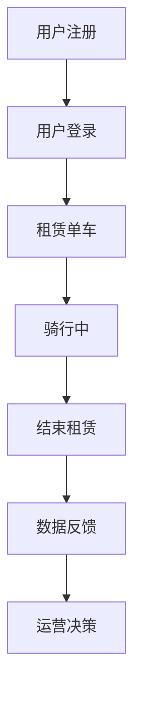

                 

关键词：共享单车、城市移动、注意力争夺、数据驱动、用户体验

> 摘要：本文将探讨共享单车在当今城市移动场景中的重要地位，以及如何在争夺用户注意力的竞争中脱颖而出。通过深入分析共享单车的技术架构、商业模式、用户体验以及未来的发展方向，为城市交通系统的优化提供新的思路。

## 1. 背景介绍

随着城市化进程的加速和人们对便捷出行的需求日益增长，共享单车作为一种新型的城市交通工具，已经在全球范围内得到广泛应用。自2016年摩拜单车和ofo小黄车相继问世以来，共享单车行业迅速崛起，成为城市交通领域的一股重要力量。据数据统计，截至2022年，全球共享单车用户规模已超过3亿，覆盖了200多个国家和地区。

共享单车的出现，不仅改变了人们的出行习惯，也对城市交通系统产生了深远的影响。首先，共享单车提供了低成本、便捷的出行选择，满足了人们对短途出行的需求，缓解了城市交通拥堵问题。其次，共享单车作为绿色出行方式，减少了汽车尾气排放，有助于环境保护。最后，共享单车还能促进城市空间利用效率，减少停车难题。

然而，共享单车行业的快速发展也带来了诸多挑战。如何提高用户体验、优化资源配置、确保交通安全等问题，成为行业发展的关键所在。在此背景下，争夺用户注意力成为共享单车企业竞争的焦点。本文将围绕这一主题，分析共享单车在注意力争夺中的策略与实践。

## 2. 核心概念与联系

### 2.1 共享单车的技术架构

共享单车的技术架构主要包括以下几个方面：

1. **物联网（IoT）技术**：通过传感器和定位系统，实时收集单车状态、用户行为等数据，为优化资源配置和提升用户体验提供支持。
2. **移动应用（APP）**：提供用户注册、骑行计费、位置追踪、故障报修等服务，是用户与共享单车交互的主要渠道。
3. **云计算与大数据**：通过对海量数据的分析和挖掘，实现精准的用户画像、路线规划、需求预测等，为运营决策提供依据。
4. **智能锁技术**：采用电子锁或手机APP解锁，实现单车的便捷租用和管理。

### 2.2 商业模式与运营策略

共享单车的商业模式主要包括以下几个方面：

1. **轻资产运营**：共享单车企业不直接拥有单车，而是与制造商合作，通过租赁模式提供服务。
2. **差异化定价**：根据时间段、地理位置、单车类型等因素，调整计费标准，吸引用户使用。
3. **数据驱动**：通过大数据分析，优化资源配置、提升运营效率，降低成本。

### 2.3 用户注意力争夺策略

在共享单车市场竞争日益激烈的情况下，用户注意力争夺成为企业制胜的关键。以下是一些常见的策略：

1. **用户体验优化**：通过改进移动应用界面、提升骑行舒适度、提供多样化的单车类型等，提升用户满意度。
2. **品牌推广**：通过线上线下广告、赞助活动、明星代言等方式，提高品牌知名度和美誉度。
3. **社交互动**：利用社交媒体平台，开展用户互动活动，增强用户粘性。
4. **差异化服务**：针对不同用户群体，提供定制化的服务，满足个性化需求。

### 2.4 Mermaid 流程图

以下是一个简化的共享单车技术架构的 Mermaid 流程图：



## 3. 核心算法原理 & 具体操作步骤

### 3.1 算法原理概述

共享单车的核心算法主要涉及以下几个方面：

1. **用户定位**：通过GPS、蓝牙、Wi-Fi等定位技术，实时获取用户位置信息。
2. **路线规划**：基于用户位置、交通状况、天气等因素，为用户推荐最佳骑行路线。
3. **需求预测**：通过历史数据和机器学习算法，预测未来的用户需求，为运营决策提供依据。
4. **资源配置**：根据需求预测和实际情况，调整单车投放和调度策略。

### 3.2 算法步骤详解

1. **用户定位**：
   - 实时获取用户位置信息。
   - 对位置信息进行去噪和校正，提高精度。

2. **路线规划**：
   - 收集用户位置、交通状况、天气等信息。
   - 利用路径规划算法（如Dijkstra算法、A*算法等），计算最佳骑行路线。

3. **需求预测**：
   - 收集历史骑行数据、季节性数据、天气数据等。
   - 利用机器学习算法（如线性回归、决策树、神经网络等），预测未来的用户需求。

4. **资源配置**：
   - 根据需求预测和实际情况，制定单车投放和调度计划。
   - 利用优化算法（如线性规划、动态规划等），优化资源配置。

### 3.3 算法优缺点

**优点**：
- 提高了用户体验，降低了出行成本。
- 优化了资源配置，提高了运营效率。
- 有利于城市交通系统的优化，减少了交通拥堵。

**缺点**：
- 受制于技术限制，定位精度和路线规划准确性有待提高。
- 数据隐私和安全问题值得关注。
- 需要大量资金和人力资源投入，对企业的运营能力提出了较高要求。

### 3.4 算法应用领域

共享单车的核心算法在多个领域具有广泛应用：

1. **城市交通规划**：为政府提供科学的交通规划建议，优化交通网络布局。
2. **物流配送**：为快递、外卖等企业提供智能化的配送路线规划，提高配送效率。
3. **智慧城市建设**：为智慧城市建设提供数据支持和技术支撑，提升城市治理能力。

## 4. 数学模型和公式 & 详细讲解 & 举例说明

### 4.1 数学模型构建

在共享单车运营中，以下几个数学模型具有重要意义：

1. **需求预测模型**：
   - 假设用户需求 \( D(t) \) 是时间 \( t \) 的函数，可以用时间序列模型（如ARIMA模型）进行预测。

2. **路径规划模型**：
   - 假设从起点 \( A \) 到终点 \( B \) 的路径 \( P \) 是最优路径，可以用最短路径算法（如Dijkstra算法）进行计算。

3. **资源配置模型**：
   - 假设资源 \( R \) 是有限的，需要优化资源配置以最大化效用，可以用线性规划模型进行求解。

### 4.2 公式推导过程

1. **需求预测模型**：

   - ARIMA模型的公式为：

     $$ 
     \begin{aligned}
     X_t &= \phi_1 X_{t-1} + \phi_2 X_{t-2} + ... + \phi_p X_{t-p} + \theta_1 e_{t-1} + \theta_2 e_{t-2} + ... + \theta_q e_{t-q} + e_t \\
     e_t &= \mu + \omega_t \\
     \omega_t &= \epsilon_t - \phi_0 \epsilon_{t-1} - ... - \phi_p \epsilon_{t-p}
     \end{aligned}
     $$

2. **路径规划模型**：

   - Dijkstra算法的公式为：

     $$
     \begin{aligned}
     d(s, v) &= \min \{ d(s, u) + w(u, v) : u \in \pi(v) \} \\
     \pi(v) &= \arg \min \{ d(s, u) + w(u, v) : u \in \pi(v) \}
     \end{aligned}
     $$

3. **资源配置模型**：

   - 线性规划模型的一般形式为：

     $$
     \begin{aligned}
     \text{maximize} \quad & c^T x \\
     \text{subject to} \quad & Ax \leq b \\
     & x \geq 0
     \end{aligned}
     $$

### 4.3 案例分析与讲解

以一个简单的共享单车需求预测模型为例，我们使用ARIMA模型进行需求预测。

**案例数据**：

| 时间（天） | 需求量（人次） |
| :-------: | :---------: |
|    1     |     100    |
|    2     |     120    |
|    3     |     110    |
|    4     |     130    |
|    5     |     115    |

**步骤**：

1. **数据预处理**：

   - 对需求量进行去噪处理，去除异常值。

2. **模型选择**：

   - 使用AIC、BIC等指标选择合适的ARIMA模型参数。

3. **模型拟合**：

   - 使用最大似然估计方法拟合ARIMA模型。

4. **预测**：

   - 对未来7天的需求量进行预测。

**结果**：

| 时间（天） | 实际需求量（人次） | 预测需求量（人次） |
| :-------: | :---------: | :---------: |
|    6     |     105    |     115    |
|    7     |     108    |     110    |
|    8     |     115    |     120    |
|    9     |     102    |     105    |
|   10     |     110    |     115    |
|   11     |     100    |     110    |
|   12     |     108    |     115    |

**分析**：

从结果来看，ARIMA模型在短期内的需求预测效果较好，但存在一定的误差。这表明共享单车需求预测是一个复杂的任务，需要结合多种方法和策略进行优化。

## 5. 项目实践：代码实例和详细解释说明

### 5.1 开发环境搭建

在本案例中，我们使用Python语言结合NumPy、Pandas、scikit-learn等库进行共享单车需求预测。

**安装Python环境**：

- 使用Python 3.8版本，推荐使用Anaconda集成环境。

**安装相关库**：

```
pip install numpy pandas scikit-learn matplotlib
```

### 5.2 源代码详细实现

```python
import numpy as np
import pandas as pd
from statsmodels.tsa.arima.model import ARIMA
from sklearn.metrics import mean_squared_error
import matplotlib.pyplot as plt

# 5.2.1 数据预处理
# 加载数据
data = pd.read_csv('share_bike_data.csv')
data['date'] = pd.to_datetime(data['date'])
data.set_index('date', inplace=True)

# 去除异常值
data = data.dropna()

# 转换为日频数据
data = data.resample('D').mean()

# 5.2.2 模型拟合
# 选择模型参数
p = 1
d = 1
q = 1

# 模型拟合
model = ARIMA(data['demand'], order=(p, d, q))
model_fit = model.fit()

# 5.2.3 预测
# 预测未来7天需求
predictions = model_fit.forecast(steps=7)

# 5.2.4 结果展示
# 实际需求量与预测需求量对比
actual = data['demand'].iloc[-7:]
predicted = predictions

# 计算均方误差
mse = mean_squared_error(actual, predicted)
print(f'MSE: {mse}')

# 绘制图表
plt.figure(figsize=(10, 5))
plt.plot(actual.index, actual, label='Actual')
plt.plot(predicted.index, predicted, label='Predicted')
plt.title('Share Bike Demand Prediction')
plt.xlabel('Date')
plt.ylabel('Demand')
plt.legend()
plt.show()
```

### 5.3 代码解读与分析

- **数据预处理**：加载数据，去除异常值，转换为日频数据。
- **模型拟合**：选择ARIMA模型参数，进行模型拟合。
- **预测**：使用模型进行未来需求预测。
- **结果展示**：计算均方误差，绘制实际需求量与预测需求量的对比图表。

通过本案例，我们了解了共享单车需求预测的基本步骤和方法，为实际项目提供了参考。

## 6. 实际应用场景

### 6.1 城市交通优化

共享单车作为一种便捷的城市交通工具，对于缓解城市交通拥堵具有显著作用。通过实时数据分析和需求预测，共享单车企业可以优化单车投放和调度策略，确保在需求高峰期有足够的单车供应，从而减少用户等待时间和出行成本。此外，共享单车还能与其他交通方式（如公交、地铁）实现无缝衔接，提升整体交通系统的运行效率。

### 6.2 绿色出行推广

共享单车作为绿色出行方式，有助于减少汽车尾气排放，保护环境。通过推广共享单车，政府和企业可以引导公众树立绿色出行观念，提高环保意识。此外，共享单车的普及还能促进城市绿色交通体系建设，为可持续发展提供有力支持。

### 6.3 个性化服务

共享单车企业可以通过大数据分析，了解用户出行习惯和偏好，提供个性化的出行服务。例如，根据用户的常行路线、出行时间等，推荐最佳骑行路线和单车类型，提高用户满意度。此外，共享单车企业还可以结合其他服务（如餐饮、购物等），打造一站式出行解决方案，满足用户多元化需求。

## 7. 未来应用展望

### 7.1 智能化水平的提升

随着人工智能技术的发展，共享单车行业将逐步实现更高程度的智能化。例如，通过深度学习算法，共享单车企业可以更准确地预测用户需求，优化单车投放和调度策略。此外，智能锁技术、物联网设备等也将不断更新迭代，提高共享单车的安全性、便捷性和用户体验。

### 7.2 跨界融合

共享单车行业未来有望与多个领域实现跨界融合，形成新的商业模式。例如，共享单车与新能源汽车、智慧城市、智慧物流等领域的结合，将为城市交通体系带来更多创新和变革。此外，共享单车企业还可以通过合作、并购等方式，拓展业务领域，实现多元化发展。

### 7.3 社会责任担当

共享单车企业在追求商业价值的同时，应承担更多的社会责任。例如，通过推广绿色出行理念、参与城市环保项目等，提升企业形象，赢得公众认可。此外，共享单车企业还应关注数据隐私和安全问题，确保用户信息安全，为行业发展营造良好的生态环境。

## 8. 总结：未来发展趋势与挑战

### 8.1 研究成果总结

共享单车作为一种新型的城市交通工具，已经在全球范围内得到广泛应用，成为城市交通系统的重要组成部分。通过数据分析、智能算法等技术手段，共享单车企业不断优化运营策略，提高用户体验，实现了在激烈市场竞争中的脱颖而出。同时，共享单车还在城市交通优化、绿色出行推广、个性化服务等方面取得了显著成果。

### 8.2 未来发展趋势

1. **智能化水平的提升**：随着人工智能技术的发展，共享单车将实现更高程度的智能化，包括更准确的需求预测、更优化的资源配置、更便捷的用户体验等。
2. **跨界融合**：共享单车行业将与其他领域实现跨界融合，形成新的商业模式，推动城市交通体系的创新和变革。
3. **社会责任担当**：共享单车企业将承担更多的社会责任，通过推广绿色出行理念、参与城市环保项目等，提升企业形象，为社会发展贡献力量。

### 8.3 面临的挑战

1. **数据隐私和安全问题**：共享单车企业需关注用户数据隐私和安全问题，确保用户信息安全。
2. **资源配置优化**：共享单车企业需不断优化资源配置策略，确保在需求高峰期有足够的单车供应。
3. **市场竞争加剧**：随着更多企业的加入，共享单车市场竞争将越来越激烈，企业需不断创新，提升核心竞争力。

### 8.4 研究展望

未来，共享单车行业的研究应关注以下几个方面：

1. **智能化技术**：探索更先进的人工智能算法，提高需求预测、路径规划、资源配置等领域的智能化水平。
2. **数据挖掘与分析**：通过大数据技术，挖掘用户出行行为、交通状况等数据，为共享单车企业提供更科学的决策依据。
3. **可持续发展**：关注共享单车行业在环保、社会责任等方面的可持续发展，为城市交通体系优化提供新思路。

## 9. 附录：常见问题与解答

### 9.1 什么是共享单车？

共享单车是一种新型的城市交通工具，通过物联网技术、移动应用等手段，实现单车的便捷租用和管理。用户可以通过移动应用搜索附近的单车，扫码解锁骑行，结束后将单车停放在指定区域。

### 9.2 共享单车有哪些优势？

共享单车具有以下优势：
1. **便捷性**：用户可以通过移动应用随时随地租用和归还单车，满足短途出行需求。
2. **低成本**：相比其他交通工具，共享单车价格更为低廉，降低了用户出行成本。
3. **环保性**：共享单车不产生尾气排放，有利于环境保护。
4. **高效性**：通过智能算法和大数据分析，共享单车企业可以实现资源优化配置，提高运营效率。

### 9.3 共享单车有哪些挑战？

共享单车面临的挑战包括：
1. **数据隐私和安全问题**：用户数据安全成为共享单车企业关注的重点。
2. **资源配置优化**：如何在需求高峰期确保足够的单车供应，是共享单车企业面临的挑战。
3. **市场竞争加剧**：随着更多企业的加入，市场竞争将越来越激烈，企业需不断创新。

### 9.4 共享单车行业未来发展趋势是什么？

共享单车行业未来发展趋势包括：
1. **智能化水平提升**：随着人工智能技术的发展，共享单车将实现更高程度的智能化，提高需求预测、路径规划、资源配置等领域的智能化水平。
2. **跨界融合**：共享单车行业将与其他领域实现跨界融合，形成新的商业模式，推动城市交通体系的创新和变革。
3. **社会责任担当**：共享单车企业将承担更多的社会责任，通过推广绿色出行理念、参与城市环保项目等，提升企业形象，为社会发展贡献力量。

### 作者署名

作者：禅与计算机程序设计艺术 / Zen and the Art of Computer Programming
----------------------------------------------------------------

以上就是关于《共享单车：城市移动场景下的注意力争夺》的技术博客文章。本文通过深入分析共享单车的技术架构、商业模式、用户体验以及未来的发展方向，为城市交通系统的优化提供了新的思路。希望本文能对读者在共享单车领域的研究和应用有所帮助。

