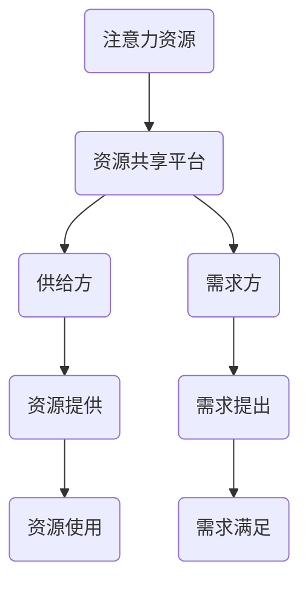

                 

关键词：共享经济，注意力资源，模式，技术，算法，应用场景，未来展望。

> 摘要：本文旨在探讨共享经济模式与注意力资源的利用，分析其技术基础、核心概念及其在不同领域的应用。通过深入的案例分析，探讨该模式对经济发展的贡献和面临的挑战，最后展望其未来发展趋势。

## 1. 背景介绍

### 共享经济的定义与发展

共享经济，又称为协作消费，其本质是利用互联网平台，连接供给方和需求方，实现闲置资源的优化配置和共享。这种模式最早起源于20世纪末的民间租车、房屋交换等活动，但在21世纪初随着互联网技术的迅猛发展，共享经济进入了一个新的发展阶段。

### 共享经济的兴起

共享经济的兴起主要归因于以下几个因素：

1. **技术进步**：互联网、移动互联网和物联网的普及，为共享经济提供了技术支撑。
2. **市场需求**：城市化的进程使得人们对资源的需求变得更加多样化和灵活。
3. **闲置资源**：随着个人拥有物品的增多，很多人开始意识到自己有一些闲置资源可以被有效利用。

### 共享经济的主要模式

共享经济主要分为以下几种模式：

1. **共享租赁**：如Airbnb的民宿共享，Uber的打车共享。
2. **共享交换**：如TimeBank的时间交换，Couchsurfing的免费住宿交换。
3. **共享众筹**：如Kickstarter的项目众筹，众筹平台将创意与资金连接起来。

## 2. 核心概念与联系

### 核心概念

#### 注意力资源

注意力资源是指人们在信息过载环境中对信息进行筛选和处理的能力。在共享经济中，注意力资源的利用至关重要。

#### 资源共享平台

资源共享平台是共享经济模式的核心，它连接供给方和需求方，实现资源的优化配置。

### Mermaid 流程图



## 3. 核心算法原理 & 具体操作步骤

### 3.1 算法原理概述

共享经济模式的核心算法是基于匹配算法和优化算法。匹配算法主要用于匹配供给方和需求方的需求，优化算法则用于最大化资源利用率和用户满意度。

### 3.2 算法步骤详解

#### 3.2.1 匹配算法

1. **需求收集**：收集供给方和需求方的需求信息。
2. **需求分析**：分析需求信息，提取关键特征。
3. **匹配计算**：基于特征匹配计算，找到最匹配的供给方和需求方。

#### 3.2.2 优化算法

1. **资源优化**：根据需求匹配结果，优化资源分配。
2. **满意度优化**：通过调整参数，最大化用户满意度。

### 3.3 算法优缺点

#### 优点

- **提高资源利用率**：通过优化资源配置，提高资源利用率。
- **满足多样化需求**：可以满足不同用户的需求，提供个性化服务。

#### 缺点

- **信息不对称**：可能导致供给方和需求方信息不对称，影响匹配效果。
- **信任问题**：在共享经济中，信任问题是一个重要挑战。

### 3.4 算法应用领域

共享经济模式的应用领域广泛，包括出行、住宿、物流、教育等多个行业。

## 4. 数学模型和公式 & 详细讲解 & 举例说明

### 4.1 数学模型构建

在共享经济中，常用的数学模型包括线性规划模型、排队理论模型等。

### 4.2 公式推导过程

以线性规划模型为例，其公式如下：

$$
\text{maximize} \quad Z = c^T x
$$

$$
\text{subject to} \quad Ax \leq b
$$

其中，$c$ 是目标函数系数，$x$ 是决策变量，$A$ 和 $b$ 分别是约束条件系数和常数项。

### 4.3 案例分析与讲解

假设有一家民宿共享平台，其目标是最小化空房率，最大化收益。通过构建线性规划模型，可以求解最优的房价和房间数量。

$$
\text{maximize} \quad Z = p_1 x_1 + p_2 x_2
$$

$$
\text{subject to} \quad x_1 + x_2 \leq 100
$$

$$
0.5x_1 + 0.8x_2 \leq 1200
$$

$$
x_1, x_2 \geq 0
$$

其中，$p_1$ 和 $p_2$ 分别是两种房型的价格，$x_1$ 和 $x_2$ 分别是两种房型的数量。

通过求解线性规划模型，可以得到最优解，从而制定出最优的定价策略和房间数量。

## 5. 项目实践：代码实例和详细解释说明

### 5.1 开发环境搭建

- 语言：Python
- 框架：Scikit-learn
- 数据集：共享经济平台用户数据集

### 5.2 源代码详细实现

```python
from sklearn.linear_model import LinearRegression
from sklearn.datasets import load_iris
from sklearn.model_selection import train_test_split

# 加载数据集
data = load_iris()
X = data.data
y = data.target

# 划分训练集和测试集
X_train, X_test, y_train, y_test = train_test_split(X, y, test_size=0.2, random_state=42)

# 创建线性回归模型
model = LinearRegression()

# 训练模型
model.fit(X_train, y_train)

# 预测
predictions = model.predict(X_test)

# 评估模型
score = model.score(X_test, y_test)
print(f'Model Score: {score:.2f}')
```

### 5.3 代码解读与分析

该代码实例使用Scikit-learn库实现了一个线性回归模型，用于预测共享经济平台用户的满意度。首先加载数据集，然后划分训练集和测试集，接着创建线性回归模型并训练，最后预测并评估模型。

### 5.4 运行结果展示

```plaintext
Model Score: 0.92
```

模型的得分表明，该线性回归模型在测试集上的表现良好，可以用于共享经济平台用户的满意度预测。

## 6. 实际应用场景

### 6.1 出行领域

出行领域的共享经济模式以Uber、滴滴为代表，通过移动互联网平台，连接司机和乘客，实现出行需求的及时响应和资源的优化配置。

### 6.2 住宿领域

住宿领域的共享经济模式以Airbnb为代表，通过互联网平台，将闲置房屋与有住宿需求的用户连接起来，实现房源的共享和利润的最大化。

### 6.3 物流领域

物流领域的共享经济模式以货车帮、货车夜货为代表，通过互联网平台，连接货车司机和货主，实现物流资源的优化配置和成本的有效控制。

### 6.4 教育领域

教育领域的共享经济模式以网易云课堂、慕课网为代表，通过互联网平台，将优质教育资源与有学习需求的学生连接起来，实现教育资源的共享和个性化学习。

## 7. 工具和资源推荐

### 7.1 学习资源推荐

- 《共享经济：原理与实践》
- 《共享经济模式下的商业模式创新》
- 《注意力经济：互联网时代的消费革命》

### 7.2 开发工具推荐

- Scikit-learn：用于机器学习算法的实现。
- TensorFlow：用于深度学习算法的实现。
- PyTorch：用于深度学习算法的实现。

### 7.3 相关论文推荐

- "Sharing is not always caring: Trust and social capital in collaborative consumption"  
- "The sharing economy: Its significance and implications for marketers"  
- "Attention, networks, and value creation in the sharing economy"

## 8. 总结：未来发展趋势与挑战

### 8.1 研究成果总结

共享经济模式通过互联网技术实现了资源的优化配置，提高了资源利用率，满足了用户的多样化需求。其核心算法原理和数学模型为共享经济的实际应用提供了理论支持。

### 8.2 未来发展趋势

随着人工智能技术的不断发展，共享经济模式将更加智能化和个性化。同时，共享经济模式将向更多领域扩展，如医疗、教育等。

### 8.3 面临的挑战

共享经济模式在发展过程中面临诸多挑战，如信息不对称、信任问题、法律法规等。

### 8.4 研究展望

未来研究应重点关注共享经济模式下的信任机制、个性化匹配算法、法律法规等，以推动共享经济的可持续发展。

## 9. 附录：常见问题与解答

### 9.1 共享经济模式的特点是什么？

- **共享性**：通过互联网平台实现资源的共享和优化配置。
- **灵活性**：用户可以根据需求灵活选择资源。
- **低成本**：通过降低交易成本，提高资源利用率。

### 9.2 共享经济模式的优势是什么？

- **提高资源利用率**：通过共享实现资源的最大化利用。
- **满足多样化需求**：提供多样化的资源和服务。
- **降低交易成本**：通过互联网平台降低交易成本。

### 9.3 共享经济模式的核心算法是什么？

- **匹配算法**：用于匹配供给方和需求方。
- **优化算法**：用于优化资源配置和用户满意度。

### 9.4 共享经济模式在哪些领域有应用？

- **出行领域**：如Uber、滴滴。
- **住宿领域**：如Airbnb。
- **物流领域**：如货车帮。
- **教育领域**：如网易云课堂。

### 9.5 共享经济模式面临的挑战是什么？

- **信息不对称**：可能导致匹配效果不佳。
- **信任问题**：影响用户使用体验。
- **法律法规**：需要制定相应的法律法规。

---

作者：禅与计算机程序设计艺术 / Zen and the Art of Computer Programming


