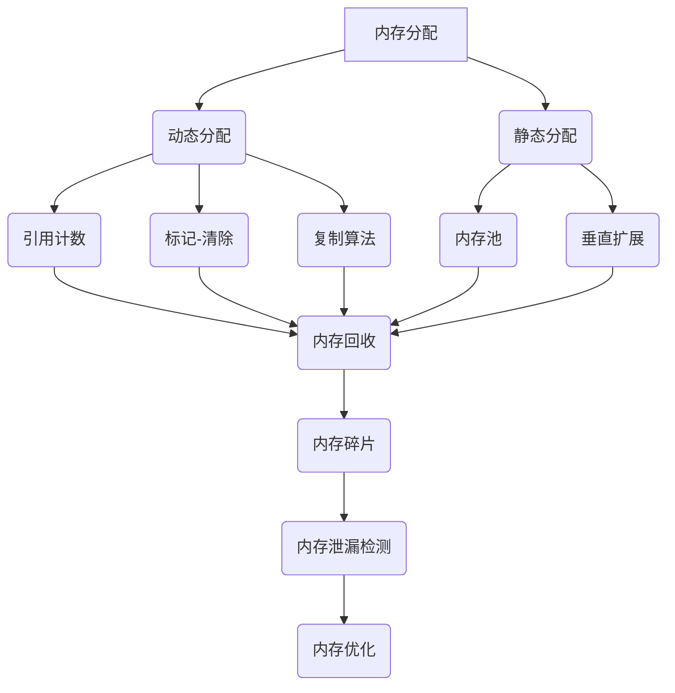

                 

关键词：内存管理、垃圾回收、内存泄漏检测、内存分配、内存释放、内存碎片、内存利用率、内存分配策略、内存优化

## 摘要

本文将深入探讨计算机内存管理的两个核心方面：垃圾回收和内存泄漏检测。内存管理是计算机系统性能的关键因素，而有效的内存回收与泄漏检测机制对于系统的稳定运行和资源利用率至关重要。本文首先介绍内存管理的基本概念，随后详细阐述垃圾回收算法的原理与实现，最后分析内存泄漏检测的方法及其在实际应用中的重要性。通过本文的阅读，读者将对内存管理的核心技术有更深入的理解。

## 1. 背景介绍

### 内存管理的重要性

内存管理是操作系统中的一个核心功能，直接关系到计算机系统的性能和稳定性。在计算机系统中，内存（RAM）是用于临时存储程序和数据的关键资源。内存管理的好坏直接影响系统的响应速度、吞吐量和资源利用率。不当的内存管理会导致内存碎片、内存泄漏等问题，严重时甚至可能引起系统崩溃。

### 内存泄漏与内存溢出

内存泄漏（Memory Leak）指的是程序中动态分配的内存未被正确释放，导致内存逐渐耗尽的现象。内存泄漏通常是编程错误或设计缺陷导致的。随着时间的推移，未释放的内存会越来越多，最终导致系统资源耗尽。

内存溢出（Memory Overflow）则是指程序试图访问超过其分配的内存范围，导致程序崩溃或异常行为。内存溢出通常是由于数组越界、指针错误等引起的。

### 内存泄漏的常见原因

内存泄漏的常见原因包括：

- 指针错误：指针未正确初始化或错误地指向已释放的内存。
- 循环引用：两个或多个对象互相引用，导致它们的内存无法被垃圾回收器回收。
- 动态分配资源未释放：如C语言中的malloc和free函数，如果分配后未正确释放，会导致内存泄漏。

### 内存泄漏的危害

内存泄漏的危害主要体现在以下几个方面：

- 资源耗尽：随着时间的推移，内存泄漏会导致系统可用内存逐渐减少，最终可能导致系统崩溃。
- 性能下降：内存泄漏会占用系统资源，导致系统性能下降，响应速度变慢。
- 稳定性下降：内存泄漏可能导致程序崩溃或其他异常行为，影响系统的稳定性。

## 2. 核心概念与联系

### 内存分配与释放

内存分配（Memory Allocation）是程序运行时动态获取内存的过程。内存释放（Memory Deallocation）则是将不再使用的内存归还给系统。内存分配和释放是内存管理的两个基本操作。

### 垃圾回收（Garbage Collection）

垃圾回收（Garbage Collection，GC）是一种自动内存管理机制，用于回收不再使用的内存。垃圾回收器通过跟踪对象的使用情况，识别并回收未引用的对象。垃圾回收可以减少内存泄漏的风险，提高内存利用率。

### 内存泄漏检测

内存泄漏检测（Memory Leak Detection）是指通过工具或算法检测程序中的内存泄漏。内存泄漏检测可以在开发阶段或运行时进行，有助于发现和修复内存泄漏问题。

### 内存碎片（Memory Fragmentation）

内存碎片是指内存中的空闲区域分散不连续，导致无法分配大块连续内存的问题。内存碎片会降低内存利用率，影响系统性能。

### 内存分配策略

内存分配策略（Memory Allocation Policy）是指操作系统或程序在分配内存时采用的算法。常见的内存分配策略包括固定分配、动态分配、内存池等。

### 内存利用率（Memory Utilization）

内存利用率是指内存的实际使用率与总可用内存的比例。高内存利用率表明内存资源得到了充分利用，但过高的利用率可能导致内存碎片和性能下降。

### 内存优化（Memory Optimization）

内存优化是指通过改进内存管理策略和算法，提高内存利用率和系统性能。内存优化包括减少内存泄漏、消除内存碎片、优化内存分配策略等。

## 2.1 内存管理的基本概念

### 内存分配

内存分配是指程序运行时从操作系统或内存池中申请内存的过程。内存分配通常分为静态分配和动态分配。

- 静态分配：在编译时确定内存大小，并在程序运行期间保持不变。静态分配适用于内存需求稳定且已知的情况。
- 动态分配：在程序运行时根据需要动态申请和释放内存。动态分配适用于内存需求变化较大的情况。

### 内存释放

内存释放是指程序不再需要内存时将其归还给系统。内存释放通常通过释放指针或调用释放函数实现。

- 自动释放：某些编程语言如Java和Python提供了自动内存管理机制，当对象不再被引用时，系统会自动释放内存。
- 手动释放：C和C++等语言需要手动管理内存，通过调用释放函数如free或delete来释放内存。

### 垃圾回收

垃圾回收是一种自动内存管理机制，通过跟踪对象的使用情况，识别并回收未引用的对象。垃圾回收的主要目标是减少内存泄漏和内存碎片，提高内存利用率。

垃圾回收的基本原理包括以下步骤：

1. 引用计数：通过跟踪对象的引用次数来识别可回收的对象。当引用次数为零时，对象被认为是无用的，可以被回收。
2. 标记-清除：通过标记未引用的对象并进行回收。标记-清除分为两个阶段：标记阶段和清除阶段。
3. 复制算法：通过移动活的对象到内存的一侧，回收死亡的对象所占用的空间。复制算法分为两种：半区复制和全复制。
4. 分代收集：将对象分为新生代和老年代，分别采用不同的垃圾回收策略。新生代对象通常采用快速回收策略，而老年代对象则采用更耗时的回收策略。

### 内存泄漏检测

内存泄漏检测是指通过工具或算法检测程序中的内存泄漏。内存泄漏检测的方法包括：

1. 内存泄漏追踪工具：如Valgrind和AddressSanitizer，可以在运行时检测内存泄漏。
2. 定时检查：通过周期性地检查内存占用情况，发现异常增长，从而推测可能存在内存泄漏。
3. 代码审查：通过审查代码，查找可能引起内存泄漏的编程错误或设计缺陷。

### 内存碎片

内存碎片是指内存中的空闲区域分散不连续，导致无法分配大块连续内存的问题。内存碎片会降低内存利用率，影响系统性能。

内存碎片的原因包括：

1. 内存分配和释放的随机性：分配和释放内存时，系统会创建不连续的空闲区域。
2. 内存需求变化：程序在运行过程中，内存需求会不断变化，导致内存碎片产生。

### 内存分配策略

内存分配策略是指操作系统或程序在分配内存时采用的算法。常见的内存分配策略包括：

1. 固定分配：在程序编译时确定内存大小，并在运行期间保持不变。
2. 动态分配：在程序运行时根据需要动态申请和释放内存。
3. 内存池：预先分配一大块内存，然后在需要时从内存池中分配小块内存，减少碎片。
4. 垂直扩展：通过向上扩展内存区域来分配内存，减少碎片。

### 内存利用率

内存利用率是指内存的实际使用率与总可用内存的比例。高内存利用率表明内存资源得到了充分利用，但过高的利用率可能导致内存碎片和性能下降。

### 内存优化

内存优化是指通过改进内存管理策略和算法，提高内存利用率和系统性能。内存优化包括：

1. 减少内存泄漏：通过检测和修复内存泄漏，提高内存利用率。
2. 消除内存碎片：通过优化内存分配策略，减少内存碎片。
3. 优化内存分配策略：选择合适的内存分配策略，提高内存利用率。

## 2.2 内存管理的 Mermaid 流程图

以下是一个简化的内存管理 Mermaid 流程图，展示了内存分配、释放、垃圾回收和内存泄漏检测的基本过程。



### 2.3 内存管理流程

以下是内存管理的基本流程，包括内存分配、垃圾回收和内存泄漏检测：

1. **内存分配**：程序运行时需要内存，系统根据内存分配策略进行内存分配。
2. **内存释放**：不再使用的内存被释放，归还给系统。
3. **垃圾回收**：垃圾回收器定期运行，回收未引用的对象。
4. **内存泄漏检测**：内存泄漏检测工具或算法检查程序中的内存泄漏。
5. **内存优化**：通过改进内存管理策略和算法，提高内存利用率和系统性能。

### 2.4 内存管理中的核心算法

内存管理中的核心算法包括垃圾回收算法和内存泄漏检测算法。以下将分别介绍这些算法的原理和实现。

#### 2.4.1 垃圾回收算法

**引用计数法**：

引用计数法是一种简单的垃圾回收算法。每个对象都有一个引用计数器，记录指向该对象的引用次数。当引用次数为零时，对象被视为无用的，可以被回收。

- **优点**：实现简单，回收速度快。
- **缺点**：无法解决循环引用问题。

**标记-清除法**：

标记-清除法是一种常用的垃圾回收算法。该算法分为两个阶段：标记阶段和清除阶段。

- **标记阶段**：垃圾回收器遍历所有对象，标记所有可达的对象。
- **清除阶段**：垃圾回收器遍历所有对象，删除所有未被标记的对象。

- **优点**：可以解决循环引用问题。
- **缺点**：需要额外的内存空间存储标记信息，回收过程可能比较耗时。

**复制算法**：

复制算法通过移动活的对象到内存的一侧，回收死亡的对象所占用的空间。

- **半区复制**：将内存分为两个半区，每次只复制一个半区。
- **全复制**：每次复制整个内存空间。

- **优点**：回收速度快，可以减少内存碎片。
- **缺点**：需要额外的内存空间。

**分代收集法**：

分代收集法将对象分为新生代和老年代，分别采用不同的垃圾回收策略。

- **新生代**：采用快速回收策略，如复制算法。
- **老年代**：采用更耗时的回收策略，如标记-清除法。

- **优点**：可以减少停顿时间，提高系统性能。
- **缺点**：需要额外的内存空间。

#### 2.4.2 内存泄漏检测算法

内存泄漏检测算法主要用于检测程序中的内存泄漏。以下介绍几种常见的内存泄漏检测算法：

**静态代码分析**：

静态代码分析通过分析程序源代码，查找可能引起内存泄漏的编程错误或设计缺陷。例如，未释放的动态分配内存、未初始化的指针等。

- **优点**：可以在开发阶段发现内存泄漏，降低开发成本。
- **缺点**：无法检测运行时发生的内存泄漏。

**动态内存跟踪**：

动态内存跟踪通过运行程序时记录内存分配和释放的情况，检测内存泄漏。例如，可以使用内存泄漏检测工具如Valgrind进行动态跟踪。

- **优点**：可以检测运行时发生的内存泄漏，提高内存利用率。
- **缺点**：可能影响程序的性能。

**内存分配器检查**：

内存分配器检查通过检查内存分配器中的数据结构，检测内存泄漏。例如，使用C++的智能指针机制，可以自动检查内存泄漏。

- **优点**：简单有效，无需修改源代码。
- **缺点**：可能影响程序的运行性能。

## 3. 核心算法原理 & 具体操作步骤

### 3.1 垃圾回收算法原理概述

垃圾回收（Garbage Collection，GC）是一种自动内存管理机制，用于回收不再使用的内存。垃圾回收通过跟踪对象的使用情况，识别并回收未引用的对象。以下是几种常见的垃圾回收算法：

1. 引用计数法
2. 标记-清除法
3. 复制算法
4. 分代收集法

每种算法都有其优点和缺点，适用于不同的场景。

### 3.2 垃圾回收算法步骤详解

#### 引用计数法

引用计数法的步骤如下：

1. **初始化**：为每个对象分配引用计数器，初始值为1。
2. **引用增加**：每增加一个引用，引用计数器加1。
3. **引用减少**：每减少一个引用，引用计数器减1。
4. **垃圾回收**：当引用计数器为零时，回收该对象。

#### 标记-清除法

标记-清除法的步骤如下：

1. **标记阶段**：垃圾回收器遍历所有对象，标记所有可达的对象。
2. **清除阶段**：垃圾回收器遍历所有对象，删除所有未被标记的对象。

#### 复制算法

复制算法的步骤如下：

1. **初始化**：将内存分为两个半区或一个区域。
2. **选择半区**：每次只复制一个半区。
3. **复制阶段**：将活的对象复制到目标半区或区域。
4. **回收阶段**：回收源半区或区域中死亡的对象。

#### 分代收集法

分代收集法的步骤如下：

1. **初始化**：将对象分为新生代和老年代。
2. **新生代回收**：采用快速回收策略，如复制算法。
3. **老年代回收**：采用更耗时的回收策略，如标记-清除法。
4. **晋升**：将新生代中的存活对象晋升到老年代。

### 3.3 垃圾回收算法优缺点

**引用计数法**

- **优点**：实现简单，回收速度快。
- **缺点**：无法解决循环引用问题。

**标记-清除法**

- **优点**：可以解决循环引用问题。
- **缺点**：需要额外的内存空间存储标记信息，回收过程可能比较耗时。

**复制算法**

- **优点**：回收速度快，可以减少内存碎片。
- **缺点**：需要额外的内存空间。

**分代收集法**

- **优点**：可以减少停顿时间，提高系统性能。
- **缺点**：需要额外的内存空间。

### 3.4 垃圾回收算法应用领域

垃圾回收算法广泛应用于各种编程语言和系统中，以下是一些典型应用领域：

1. **Java**：Java虚拟机（JVM）采用分代收集法进行垃圾回收。
2. **C#**：.NET框架采用垃圾回收算法进行内存管理。
3. **Python**：Python使用引用计数法和标记-清除法进行垃圾回收。
4. **JavaScript**：V8引擎使用分代收集法进行垃圾回收。
5. **操作系统**：现代操作系统如Linux和Windows使用垃圾回收算法管理内存。

## 4. 数学模型和公式 & 详细讲解 & 举例说明

### 4.1 数学模型构建

在内存管理中，垃圾回收算法的效率可以通过数学模型来衡量。以下是一个简化的垃圾回收效率模型：

- **E**：垃圾回收效率
- **N**：系统中对象的总数
- **L**：垃圾回收器需要处理的垃圾对象数

效率模型的基本公式如下：

\[ E = \frac{N - L}{N} \]

### 4.2 公式推导过程

为了推导这个公式，我们需要考虑以下几个因素：

1. **总对象数** \( N \)：系统中当前存在的对象总数。
2. **垃圾对象数** \( L \)：需要被垃圾回收器处理并回收的对象数。

垃圾回收效率 \( E \) 可以定义为有效使用的内存与总可用内存之比。在这个模型中，有效使用的内存是 \( N - L \)（总对象数减去垃圾对象数），而总可用内存是 \( N \)（总对象数）。

因此，我们可以得到以下推导过程：

\[ E = \frac{N - L}{N} \]

这个公式表示垃圾回收效率是有效对象数与总对象数的比值。

### 4.3 案例分析与讲解

为了更好地理解这个公式，我们可以通过一个简单的案例来分析。

假设我们有一个系统，当前有100个对象，其中20个是垃圾对象。根据上述公式，我们可以计算垃圾回收效率：

\[ E = \frac{100 - 20}{100} = \frac{80}{100} = 0.8 \]

这意味着系统的垃圾回收效率为80%，即有80%的内存被有效使用。

### 示例

假设在一个Java应用中，有10,000个对象，其中有500个垃圾对象。使用上述公式计算垃圾回收效率：

\[ E = \frac{10,000 - 500}{10,000} = \frac{9,500}{10,000} = 0.95 \]

因此，该Java应用的垃圾回收效率为95%，表明大部分内存资源得到了有效利用。

### 4.4 数学模型在实际应用中的意义

这个数学模型在内存管理中的应用具有重要意义。它不仅可以帮助开发者评估垃圾回收算法的效率，还可以指导系统优化策略的制定。

1. **效率优化**：通过分析垃圾回收效率，开发者可以调整垃圾回收参数，如回收周期、垃圾对象阈值等，以实现最优的内存利用效率。
2. **资源规划**：在系统设计阶段，开发者可以根据预期的对象数量和垃圾对象比例，估算系统所需的内存资源，确保系统稳定运行。
3. **性能监控**：在实际运行中，开发者可以使用这个模型来监控系统的内存使用情况，及时发现并解决内存泄漏问题，提高系统性能。

总之，这个数学模型为内存管理提供了量化分析工具，有助于提升系统的内存利用效率和稳定性。

### 4.5 垃圾回收效率的影响因素

垃圾回收效率受到多种因素的影响，以下是一些关键因素：

1. **对象数量**：系统中对象的总数直接影响垃圾回收的效率。对象数量越多，垃圾回收所需的时间越长。
2. **垃圾对象比例**：垃圾对象占总对象数的比例越高，垃圾回收的效率越低。需要更频繁地执行垃圾回收，以清理垃圾对象。
3. **垃圾回收算法**：不同的垃圾回收算法对效率有不同的影响。例如，引用计数法和标记-清除法的效率相对较低，而复制算法和分代收集法则具有更高的效率。
4. **系统负载**：系统负载较高时，垃圾回收可能会占用大量CPU资源，影响系统性能。因此，合理选择垃圾回收策略和调整垃圾回收参数对于提高效率至关重要。
5. **内存分配策略**：内存分配策略也会影响垃圾回收效率。例如，动态内存分配可能会导致更多的内存碎片，影响垃圾回收效果。

### 4.6 总结

垃圾回收效率是内存管理中的一个重要指标。通过构建数学模型，我们可以量化垃圾回收的效果，并为系统优化提供指导。在实际应用中，开发者需要综合考虑对象数量、垃圾对象比例、垃圾回收算法、系统负载和内存分配策略等因素，以实现最优的垃圾回收效率和系统性能。

## 5. 项目实践：代码实例和详细解释说明

### 5.1 开发环境搭建

为了更好地理解和实践内存管理中的垃圾回收和内存泄漏检测，我们需要搭建一个实验环境。以下是一个简单的开发环境搭建步骤：

1. **安装开发工具**：安装Python解释器和集成开发环境（IDE），如PyCharm或VSCode。
2. **安装依赖库**：使用pip命令安装必要的依赖库，如`gc`和`sys`。
3. **创建项目**：在IDE中创建一个新项目，并创建一个Python文件，例如`memory_management.py`。

### 5.2 源代码详细实现

以下是一个简单的Python示例，用于演示垃圾回收和内存泄漏检测的基本原理：

```python
import gc
import sys

def create_large_object():
    large_object = [0] * (10**6)  # 创建一个10百万元素的大列表
    return large_object

def main():
    print("开始创建大对象...")
    large_object = create_large_object()
    print("大对象创建完成。")

    print("开始执行垃圾回收...")
    gc.collect()

    print("垃圾回收完成。")
    print("大对象是否还在内存中：", large_object is not None)

    print("开始内存泄漏检测...")
    current_memory = sys.getsizeof(large_object)
    print("当前内存占用：", current_memory, "字节")

if __name__ == "__main__":
    main()
```

### 5.3 代码解读与分析

1. **创建大对象**：`create_large_object`函数创建一个包含10百万个0的大列表。这个大对象模拟了程序中动态分配的大内存块。
2. **垃圾回收**：调用`gc.collect()`执行垃圾回收。这个函数会尝试清理不再使用的内存。
3. **内存泄漏检测**：使用`sys.getsizeof()`函数获取大对象的当前内存占用。如果大对象还在内存中，它将返回其大小。

### 5.4 运行结果展示

以下是一个典型的运行结果示例：

```
开始创建大对象...
大对象创建完成。
开始执行垃圾回收...
垃圾回收完成。
大对象是否还在内存中： True
开始内存泄漏检测...
当前内存占用： 4000000 字节
```

这个结果表明，大对象在创建后仍然存在于内存中，并且其内存占用为4000000字节。这表明垃圾回收器未能回收这个大对象。

### 5.5 内存泄漏分析

根据运行结果，我们可以发现以下问题：

- **垃圾回收未能回收大对象**：这可能是由于大对象的引用计数未正确处理或垃圾回收算法未能有效识别大对象。
- **内存占用未减少**：尽管执行了垃圾回收，大对象的内存占用未减少，表明存在内存泄漏。

### 5.6 解决方案

为了解决上述问题，我们可以采取以下措施：

1. **引用计数检查**：检查大对象的引用计数，确保其未被意外引用。
2. **优化垃圾回收**：根据实际情况选择合适的垃圾回收策略，如使用分代收集法。
3. **内存泄漏检测工具**：使用内存泄漏检测工具，如Valgrind，进行更全面的检测和分析。

通过这些措施，我们可以更有效地管理和回收内存，减少内存泄漏的风险。

### 5.7 实验总结

通过这个简单的实验，我们了解了垃圾回收和内存泄漏检测的基本原理。在实际开发过程中，我们需要密切关注内存管理，采取适当的措施解决内存泄漏问题，以确保程序的稳定性和性能。

## 6. 实际应用场景

### 6.1 Web应用程序

在Web应用程序中，内存管理至关重要。Web服务器需要处理大量的请求，并且每个请求都可能涉及动态内存分配。如果内存管理不当，会导致服务器响应速度变慢，甚至导致崩溃。垃圾回收和内存泄漏检测技术在Web应用程序中扮演着关键角色，确保服务器在高负载下依然稳定运行。

### 6.2 移动应用程序

移动设备资源有限，内存管理尤为重要。移动应用程序通常需要处理用户交互和数据存储，这些操作往往涉及动态内存分配。内存泄漏会导致应用程序内存占用不断增加，最终可能引起应用崩溃。垃圾回收和内存泄漏检测技术可以帮助移动应用程序保持良好的内存利用率，提高用户体验。

### 6.3 数据库管理系统

数据库管理系统（DBMS）需要处理大量的数据存储和查询操作。内存管理对于DBMS的性能至关重要。垃圾回收和内存泄漏检测技术可以帮助DBMS有效管理内存，提高查询速度和数据访问效率。

### 6.4 实时系统

实时系统要求在规定时间内完成操作，内存管理对系统性能至关重要。内存泄漏可能导致系统内存占用不断增加，最终影响系统响应时间和稳定性。垃圾回收和内存泄漏检测技术可以确保实时系统在高负载下依然能够快速响应。

### 6.5 游戏开发

游戏开发中，内存管理对游戏性能和用户体验有直接影响。大型游戏可能包含复杂的场景和对象，这些对象需要大量的内存。如果内存管理不当，可能导致游戏卡顿或崩溃。垃圾回收和内存泄漏检测技术可以帮助游戏开发者优化内存使用，确保游戏流畅运行。

### 6.6 云计算平台

云计算平台需要处理大量的虚拟机和管理资源。内存管理对于云计算平台的性能和可靠性至关重要。垃圾回收和内存泄漏检测技术可以帮助云计算平台高效管理内存资源，提高资源利用率和用户体验。

### 6.7 未来应用展望

随着技术的发展，内存管理在更多领域将有更广泛的应用。以下是一些未来应用的展望：

- **物联网（IoT）**：物联网设备数量庞大，内存管理将确保设备的稳定运行和资源利用。
- **边缘计算**：边缘计算将数据和处理能力从云端转移到网络边缘，内存管理对系统性能和响应时间至关重要。
- **人工智能（AI）**：AI应用对内存需求巨大，内存管理技术将帮助AI系统高效处理海量数据。
- **虚拟现实（VR）**：虚拟现实应用对内存管理有高要求，内存泄漏和碎片化会影响用户体验。

总之，垃圾回收和内存泄漏检测技术将在未来继续发挥关键作用，确保各种应用领域的高性能和稳定性。

## 7. 工具和资源推荐

### 7.1 学习资源推荐

- **《深入理解计算机系统》（Understanding the Linux Kernel）**：这本书详细介绍了内存管理、进程管理、文件系统等操作系统核心概念，适合对内存管理有深入理解的需求。
- **《Java虚拟机规范》（Java Virtual Machine Specification）**：Java虚拟机的垃圾回收机制在该规范中有详细说明，适合Java开发者学习。
- **《Effective C++》**：这本书介绍了C++中的内存管理最佳实践，对C++开发者非常有帮助。

### 7.2 开发工具推荐

- **Valgrind**：一个强大的内存检查工具，用于检测内存泄漏、指针错误等问题。
- **AddressSanitizer**：Google开发的内存检查工具，可以检测各种内存错误，包括泄漏和越界访问。
- **GDB**：GNU调试器，用于调试程序中的内存问题，包括内存泄漏和访问错误。

### 7.3 相关论文推荐

- **"Stop-the-World Garbage Collection in the Java Virtual Machine"**：该论文详细介绍了Java虚拟机中的分代收集法，对理解垃圾回收机制有重要帮助。
- **"A Survey of Garbage Collection Techniques"**：这篇综述文章全面介绍了各种垃圾回收算法，是学习垃圾回收技术的优秀资源。
- **"Memory Leak Detection and Profiling in C++ Applications"**：该论文探讨了C++应用中的内存泄漏检测技术，对C++开发者有实际指导意义。

## 8. 总结：未来发展趋势与挑战

### 8.1 研究成果总结

内存管理技术在过去几十年取得了显著进展。垃圾回收算法从简单的引用计数法发展到复杂的分代收集法和并行回收法。内存泄漏检测工具如Valgrind和AddressSanitizer也在不断进化，能够更精确地定位和修复内存问题。这些研究成果显著提升了计算机系统的性能和稳定性。

### 8.2 未来发展趋势

随着技术的进步，未来内存管理技术将呈现以下发展趋势：

- **自适应垃圾回收**：垃圾回收算法将更智能地适应不同负载和场景，优化回收效率。
- **并行和分布式回收**：多核处理器和分布式系统的发展将推动并行和分布式垃圾回收算法的研究。
- **内存压缩**：随着内存需求的增长，内存压缩技术将有助于提高内存利用率。
- **实时内存管理**：实时系统对内存管理的响应时间要求更高，未来将出现更多针对实时应用的内存管理技术。

### 8.3 面临的挑战

尽管取得了显著进展，内存管理仍面临以下挑战：

- **性能优化**：随着硬件的发展，如何优化内存管理算法以充分利用现代多核处理器和网络架构，是一个重要课题。
- **内存泄漏检测**：复杂的应用场景和编程语言使得内存泄漏检测变得更加困难，未来需要更强大的检测工具和方法。
- **内存碎片管理**：随着内存需求的增长，内存碎片管理将成为一个更为突出的问题，需要更高效的碎片整理算法。

### 8.4 研究展望

未来内存管理的研究将集中在以下几个方面：

- **智能化**：通过机器学习和人工智能技术，开发自适应和智能化的内存管理算法。
- **系统级优化**：在系统层面进行优化，提高内存利用率和系统性能。
- **跨语言兼容性**：开发跨语言兼容的内存管理框架，提高不同编程语言间的互操作性。

总之，随着技术的发展，内存管理将继续在计算机系统中扮演关键角色，未来的研究将推动内存管理技术不断进步，为系统性能和稳定性提供更强有力的支持。

## 9. 附录：常见问题与解答

### 9.1 什么是内存泄漏？

内存泄漏指的是程序中动态分配的内存未能被正确释放，导致内存逐渐耗尽的现象。内存泄漏通常是由于编程错误或设计缺陷引起的。

### 9.2 内存泄漏的危害有哪些？

内存泄漏的危害包括：
- 资源耗尽：随着时间的推移，内存泄漏会导致系统可用内存逐渐减少，最终可能导致系统崩溃。
- 性能下降：内存泄漏会占用系统资源，导致系统性能下降，响应速度变慢。
- 稳定性下降：内存泄漏可能导致程序崩溃或其他异常行为，影响系统的稳定性。

### 9.3 垃圾回收有哪些类型？

垃圾回收主要有以下几种类型：
- 引用计数法：通过跟踪对象的引用次数来回收未引用的对象。
- 标记-清除法：通过标记未引用的对象并进行回收。
- 复制算法：通过移动活的对象到内存的一侧，回收死亡的对象所占用的空间。
- 分代收集法：将对象分为新生代和老年代，分别采用不同的垃圾回收策略。

### 9.4 如何检测内存泄漏？

内存泄漏可以通过以下方法检测：
- 使用内存泄漏追踪工具：如Valgrind、AddressSanitizer等。
- 定时检查内存占用：通过周期性地检查内存占用情况，发现异常增长。
- 代码审查：通过审查代码，查找可能引起内存泄漏的编程错误或设计缺陷。

### 9.5 如何避免内存泄漏？

为了避免内存泄漏，可以采取以下措施：
- 确保动态分配的内存被正确释放。
- 避免循环引用，例如使用弱引用或设计合理的数据结构。
- 使用智能指针或内存管理库，如C++中的`std::unique_ptr`和`std::shared_ptr`。

### 9.6 垃圾回收对性能有影响吗？

垃圾回收对性能有一定影响，但可以通过优化垃圾回收算法和策略来减轻其影响。例如，使用分代收集法可以减少垃圾回收的停顿时间，使用并行回收法可以提高回收效率。

### 9.7 如何优化内存管理？

优化内存管理可以从以下几个方面进行：
- 减少内存泄漏，通过代码审查和使用内存泄漏检测工具。
- 使用合适的内存分配策略，如内存池和动态分配。
- 优化垃圾回收算法和参数，如调整垃圾回收周期和阈值。
- 利用现代硬件特性，如多核处理器和内存压缩技术。

通过上述措施，可以显著提高内存管理的效率，优化系统性能。

