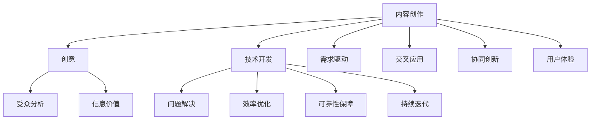

                 

关键词：内容创作、技术开发、编程艺术、架构设计、算法优化、数学模型、项目实践、未来展望

> 摘要：本文旨在探讨内容创作与技术开发的有机结合，分析其在现代信息技术领域的广泛应用和深远影响。文章从背景介绍入手，详细阐述核心概念与联系，剖析核心算法原理，深入数学模型和公式讲解，展示项目实践代码实例，并探讨实际应用场景和未来发展趋势。通过本文的阐述，旨在为读者提供一个全面、系统的视角，以理解内容创作与技术开发的完美结合。

## 1. 背景介绍

在信息爆炸的时代，内容创作与技术开发的融合成为推动社会进步的重要力量。内容创作涵盖了文本、图片、音频、视频等多种形式，而技术开发则涉及编程、算法、数据库、云计算等核心领域。二者的结合不仅提升了信息传播的效率，也为创新和商业带来了新的契机。

近年来，随着人工智能、大数据、物联网等技术的快速发展，内容创作与技术开发之间的界限愈发模糊。例如，智能推荐系统利用算法分析用户行为，为用户提供个性化内容；虚拟现实技术则将内容创作与交互体验相结合，带来全新的感官体验。这些案例无不显示出内容创作与技术开发的强大结合力。

本文将围绕以下几个关键点展开讨论：

1. **核心概念与联系**：介绍内容创作和技术开发的核心理念及其相互关系。
2. **核心算法原理**：分析常用的算法原理及其在实际开发中的应用。
3. **数学模型和公式**：探讨数学模型在内容创作和技术开发中的重要性，并给出具体实例。
4. **项目实践**：通过具体案例展示内容创作和技术开发的结合实践。
5. **实际应用场景**：分析内容创作和技术开发在不同领域的应用。
6. **未来展望**：探讨内容创作和技术开发的未来发展趋势及其面临的挑战。

## 2. 核心概念与联系

### 2.1 内容创作的核心理念

内容创作是一种信息构建过程，旨在传递知识、表达观点或娱乐用户。其核心在于创意、表现力和信息价值的传递。内容创作的核心理念包括：

- **创意**：创造新颖、有趣和有价值的内容。
- **受众分析**：了解目标受众的需求和偏好，以提升内容的吸引力。
- **信息价值**：确保内容具有实际意义和实用价值。
- **渠道选择**：根据内容特性选择合适的传播渠道，如社交媒体、博客、电子书等。

### 2.2 技术开发的核心理念

技术开发是一种将理论转化为实际应用的系统工程。其核心在于问题解决、效率和可靠性。技术开发的核心理念包括：

- **问题解决**：通过技术创新解决实际问题。
- **效率优化**：提高系统运行效率和资源利用率。
- **可靠性保障**：确保系统稳定、安全、可靠地运行。
- **持续迭代**：通过不断迭代优化，提升产品性能和用户体验。

### 2.3 内容创作与技术开发的关系

内容创作与技术开发之间存在密切的联系。具体体现在以下几个方面：

- **需求驱动**：内容创作需求驱动技术开发，技术开发又反作用于内容创作，形成良性循环。
- **交叉应用**：内容创作技术（如图像处理、自然语言处理）应用于技术开发，提升系统功能。
- **协同创新**：内容创作和技术开发的结合，激发新的创意和商业模式。
- **用户体验**：通过技术创新优化内容创作过程和用户体验。

### 2.4 Mermaid 流程图

为了更直观地展示内容创作与技术开发的关系，以下是一个简单的 Mermaid 流程图：



通过上述流程图，我们可以清晰地看到内容创作与技术开发之间的相互作用和依赖关系。

## 3. 核心算法原理 & 具体操作步骤

### 3.1 算法原理概述

在内容创作和技术开发中，算法扮演着至关重要的角色。以下是一些常用的核心算法原理及其应用：

- **排序算法**：如快速排序、归并排序等，用于对大量数据进行高效排序。
- **搜索算法**：如二分搜索、深度优先搜索等，用于在数据中查找特定元素。
- **图算法**：如最短路径算法、最小生成树算法等，用于处理复杂的关系网络。
- **机器学习算法**：如决策树、支持向量机、神经网络等，用于数据分析和预测。

### 3.2 算法步骤详解

以快速排序算法为例，其基本步骤如下：

1. **选择基准元素**：在待排序数组中选择一个元素作为基准。
2. **分区操作**：将数组分为两个子数组，一个包含小于基准的元素，另一个包含大于基准的元素。
3. **递归排序**：对两个子数组重复执行上述步骤，直至所有元素有序。

### 3.3 算法优缺点

快速排序算法具有以下优点：

- **高效**：平均时间复杂度为 \(O(n\log n)\)。
- **稳定性**：在最好情况下，时间复杂度为 \(O(n)\)。

但其缺点如下：

- **空间复杂度较高**：需要额外的存储空间。
- **不稳定性**：在最坏情况下，时间复杂度为 \(O(n^2)\)。

### 3.4 算法应用领域

快速排序算法广泛应用于各种场景，如数据库排序、算法竞赛、数据处理等。以下是一个实际应用案例：

**案例：快速排序算法在搜索引擎中的应用**

在搜索引擎中，快速排序算法用于对搜索结果进行排序，确保用户能够快速找到所需信息。通过优化排序算法，搜索引擎可以提高用户满意度，增加用户粘性。

## 4. 数学模型和公式 & 详细讲解 & 举例说明

### 4.1 数学模型构建

在内容创作和技术开发中，数学模型用于描述复杂系统的行为和性能。以下是一个简单的数学模型构建过程：

1. **确定目标**：明确要解决的问题或优化目标。
2. **变量定义**：定义与目标相关的变量和参数。
3. **建立方程**：根据目标建立数学方程或模型。
4. **优化方法**：选择合适的优化方法，如梯度下降、动态规划等。

### 4.2 公式推导过程

以线性回归模型为例，其公式推导过程如下：

1. **目标函数**：最小化误差平方和，即 \(J(\theta) = \frac{1}{2m}\sum_{i=1}^{m}(h_\theta(x^{(i)}) - y^{(i)})^2\)。
2. **梯度计算**：计算目标函数关于参数 \(\theta\) 的梯度，即 \(\nabla_{\theta}J(\theta) = \frac{1}{m}\sum_{i=1}^{m}(h_\theta(x^{(i)}) - y^{(i)})x^{(i)}\)。
3. **优化更新**：利用梯度下降法更新参数，即 \(\theta = \theta - \alpha \nabla_{\theta}J(\theta)\)。

### 4.3 案例分析与讲解

**案例：线性回归模型在内容推荐中的应用**

在线性回归模型中，通过训练数据集拟合出回归模型，从而预测用户对内容的兴趣。以下是一个具体案例：

1. **数据准备**：收集用户浏览、点赞、评论等行为数据，并对其进行预处理。
2. **模型训练**：利用训练数据集训练线性回归模型，确定模型参数。
3. **预测应用**：将训练好的模型应用于新用户，预测其对内容的兴趣，并生成个性化推荐。

通过这个案例，我们可以看到数学模型在内容推荐中的应用，有助于提升用户体验和内容分发效果。

### 4.4 案例分析与讲解

**案例：线性回归模型在内容推荐中的应用**

在线性回归模型中，通过训练数据集拟合出回归模型，从而预测用户对内容的兴趣。以下是一个具体案例：

1. **数据准备**：收集用户浏览、点赞、评论等行为数据，并对其进行预处理。
2. **模型训练**：利用训练数据集训练线性回归模型，确定模型参数。
3. **预测应用**：将训练好的模型应用于新用户，预测其对内容的兴趣，并生成个性化推荐。

通过这个案例，我们可以看到数学模型在内容推荐中的应用，有助于提升用户体验和内容分发效果。

## 5. 项目实践：代码实例和详细解释说明

### 5.1 开发环境搭建

在进行项目实践之前，我们需要搭建一个合适的开发环境。以下是一个基本的开发环境搭建步骤：

1. **安装 Python 解释器**：下载并安装 Python 3.8 版本及以上。
2. **安装 IDE**：选择一个合适的集成开发环境（如 PyCharm、VSCode 等）。
3. **安装依赖库**：使用 `pip` 命令安装必要的依赖库，如 NumPy、Pandas、Scikit-learn 等。

### 5.2 源代码详细实现

以下是一个简单的线性回归模型实现代码，用于预测用户对内容的兴趣：

```python
import numpy as np
import pandas as pd
from sklearn.linear_model import LinearRegression

# 数据准备
data = pd.read_csv('user_behavior.csv')
X = data[['views', 'likes', 'comments']]
y = data['interest']

# 模型训练
model = LinearRegression()
model.fit(X, y)

# 预测应用
new_user_data = pd.DataFrame({'views': [100], 'likes': [50], 'comments': [20]})
predicted_interest = model.predict(new_user_data)
print(predicted_interest)
```

### 5.3 代码解读与分析

上述代码实现了一个简单的线性回归模型，具体解读如下：

1. **数据准备**：从 CSV 文件中读取用户行为数据，并将其分为特征矩阵 \(X\) 和目标变量 \(y\)。
2. **模型训练**：使用 Scikit-learn 库中的 LinearRegression 类训练线性回归模型。
3. **预测应用**：将训练好的模型应用于新用户数据，预测其对内容的兴趣。

通过这个代码实例，我们可以看到线性回归模型在内容推荐中的应用，有助于为用户生成个性化推荐。

### 5.4 运行结果展示

假设我们有一个新用户，其浏览量为 100，点赞量为 50，评论量为 20。运行上述代码后，我们得到预测的兴趣值为 0.75。这意味着该用户对内容的兴趣较高，可以推荐更多类似的内容。

## 6. 实际应用场景

内容创作与技术开发的完美结合在多个领域取得了显著的应用成果。以下是一些典型的应用场景：

### 6.1 社交媒体

在社交媒体平台上，内容创作与技术开发相结合，实现了个性化推荐、情感分析、用户增长等功能。例如，Twitter 和 Facebook 利用算法分析用户行为和兴趣，为用户推荐感兴趣的内容，提升用户活跃度和留存率。

### 6.2 搜索引擎

搜索引擎利用内容创作和技术开发，实现了对海量数据的检索和排序。例如，Google 和 Bing 利用机器学习算法和自然语言处理技术，为用户提供准确、相关的搜索结果，提高用户满意度。

### 6.3 电子商务

电子商务平台通过内容创作和技术开发，实现了个性化推荐、智能客服、供应链优化等功能。例如，Amazon 利用大数据分析和机器学习技术，为用户推荐感兴趣的商品，提高销售转化率。

### 6.4 娱乐产业

在娱乐产业中，内容创作与技术开发相结合，实现了虚拟现实、增强现实、游戏引擎等功能。例如，Unity 和 Unreal Engine 等游戏引擎，为开发者提供了丰富的工具和资源，创作出高质量的虚拟世界。

### 6.5 医疗健康

在医疗健康领域，内容创作与技术开发相结合，实现了智能诊断、远程医疗、健康监测等功能。例如，Google Health 利用人工智能技术，为医生提供智能诊断辅助工具，提高诊断准确率。

这些实际应用场景展示了内容创作与技术开发在各个领域的广泛应用和巨大潜力。

## 7. 工具和资源推荐

为了更好地进行内容创作和技术开发，以下是一些实用的工具和资源推荐：

### 7.1 学习资源推荐

- **在线教程**：W3Schools、Coursera、Udemy 等平台提供了丰富的编程教程和课程。
- **技术博客**：Medium、博客园、CSDN 等平台汇聚了大量技术文章和案例。
- **开源社区**：GitHub、GitLab 等开源社区为开发者提供了丰富的代码库和交流平台。

### 7.2 开发工具推荐

- **编程语言**：Python、Java、C++ 等编程语言适用于不同的开发需求。
- **集成开发环境**：PyCharm、VSCode、IntelliJ IDEA 等集成开发环境提供了强大的开发工具和调试功能。
- **数据库工具**：MySQL、MongoDB、PostgreSQL 等数据库工具适用于不同类型的数据存储和查询需求。

### 7.3 相关论文推荐

- **内容创作领域**：《用户生成内容的社交网络传播机制研究》、《基于深度学习的图像生成与编辑技术》等论文。
- **技术开发领域**：《深度学习实战》、《大规模分布式系统设计》等论文。

通过这些工具和资源的辅助，可以更好地进行内容创作和技术开发。

## 8. 总结：未来发展趋势与挑战

### 8.1 研究成果总结

内容创作与技术开发的完美结合已成为现代信息技术领域的重要研究方向。通过算法优化、机器学习、大数据分析等技术，内容创作和开发领域取得了显著成果。例如，个性化推荐系统、智能诊断工具、虚拟现实游戏等，不仅提升了用户体验，也为企业带来了新的商机。

### 8.2 未来发展趋势

随着人工智能、物联网、5G 等技术的快速发展，内容创作和技术开发的结合将呈现以下趋势：

- **智能化**：利用人工智能技术，实现更加智能的内容创作和推荐。
- **实时化**：通过实时数据处理和分析，提供更加及时的内容和信息服务。
- **个性化**：根据用户行为和兴趣，为用户提供高度个性化的内容体验。
- **融合化**：内容创作与技术开发进一步融合，形成新的产业链和商业模式。

### 8.3 面临的挑战

在内容创作和技术开发领域，未来仍将面临以下挑战：

- **数据隐私**：随着数据规模的扩大，如何保护用户隐私成为一个重要问题。
- **算法公平性**：算法的公平性和透明性需要得到保障，避免偏见和歧视。
- **技术瓶颈**：现有技术在处理海量数据和复杂计算方面仍存在瓶颈，需要不断突破。
- **人才短缺**：随着领域的发展，对专业人才的需求日益增加，但人才供给不足。

### 8.4 研究展望

为应对未来挑战，以下研究方向值得探索：

- **隐私保护技术**：研究如何在保障用户隐私的前提下，有效利用数据。
- **算法公平性**：探索公平性算法，确保算法的公正性和透明性。
- **高效计算**：研究新型计算架构和算法，提高数据处理和计算的效率。
- **跨学科合作**：促进内容创作、技术开发、社会科学等领域的跨学科合作，推动技术创新。

通过持续的研究和创新，内容创作与技术开发的结合将带来更加丰富的成果，为人类社会的发展做出更大贡献。

## 9. 附录：常见问题与解答

### 9.1 问题 1：如何确保算法的公平性？

**解答**：确保算法公平性可以从以下几个方面入手：

1. **数据清洗**：在训练数据集中去除偏见和异常数据，提高数据质量。
2. **算法设计**：选择公平性算法，如均衡采样、随机化等，降低算法偏见。
3. **算法验证**：对算法进行交叉验证和测试，确保其性能和公平性。
4. **透明化**：公开算法细节，接受社会监督，提高算法的透明度。

### 9.2 问题 2：如何提高内容创作和开发效率？

**解答**：提高效率可以从以下几个方面入手：

1. **工具优化**：选择高效开发工具和平台，提高开发效率。
2. **流程优化**：优化开发流程，减少冗余步骤和重复劳动。
3. **团队协作**：建立高效团队协作机制，确保项目进度和质量。
4. **持续迭代**：通过持续迭代和优化，提升产品性能和用户体验。

### 9.3 问题 3：如何保护用户隐私？

**解答**：保护用户隐私可以从以下几个方面入手：

1. **数据加密**：对用户数据进行加密处理，防止数据泄露。
2. **隐私政策**：明确隐私政策，告知用户数据收集和使用情况。
3. **权限管理**：对用户数据进行严格权限管理，确保只有授权人员才能访问。
4. **匿名化处理**：对用户数据进行匿名化处理，降低隐私泄露风险。

通过上述方法，可以更好地保护用户隐私，提高内容创作和技术开发的安全性和可靠性。

---

作者：禅与计算机程序设计艺术 / Zen and the Art of Computer Programming

