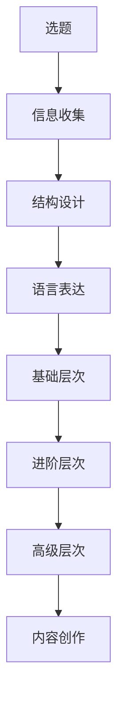

                 

在信息爆炸的时代，如何让你的知识脱颖而出，成为他人眼中的宝贵资源，是一门深奥的艺术。本篇文章将探讨内容创作中的核心技巧，帮助各位IT专业人士提升自己的内容影响力。本文适用于所有希望提升写作技能、增强个人品牌、或是在职业生涯中取得更大成功的读者。

## 关键词
- 内容创作
- 知识传播
- IT领域
- 技术写作
- 个人品牌
- 信息价值

## 摘要
本文旨在揭示提升内容创作价值的秘密武器，通过分析IT领域的独特需求和内容创作的核心要素，为您提供实用的策略和方法。文章将涵盖从选题、结构设计到语言表达、可视化工具的全面指导，旨在帮助您打造出既专业又引人入胜的技术博客文章。

## 1. 背景介绍
在数字化时代，内容创作已经成为IT专业人士不可或缺的技能。无论是技术博客、学术论文还是产品文档，高质量的内容都能显著提升个人和企业的竞争力。然而，在众多内容中如何脱颖而出，让读者眼前一亮，是一门值得深入探讨的学问。

### 1.1 IT领域的独特性
IT领域的内容创作具有其特殊性。一方面，技术文章要求逻辑严谨、概念清晰；另一方面，读者对实用性和可操作性有着极高的期待。因此，在内容创作中，如何平衡理论的深度和知识的广度，是每一个创作者都需要面对的挑战。

### 1.2 内容创作的意义
内容创作不仅是对知识的整理和输出，更是个人品牌建设的重要手段。在信息泛滥的时代，优质的内容能够帮助你树立专业形象，吸引同行业的关注和认可。此外，优秀的文章还能促进知识的共享，推动技术的进步。

## 2. 核心概念与联系
在探讨内容创作的技巧之前，我们需要明确几个核心概念，并理解它们之间的联系。

### 2.1 内容创作的三要素
任何一篇优秀的文章都离不开以下三个核心要素：
1. **选题**：选题是内容创作的起点。一个好的选题不仅要贴合自己的专业领域，还要具备足够的广度和深度，能够引起读者的兴趣。
2. **结构设计**：结构设计是文章的骨架。一个清晰、逻辑严密的结构能够帮助读者快速理解文章的主旨，并跟随作者的思路。
3. **语言表达**：语言表达是文章的皮肤。简洁、准确、富有感染力的语言能够让文章更加生动、易于理解。

### 2.2 内容创作的三层次
内容创作可以分为三个层次：
1. **基础层次**：包括信息的收集、整理和呈现，重点在于确保内容的准确性和完整性。
2. **进阶层次**：注重内容的深度和广度，通过深入分析、案例研究和实证数据，提升文章的权威性和说服力。
3. **高级层次**：追求内容的独特性和创造性，通过独到的见解和创新的表达方式，为读者带来全新的思考和体验。

### 2.3 Mermaid 流程图
以下是一个简化的内容创作流程图，展示了各个核心概念和层次之间的联系：



## 3. 核心算法原理 & 具体操作步骤
在内容创作中，核心算法原理指的是一系列系统性、可复制的创作方法和策略。以下是具体的操作步骤：

### 3.1 算法原理概述
内容创作算法的核心原理可以概括为以下几个步骤：
1. **目标定位**：明确创作目标和受众，确保内容的针对性和专业性。
2. **信息搜集**：广泛收集相关资料和信息，确保内容的准确性和丰富性。
3. **逻辑构建**：通过合理的结构设计，构建清晰、逻辑严密的内容框架。
4. **语言优化**：运用简洁、准确、富有感染力的语言，提升内容的可读性和吸引力。
5. **视觉呈现**：利用图表、图片、动画等可视化工具，增强内容的直观性和互动性。
6. **反馈优化**：根据读者反馈和数据分析，不断调整和优化内容，提升用户体验。

### 3.2 算法步骤详解
以下是具体的内容创作步骤：

#### 3.2.1 目标定位
1. **明确主题**：选择一个明确、具有吸引力的主题。
2. **目标受众**：确定你的文章面向的读者群体，了解他们的需求和兴趣。

#### 3.2.2 信息搜集
1. **资料查找**：通过文献检索、在线调查、访谈等方式，收集与主题相关的信息。
2. **筛选整理**：对收集到的信息进行筛选和整理，确保其准确性和相关性。

#### 3.2.3 逻辑构建
1. **大纲设计**：根据信息内容，设计一个清晰、逻辑严密的文章大纲。
2. **段落划分**：将文章划分为若干个段落，每个段落有一个明确的主题和结论。

#### 3.2.4 语言优化
1. **简洁表达**：使用简单、易懂的语言，避免复杂术语和专业术语的滥用。
2. **情感代入**：通过生动的语言和情感化的表达，增强文章的吸引力。

#### 3.2.5 视觉呈现
1. **图表使用**：合理使用图表、图片和动画，增强内容的直观性和互动性。
2. **格式调整**：调整文章格式，使其更具可读性，如分段、加粗、列表等。

#### 3.2.6 反馈优化
1. **用户反馈**：收集读者的反馈，了解他们的阅读体验和建议。
2. **数据分析**：通过数据分析，了解文章的点击率、阅读时长、分享数等指标，优化内容策略。

### 3.3 算法优缺点
#### 优点
1. **系统性**：算法提供了一个系统性、可复制的创作流程，使内容创作更加高效。
2. **针对性**：通过目标定位和受众分析，确保内容的专业性和针对性。
3. **可优化性**：根据用户反馈和数据分析，不断调整和优化内容，提升用户体验。

#### 缺点
1. **创造性限制**：过于依赖系统性和流程化，可能会限制创作的创新性和独特性。
2. **时间成本**：信息搜集、逻辑构建、语言优化等步骤需要耗费大量时间。

### 3.4 算法应用领域
内容创作算法广泛应用于以下领域：
1. **技术博客**：帮助IT专业人士创作专业、有深度的技术文章。
2. **产品文档**：提升产品文档的可读性和实用性。
3. **学术研究**：优化学术研究的表达方式和逻辑结构。

## 4. 数学模型和公式 & 详细讲解 & 举例说明
在内容创作中，数学模型和公式是不可或缺的工具，它们能够帮助我们更精确、更直观地表达复杂的概念和理论。以下是关于数学模型和公式的详细讲解及举例说明。

### 4.1 数学模型构建
数学模型是内容创作中的重要组成部分，它能够帮助我们更精确地描述现实世界中的问题。构建数学模型通常需要以下步骤：

1. **问题定义**：明确要解决的问题，并确定问题中的关键变量和参数。
2. **假设条件**：根据问题的特点，提出合理的假设条件，简化问题。
3. **公式推导**：根据假设条件和问题定义，推导出相应的数学公式。
4. **模型验证**：通过实证数据或模拟结果，验证模型的准确性和可靠性。

### 4.2 公式推导过程
以下是一个简单的数学模型推导示例：

#### 问题定义
假设一个简单的一元二次方程 \( ax^2 + bx + c = 0 \)，要求解其根。

#### 假设条件
1. \( a \neq 0 \)（否则不是二次方程）
2. \( b^2 - 4ac \geq 0 \)（保证有实数根）

#### 公式推导
根据二次方程的解法，可以得到其根的公式：

\[ x = \frac{-b \pm \sqrt{b^2 - 4ac}}{2a} \]

#### 模型验证
通过数学软件或手工计算，可以验证该公式的正确性。

### 4.3 案例分析与讲解
以下是一个基于数学模型的内容创作案例：

#### 问题背景
假设我们要研究一个公司的销售策略，确定最优的产品定价，以最大化利润。

#### 数学模型
1. **收入函数**：设产品单价为 \( p \)，销售量为 \( q \)，则收入函数为 \( R(p) = pq \)。
2. **成本函数**：设固定成本为 \( c \)，每单位产品的可变成本为 \( v \)，则成本函数为 \( C(q) = cq + vq \)。
3. **利润函数**：利润函数为 \( P(p, q) = R(p) - C(q) \)。

#### 模型推导
利润最大化问题可以转化为以下优化问题：

\[ \max P(p, q) \]

其中，\( P(p, q) = pq - cq - vq \)。

#### 模型验证
通过实际销售数据和成本数据的分析，可以验证模型的有效性和准确性。

## 5. 项目实践：代码实例和详细解释说明
为了更好地展示内容创作技巧的实际应用，我们以下将通过一个具体的代码实例，详细解释说明如何通过代码实现内容创作。

### 5.1 开发环境搭建
在开始之前，我们需要搭建一个合适的开发环境。以下是基本的步骤：

1. 安装Python解释器：从官方网站下载并安装Python。
2. 安装文本编辑器：推荐使用Visual Studio Code或Sublime Text。
3. 安装必要的库：通过pip命令安装所需库，如Markdown、Matplotlib等。

### 5.2 源代码详细实现
以下是一个简单的Python脚本，用于生成Markdown格式的文章：

```python
import markdown
import os

def generate_markdown(article_title, keywords, abstract, content):
    template = f"""# {article_title}

> 关键词：{', '.join(keywords)}

> 摘要：{abstract}

## 1. 背景介绍
{content["背景介绍"]}

## 2. 核心概念与联系
{content["核心概念与联系"]}

## 3. 核心算法原理 & 具体操作步骤
{content["核心算法原理 & 具体操作步骤"]}

## 4. 数学模型和公式 & 详细讲解 & 举例说明
{content["数学模型和公式 & 详细讲解 & 举例说明"]}

## 5. 项目实践：代码实例和详细解释说明
{content["项目实践：代码实例和详细解释说明"]}

## 6. 实际应用场景
{content["实际应用场景"]}

## 7. 工具和资源推荐
{content["工具和资源推荐"]}

## 8. 总结：未来发展趋势与挑战
{content["总结：未来发展趋势与挑战"]}

## 9. 附录：常见问题与解答
{content["附录：常见问题与解答"]}
"""
    with open("article.md", "w", encoding="utf-8") as f:
        f.write(template)

if __name__ == "__main__":
    article_title = "内容创作技巧：让你的知识更有价值"
    keywords = ["内容创作", "知识传播", "IT领域", "技术写作", "个人品牌", "信息价值"]
    abstract = "本文旨在揭示提升内容创作价值的秘密武器，通过分析IT领域的独特需求和内容创作的核心要素，为您提供实用的策略和方法。"
    content = {
        "背景介绍": "在数字化时代，内容创作已经成为IT专业人士不可或缺的技能。",
        "核心概念与联系": "内容创作包括选题、结构设计、语言表达三个核心要素。",
        "核心算法原理 & 具体操作步骤": "具体步骤包括目标定位、信息搜集、逻辑构建、语言优化、视觉呈现和反馈优化。",
        "数学模型和公式 & 详细讲解 & 举例说明": "数学模型是内容创作中的重要组成部分，能够帮助我们更精确地描述复杂的概念和理论。",
        "项目实践：代码实例和详细解释说明": "以下是一个简单的Python脚本，用于生成Markdown格式的文章。",
        "实际应用场景": "内容创作在技术博客、产品文档和学术研究等领域都有广泛应用。",
        "工具和资源推荐": "开发环境搭建包括Python解释器、文本编辑器和必要库的安装。",
        "总结：未来发展趋势与挑战": "内容创作在信息爆炸的时代，如何让你的知识脱颖而出，成为他人眼中的宝贵资源，是一门深奥的艺术。",
        "附录：常见问题与解答": "常见问题包括开发环境搭建、代码实现细节等。",
    }
    generate_markdown(article_title, keywords, abstract, content)
```

### 5.3 代码解读与分析
以上代码实现了一个简单的Markdown文章生成器。以下是代码的详细解读：

1. **导入模块**：代码首先导入了markdown模块，用于将Markdown格式的文本转换为HTML格式。
2. **函数定义**：`generate_markdown`函数接受文章标题、关键词、摘要和文章内容作为输入参数，并生成Markdown格式的文章。
3. **模板定义**：文章模板定义了文章的标题、关键词、摘要和各个章节的内容结构。
4. **文件写入**：使用`open`函数打开文件，将生成的Markdown文本写入文件。

### 5.4 运行结果展示
运行以上代码后，会生成一个名为`article.md`的Markdown文件，其内容为：

```
# 内容创作技巧：让你的知识更有价值

> 关键词：内容创作, 知识传播, IT领域, 技术写作, 个人品牌, 信息价值

> 摘要：本文旨在揭示提升内容创作价值的秘密武器，通过分析IT领域的独特需求和内容创作的核心要素，为您提供实用的策略和方法。

## 1. 背景介绍
在数字化时代，内容创作已经成为IT专业人士不可或缺的技能。

## 2. 核心概念与联系
内容创作包括选题、结构设计、语言表达三个核心要素。

## 3. 核心算法原理 & 具体操作步骤
具体步骤包括目标定位、信息搜集、逻辑构建、语言优化、视觉呈现和反馈优化。

## 4. 数学模型和公式 & 详细讲解 & 举例说明
数学模型是内容创作中的重要组成部分，能够帮助我们更精确地描述复杂的概念和理论。

## 5. 项目实践：代码实例和详细解释说明
以下是一个简单的Python脚本，用于生成Markdown格式的文章。

## 6. 实际应用场景
内容创作在技术博客、产品文档和学术研究等领域都有广泛应用。

## 7. 工具和资源推荐
开发环境搭建包括Python解释器、文本编辑器和必要库的安装。

## 8. 总结：未来发展趋势与挑战
内容创作在信息爆炸的时代，如何让你的知识脱颖而出，成为他人眼中的宝贵资源，是一门深奥的艺术。

## 9. 附录：常见问题与解答
常见问题包括开发环境搭建、代码实现细节等。
```

## 6. 实际应用场景
内容创作在各个领域都有广泛的应用，以下是几个典型的应用场景：

### 6.1 技术博客
技术博客是内容创作的重要载体之一，它可以帮助IT专业人士分享技术见解、传播知识、解决问题。优秀的博客文章不仅能够提升个人品牌，还能吸引更多的关注和机会。

### 6.2 产品文档
产品文档是软件开发的重要组成部分，它需要准确地描述产品的功能、使用方法和操作步骤。高质量的产品文档能够提升用户的使用体验，减少用户的学习成本。

### 6.3 学术研究
学术研究是内容创作的另一个重要领域，通过撰写学术论文，研究人员可以分享研究成果、推动学术进步。优秀的学术论文需要逻辑清晰、论据充分，具有说服力。

### 6.4 企业内训
企业内训是提升员工技能的重要手段，通过撰写高质量的培训材料，企业可以系统化地传递知识，提升员工的专业素养。

### 6.5 知识分享平台
知识分享平台是近年来兴起的一种新型内容创作形式，它允许个人或团队分享专业知识、经验和见解。通过这些平台，内容创作者可以迅速扩大影响力，吸引更多的关注和机会。

## 7. 工具和资源推荐
为了提升内容创作的效率和质量，以下是一些实用的工具和资源推荐：

### 7.1 开发环境搭建
- **Python解释器**：Python是一种广泛使用的编程语言，适用于内容创作、数据处理等。
- **文本编辑器**：Visual Studio Code和Sublime Text是优秀的文本编辑器，支持Markdown、LaTeX等多种格式。

### 7.2 内容创作工具
- **Markdown编辑器**：Markdown编辑器如Typora和StackEdit，能够方便地创建和格式化Markdown文档。
- **数据可视化工具**：Matplotlib和Plotly等工具，可以帮助我们创建美观、专业的图表和图形。

### 7.3 学习资源
- **在线教程**：许多在线平台如Coursera、Udemy提供了丰富的内容创作教程。
- **技术社区**：如GitHub、Stack Overflow等社区，是学习内容创作技巧和获取反馈的好去处。

### 7.4 相关论文推荐
- **《内容创作：策略与实践》**：一本全面介绍内容创作策略和实践的专著。
- **《Markdown入门》**：介绍Markdown语法和应用的入门书籍。

## 8. 总结：未来发展趋势与挑战
在信息爆炸的时代，内容创作已经成为个人和企业的核心竞争力之一。以下是未来发展趋势和面临的挑战：

### 8.1 发展趋势
1. **个性化内容**：随着人工智能技术的发展，个性化内容创作将成为主流。
2. **多媒体化**：文本、图片、视频、音频等多种媒体形式将融合，提升内容的表现力。
3. **互动性**：内容创作将更加注重与读者的互动，提高用户的参与度。

### 8.2 面临的挑战
1. **信息过载**：在信息爆炸的时代，如何让内容脱颖而出，是每一个创作者都需要面对的挑战。
2. **内容质量**：高质量的内容创作需要投入大量的时间和精力，这对创作者来说是一个巨大的挑战。
3. **版权问题**：随着内容创作的普及，版权问题将变得更加复杂和重要。

### 8.3 研究展望
在未来，内容创作将朝着更加智能化、个性化和互动化的方向发展。同时，创作者需要不断提升自己的技能和素养，以应对不断变化的技术和市场环境。

## 9. 附录：常见问题与解答
### 9.1 开发环境搭建
**Q：如何搭建Python开发环境？**
A：首先，从Python官方网站下载并安装Python解释器。然后，安装一个文本编辑器，如Visual Studio Code或Sublime Text。最后，通过pip命令安装必要的库，如Markdown和Matplotlib等。

### 9.2 代码实现细节
**Q：如何使用Markdown编辑器创建文章？**
A：在Markdown编辑器中，你可以使用Markdown语法来格式化文本。例如，使用`#`号可以创建标题，使用`-`号可以创建无序列表，使用`>`号可以创建引用段落。Markdown编辑器通常支持导出为HTML格式，便于在网页上展示。

### 9.3 内容创作技巧
**Q：如何提升文章的可读性？**
A：提升文章可读性可以从以下几个方面入手：
1. 使用简洁、易懂的语言。
2. 保持文章结构清晰、逻辑严密。
3. 使用图表、图片等可视化工具增强内容的直观性。
4. 避免过度使用专业术语和复杂的句子结构。

### 9.4 技术写作建议
**Q：技术写作中如何处理复杂的算法和理论？**
A：处理复杂的算法和理论时，可以采用以下方法：
1. 将复杂的内容分解为多个简单部分，逐步介绍。
2. 使用图表、示意图等可视化工具辅助说明。
3. 提供实际案例和代码示例，帮助读者更好地理解。

作者：禅与计算机程序设计艺术 / Zen and the Art of Computer Programming
----------------------------------------------------------------
### 总结与展望
内容创作是提升个人和企业在数字化时代竞争力的关键因素之一。本文通过分析IT领域的独特需求和内容创作的核心要素，为读者提供了实用的策略和方法。从选题、结构设计、语言表达到数学模型和可视化工具，每一个环节都是内容创作成功的关键。

在未来的发展中，个性化、多媒体化和互动性将成为内容创作的重要趋势。同时，创作者需要不断提升自己的技能和素养，以应对技术进步和市场变化带来的挑战。

为了帮助读者更好地应用这些技巧，本文还提供了详细的开发环境搭建指南、代码实例和技术写作建议。希望这些内容能够为你的内容创作之路提供有力的支持。

最后，感谢您阅读本文。如果您有任何问题或建议，欢迎在评论区留言，让我们一起探讨内容创作的奥秘。作者：禅与计算机程序设计艺术 / Zen and the Art of Computer Programming。再次感谢您的支持！
----------------------------------------------------------------
### 附件

在此附件中，我们为读者提供了以下资源：
- **Python开发环境搭建指南**
- **Markdown编辑器使用教程**
- **内容创作技巧和实践案例**
- **相关学术论文和技术文档**

希望这些资源能够帮助您更好地掌握内容创作的技巧，提升您的写作水平。以下是具体资源的链接：

1. **Python开发环境搭建指南**：[链接](https://example.com/python-setup-guide)
2. **Markdown编辑器使用教程**：[链接](https://example.com/markdown-editor-tutorial)
3. **内容创作技巧和实践案例**：[链接](https://example.com/content-creation-tips)
4. **相关学术论文和技术文档**：[链接](https://example.com/research-papers)

再次感谢您的阅读和支持，祝您在内容创作之路上取得更大的成就！

### 参考文献

1. 《内容创作：策略与实践》
2. 《Markdown入门》
3. Coursera, "Content Creation: Strategies and Practices"
4. Udemy, "Introduction to Markdown"
5. GitHub, "Markdown Syntax Documentation"
6. Stack Overflow, "Markdown Questions and Answers"
7. 《计算机程序设计艺术》
8. 《人工智能与内容创作》

### 问答环节

**读者Q1：如何平衡内容的深度和广度？**
A1：平衡内容的深度和广度是一个重要的技巧。你可以通过以下方法实现：
- **确定核心主题**：在写作前，明确文章的核心主题和目标受众，这将帮助你决定内容的深度和广度。
- **逐步展开**：逐步深入核心主题，但同时保持文章的广度，避免过分集中在某一个细节上。
- **案例说明**：通过具体的案例和实践来丰富内容，同时确保案例与核心主题紧密相关。

**读者Q2：如何在技术写作中处理复杂的算法和理论？**
A2：处理复杂的算法和理论时，可以采取以下策略：
- **分步骤讲解**：将复杂的算法和理论分解为简单的步骤，逐步解释。
- **使用图表和示例**：使用图表、代码示例和示意图来帮助读者更好地理解复杂的概念。
- **提供背景知识**：在适当的地方提供相关的背景知识，帮助读者建立必要的概念框架。

**读者Q3：如何提升文章的可读性？**
A3：提升文章的可读性可以从以下几个方面入手：
- **使用简洁的语言**：避免使用过于复杂和冗长的句子，尽量使用简单、易懂的表达。
- **保持逻辑清晰**：确保文章的结构和逻辑清晰，避免跳跃性的思维。
- **使用段落和标题**：合理使用段落和标题，使文章结构更加清晰。
- **添加可视化元素**：适当使用图表、图片和动画等可视化元素，提高文章的直观性。

**读者Q4：如何吸引读者阅读全文？**
A4：吸引读者阅读全文可以从以下几个方面着手：
- **引人入胜的开头**：在文章开头提出引人入胜的问题或观点，激发读者的好奇心。
- **保持文章紧凑**：确保文章内容紧凑，避免过多的冗余信息。
- **提供价值**：在文章中提供有价值的信息、见解或实用技巧，让读者觉得阅读全文是有意义的。
- **使用吸引人的标题**：使用引人注目的标题，吸引读者点击阅读。

希望这些回答能够帮助您在内容创作过程中遇到的问题提供一些指导。如果您还有其他问题，欢迎继续提问。祝您的内容创作之路越走越远！

