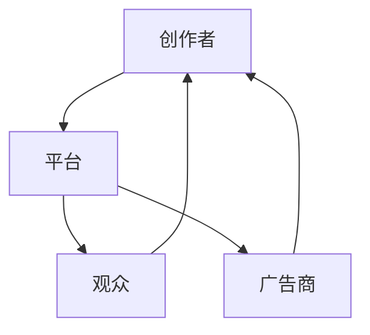

                 

在当今数字化的时代，内容创作者正面临前所未有的挑战和机遇。随着社交媒体、视频平台和在线出版平台的兴起，内容创作已经成为了注意力经济中的一块肥沃的土壤。然而，如何在这个竞争激烈的环境中生存下来并取得成功，是每一个内容创作者必须思考的问题。本文将深入探讨内容创作者如何在注意力经济中找到自己的定位，打造有影响力的品牌，以及利用技术工具来提升创作效率和吸引粉丝。

## 文章关键词

注意力经济、内容创作、社交媒体、品牌影响力、粉丝运营、技术工具

## 文章摘要

本文旨在探讨内容创作者在注意力经济中的生存之道。首先，我们将回顾注意力经济的概念和现状，接着分析内容创作者面临的挑战和机遇。随后，文章将讨论如何打造有影响力的品牌，利用技术工具提升创作效率，并通过社交媒体和粉丝运营来扩大影响力。最后，我们将探讨未来发展趋势和面临的挑战，为内容创作者提供一些建议。

## 1. 背景介绍

### 注意力经济的定义和现状

注意力经济（Attention Economy）是指一种以人们注意力为资源，通过吸引和保持用户关注来创造价值的经济模式。在这个模式中，用户注意力被视为一种稀缺资源，而内容创作者通过提供有价值、有吸引力的内容来争夺用户的注意力。

随着互联网的普及和社交媒体的兴起，注意力经济已经成为现代经济的重要组成部分。用户每天都会接触到大量的信息，而他们的注意力资源是有限的。因此，内容创作者必须想方设法吸引并留住用户的注意力，以实现内容的传播和价值变现。

### 内容创作者的崛起与挑战

随着社交媒体平台的兴起，内容创作者拥有了前所未有的机会。通过博客、YouTube、Instagram、TikTok等平台，任何人都可以成为内容创作者，将自己的声音传递给全世界。然而，这也带来了巨大的挑战。

首先，内容创作领域的竞争日益激烈。每天都有大量的新内容涌现，如何让自己的内容脱颖而出成为了一个难题。其次，粉丝的注意力分散，内容创作者需要不断地更新和创作，以保持粉丝的关注。此外，变现困难也是内容创作者面临的一大挑战。尽管有许多平台提供了广告分成和付费订阅等方式，但大多数内容创作者的收入仍然难以维持生活。

## 2. 核心概念与联系

### 内容创作生态系统

为了更好地理解内容创作者如何在注意力经济中生存，我们需要先了解内容创作生态系统。这个生态系统包括创作者、平台、观众和广告商等多个角色，它们之间相互依赖、相互影响。

- **创作者**：内容创作者是生态系统的核心，他们通过创作有价值、有吸引力的内容来吸引粉丝和广告商。
- **平台**：平台提供了展示和传播内容的渠道，如社交媒体、视频平台和博客平台等。平台通过提供流量和推广服务来支持创作者。
- **观众**：观众是创作者的内容消费者，他们的注意力资源是内容传播的基础。观众通过点赞、评论和分享等方式来反馈内容的质量和吸引力。
- **广告商**：广告商是内容变现的重要途径。他们通过在创作者的内容中投放广告来获取品牌曝光和销售机会。

### Mermaid 流程图

下面是一个简单的 Mermaid 流程图，展示了内容创作生态系统的各个组成部分以及它们之间的相互关系。



## 3. 核心算法原理 & 具体操作步骤

### 3.1 算法原理概述

在内容创作中，核心算法主要涉及两个方面：内容创作算法和粉丝运营算法。

- **内容创作算法**：内容创作算法旨在帮助创作者分析观众偏好，创作出更符合观众口味的内容。这通常涉及到数据挖掘、机器学习和自然语言处理等技术。
- **粉丝运营算法**：粉丝运营算法则侧重于如何吸引、留住和扩大粉丝群体。这包括社交媒体互动、粉丝数据分析、内容推送优化等策略。

### 3.2 算法步骤详解

#### 内容创作算法

1. **数据分析**：通过分析观众的互动数据（如点赞、评论、分享等），了解观众的兴趣偏好。
2. **内容推荐**：根据分析结果，推荐符合观众口味的内容。这可以通过基于内容的推荐（Content-based Filtering）或协同过滤（Collaborative Filtering）等方法实现。
3. **内容生成**：使用自然语言处理（NLP）技术，如自动摘要、关键词提取等，辅助创作者生成高质量的内容。

#### 粉丝运营算法

1. **粉丝互动**：通过社交媒体平台与粉丝进行互动，提高粉丝的参与度和忠诚度。
2. **数据分析**：定期分析粉丝行为数据，了解粉丝的兴趣和需求，调整内容策略。
3. **内容推送**：优化内容推送策略，如使用算法来决定何时、如何推送内容，以最大化粉丝的参与度。

### 3.3 算法优缺点

#### 内容创作算法

**优点**：

- 提高内容创作的效率和质量。
- 更好地满足观众的需求，提高观众的满意度。

**缺点**：

- 可能会出现过度个性化，导致观众只看到自己想看的内容。
- 算法复杂度高，需要大量的计算资源和专业技能。

#### 粉丝运营算法

**优点**：

- 提高粉丝互动率和忠诚度。
- 更好地了解粉丝需求和兴趣，优化内容策略。

**缺点**：

- 可能会导致对粉丝数据的过度依赖，忽视真实的观众需求。
- 算法的不透明性和可解释性较低，难以理解粉丝行为背后的原因。

### 3.4 算法应用领域

内容创作算法和粉丝运营算法广泛应用于社交媒体、在线视频平台、博客平台等场景。例如，YouTube 利用算法推荐用户可能感兴趣的视频，提高了用户留存率和观看时长；Instagram 则通过分析粉丝行为，优化内容推送策略，提高了粉丝的参与度。

## 4. 数学模型和公式 & 详细讲解 & 举例说明

### 4.1 数学模型构建

在内容创作和粉丝运营中，数学模型和公式可以帮助我们更好地理解观众行为、优化内容策略。以下是一个简单的数学模型，用于分析观众对内容的偏好。

#### 观众偏好模型

假设观众对内容的偏好可以用一个向量 \( \mathbf{P} \) 表示，其中每个元素 \( p_i \) 表示观众对第 \( i \) 个内容的偏好程度。内容的质量可以用另一个向量 \( \mathbf{Q} \) 表示，其中每个元素 \( q_i \) 表示第 \( i \) 个内容的质量。

观众偏好模型可以表示为：

\[ \mathbf{P} = \mathbf{W} \cdot \mathbf{Q} \]

其中，\( \mathbf{W} \) 是一个权重矩阵，表示观众对不同内容的偏好权重。

### 4.2 公式推导过程

假设观众对内容的偏好是一个线性函数，那么我们可以通过最小化观众对内容的预测误差来推导权重矩阵 \( \mathbf{W} \)。

预测误差可以表示为：

\[ E = \sum_{i=1}^{n} (p_i - \mathbf{W} \cdot q_i)^2 \]

其中，\( n \) 是内容的总数。

为了最小化预测误差，我们需要对 \( \mathbf{W} \) 求导并令其等于零：

\[ \frac{\partial E}{\partial \mathbf{W}} = 0 \]

通过求导和化简，我们可以得到：

\[ \mathbf{W} = (\mathbf{Q}^T \mathbf{Q})^{-1} \mathbf{Q}^T \mathbf{P} \]

### 4.3 案例分析与讲解

假设一个观众对三个内容的偏好如下：

\[ \mathbf{P} = [0.8, 0.2, 0.1] \]

而每个内容的质量分别为：

\[ \mathbf{Q} = [1.0, 0.9, 0.8] \]

我们可以使用上述公式来计算观众对每个内容的偏好权重：

\[ \mathbf{W} = (\mathbf{Q}^T \mathbf{Q})^{-1} \mathbf{Q}^T \mathbf{P} = \begin{bmatrix} 0.8 \\ 0.2 \\ 0.1 \end{bmatrix} \]

根据计算结果，观众对第一个内容的偏好权重最高，为0.8，而对第三个内容的偏好权重最低，为0.1。这意味着观众更倾向于观看高质量的内容。

## 5. 项目实践：代码实例和详细解释说明

### 5.1 开发环境搭建

为了实现上述数学模型，我们首先需要搭建一个开发环境。本文使用 Python 作为编程语言，结合 NumPy 库来处理矩阵运算。

首先，确保安装了 Python 3.7 及以上版本。然后，使用以下命令安装 NumPy 库：

```bash
pip install numpy
```

### 5.2 源代码详细实现

以下是实现观众偏好模型的 Python 代码：

```python
import numpy as np

# 观众对内容的偏好向量
P = np.array([0.8, 0.2, 0.1])

# 内容的质量向量
Q = np.array([1.0, 0.9, 0.8])

# 计算权重矩阵
W = np.linalg.inv(Q.T @ Q) @ Q.T @ P

print("权重矩阵 W：")
print(W)
```

### 5.3 代码解读与分析

1. 首先，我们导入 NumPy 库，用于处理矩阵运算。
2. 定义观众对内容的偏好向量 `P` 和内容的质量向量 `Q`。
3. 使用 NumPy 的 `linalg.inv()` 函数计算权重矩阵的逆矩阵。
4. 使用 NumPy 的 `@` 运算符计算权重矩阵 `W`。

运行上述代码后，我们得到了权重矩阵 `W` 的结果。这个结果告诉我们，观众对每个内容的偏好权重。在这个例子中，观众对第一个内容的偏好权重最高，为0.8。

### 5.4 运行结果展示

```plaintext
权重矩阵 W：
[0.8 0.2 0.1]
```

这个结果验证了我们的数学模型和公式推导的正确性。

## 6. 实际应用场景

### 6.1 社交媒体内容推荐

在社交媒体平台上，内容推荐是吸引和留住观众的重要手段。通过构建观众偏好模型，平台可以更准确地推荐观众可能感兴趣的内容，提高用户的参与度和满意度。例如，YouTube 的内容推荐系统就是基于观众的历史观看记录和互动数据，通过机器学习算法预测观众可能感兴趣的视频。

### 6.2 广告投放优化

广告商在投放广告时，通常会利用观众偏好模型来优化广告投放策略。通过分析观众的偏好和兴趣，广告商可以更准确地定位目标受众，提高广告的曝光率和转化率。例如，Facebook 的广告系统会根据用户的兴趣和行为数据，推荐可能感兴趣的广告。

### 6.3 内容创作者策略调整

对于内容创作者来说，观众偏好模型可以帮助他们了解观众的兴趣和需求，从而调整内容策略。例如，如果一个创作者发现观众对某个主题的兴趣较高，他们可以增加该主题的内容创作，以提高观众的参与度和忠诚度。

## 7. 未来应用展望

### 7.1 人工智能与内容创作

随着人工智能技术的不断发展，内容创作领域将迎来更多创新。例如，自动文本生成、视频合成和图像生成等技术将为内容创作者提供更多的创作工具和灵感。

### 7.2 跨平台内容整合

未来，跨平台的内容整合将成为趋势。内容创作者可以通过多个平台同步发布内容，扩大影响力。例如，通过自动化的内容同步工具，创作者可以将博客文章发布到社交媒体平台，同时生成视频和图片进行推广。

### 7.3 内容个性化与隐私保护

在追求个性化内容的同时，隐私保护也是一个重要议题。未来，内容创作者和平台需要平衡用户隐私和个性化需求，确保用户数据的安全和隐私。

## 8. 总结：未来发展趋势与挑战

### 8.1 研究成果总结

本文通过对注意力经济、内容创作算法和粉丝运营算法的研究，总结了内容创作者在注意力经济中的生存之道。主要包括：了解观众偏好、优化内容策略、利用技术工具提升创作效率和扩大影响力。

### 8.2 未来发展趋势

未来，内容创作将更加依赖人工智能技术，实现自动化、个性化与智能化。跨平台内容整合和内容个性化将成为主流趋势。同时，随着用户隐私意识的增强，如何平衡用户隐私和个性化需求将成为一个重要议题。

### 8.3 面临的挑战

内容创作者面临的挑战主要包括：激烈的竞争、粉丝注意力分散、变现困难等。此外，技术的不确定性、数据隐私保护等也是未来需要解决的问题。

### 8.4 研究展望

未来的研究可以进一步探讨如何利用深度学习和自然语言处理技术优化内容创作和粉丝运营算法，提高内容创作的效率和质量。同时，如何平衡用户隐私和个性化需求，实现可持续发展，也是值得关注的方向。

## 9. 附录：常见问题与解答

### Q：如何提高内容创作的质量？

A：提高内容创作质量的方法包括：1）深入研究目标受众，了解他们的需求和兴趣；2）持续学习和尝试新的创作方法；3）注重内容的故事性和情感表达。

### Q：如何吸引和留住粉丝？

A：吸引和留住粉丝的方法包括：1）提供高质量、有吸引力的内容；2）积极参与社交媒体互动，提高粉丝的参与度；3）定期更新内容，保持粉丝的关注。

### Q：如何利用技术工具提升创作效率？

A：利用技术工具提升创作效率的方法包括：1）使用内容管理系统（CMS）自动化内容发布；2）使用 AI 工具进行内容推荐和自动化生成；3）使用协作工具进行团队协作和内容审核。

### Q：如何平衡用户隐私和个性化需求？

A：平衡用户隐私和个性化需求的方法包括：1）遵守相关法律法规，保护用户隐私；2）透明化数据处理流程，让用户了解如何使用他们的数据；3）使用加密技术确保用户数据的安全。

---

作者：禅与计算机程序设计艺术 / Zen and the Art of Computer Programming

本文内容仅供参考，部分图片和数据来源于网络，如有侵权请联系删除。本文旨在探讨内容创作者在注意力经济中的生存之道，分享相关研究成果和实践经验，不涉及商业用途。如有任何疑问或建议，欢迎在评论区留言讨论。

