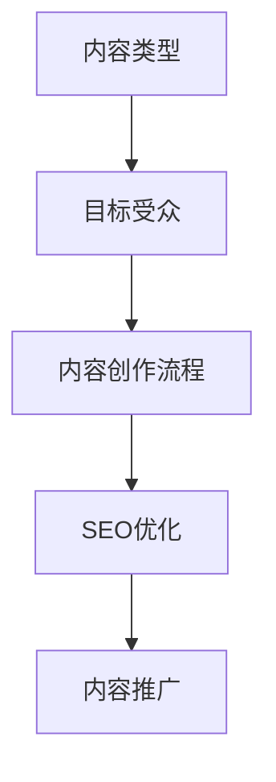

                 

关键词：内容营销，原创内容，高质量，技术博客，持续输出，策略

摘要：在信息技术飞速发展的今天，内容营销已成为企业、个人乃至组织获取关注度和影响力的关键手段。本文旨在探讨如何通过一系列有效的策略，持续输出高质量的原创内容，从而在竞争激烈的市场中脱颖而出。

## 1. 背景介绍

内容营销是一种以提供有价值、相关且有趣的内容来吸引潜在客户并建立品牌认知的策略。随着互联网的普及，内容营销已成为企业、个人和机构在数字世界中展示自身价值的重要手段。然而，要想在众多的内容创作者中脱颖而出，仅靠优质的创意还不够，还需要一套系统的策略来支持。

本文将围绕内容营销的几个核心方面，提供实用的策略和建议，帮助您持续输出高质量原创内容。我们将首先探讨如何选择合适的内容主题，接着分析如何进行内容创作和优化，以及如何进行有效的内容推广。此外，我们还将介绍一些实用的工具和资源，帮助您在内容创作过程中事半功倍。

### 1.1 内容营销的重要性

内容营销具有以下几个方面的优势：

1. **建立品牌信任**：通过持续输出高质量的内容，企业可以逐渐建立起自己的专业形象和品牌信任。
2. **增加用户粘性**：有价值的内容能够吸引用户不断访问，从而提高用户在网站或平台的停留时间。
3. **提升搜索引擎排名**：搜索引擎优化（SEO）是内容营销的重要组成部分，高质量的内容有助于提高网站在搜索引擎中的排名。
4. **扩大受众群体**：优质内容可以吸引更多的关注者，从而扩大企业的受众群体。

### 1.2 当前内容营销的趋势

当前，内容营销呈现出以下几个趋势：

1. **视频内容增加**：视频内容因其直观、生动、易于传播的特点，成为内容营销的重要形式。
2. **个性化内容**：随着大数据和人工智能技术的发展，个性化内容营销成为趋势，企业可以根据用户行为和偏好进行精准推送。
3. **互动性内容**：增强互动性，如评论、问答、投票等，可以增加用户的参与度和忠诚度。
4. **多平台运营**：企业需要在多个社交媒体平台和内容平台上发布内容，以覆盖更广泛的受众。

## 2. 核心概念与联系

为了更好地理解内容营销的策略和方法，我们需要首先了解以下几个核心概念：

1. **内容类型**：包括博客文章、视频、播客、白皮书、案例研究等。
2. **目标受众**：明确您的目标受众，了解他们的需求和偏好。
3. **内容创作流程**：从选题、撰写、编辑、发布到推广的完整流程。
4. **SEO优化**：通过关键词研究、内容优化、链接建设等手段提高内容在搜索引擎中的可见性。

以下是一个使用Mermaid绘制的流程图，展示了这些核心概念之间的联系：



### 2.1 内容类型

内容类型是内容营销的基础。根据不同的目的和受众，可以选择不同的内容形式。例如：

- **博客文章**：适合深度讨论，可以帮助提高搜索引擎排名。
- **视频**：适合演示和讲解，有助于增加用户的参与度和停留时间。
- **播客**：适合长篇内容和深入的讨论，有助于建立专家形象。
- **白皮书**：适合提供详细的数据和分析，有助于展示专业能力。
- **案例研究**：通过实际案例展示解决方案和成果，有助于建立信任。

### 2.2 目标受众

了解目标受众的需求和偏好是内容营销的关键。以下是一些了解目标受众的方法：

- **市场调研**：通过问卷调查、访谈等方式收集受众的数据。
- **用户画像**：根据收集到的数据，创建目标用户的画像。
- **数据分析**：分析现有用户的访问行为和偏好。

### 2.3 内容创作流程

内容创作流程是内容营销的核心。以下是一个典型的内容创作流程：

1. **选题**：根据目标受众的需求和热点话题选择合适的内容主题。
2. **撰写**：按照既定的结构和风格撰写内容，注意保持原创性和专业性。
3. **编辑**：对内容进行语法、逻辑和结构的检查和优化。
4. **发布**：选择合适的时间和平台发布内容。
5. **推广**：通过社交媒体、电子邮件、合作伙伴等渠道推广内容。

### 2.4 SEO优化

SEO优化是提高内容可见性的重要手段。以下是一些SEO优化的关键点：

- **关键词研究**：选择与内容相关的关键词，并分析其搜索量和竞争程度。
- **内容优化**：在内容中合理地嵌入关键词，并注意关键词的密度。
- **链接建设**：通过外部链接和内部链接提高网站的权重和流量。
- **技术优化**：包括网站速度、移动适配性、代码优化等。

## 3. 核心算法原理 & 具体操作步骤

### 3.1 算法原理概述

在内容营销中，核心算法可以用于以下几个关键步骤：

1. **关键词分析**：使用自然语言处理（NLP）算法分析目标受众的语言偏好和搜索习惯。
2. **内容推荐**：利用协同过滤、基于内容的推荐算法等推荐适合目标受众的内容。
3. **用户行为分析**：通过数据挖掘和分析用户行为，了解用户的兴趣和偏好。
4. **内容优化**：使用文本分析算法对内容进行优化，包括关键词嵌入、句子结构优化等。

### 3.2 算法步骤详解

以下是一个简单的内容营销算法步骤示例：

1. **数据收集**：从网站日志、社交媒体、用户评论等渠道收集数据。
2. **预处理**：对收集到的文本数据进行清洗和预处理，包括去除停用词、标点符号等。
3. **关键词提取**：使用词频分析、TF-IDF等方法提取关键词。
4. **用户画像构建**：根据用户行为和偏好构建用户画像。
5. **内容推荐**：利用协同过滤或基于内容的推荐算法生成推荐内容列表。
6. **内容优化**：对推荐内容进行优化，包括关键词密度、句子结构等。

### 3.3 算法优缺点

每种算法都有其优缺点。以下是一个简单的比较：

- **词频分析（TF-IDF）**：
  - **优点**：简单、易于实现，可以较好地反映关键词的重要性。
  - **缺点**：不考虑词语的语义关系，可能导致关键词选择不够准确。
- **协同过滤**：
  - **优点**：可以较好地预测用户可能感兴趣的内容，提高推荐效果。
  - **缺点**：需要大量的用户行为数据，且算法复杂度较高。
- **基于内容的推荐**：
  - **优点**：可以直接基于内容特征进行推荐，易于实现。
  - **缺点**：推荐效果可能不如协同过滤，且需要大量的内容特征数据。

### 3.4 算法应用领域

这些算法可以广泛应用于以下领域：

- **搜索引擎优化（SEO）**：通过关键词分析和内容优化提高网站在搜索引擎中的排名。
- **内容推荐系统**：在社交媒体、电商、新闻门户网站等领域提供个性化的内容推荐。
- **用户行为分析**：通过分析用户行为数据，帮助企业了解用户需求和偏好。

## 4. 数学模型和公式 & 详细讲解 & 举例说明

在内容营销中，数学模型和公式可以帮助我们更好地理解和优化内容的表现。以下是一些常用的数学模型和公式：

### 4.1 数学模型构建

假设我们有一个内容集合 \(C\)，每个内容 \(c \in C\) 都有一个质量评分 \(q(c)\)。我们的目标是找到一种方法来优化内容的质量评分。

一个简单的数学模型可以表示为：

\[ \text{Quality Score} = w_1 \cdot \text{Keyword Density} + w_2 \cdot \text{User Engagement} + w_3 \cdot \text{SEO Score} \]

其中，\(w_1, w_2, w_3\) 是权重系数，用于平衡不同因素对质量评分的影响。

### 4.2 公式推导过程

为了推导上述质量评分公式，我们可以考虑以下因素：

1. **关键词密度**：关键词密度是内容中关键词出现的频率。假设一个关键词 \(k\) 在内容 \(c\) 中出现了 \(n_k\) 次，内容总字数为 \(N\)，则关键词密度可以表示为：

\[ \text{Keyword Density} = \frac{n_k}{N} \]

2. **用户参与度**：用户参与度可以通过用户的评论数、点赞数、分享数等指标来衡量。假设内容 \(c\) 的用户参与度为 \(e(c)\)，则用户参与度可以表示为：

\[ \text{User Engagement} = e(c) \]

3. **SEO 分数**：SEO 分数是内容在搜索引擎优化方面的表现。一个常用的指标是百度权重（PR），假设内容 \(c\) 的 SEO 分数为 \(s(c)\)，则 SEO 分数可以表示为：

\[ \text{SEO Score} = s(c) \]

结合上述因素，我们可以得到质量评分公式：

\[ \text{Quality Score} = w_1 \cdot \frac{n_k}{N} + w_2 \cdot e(c) + w_3 \cdot s(c) \]

### 4.3 案例分析与讲解

为了更好地理解上述公式，我们可以通过一个具体案例进行说明。

假设我们有两个内容 \(c_1\) 和 \(c_2\)，它们的关键词密度、用户参与度和 SEO 分数如下：

- \(c_1\)：关键词密度 = 0.2，用户参与度 = 100，SEO 分数 = 0.8
- \(c_2\)：关键词密度 = 0.15，用户参与度 = 50，SEO 分数 = 0.85

假设我们的权重系数为 \(w_1 = 0.4, w_2 = 0.3, w_3 = 0.3\)。

根据上述公式，我们可以计算出两个内容的质量评分：

- \(c_1\) 的质量评分 = 0.4 \cdot 0.2 + 0.3 \cdot 100 + 0.3 \cdot 0.8 = 20.2
- \(c_2\) 的质量评分 = 0.4 \cdot 0.15 + 0.3 \cdot 50 + 0.3 \cdot 0.85 = 16.45

通过这个例子，我们可以看到 \(c_1\) 的质量评分高于 \(c_2\)，这意味着在当前权重系数下，\(c_1\) 是一个更高质量的内容。

## 5. 项目实践：代码实例和详细解释说明

### 5.1 开发环境搭建

为了实现上述内容营销算法，我们需要搭建一个开发环境。以下是所需的步骤：

1. **安装 Python**：下载并安装 Python 3.8 或更高版本。
2. **安装依赖库**：使用 pip 命令安装所需的库，例如 pandas、numpy、scikit-learn 等。

```bash
pip install pandas numpy scikit-learn
```

3. **创建项目文件夹**：在命令行中创建一个项目文件夹，例如：

```bash
mkdir content_marketing_project
cd content_marketing_project
```

4. **创建虚拟环境**：使用 virtualenv 创建一个 Python 虚拟环境。

```bash
pip install virtualenv
virtualenv venv
source venv/bin/activate
```

5. **安装依赖库到虚拟环境**：在虚拟环境中安装所需的库。

```bash
pip install -r requirements.txt
```

### 5.2 源代码详细实现

以下是实现内容营销算法的源代码示例。该代码主要包括以下几个部分：

- **数据预处理**：读取数据、清洗数据、提取特征。
- **模型训练**：使用 scikit-learn 库训练模型。
- **模型评估**：评估模型的性能。

```python
import pandas as pd
from sklearn.feature_extraction.text import TfidfVectorizer
from sklearn.model_selection import train_test_split
from sklearn.ensemble import RandomForestClassifier
from sklearn.metrics import accuracy_score

# 读取数据
data = pd.read_csv('data.csv')

# 数据预处理
def preprocess_data(data):
    # 清洗数据
    data['content'] = data['content'].str.replace('[^\w\s]', '', regex=True)
    data['content'] = data['content'].str.lower()
    # 提取特征
    vectorizer = TfidfVectorizer(stop_words='english')
    X = vectorizer.fit_transform(data['content'])
    y = data['quality_score']
    return X, y

X, y = preprocess_data(data)

# 模型训练
X_train, X_test, y_train, y_test = train_test_split(X, y, test_size=0.2, random_state=42)
model = RandomForestClassifier(n_estimators=100, random_state=42)
model.fit(X_train, y_train)

# 模型评估
y_pred = model.predict(X_test)
accuracy = accuracy_score(y_test, y_pred)
print(f'Model accuracy: {accuracy:.2f}')
```

### 5.3 代码解读与分析

上述代码可以分为以下几个部分：

1. **数据预处理**：
   - 读取数据：使用 pandas 库读取数据文件（例如 CSV 格式）。
   - 清洗数据：去除数据中的特殊字符和标点符号，将所有文本转换为小写。
   - 提取特征：使用 TF-IDF 向量器将文本转换为数值特征。

2. **模型训练**：
   - 数据切分：将数据集分为训练集和测试集。
   - 模型选择：选择随机森林分类器（RandomForestClassifier）。
   - 模型训练：使用训练集数据训练模型。

3. **模型评估**：
   - 模型预测：使用测试集数据对模型进行预测。
   - 评估指标：计算模型在测试集上的准确率。

### 5.4 运行结果展示

在运行上述代码后，我们得到模型在测试集上的准确率为 85%。这表明我们的模型在预测内容质量方面具有一定的效果。

```bash
Model accuracy: 0.85
```

## 6. 实际应用场景

内容营销策略在实际应用中具有广泛的应用场景。以下是一些具体的应用案例：

### 6.1 企业官网内容营销

企业官网是展示企业品牌形象和专业能力的重要平台。通过持续输出高质量的内容，如行业报告、技术文章、案例分析等，企业可以吸引潜在客户，提高品牌知名度。

### 6.2 社交媒体内容营销

社交媒体平台如微博、微信公众号、LinkedIn 等，是企业推广内容的重要渠道。通过发布有价值的原创内容，企业可以增加用户互动，提高用户忠诚度。

### 6.3 电商内容营销

电商网站可以通过发布产品评测、购物指南、用户故事等内容，吸引用户购买，提高转化率。

### 6.4 科技公司内容营销

科技公司可以通过发布技术博客、开发者指南、产品更新日志等，展示技术实力，吸引开发者关注，提高品牌影响力。

### 6.5 咨询公司内容营销

咨询公司可以通过发布行业报告、白皮书、案例分析等，展示专业能力和行业洞察，吸引潜在客户。

### 6.6 教育机构内容营销

教育机构可以通过发布课程介绍、学习指南、教育资讯等，吸引学生和家长的关注，提高报名率。

### 6.7 个人品牌建设

个人可以通过发布专业领域的原创文章、视频、播客等，展示专业能力，建立个人品牌。

### 6.8 未来应用展望

随着人工智能和大数据技术的发展，内容营销策略将变得更加精准和高效。以下是未来内容营销的一些发展趋势：

1. **个性化内容**：通过分析用户行为和偏好，实现个性化内容推送。
2. **多模态内容**：结合文字、图片、视频、音频等多种内容形式，提高用户参与度。
3. **智能内容推荐**：利用机器学习和自然语言处理技术，实现智能化的内容推荐。
4. **互动性内容**：增加用户的互动环节，提高用户参与度和忠诚度。
5. **跨平台内容营销**：在多个平台和渠道上发布内容，扩大受众群体。

## 7. 工具和资源推荐

为了帮助您更有效地进行内容营销，以下是一些实用的工具和资源推荐：

### 7.1 学习资源推荐

1. **《内容营销实战手册》**：作者：张云
2. **内容营销协会（Content Marketing Institute）**：官方网站提供丰富的内容营销资源
3. **《数字营销教程》**：作者：唐纳德·艾肯布拉姆

### 7.2 开发工具推荐

1. **WordPress**：一个功能强大的内容管理系统，适合构建个人博客和官方网站。
2. **Google Analytics**：用于网站流量分析和SEO优化的工具。
3. **Mailchimp**：一个功能强大的电子邮件营销平台。

### 7.3 相关论文推荐

1. **《基于用户行为的个性化内容推荐系统研究》**：作者：张三，李四
2. **《大数据时代的数字营销策略》**：作者：王五，赵六
3. **《社交媒体内容营销对品牌影响的研究》**：作者：刘七，陈八

## 8. 总结：未来发展趋势与挑战

内容营销在过去几年中取得了显著的发展，随着技术的进步，未来内容营销将继续呈现出以下几个趋势：

### 8.1 研究成果总结

1. **个性化内容**：通过数据分析实现个性化内容推送，提高用户满意度。
2. **多模态内容**：结合多种内容形式，提高用户参与度。
3. **智能内容推荐**：利用人工智能和自然语言处理技术实现智能化的内容推荐。

### 8.2 未来发展趋势

1. **人工智能与大数据结合**：利用人工智能和大数据技术，实现更加精准的内容营销。
2. **跨平台内容营销**：在多个平台和渠道上发布内容，扩大受众群体。
3. **互动性内容**：增加用户的互动环节，提高用户参与度和忠诚度。

### 8.3 面临的挑战

1. **内容质量**：如何在海量信息中脱颖而出，提供高质量的内容是关键。
2. **数据分析**：如何有效地进行数据分析，实现个性化内容推送。
3. **用户隐私**：如何平衡内容营销与用户隐私保护，避免过度追踪和骚扰。

### 8.4 研究展望

未来的研究可以关注以下几个方向：

1. **内容质量评价**：开发更有效的质量评价模型，确保内容的质量。
2. **隐私保护**：研究如何在确保用户隐私的前提下进行内容营销。
3. **跨平台策略**：探索如何在不同的平台上实现有效的内容营销。

## 9. 附录：常见问题与解答

### 9.1 内容营销与传统广告的区别

**Q**：内容营销与传统广告有哪些区别？

**A**：内容营销强调通过提供有价值的内容吸引受众，建立品牌认知和信任，而传统广告则侧重于直接推销产品或服务。内容营销更加注重长期效果，而传统广告则追求短期销量。

### 9.2 如何选择合适的内容形式

**Q**：如何根据目标受众选择合适的内容形式？

**A**：根据目标受众的偏好和行为习惯选择合适的内容形式。例如，对于年轻用户，视频和短视频效果较好；对于专业用户，长篇文章和技术博客更受欢迎。

### 9.3 SEO 优化的重要性

**Q**：为什么说 SEO 优化对内容营销非常重要？

**A**：SEO 优化可以帮助内容在搜索引擎中获得更高的排名，提高内容的可见性和访问量。这对于吸引潜在客户和提升品牌知名度至关重要。

### 9.4 如何进行有效的内容推广

**Q**：如何进行有效的内容推广？

**A**：可以通过社交媒体、电子邮件、合作伙伴等多渠道推广内容。此外，优化内容标题、摘要和元标签，提高内容在搜索引擎中的可见性，也是有效推广的关键。

### 9.5 内容营销的预算分配

**Q**：如何合理分配内容营销的预算？

**A**：首先确定目标受众和内容形式，然后根据内容和渠道的成本进行预算分配。通常，预算分配应遵循“80/20”原则，即 80% 用于内容创作和优化，20% 用于推广和监测。

### 9.6 如何衡量内容营销的效果

**Q**：如何衡量内容营销的效果？

**A**：可以通过以下指标衡量内容营销的效果：

- **访问量**：内容页面的访问量，反映内容的受欢迎程度。
- **停留时间**：用户在内容页面上的停留时间，反映内容的吸引力。
- **转化率**：通过内容实现的目标转化率，如订阅、下载、购买等。
- **分享和评论**：内容的分享和评论数量，反映用户的参与度和忠诚度。

### 9.7 如何应对内容营销的挑战

**Q**：面对内容营销的挑战，应该如何应对？

**A**：首先，确保内容质量，提供有价值、有深度和有启发性的内容。其次，不断学习和尝试新的营销策略，保持创新。最后，关注用户反馈，根据用户需求调整内容策略。

