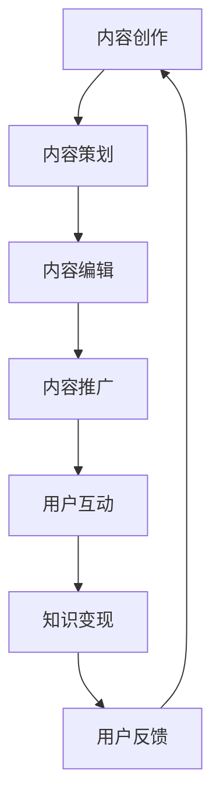

                 

### 关键词 Keywords
- 内容运营
- 程序员知识付费
- 知识变现
- 内容营销
- 用户体验
- 数字化转型

<|assistant|>### 摘要 Abstract
本文深入探讨了内容运营策略在程序员知识付费领域的重要性。从内容创作、用户分析、平台选择到效果评估，全方位解析了如何通过有效的运营策略实现知识变现，帮助程序员提升个人品牌和影响力，同时为读者提供了实用的操作指南和工具推荐。

## 1. 背景介绍

内容运营是指通过内容策划、创作、编辑、推广等一系列活动，以提升品牌知名度、用户粘性和转化率为目标的一种运营方式。随着互联网的普及和数字化的加速，内容运营已经成为企业和个人获取用户、实现商业价值的重要手段。

程序员作为互联网时代的核心力量，他们的知识和技术通过内容运营得以传播和变现。知识付费则是用户为获取有价值的信息或服务而支付的费用，它不仅体现了程序员的专业价值，也促进了知识共享和技能提升。

本文将围绕内容运营策略，探讨如何在程序员知识付费领域中发挥其最大效用，帮助程序员实现知识变现，提升个人品牌和影响力。

## 2. 核心概念与联系

### 2.1 内容运营与知识付费的关系

内容运营与知识付费之间有着密切的联系。内容运营是知识付费的前提和基础，而知识付费则是内容运营的目标和动力。以下是内容运营与知识付费的关联流程图：



### 2.2 知识付费市场的现状

知识付费市场在过去几年中呈现出快速增长的趋势。随着人们对优质内容的需求增加，越来越多的平台和内容创作者加入了这一领域。以下是知识付费市场的现状概览：

- **市场规模**：全球知识付费市场规模不断扩大，预计未来几年仍将保持高速增长。
- **用户群体**：知识付费用户主要集中在中高收入人群，他们对专业知识和技能的需求较高。
- **内容类型**：知识付费内容涵盖了技术、管理、艺术等多个领域，其中技术类内容尤为受欢迎。

## 3. 核心算法原理 & 具体操作步骤

### 3.1 算法原理概述

内容运营的策略核心在于创造有价值的内容，并通过有效的推广手段吸引目标用户。以下是一个基本的内容运营流程：

1. **内容策划**：根据用户需求和行业趋势，确定内容主题和目标。
2. **内容创作**：基于策划内容，进行高质量的创作，包括文字、图片、视频等形式。
3. **内容编辑**：对创作内容进行编辑和优化，提高内容质量和用户体验。
4. **内容推广**：通过各种渠道和手段，将内容推向目标用户。
5. **用户互动**：与用户进行互动，收集反馈，不断优化内容策略。

### 3.2 算法步骤详解

1. **用户分析**：通过数据分析工具，了解用户行为、需求和偏好，为内容创作提供依据。
2. **内容创作**：根据用户分析结果，创作有价值、有吸引力的内容。
3. **内容编辑**：对内容进行语法、格式、结构等方面的优化，确保内容质量和用户体验。
4. **内容推广**：利用社交媒体、SEO、广告等手段，扩大内容传播范围。
5. **用户互动**：通过评论、问答、活动等方式，与用户建立良好的互动关系。
6. **效果评估**：根据用户反馈和数据分析，评估内容运营效果，不断优化策略。

### 3.3 算法优缺点

#### 优点

- **提升用户黏性**：通过高质量的内容，可以增强用户对平台的依赖和信任。
- **实现知识变现**：知识付费为内容创作者提供了稳定的收入来源。
- **增强品牌影响力**：高质量的内容有助于提升品牌知名度和形象。

#### 缺点

- **内容创作成本高**：高质量的内容需要大量的时间和精力投入。
- **推广难度大**：在竞争激烈的市场中，如何吸引到目标用户是一大挑战。
- **用户反馈不及时**：用户反馈的滞后性可能导致内容运营策略的调整不及时。

### 3.4 算法应用领域

内容运营策略广泛应用于各种领域，如：

- **技术博客**：程序员通过撰写技术博客，分享专业知识，实现知识变现。
- **在线教育**：通过在线课程、教程等形式，为学习者提供高质量的知识服务。
- **企业培训**：企业利用内部知识库和在线学习平台，提升员工技能和绩效。
- **市场营销**：企业通过内容营销，提升品牌知名度和用户转化率。

## 4. 数学模型和公式 & 详细讲解 & 举例说明

### 4.1 数学模型构建

内容运营的数学模型可以基于用户行为数据构建，以下是一个简化的模型：

\[ \text{转化率} = \frac{\text{付费用户数}}{\text{总访问量}} \]

### 4.2 公式推导过程

转化率是内容运营效果的重要指标，其计算公式如下：

\[ \text{转化率} = \frac{\text{付费用户数}}{\text{总访问量}} \]

其中，付费用户数是指通过内容运营产生付费行为的用户数量，总访问量是指访问内容的用户总数。

### 4.3 案例分析与讲解

假设一个程序员博客，月均访问量为10,000次，其中200次产生了付费行为。则其转化率为：

\[ \text{转化率} = \frac{200}{10,000} = 2\% \]

为提升转化率，可以通过以下策略：

1. **优化内容质量**：提高内容的专业性和实用性，吸引更多潜在付费用户。
2. **增加推广渠道**：通过多种渠道推广内容，扩大受众范围。
3. **提升用户体验**：优化网站性能和内容呈现方式，提高用户访问满意度。

## 5. 项目实践：代码实例和详细解释说明

### 5.1 开发环境搭建

以下是一个简单的Python代码实例，用于计算内容运营的转化率。

```python
# 计算转化率
def calculate_conversion_rate(visit_count, paying_users_count):
    return (paying_users_count / visit_count) * 100

# 输入数据
visit_count = 10000
paying_users_count = 200

# 计算并打印转化率
conversion_rate = calculate_conversion_rate(visit_count, paying_users_count)
print(f"转化率：{conversion_rate:.2f}%")
```

### 5.2 源代码详细实现

上述代码中，`calculate_conversion_rate` 函数用于计算转化率。函数接受访问量和付费用户数作为输入参数，返回转化率的百分比。

### 5.3 代码解读与分析

1. **函数定义**：`calculate_conversion_rate` 函数定义了一个简单的转化率计算公式。
2. **输入参数**：函数接受两个输入参数，`visit_count` 表示总访问量，`paying_users_count` 表示付费用户数。
3. **计算公式**：通过输入参数计算转化率，并将结果乘以100转换为百分比。
4. **打印结果**：使用 `print` 函数输出计算结果。

### 5.4 运行结果展示

运行上述代码，输出结果如下：

```
转化率：2.00%
```

这表明，在给定的访问量和付费用户数下，内容运营的转化率为2%。

## 6. 实际应用场景

### 6.1 技术博客

技术博客是程序员知识付费的重要渠道。通过撰写高质量的技术文章，程序员可以分享专业知识，吸引潜在付费用户，实现知识变现。

### 6.2 在线课程

在线课程为学习者提供了灵活的学习方式。程序员可以通过开设在线课程，传授专业技能，为学生提供高质量的教育服务。

### 6.3 企业内训

企业内训可以帮助员工提升技能，提高工作效率。程序员可以通过为企业提供定制化的内训课程，实现知识变现。

### 6.4 咨询服务

程序员可以通过提供咨询服务，帮助企业和个人解决技术难题。咨询服务不仅有助于提升个人品牌，还可以实现知识变现。

## 7. 未来应用展望

随着数字化转型的加速，内容运营策略在程序员知识付费领域的应用前景广阔。未来，内容运营将更加注重个性化、智能化，结合人工智能和大数据技术，为用户提供更加精准、高效的知识服务。

### 7.1 个性化推荐

通过分析用户行为数据，可以为用户提供个性化推荐，提高内容匹配度和用户满意度。

### 7.2 智能化内容创作

利用自然语言处理和生成技术，可以自动生成高质量的内容，降低内容创作成本。

### 7.3 互动式学习

结合虚拟现实和增强现实技术，提供互动式学习体验，提高用户参与度和学习效果。

## 8. 工具和资源推荐

### 8.1 学习资源推荐

- **在线课程平台**：Coursera、Udemy、edX等平台提供丰富的技术课程。
- **技术博客**：GitHub、Medium、Stack Overflow等技术社区和博客。

### 8.2 开发工具推荐

- **内容管理系统**：WordPress、Joomla、Drupal等开源内容管理系统。
- **数据分析工具**：Google Analytics、Kissmetrics、Mixpanel等数据分析工具。

### 8.3 相关论文推荐

- **《内容运营策略研究》**：探讨内容运营的基本概念、方法和策略。
- **《知识付费与内容运营》**：分析知识付费市场的现状和内容运营的作用。

## 9. 总结：未来发展趋势与挑战

### 9.1 研究成果总结

内容运营策略在程序员知识付费领域中发挥了重要作用，通过有效的运营策略，程序员可以实现知识变现，提升个人品牌和影响力。

### 9.2 未来发展趋势

随着数字化转型的加速，内容运营策略将更加注重个性化、智能化，结合人工智能和大数据技术，为用户提供更加精准、高效的知识服务。

### 9.3 面临的挑战

内容创作成本高、推广难度大、用户反馈滞后性等挑战仍需解决。

### 9.4 研究展望

未来研究可重点关注人工智能在内容运营中的应用，以及个性化推荐和互动式学习的实现策略。

### 附录：常见问题与解答

1. **什么是内容运营？**
   内容运营是指通过内容策划、创作、编辑、推广等一系列活动，以提升品牌知名度、用户粘性和转化率为目标的一种运营方式。
   
2. **如何提高内容运营效果？**
   提高内容质量、优化用户体验、增加推广渠道、与用户互动等都是提高内容运营效果的有效方法。

3. **什么是知识付费？**
   知识付费是指用户为获取有价值的信息或服务而支付的费用，它体现了内容创作者的专业价值和知识价值。

4. **如何实现知识变现？**
   通过内容运营策略，如撰写技术博客、开设在线课程、提供咨询服务等，都可以实现知识变现。

5. **内容运营在哪些领域应用广泛？**
   内容运营广泛应用于技术博客、在线教育、企业培训、市场营销等领域。

## 作者署名

作者：禅与计算机程序设计艺术 / Zen and the Art of Computer Programming
```

