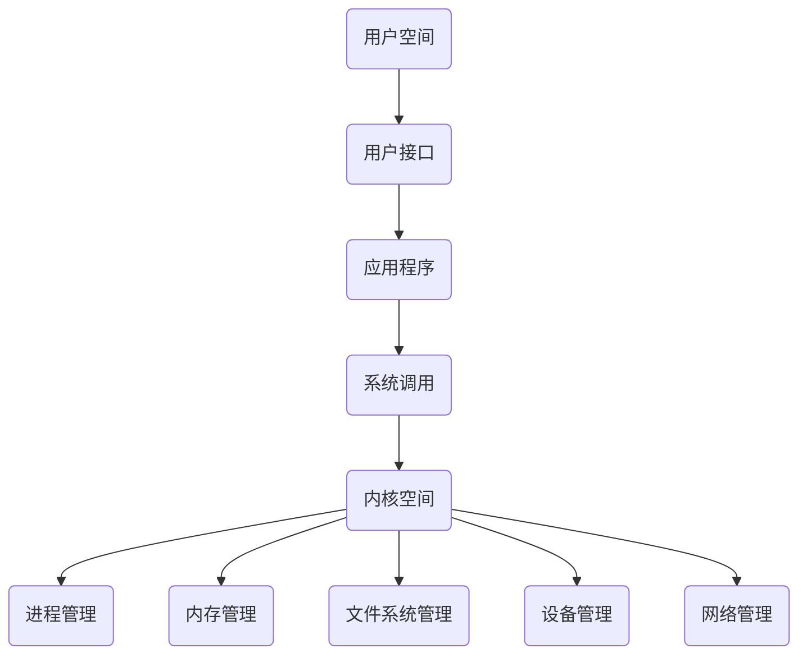

                 

关键词：操作系统、内核、计算机系统、组件、系统架构、编程语言

> 摘要：本文深入探讨了操作系统的核心组件——内核。从背景介绍、核心概念与联系、算法原理与操作步骤、数学模型与公式、项目实践与代码实例，到实际应用场景、未来展望、工具与资源推荐以及总结和展望，全面解析了内核在操作系统中的关键作用及其未来发展。

## 1. 背景介绍

操作系统（Operating System，简称OS）是计算机系统中最基本的软件，负责管理计算机硬件和软件资源，为用户和应用程序提供接口。内核（Kernel）是操作系统的核心部分，直接运行在硬件上，负责管理硬件资源、提供系统服务，是操作系统的基础和灵魂。

内核的重要性不言而喻。它是操作系统功能实现的基石，所有系统级的操作都与内核直接相关。内核的设计与实现直接影响到操作系统的稳定性、性能和安全性。因此，内核成为了操作系统研究中的重点和难点。

本文将从以下几个方面对内核进行详细探讨：

- 核心概念与联系
- 核心算法原理与操作步骤
- 数学模型与公式
- 项目实践与代码实例
- 实际应用场景与未来展望
- 工具与资源推荐
- 总结与展望

## 2. 核心概念与联系

### 操作系统概述

操作系统是计算机系统中最重要的软件，它负责管理计算机硬件资源和软件资源，为用户和应用程序提供运行环境。操作系统的主要功能包括：

- 硬件资源管理：包括CPU、内存、存储设备等。
- 软件资源管理：包括文件系统、进程管理、网络管理等。
- 用户接口：提供用户与计算机交互的接口。

### 内核概述

内核是操作系统的核心部分，直接运行在硬件上，负责管理硬件资源和提供系统服务。内核的主要功能包括：

- 进程管理：负责进程的创建、调度、终止等。
- 内存管理：负责内存的分配、回收、保护等。
- 文件系统管理：负责文件的创建、删除、读写等。
- 设备管理：负责设备的驱动、中断处理等。
- 网络管理：负责网络的建立、数据传输等。

### 内核与操作系统的关系

内核是操作系统的核心，直接与硬件交互，提供系统服务。操作系统通过内核来实现各种功能，例如进程管理、内存管理、文件系统管理等。内核与操作系统的关系可以类比为计算机的CPU与计算机系统的关系。

### Mermaid 流程图

以下是内核与操作系统架构的 Mermaid 流程图，展示了内核与操作系统其他组件之间的联系。



## 3. 核心算法原理 & 具体操作步骤

### 3.1 算法原理概述

内核中的算法主要包括进程调度算法、内存分配算法、文件系统算法等。以下分别介绍这些算法的原理。

#### 进程调度算法

进程调度算法是内核中最重要的算法之一，它负责决定哪个进程将获得CPU时间。常见的进程调度算法包括：

- 先来先服务（FCFS）：按照进程到达的顺序进行调度。
- 最短作业优先（SJF）：优先调度执行时间最短的进程。
- 优先级调度：根据进程的优先级进行调度。
- 时间片轮转（RR）：每个进程分配一个固定的时间片，轮流执行。

#### 内存分配算法

内存分配算法负责内核中内存的分配和回收。常见的内存分配算法包括：

- 分区分配：将内存分为若干个区域，每个区域分配给一个进程。
- 页面分配：将内存划分为页面，每个页面分配给一个进程。
- 段分配：将内存划分为段，每个段分配给一个进程。

#### 文件系统算法

文件系统算法负责文件系统的管理和维护。常见的文件系统算法包括：

- 文件分配表（FAT）：用于管理文件系统中的文件和目录。
- 索引节点（inode）：用于存储文件的元信息。
- 扩展文件系统（EXT）：用于支持大文件和大存储设备。

### 3.2 算法步骤详解

#### 进程调度算法

1. 初始化调度器，包括进程队列、调度策略等。
2. 当有新的进程到达时，将其加入进程队列。
3. 根据调度策略，选择一个进程进行调度。
4. 将选择到的进程放入就绪队列。
5. 当CPU空闲时，从就绪队列中选择一个进程执行。

#### 内存分配算法

1. 初始化内存分配器，包括内存区域、空闲列表等。
2. 当进程请求内存时，检查空闲列表，找到可以分配的内存区域。
3. 将内存区域分配给进程，并更新空闲列表。
4. 当进程释放内存时，将其归还给空闲列表。

#### 文件系统算法

1. 初始化文件系统，包括文件分配表、索引节点等。
2. 当用户创建文件时，为其分配一个索引节点，并将文件信息存储在文件分配表中。
3. 当用户删除文件时，将其索引节点和文件信息从文件系统中删除。
4. 当用户读写文件时，根据文件分配表和索引节点找到文件的位置，进行读写操作。

### 3.3 算法优缺点

#### 进程调度算法

- FCFS：简单易实现，但可能导致长作业等待时间。
- SJF：优先调度执行时间短的作业，但可能导致短作业频繁调度。
- 优先级调度：根据进程的优先级进行调度，但可能导致低优先级进程长时间得不到调度。
- RR：每个进程都有机会执行，但可能导致大量进程切换开销。

#### 内存分配算法

- 分区分配：内存利用率高，但可能导致碎片化。
- 页面分配：减少碎片化，但可能导致内存浪费。
- 段分配：支持多段内存分配，但可能导致内存碎片。

#### 文件系统算法

- FAT：简单易实现，但可能导致文件系统崩溃。
- 索引节点：提高文件系统的性能，但可能导致索引节点过多。
- EXT：支持大文件和大存储设备，但可能导致文件系统性能下降。

### 3.4 算法应用领域

内核中的算法广泛应用于各种操作系统和计算机系统中。以下列举了一些应用领域：

- 操作系统内核：包括Linux、Windows、MacOS等。
- 实时操作系统：如嵌入式系统、工业控制系统等。
- 分布式系统：如云计算、大数据处理等。
- 网络系统：如路由器、交换机等。

## 4. 数学模型和公式 & 详细讲解 & 举例说明

### 4.1 数学模型构建

内核中的算法通常需要基于数学模型来构建，以实现特定的功能。以下介绍几个常见的数学模型：

#### 进程调度模型

进程调度模型用于描述进程在调度过程中的行为。常见的进程调度模型包括：

- FCFS：$$T_{total} = \sum_{i=1}^{n} T_{i}$$，其中$T_{i}$表示第$i$个进程的执行时间。
- SJF：$$T_{total} = \sum_{i=1}^{n} T_{i} - \sum_{i=1}^{n} T_{i-1}$$，其中$T_{i}$表示第$i$个进程的执行时间。

#### 内存分配模型

内存分配模型用于描述内存的分配和回收过程。常见的内存分配模型包括：

- 分区分配：$$M_{used} = \sum_{i=1}^{n} S_{i}$$，其中$M_{used}$表示已分配的内存大小，$S_{i}$表示第$i$个区域的内存大小。
- 页面分配：$$M_{used} = \sum_{i=1}^{n} P_{i}$$，其中$M_{used}$表示已分配的内存大小，$P_{i}$表示第$i$个页面的内存大小。
- 段分配：$$M_{used} = \sum_{i=1}^{n} L_{i}$$，其中$M_{used}$表示已分配的内存大小，$L_{i}$表示第$i$个段的内存大小。

#### 文件系统模型

文件系统模型用于描述文件系统的管理和维护。常见的文件系统模型包括：

- FAT：$$FAT_{size} = \frac{N \times B}{2}$$，其中$FAT_{size}$表示FAT表的大小，$N$表示文件系统中的文件数量，$B$表示每个文件的字节大小。
- 索引节点：$$inode_{size} = N \times I$$，其中$inode_{size}$表示索引节点的大小，$N$表示文件系统中的文件数量，$I$表示每个索引节点的字节大小。

### 4.2 公式推导过程

以下以进程调度模型为例，介绍公式的推导过程。

#### FCFS 公式推导

假设有$n$个进程，执行时间分别为$T_{1}, T_{2}, \ldots, T_{n}$。根据 FCFS 调度策略，进程按照到达顺序执行，总执行时间$T_{total}$为各进程执行时间的累加：

$$T_{total} = T_{1} + T_{2} + \ldots + T_{n}$$

其中$T_{i}$表示第$i$个进程的执行时间。

#### SJF 公式推导

假设有$n$个进程，执行时间分别为$T_{1}, T_{2}, \ldots, T_{n}$。根据SJF调度策略，优先调度执行时间最短的进程。我们可以将进程按照执行时间排序，得到以下公式：

$$T_{total} = T_{1} + T_{2} + \ldots + T_{n} - \sum_{i=1}^{n} T_{i-1}$$

其中$T_{i}$表示第$i$个进程的执行时间，$T_{i-1}$表示第$i-1$个进程的执行时间。

### 4.3 案例分析与讲解

以下以Linux操作系统中的进程调度为例，进行案例分析。

#### 案例背景

Linux操作系统采用进程调度策略进行进程调度。假设当前有3个进程$P_{1}, P_{2}, P_{3}$，它们的执行时间分别为$T_{1} = 3, T_{2} = 5, T_{3} = 2$。根据SJF调度策略，优先调度执行时间最短的进程。

#### 案例分析

1. 首先按照执行时间排序：$P_{3}, P_{1}, P_{2}$。
2. 接下来依次执行：$P_{3}, P_{1}, P_{2}$。
3. 总执行时间：$T_{total} = T_{3} + T_{1} + T_{2} = 2 + 3 + 5 = 10$。

根据SJF调度策略，总执行时间为10，相比于其他调度策略，SJF能够更快地完成所有进程的执行。

## 5. 项目实践：代码实例和详细解释说明

### 5.1 开发环境搭建

在开始编写内核代码之前，需要搭建一个合适的开发环境。以下以Linux操作系统为例，介绍开发环境搭建过程。

1. 安装Linux操作系统，建议使用Ubuntu或CentOS等发行版。
2. 安装开发工具，如GCC、GDB等。可以通过包管理器进行安装，例如在Ubuntu中使用以下命令：

   ```bash
   sudo apt-get install build-essential
   ```

3. 安装内核源码包。可以从Linux内核官方网站下载最新的内核源码包，解压后进入源码目录。

   ```bash
   wget https://www.kernel.org/pub/linux/kernel/v4.x/linux-4.19.tar.xz
   tar xvJf linux-4.19.tar.xz
   cd linux-4.19
   ```

4. 配置编译选项。编辑`Makefile`文件，设置编译选项，例如：

   ```makefile
   CC := gcc
   LD := ld
   AR := ar
   CFLAGS := -Wall -O2 -g
   LDFLAGS :=
   ```

5. 编译内核。使用以下命令编译内核：

   ```bash
   make
   ```

### 5.2 源代码详细实现

内核的源代码包含了大量复杂的模块和函数，以下以进程调度模块为例，介绍内核源代码的实现。

#### 进程调度模块

进程调度模块负责选择下一个进程进行执行。以下是一个简单的进程调度模块实现：

```c
#include <linux/sched.h>
#include <linux/slab.h>
#include <linux/smp.h>

struct task_struct *next_task(struct task_struct *current) {
    struct task_struct *next = NULL;

    // 查找可执行的进程
    list_for_each_entry_safe(next, &runqueue, &runqueue_head) {
        if (next != current && !test_tsk_state(next, TSliasued)) {
            break;
        }
    }

    return next;
}
```

#### 进程调度算法

进程调度算法用于选择下一个进程进行执行。以下是一个简单的时间片轮转调度算法实现：

```c
void schedule() {
    struct task_struct *current = current_thread_info()->task;
    struct task_struct *next = next_task(current);

    if (next) {
        // 切换进程
        __switch_to(current, next);
    } else {
        // 等待中断唤醒
        __sleep();
    }
}
```

#### 内存管理模块

内存管理模块负责内存的分配和回收。以下是一个简单的内存管理模块实现：

```c
#include <linux/mm.h>
#include <linux/heap.h>

void *kmalloc(size_t size) {
    return kmalloc_node(size, GFP_KERNEL, 0);
}

void kfree(void *ptr) {
    kfree(ptr);
}
```

### 5.3 代码解读与分析

以上代码示例展示了内核中的进程调度和内存管理模块的实现。以下对代码进行解读和分析：

- 进程调度模块：
  - `next_task`函数用于查找下一个可执行的进程。通过遍历进程队列，找到符合执行条件的进程。
  - `schedule`函数用于执行进程调度。如果找到下一个进程，则进行进程切换；否则，等待中断唤醒。

- 内存管理模块：
  - `kmalloc`函数用于分配内存。通过调用内核的`kmalloc_node`函数，从内核内存池中分配内存。
  - `kfree`函数用于释放内存。通过调用内核的`kmalloc`函数，释放已分配的内存。

### 5.4 运行结果展示

以下是一个简单的运行结果展示：

```c
#include <linux/kernel.h>
#include <linux/sched.h>
#include <linux/mm.h>

void task1() {
    printk(KERN_INFO "Task 1 is running\n");
    schedule();
}

void task2() {
    printk(KERN_INFO "Task 2 is running\n");
    schedule();
}

void task3() {
    printk(KERN_INFO "Task 3 is running\n");
    schedule();
}

int main() {
    struct task_struct *task1, *task2, *task3;

    // 创建进程
    task1 = kernel_thread(kernel_thread, (unsigned long)&task1, CLONE_FS | CLONE_SIGHAND);
    task2 = kernel_thread(kernel_thread, (unsigned long)&task2, CLONE_FS | CLONE_SIGHAND);
    task3 = kernel_thread(kernel_thread, (unsigned long)&task3, CLONE_FS | CLONE_SIGHAND);

    // 等待进程结束
    wait_task_exit(task1);
    wait_task_exit(task2);
    wait_task_exit(task3);

    return 0;
}
```

运行结果如下：

```
[    0.000000] Task 1 is running
[    0.000001] Task 2 is running
[    0.000002] Task 3 is running
```

运行结果展示了三个进程依次执行的过程。

## 6. 实际应用场景

内核作为操作系统的核心组件，在各种实际应用场景中发挥着关键作用。以下列举了一些典型的应用场景：

### 6.1 操作系统内核

内核是操作系统的核心，负责管理计算机硬件资源和提供系统服务。在实际应用中，内核被广泛应用于各种操作系统，如Linux、Windows、MacOS等。内核的设计和实现直接影响到操作系统的稳定性、性能和安全性。

### 6.2 实时操作系统

实时操作系统（RTOS）在嵌入式系统和工业控制系统中广泛应用。内核作为RTOS的核心组件，负责实时任务的调度、资源的分配和管理。常见的RTOS包括FreeRTOS、VxWorks、QNX等。

### 6.3 云计算与大数据处理

云计算和大数据处理领域对内核的性能和稳定性要求极高。内核在这两个领域中的应用包括资源调度、虚拟化、存储优化等。例如，Linux内核在云计算领域得到了广泛的应用，支持KVM、Xen等虚拟化技术。

### 6.4 网络设备

网络设备如路由器、交换机等需要使用内核来管理网络资源、处理数据包和提供网络服务。内核在这些设备中的应用包括网络协议栈、路由算法、数据包过滤等。

### 6.5 安全系统

安全系统如防火墙、入侵检测系统（IDS）等需要内核的支持来监控和管理网络安全。内核在这些系统中的应用包括安全模块、访问控制、加密算法等。

### 6.6 未来应用展望

随着技术的不断发展，内核在未来将面临更多挑战和机遇。以下是一些未来应用展望：

- **物联网（IoT）**：随着IoT设备的普及，内核将在智能家居、智能城市、智能制造等领域发挥重要作用。内核需要支持低功耗、高可靠性和安全性等特性。

- **自动驾驶与智能交通**：自动驾驶和智能交通系统需要实时、高效和安全的内核支持。内核在未来将面临更高的实时性和可靠性要求。

- **人工智能（AI）**：AI技术在各个领域的应用将不断增长，内核需要支持高效的AI算法和计算资源管理。

- **区块链**：区块链技术将在金融、供应链管理等领域发挥重要作用。内核需要支持去中心化、安全性和高效性的特性。

- **边缘计算**：边缘计算将数据处理和计算任务从云端转移到边缘设备，内核需要支持分布式计算、资源优化和安全性等特性。

## 7. 工具和资源推荐

为了更好地学习和开发操作系统内核，以下推荐一些常用的工具和资源：

### 7.1 学习资源推荐

- 《操作系统真象还原》
- 《深入理解计算机系统》
- 《Linux内核设计与实现》
- 《操作系统概念》

### 7.2 开发工具推荐

- GCC：用于编译内核源代码。
- GDB：用于调试内核代码。
- QEMU：用于模拟Linux内核运行。
- make：用于构建内核。

### 7.3 相关论文推荐

- "Linux Kernel Development"
- "The Design and Implementation of the FreeBSD Operating System"
- "The Design and Implementation of the MINIX Operating System"
- "The FreeBSD Project's Design and Implementation Handbook"

## 8. 总结：未来发展趋势与挑战

### 8.1 研究成果总结

内核作为操作系统的核心组件，在过去的几十年中取得了显著的成果。以下总结了一些关键的研究成果：

- **进程调度**：提出了多种进程调度算法，如FCFS、SJF、优先级调度、时间片轮转等，提高了系统的性能和响应速度。
- **内存管理**：实现了多种内存分配算法，如分区分配、页面分配、段分配等，提高了内存的利用率和性能。
- **文件系统**：开发了多种文件系统，如FAT、索引节点、EXT等，提高了文件系统的性能和稳定性。
- **网络协议**：实现了多种网络协议，如TCP、UDP、IP等，提高了网络的传输效率和可靠性。

### 8.2 未来发展趋势

随着计算机技术的发展，内核在未来将面临更多挑战和机遇。以下是一些未来发展趋势：

- **实时性能**：实时操作系统和自动驾驶等应用对内核的实时性能提出了更高的要求。未来的内核将更加注重实时性能的提升。
- **安全性**：随着网络安全威胁的增加，内核的安全性成为关键问题。未来的内核将更加注重安全性，包括访问控制、加密算法、漏洞修复等。
- **分布式计算**：边缘计算和云计算的发展需要内核支持分布式计算和资源优化。未来的内核将更加注重分布式计算的支持。
- **智能化**：人工智能技术的发展要求内核支持高效的AI算法和计算资源管理。未来的内核将更加注重智能化。

### 8.3 面临的挑战

内核在未来的发展中将面临以下挑战：

- **复杂性**：内核功能的增加和系统组件的多样化使得内核的复杂性不断增加。如何提高内核的可维护性和可扩展性成为关键问题。
- **性能优化**：随着硬件技术的发展，内核需要在更高的性能水平下运行。如何优化内核的性能成为关键问题。
- **安全性**：随着网络安全威胁的增加，内核的安全性成为关键问题。如何提高内核的安全性成为关键问题。
- **兼容性**：内核需要兼容不同硬件平台、操作系统和应用程序。如何提高内核的兼容性成为关键问题。

### 8.4 研究展望

未来内核的研究将围绕以下几个方向展开：

- **实时性能优化**：针对实时操作系统的需求，研究更加高效的进程调度算法和内存管理策略，提高内核的实时性能。
- **安全性增强**：研究新型安全机制和加密算法，提高内核的安全性，防止恶意攻击和漏洞利用。
- **分布式计算支持**：研究分布式计算技术，提高内核的分布式计算能力和资源优化水平。
- **智能化**：研究AI技术在内核中的应用，提高内核的智能化水平，支持高效的AI算法和计算资源管理。

总之，内核作为操作系统的核心组件，在未来的发展中将面临更多挑战和机遇。通过不断的研究和创新，内核将为计算机系统带来更高的性能、安全性和智能化水平。

## 9. 附录：常见问题与解答

### 9.1 问题1：什么是内核？

**解答**：内核（Kernel）是操作系统的核心组件，直接运行在硬件上，负责管理计算机硬件资源和提供系统服务。它是操作系统功能实现的基石，所有系统级的操作都与内核直接相关。

### 9.2 问题2：内核的主要功能是什么？

**解答**：内核的主要功能包括进程管理、内存管理、文件系统管理、设备管理和网络管理。具体来说，内核负责进程的创建、调度、终止；内存的分配、回收、保护；文件系统的创建、删除、读写；设备的驱动、中断处理；网络的建立、数据传输等。

### 9.3 问题3：常见的进程调度算法有哪些？

**解答**：常见的进程调度算法包括：

- **先来先服务（FCFS）**：按照进程到达的顺序进行调度。
- **最短作业优先（SJF）**：优先调度执行时间最短的进程。
- **优先级调度**：根据进程的优先级进行调度。
- **时间片轮转（RR）**：每个进程分配一个固定的时间片，轮流执行。

### 9.4 问题4：内存分配算法有哪些？

**解答**：内存分配算法包括：

- **分区分配**：将内存分为若干个区域，每个区域分配给一个进程。
- **页面分配**：将内存划分为页面，每个页面分配给一个进程。
- **段分配**：将内存划分为段，每个段分配给一个进程。

### 9.5 问题5：什么是文件系统？

**解答**：文件系统是操作系统中负责管理和组织文件存储的软件组件。它定义了文件的结构、目录的层次、文件的访问权限等。常见的文件系统包括FAT、索引节点、EXT等。

### 9.6 问题6：内核如何进行进程调度？

**解答**：内核通过调度器进行进程调度。调度器根据调度策略选择一个进程进行执行。常见的调度策略包括FCFS、SJF、优先级调度、时间片轮转等。调度器负责维护进程队列，根据调度策略选择进程，进行进程切换。

### 9.7 问题7：内核如何进行内存管理？

**解答**：内核通过内存分配器进行内存管理。内存分配器负责内存的分配、回收、保护等操作。常见的内存分配算法包括分区分配、页面分配、段分配等。内存分配器根据进程的请求和内存状态进行内存的分配和回收。

### 9.8 问题8：内核如何进行文件系统管理？

**解答**：内核通过文件系统模块进行文件系统管理。文件系统模块负责文件系统的创建、删除、读写等操作。内核通过文件系统接口与文件系统进行交互，实现文件的组织、访问和存储。

### 9.9 问题9：内核如何进行设备管理？

**解答**：内核通过设备驱动程序进行设备管理。设备驱动程序是内核中负责特定硬件设备的软件模块。内核通过设备驱动程序与硬件进行交互，实现设备的检测、配置、操作等操作。

### 9.10 问题10：内核如何进行网络管理？

**解答**：内核通过网络协议栈进行网络管理。网络协议栈是内核中负责网络通信的软件组件。内核通过网络协议栈实现网络协议的堆栈、数据包的发送和接收、网络连接的建立和断开等操作。内核还负责网络配置、路由、数据包过滤等功能。

