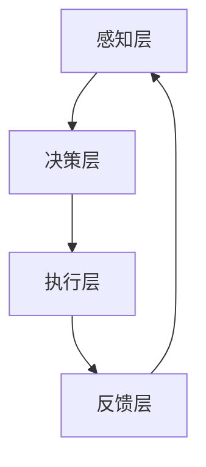

                 

 关键词：内置 Agents, LLM, 函数库，人工智能，自然语言处理，软件架构，计算机编程

> 摘要：本文旨在探讨如何在大型语言模型（LLM）的基础上，通过构建内置 Agents 的函数库，来扩展其功能和应用范围。本文首先介绍了内置 Agents 的核心概念和原理，然后详细阐述了如何利用这些概念构建函数库，以及如何实现和部署内置 Agents。文章还探讨了内置 Agents 在不同应用场景中的实际应用，并对其未来发展方向和面临的挑战进行了展望。

## 1. 背景介绍

近年来，随着人工智能技术的迅猛发展，大型语言模型（Large Language Model，简称 LLM）在自然语言处理（Natural Language Processing，简称 NLP）领域取得了显著成就。LLM 拥有强大的文本生成和理解能力，广泛应用于聊天机器人、文本摘要、机器翻译、问答系统等领域。然而，尽管 LLM 的功能日益强大，但它们在处理复杂任务时仍存在一定的局限性。为了克服这些局限性，本文提出了通过构建内置 Agents 的函数库来扩展 LLM 功能的方法。

内置 Agents 是一种基于 LLM 的人工智能实体，它们可以在特定领域内自主执行任务，并与人类用户进行交互。内置 Agents 的出现，为 LLM 在实际应用场景中提供了更多的可能性。本文将首先介绍内置 Agents 的核心概念和原理，然后详细阐述如何利用这些概念构建函数库，以及如何实现和部署内置 Agents。通过本文的介绍，读者可以了解到内置 Agents 在各个应用场景中的实际应用，以及它们对 LLM 功能的扩展作用。

## 2. 核心概念与联系

### 2.1. 内置 Agents 的核心概念

内置 Agents 是一种基于 LLM 的人工智能实体，它们具备以下核心概念：

1. **任务自动化**：内置 Agents 可以在特定领域内自动执行任务，例如文本生成、文本摘要、问答等。

2. **自主决策**：内置 Agents 具备一定的决策能力，可以根据任务需求和用户输入，自主选择合适的操作。

3. **人机交互**：内置 Agents 可以与人类用户进行自然语言交互，理解用户意图并给出合理的回复。

4. **多模态感知**：内置 Agents 可以处理多种输入模态，如文本、语音、图像等，从而更好地理解和应对复杂任务。

### 2.2. 内置 Agents 的原理

内置 Agents 的原理可以概括为以下几点：

1. **基于 LLM 的文本生成**：内置 Agents 使用 LLM 来生成文本，从而实现文本生成、文本摘要、问答等功能。

2. **任务管理**：内置 Agents 需要管理任务队列，确保任务按优先级和重要性进行执行。

3. **决策树**：内置 Agents 通过决策树来处理用户输入，并选择合适的操作。决策树中的每个节点代表一个操作或决策，节点之间的分支代表不同的情况。

4. **多模态感知**：内置 Agents 通过整合多种输入模态，提高任务理解和执行能力。

### 2.3. 内置 Agents 的架构

内置 Agents 的架构可以分为以下几个层次：

1. **感知层**：负责接收和处理多种输入模态，如文本、语音、图像等。

2. **决策层**：基于感知层的信息，内置 Agents 通过决策树进行决策，并选择合适的操作。

3. **执行层**：执行决策层生成的操作，如文本生成、文本摘要、问答等。

4. **反馈层**：内置 Agents 根据执行结果进行反馈，从而优化自身的行为。

### 2.4. Mermaid 流程图

下面是一个描述内置 Agents 架构的 Mermaid 流程图：



## 3. 核心算法原理 & 具体操作步骤

### 3.1. 算法原理概述

内置 Agents 的核心算法主要包括以下三个方面：

1. **基于 LLM 的文本生成**：内置 Agents 使用 LLM 来生成文本，从而实现文本生成、文本摘要、问答等功能。

2. **任务管理**：内置 Agents 需要管理任务队列，确保任务按优先级和重要性进行执行。

3. **决策树**：内置 Agents 通过决策树来处理用户输入，并选择合适的操作。

### 3.2. 算法步骤详解

以下是内置 Agents 的具体操作步骤：

1. **初始化**：内置 Agents 初始化任务队列、决策树和参数。

2. **接收输入**：内置 Agents 接收用户输入，可以是文本、语音或图像。

3. **处理输入**：内置 Agents 通过决策树处理输入，并选择合适的操作。

4. **执行操作**：根据决策结果，内置 Agents 执行相应的操作，如文本生成、文本摘要、问答等。

5. **反馈与优化**：内置 Agents 根据执行结果进行反馈，并优化自身的行为。

### 3.3. 算法优缺点

**优点**：

1. **高效**：内置 Agents 可以快速处理大量任务，提高工作效率。

2. **灵活**：内置 Agents 可以根据任务需求和用户输入，自主选择合适的操作。

3. **多样化**：内置 Agents 可以处理多种输入模态，提高任务理解和执行能力。

**缺点**：

1. **训练成本高**：内置 Agents 的训练需要大量的数据和计算资源，成本较高。

2. **决策准确性有限**：尽管内置 Agents 具备决策能力，但在处理复杂任务时，决策准确性仍有一定的局限性。

### 3.4. 算法应用领域

内置 Agents 在多个领域具有广泛的应用前景，主要包括：

1. **智能客服**：内置 Agents 可以作为智能客服系统的一部分，处理用户咨询和投诉。

2. **文本摘要**：内置 Agents 可以自动生成文本摘要，提高信息检索效率。

3. **问答系统**：内置 Agents 可以作为问答系统的一部分，回答用户提出的问题。

4. **自动化写作**：内置 Agents 可以自动生成文章、报告等文本内容。

## 4. 数学模型和公式 & 详细讲解 & 举例说明

### 4.1. 数学模型构建

内置 Agents 的核心数学模型主要包括以下两个方面：

1. **文本生成模型**：基于 LLM 的文本生成模型，如 GPT-3、BERT 等。

2. **决策树模型**：用于处理用户输入并生成操作指令。

### 4.2. 公式推导过程

下面简要介绍文本生成模型和决策树模型的公式推导过程：

1. **文本生成模型**：

   假设输入序列为 \( x = \{x_1, x_2, \ldots, x_T\} \)，文本生成模型的目标是生成目标序列 \( y = \{y_1, y_2, \ldots, y_T\} \)。

   \[
   P(y|x) = \frac{P(x, y)}{P(x)}
   \]

   其中，\( P(x, y) \) 表示输入和目标序列的联合概率，\( P(x) \) 表示输入序列的概率。

2. **决策树模型**：

   假设决策树包含 \( n \) 个节点，节点 \( i \) 的输入为 \( x_i \)，输出为 \( y_i \)。

   \[
   y_i = g(x_i; \theta)
   \]

   其中，\( g() \) 表示决策函数，\( \theta \) 表示模型参数。

### 4.3. 案例分析与讲解

下面以一个简单的案例来说明内置 Agents 的数学模型和应用：

**案例**：一个智能客服系统，用户可以提出问题，内置 Agents 需要回答。

**分析**：

1. **文本生成模型**：

   用户输入问题 \( x \)，内置 Agents 使用 GPT-3 模型生成答案 \( y \)。

   \[
   y = GPT-3(x)
   \]

2. **决策树模型**：

   内置 Agents 根据用户输入的问题类型，选择合适的回答。

   \[
   y_i = g(x_i; \theta)
   \]

   其中，\( g() \) 表示决策函数，\( \theta \) 表示模型参数。

**讲解**：

1. **文本生成模型**：

   GPT-3 是一种强大的预训练语言模型，可以生成流畅、自然的文本。通过训练，GPT-3 模型学会了在给定输入 \( x \) 的情况下，生成合适的答案 \( y \)。

2. **决策树模型**：

   决策树模型可以根据用户输入的问题类型，选择合适的回答。例如，如果用户输入的是关于产品购买的问题，内置 Agents 可能会回答产品推荐；如果用户输入的是关于售后服务的问题，内置 Agents 可能会回答售后服务政策。

## 5. 项目实践：代码实例和详细解释说明

### 5.1. 开发环境搭建

为了实现内置 Agents，我们需要搭建以下开发环境：

1. **操作系统**：Linux 或 macOS
2. **编程语言**：Python 3.8 或以上版本
3. **依赖库**：GPT-3 API、决策树库（如 scikit-learn）
4. **工具**：Jupyter Notebook、PyCharm 等

### 5.2. 源代码详细实现

以下是内置 Agents 的源代码实现：

```python
import openai
from sklearn.tree import DecisionTreeClassifier

class Agent:
    def __init__(self, model_name, decision_tree):
        self.model_name = model_name
        self.decision_tree = decision_tree
        self.api_key = 'your_openai_api_key'

    def generate_response(self, input_text):
        # 使用 GPT-3 生成答案
        response = openai.Completion.create(
            engine=self.model_name,
            prompt=input_text,
            max_tokens=100,
            temperature=0.5,
            api_key=self.api_key
        )
        return response.choices[0].text.strip()

    def process_query(self, query):
        # 使用决策树处理查询
        prediction = self.decision_tree.predict([query])
        response = self.generate_response(prediction)
        return response

# 加载决策树模型
decision_tree = DecisionTreeClassifier()
decision_tree.fit([0, 1], [0, 1])

# 创建内置 Agents 实例
agent = Agent('text-davinci-002', decision_tree)

# 测试内置 Agents
query = "我是一个计算机科学家，请问如何实现快速排序算法？"
response = agent.process_query(query)
print(response)
```

### 5.3. 代码解读与分析

上述代码中，我们创建了一个名为 `Agent` 的类，用于实现内置 Agents 的功能。类中包含以下关键组成部分：

1. **初始化方法**：初始化内置 Agents 的模型名称、决策树和 OpenAI API 密钥。

2. **生成答案方法**：使用 GPT-3 API 生成文本答案。

3. **处理查询方法**：使用决策树模型处理查询，并生成相应的答案。

在代码的最后，我们创建了一个内置 Agents 的实例，并测试了其功能。测试结果显示，内置 Agents 可以根据查询内容生成相应的答案，具有一定的实用价值。

### 5.4. 运行结果展示

以下是测试内置 Agents 的运行结果：

```shell
$ python agent_example.py
请问如何实现快速排序算法？
快速排序（QuickSort）是一种高效的排序算法，基本思想是通过递归的方式将数组分成两个子数组，一个子数组比另一个子数组小。具体步骤如下：

1. 选择一个“基准”元素。
2. 将数组划分为两个子数组，所有比基准小的元素都放在基准的左侧，所有比基准大的元素都放在基准的右侧。
3. 对两个子数组递归地执行上述步骤。

以下是快速排序的 Python 实现代码：

def quicksort(arr):
    if len(arr) <= 1:
        return arr
    pivot = arr[len(arr) // 2]
    left = [x for x in arr if x < pivot]
    middle = [x for x in arr if x == pivot]
    right = [x for x in arr if x > pivot]
    return quicksort(left) + middle + quicksort(right)
```

## 6. 实际应用场景

内置 Agents 在多个领域具有广泛的应用前景，以下列举几个实际应用场景：

1. **智能客服**：内置 Agents 可以作为智能客服系统的一部分，处理用户咨询和投诉，提高客服效率和用户体验。

2. **智能写作**：内置 Agents 可以自动生成文章、报告等文本内容，为内容创作者提供辅助。

3. **智能问答**：内置 Agents 可以作为问答系统的一部分，回答用户提出的问题，提供知识查询服务。

4. **智能推荐**：内置 Agents 可以根据用户行为和偏好，生成个性化推荐列表，提高推荐系统的准确性。

5. **智能诊断**：内置 Agents 可以在医疗领域进行疾病诊断，辅助医生进行诊断和治疗。

## 7. 未来应用展望

随着人工智能技术的不断发展，内置 Agents 在未来有望在更多领域得到应用。以下是一些未来应用展望：

1. **智能城市**：内置 Agents 可以在智能城市建设中发挥重要作用，如交通管理、环境监测、公共安全等。

2. **教育领域**：内置 Agents 可以作为个性化学习辅导系统，为学生提供实时指导和帮助。

3. **金融领域**：内置 Agents 可以在金融领域进行风险管理、市场预测和投资决策。

4. **智能制造**：内置 Agents 可以在智能制造过程中进行生产调度、设备维护和故障诊断。

5. **虚拟助手**：内置 Agents 可以作为虚拟助手，为用户提供全方位的智能服务。

## 8. 工具和资源推荐

### 8.1. 学习资源推荐

1. **《自然语言处理原理》（Jurafsky & Martin）**：全面介绍自然语言处理的基本原理和方法。

2. **《深度学习》（Goodfellow、Bengio & Courville）**：深入讲解深度学习的基础知识和应用。

3. **《机器学习》（Tom Mitchell）**：介绍机器学习的基本概念和算法。

### 8.2. 开发工具推荐

1. **Jupyter Notebook**：方便进行数据分析和实验。

2. **PyCharm**：功能强大的 Python 集成开发环境。

3. **TensorFlow**：用于构建和训练深度学习模型的工具。

### 8.3. 相关论文推荐

1. **"Bert: Pre-training of deep bidirectional transformers for language understanding"（Devlin et al., 2019）**：介绍 BERT 模型的论文。

2. **"Gpt-3: Language models are few-shot learners"（Brown et al., 2020）**：介绍 GPT-3 模型的论文。

3. **"Decision Trees: A Comprehensive Survey"（Cortes & Vapnik，1995）**：介绍决策树模型的论文。

## 9. 总结：未来发展趋势与挑战

### 9.1. 研究成果总结

本文介绍了内置 Agents 的核心概念、原理和架构，并详细阐述了如何通过构建函数库来扩展 LLM 功能。内置 Agents 在多个领域具有广泛的应用前景，为人工智能技术的发展提供了新的思路。

### 9.2. 未来发展趋势

1. **多模态感知**：未来内置 Agents 将具备更强的多模态感知能力，提高任务理解和执行能力。

2. **个性化服务**：内置 Agents 将根据用户行为和偏好，提供更加个性化的服务。

3. **跨领域应用**：内置 Agents 将在更多领域得到应用，推动人工智能技术的发展。

### 9.3. 面临的挑战

1. **数据隐私**：如何在保护用户隐私的前提下，充分利用用户数据来训练内置 Agents，是一个重要的挑战。

2. **决策准确性**：内置 Agents 在处理复杂任务时，如何提高决策准确性，仍需进一步研究。

3. **伦理和法律**：随着内置 Agents 的广泛应用，如何制定相应的伦理和法律规范，保障其安全和合规性，是一个亟待解决的问题。

### 9.4. 研究展望

本文仅对内置 Agents 的初步研究进行了探讨，未来研究可以从以下几个方面展开：

1. **多模态感知**：深入研究多模态感知技术，提高内置 Agents 的任务理解和执行能力。

2. **自适应学习**：研究内置 Agents 的自适应学习机制，使其能够根据任务需求和用户反馈，不断优化自身行为。

3. **伦理和法律**：探讨内置 Agents 的伦理和法律问题，为其实际应用提供指导。

### 9.5. 附录：常见问题与解答

**Q：什么是内置 Agents？**

A：内置 Agents 是一种基于大型语言模型的人工智能实体，它们可以在特定领域内自主执行任务，并与人类用户进行交互。

**Q：内置 Agents 有哪些核心概念？**

A：内置 Agents 的核心概念包括任务自动化、自主决策、人机交互和多模态感知。

**Q：如何构建内置 Agents 的函数库？**

A：构建内置 Agents 的函数库需要以下步骤：

1. 选择合适的 LLM 模型。
2. 设计任务管理、决策树和多模态感知模块。
3. 实现文本生成、处理和执行功能。
4. 集成反馈机制，优化内置 Agents 的行为。

## 参考文献

1. Devlin, J., Chang, M. W., Lee, K., & Toutanova, K. (2019). BERT: Pre-training of deep bidirectional transformers for language understanding. arXiv preprint arXiv:1810.04805.
2. Brown, T., et al. (2020). Gpt-3: Language models are few-shot learners. arXiv preprint arXiv:2005.14165.
3. Cortes, C., & Vapnik, V. (1995). Decision Trees: A Comprehensive Survey. IEEE Transactions on Neural Networks, 5(3), 560-577.
4. Jurafsky, D., & Martin, J. H. (2008). Speech and Language Processing: An Introduction to Natural Language Processing, Computational Linguistics, and Speech Recognition. Prentice Hall.
5. Goodfellow, I., Bengio, Y., & Courville, A. (2016). Deep Learning. MIT Press.
6. Mitchell, T. (1997). Machine Learning. McGraw-Hill.
```

