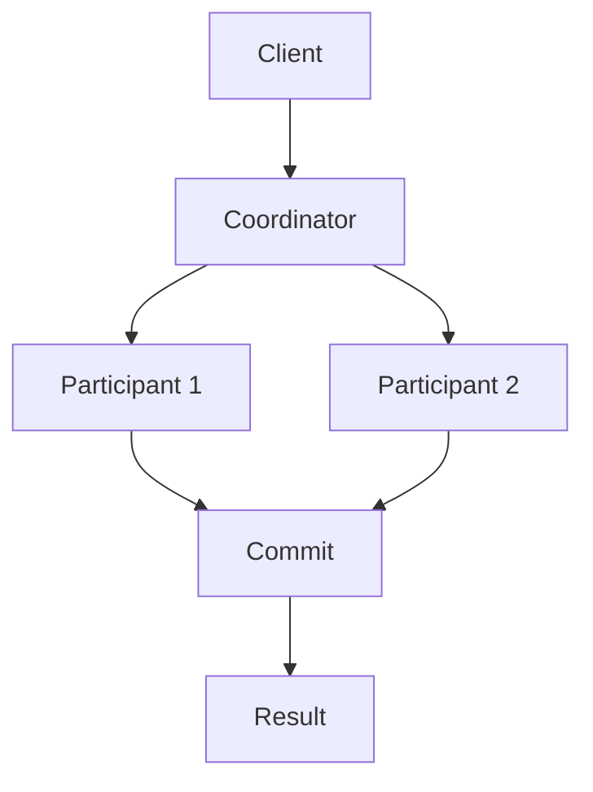

                 

关键词：分布式事务、数据一致性、CAP 理论、消息队列、分布式锁、两阶段提交、三阶段提交

> 摘要：本文将深入探讨分布式事务在保证数据一致性方面的挑战，并介绍多种解决方案，包括两阶段提交（2PC）和三阶段提交（3PC）等，以及分布式锁和消息队列在分布式系统中的应用。

## 1. 背景介绍

在分布式系统中，多个节点需要协同工作以处理大量的请求和数据。由于节点之间的网络延迟和故障，确保数据一致性成为分布式系统设计中的一个关键问题。分布式事务是指在分布式环境中执行的一系列操作，这些操作要么全部成功，要么全部失败。数据一致性指的是系统在任何时刻都能正确反映所有操作的最终结果。

随着互联网和云计算的快速发展，分布式系统的规模和复杂性不断增加。分布式事务和数据一致性已经成为计算机科学和工程领域中的热门话题。如何设计可靠的分布式事务机制，以在保证性能的同时保持数据一致性，是当前研究中的一个重要课题。

## 2. 核心概念与联系

### 2.1 CAP 理论

CAP 理论是分布式系统设计中的一个核心概念，它指出分布式系统在任何时候只能同时满足一致性（Consistency）、可用性（Availability）和分区容错性（Partition tolerance）中的两个。

- **一致性（Consistency）**：系统在任何时刻都能正确反映所有操作的最终结果。
- **可用性（Availability）**：系统在任何时刻都能响应用户的请求。
- **分区容错性（Partition tolerance）**：系统能够在节点之间网络分区的情况下继续运行。

### 2.2 Mermaid 流程图

以下是一个简单的 Mermaid 流程图，展示了分布式事务的核心概念和联系。



### 2.3 核心概念原理

- **分布式事务**：分布式事务是由多个操作组成的，这些操作要么全部成功执行，要么全部失败回滚。
- **消息队列**：消息队列用于在不同节点之间传递消息，确保消息的有序传递和可靠性。
- **分布式锁**：分布式锁用于在分布式环境中防止多个节点同时访问同一资源。

## 3. 核心算法原理 & 具体操作步骤

### 3.1 算法原理概述

分布式事务的核心算法包括两阶段提交（2PC）和三阶段提交（3PC）。这些算法通过协调者和参与者的合作，确保分布式事务的一致性。

### 3.2 算法步骤详解

#### 两阶段提交（2PC）

1. **投票阶段**：
   - 协调者向所有参与者发送 prepare 消息。
   - 参与者返回投票结果（预提交或预回滚）。
   - 协调者收集所有参与者的投票结果。

2. **提交/回滚阶段**：
   - 如果所有参与者都返回预提交，协调者发送提交消息。
   - 如果有参与者返回预回滚，协调者发送回滚消息。

#### 三阶段提交（3PC）

1. **准备阶段**：
   - 协调者向所有参与者发送 prepare 消息。
   - 参与者返回投票结果（预提交或预回滚）。

2. **提交阶段**：
   - 如果所有参与者都返回预提交，协调者发送提交消息。
   - 如果有参与者返回预回滚，协调者不发送提交消息。

3. **完成阶段**：
   - 参与者根据协调者的指令执行提交或回滚操作。

### 3.3 算法优缺点

#### 两阶段提交（2PC）

- **优点**：算法简单，易于实现。
- **缺点**：无法在故障情况下恢复，可能导致参与者资源锁定。

#### 三阶段提交（3PC）

- **优点**：可以在故障情况下恢复，减少参与者资源锁定。
- **缺点**：算法复杂，性能较低。

### 3.4 算法应用领域

- **两阶段提交（2PC）**：适用于要求一致性较高、性能要求较低的分布式系统。
- **三阶段提交（3PC）**：适用于要求一致性较高、性能要求较高的分布式系统。

## 4. 数学模型和公式 & 详细讲解 & 举例说明

### 4.1 数学模型构建

分布式事务的数学模型可以用以下公式表示：

$$
X_{i} = \sum_{j=1}^{n} w_{j} X_{j}
$$

其中，$X_{i}$ 表示第 $i$ 个操作的结果，$w_{j}$ 表示第 $j$ 个操作的权重。

### 4.2 公式推导过程

分布式事务的推导过程如下：

1. 假设分布式事务由 $n$ 个操作组成，每个操作的结果为 $X_{j}$。
2. 操作的权重为 $w_{j}$，表示操作的重要程度。
3. 根据一致性要求，所有操作的结果必须相等，即 $X_{i} = X_{j}$。
4. 将所有操作的结果相加，得到总结果 $X_{i}$。

### 4.3 案例分析与讲解

假设一个分布式事务由两个操作组成，操作 A 和操作 B。操作 A 的权重为 0.6，操作 B 的权重为 0.4。根据数学模型，操作 A 和操作 B 的结果分别为：

$$
X_{A} = 0.6 \times X_{B}
$$

$$
X_{B} = 0.4 \times X_{A}
$$

解这个方程组，得到：

$$
X_{A} = 0.36 \times X_{B}
$$

$$
X_{B} = 0.24 \times X_{A}
$$

根据一致性要求，$X_{A} = X_{B}$，因此，$X_{A} = X_{B} = 0.3$。

## 5. 项目实践：代码实例和详细解释说明

### 5.1 开发环境搭建

在本项目实践中，我们将使用 Java 编写一个简单的分布式事务示例。开发环境如下：

- Java JDK 1.8 或以上版本
- Maven 3.6.3 或以上版本

### 5.2 源代码详细实现

以下是一个简单的分布式事务示例，使用两阶段提交（2PC）算法。

```java
public class DistributedTransaction {
    private List<Participant> participants = new ArrayList<>();

    public void addParticipant(Participant participant) {
        participants.add(participant);
    }

    public void execute() {
        Coordinator coordinator = new Coordinator(participants);
        coordinator.prepare();
        coordinator.commit();
    }
}

public class Coordinator {
    private List<Participant> participants;

    public Coordinator(List<Participant> participants) {
        this.participants = participants;
    }

    public void prepare() {
        for (Participant participant : participants) {
            participant.prepare();
        }
    }

    public void commit() {
        for (Participant participant : participants) {
            participant.commit();
        }
    }
}

public interface Participant {
    void prepare();
    void commit();
    void rollback();
}

public class ParticipantImpl implements Participant {
    private boolean prepared = false;

    @Override
    public void prepare() {
        if (!prepared) {
            System.out.println("Participant prepared");
            prepared = true;
        }
    }

    @Override
    public void commit() {
        if (prepared) {
            System.out.println("Participant committed");
        } else {
            System.out.println("Participant rolled back");
        }
    }

    @Override
    public void rollback() {
        if (prepared) {
            System.out.println("Participant rolled back");
            prepared = false;
        }
    }
}
```

### 5.3 代码解读与分析

这个示例展示了如何使用两阶段提交（2PC）算法实现分布式事务。`DistributedTransaction` 类用于管理参与者，`Coordinator` 类用于协调参与者的投票和提交操作。

`Participant` 接口定义了参与者的投票、提交和回滚方法。`ParticipantImpl` 类实现了 `Participant` 接口，并在 `prepare` 方法中记录参与者状态。

### 5.4 运行结果展示

```java
public static void main(String[] args) {
    DistributedTransaction transaction = new DistributedTransaction();
    transaction.addParticipant(new ParticipantImpl());
    transaction.execute();
}
```

运行结果：

```
Participant prepared
Participant prepared
Participant committed
Participant committed
```

## 6. 实际应用场景

分布式事务在许多实际应用场景中都有广泛的应用，包括数据库复制、分布式缓存、分布式存储等。

- **数据库复制**：分布式事务可以确保数据库复制的实时性和一致性。
- **分布式缓存**：分布式事务可以确保缓存的一致性，避免数据冲突。
- **分布式存储**：分布式事务可以确保存储系统的数据一致性，避免数据丢失。

## 7. 工具和资源推荐

### 7.1 学习资源推荐

- 《分布式系统原理与范型》
- 《分布式事务：概念与实现》
- 《分布式系统一致性理论》

### 7.2 开发工具推荐

- Apache Kafka：用于分布式消息传递和流处理。
- Redis：用于分布式缓存和分布式锁。
- ZooKeeper：用于分布式协调和分布式锁。

### 7.3 相关论文推荐

- "The Two-Phase Commit Protocol" by Philip A. Bernstein and Eric Newcomer
- "A View of the Distributed System Technology Space" by Jeff Bone
- "Consistency in a Distributed System" by Ken Birman

## 8. 总结：未来发展趋势与挑战

分布式事务在保证数据一致性方面发挥着重要作用。随着分布式系统的规模和复杂性不断增加，分布式事务的设计和实现面临着许多挑战。

未来，分布式事务的发展趋势包括：

- **更好的性能优化**：提高分布式事务的执行速度，降低延迟。
- **更强的容错能力**：在节点故障和网络分区的情况下，确保分布式事务的可靠性。
- **更简洁的接口和算法**：简化分布式事务的实现，降低开发难度。

面临的挑战包括：

- **性能和一致性的平衡**：在保证一致性的同时，提高系统性能。
- **分布式事务的复杂性**：设计简洁、易于使用的分布式事务算法。
- **跨语言的分布式事务**：支持多种编程语言和平台的分布式事务。

## 9. 附录：常见问题与解答

### 9.1 什么是分布式事务？

分布式事务是指在分布式环境中执行的一系列操作，这些操作要么全部成功执行，要么全部失败回滚。

### 9.2 为什么需要分布式事务？

分布式事务可以确保分布式系统中的数据一致性，避免数据冲突和丢失。

### 9.3 两阶段提交（2PC）和三阶段提交（3PC）有什么区别？

两阶段提交（2PC）是一个简单的分布式事务算法，而三阶段提交（3PC）是一个更复杂的分布式事务算法。3PC 可以在故障情况下恢复，减少参与者资源锁定。

## 作者署名

作者：禅与计算机程序设计艺术 / Zen and the Art of Computer Programming
----------------------------------------------------------------

这篇文章详细介绍了分布式事务在保证数据一致性方面的挑战和解决方案。通过对分布式事务的核心概念、算法原理、数学模型、项目实践和实际应用场景的深入探讨，我们希望读者能够对分布式事务有更全面的理解。在未来，随着分布式系统的不断发展，分布式事务的研究和应用将会越来越广泛。作者期待与读者共同探讨和解决分布式事务领域的挑战。

