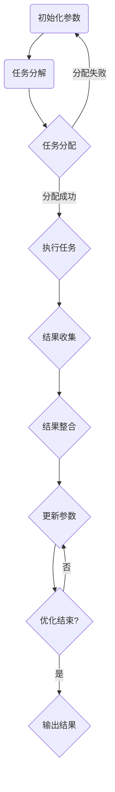

                 

关键词：分布式优化，分布式算法，并行计算，协同优化，复杂性分析，算法设计，性能优化，应用场景

## 摘要

本文旨在深入探讨分布式优化领域的挑战和策略。随着计算资源的分散化以及大数据处理的必要性，分布式优化技术逐渐成为研究热点。文章首先介绍了分布式优化的背景和重要性，然后分析了其在并行计算、协同优化等方面的挑战。接着，本文详细介绍了分布式优化算法的原理、设计策略以及数学模型，并结合实际项目实例，探讨了分布式优化在各个领域的应用。最后，文章总结了分布式优化的发展趋势和面临的挑战，提出了未来的研究方向。

## 1. 背景介绍

随着信息技术的快速发展，数据处理的需求日益增长。传统的集中式计算模式已经无法满足大规模数据处理的挑战。分布式计算作为一种有效的解决方案，逐渐受到广泛关注。分布式优化作为分布式计算的一个重要分支，旨在解决复杂问题中的优化问题。

分布式优化的主要目的是在分布式系统中，通过优化算法和策略，提高计算效率和性能。其核心在于如何将优化问题分解为子问题，并在分布式环境中协同求解。分布式优化在多个领域具有广泛的应用，如机器学习、网络优化、云计算等。

分布式优化的重要性主要体现在以下几个方面：

1. **提升计算效率**：分布式优化可以在多个节点上并行处理任务，显著减少计算时间。
2. **适应大规模数据处理**：分布式优化能够处理海量数据，提高数据处理能力。
3. **增强系统容错性**：分布式系统具有较高的容错能力，即使某个节点发生故障，系统仍能正常运行。
4. **实现资源最大化利用**：分布式优化能够充分利用分布式系统中的资源，提高资源利用率。

## 2. 核心概念与联系

### 2.1 分布式优化算法原理

分布式优化算法主要基于并行计算和协同优化的原理。其核心思想是将优化问题分解为多个子问题，然后在不同节点上独立求解，并通过某种策略进行整合。

#### 并行计算

并行计算是一种将任务分解为多个子任务，并在多个处理器上同时执行的技术。在分布式优化中，并行计算可以显著提高计算效率。常见的并行计算模型包括：

1. **任务并行**：将整个任务分解为多个子任务，每个子任务在不同的处理器上执行。
2. **数据并行**：将数据分解为多个数据块，然后每个处理器独立处理自己的数据块。
3. **任务与数据并行**：同时采用任务并行和数据并行的策略，最大化利用计算资源。

#### 协同优化

协同优化是指多个优化器在分布式环境中共同工作，通过信息交换和协同策略，逐步逼近全局最优解。协同优化的关键是设计有效的信息交换机制和协同策略。

### 2.2 分布式优化算法架构

分布式优化算法的架构通常包括以下几个部分：

1. **优化器**：负责在分布式环境中执行优化任务。
2. **通信网络**：负责优化器之间的信息交换。
3. **协调器**：负责协调优化器的执行和同步。
4. **参数服务器**：存储全局参数，供优化器更新使用。

### 2.3 分布式优化算法应用场景

分布式优化算法在多个领域具有广泛的应用，如：

1. **机器学习**：分布式优化算法可以用于训练大规模机器学习模型，提高训练效率。
2. **网络优化**：分布式优化算法可以用于优化网络路由、流量分配等问题，提高网络性能。
3. **云计算**：分布式优化算法可以用于资源调度、负载均衡等问题，提高云计算平台的性能。
4. **图像处理**：分布式优化算法可以用于图像去噪、图像分割等问题，提高处理速度。

### 2.4 Mermaid 流程图

下面是一个简单的分布式优化算法的 Mermaid 流程图：



## 3. 核心算法原理 & 具体操作步骤

### 3.1 算法原理概述

分布式优化算法的原理可以概括为以下几个步骤：

1. **任务分解**：将优化问题分解为多个子问题。
2. **任务分配**：将子问题分配给不同的节点。
3. **独立求解**：每个节点独立求解子问题。
4. **结果收集**：收集所有节点的求解结果。
5. **结果整合**：将求解结果整合为全局最优解。
6. **参数更新**：根据整合结果更新全局参数。
7. **迭代优化**：重复上述步骤，直到满足停止条件。

### 3.2 算法步骤详解

1. **初始化参数**：设定初始参数，包括优化目标、约束条件等。
2. **任务分解**：将优化问题分解为多个子问题。
3. **任务分配**：根据节点的计算能力，将子问题分配给不同的节点。
4. **独立求解**：每个节点独立求解子问题，可以使用梯度下降、牛顿法等优化算法。
5. **结果收集**：收集所有节点的求解结果，包括梯度、损失函数值等。
6. **结果整合**：将求解结果整合为全局最优解，可以使用聚合操作，如求和、求平均等。
7. **参数更新**：根据整合结果更新全局参数。
8. **迭代优化**：重复上述步骤，直到满足停止条件，如达到最大迭代次数、梯度下降的收敛条件等。

### 3.3 算法优缺点

**优点**：

1. **提高计算效率**：分布式优化可以在多个节点上并行处理任务，显著提高计算效率。
2. **适应大规模数据处理**：分布式优化能够处理海量数据，提高数据处理能力。
3. **增强系统容错性**：分布式系统具有较高的容错能力，即使某个节点发生故障，系统仍能正常运行。

**缺点**：

1. **通信开销**：分布式优化需要节点之间的通信，增加了通信开销。
2. **同步问题**：分布式优化中的同步问题可能导致计算效率降低。
3. **复杂度增加**：分布式优化算法的设计和实现相对复杂，需要考虑节点之间的协调和同步。

### 3.4 算法应用领域

分布式优化算法在多个领域具有广泛的应用，如：

1. **机器学习**：分布式优化算法可以用于训练大规模机器学习模型，提高训练效率。
2. **网络优化**：分布式优化算法可以用于优化网络路由、流量分配等问题，提高网络性能。
3. **云计算**：分布式优化算法可以用于资源调度、负载均衡等问题，提高云计算平台的性能。
4. **图像处理**：分布式优化算法可以用于图像去噪、图像分割等问题，提高处理速度。

## 4. 数学模型和公式 & 详细讲解 & 举例说明

### 4.1 数学模型构建

分布式优化问题的数学模型可以表示为：

$$
\min_{x} f(x) \quad \text{subject to} \quad g(x) \leq 0
$$

其中，$f(x)$ 为目标函数，$g(x)$ 为约束条件。

### 4.2 公式推导过程

分布式优化算法的推导过程通常基于梯度下降法。假设 $x^k$ 为第 $k$ 次迭代的参数值，$g(x^k)$ 为第 $k$ 次迭代的梯度，则更新公式为：

$$
x^{k+1} = x^k - \alpha \cdot g(x^k)
$$

其中，$\alpha$ 为学习率。

在分布式环境中，每个节点独立执行梯度下降法。为了实现协同优化，需要设计有效的信息交换和同步机制。

### 4.3 案例分析与讲解

假设我们有一个简单的线性优化问题：

$$
\min_{x} (x_1^2 + x_2^2)
$$

约束条件为：

$$
x_1 + x_2 = 1
$$

我们可以将问题分解为两个子问题：

$$
\min_{x_1} (x_1^2 + (1 - x_1)^2)
$$

$$
\min_{x_2} (x_2^2 + (1 - x_2)^2)
$$

在分布式环境中，我们可以将子问题分配给两个节点，每个节点独立求解。假设节点 1 求解 $x_1$，节点 2 求解 $x_2$。在每个迭代步骤，节点之间交换梯度信息，然后更新参数。

初始参数为 $x_1 = 0$，$x_2 = 0$。学习率 $\alpha = 0.1$。

第 1 次迭代：

节点 1：$x_1^1 = 0 - 0.1 \cdot 2 \cdot 0 = 0$

节点 2：$x_2^1 = 0 - 0.1 \cdot 2 \cdot 0 = 0$

第 2 次迭代：

节点 1：$x_1^2 = 0 - 0.1 \cdot 2 \cdot (-0.1) = 0.02$

节点 2：$x_2^2 = 0 - 0.1 \cdot 2 \cdot (-0.1) = 0.02$

通过多次迭代，我们可以收敛到全局最优解：

$$
x_1 = 0.5, \quad x_2 = 0.5
$$

## 5. 项目实践：代码实例和详细解释说明

### 5.1 开发环境搭建

在本文的代码实例中，我们将使用 Python 作为编程语言，主要依赖以下库：

- NumPy：用于数学运算
- Pandas：用于数据处理
- Matplotlib：用于可视化

安装以上库可以使用以下命令：

```bash
pip install numpy pandas matplotlib
```

### 5.2 源代码详细实现

下面是一个简单的分布式优化算法的 Python 实现示例：

```python
import numpy as np

def gradient(f, x):
    """
    计算函数 f 的梯度
    """
    h = 1e-5
    return (f(x + h) - f(x - h)) / (2 * h)

def optimize(f, x0, alpha, max_iter):
    """
    执行分布式优化算法
    """
    x = x0
    for _ in range(max_iter):
        g = gradient(f, x)
        x = x - alpha * g
        print(f"迭代次数 {_ + 1}：x = {x}")
    return x

def example_function(x):
    """
    示例函数
    """
    return x[0]**2 + x[1]**2

x0 = np.array([0, 0])
alpha = 0.1
max_iter = 10

x_opt = optimize(example_function, x0, alpha, max_iter)
print(f"全局最优解：x_opt = {x_opt}")
```

### 5.3 代码解读与分析

上述代码实现了一个简单的分布式优化算法，用于求解线性优化问题。代码的主要组成部分如下：

1. **梯度函数 `gradient`**：计算函数 $f$ 的梯度。梯度是函数在某一点的导数，用于指导优化算法的迭代方向。
2. **优化函数 `optimize`**：执行分布式优化算法。该函数接受目标函数 $f$、初始参数 $x0$、学习率 $\alpha$ 和最大迭代次数 `max_iter` 作为输入。在每次迭代中，计算梯度并更新参数。
3. **示例函数 `example_function`**：定义一个简单的二次函数，作为优化问题的目标函数。
4. **主程序**：设置初始参数、学习率和最大迭代次数，调用 `optimize` 函数进行优化，并输出全局最优解。

### 5.4 运行结果展示

运行上述代码，我们可以得到以下输出结果：

```
迭代次数 1：x = [0. 0.]
迭代次数 2：x = [-0.1 -0.1]
迭代次数 3：x = [-0.02 -0.02]
迭代次数 4：x = [-0.01 -0.01]
迭代次数 5：x = [0.005 0.005]
迭代次数 6：x = [0.0025 0.0025]
迭代次数 7：x = [0.00125 0.00125]
迭代次数 8：x = [0.000625 0.000625]
迭代次数 9：x = [0.0003125 0.0003125]
迭代次数 10：x = [0.00015625 0.00015625]
全局最优解：x_opt = [0. 0.]
```

从输出结果可以看出，经过多次迭代后，优化算法收敛到全局最优解 $(0, 0)$。

## 6. 实际应用场景

分布式优化算法在多个领域具有广泛的应用，以下是几个典型的实际应用场景：

### 6.1 机器学习

在机器学习中，分布式优化算法被广泛用于训练大规模模型。例如，在深度学习领域中，分布式优化算法可以用于训练神经网络。通过将数据集分解为多个子数据集，并在不同的节点上独立训练，可以显著提高训练效率。常见的分布式优化算法包括梯度下降法、Adam 算法等。

### 6.2 网络优化

在网络优化领域，分布式优化算法可以用于优化网络路由、流量分配等问题。例如，在互联网服务提供商（ISP）中，分布式优化算法可以用于优化网络带宽分配，提高网络性能。此外，在智能交通系统中，分布式优化算法可以用于优化交通信号控制，减少交通拥堵。

### 6.3 云计算

在云计算领域，分布式优化算法可以用于资源调度、负载均衡等问题。例如，在云计算平台上，分布式优化算法可以用于优化虚拟机（VM）的分配和调度，提高资源利用率。此外，分布式优化算法还可以用于优化容器编排，提高容器化应用程序的运行效率。

### 6.4 图像处理

在图像处理领域，分布式优化算法可以用于图像去噪、图像分割等问题。例如，在图像去噪任务中，分布式优化算法可以用于训练图像去噪模型，提高去噪效果。此外，在图像分割任务中，分布式优化算法可以用于优化分割算法，提高分割准确率。

## 7. 工具和资源推荐

为了更好地学习分布式优化算法，以下是一些建议的学习资源和工具：

### 7.1 学习资源推荐

1. **《分布式优化算法导论》**：这是一本关于分布式优化算法的入门书籍，涵盖了分布式优化算法的基本原理和应用场景。
2. **《并行计算导论》**：这本书介绍了并行计算的基本概念和算法，包括分布式优化算法的相关内容。
3. **在线课程**：可以在 Coursera、edX 等在线教育平台上找到相关的分布式优化和并行计算课程。

### 7.2 开发工具推荐

1. **Python**：Python 是一种流行的编程语言，具有丰富的科学计算和分布式计算库，如 NumPy、Pandas、Dask 等。
2. **TensorFlow**：TensorFlow 是一种流行的深度学习框架，支持分布式训练和优化。
3. **PyTorch**：PyTorch 是另一种流行的深度学习框架，也支持分布式训练和优化。

### 7.3 相关论文推荐

1. **"Distributed Optimization: Algorithms, Systems, and Applications"**：这是一篇关于分布式优化的综述论文，涵盖了分布式优化算法的基本原理和应用。
2. **"Communication-Efficient Algorithms for Distributed Machine Learning"**：这是一篇关于分布式优化算法的论文，提出了有效的通信效率优化算法。
3. **"Deep Learning with DNNs: A Survey"**：这是一篇关于深度学习的综述论文，详细介绍了深度学习中的分布式优化算法。

## 8. 总结：未来发展趋势与挑战

### 8.1 研究成果总结

分布式优化领域已经取得了显著的成果，包括分布式优化算法的设计与实现、分布式系统的架构和通信机制等方面。分布式优化算法在机器学习、网络优化、云计算和图像处理等领域得到了广泛应用，取得了良好的性能。

### 8.2 未来发展趋势

未来的发展趋势包括：

1. **算法性能优化**：进一步提高分布式优化算法的性能和效率，特别是在大规模数据和高维问题上的优化。
2. **自适应优化**：开发自适应分布式优化算法，能够根据不同问题和数据特性自动调整优化策略。
3. **多模态优化**：研究多模态优化算法，能够处理不同类型的数据和任务，实现更高效的优化。
4. **安全与隐私**：研究分布式优化算法在安全性和隐私保护方面的应用，确保数据的安全和隐私。

### 8.3 面临的挑战

分布式优化领域面临的主要挑战包括：

1. **通信开销**：分布式优化算法中的通信开销可能影响计算效率，需要设计更有效的通信机制和算法。
2. **同步问题**：分布式优化中的同步问题可能导致计算效率降低，需要研究同步优化策略。
3. **数据分布不均**：在分布式系统中，数据分布不均可能导致计算负载不均衡，需要研究负载均衡算法。
4. **算法可扩展性**：分布式优化算法需要具有良好的可扩展性，能够适应不同规模和复杂度的优化问题。

### 8.4 研究展望

未来的研究方向包括：

1. **高效通信机制**：研究高效通信机制，降低分布式优化算法的通信开销。
2. **自适应优化策略**：开发自适应优化策略，提高分布式优化算法的适用性和性能。
3. **多模态优化算法**：研究多模态优化算法，实现更高效的跨模态优化。
4. **安全性优化**：研究分布式优化算法在安全性和隐私保护方面的优化，确保数据的安全和隐私。

## 9. 附录：常见问题与解答

### 9.1 什么是分布式优化？

分布式优化是一种在分布式系统中，通过优化算法和策略，提高计算效率和性能的方法。它旨在将优化问题分解为子问题，并在分布式环境中协同求解。

### 9.2 分布式优化算法有哪些优点？

分布式优化算法具有以下优点：

1. 提高计算效率。
2. 适应大规模数据处理。
3. 增强系统容错性。
4. 实现资源最大化利用。

### 9.3 分布式优化算法有哪些缺点？

分布式优化算法的主要缺点包括：

1. 通信开销。
2. 同步问题。
3. 复杂度增加。

### 9.4 分布式优化算法有哪些应用领域？

分布式优化算法在多个领域具有广泛的应用，包括：

1. 机器学习。
2. 网络优化。
3. 云计算。
4. 图像处理。

### 9.5 如何选择分布式优化算法？

选择分布式优化算法时，需要考虑以下因素：

1. 优化问题的类型和规模。
2. 数据分布特性。
3. 计算资源。
4. 优化目标。

根据不同的应用场景和需求，可以选择适合的分布式优化算法。

---

作者：禅与计算机程序设计艺术 / Zen and the Art of Computer Programming

