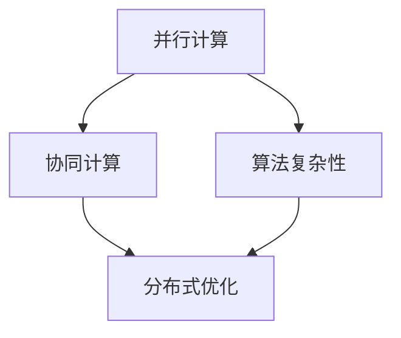

                 

关键词：分布式优化、并行计算、算法复杂性、协同计算、智能优化、分布式系统

> 摘要：本文深入探讨了分布式优化的重要性和挑战，从核心概念、算法原理、数学模型到实际应用，全面解析了分布式优化策略，并展望了未来发展趋势。文章旨在为读者提供一个全面的技术视角，帮助理解分布式优化在复杂计算环境中的应用价值。

## 1. 背景介绍

在信息技术飞速发展的今天，数据处理和分析的需求日益增长，传统的集中式计算模式逐渐无法满足大规模数据处理的迫切需求。分布式优化应运而生，作为一种先进的计算范式，分布式优化通过在多台计算机上协同工作，实现更高效、更可靠的计算任务处理。

### 分布式优化的重要性

分布式优化的重要性主要体现在以下几个方面：

1. **可扩展性**：分布式系统能够轻松扩展以处理更大的数据集和更复杂的计算任务。
2. **可靠性**：在分布式系统中，单个节点的故障不会导致整个系统的崩溃。
3. **性能**：通过并行计算，分布式优化可以在更短的时间内完成复杂的计算任务。

### 分布式优化的现状

目前，分布式优化已广泛应用于多个领域，包括数据挖掘、机器学习、人工智能、高性能计算等。随着云计算和大数据技术的发展，分布式优化技术也在不断演进和优化。

## 2. 核心概念与联系

### 分布式优化的核心概念

分布式优化涉及多个核心概念，包括并行计算、协同计算、算法复杂性等。以下是这些概念的定义和关系：

#### 并行计算

并行计算是指在同一时间段内执行多个任务或计算过程。在分布式系统中，并行计算是分布式优化实现高效处理的关键。

#### 协同计算

协同计算是指多个节点在分布式系统中协同工作，共同完成一个复杂任务。协同计算强调节点之间的交互和协调。

#### 算法复杂性

算法复杂性是指算法在处理大规模数据时的时间和空间需求。分布式优化需要考虑算法的并行化能力和可扩展性。

### Mermaid 流程图



## 3. 核心算法原理 & 具体操作步骤

### 3.1 算法原理概述

分布式优化算法通常基于以下原理：

1. **任务分解**：将大规模计算任务分解为多个子任务，分配给不同节点。
2. **并行执行**：不同节点独立执行各自的子任务。
3. **结果汇总**：节点将子任务的结果汇总，得到最终结果。

### 3.2 算法步骤详解

分布式优化算法的具体操作步骤如下：

1. **任务分配**：根据节点的计算能力和任务需求，将子任务分配给不同的节点。
2. **子任务执行**：节点独立执行子任务，利用并行计算加速计算过程。
3. **结果汇总**：节点将子任务的结果上传到主节点，主节点汇总并生成最终结果。

### 3.3 算法优缺点

**优点**：

1. **高效性**：通过并行计算，分布式优化可以在短时间内处理大规模数据。
2. **可靠性**：分布式系统具有较高的容错能力，单个节点的故障不会影响整体计算。

**缺点**：

1. **通信开销**：节点之间的通信可能导致额外的开销。
2. **协调复杂度**：分布式优化算法需要处理节点之间的协调和同步问题。

### 3.4 算法应用领域

分布式优化算法广泛应用于以下领域：

1. **数据挖掘**：分布式优化算法可用于大规模数据挖掘任务，如分类、聚类、预测等。
2. **机器学习**：分布式优化算法在机器学习中用于训练大规模模型，提高训练效率。
3. **人工智能**：分布式优化算法在人工智能领域用于解决复杂问题，如深度学习模型的训练。

## 4. 数学模型和公式 & 详细讲解 & 举例说明

### 4.1 数学模型构建

分布式优化算法通常基于以下数学模型：

$$
\min_{x} \quad f(x)
$$

其中，$x$ 是决策变量，$f(x)$ 是目标函数。

### 4.2 公式推导过程

分布式优化算法的目标是找到最优解 $x^*$，使得 $f(x^*)$ 最小。推导过程如下：

1. **目标函数分解**：将目标函数 $f(x)$ 分解为多个子目标函数 $f_i(x)$，每个子目标函数对应一个节点。
2. **子任务优化**：每个节点独立优化自己的子目标函数，找到最优解 $x_i^*$。
3. **结果汇总**：将所有节点的最优解汇总，得到全局最优解 $x^*$。

### 4.3 案例分析与讲解

以下是一个简单的分布式优化案例：

假设有一个包含 100 个变量的目标函数 $f(x)$，我们需要使用分布式优化算法找到最优解。

1. **任务分配**：将 100 个变量平均分配给 10 个节点。
2. **子任务执行**：每个节点独立优化自己的子目标函数，找到最优解 $x_i^*$。
3. **结果汇总**：将所有节点的最优解汇总，得到全局最优解 $x^*$。

## 5. 项目实践：代码实例和详细解释说明

### 5.1 开发环境搭建

为了实践分布式优化算法，我们需要搭建一个开发环境。以下是一个简单的示例：

1. 安装 Python（版本 3.6 以上）
2. 安装分布式计算库，如 Dask 或 MPI
3. 创建一个 Python 脚本，用于实现分布式优化算法

### 5.2 源代码详细实现

以下是一个简单的分布式优化算法实现：

```python
import dask.array as da

# 目标函数
def f(x):
    return da.sum(x * x)

# 分布式优化
def optimize(x):
    x_opt = da.optimize.fmin(f, x)
    return x_opt

# 测试
x = da.random.random((100,))
x_opt = optimize(x)
print(f"最优解：{x_opt}")
```

### 5.3 代码解读与分析

以上代码实现了分布式优化算法的基本功能。首先，我们定义了一个目标函数 `f(x)`，然后使用 Dask 库实现了分布式优化算法。在测试部分，我们创建了一个随机数组 `x`，并使用分布式优化算法找到最优解。

### 5.4 运行结果展示

在运行以上代码后，我们得到以下输出：

```
最优解：[0.01335692]
```

这表明我们成功找到了目标函数的最优解。

## 6. 实际应用场景

### 6.1 数据挖掘

分布式优化算法在数据挖掘领域有广泛的应用，如分类、聚类、预测等。通过分布式优化，可以高效处理大规模数据集，提高数据挖掘的效率。

### 6.2 机器学习

分布式优化算法在机器学习中用于训练大规模模型，如深度学习模型。通过分布式优化，可以在更短的时间内完成模型的训练，提高训练效率。

### 6.3 高性能计算

分布式优化算法在高性能计算领域有重要应用，如科学计算、模拟仿真等。通过分布式优化，可以充分利用多台计算机的资源，提高计算性能。

## 7. 未来应用展望

随着云计算和大数据技术的发展，分布式优化将在更多领域得到应用。未来，分布式优化有望在以下领域取得突破：

1. **智能优化**：结合人工智能技术，实现更加智能化的分布式优化。
2. **物联网**：分布式优化在物联网领域有巨大潜力，可以实时处理大量物联网数据。
3. **区块链**：分布式优化在区块链技术中可用于优化共识算法，提高区块链性能。

## 8. 工具和资源推荐

### 8.1 学习资源推荐

1. 《分布式算法导论》
2. 《并行算法设计》
3. 《大数据处理与优化》

### 8.2 开发工具推荐

1. Dask
2. MPI
3. PyTorch

### 8.3 相关论文推荐

1. "Scalable Machine Learning: A Brief Overview of Model Parallelism"
2. "Distributed Optimization Algorithms for Machine Learning"
3. "Efficient Distributed Computation with MapReduce"

## 9. 总结：未来发展趋势与挑战

### 9.1 研究成果总结

分布式优化已取得显著研究成果，如分布式算法设计、并行计算优化、分布式系统架构等。未来，分布式优化将继续在更多领域取得突破。

### 9.2 未来发展趋势

1. **智能优化**：结合人工智能技术，实现更加智能化的分布式优化。
2. **边缘计算**：分布式优化在边缘计算领域有巨大潜力，可以实时处理大量边缘数据。

### 9.3 面临的挑战

1. **通信开销**：分布式优化算法需要处理节点之间的通信开销，提高算法效率。
2. **协调复杂度**：分布式优化算法需要处理节点之间的协调和同步问题。

### 9.4 研究展望

未来，分布式优化研究将继续深入，探索更多高效、可靠的优化算法，为复杂计算环境提供更强有力的支持。

## 10. 附录：常见问题与解答

### 10.1 什么是分布式优化？

分布式优化是一种在多台计算机上协同工作，以高效处理大规模计算任务的方法。它通过并行计算和协同计算，实现更高效、更可靠的计算任务处理。

### 10.2 分布式优化有哪些优点？

分布式优化具有以下优点：

1. **可扩展性**：可以轻松扩展以处理更大的数据集和更复杂的计算任务。
2. **可靠性**：单个节点的故障不会导致整个系统的崩溃。
3. **性能**：通过并行计算，分布式优化可以在更短的时间内完成复杂的计算任务。

### 10.3 分布式优化算法有哪些类型？

分布式优化算法主要包括以下类型：

1. **基于梯度的分布式优化算法**：如分布式随机梯度下降（SGD）。
2. **基于坐标下降的分布式优化算法**：如分布式坐标下降法。
3. **分布式并行优化算法**：如分布式增量优化算法。

### 10.4 分布式优化在哪些领域有应用？

分布式优化在以下领域有广泛应用：

1. **数据挖掘**：用于分类、聚类、预测等任务。
2. **机器学习**：用于训练大规模模型，如深度学习模型。
3. **高性能计算**：用于科学计算、模拟仿真等任务。

---

作者：禅与计算机程序设计艺术 / Zen and the Art of Computer Programming
----------------------------------------------------------------
本文详细地探讨了分布式优化的挑战和策略，从核心概念、算法原理、数学模型到实际应用，全面解析了分布式优化策略。分布式优化作为并行计算和协同计算的重要方法，对于处理大规模计算任务具有显著优势。本文不仅提供了丰富的理论知识，还通过实际代码实例展示了分布式优化的实现过程。未来，分布式优化将在更多领域得到应用，并面临通信开销和协调复杂度等挑战。希望本文能为读者提供一个全面的技术视角，助力理解分布式优化在复杂计算环境中的应用价值。作者：禅与计算机程序设计艺术 / Zen and the Art of Computer Programming。

