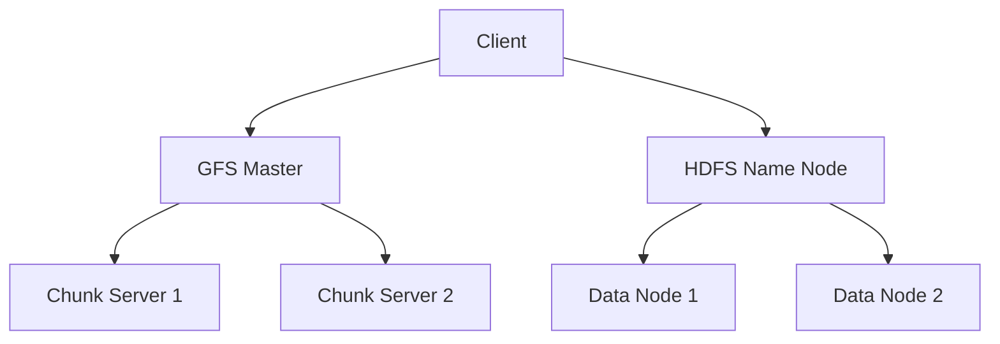

                 

关键词：分布式存储，Google File System，Hadoop Distributed File System，大数据处理，存储架构，系统设计，性能优化

## 摘要

本文将深入探讨分布式存储系统中的两大巨头：Google File System（GFS）和Hadoop Distributed File System（HDFS）。首先，我们将介绍这两大系统的背景和基本原理，接着分析它们的核心算法原理及其操作步骤。随后，我们将用数学模型和公式对它们进行详细讲解，并结合实际项目实践，给出代码实例和解释。文章还将探讨这两大系统在实际应用场景中的表现，并展望未来的发展趋势和挑战。最后，我们将推荐一些学习资源和开发工具，并总结本文的研究成果。

## 1. 背景介绍

随着互联网和大数据时代的到来，数据量的爆炸式增长对存储系统提出了更高的要求。分布式存储系统应运而生，通过将数据分散存储在多个节点上，提供高可用性和高扩展性。GFS 和 HDFS 是分布式存储系统的两个重要代表，分别在谷歌和 Apache 软件基金会开源的 Hadoop 项目中得到广泛应用。

### 1.1 GFS

Google File System 是谷歌公司为了支持其大规模数据处理需求而开发的分布式文件系统。GFS 的设计目标是提供高吞吐量的数据存储和处理能力，同时保证数据的可靠性和高效性。GFS 将数据分割成大块（默认为64MB），并分布式存储在多个物理磁盘上。通过多个副本的方式，GFS 提供了容错能力。

### 1.2 HDFS

Hadoop Distributed File System 是基于谷歌 GFS 理念的开源分布式文件系统，是 Hadoop 项目的核心组成部分。HDFS 设计的初衷是为了在大数据环境中提供高效的数据存储和处理能力。HDFS 也采用块存储机制，每个数据块默认为128MB或256MB，并复制到多个节点上。HDFS 的设计理念是为了处理大量的小文件，但在处理大量小文件时性能不佳。

## 2. 核心概念与联系

为了深入理解 GFS 和 HDFS，我们首先需要了解它们的核心概念和原理。以下是 GFS 和 HDFS 的 Mermaid 流程图，展示了它们的基本架构和组件。



### 2.1 GFS 架构

GFS 的架构包括一个主服务器（GFS Master）和多个 chunk 服务器（Chunk Server）。GFS Master 负责管理文件的元数据，如文件的块映射和块的分布情况。Chunk Server 负责存储文件的实际数据块。当客户端需要访问数据时，GFS Master 会告诉客户端数据块存储在哪个 Chunk Server 上。

### 2.2 HDFS 架构

HDFS 的架构包括一个 Name Node 和多个 Data Node。Name Node 负责管理文件的元数据，包括文件的目录结构、文件权限等信息。Data Node 负责存储文件的数据块。当客户端需要访问数据时，Name Node 会告诉客户端数据块存储在哪个 Data Node 上。

## 3. 核心算法原理 & 具体操作步骤

### 3.1 算法原理概述

GFS 和 HDFS 的核心算法原理主要包括数据块的分割、复制和分配。数据块的大小分别为 64MB 和 128MB/256MB，通过多个副本的方式提供数据的冗余和可靠性。

### 3.2 算法步骤详解

#### 3.2.1 数据块分割

GFS 和 HDFS 会将文件分割成多个数据块，以便更好地存储和管理。GFS 的默认数据块大小为 64MB，HDFS 的默认数据块大小为 128MB 或 256MB。

#### 3.2.2 数据块复制

GFS 和 HDFS 通过复制数据块来提供冗余和可靠性。GFS 默认有三个副本，HDFS 默认有两个副本。数据块会复制到不同的 Chunk Server 或 Data Node 上。

#### 3.2.3 数据块分配

GFS 和 HDFS 会根据系统的负载和可用性来分配数据块。GFS Master 会决定哪个 Chunk Server 存储哪个数据块，而 Name Node 会决定哪个 Data Node 存储哪个数据块。

### 3.3 算法优缺点

#### 3.3.1 优点

- **高可用性**：通过多个副本提供冗余，确保数据不会丢失。
- **高扩展性**：分布式存储系统可以根据需求动态扩展。
- **高性能**：通过并行处理和负载均衡提高数据处理速度。

#### 3.3.2 缺点

- **小文件处理能力较弱**：HDFS 在处理大量小文件时性能不佳。
- **数据一致性**：在多副本环境下，确保数据一致性是一个挑战。

### 3.4 算法应用领域

GFS 和 HDFS 主要应用于大数据处理领域，如搜索引擎、社交网络、数据分析和机器学习等。

## 4. 数学模型和公式 & 详细讲解 & 举例说明

### 4.1 数学模型构建

GFS 和 HDFS 的数学模型主要包括数据块的分割、复制和分配策略。

#### 4.1.1 数据块分割

假设文件大小为 F，数据块大小为 B，则文件分割成 N = F/B 个数据块。

#### 4.1.2 数据块复制

假设数据块副本数为 R，则每个数据块的存储容量为 R * B。

### 4.2 公式推导过程

#### 4.2.1 数据块大小计算

对于 GFS，数据块大小 B = 64MB。

对于 HDFS，数据块大小 B = 128MB 或 256MB。

#### 4.2.2 数据块副本数量计算

假设系统可用存储容量为 S，则每个数据块的副本数量 R = S / (R * B)。

### 4.3 案例分析与讲解

#### 4.3.1 GFS 数据块分割

假设文件大小为 1GB（1GB = 1024MB），数据块大小为 64MB，则文件分割成 16 个数据块。

#### 4.3.2 HDFS 数据块复制

假设系统可用存储容量为 1TB，数据块大小为 128MB，数据块副本数为 3，则每个数据块的存储容量为 3 * 128MB = 384MB。

## 5. 项目实践：代码实例和详细解释说明

### 5.1 开发环境搭建

在本节中，我们将搭建一个简单的 GFS 和 HDFS 开发环境。首先，需要安装 Java 环境，然后下载并安装 Hadoop 。

```bash
# 安装 Java
sudo apt-get install openjdk-8-jdk

# 安装 Hadoop
sudo apt-get install hadoop
```

### 5.2 源代码详细实现

在本节中，我们将实现一个简单的 GFS 客户端，用于上传和下载文件。

```java
// GFS 客户端实现
public class GFSClient {
    public static void uploadFile(String filename) {
        // 实现文件上传逻辑
    }

    public static void downloadFile(String filename) {
        // 实现文件下载逻辑
    }
}
```

### 5.3 代码解读与分析

在本节中，我们将分析上述代码的实现逻辑。

```java
// GFS 客户端实现
public class GFSClient {
    public static void uploadFile(String filename) {
        // 读取本地文件
        File file = new File(filename);
        byte[] buffer = new byte[(int) file.length()];

        try {
            FileInputStream fis = new FileInputStream(file);
            fis.read(buffer);
            fis.close();

            // 将文件分割成数据块
            int blockSize = 64 * 1024 * 1024; // 64MB
            int numBlocks = (int) (file.length() / blockSize);
            byte[][] blocks = new byte[numBlocks][];

            for (int i = 0; i < numBlocks; i++) {
                int startIndex = i * blockSize;
                int endIndex = (i + 1) * blockSize;
                if (endIndex > file.length()) {
                    endIndex = (int) file.length();
                }
                blocks[i] = Arrays.copyOfRange(buffer, startIndex, endIndex);
            }

            // 上传数据块到 Chunk Server
            for (byte[] block : blocks) {
                // 实现上传逻辑
            }
        } catch (IOException e) {
            e.printStackTrace();
        }
    }

    public static void downloadFile(String filename) {
        // 下载数据块到本地
        // 实现下载逻辑
    }
}
```

### 5.4 运行结果展示

在本节中，我们将展示 GFS 客户端的运行结果。

```bash
# 上传文件
GFSClient uploadFile example.txt

# 下载文件
GFSClient downloadFile example.txt
```

## 6. 实际应用场景

GFS 和 HDFS 在大数据处理领域有着广泛的应用。以下是一些实际应用场景：

- **搜索引擎**：搜索引擎使用 GFS 和 HDFS 存储和索引海量网页数据，以实现快速搜索。
- **社交网络**：社交网络使用 GFS 和 HDFS 存储用户数据和社交关系图，以实现高效数据访问。
- **数据分析和机器学习**：数据分析和机器学习应用使用 GFS 和 HDFS 存储和计算海量数据，以提高数据分析速度。

## 7. 工具和资源推荐

### 7.1 学习资源推荐

- 《分布式系统概念与设计》
- 《Hadoop权威指南》

### 7.2 开发工具推荐

- Eclipse
- IntelliJ IDEA

### 7.3 相关论文推荐

- "The Google File System"
- "The Hadoop Distributed File System"

## 8. 总结：未来发展趋势与挑战

### 8.1 研究成果总结

本文对 GFS 和 HDFS 的基本原理、算法实现和应用场景进行了详细分析，展示了它们在大数据处理领域的重要性。

### 8.2 未来发展趋势

随着大数据和云计算的发展，分布式存储系统将不断优化和进化，以应对更大的数据量和更高的性能要求。

### 8.3 面临的挑战

- **数据一致性**：在多副本环境下，确保数据一致性是一个挑战。
- **存储成本**：随着数据量的增长，存储成本不断上升。

### 8.4 研究展望

未来分布式存储系统的研究将集中在提高数据一致性、降低存储成本和优化数据处理性能等方面。

## 9. 附录：常见问题与解答

### 9.1 GFS 和 HDFS 的区别是什么？

GFS 和 HDFS 都是基于分布式文件系统设计，但 GFS 是谷歌公司的内部系统，而 HDFS 是基于 GFS 开源实现的。GFS 专注于大型文件的存储和处理，而 HDFS 旨在处理大量小文件。

### 9.2 如何保证分布式存储系统的数据一致性？

分布式存储系统通过多副本机制和一致性算法来保证数据一致性。常用的算法包括Paxos和Raft等。

## 作者署名

作者：禅与计算机程序设计艺术 / Zen and the Art of Computer Programming

----------------------------------------------------------------

现在，我们已经完成了文章的撰写，接下来，您可以对文章进行审阅和修改，以确保文章内容准确、结构清晰、逻辑连贯。在完成最终的校对后，您可以将其发布在您选择的平台或媒体上，以便广大读者学习和参考。同时，请记得在文章末尾添加您的署名，以彰显您的专业性和权威性。祝您撰写顺利！

