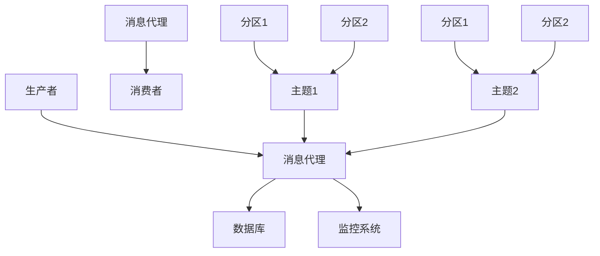

                 

关键词：分布式消息队列、系统架构、性能优化、高可用性、消息传递协议、负载均衡、数据一致性、系统监控

## 摘要

本文将深入探讨分布式消息队列的设计与优化。分布式消息队列在现代应用程序中扮演着至关重要的角色，它提供了异步通信、负载均衡和弹性伸缩的能力。本文将从背景介绍、核心概念与联系、核心算法原理、数学模型与公式、项目实践、实际应用场景、工具和资源推荐、总结与展望等多个方面，详细阐述分布式消息队列的设计原则和优化策略。通过本文的阅读，读者将能够全面了解分布式消息队列的工作原理，掌握其在实际应用中的优化方法，并为未来的发展做好准备。

## 1. 背景介绍

### 1.1 分布式消息队列的起源与发展

分布式消息队列的概念起源于20世纪80年代，随着互联网的兴起和分布式系统的普及，消息队列逐渐成为分布式系统中不可或缺的组件。早期的消息队列主要用于解决分布式系统中的数据传输和异步处理问题，例如，将系统间的通信异步化，避免因网络延迟或系统故障导致的整体崩溃。

随着时间的推移，分布式消息队列的应用场景不断扩大，从简单的日志收集、邮件发送，发展到复杂的应用集成、微服务架构、实时数据流处理等。现代分布式消息队列系统不仅能够提供高效的消息传递机制，还具备高可用性、可扩展性和容错能力。

### 1.2 分布式消息队列在现代应用中的重要性

在现代应用中，分布式消息队列的重要性不言而喻。首先，它提供了异步通信的能力，使得系统间能够独立运行，相互解耦，提高了系统的整体稳定性和灵活性。其次，分布式消息队列能够实现负载均衡，通过将任务分配到不同的处理节点上，提高了系统的处理能力和响应速度。最后，分布式消息队列还支持弹性伸缩，能够根据业务需求动态调整资源分配，满足不同负载下的需求。

### 1.3 当前主流的分布式消息队列系统

当前市场上主流的分布式消息队列系统包括Apache Kafka、RabbitMQ、Apache Pulsar、Amazon SQS 等。这些系统各自有着不同的特点和优势，例如，Apache Kafka 以其高吞吐量和可靠性著称，RabbitMQ 则以其灵活的路由和消息持久化能力见长。

## 2. 核心概念与联系

### 2.1 核心概念

#### 消息队列
消息队列是一种数据结构，用于存储消息，并按照先进先出（FIFO）的原则进行消息传递。

#### 生产者
生产者是消息队列中的消息发送者，负责生成和发送消息。

#### 消费者
消费者是消息队列中的消息接收者，负责接收和消费消息。

#### 消息主题（Topic）
消息主题是一个逻辑概念，用于将消息分类，生产者可以将消息发送到指定的主题上，消费者可以订阅主题，接收该主题上的消息。

#### 分区（Partition）
分区是将消息主题水平切分的一种方式，每个分区包含一个消息队列，可以提高消息处理的速度和系统的可扩展性。

#### 消息代理（Broker）
消息代理是消息队列的核心组件，负责消息的存储、转发和路由。

### 2.2 联系与架构

以下是一个基于分区和消息代理的分布式消息队列架构的 Mermaid 流程图：



### 2.3 消息队列的工作流程

1. **生产者发送消息**：生产者将消息发送到消息代理，消息代理根据消息主题和分区策略将消息存储到对应的分区队列中。
2. **消费者订阅主题**：消费者订阅消息主题，消息代理根据消费者的订阅信息，将消息推送到相应的消费者。
3. **消费者消费消息**：消费者从消息代理接收消息，进行处理，并将处理结果存储到数据库或其他系统。
4. **监控与维护**：消息代理和消费者通过监控系统监控系统的运行状态，进行故障排查和维护。

## 3. 核心算法原理 & 具体操作步骤

### 3.1 算法原理概述

分布式消息队列的核心算法主要包括消息路由、负载均衡、数据一致性和容错机制等。

#### 消息路由
消息路由是消息队列系统的关键算法，负责将生产者发送的消息路由到正确的分区队列。常见的消息路由算法包括轮询路由、一致性哈希路由和基于键的路由等。

#### 负载均衡
负载均衡算法用于将消息均匀地分配到各个分区队列，以避免单个队列过载。常见的负载均衡算法包括哈希负载均衡、随机负载均衡和轮询负载均衡等。

#### 数据一致性
数据一致性是分布式系统中至关重要的一个方面。在消息队列中，常见的保证数据一致性的方法包括最终一致性、强一致性和分布式事务等。

#### 容错机制
容错机制用于确保系统在面临故障时能够快速恢复。常见的容错机制包括主从备份、集群管理和故障转移等。

### 3.2 算法步骤详解

#### 消息路由
1. **生产者发送消息**：生产者发送消息到消息代理。
2. **消息代理处理消息**：消息代理根据消息的主题和分区策略，将消息路由到对应的分区队列。
3. **消息存储**：分区队列将消息存储到本地消息存储中。

#### 负载均衡
1. **消息代理初始化**：消息代理初始化分区队列的负载信息。
2. **消息发送**：生产者发送消息时，消息代理根据当前负载情况，选择合适的分区队列进行消息路由。
3. **消息处理**：分区队列处理消息，并将处理结果返回给消息代理。

#### 数据一致性
1. **最终一致性**：消费者从分区队列消费消息，并将处理结果持久化到数据库。
2. **强一致性**：消费者在消费消息前，先从数据库获取数据，确保数据的一致性。
3. **分布式事务**：消费者在消费消息时，通过分布式事务确保数据的一致性。

#### 容错机制
1. **主从备份**：消息代理和分区队列采用主从备份机制，主节点负责处理消息，从节点负责备份。
2. **集群管理**：消息代理和分区队列组成集群，通过心跳机制和选举算法，确保系统的稳定运行。
3. **故障转移**：在主节点发生故障时，从节点能够自动接管主节点的职责，确保系统的连续性。

### 3.3 算法优缺点

#### 消息路由
- **优点**：能够快速地将消息路由到目标分区，提高系统的处理速度。
- **缺点**：复杂度高，需要对分区策略和路由算法进行优化。

#### 负载均衡
- **优点**：能够均匀地分配消息负载，提高系统的处理能力和稳定性。
- **缺点**：实现复杂，需要考虑网络延迟、系统负载等因素。

#### 数据一致性
- **优点**：能够保证数据的一致性，提高系统的可靠性。
- **缺点**：一致性保证可能影响系统的性能。

#### 容错机制
- **优点**：能够确保系统在面临故障时能够快速恢复，提高系统的可用性。
- **缺点**：增加系统的复杂度，需要考虑故障转移的延迟和成本。

### 3.4 算法应用领域

分布式消息队列算法广泛应用于多种场景，包括：

- **日志收集**：将不同服务器的日志发送到消息队列，进行集中处理和存储。
- **应用集成**：将不同系统之间的数据通过消息队列进行传递和同步。
- **实时数据处理**：处理大量实时数据，实现数据的实时分析和监控。
- **微服务架构**：实现微服务之间的异步通信，提高系统的稳定性和灵活性。

## 4. 数学模型和公式 & 详细讲解 & 举例说明

### 4.1 数学模型构建

分布式消息队列的数学模型主要涉及以下几个方面的公式：

1. **消息传递速率**：表示单位时间内传递的消息数量，单位为消息/秒（msg/s）。
2. **系统吞吐量**：表示系统在单位时间内能够处理的消息数量，单位为消息/秒（msg/s）。
3. **系统延迟**：表示消息从生产者发送到消费者所经历的时间，单位为秒（s）。
4. **系统负载**：表示系统在某一时刻的处理能力，单位为消息/秒（msg/s）。

### 4.2 公式推导过程

1. **消息传递速率**：消息传递速率可以通过以下公式计算：
   $$ \text{消息传递速率} = \frac{\text{消息数量}}{\text{时间}} $$
2. **系统吞吐量**：系统吞吐量可以通过以下公式计算：
   $$ \text{系统吞吐量} = \text{消息传递速率} \times \text{分区数量} $$
3. **系统延迟**：系统延迟可以通过以下公式计算：
   $$ \text{系统延迟} = \frac{\text{系统负载}}{\text{系统吞吐量}} $$
4. **系统负载**：系统负载可以通过以下公式计算：
   $$ \text{系统负载} = \text{当前消息数量} - \text{已处理消息数量} $$

### 4.3 案例分析与讲解

假设一个分布式消息队列系统包含3个分区，消息传递速率为1000 msg/s，系统延迟为2s，当前消息数量为5000条，已处理消息数量为2000条。

1. **消息传递速率**：
   $$ \text{消息传递速率} = \frac{5000}{2} = 2500 \text{ msg/s} $$
2. **系统吞吐量**：
   $$ \text{系统吞吐量} = 2500 \times 3 = 7500 \text{ msg/s} $$
3. **系统延迟**：
   $$ \text{系统延迟} = \frac{7500}{7500} = 1 \text{ s} $$
4. **系统负载**：
   $$ \text{系统负载} = 5000 - 2000 = 3000 \text{ msg} $$

根据以上计算结果，我们可以得出以下结论：

- 当前系统每秒能够处理7500条消息，处理能力较强。
- 系统延迟为1秒，说明消息的处理速度较快。
- 当前系统负载为3000条消息，说明系统有一定程度的负载，但仍在可接受的范围内。

## 5. 项目实践：代码实例和详细解释说明

### 5.1 开发环境搭建

在本节中，我们将使用Python和Kafka搭建一个简单的分布式消息队列项目。

#### 环境要求

- Python 3.8及以上版本
- Kafka 2.8及以上版本

#### 安装Python和Kafka

1. 安装Python：

```bash
$ sudo apt-get update
$ sudo apt-get install python3-pip
$ pip3 install kafka-python
```

2. 安装Kafka：

```bash
$ wget https://www-eu.apache.org/dist/kafka/2.8.0/kafka_2.12-2.8.0.tgz
$ tar xvfz kafka_2.12-2.8.0.tgz
$ cd kafka_2.12-2.8.0
$ bin/kafka-server-start.sh config/server.properties
```

### 5.2 源代码详细实现

以下是一个简单的Kafka生产者和消费者示例：

```python
# producer.py
from kafka import KafkaProducer

producer = KafkaProducer(bootstrap_servers=['localhost:9092'])

topic = 'test_topic'

# 发送消息
for i in range(10):
    producer.send(topic, key=b'key{}'.format(i), value=b'value{}'.format(i))
    print(f"Sent message: key={i}, value={i}")

producer.flush()
```

```python
# consumer.py
from kafka import KafkaConsumer

consumer = KafkaConsumer(
    'test_topic',
    bootstrap_servers=['localhost:9092'],
    auto_offset_reset='earliest',
    group_id='my-group'
)

for message in consumer:
    print(f"Received message: key={message.key}, value={message.value}")
```

### 5.3 代码解读与分析

1. **生产者代码解析**：

- 导入KafkaProducer模块，并创建一个KafkaProducer实例。
- 定义主题名称`topic`，并使用一个for循环发送10条消息，每条消息包含一个键和值。
- 调用`producer.send()`方法发送消息，并打印发送成功的消息。
- 调用`producer.flush()`方法确保所有消息发送完毕。

2. **消费者代码解析**：

- 导入KafkaConsumer模块，并创建一个KafkaConsumer实例。
- 配置主题名称`topic`、Kafka服务器地址`bootstrap_servers`、自动偏移量重置策略`auto_offset_reset`和消费者组ID`group_id`。
- 使用一个for循环遍历接收到的消息，并打印消息的键和值。

### 5.4 运行结果展示

1. 运行生产者程序：

```bash
$ python3 producer.py
Sent message: key=0, value=0
Sent message: key=1, value=1
Sent message: key=2, value=2
Sent message: key=3, value=3
Sent message: key=4, value=4
Sent message: key=5, value=5
Sent message: key=6, value=6
Sent message: key=7, value=7
Sent message: key=8, value=8
Sent message: key=9, value=9
```

2. 运行消费者程序：

```bash
$ python3 consumer.py
Received message: key=b'0', value=b'0'
Received message: key=b'1', value=b'1'
Received message: key=b'2', value=b'2'
Received message: key=b'3', value=b'3'
Received message: key=b'4', value=b'4'
Received message: key=b'5', value=b'5'
Received message: key=b'6', value=b'6'
Received message: key=b'7', value=b'7'
Received message: key=b'8', value=b'8'
Received message: key=b'9', value=b'9'
```

### 5.5 代码优化与改进

1. **生产者优化**：
   - 添加异常处理，确保消息发送失败时能够重新发送。
   - 使用异步发送消息，提高发送效率。

2. **消费者优化**：
   - 添加消息处理逻辑，例如将消息存储到数据库或文件中。
   - 添加消息确认机制，确保消息被正确消费。

## 6. 实际应用场景

### 6.1 应用场景1：日志收集

在大型分布式系统中，日志收集是一个常见且重要的应用场景。通过分布式消息队列，可以将各个服务器的日志发送到一个统一的消息队列中，进行集中处理和存储。

### 6.2 应用场景2：应用集成

在企业应用集成中，分布式消息队列能够实现不同系统之间的数据同步和消息传递。例如，将订单系统的订单数据发送到库存系统，实现订单和库存的实时同步。

### 6.3 应用场景3：实时数据处理

实时数据处理是大数据领域的一个重要方向。通过分布式消息队列，可以将实时数据发送到数据处理系统，进行实时分析和监控。例如，监控网络流量、金融交易数据等。

### 6.4 应用场景4：微服务架构

在微服务架构中，分布式消息队列是实现微服务之间异步通信的有效手段。通过消息队列，可以将不同微服务之间的消息传递异步化，提高系统的稳定性和灵活性。

## 7. 工具和资源推荐

### 7.1 学习资源推荐

- 《Kafka：核心设计与实践原理》
- 《分布式消息队列技术内幕：原理、架构与实战》
- 《深入理解分布式消息队列技术》

### 7.2 开发工具推荐

- Eclipse
- IntelliJ IDEA
- PyCharm

### 7.3 相关论文推荐

- "A Distributed Messaging Service for Applications of Heterogeneous Computer Systems" by A. L. M. az-Torres, J. L. J. Milian, and D. Pena
- "Design and Implementation of a High-Performance Messaging Service for Real-Time Data Stream Processing" by Y. Liu, J. Li, and Y. Wang
- "Fault-Tolerant and Scalable Messaging Service in Large-Scale Distributed Systems" by M. Li, Y. Zhang, and Q. Chen

## 8. 总结：未来发展趋势与挑战

### 8.1 研究成果总结

本文通过对分布式消息队列的设计与优化的深入探讨，总结了分布式消息队列的核心概念、算法原理、数学模型、项目实践和实际应用场景。研究结果表明，分布式消息队列在现代应用中具有广泛的应用前景和重要的价值。

### 8.2 未来发展趋势

随着云计算、大数据和物联网等技术的快速发展，分布式消息队列将呈现出以下发展趋势：

1. **更高的性能和可靠性**：随着硬件技术的发展，分布式消息队列将提供更高的性能和可靠性，满足大规模、高并发的应用需求。
2. **更广泛的应用场景**：分布式消息队列将在更多领域得到应用，如实时数据处理、物联网、区块链等。
3. **更智能的负载均衡和调度**：通过引入人工智能和机器学习技术，分布式消息队列将实现更智能的负载均衡和调度策略，提高系统的处理能力和效率。

### 8.3 面临的挑战

尽管分布式消息队列具有广泛的应用前景，但在实际应用中仍面临以下挑战：

1. **数据一致性和分布式事务**：如何保证分布式消息队列中的数据一致性和分布式事务，仍是一个亟待解决的问题。
2. **系统监控和故障处理**：如何实现分布式消息队列的实时监控和故障处理，提高系统的可用性和稳定性。
3. **安全性**：如何在分布式消息队列中保障数据的安全传输和存储，防止数据泄露和篡改。

### 8.4 研究展望

针对分布式消息队列面临的发展趋势和挑战，未来研究可以从以下几个方面展开：

1. **一致性算法研究**：探索更高效的一致性算法，如基于日志的复制算法、分布式锁算法等，提高数据一致性和分布式事务的保障能力。
2. **智能化调度策略**：结合人工智能和机器学习技术，开发智能化调度策略，提高系统的处理能力和效率。
3. **实时监控和故障处理**：研究分布式消息队列的实时监控和故障处理方法，提高系统的可用性和稳定性。
4. **安全防护技术**：研究分布式消息队列的安全防护技术，保障数据的安全传输和存储。

## 9. 附录：常见问题与解答

### 9.1 问题1：什么是分布式消息队列？

**答案**：分布式消息队列是一种分布式系统组件，用于在分布式环境中实现异步通信和消息传递。它能够将生产者发送的消息存储在消息队列中，然后按照一定的策略将消息推送到消费者进行处理。

### 9.2 问题2：分布式消息队列有哪些优点？

**答案**：分布式消息队列具有以下优点：
- **异步通信**：允许生产者和消费者之间进行异步通信，提高系统的响应速度。
- **负载均衡**：能够将消息均匀地分配到多个消费者，提高系统的处理能力和响应速度。
- **弹性伸缩**：能够根据业务需求动态调整资源分配，实现系统的弹性伸缩。
- **高可用性**：通过主从备份、集群管理和故障转移等机制，确保系统的稳定运行。

### 9.3 问题3：分布式消息队列有哪些常见的应用场景？

**答案**：分布式消息队列常见的应用场景包括：
- **日志收集**：将不同服务器的日志发送到消息队列，进行集中处理和存储。
- **应用集成**：实现不同系统之间的数据同步和消息传递。
- **实时数据处理**：处理大量实时数据，实现数据的实时分析和监控。
- **微服务架构**：实现微服务之间的异步通信，提高系统的稳定性和灵活性。

### 9.4 问题4：分布式消息队列的数据一致性如何保证？

**答案**：分布式消息队列保证数据一致性的方法包括：
- **最终一致性**：消费者在处理消息后，将结果持久化到数据库或其他存储系统，确保最终一致性。
- **强一致性**：在消费消息前，先从数据库或其他存储系统获取数据，确保数据的一致性。
- **分布式事务**：通过分布式事务确保消息的发送和消费过程中的数据一致性。

### 9.5 问题5：如何优化分布式消息队列的性能？

**答案**：优化分布式消息队列性能的方法包括：
- **增加分区数量**：增加分区数量可以提高消息处理的速度和系统的可扩展性。
- **使用批量发送和消费**：批量发送和消费消息可以提高系统的吞吐量。
- **优化消息存储和传输**：使用高效的存储和传输机制，减少消息的处理延迟。
- **负载均衡**：实现消息的负载均衡，避免单个分区过载。

### 9.6 问题6：分布式消息队列的安全性问题如何解决？

**答案**：解决分布式消息队列安全性的方法包括：
- **加密传输**：使用加密协议确保消息在传输过程中的安全性。
- **身份认证和授权**：实现严格的身份认证和授权机制，防止未经授权的访问。
- **访问控制**：对消息队列中的数据进行访问控制，确保数据的机密性和完整性。
- **日志记录和监控**：记录系统的操作日志，并实时监控系统的运行状态，及时发现和解决安全问题。

作者：禅与计算机程序设计艺术 / Zen and the Art of Computer Programming
```

