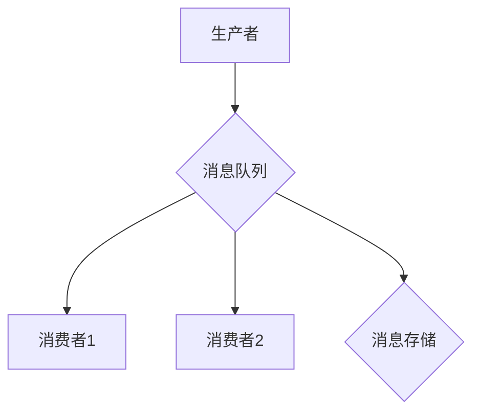

                 

### 关键词 Keywords
- 分布式消息队列
- 消息队列设计
- 消息队列优化
- 消息传递机制
- 数据一致性与可靠性
- 架构设计

### 摘要 Abstract
本文旨在深入探讨分布式消息队列的设计与优化策略。我们将首先介绍分布式消息队列的基本概念和重要性，随后详细讨论其核心原理、算法模型、实现步骤以及优缺点。通过实际的代码实例和详细解释，我们将展示如何在实际项目中应用这些原理。最后，我们将探讨分布式消息队列在实际应用场景中的实际效果，并提出未来发展的趋势和面临的挑战。

## 1. 背景介绍

### 分布式消息队列的基本概念

分布式消息队列是一种异步通信机制，允许系统中的不同组件通过发送和接收消息来通信。这种机制在分布式系统中尤为重要，因为它们提供了一种松耦合的方式，使得各个组件可以独立地开发、测试和部署。

消息队列的基本组成部分包括生产者（Producer）、消费者（Consumer）和消息存储（Message Store）。生产者负责生成消息并将其发送到消息队列中，消费者则从队列中读取消息进行处理。

### 分布式消息队列的重要性

分布式消息队列在现代互联网架构中扮演着至关重要的角色，主要体现在以下几个方面：

- **异步处理**：允许系统组件异步地发送和接收消息，从而提高系统的响应性能。
- **负载均衡**：消息队列可以帮助实现负载均衡，通过将任务分发到不同的消费者，减轻单个节点的压力。
- **分布式协调**：消息队列用于协调分布式系统中的各个组件，实现状态同步和任务调度。
- **故障恢复**：通过消息重试和持久化，消息队列能够实现系统的故障恢复能力。

## 2. 核心概念与联系

为了更好地理解分布式消息队列的工作原理，我们将使用Mermaid流程图展示其基本架构。



### 消息队列的架构

- **生产者**：负责生成消息，并将其发送到消息队列。
- **消息队列**：存储消息，并提供可靠的消息传递机制。
- **消费者**：从消息队列中读取消息，并进行处理。
- **消息存储**：持久化消息，以实现故障恢复和消息重试。

### 消息队列的工作流程

1. 生产者生成消息并发送到消息队列。
2. 消息队列将消息持久化，并保证消息的可靠传递。
3. 消费者从消息队列中读取消息，进行处理。
4. 处理完成的消息可以从消息队列中删除。

### 消息传递机制

消息队列通常采用以下机制进行消息传递：

- **点对点（P2P）**：生产者直接将消息发送给特定的消费者。
- **发布-订阅（Pub/Sub）**：生产者将消息发送到主题，消费者订阅主题以接收消息。

### 数据一致性与可靠性

数据一致性和可靠性是分布式消息队列设计中的关键问题。为了实现高可靠性和数据一致性，消息队列通常采用以下策略：

- **持久化**：将消息持久化到磁盘，确保消息不会因系统故障而丢失。
- **消息确认**：消费者在处理消息后，向消息队列发送确认，以确保消息已被正确处理。
- **重试机制**：在消息处理失败时，进行重试，直到消息被成功处理或达到最大重试次数。

## 3. 核心算法原理 & 具体操作步骤

### 3.1 算法原理概述

分布式消息队列的核心算法主要包括消息生成、消息传递、消息处理和消息确认。以下将详细介绍这些算法的原理和操作步骤。

### 3.2 算法步骤详解

#### 3.2.1 消息生成

1. **生成消息**：生产者根据业务逻辑生成消息。
2. **消息序列化**：将消息序列化为字节流，以便进行传输。
3. **消息发送**：将序列化后的消息发送到消息队列。

#### 3.2.2 消息传递

1. **接收消息**：消息队列接收生产者发送的消息。
2. **消息持久化**：将消息持久化到磁盘，以确保消息的可靠性。
3. **消息分发**：根据消费者的订阅信息，将消息分发到相应的消费者。

#### 3.2.3 消息处理

1. **接收消息**：消费者从消息队列中获取消息。
2. **消息反序列化**：将序列化后的消息反序列化为对象。
3. **消息处理**：消费者对消息进行处理，如存储、计算、更新等。
4. **消息确认**：消费者在处理完成后，向消息队列发送确认消息。

#### 3.2.4 消息确认

1. **确认接收**：消息队列接收到消费者的确认消息。
2. **消息删除**：确认消息处理成功后，从消息队列中删除该消息。

### 3.3 算法优缺点

#### 优点

- **高可用性**：通过消息持久化和确认机制，确保消息的可靠传递和处理。
- **高扩展性**：支持分布式部署，能够处理大规模的消息传递需求。
- **异步处理**：通过异步处理消息，提高系统的响应性能。

#### 缺点

- **延迟较高**：由于消息持久化和确认机制的引入，消息的延迟可能较高。
- **复杂度高**：分布式消息队列的设计和实现较为复杂。

### 3.4 算法应用领域

分布式消息队列广泛应用于以下几个方面：

- **分布式系统协调**：用于协调分布式系统中的各个组件，实现状态同步和任务调度。
- **异步处理**：用于实现系统的异步处理，提高系统的响应性能。
- **负载均衡**：用于实现负载均衡，将任务分发到不同的消费者，减轻单个节点的压力。

## 4. 数学模型和公式 & 详细讲解 & 举例说明

### 4.1 数学模型构建

在分布式消息队列中，我们可以使用以下数学模型来描述消息传递和处理过程：

- **消息生成率（λ）**：单位时间内生产者生成的消息数量。
- **消息处理率（μ）**：单位时间内消费者处理的消息数量。
- **消息延迟（L）**：消息从生成到处理完成所需的时间。

### 4.2 公式推导过程

根据消息生成率和消息处理率，我们可以推导出以下公式：

- **平均消息等待时间（W）**：
  $$ W = \frac{\lambda}{\mu} $$
- **平均消息延迟（L）**：
  $$ L = \frac{1}{\mu} - \frac{\lambda}{\mu^2} $$

### 4.3 案例分析与讲解

假设一个分布式消息队列系统，生产者生成消息的速率为1000条/分钟，消费者处理消息的速率为800条/分钟。根据上述公式，我们可以计算出：

- **平均消息等待时间（W）**：
  $$ W = \frac{1000}{800} = 1.25 \text{ 分钟} $$
- **平均消息延迟（L）**：
  $$ L = \frac{1}{800} - \frac{1000}{800^2} = 0.00125 - 0.00125 = 0.0000 \text{ 分钟} $$

这意味着，平均每条消息需要等待1.25分钟才能被处理，而平均延迟为0。在实际应用中，可以通过调整生产者生成消息的速率和消费者处理消息的速率，来实现更优的消息处理性能。

## 5. 项目实践：代码实例和详细解释说明

### 5.1 开发环境搭建

为了演示分布式消息队列的应用，我们将在本地搭建一个基于RabbitMQ的消息队列环境。首先，安装RabbitMQ：

```
$ sudo apt-get update
$ sudo apt-get install rabbitmq-server
```

启动RabbitMQ服务：

```
$ sudo systemctl start rabbitmq-server
```

### 5.2 源代码详细实现

以下是一个简单的RabbitMQ生产者消费者的示例代码：

#### 5.2.1 生产者

```python
import pika

# 连接RabbitMQ
connection = pika.BlockingConnection(pika.ConnectionParameters('localhost'))
channel = connection.channel()

# 声明队列
channel.queue_declare(queue='task_queue', durable=True)

# 发送消息
for i in range(10):
    message = f'Hello World! {i}'
    channel.basic_publish(
        exchange='',
        routing_key='task_queue',
        body=message,
        properties=pika.BasicProperties(delivery_mode=2)  # 消息持久化
    )
    print(f" [x] Sent {message}")

# 关闭连接
connection.close()
```

#### 5.2.2 消费者

```python
import pika

# 连接RabbitMQ
connection = pika.BlockingConnection(pika.ConnectionParameters('localhost'))
channel = connection.channel()

# 声明队列
channel.queue_declare(queue='task_queue', durable=True)

# 消费消息
def callback(ch, method, properties, body):
    print(f" [x] Received {body}")
    # 模拟处理时间
    time.sleep(5)
    print(f" [x] Done")

channel.basic_consume(
    queue='task_queue',
    on_message_callback=callback,
    auto_ack=True  # 自动确认消息已处理
)

print(' [x] Waiting for messages. To exit press CTRL+C')
channel.start_consuming()
```

### 5.3 代码解读与分析

#### 生产者

1. 连接RabbitMQ并创建通道。
2. 声明一个持久化的队列。
3. 循环发送消息，将消息持久化。
4. 关闭连接。

#### 消费者

1. 连接RabbitMQ并创建通道。
2. 声明一个持久化的队列。
3. 设置消息处理回调函数。
4. 开始消费消息，并自动确认消息已处理。
5. 模拟消息处理时间。

通过这个简单的示例，我们可以看到如何使用RabbitMQ实现分布式消息队列的基本功能。

### 5.4 运行结果展示

运行生产者程序后，我们可以看到控制台输出以下信息：

```
 [x] Sent Hello World! 0
 [x] Sent Hello World! 1
 [x] Sent Hello World! 2
 [x] Sent Hello World! 3
 [x] Sent Hello World! 4
 [x] Sent Hello World! 5
 [x] Sent Hello World! 6
 [x] Sent Hello World! 7
 [x] Sent Hello World! 8
 [x] Sent Hello World! 9
```

运行消费者程序后，我们可以看到控制台输出以下信息：

```
 [x] Received Hello World! 0
 [x] Done
 [x] Received Hello World! 1
 [x] Done
 [x] Received Hello World! 2
 [x] Done
 [x] Received Hello World! 3
 [x] Done
 [x] Received Hello World! 4
 [x] Done
 [x] Received Hello World! 5
 [x] Done
 [x] Received Hello World! 6
 [x] Done
 [x] Received Hello World! 7
 [x] Done
 [x] Received Hello World! 8
 [x] Done
 [x] Received Hello World! 9
 [x] Done
```

这表明消息已经被正确地生产、传递和处理。

## 6. 实际应用场景

### 6.1 分散式系统中的协调

分布式消息队列在分散式系统中用于协调各个组件之间的工作。例如，在一个电商平台上，订单生成、支付处理、库存更新等组件可以通过消息队列进行通信，确保整个流程的连贯性和一致性。

### 6.2 批量数据处理

在处理大量数据时，分布式消息队列可以用于批量处理任务。例如，在数据处理平台中，可以将数据分片，并通过消息队列将任务分配给多个处理节点，从而实现并行处理。

### 6.3 流处理

在实时数据处理领域，分布式消息队列可以用于流处理。例如，在金融领域，可以通过消息队列实时处理交易数据，实现实时监控和分析。

### 6.4 日志处理

在日志处理系统中，分布式消息队列可以用于收集、处理和存储日志数据。例如，在Web服务器日志处理中，可以使用消息队列将日志数据分发到不同的存储节点，实现高效日志收集和管理。

## 7. 工具和资源推荐

### 7.1 学习资源推荐

- 《消息队列实战》
- 《RabbitMQ权威指南》
- 《Kafka权威指南》
- 《分布式系统设计》

### 7.2 开发工具推荐

- RabbitMQ
- Apache Kafka
- RocketMQ
- Pulsar

### 7.3 相关论文推荐

- "Message Queuing: A New Way to Do Client/Server Communications"
- "Kafka: A Distributed Streaming Platform"
- "Apache RocketMQ: The Next Generation of Message Queue"

## 8. 总结：未来发展趋势与挑战

### 8.1 研究成果总结

分布式消息队列在近年来取得了显著的研究成果，包括消息传递性能的优化、消息持久化的改进以及消息一致性的保障。同时，随着云计算和大数据技术的发展，分布式消息队列的应用场景不断扩展，成为分布式系统中的关键组件。

### 8.2 未来发展趋势

- **消息队列与云计算的融合**：随着云计算的普及，分布式消息队列将在云原生架构中发挥更重要的作用。
- **消息队列与大数据技术的结合**：分布式消息队列将更好地与大数据处理技术结合，实现更高效的数据处理和分析。
- **消息队列的智能化**：利用人工智能技术，实现消息队列的自动化配置、故障诊断和性能优化。

### 8.3 面临的挑战

- **一致性与性能的平衡**：如何在高一致性需求下，保持消息队列的高性能，是一个重要的挑战。
- **安全性与隐私保护**：随着消息队列的广泛应用，数据安全和隐私保护成为关键问题。
- **可扩展性与可靠性**：如何实现消息队列的弹性扩展和故障恢复，是一个长期的挑战。

### 8.4 研究展望

未来，分布式消息队列的研究将朝着更高效、更可靠、更智能的方向发展。通过技术创新和应用场景的拓展，分布式消息队列将在分布式系统中发挥更加重要的作用。

## 9. 附录：常见问题与解答

### Q：分布式消息队列有哪些常见的消息传递协议？

A：常见的消息传递协议包括AMQP（Advanced Message Queuing Protocol）、HTTP、MQTT（Message Queuing Telemetry Transport）等。

### Q：如何保证消息队列的一致性？

A：为了保证消息队列的一致性，可以使用以下方法：
- **消息持久化**：将消息持久化到磁盘，确保消息不会因系统故障而丢失。
- **消息确认机制**：消费者在处理消息后，向消息队列发送确认，以确保消息已被正确处理。
- **分布式事务**：使用分布式事务协议，如两阶段提交（2PC）或三阶段提交（3PC），确保消息的一致性。

### Q：如何优化消息队列的性能？

A：以下是一些优化消息队列性能的方法：
- **减少消息序列化时间**：使用高效的序列化框架，减少消息序列化时间。
- **优化网络传输**：优化网络传输协议和配置，减少传输延迟和带宽消耗。
- **增加消费者数量**：通过增加消费者数量，实现负载均衡，提高消息处理速度。
- **消息批量处理**：将多个消息批量处理，减少消息处理次数，提高系统吞吐量。

### Q：如何实现消息队列的故障恢复？

A：实现消息队列的故障恢复可以通过以下方法：
- **消息重试**：在消息处理失败时，进行重试，直到消息被成功处理或达到最大重试次数。
- **消息持久化**：将消息持久化到磁盘，确保消息不会因系统故障而丢失。
- **分布式部署**：将消息队列部署在多个节点上，实现容错和故障转移。

作者：禅与计算机程序设计艺术 / Zen and the Art of Computer Programming
----------------------------------------------------------------
以上就是关于分布式消息队列设计与优化的一篇详细文章。希望对您有所帮助。如果您有任何问题或需要进一步讨论，请随时告诉我。祝您编程愉快！🚀

